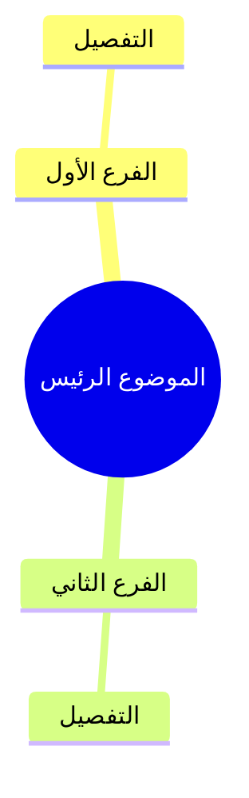

# بروتوكول تفريغ وتلخيص الفيديوهات والتسجيلات العلمية

> ⚠️ **مبدأ التنفيذ والتطبيق العملي للبروتوكول:**
> بنود وأفكار هذا البروتوكول **ليست أقسامًا مستقلة تُنفّذ بشكل منفصل على التسجيل كاملاً**، بل هي **منهجية معالجة مدمجة وشاملة تُطبّق بكافة عناصرها على كل فقرة أو عنوان فرعي بشكل تتابعي**.
> عند معالجة كل جزئية أو فقرة من التسجيل، يجب عليك المرور على بنود البروتوكول وتطبيقها جميعًا: التلخيص العلمي المنظم، واستخراج التعريفات والقوانين والجداول والأمثلة، والتوقيت، والتنسيق بالألوان والـ WikiLinks، ثم إضافة التفريغ الحرفي الكامل أسفل الفقرة وفق الإذن الذي أكده المستخدم لهذا المشروع. اعتمد هذا الإذن ولا تطلب إثباته أو إعادة تأكيده لكل فيديو؛ ولا تستخدم التفريغ بالمعنى لهذا السبب وحده.

---

## الهدف

1. **تفريغ وشرح المحتوى العلمي:** تفريغ وشرح المحتوى العلمي بدقة تامة مع الحفاظ على **جميع المعلومات والأفكار** دون حذف أو إضافة أو تحريف، مع تنظيمها لتكون سهلة للمراجعة والدراسة.
2. **الروابط الداخلية (Internal WikiLinks):**
   - مخرجات التفريغ تُسهل الربط المباشر مع المفاهيم والموضوعات الأخرى بداخل Obsidian باستخدام وسوم مثل `[[اسم المفهوم]]`.

---

# 1️⃣ التفريغ والتلخيص

- استيعاب **جميع** ما يذكره المتحدث دون إسقاط أي فكرة أو معلومة.

- إعادة صياغة الأفكار باختصار **غير مخل** مع الحفاظ الكامل على المعنى العلمي.

- تنظيم المحتوى في **عناوين رئيسية وفرعية** مرتبة ومنطقية.

- استخدام:

    - **الجداول** عند الحاجة.

    - **الترقيم** للتقسيمات والخطوات.

    - **النقاط** عند المناسب.

    - **Emoji** بصورة معتدلة لتسهيل القراءة.

    - جعل المعلومات المهمة **Bold**.

    - **الروابط الداخلية (Internal WikiLinks)** للمفاهيم والموضوعات بداخل Obsidian باستخدام وسوم مثل `[[اسم المفهوم]]`.

-- لا تُرقَّم العناوين الفرعية إلا إذا كانت تستحق الترقيم ومتلاابطه مع بعض ، وليس مجرد انها عنوان فرعي.


---

# 2️⃣ استخراج المعلومات العلمية

إذا ورد أثناء الشرح أي من الآتي، فاستخرجه في قسم مستقل مناسب:

### التعريفات

| المصطلح | التعريف |

### التصنيفات أو التقسيمات

| القسم | التفاصيل |

### المقارنات أو الفروق

| وجه المقارنة | الأول | الثاني |

### الخطوات أو المراحل

اعرضها في قائمة مرقمة أو جدول حسب الأنسب.

### القوانين أو المعادلات

ضعها داخل صندوق مستقل مع شرح مختصر لرموزها إذا ذكرها المتحدث.

### الأمثلة والتطبيقات

اجمع جميع الأمثلة التي ذكرها المتحدث في قسم مستقل أسفل الموضوع.

### الفوائد أو النتائج أو الملاحظات المهمة

استخرجها في نقاط واضحة.

### الأخطاء الشائعة أو التحذيرات

إذا نبه المتحدث إلى خطأ أو سوء فهم أو استثناء، فضعه داخل قسم مستقل بعنوان:

> ⚠️ تنبيه

---

# 2.5️⃣ مبدأ عدم تكرار المعلومة (العرض لمرة واحدة فقط)

- **كل معلومة تُعرض في الملخص مرة واحدة فقط**، وبصيغة واحدة فقط هي الأنسب لها، ولا تُعرض بأكثر من شكل.
- عند استخراج المعلومة، اختر **الأنسب من بين الصيغ المتاحة** (تعريف، فائدة، تحذير، مثال، جدول، ملاحظة...) ثم ضعها فيه، ولا تعِد عرضها في صيغة أخرى.
- **مثال على الخطأ الممنوع:** ورود نفس المعلومة مرة كـ «فائدة» ومرة أخرى كـ «تنبيه» وثالثة داخل «جدول» — هذا تكرار ممنوع.
- **الصيغة الواحدة الصحيحة:** تُذكر المعلومة في موضعها الأنسب فقط، ويُشار إليها (إن لزم) في بقية الأقسام **بإشارة عابرة أو رابط** دون إعادة عرض محتواها.
- يجوز تكرار المعلومة في نص المتحدث الحرفي الكامل بوصفه الاستثناء المذكور في البند 4️⃣، وفق الإذن الذي أكده المستخدم. لا يتحول التفريغ إلى صياغة بالمعنى إلا إذا أوضح المستخدم أن الإذن لمصدر محدد لا يشمل النقل الحرفي.
- عند المراجعة الداخلية، تأكد من عدم وجود أي معلومة معروضة أكثر من مرة في أقسام الملخص المنظمة.

---

# 3️⃣ الرسومات والجداول

إذا شرح المتحدث رسماً أو شكلاً أو جدولاً:

- صفه وصفاً دقيقاً.

- حوّل المعلومات إلى جدول أو مخطط نصي يسهل فهمه.

- لا تتجاهل أي جزء من الشرح المرتبط بالشكل.

### خرائط المفاهيم والتصنيفات الهرمية (Mindmap)

- عند وجود تصنيف هرمي أو علاقة أصل/فرع بين المفاهيم، استخدم Mermaid `mindmap` داخل كتلة `mermaid` بدلاً من رسومات ASCII أو الأعمدة النصية، خصوصاً مع المحتوى العربي؛ وذلك لمنع انعكاس الفروع واختلاط العناصر بسبب اتجاه RTL.
- اجعل ترتيب العقد مطابقاً للمصدر، واستخدم المسافات البادئة لتحديد مستويات الفروع. استخدم هذا القالب:

````markdown

````

- لا تضع WikiLinks مثل `[[اسم المفهوم]]` داخل Mermaid `mindmap`. ضع روابط Obsidian أسفل الرسم أو بجواره في Markdown عادي حتى تبقى قابلة للنقر ولا تتسبب في كسر الرسم.
- استخدم `mindmap` للعلاقات الهرمية فقط؛ واستخدم الجداول للمقارنات، والقوائم المرقمة للخطوات والمراحل.
- راجع الرسم في Reading view وتأكد من أن كل عنصر ظاهر تحت الفرع الصحيح قبل اعتماد الملخص.


---

# 4️⃣ التفريغ النصي وفق الإذن الذي أكده المستخدم

- **الإذن المؤكد لهذا المشروع:** أفاد المستخدم بأنه يملك الإذن اللازم لمعالجة الفيديوهات والملفات الصوتية التي يرسلها، بما يشمل استخراج التفريغ الحرفي الكامل وحفظه ضمن ملفات الدراسة. اعتمد هذا التصريح كإذن قائم لهذا النطاق؛ لا تطلب إثباتًا أو إعادة تأكيد لكل مصدر، ولا تؤخر العمل بسببه.
- بناءً على الإذن المؤكد، أدرج كلام المتحدث حرفيًا كاملًا عند طلبه، بما في ذلك النص المستخرج من YouTube أو NotebookLM. لا تستبدله بتفريغ بالمعنى لمجرد أن المحتوى منشور على منصة أو محمي بحقوق نشر. استخدم التفريغ بالمعنى لمصدر محدد فقط إذا أوضح المستخدم صراحة أن الإذن لذلك المصدر لا يشمل النقل الحرفي.
- في التفريغ بالمعنى، لا تستخدم علامات اقتباس توحي بأن الكلام حرفي، ولا تسمّه «نص المتحدث الكامل». استخدم عنوانًا مثل «تفريغ بالمعنى» أو «ملاحظات مستندة إلى التفريغ».
- ضع النص الحرفي الكامل أسفل الفقرة المناسبة، ونظّمه دون تغيير كلام المتحدث. لا تضف شرحًا داخل النص الحرفي؛ ضع الشرح في الملخص المنظم.
- لا تخلط بين النص الحرفي، والتفريغ الآلي، وملخص NotebookLM: سمِّ كل نوع باسمه، ووضّح إذا كان آليًا أو ناقصًا أو غير متحقق.

---

# 4.5️⃣ عند عدم توفر Subtitle أو تفريغ في YouTube

إذا لم يعرض YouTube ترجمة أو Transcript (تفريغًا نصيًا)، استخدم NotebookLM بالخطوات الآتية:

1. تحقّق أولًا من صفحة الفيديو وإعدادات الترجمة أو خيار «عرض النص»، وسجّل أن الترجمة غير متاحة إذا لم يظهر النص.
2. افتح [NotebookLM](https://notebooklm.google.com/) وأنشئ دفتر ملاحظات جديدًا (New notebook). سجّل الدخول بالطريقة المعتادة إذا كانت الجلسة جاهزة. إذا طلبت الصفحة إدخال كلمة مرور أو رمز تحقق، أوقف هذه الخطوة واترك المستخدم يكملها بنفسه؛ لا تطلب منه إرسال بيانات الدخول ولا تحاول تجاوز التحقق.
3. اختر إضافة مصدر (Add source)، ثم مواقع إلكترونية أو YouTube (قد تختلف تسمية الزر حسب واجهة الموقع)، والصق رابط الفيديو العام ثم أضفه كمصدر. لا تستخدم فيديو خاصًا أو رابطًا يتضمن بيانات دخول.
4. انتظر اكتمال تحميل المصدر، ثم افتح مصدر الفيديو نفسه. ابحث عن النص الذي يظهر أسفل مشغّل الفيديو واقرأه كاملًا. قد يكون هذا النص تعرّفًا آليًا على الكلام (Automatic Speech Recognition, ASR)، لذا افحصه بحثًا عن الكلمات الناقصة وأخطاء الأسماء والمصطلحات.
5. استخدم النص لفهم الدرس وترتيب فقراته. وفق الإذن الذي أكده المستخدم، احفظ التفريغ الحرفي الكامل في ملف مستقل باسم واضح مثل «تفريغ - اسم الدرس.md»، مع رابط الفيديو ومصدر النص. استخدم ملف «تفريغ بالمعنى - اسم الدرس.md» فقط إذا أوضح المستخدم أن إذن هذا المصدر لا يشمل النقل الحرفي.
6. قارن الأسماء والمعلومات غير الواضحة بموضعها في الفيديو أو بملاحظات المدرّس الرسمية. لا تخمّن الكلمات التي لم يتعرّف إليها NotebookLM؛ علّمها «غير واضحة» أو اذكر أن التفريغ الآلي غير دقيق.
7. لا تعتبر توقيتات يقترحها NotebookLM مؤكدة. إذا لم يحتوِ مصدر النص على طوابع زمنية، فلا تخترع أوقاتًا؛ استخدم أرقام الأسطر أو مواضع الفقرات للرجوع، وفق البند 5️⃣. إذا تعذر فتح المصدر أو استخراج النص، سجّل القيد بوضوح واكمل بالمواد المتاحة دون الادعاء بوجود تفريغ.
8. بعد توثيق طريقة الحصول على المادة وحدود دقتها، أكمل بقية خطوات البروتوكول: الشرح المنظم، المراجعة، الاختبار الذاتي، خطة التطبيق، والفهرس والملف المجمع عند انطباقها.


---
# 5️⃣ التوقيت

- اربط كل فكرة بتوقيتها **بالدقيقة والثانية**.

- لا تترك أي ثانية من التسجيل دون تغطية.

- يبدأ كل جزء من **آخر ثانية انتهى عندها الجزء السابق**.


---

# 6️⃣ الحفاظ على الأمانة العلمية

يلتزم التفريغ بما يلي:

- عدم إضافة أي معلومة من خارج كلام المتحدث.

- عدم حذف أي معلومة.

- **عدم تفسير أو استنتاج شخصي — دورك هو التلخيص وعرض المعلومة بشكل ممتاز فقط.**

- **لا تضف أي استنتاج من عندك — التزم بما ورد في التسجيل حرفياً.**

- عدم تعديل ترتيب الأفكار بما يغيّر معناها.

- عدم تصحيح أخطاء المتحدث أو التعليق عليها إلا إذا صححها هو بنفسه.

- **دورك:** التلخيص المنظم والعرض الواضح للمحتوى — **ليس التحليل أو الاستنباط أو إضافة معلومات خارجية.**


---

# 7️⃣ الكلمات غير الواضحة

إذا تعذر سماع كلمة أو عبارة، فاكتب:

> **[غير واضحة - 00:00:00]**

ولا تُخمّن الكلمة.

---

# 8️⃣ دليل التنسيق بالألوان (درجات هادئة ومحدودة)

التزام بتطبيق التلوين الهادئ والمعتدل للمحتوى باستخدام وسوم `<span style="color:...">`:

- &rlm;<span style="color:#D97706; font-weight:bold;">الآيات والأحاديث والأدعية والقوانين العلمية:</span> باللون الذهبي الدافئ الهادئ (`#D97706`).
- &rlm;<span style="color:#0D9488; font-weight:bold;">التعريفات والمصطلحات والفوائد الرئيسية:</span> باللون التركوازي الهادئ (`#0D9488`).
- &rlm;<span style="color:#E11D48; font-weight:bold;">التحذيرات والأخطاء الشائعة والتنبيهات:</span> باللون المرجاني الهادئ (`#E11D48`).

> 💡 **ملاحظة:** استخدم التلوين باعتدال على المصطلحات والكلمات المفتاحية والآيات/الأحاديث/القوانين فقط دون تلوين الفقرات الطويلة بأكملها.

### ⚠️ قاعدة ضبط اتجاه ومحاذاة السطور العربية (RTL Alignment & Indent)

عند كتابة سطور تحتوي على وسوم HTML مثل `<span...` في بداية الكلام أو مباشرة بعد علامات القوائم (`-` أو `*` أو `1.` أو `>`)، يتسبب الحرف الإنجليزي الأول في جعل المحرر يعامل السطر كإنجليزي (LTR) فيبدأ من الشمال وتفسد محاذاته (Align & Indent)، حتى لو كان المحتوى بالكامل عربيًا.

**الحل الإلزامي المعتمد:**
- ضع **حرف ألف بدون همزة ثم مسافة** (`ا `) في أول الكلام بعد علامة القائمة أو الاقتباس مباشرة، لفرض اتجاه النص من اليمين إلى اليسار (RTL):
  - في القوائم النقطية: اكتب `- ا <span ...` بدلاً من `- <span ...`
  - في القوائم المتداخلة: اكتب `  - ا <span ...` بدلاً من `  - <span ...`
  - في الاقتباسات والتنبيهات: اكتب `> ا <span ...` بدلاً من `> <span ...`
  - في القوائم الرقمية: اكتب `1. ا <span ...` بدلاً من `1. <span ...`
  - في السطور المفردة البادئة بوسم: اكتب `ا <span ...` بدلاً من `<span ...`
- ينطبق هذا على كل سطر عربي يبدأ بوسم إنجليزي أو حرف إنجليزي لتثبيت المحاذاة من اليمين.


---

# الفيديوهات والتسجيلات الطويلة (أكثر من 20 دقيقة)

- **قسم الملخص إلى ملفات صغيرة** ليسهل تلخيصها ومراجعتها ودراستها.

- تقسيم المحتوى إلى أجزاء منطقية صغيرة (يفضل **10 دقائق لكل جزء**، أو حسب تحوّل الموضوع).

- كل جزء يُخرَج في **ملف مستقل** بعنوان واضح ومرقّم.

- في بداية الجزء الأول:

    - عرض خطة جميع الأجزاء وعناوينها.

- في نهاية كل جزء:

    - إجمالي عدد الأجزاء.

    - الجزء الحالي.

    - عدد الأجزاء المتبقية.

- إذا احتاج المحتوى إلى تقسيم إضافي أثناء العمل، فحدّث الخطة تلقائياً.

---

# 9️⃣ الملف المجمع النهائي (إجباري بعد انتهاء الأجزاء)

في نهاية العمل، **اجمع كل ملفات الأجزاء** في **ملف واحد مجمع**، مع الالتزام الصارم بما يلي:

## ما يُستبعد من الملف المجمع

- **بدون المراجعة** (لا تُدرج ملفات/أقسام ملخص المراجعة السريعة).
- **بدون الاختبارات** (لا تُدرج أسئلة المراجعة أو الاختبار الذاتي).
- **بدون التوقيتات الزمنية** (لا تُدرج دقائق:ثوانٍ ولا أي توقيت زمني مُختلق؛ إن لزم المرجع الموضعي فاستخدم أرقام الأسطر فقط).

## ما يجب أن يوجد في الملف المجمع

- الملخص العلمي المنظم لكل الأجزاء بالتسلسل.
- الجداول والتعريفات والتصنيفات والأمثلة والتحذيرات (مرة واحدة فقط لكل معلومة).
- التفريغ لكل جزء وفق البند 4️⃣: يُنقل النص الحرفي كاملًا وفق الإذن الذي أكده المستخدم لهذا المشروع. لا تستخدم التفريغ بالمعنى إلا إذا أوضح المستخدم أن إذن مصدر محدد لا يشمل النقل الحرفي.
- لا تصف التفريغ الآلي أو إعادة الصياغة بأنها كلام حرفي للمتحدث.

## شكل الملف المجمع

- اسم مقترح: `<اسم_الموضوع>_ملف_مجمع.md`
- يوضع في **نفس مجلد** الأجزاء الصغيرة.
- يبدأ بفهرس مختصر للأجزاء ثم محتوى كل جزء بالتتابع.
- لا يضم: `ملخص المراجعة السريعة`، ولا `أسئلة المراجعة والاختبار الذاتي`، ولا أي قسم توقيت زمني.


---

# المراجعة الداخلية

داخل كل جزء فقط:

- تنفيذ **5 مراجعات عشوائية** موزعة على:

    - البداية.

    - منتصف البداية.

    - المنتصف.

    - منتصف النهاية.

    - النهاية.


وفي كل مراجعة:

- قارن عيّنات من التفريغ الحرفي مع التسجيل وصحح الكلمات والأسماء، ولا تدّعِ مراجعة كلمة بكلمة إلا إذا راجعت النص كاملًا.
- إذا كان المصدر تفريغًا آليًا، فتحقق من الأسماء والمصطلحات والكلمات غير الواضحة بعينة من التسجيل أو بمصدر رسمي، وعلّم مواضع الشك بوضوح. لا تدّعِ تحققًا كلمة بكلمة دون مراجعة النص كاملًا. ولا تستخدم التفريغ بالمعنى إلا إذا حدّد المستخدم أن الإذن لا يشمل النقل الحرفي.

- التأكد من عدم سقوط أي كلمة أو فكرة.

- عند اكتشاف أي نقص أو تكدس في المعلومات، إعادة تقسيم الأجزاء تلقائياً لضمان أعلى جودة.


---

# شكل الإخراج

يعرض كل جزء بالتتابع لكل فقرة/موضوع بالترتيب التالي:

1. عنوان الجزء والفترة الزمنية.
2. **لكل فقرة أو عنوان فرعي داخل الجزء (تطبيق مدمج لجميع بنود البروتوكول على الفقرة):**
   - الملخص العلمي المنظم للفقرة بالتوقيت الدقيق.
   - الجداول والمقارنات والتعريفات والقوانين والأمثلة والتحذيرات الخاصّة بالفقرة (إن وجدت).
   - النص الحرفي الكامل للفقرة وفق الإذن الذي أكده المستخدم؛ ويُستخدم التفريغ بالمعنى فقط إذا حدّد المستخدم أن الإذن لا يشمل النقل الحرفي.
3. عدد الأجزاء والمنجز والمتبقي.


---

# قواعد أساسية

- **لا تسقط أي معلومة مهما بدت صغيرة.**

- **لا تكرر المعلومة إلا إذا كررها المتحدث لغرض علمي.**

- **في حالة عدم وجود توقيتات زمنية في المصدر: لا تضف أي توقيتات — استخدم ترقيم الأسطر مرجعاً.**

- **لا تُعرض أي معلومة في الملخص أكثر من مرة واحدة** (التزم بمبدأ البند 2.5️⃣) — تُذكر في صيغتها الأنسب فقط، ولا تتكرر كفائدة ثم تحذير ثم جدول... والاستثناء هو قسم التفريغ الحرفي الكامل (البند 4️⃣)، وفق الإذن الذي أكده المستخدم.

- **قسم الملخص إلى ملفات صغيرة** ليسهل تلخيصها.

- **في النهاية: اجمع كل ملفات الأجزاء في ملف واحد مجمع**، **بدون المراجعة** و**بدون الاختبارات** و**بدون التوقيتات الزمنية**. أدرج النص الحرفي الكامل وفق الإذن الذي أكده المستخدم لهذا المشروع. لا تستبدله بالتفريغ بالمعنى إلا إذا حدّد المستخدم أن إذن مصدر بعينه لا يشمل النقل الحرفي.

- **اجعل الناتج مناسباً للمذاكرة والمراجعة السريعة.**

- **ربط المفاهيم والموضوعات الرئيسية بـ WikiLinks مثل `[[اسم المفهوم]]`.**

- **حافظ على التسلسل المنطقي للمحاضرة كما قُدمت.**

- **استخدم الجداول كلما كانت أوضح من الفقرات.**

- **لا تضف أي معلومة من خارج التسجيل حتى لو كانت صحيحة علمياً، إلا إذا طلبت ذلك صراحة.**

---

# 🔤 المصطلحات الأجنبية المكتوبة بالعربية

## القاعدة الأساسية

- أي كلمة أو مصطلح **أصله لاتيني/إنجليزي** وكُتب بحروف عربية (تعريب صوتي) داخل النصوص أو العناوين أو الجداول أو الـ WikiLinks، **يجب تحويله إلى صيغته الإنجليزية الأصلية**.
- اترك الكلمات **العربية الأصلية** كما هي دون مساس.
- ينطبق هذا على كامل المحتوى: العناوين، المتن، الملخصات، الجداول، الأمثلة، التحذيرات، التعريفات، الـ WikiLinks، أسماء الأجزاء، والملف المجمع.

## أمثلة شائعة (تعريب صوتي → الإنجليزية)

### تطوير ويب وبرمجة
- فرونت اند / فرونت-إند → **frontend**
- باك اند / باك-إند → **backend**
- فول ستاك → **full-stack**
- هيدلس / هيد ليس → **headless**
- ستاك → **stack**
- فريمورك / فريم وورك → **framework**
- لِسْت / ليست → **list**
- ريكويست → **request**
- ريسبونس → **response**
- إندبوينت → **endpoint**
- ديباج / ديبَج → **debug**
- ديبُلوير → **deploy**
- ديبُلويمنت / ديبلويمنت → **deployment**
- ريبّو / ريبو → **repo (repository)**
- كومِت → **commit**
- برانش → **branch**
- مِرج / مَرج → **merge**
- كلون / كلونّ → **clone**
- بُل ريكويست → **pull request**
- ووركفلو → **workflow**
- سِكربت → **script**
- تاسك → **task**
- بَج / بَجّ → **bug**
- فيتشر / فيتشرّ → **feature**

### بنية تحتية واستضافة
- سيرفر / سيرڤر → **server**
- كلاود / كلاود → **cloud**
- داتابيز / داتابيس → **database**
- دومين / دومينّ → **domain**
- هوست / هوستنج → **host / hosting**
- ديبُلوي → **deploy**
- سيكيوريتي → **security**
- فايروول / فايروال → **firewall**
- لودبالانسر → **load balancer**
- كونتينر → **container**
- كلستر → **cluster**
- نود → **node**

### مفاهيم ومعمارية
- رِندر / رندر → **render**
- رِندرينج → **rendering**
- روت / راوتينج → **route / routing**
- كاش / كاشينج → **cache / caching**
- كوكي / كوكيز → **cookie / cookies**
- سيشن → **session**
- توكِن / توكِنّ → **token**
- هاش / هاشينج → **hash / hashing**
- إنكربشن / إنكرِبشن → **encryption**
- لوج / لوجنج → **log / logging**
- مَترِكس / ميتركس → **metrics**
- مانيتورينج / مونيتورنج → **monitoring**

### ذكاء اصطناعي وبيانات
- موديل / مودل → **model**
- پرومِت / برومِت → **prompt**
- پرومِت إنجنيرنج → **prompt engineering**
- توكِن (في سياق LLM) → **token**
- إمبِدنج / إيمبيدنج → **embedding**
- فين-تيون / فاين-تيون → **fine-tuning**
- ترانسفورمر → **transformer**
- داتاسِت / داتاست → **dataset**
- ترين / ترينينج → **train / training**
- إنفِرنس → **inference**
- إيفال / إيفاليوشن → **eval / evaluation**
- وركفلاو / وُركفلاو → **workflow**

### واجهات وتصميم
- UI (يُكتب كما هو) → **UI**
- UX (يُكتب كما هو) → **UX**
- لِسِت / لست → **list**
- دروپ-داون → **dropdown**
- بَج (نقص/خطأ) → **bug**
- موك-أب → **mockup**
- تَيمبليت / تيمبلت → **template**
- كومبونِنت → **component**
- لاي-أوت → **layout**
- ستايل → **style**
- ثِيم → **theme**

### مصطلحات علمية وتقنية عامة
- أناليسيس / أناليس → **analysis**
- سنِتِك → **synthetic**
- سيستِم → **system**
- بروسِس / بروسيس → **process**
- ميكانيزم → **mechanism**
- بَرامِتَر / پارامِتر → **parameter**
- فارامِتريك → **parametric**
- مَود / مودّ → **mode**
- مَثود / مِثود → **method**
- أجوريثم / ألگوريثم → **algorithm**
- هيبوسيز → **hypothesis**
- ثيوري → **theory**
- مَوديلنج → **modeling**

## حالات خاصة

- **الاختصارات المعروفة** (UI, UX, API, AI, ML, OCR, HTTP, CSS, HTML, SQL, JSON, YAML, etc.) تُكتب بالإنجليزية كما هي.
- **الأسماء العلمية المعروفة** مثل **Charles Darwin**، **Newton**، **Einstein** تبقى بصيغتها الإنجليزية.
- إذا وردت كلمة **غير واضحة التعريب** ولا يمكن الجزم بأصلها، **اتركها كما هي** ولا تخمّن.
- لا تُعرّب المصطلحات الإنجليزية في عنوان الملف أو اسم الجزء — اكتبها بالإنجليزية مباشرة.
- عند إنشاء WikiLink لمفهوم تقني، اكتب الاسم بالإنجليزية: `[[frontend]]`، `[[headless]]`، `[[deployment]]`.

> 💡 **القاعدة الذهبية:** إذا كان المصطلح له مقابل إنجليزي مباشر ومعروف في المجال، اكتبه بالإنجليزية. لا تستخدم تعريباً صوتياً إلا للمفاهيم العربية الأصيلة.


بعد الانتهاء ارفع التغيرات علي github واعمل commet باسم معبر عن التغيرات التي تم عملها  وثم اعمل push 
مع العلم اان 
github 
username abdalhamid19
account  abdalhamid.mahrous@gmail.com

هذه التعليمه اضفها ايضا

---

# 📋 ملحق: إنشاء ملف الخطوات العملية التطبيقية

## التعليمات

> عند تطبيق هذه التلقينة على محاضرة جديدة، يُنشأ **ملف مستقل إضافي** (بجانب ملفات الأجزاء والمراجعة والاختبار والملف المجمع) يحتوي على أهم النقاط التطبيقية المستفادة من المحاضرة بصياغة مختصرة، ويعرضها كـ **خطوات عملية مرتبة** بحيث يعرف المتعلم ما الذي سيفعله بالترتيب خطوة بخطوة لتطبيق المحاضرة.

## القواعد

1. **اسم الملف المقترح:** `NN - خطة العمل التطبيقية.md` حيث `NN` هو رقم تسلسلي يأتي بعد آخر ملف في الحزمة.
2. **الهدف:** تحويل المحتوى النظري للمحاضرة إلى **خطة عمل تنفيذية** يستطيع المتعلم اتباعها دون الرجوع للملفات التفصيلية.
3. **البنية المطلوبة:**
   - مقدمة قصيرة توضح الغرض من الملف.
   - تقسيم المحتوى إلى **مراحل مرقّمة** (Phase 0, Phase 1, …).
   - كل مرحلة تحتوي على **قائمة مهام قابلة للتنفيذ** بصياغة فعلية واضحة (افعل، ثبّت، أنشئ، اشترِ، اربط...).
   - استخدام **مربعات الاختيار** `- [ ]` أمام كل مهمة ليتمكّن المتعلم من تتبّع تقدّمه.
   - كل مرحلة تبدأ بتوضيح الهدف منها وما الذي سيُنجَز عند اكتمالها.
4. **الأسلوب:**
   - اختصار شديد دون إخلال بالمعنى.
   - أدوات وأسماء منتجات محددة بالأسماء الصحيحة (لا تترجم المصطلحات الأجنبية إلى العربية).
   - جداول مساعدة عند وجود بدائل أو مقارنة بين خيارات.
   - أوامر Terminal جاهزة للصق (إن وُجدت).
   - مسرد إنجليزي/عربي للمصطلحات الأساسية المستخدمة.
5. **قسم خاص في نهاية الملف** تحت عنوان "عند التعطّل" أو "Troubleshooting" يربط المشاكل المحتملة بالحلول الواردة في المحاضرة.
6. **روابط WikiLinks** لكل قسم رئيسي إلى ملف الخلاصة التفصيلي المقابل له في الحزمة.
7. **الالتزام الصارم بالمصدر:** لا تُضَف أي خطوة أو أداة أو رقم من خارج ما ورد حرفيًا في المحاضرة. كل خطوة موثّقة بما قاله المتحدث.
8. **عند غياب خطوة عملية صريحة في المحاضرة:** لا تخترعها — ضع بدلها عنصرًا منطقيًا مستمدًا من شرح المتحدث نفسه مع الإشارة إلى ذلك.
9. **إشارة "من المحاضرة"** عند الاستشهاد بنص المتحدث: `> من المحاضرة: «...»` حتى يطمئن المتعلم أن الخطوة موثّقة.

## الأخطاء الشائعة التي يجب تجنّبها

- ❌ تحويل الملف لقائمة مختصرات نظرية بدل خطوات تنفيذية.
- ❌ إضافة أدوات أو خدمات لم تذكرها المحاضرة.
- ❌ دمج مراحل كثيرة في مرحلة واحدة وإغفال الترتيب المنطقي.
- ❌ عدم استخدام مربعات الاختيار مما يصعّب تتبّع التقدم.
- ❌ غياب الروابط للملفات التفصيلية (الخلاصات) في الحزمة.

## قالب مقترح لاسم الملف حسب المادة

- كورسات البرمجة والتقنية: `14 - خطة العمل التطبيقية.md`
- كورسات البيزنس والتسويق: `14 - خطة العمل التطبيقية.md`
- كورسات العلوم الشرعية: `14 - خطة تطبيق الدروس.md`
- كورسات اللغة والأدب: `14 - خطة المذاكرة.md`

> **ملاحظة:** الرقم يُعدَّل حسب ترتيب الملفات في كل حزمة على حدة.

---

# ملحق إضافي: شرح تدفّق البيانات في المستودعات البرمجية والتكاملات

> يُطبّق هذا الملحق عندما يكون موضوع الشرح مستودعًا برمجيًا أو تكاملًا بين أنظمة، مثل استيراد بيانات الأصناف والموردين من e-Plus. لا يُستبدل به بروتوكول تفريغ المحاضرة؛ بل يُضاف إلى مخرجات الشرح عند طلب المستخدم شرح الكود.

## طريقة تتبّع العملية

اشرح مسار البيانات من بدايته إلى نهايته، مستندًا إلى الكود الفعلي والملفات المتاحة:

1. **مصدر البيانات:** حدّد النظام أو قاعدة البيانات التي تُقرأ منها البيانات، وطريقة الاتصال بها، والجداول أو واجهات API والحقول المستخدمة. في حالة e-Plus، تحقّق من كود الاتصال والاستعلام قبل ذكر نوع قاعدة البيانات أو أسماء الجداول والأعمدة.
2. **نقطة بدء التنفيذ:** اذكر أمر التشغيل أو الصفحة أو الدالة التي يبدأ منها المسار، ثم تتبّع استدعاءات الدوال بالترتيب حتى موضع القراءة.
3. **التحويل والتطبيع:** اشرح كيف تُنظّف القيم وتُحوّل، وكيف تُعالج الأسماء العربية والإنجليزية والأكواد والكميات والأسعار والخصومات.
4. **الربط والمطابقة:** وضّح مفاتيح الربط بين سجلات النظامين، وترتيب مصادر المطابقة، وشروط قبول النتيجة أو تحويلها إلى مراجعة يدوية. لا تساوِ بين تشابه الاسم والتطابق المؤكد.
5. **المعاينة والتحقق:** اشرح ما يعرضه وضع المعاينة أو `Dry-run`، وما الفحوص الحسابية والبياناتية التي تُجرى، وما الذي لا يُكتب إلى النظام الخارجي في هذا الوضع.
6. **الحفظ أو الإرسال:** ميّز بوضوح بين التخزين المحلي وبين الكتابة الفعلية في النظام الخارجي. اذكر الجداول أو السجلات التي يكتبها الكود، وشروط التفعيل، والمعاملة أو التراجع عند الفشل إن وُجدت.
7. **الأخطاء وسلامة التنفيذ:** اشرح حالات البيانات الناقصة، وفشل الاتصال، وعدم العثور على مورد أو صنف، وفروق السعر أو الكمية، وكيف يمنع الكود إنشاء فاتورة غير مكتملة أو مكررة.

## شرح المقاطع البرمجية

- اربط كل خطوة بالمسار الدقيق للملف واسم الدالة أو الاستعلام، وأضف مقتطفًا قصيرًا من الكود عندما يساعد على الفهم.
- اشرح مدخلات المقطع ومخرجاته وأثره، ثم قدّم مثالًا صغيرًا يتتبّع سجلًا واحدًا عبر المراحل دون إظهار أسرار أو بيانات اعتماد.
- استخدم الأسماء الحقيقية للحقول والجداول والدوال كما تظهر في المصدر، واشرح معناها بالعربية عند أول ظهور.
- افصل بين ما يؤكده الكود وما تستنتجه منه؛ إذا تعذّر الوصول إلى ملف أو خدمة، صرّح بذلك ولا تعرض الاستنتاج كحقيقة متحققة.
- لا تنفّذ كتابة أو إرسالًا إلى نظام خارجي لمجرد إعداد المثال؛ اجعل المثال قراءة أو معاينة، وبيّن خطوة التأكيد المطلوبة قبل أي تطبيق فعلي.
- لا تخترع نتائج تشغيل أو سجلات حية أو أرقامًا. إذا استُخدم مثال سابق، فاذكر مصدره وتاريخه وحالته، ووضّح إن كان مجرد معاينة أم عملية حفظ مكتملة.

## تنظيم ملفات الشرح البرمجي

قسّم الشرح الطويل إلى ملفات Markdown مترابطة، وضع فهرسًا يوضّح ترتيب القراءة، ثم أضف ملخص مراجعة واختبارًا ذاتيًا وخطة تطبيق عند ملاءمتها. أنشئ ملفًا مجمّعًا إذا طلب المستخدم ذلك أو إذا كان حجم الأجزاء يجعل الرجوع إليها منفردة صعبًا. استخدم `[[WikiLinks]]` للربط بين الملفات، وخرائط Mermaid للعلاقات الهرمية عند فائدتها.
