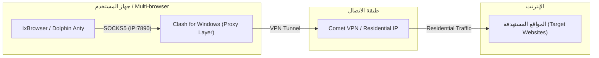

# 🌐 دليل شامل: الفرق بين Residential IP و Residential Proxy

غالبًا ما يُستخدم المصطلحيان **Residential IP** و **Residential Proxy** بشكل متبادل في مجالات إدارة الحسابات المتعددة، الكشط الإلكتروني (Web Scraping)، والأمن السيبراني، إلا أن بينهما ==فروقات جوهرية تقنية== في مفهوم الهوية والآلية البرمجية للتوصيل.

---

> [!summary] الخلاصة السريعة
> - **Residential IP (عنوان IP السكني):** هو ==الهوية الشبكية== (Address/Identity) الصادرة من مزود خدمة إنترنت حقيقي (ISP) للمنازل. يعبر عن "نوع الـ IP" ودرجة موثوقيته لدى المواقع.
> - **Residential Proxy (خادم البروكسي السكني):** هو ==بروتوكول ووسيط التوصيل== (Routing Mechanism / Protocol Layer) الذي يستضيف أو يوجه البيانات عبر ذلك الـ IP السكني من خلال **IP + Port** (مثل HTTP أو SOCKS5) لربطه بالتطبيقات والمتصفحات.

---

## 1️⃣ ما هو Residential IP (عنوان IP السكني)؟

**Residential IP** هو عنوان بروتوكول إنترنت (IP Address) مخصص ومسجل في قاعدة بيانات السجلات المحلية (RIRs) برعاية شركات اتصالات ومزودي خدمة إنترنت للمنازل (Internet Service Providers - ISPs) مثل *AT&T, Comcast, Vodafone, STC*.

### ✨ الخصائص الرئيسية للـ Residential IP:
- **الموثوقية العالية (High Trust Score):** تراه الخوادم والمواقع كجهاز منزل طبيعي وليس سيرفر أو Datacenter.
- **معدل حظر منخفض (Low Fraud Score):** يقلل فرصة ظهور اختبارات الكابتشا (CAPTCHA) أو حظر الحسابات.
- **نوع الاتصال:** يعبر عن **النوع والهوية الشبكية فقط**، بغض النظر عن طريقة توصيله بجهازك (سواء عبر VPN، خط منزلي مباشر، أو البروكسي).

---

## 2️⃣ ما هو Residential Proxy (البروكسي السكني)؟

**Residential Proxy** هو خادم وسيط (Proxy Server) أو بروتوكول توجيه بيانات (SOCKS5 / HTTP) يستخدم **Residential IP** كعنوان واجهة للخروج إلى الإنترنت.

يقوم البروكسي بفتح منفذ (**Port**) واستقبال الطلبات من البرامج (مثل متصفحات Antidetect) لتمريرها عبر الـ IP السكني.

### ✨ الخصائص الرئيسية للـ Residential Proxy:
- **معلمات الربط التقني:** يتكون دائمًا من `IP : Port` مع نظام مصادقة (Username/Password أو IP Authorization).
- **التحكم والديناميكية:** يمكن أن يكون:
  - **Static Residential Proxy (ثابت):** IP سكني محدد وثابت لفترة طويلة.
  - **Rotating Residential Proxy (متغير/تدويري):** يتغير الـ IP تلقائياً مع كل طلب أو كل بضع دقائق.
- **التكامل البرمجي:** يُستخدم بسهولة داخل برامج مثل [[تحويل_VPN_إلى_Proxy|Dolphin Anty, IxBrowser]] أو سكربتات Python.

---

## 📊 جدول مقارنة تفصيلي: Residential IP vs Residential Proxy

| وجه المقارنة | Residential IP (الآي بي السكني) | Residential Proxy (البروكسي السكني) |
| :--- | :--- | :--- |
| **المفهوم الأساسي** | **هوية ونوع العنوان الشبكي** (Identity) | **أداة وبروتوكول توجيه البيانات** (Delivery Mechanism) |
| **طبيعة التواجد** | عنوان رقمي مسجل لدى شركة اتصالات (ISP) | سيرفر/خدمة توفر منافذ (HTTP/SOCKS5 Ports) |
| **طريقة الاستخدام** | يتم تعيينه لجهاز أو خط إنترنت أو عبر VPN | يُدخل في البرامج على شكل `IP : Port : User : Pass` |
| **نطاق التطبيق** | على مستوى الجهاز بالكامل (Full Tunnel) | على مستوى تطبيق أو ملف شخصي محدد (App-Specific) |
| **المرونة والتدوير** | ثابت عادة طالما الجلسة قائمة | يوفر خيارات التدوير (Rotating) أو الثبات (Static) |
| **التأثير على الحسابات** | يمنح ثقة عالية للـ IP نفسه | يمنح عزل تام لكل بروفايل أو برنامج منفصل |

---

## 🔄 كيفية تحويل Residential IP إلى Residential Proxy

في العمليات الاحترافية، يمكنك الحصول على **Residential IP** من خلال تطبيق VPN (مثل Comet VPN أو [[Mysterium VPN]]), ولكن المتصفحات المتعددة تحتاج إلى **Residential Proxy** (IP + Port).

تتم العملية من خلال طبقة وسيطة (مثل برنامج *Clash for Windows*) كما تم شرحه بالتفصيل في [[تحويل_VPN_إلى_Proxy]]:

> [!tip] نصيحة تطبيقية
> عند تحويل VPN يحتوي على **Residential IP** إلى بروكسي، فإنك تحصل على مزايا الـ **Residential Proxy** (إمكانية توزيع الاتصال عبر IP وبورت على أجهزة متعددة) بتكلفة أقل وثبات أعلى.

---

## 💡 متى تستخدم كلاً منهما؟

> [!question] متى تختار Residential IP عبر VPN مباشر؟
> - عند الحاجة لتأمين كافة حركة المرور للجهاز بالكامل (Full System Protection).
> - عند العمل على جهاز واحد دون الحاجة لتقسيم الحسابات في متصفحات متعددة.

> [!example] متى تختار Residential Proxy؟
> - عند إدارة عشرات الحسابات على متصفحات إدارة الحسابات المتعددة (Anti-detect Browsers).
> - عند تشغيل أتمتة وكشط بيانات (Web Scraping / Automation) تتطلب تغيير الـ IP بكثرة (Rotating Proxy).
> - عند الحاجة لتمرير الاتصال لسيرفر خارجي أو VPS أونلاين.

---

## 🔗 مواضيع ذات صلة
- [[تحويل_VPN_إلى_Proxy|تفريغ وتلخيص فيديو: تحويل VPN إلى Proxy لأي برنامج]]
- [[Mysterium VPN|شرح واستخدام Mysterium VPN مع متصفحات الأنتي ديتكت]]
