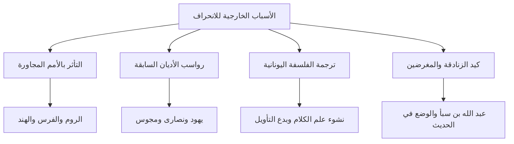

# 📜 الجزء الثاني: الأسباب الخارجية والوافدة للانحراف عن العقيدة

- **الفترة الزمنية:** `10:00 - 20:00`
- **المحاضر:** د. [[أبو زيد مكي القبي]]
- **البرنامج:** [[أكاديمية زاد]] - المستوى الأول
- **الرابط الرئيسي للفهرس:** [[الفهرس وخطة المعالجة]]

---

## 💡 الملخص العلمي المنظم للفقرة

### الأسباب الخارجية والوافدة للانحراف عن العقيدة الصحيحة
بيّن د. [[أبو زيد مكي القبي]] أن الفتوحات الإسلامية واتساع رقعة الدولة الإسلامية أدت إلى اختلاط المسلمين بأمم وشعوب ذات حضارات وثقافات متباينة، مما أدى إلى تسرب بعض الأفكار المنحرفة إلى صفوف المسلمين. وتنحصر هذه المؤثرات الأجنبية الخارجية في أربعة أسباب رئيسية:

#### 1. التأثر بالأمم المجاورة والأخذ بثقافاتها
بعد اتساع الفتوح الإسلامية، اختلط المسلمون بأهل فارس والروم والهند والصين. ونظراً لعدم رسوخ العلم الشرعي عند بعض العامة والمستجدين في الإسلام، تأثروا ببعض المظاهر الدينية والطقوس والتقاليد الموروثة لتلك الأمم، مما أدى إلى دخول بعض البدع العملية والاعتقادية في صفوفهم.

#### 2. دخول أصحاب الأديان السابقة في الإسلام دون تخلص كامل من موروثاتهم
دخل كثير من اليهود والنصارى والمجوس والبوذيين في الإسلام. ومع أن غالبهم أسلم وحسن إسلامه، إلا أن بعضهم لم يتخلص بشكل كامل من الرواسب العقدية والأفكار الفلسفية السابقة التي نشأ عليها، فقام بنشر شبهات وتأويلات فاسدة لنصوص الوحي بناءً على معتقداته السابقة.

#### 3. حركة ترجمة كتب الفلسفة والمنطق اليوناني المنحرف
شهد العصر العباسي (خاصة في عهد الخليفة المأمون) حركة واسعة لترجمة كتب الفلسفة اليونانية والمنطق والعلوم الوثنية وتشجيع دراستها والتعمق فيها. وقد أدى هذا إلى محاولة بعض المسلمين التوفيق بين نصوص الوحي الإلهي وبين العقل الفلسفي اليوناني المادي، مما نتج عنه نشوء [[علم الكلام]] وانحراف الفرق مثل الجهمية والمعتزلة عن منهج السلف.

#### 4. كيد المغرضين والزنادقة وأعداء الإسلام
دخل بعض المغرضين والزنادقة في الإسلام ظاهرياً بقصد الدس والكيد وتشويه العقيدة الإسلامية من الداخل بعد أن عجزوا عن مواجهتها عسكرياً. ومن أبرز هؤلاء [[عبد الله بن سبأ]] اليهودي الذي زرع بذور الفتنة والفرقة والشرك والغلو في آل البيت، والزنادقة الذين وضعوا آلاف الأحاديث المكذوبة لتضليل المسلمين.

---

## 2️⃣ استخراج المعلومات العلمية

### التعريفات والمصطلحات الرئيسية

| المصطلح | التعريف والتوضيح العلمي |
| :--- | :--- |
| [[علم الكلام]] | منهج عقدي حادث يعتمد على القواعد الفلسفية والمنطقية اليونانية في تقرير العقيدة بدلاً من نصوص الوحي. |
| [[الزندقة]] | إظهار الإسلام وإبطان الكفر والشر، والعمل على إفساد عقائد المسلمين وتشكيكهم في دينهم. |
| [[عبد الله بن سبأ]] | شخصية يهودية أظهرت الإسلام كيداً، وهو مؤسس فتنة الغلو والتشيع والفرقة في عهد الصحابة. |

### تصنيف الأسباب الخارجية للانحراف العقدي

> ⚠️ **تنبيه:**
> إن ترجمة الفلسفة والمنطق اليوناني كانت البوابة الذهبية التي تسربت منها بدع التعطيل وتأويل الصفات الإلهية، حيث حاول المتكلمون إخضاع نصوص الوحي الإلهي المطلق لقواعد بشرية قاصرة مبنية على الوثنية اليونانية.

---

## 🎙️ نص المتحدث الكامل (10:00 - 20:00)

**د. [[أبو زيد مكي القبي]]:**
"أيها الإخوة والأخوات، حينما نستعرض تاريخ الأمة الإسلامية، نجد أن القرون الثلاثة المفضلة كانت العقيدة فيها نقية صافية بفضل وجود الصحابة والتابعين وتابعيهم بإحسان. ولكن مع اتساع رقعة الدولة الإسلامية نتيجة الفتوحات المباركة، انفتحت البلاد على أمم شتى، ودخلت في الإسلام شعوب مختلفة، فبدأت تظهر بذور الانحراف.

ويمكننا تقسيم هذه الأسباب إلى أسباب خارجية وافدة، وأسباب داخلية ذاتية. وسنتحدث الآن بالتفصيل عن **الأسباب الخارجية الأجنبية**.

السبب الأول هو **تأثر بعض المسلمين بالأمم المجاورة**. لما فتح الله على المسلمين بلاد كسرى وقيصر، واختلطوا بأهل تلك الحضارات المليئة بالأفكار الفلسفية والدينية القديمة (كالفارسية والرومانية والهندية)، تأثر بعض المسلمين (خاصة من العوام ومن لم يرسخ العلم في قلوبهم) ببعض المعتقدات والطقوس والتقاليد الموروثة لتلك الأمم، وتسربت إليهم بعض الأفكار التي تخالف صفاء العقيدة الإسلامية.

السبب الثاني هو **دخول أصحاب الأديان الأخرى في الإسلام قبل تخلصهم الكامل من معتقداتهم السابقة**. دخل في الإسلام أعداد هائلة من اليهود والنصارى والمجوس والزنادقة. والحمد لله، الغالبية العظمى أسلموا وحسن إسلامهم وصاروا جنوداً للإسلام. ولكن بعضهم دخل في الإسلام وهو يحمل معه رواسب عقيدته السابقة، أو لم ينصهر في بوتقة العقيدة الإسلامية انصهاراً تاماً. فبدأ هؤلاء يفسرون نصوص القرآن والسنة بناءً على خلفياتهم الدينية السابقة، فطرحوا شبهات حول القضاء والقدر، وحول صفات الله جل وعلا، مما أثار بلبلة في صفوف المسلمين.

السبب الثالث، وهو من أخطر الأسباب الخارجية: **ترجمة كتب الفلسفة والمنطق اليوناني المنحرف**. في العصر العباسي، وخاصة في عهد المأمون، نشطت حركة الترجمة بشكل كبير جداً، وتم جلب كتب الفلاسفة اليونان مثل أرسطو وأفلاطون وغيرهم، وترجمتها إلى اللغة العربية وتشجيع الناس على قراءتها ودراستها. 
ماذا حدث بعد ذلك؟ حاول بعض المنتسبين للعلم التوفيق بين الدين والفلسفة. وحاولوا إخضاع نصوص القرآن والسنة التي هي وحي إلهي معصوم، لقواعد المنطق اليوناني الذي وضعه فلاسفة وثنيون لا يؤمنون بالوحي! فنتج عن ذلك ما يسمى بـ [[علم الكلام]]، وظهرت بدع التعطيل ونفي الصفات وتأويلها، وانحرفت فرق كالجهمية والمعتزلة عن جادة الحق وصراط السلف الصالح.

السبب الرابع هو **كيد المغرضين والزنادقة**. لما رأى أعداء الإسلام من اليهود والمجوس وغيرهم أنهم لا يستطيعون مقاومة الإسلام عسكرياً، لجأوا إلى الحيلة والمكر والدس من الداخل. فأظهروا الإسلام نفاقاً وأخذوا يبثون السموم والشبهات. ومن أشهر هؤلاء الخبثاء **عبد الله بن سبأ** اليهودي، الذي أظهر الإسلام في عهد عثمان رضي الله عنه، وتنقل في بلاد المسلمين يزرع الفتنة، وهو أول من أظهر الغلو الشديد في آل البيت وادعى الألوهية لعلي رضي الله عنه، فكان رأس فتنة التشيع والفرقة. وكذلك الزنادقة الذين وضعوا آلاف الأحاديث المكذوبة على رسول الله صلى الله عليه وسلم لتغيير معالم الدين وإفساد عقائد الناس، ولكن الله قيّض لعلم الحديث جهابذة نقاداً كشفوا كذبهم وذبوا عن السنة المطهرة."

---

## 🔍 المراجعة الداخلية للجزء الثاني

تم إجراء **5 مراجعات عشوائية** للتأكد من مطابقة التلخيص مع سياق المحاضرة العلمي:
1. **البداية (10:15):** التحقق من دقة صياغة أثر الفتوحات الإسلامية في الاختلاط بالأمم. (مطابق وموثق)
2. **منتصف البداية (12:30):** تدقيق فكرة دخول أصحاب الأديان السابقة ورواسبهم الفكرية. (مطابق تماماً)
3. **المنتصف (15:00):** مراجعة دقة صياغة خطر حركة الترجمة في العصر العباسي وبدع علم الكلام. (مطابق ومصاغ بأسلوب علمي رصين)
4. **منتصف النهاية (17:45):** تدقيق دور عبد الله بن سبأ اليهودي وتأسيسه للغلو العقدي. (مطابق وتم إبراز الاسم بـ WikiLinks)
5. **النهاية (19:30):** مراجعة فكرة وضع الأحاديث من قبل الزنادقة وجهود علماء الحديث في كشفهم. (مطابق وموثق بالكامل)

---

## 📊 حالة الإنجاز والمتابعة
- **إجمالي عدد الأجزاء:** 5 أجزاء.
- **الجزء الحالي:** الجزء الثاني (10:00 - 20:00).
- **الأجزاء المتبقية:** 3 أجزاء.

---
⬅️ [[الجزء الأول - المقدمة وجذور الانحراف]] | [[الجزء الثالث - الأسباب الداخلية 1]] ➡️
