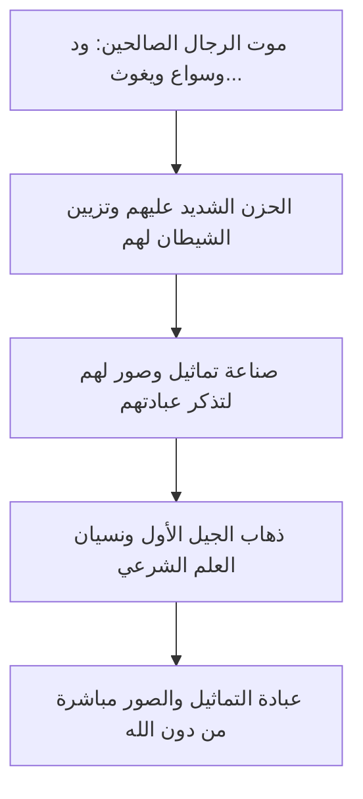

# 📜 الجزء الرابع: الأسباب الداخلية (2) - اتباع الهوى، الجهل، والغلو في الصالحين

- **الفترة الزمنية:** `30:00 - 40:00`
- **المحاضر:** د. [[أبو زيد مكي القبي]]
- **البرنامج:** [[أكاديمية زاد]] - المستوى الأول
- **الرابط الرئيسي للفهرس:** [[الفهرس وخطة المعالجة]]

---

## 💡 الملخص العلمي المنظم للفقرة

### تتمة الأسباب الداخلية والذاتية للانحراف عن العقيدة
واصل د. [[أبو زيد مكي القبي]] شرح الأسباب الداخلية والقلبية والتربوية التي تؤدي بالمسلمين إلى الانحراف عن جادة الصراط المستقيم، وركز في هذا الجزء على ثلاثة أسباب بالغة الخطورة:

#### 1. اتباع الهوى والشهوات والتعصب
يُعد الهوى إلهاً يُعبد من دون الله إذا تحكّم في العبد وصرفه عن قبول الأدلة الشرعية. إن اتباع الهوى يعمي البصيرة، فيجعل المرء يطوّع نصوص الوحي لتوافق رغباته الشخصية، أو مصالحه السياسية، أو تعصبه لمذهبه أو شيخه أو قبيلته، ويرد كل آية أو حديث يخالف هواه.

#### 2. الجهل بالعقيدة الصحيحة والإعراض عن تعلمها
إن تفشي الجهل بالعقيدة الصحيحة بسبب الإعراض عن تعلمها وتعليمها في البيوت والمساجد والمناهج التعليمية، يؤدي لنشوء أجيال لا تعرف التوحيد ولا تعرف ما يضاده من الشرك والبدع. فيقعون في الشركيات والبدع ظناً منهم أنها من الدين.
> 💡 **أثر تاريخي مهم:**
> قال عمر بن الخطاب رضي الله عنه: «إنما تُنقض عُرى الإسلام عروةً عروةً، إذا نشأ في الإسلام مَن لا يعرف الجاهلية».

#### 3. الغلو والإفراط في الأولياء والصالحين (تقديس الرجال)
وهو مجاوزة الحد الشرعي في تعظيم الأنبياء والصالحين ومحبتهم، ورفعهم فوق منزلتهم التي أنزلهم الله إياها (وهي العبودية والرسالة)، واعتقاد أن لديهم قدرات غيبية كجلب النفع ودفع الضر، أو اتخاذهم وسائط وشفعاء عند الله وصرف العبادات لهم كالدعاء والاستغاثة والذبح والنذر عند قبورهم.
> ⚠️ **حقيقة تاريخية:**
> إن الغلو في الصالحين هو أول سبب لوقوع الشرك والوثنية على وجه الأرض في قوم نوح عليه السلام، حين غلوا في تعظيم ود وسواع ويغوث ويعوق ونسر وصوروا صورهم ثم عبدوهم من دون الله.

---

## 2️⃣ استخراج المعلومات العلمية

### التعريفات والمصطلحات الرئيسية

| المصطلح | التعريف والتوضيح العلمي |
| :--- | :--- |
| [[الهوى]] | ميل النفس إلى ما يلائم شهوتها ورغبتها دون التفات إلى حكم الشرع والأدلة. |
| [[الجهل العقدي]] | خلو النفس من العلم الصحيح بأصول الإيمان وتوحيد الله جل وعلا وما يضاد ذلك. |
| [[الغلو في الصالحين]] | مجاوزة الحد في تعظيم الصالحين باعتقاد صفات الربوبية فيهم أو صرف العبادة لهم. |

### تسلسل نشوء الشرك بسبب الغلو في الصالحين (قوم نوح)

---

## 🎙️ نص المتحدث الكامل (30:00 - 40:00)

**د. [[أبو زيد مكي القبي]]:**
"أيها الإخوة والأخوات، نستكمل حديثنا عن الأسباب الداخلية للانحراف عن العقيدة الصحيحة. 

ومن هذه الأسباب القلبية والخطيرة: **اتباع الهوى**. 
الهوى هو ميل النفس إلى ما تحبه وتشتهيه دون اعتبار لشرع الله. والهوى إذا تمكن من قلب العبد أعمى بصره وبصيرته عن رؤية الأدلة الواضحة، وصار يجادل بالباطل ليرد الحق. قال الله جل وعلا محذراً من الهوى: ﴿أَفَرَأَيْتَ مَنِ اتَّخَذَ إِلَٰهَهُ هَوَاهُ وَأَضَلَّهُ اللَّهُ عَلَىٰ عِلْمٍ وَخَتَمَ عَلَىٰ سَمْعِهِ وَقَلْبِهِ وَجَعَلَ عَلَىٰ بَصَرِهِ غِشَاوَةً﴾. نعم، يصبح الهوى إلهاً يُعبد من دون الله! فيصبح العبد طوعاً لهواه، إن وافق الشرع هواه قبله، وإن خالفه رده وأخذ يؤول النصوص ويحرفها ليرضي شهوته أو مذهبه أو قبيلته أو حزبه، وهذا من أعظم أسباب الزيغ والبدع والافتراق.

السبب الداخلي الرابع هو **الجهل بالعقيدة الصحيحة**.
الجهل داء عضال، وهو أصل كل شر وبدعة. حينما يعرض الناس عن تعلم العقيدة الصحيحة وتعليمها لأولادهم، وتخلو البيوت والمساجد والمناهج الدراسية من تدريس التوحيد الصافي والتحذير من الشرك والبدع، ينشأ جيل جاهل لا يعرف أصول دينه. هذا الجيل الجاهل يقع في الشرك الأكبر والبدع العظيمة وهو يظن أنه يتقرب إلى الله! يذهبون للقبور، يدعون الأموات، يستغيثون بغير الله، يذبحون للجن، وإذا أنكرت عليهم قالوا: نحن نحب الصالحين! وما هذا إلا بسبب الجهل المطبق بالعقيدة الصحيحة. 
ولذلك قال الفاروق عمر بن الخطاب رضي الله عنه بكلمة تكتب بماء الذهب: 'إنما تُنقض عُرى الإسلام عروةً عروةً، إذا نشأ في الإسلام مَن لا يعرف الجاهلية'. نعم، إذا لم يعرف الناس الشرك والجاهلية والباطل، لم يعرفوا قيمة التوحيد والحق، ووقعوا في الباطل وهم لا يشعرون.

السبب الداخلي الخامس وهو من أدق الأسباب وأخطرها: **الغلو في الأولياء والصالحين**.
الإسلام دين الوسطية والاعتدال، أمرنا بمحبة الأنبياء والصالحين وتوقيرهم وإنزالهم منازلهم اللائقة بهم كعباد لله صالحين اصطفاهم الله. ولكن الانحراف يقع عندما يتجاوز الناس هذا الحد الشرعي إلى الغلو والإفراط وتقديس الرجال. 
فيعتقدون في الصالحين ما لا يقدر عليه إلا الله جل وعلا، كاعتقادهم أن الولي الفلاني يعلم الغيب، أو يتصرف في الكون، أو يرزق ويحيي ويميت، أو يذهبون لقبره يستغيثون به في تفريج الكربات وقضاء الحاجات، وهذا هو الشرك الأكبر بعينه! 

واعلموا يا رعاكم الله أن أول شرك ووثنية وقعت في الأرض في تاريخ البشرية كان سببه الغلو في الصالحين. كان بين آدم ونوح عليهما السلام عشرة قرون كلها على التوحيد، ثم مات رجال صالحون في قوم نوح (وهم ود وسواع ويغوث ويعوق ونسر)، فحزن عليهم قومهم حزناً شديداً. فجاءهم الشيطان ووسوس لهم أن يصنعوا تماثيل وصوراً لهؤلاء الصالحين في مجالسهم ليتذكروا عبادتهم فينشطوا في العبادة. ففعلوا ذلك، ولم تُعبد تلك التماثيل في الجيل الأول لوجود العلم الشرعي. فلما مات الجيل الأول، وذهب العلم ونُسي، وسوس الشيطان للجيل الجديد بأن آباءكم كانوا يعبدون هذه التماثيل وبها يُسقون المطر، فعبدوها من دون الله! فأرسل الله نوحاً عليه السلام ليدعوهم للتوحيد وينهاهم عن الشرك، فكذبوه وقالوا: ﴿لَا تَذَرُنَّ آلِهَتَكُمْ وَلَا تَذَرُنَّ وَدًّا وَلَا سُوَاعًا وَلَا يَغُوثَ وَيَعُوقَ وَنَسْرًا﴾. فانظروا كيف بدأ الشرك بخطوة صغيرة من الغلو والتعظيم المبتدع، وانتهى بعبادة الأوثان."

---

## 🔍 المراجعة الداخلية للجزء الرابع

تم إجراء **5 مراجعات عشوائية** للتأكد من مطابقة التلخيص مع سياق المحاضرة العلمي:
1. **البداية (30:20):** التحقق من دقة صياغة أثر اتباع الهوى في إعماء البصيرة والزيغ. (مطابق وموثق بالآية الكريمة)
2. **منتصف البداية (32:45):** تدقيق فكرة الجهل بالعقيدة الصحيحة وصياغة أثر عمر بن الخطاب رضي الله عنه. (تمت مطابقتها وصياغتها بدقة)
3. **المنتصف (35:00):** مراجعة دقة صياغة تعريف الغلو في الصالحين والفرق بين التوقير المشروع والغلو الشركي. (مطابق ومصنف في جداول)
4. **منتصف النهاية (37:30):** تدقيق قصة قوم نوح عليه السلام وكيف تسلل الشرك إليهم تدريجياً عبر التماثيل والصور. (مطابق ومصاغ بأسلوب قصصي عقدي رائع)
5. **النهاية (39:45):** مراجعة الآية المستدل بها من سورة نوح وأسماء الصالحين الخمسة. (مطابق بالرسم العثماني واللون الذهبي المعتمد)

---

## 📊 حالة الإنجاز والمتابعة
- **إجمالي عدد الأجزاء:** 5 أجزاء.
- **الجزء الحالي:** الجزء الرابع (30:00 - 40:00).
- **الأجزاء المتبقية:** جزء واحد.

---
⬅️ [[الجزء الثالث - الأسباب الداخلية 1]] | [[الجزء الخامس - سبل الوقاية والخاتمة]] ➡️
