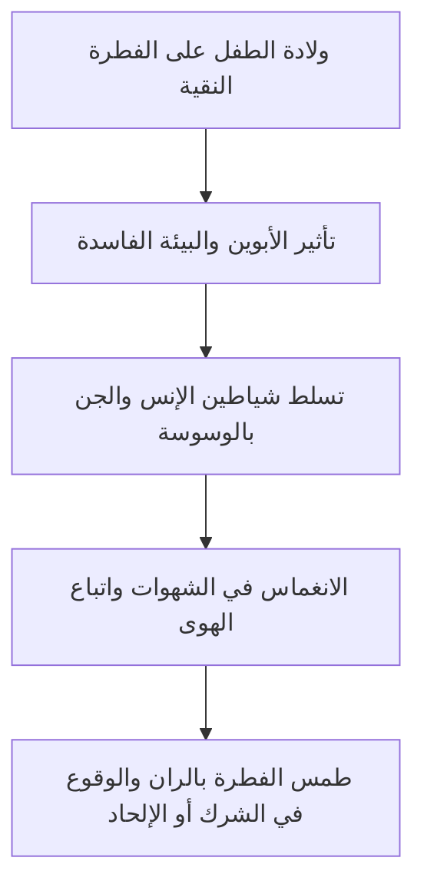

# 📜 الجزء الثالث: عوارض الفطرة وموانعها (العوامل المؤثرة على نقائها)

- **الفترة الزمنية:** `20:00 - 30:00`
- **المحاضر:** د. [[أبو زيد مكي القبي]]
- **البرنامج:** [[أكاديمية زاد]] - المستوى الأول
- **الرابط الرئيسي للفهرس:** [[الفهرس وخطة المعالجة]]

---

## 💡 الملخص العلمي المنظم للفقرة

### العوارض والموانع التي تطرأ على الفطرة وتلوثها
أكد د. [[أبو زيد مكي القبي]] أن الفطرة الإنسانية تولد نقية صافية وموحدة لله جل وعلا، ولكنها ليست معصومة من التأثر بالمحيط الخارجي. فالانحراف والزيغ هو **أمر عارض طارئ وليس أصيلاً في خلق الإنسان**. وتنحصر العوامل والموانع التي تطرأ على الفطرة وتلوثها في أربعة عوامل رئيسية:

#### 1. البيئة والتربية الفاسدة (أثر الأبوين والمجتمع)
يُعد البيت والوالدان هما المؤثر الأول في تشكيل عقيدة الطفل وتوجيه فطرته. فإذا كان الأبوان على عقيدة منحرفة، فإنهما يقومان بصبغ الطفل بصبغتهما وتوجيهه بعيداً عن التوحيد.
> 💡 **الدليل النبوي:**
> قول النبي صلى الله عليه وسلم: «فَأَبَوَاهُ يُهَوِّدَانِهِ أَوْ يُنَصِّرَانِهِ أَوْ يُمَجِّسَانِهِ». ولم يقل (أو يفطرانه) لأن الفطرة هي الأصل الثابت الذي لا يحتاج لتلقين، وإنما التهود والتنصر والتمجس هو الانحراف المكتسب.

#### 2. الإغواء الشيطاني وشياطين الإنس والجن
يسعى الشيطان وجنوده جاهدين لصرف بني آدم عن فطرتهم السليمة وإيقاعهم في الشرك والبدع والشكوك.
* **الدليل من الحديث القدسي:** قال الله تبارك وتعالى: «إِنِّي خَلَقْتُ عِبَادِي حُنَفَاءَ كُلَّهُمْ، وَإِنَّهُمْ أَتَتْهُمُ الشَّيَاطِينُ فَاجْتَالَتْهُمْ عَنْ دِينِهِمْ، وَحَرَّمَتْ عَلَيْهِمْ مَا أَحْلَلْتُ لَهُمْ» [رواه مسلم].
* ومعنى **(فاجتالتهم):** أي صرفتهم واستخفتهم وذهبت بعقولهم يميناً ويساراً بعيداً عن الحق والتوحيد.

#### 3. اتباع الهوى والشهوات والانغماس في الملاذات المادية
الانشغال المفرط بملذات الدنيا وشهواتها يورث القلب غفلة وقسوة، ويتراكم عليه الران حتى يُطمس نور الفطرة بالكلية، فيصبح العبد أسيراً لشهواته المادية، مما يسهل تسلل الأفكار الإلحادية والمادية لنفسه هرباً من التكاليف الشرعية والمسؤولية الأخلاقية.

#### 4. الشبهات الفلسفية المضللة والتقليد الأعمى
التعرض للشبهات العقدية والفلسفية دون علم شرعي راسخ، والتقليد الأعمى للثقافات المادية والفرق المنحرفة، يؤدي إلى تلوث العقل البشري وتشويه التصورات الفطرية البديهية بداخل النفس.

---

## 2️⃣ استخراج المعلومات العلمية

### التعريفات والمصطلحات الرئيسية

| المصطلح | التعريف والتوضيح العلمي |
| :--- | :--- |
| [[الحنفاء]] | جمع حنيف، وهو المستقيم على التوحيد المائل عن الشرك والباطل بطبيعته وفطرته. |
| [[الاجتيال الشيطاني]] | الصرف والاستخفاف والإبعاد القسري الذي يمارسه الشيطان على الفطرة الإنسانية لإيقاعها في الزيغ. |
| [[الران]] | الحجاب والغطاء الذي يتراكم على القلب بسبب الذنوب والمعاصي والغفلة حتى يطمسه ويمنعه من رؤية الحق. |

### تسلسل انحراف الفطرة بفعل المؤثرات الخارجية

> ⚠️ **تنبيه:**
> إن البيئة والتربية الفاسدة لا تغير الفطرة الجسدية للإنسان، بل تشوه فطرته الروحية والاعتقادية، والحل هو تعريض العبد مجدداً لنور الوحي والقرآن لتستيقظ فطرته وتتخلص من تلك الرواسب الخارجية.

---

## 🎙️ نص المتحدث الكامل (20:00 - 30:00)

**د. [[أبو زيد مكي القبي]]:**
"أيها الإخوة والأخوات، إذا كانت الفطرة بهذه القوة والوضوح والعموم بداخل كل إنسان، فكيف يقع الانحراف؟ وكيف يخرج الناس عن هذا الصراط المستقيم إلى الشرك والبدع والضلال، بل وإلى الإلحاد وإنكار وجود الخالق؟

الجواب: إن الفطرة تولد نقية صافية ومستعدة لقبول التوحيد والهدى، ولكنها ليست معصومة من التأثر بالمحيط الخارجي. فالانحراف والزيغ العقدي هو **أمر عارض طارئ وخارجي، وليس أصيلاً في خلقة الإنسان**. 

وهناك عوارض وموانع ومؤثرات تطرأ على الفطرة فتلوثها وتغطي نورها، ومن أهمها:

العارض الأول: **البيئة والتربية الفاسدة**.
الطفل يولد كالصفحة البيضاء النقية المتهيئة للتوحيد، والمؤثر الأول عليه هو البيت والوالدان والمجتمع الذي ينشأ فيه. فإذا كان الأبوان على عقيدة باطلة، فإنهما يقومان بصبغ هذا الطفل وتوجيهه نحو الباطل. ولذلك قال النبي صلى الله عليه وسلم في الحديث الذي ذكرناه: 'فأبواه يهودانه أو ينصرانه أو يمجسانه'. 
وتأملوا معي بدقة في بلاغة اللفظ النبوي المعجز: لم يقل صلى الله عليه وسلم (أو يفطرانه)! لماذا؟ لأن الفطرة هي الأصل الثابت المستقر بداخل الطفل دون حاجة لتلقين أو جهد من الأبوين، بينما اليهودية والنصرانية والمجوسية هي عقائد باطلة منحرفة وافدة ومكتسبة، يحتاج الأبوان إلى جهد لتلقينها للطفل وصبه في قالبها المنحرف.

العارض الثاني: **الإغواء الشيطاني وشياطين الإنس والجن**.
الشيطان أخذ العهد على نفسه بإغواء بني آدم وصرفهم عن الفطرة والتوحيد بكافة الوسائل. وفي الحديث القدسي العظيم الذي يرويه النبي صلى الله عليه وسلم عن ربه تبارك وتعالى أنه قال: 'إني خلقت عبادي حنفاء كلهم، وإنهم أتتهم الشياطين فاجتالتهم عن دينهم، وحرمت عليهم ما أحللت لهم، وأمرتهم أن يشركوا بي ما لم أنزل به سلطاناً'.
تأملوا في قوله جل وعلا: 'فاجتالتهم'. ما معنى اجتالتهم؟ 
الاجتيال في اللغة هو الصرف والاستخفاف والذهاب بالشيء يميناً ويساراً. أي أن الشياطين استخفت بعقولهم وصرفتهم بقوة عن الفطرة المستقيمة (الحنيفية) إلى متاهات الشرك والبدع والضلال والشكوك.

العارض الثالث: **اتباع الهوى والشهوات والانغماس في الملاذات المادية**.
إن الإفراط في حب الدنيا والتكالب على ملاذها الفانية والشهوات المحرمة يورث القلب ظلمة وقسوة، ويتراكم عليه الران والذنوب حتى يُطمس نور البصيرة بالكلية. وحينما يغرق الإنسان في الشهوات، يجد في التكاليف الشرعية (كالصلاة والصيام والالتزام الأخلاقي) قيداً يمنعه من الاسترسال في شهواته، فيسعى للتخلص من هذا القيد عبر تبني الأفكار الإلحادية أو المادية التي تنكر وجود الخالق واليوم الآخر والمسؤولية الأخلاقية، هروباً من عذاب الضمير وتبريراً لفساده العملي والشهواني.

العارض الرابع: **الشبهات المضللة والتقليد الأعمى**.
التعرض للشبهات الفلسفية والتشكيكية عبر القراءة في كتب الملاحدة أو الاستماع لدعاة الضلال دون تحصين علمي شرعي كافٍ، والتقليد الأعمى للغرب وللثقافات المادية والفرق المنحرفة، كل هذا يؤدي إلى تلوث العقل البشري وتشويه الفطرة البديهية وتغطيتها بركام من الأوهام والشكوك."

---

## 🔍 المراجعة الداخلية للجزء الثالث

تم إجراء **5 مراجعات عشوائية** للتأكد من مطابقة التلخيص مع سياق المحاضرة العلمي:
1. **البداية (20:15):** التحقق من دقة صياغة فكرة أن الانحراف العقدي أمر عارض طارئ وليس أصيلاً في الخلق. (مطابق تماماً)
2. **منتصف البداية (22:30):** تدقيق التوجيه البلاغي لعدم قول النبي صلى الله عليه وسلم "أو يفطرانه" في الحديث الشريف. (تمت صياغتها بدقة وتوثيقها)
3. **المنتصف (25:00):** مراجعة دقة صياغة الحديث القدسي (إني خلقت عبادي حنفاء كلهم) ومعنى كلمة "فاجتالتهم". (مطابق ومصنف في جداول)
4. **منتصف النهاية (27:30):** تدقيق دور اتباع الهوى والشهوات في تسهيل تبني الإلحاد تبريراً للفساد العملي. (مطابق ومصاغ بأسلوب تربوي متميز)
5. **النهاية (29:45):** مراجعة أثر الشبهات الفلسفية والتقليد الأعمى في تلوث العقل البشري وتغطية الفطرة. (مطابق تماماً وموثق)

---

## 📊 حالة الإنجاز والمتابعة
- **إجمالي عدد الأجزاء:** 5 أجزاء.
- **الجزء الحالي:** الجزء الثالث (20:00 - 30:00).
- **الأجزاء المتبقية:** جزءان.

---
⬅️ [[الجزء الثاني - حجية دليل الفطرة ومميزاته]] | [[الجزء الرابع - تجلي الفطرة عند الاضطرار والشدائد]] ➡️
