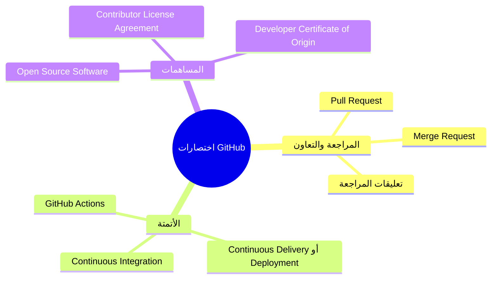

# اختصارات ومصطلحات GitHub

> [!abstract] الغرض
> حزمة عربية تشرح أشهر الاختصارات والمصطلحات التي تظهر في طلبات المراجعة، والأتمتة، ومشاريع المصدر المفتوح. الاسم الإنجليزي الكامل يرافق كل اختصار، ويأتي الشرح بلغة عربية مبسطة.

> [!note] منهجية الشرح
> التلقينة المطلوبة مخصصة أساسًا لتلخيص التسجيلات، لذا تطبّق هنا عناصرها المناسبة: التعريفات والجداول و`WikiLinks` والمراجعة الذاتية والتنسيق المعتدل. اعتمد الشرح على توثيق GitHub والمراجع الأصلية للمصطلحات؛ أما تعبيرات فرق البرمجة غير الرسمية فموسومة بوضوح على هذا الأساس.

## ترتيب القراءة

| الملف | الموضوع |
|---|---|
| [[01 - مصطلحات المراجعة والتعاون]] | `PR` و`MR` واختصارات التعليقات والمراجعة |
| [[02 - CI و CD والأتمتة]] | الفحص والبناء والاختبار والنشر عبر `GitHub Actions` |
| [[03 - مصطلحات المصدر المفتوح والمساهمات]] | `OSS` و`CLA` و`DCO` |
| [[04 - مراجعة سريعة واختبار ذاتي]] | ورقة مراجعة قصيرة وأسئلة مع الإجابات |
| [[05 - مسرد اختصارات GitHub مجمّع]] | الشرح كاملًا في ملف واحد للقراءة المتصلة |

## خريطة الموضوعات

روابط الملفات التفصيلية: [[01 - مصطلحات المراجعة والتعاون]]، [[02 - CI و CD والأتمتة]]، [[03 - مصطلحات المصدر المفتوح والمساهمات]].

## تنبيهات سريعة

- المصطلح الذي تستخدمه GitHub لاقتراح دمج تغييرات هو `Pull Request` (`PR`). تستخدم GitLab مصطلح `Merge Request` (`MR`) للفكرة المشابهة.
- كلمات مثل `LGTM` و`WIP` و`PTAL` تعليقات أو اختصارات متداولة بين الفرق؛ وهي لا تغيّر حالة المراجعة الرسمية وحدها.
- قد يرمز `CD` إلى `Continuous Delivery` أو `Continuous Deployment`؛ افحص الاسم الكامل والسياق في وثائق المشروع.

## المصادر

- [About pull requests — GitHub Docs](https://docs.github.com/en/pull-requests/get-started/about-pull-requests)
- [Pull request reviews — GitHub Docs](https://docs.github.com/en/pull-requests/reference/pull-request-reviews)
- [Understanding GitHub Actions — GitHub Docs](https://docs.github.com/en/actions/get-started/understand-github-actions)
- [The Open Source Definition — Open Source Initiative](https://opensource.org/osd)

للمراجعة السريعة انتقل إلى [[04 - مراجعة سريعة واختبار ذاتي]]، أو افتح [[05 - مسرد اختصارات GitHub مجمّع]] لقراءة واحدة متصلة.
