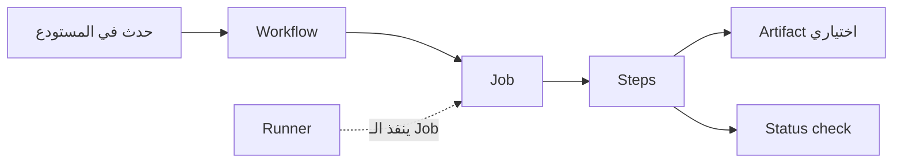

# CI و CD والأتمتة في GitHub

تشرح هذه الملاحظة كيف ينتقل تغيير الكود من الفحص والبناء إلى ملفات الناتج أو النشر باستخدام الأتمتة في GitHub.

> [!info] الفكرة الأساسية
> تبدأ العملية بحدث مثل فتح `Pull Request` أو رفع `push`، ثم ينفذ GitHub Actions خطواتًا آلية. CI يفحص التغيير بالبناء والاختبارات، وCD ينقل النسخة الجاهزة نحو الإصدار أو النشر. نجاح الفحص لا يعني وحده أن التطبيق نُشر.

## شكل العملية

الـ `Event` (الحدث) يشغّل `Workflow`، والـ `Job` هو مجموعة خطوات تنفذ على `Runner`. وقد تنتج الخطوات ملفًا محفوظًا أو نتيجة تحقق تظهر على التغيير. [شرح GitHub Actions ومكوّناته](https://docs.github.com/en/actions/get-started/understand-github-actions)

## CI و CD: البناء والاختبار والإصدار

| المصطلح | الاسم الكامل | المعنى المبسّط |
|---|---|---|
| **CI — Continuous Integration** | التكامل المستمر | دمج تغييرات الكود باستمرار في مستودع مشترك، مع بناء الكود واختباره لاكتشاف المشكلات مبكرًا. في GitHub Actions يمكن تشغيل الفحوص عند `push` أو `Pull Request`. [GitHub Docs: Continuous integration](https://docs.github.com/en/actions/get-started/continuous-integration) |
| **CD — Continuous Delivery** | التسليم المستمر | اصطلاحًا، تُبنى التغييرات وتُختبر وتُجهّز كي تكون قابلة للإصدار؛ وقد يظل إرسالها إلى بيئة `production` (بيئة التشغيل الفعلية) بانتظار قرار أو موافقة بشرية. تدعم بيئات GitHub Actions قواعد موافقة قبل متابعة مهمة النشر. [GitHub Docs: Deploying with GitHub Actions](https://docs.github.com/en/actions/how-tos/deploy/configure-and-manage-deployments/control-deployments) |
| **CD — Continuous Deployment** | النشر المستمر | تُنشر التغييرات التي اجتازت البناء والاختبارات آليًا. توثّق GitHub هذا المسار باسم `Continuous deployment (CD)`، ويمكن ضبطه ليعمل بعد حدث مثل وصول تغيير إلى الفرع الافتراضي. [GitHub Docs: Continuous deployment](https://docs.github.com/en/actions/get-started/continuous-deployment) |

### لماذا قد ترى معنيين للاختصار CD؟

قد يعني `CD` **Continuous Delivery** أو **Continuous Deployment**. الفرق العملي هو أن التسليم المستمر يُبقي الإصدار جاهزًا وقد ينتظر موافقة لإطلاقه، أما النشر المستمر فيكمل الإطلاق آليًا بعد نجاح الشروط المحددة. وثائق GitHub العامة تقدّم GitHub Actions كمنصة `CI/CD` وتوسّعها إلى `Continuous Integration and Continuous Delivery`، بينما صفحة النشر المستمر تستخدم `CD` بمعنى `Continuous Deployment`. لذلك اقرأ الاسم الكامل والسياق، ولا تفترض أن `CD` وحده يحدد إن كان النشر إلى الإنتاج تلقائيًا. [فهم GitHub Actions](https://docs.github.com/en/actions/get-started/understand-github-actions) · [Continuous deployment](https://docs.github.com/en/actions/get-started/continuous-deployment) · [موافقات بيئات النشر](https://docs.github.com/en/actions/how-tos/deploy/configure-and-manage-deployments/control-deployments)

## المصطلحات الأساسية في GitHub Actions

| المصطلح | المعنى المبسّط |
|---|---|
| **GitHub Actions** | منصة الأتمتة المدمجة في GitHub لتشغيل البناء والاختبارات والنشر ومهام أخرى عند أحداث المستودع، أو وفق جدول، أو يدويًا. [GitHub Docs: Understanding GitHub Actions](https://docs.github.com/en/actions/get-started/understand-github-actions) |
| **Workflow** | عملية آلية يصفها ملف إعداد بصيغة `YAML` داخل مجلد `.github/workflows`. يمكن للـ workflow أن يحتوي مهمة واحدة أو أكثر، ويبدأ عند حدث أو موعد مجدول أو تشغيل يدوي. [GitHub Docs: Workflows](https://docs.github.com/en/actions/concepts/workflows-and-actions/workflows) |
| **Runner** | خادم أو آلة افتراضية تنفّذ مهمة. يمكن أن تستضيف GitHub الـ runner أو تديره أنت على جهازك أو بنيتك التحتية؛ وكل runner ينفّذ مهمة واحدة في الوقت نفسه. [GitHub Docs: Runners](https://docs.github.com/en/actions/get-started/understand-github-actions) |
| **Job** | مجموعة `Steps` تنفذ على الـ runner نفسه. قد تعمل عدة مهام بالتوازي، أو تنتظر مهمة أخرى إذا عُرّفت بينها علاقة اعتماد. [GitHub Docs: Jobs](https://docs.github.com/en/actions/get-started/understand-github-actions) |
| **Step** | خطوة واحدة داخل مهمة، مثل أمر بناء أو اختبار. تكون إما أمرًا برمجيًا يعمل في shell أو `Action` (إضافة قابلة لإعادة الاستخدام)، وتنفذ خطوات المهمة بالترتيب المعتاد. [GitHub Docs: Jobs and actions](https://docs.github.com/en/actions/get-started/understand-github-actions) |
| **Artifact** | ملف أو مجموعة ملفات أنتجها تشغيل الـ workflow، مثل حزمة البناء أو نتائج الاختبار. يمكن حفظها بعد انتهاء المهمة أو تمريرها إلى مهمة أخرى في الـ workflow. [GitHub Docs: Workflow artifacts](https://docs.github.com/en/actions/concepts/workflows-and-actions/workflow-artifacts) |
| **Status check** | نتيجة تحقق مرتبطة بتغيير أو commit، وتُظهر هل الفحص ما زال يعمل أو نجح أو فشل. GitHub Actions تنشئ `Checks` لعرض التفاصيل والنتائج في `Pull Request`؛ وإذا اشترطت حماية الفرع اجتياز فحوص معينة، يجب أن تنجح قبل الدمج. [GitHub Docs: Status checks](https://docs.github.com/en/pull-requests/reference/status-checks) · [About protected branches](https://docs.github.com/en/repositories/configuring-branches-and-merges-in-your-repository/managing-protected-branches/about-protected-branches) |

## مثال سريع

عند فتح `Pull Request`، يمكن إعداد `Workflow` ليشغّل مهمة على `Runner`. تنفذ المهمة `Steps` لبناء الكود وتشغيل الاختبارات؛ ثم تعرض GitHub نتيجة `Status check`. وإذا أُعدّ `Artifact`، يمكن تنزيل ناتج البناء أو تمريره لمهمة لاحقة. لا يحدث النشر تلقائيًا إلا إذا وُجدت مهمة نشر وإعداد مناسب لها. [CI في GitHub Actions](https://docs.github.com/en/actions/get-started/continuous-integration) · [Workflow artifacts](https://docs.github.com/en/actions/concepts/workflows-and-actions/workflow-artifacts) · [Continuous deployment](https://docs.github.com/en/actions/get-started/continuous-deployment)

## روابط مرتبطة في الـ Vault

- [[vibe_coding/vibecoding lecti 1/summarized_transcripts_Vibe_Coding_Course_1/08 - VS Code وCursor وربط GitHub|ربط VS Code وCursor بـ GitHub]].
- [[vibe_coding/vibecoding lecti 1/summarized_transcripts_Vibe_Coding_Course_1/06 - Deployment Serverless مقابل الـ Server الخاص|Deployment والاستضافة]].
- [[vibe_coding/git worktrees/summarized_transcripts_git_worktrees/03 - الأتمتة عبر Warp agent mode|أتمتة مهام التطوير]].
- مفاهيم مرتبطة: **Git**، **Pull Request**، **YAML**، **Build**، **Testing**، **Deployment**.

## المصادر الرسمية

- [Understanding GitHub Actions](https://docs.github.com/en/actions/get-started/understand-github-actions)
- [Workflows](https://docs.github.com/en/actions/concepts/workflows-and-actions/workflows)
- [Continuous integration](https://docs.github.com/en/actions/get-started/continuous-integration)
- [Continuous deployment](https://docs.github.com/en/actions/get-started/continuous-deployment)
- [Workflow artifacts](https://docs.github.com/en/actions/concepts/workflows-and-actions/workflow-artifacts)
- [Status checks](https://docs.github.com/en/pull-requests/reference/status-checks)
- [Deploying with GitHub Actions](https://docs.github.com/en/actions/how-tos/deploy/configure-and-manage-deployments/control-deployments)
- [About protected branches](https://docs.github.com/en/repositories/configuring-branches-and-merges-in-your-repository/managing-protected-branches/about-protected-branches)
