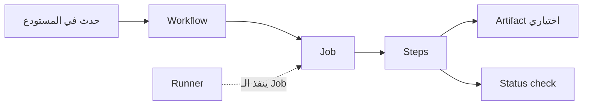

# مسرد اختصارات GitHub مجمّع

> [!abstract] الغرض
> يجمع هذا الملف الشروحات الموضوعية في وثيقة واحدة للقراءة المتصلة. توسعة الاختصار الإنجليزية تليها دلالة عربية مبسطة، مع تمييز المصطلحات الرسمية عن التعابير المتداولة بين الفرق.

## الفهرس

- [[01 - مصطلحات المراجعة والتعاون]]
- [[02 - CI و CD والأتمتة]]
- [[03 - مصطلحات المصدر المفتوح والمساهمات]]
- [[04 - مراجعة سريعة واختبار ذاتي]]

---

## مصطلحات المراجعة والتعاون في GitHub

هذا مسرد للمختصرات والعبارات التي تظهر أثناء مراجعة الكود (code review)، أي فحص التغيير ومناقشته قبل دمجه (merge). بعض المصطلحات أسماء ميزات في GitHub أو GitLab، وبعضها لغة مختصرة غير رسمية تختلف دلالتها حسب المشروع.

### المسرد

| المصطلح | التوسعة الإنجليزية | المعنى والاستخدام |
|---|---|---|
| **PR** | **Pull Request** | <span style="color:#0D9488; font-weight:bold;">طلب لاقتراح دمج (merge) تغييرات من فرع (branch) إلى فرع آخر في المستودع (repository).</span> يوفّر GitHub مكانًا لمناقشة التغييرات ومراجعتها قبل دمجها. [وثائق GitHub عن Pull Requests](https://docs.github.com/en/pull-requests/get-started/about-pull-requests) |
| **MR** | **Merge Request** | <span style="color:#0D9488; font-weight:bold;">طلب دمج التغييرات في GitLab.</span> هو مفهوم قريب من PR؛ وتجمع صفحة MR النقاش والتغييرات وتعليقات المراجعة ومعلومات الفحوص. [وثائق GitLab عن Merge Requests](https://docs.gitlab.com/user/project/merge_requests/) |
| **Draft PR** | **Draft Pull Request** | <span style="color:#0D9488; font-weight:bold;">طلب PR بحالة «مسودة» في GitHub، لمشاركة عمل غير جاهز للمراجعة النهائية.</span> لا يمكن دمجه حتى تغيّر حالته إلى `Ready for review` (جاهز للمراجعة). [تغيير مرحلة Pull Request — GitHub Docs](https://docs.github.com/en/pull-requests/how-tos/create-pull-requests/changing-the-stage-of-a-pull-request) |
| **WIP** | **Work In Progress** | «العمل جارٍ». يصف تغييرًا لم يكتمل، وقد يُشارك للحصول على ملاحظات مبكرة. تستخدم بعض المشاريع `[WIP]` كبادئة في عنوان PR للإشارة إلى أنه غير مطروح للدمج بعد؛ وهذا عرف يحدده المشروع. [مسرد Node.js](https://github.com/nodejs/node/blob/main/glossary.md)، [دليل المساهمة في Bitcoin Core](https://github.com/bitcoin/bitcoin/blob/master/CONTRIBUTING.md) |
| **LGTM** | **Looks Good To Me** | «يبدو جيدًا لي». إشارة مختصرة إلى أن المراجع يرى التغيير جيدًا. هي عبارة تعليق؛ لتسجيل قرار مراجعة رسمي في GitHub، استخدم خيار `Approve` عند إرسال المراجعة. [مسرد Node.js](https://github.com/nodejs/node/blob/main/glossary.md)، [إرشادات مراجعة Google](https://google.github.io/eng-practices/review/reviewer/looking-for.html)، [قرارات مراجعة PR في GitHub](https://docs.github.com/en/pull-requests/reference/pull-request-reviews) |
| **PTAL** | **Please Take A Look** | «من فضلك ألقِ نظرة»؛ طلب من شخص أن يراجع التغيير أو يطّلع عليه، وليس علامة موافقة. [مسرد Node.js](https://github.com/nodejs/node/blob/main/glossary.md) |
| **nit** | ليست اختصارًا؛ كلمة قريبة من **nitpick** | ملاحظة صغيرة، غالبًا عن التنسيق أو الصقل. توصي إرشادات Google باستخدام `Nit:` لتوضيح أن الملاحظة ليست إلزامية، وألا يُمنع التغيير بسبب تفضيل شخصي في الأسلوب وحده. [إرشادات Google لتعليقات مراجعة الكود](https://google.github.io/eng-practices/review/reviewer/looking-for.html) |
| **ACK / NACK** | **Acknowledgment / Negative Acknowledgment** | التوسعتان تعنيان «إقرار» و«إقرار سلبي». وفي سياق PR في Bitcoin Core، تدل `Concept ACK` على تأييد هدف التغيير و`Concept NACK` على الاعتراض عليه؛ ويُطلب تبرير `NACK`. طريقة استخدامهما ووزنهما عرف خاص بالمشروع، وليسا قرارين من واجهة مراجعة GitHub. [تعريف ACK وNACK في RFC 5795](https://www.rfc-editor.org/rfc/rfc5795)، [دليل مراجعة Bitcoin Core](https://github.com/bitcoin/bitcoin/blob/master/CONTRIBUTING.md)، [حالات مراجعة GitHub](https://docs.github.com/en/pull-requests/reference/pull-request-reviews) |
| **RFC** | **Request for Comments** | «طلب لإبداء التعليقات». قد يعني مقترحًا أو وثيقة تصميم مطروحة للنقاش. في مشروع Rust مثلًا توجد عملية RFC للتغييرات الجوهرية، بينما يمكن أن تمر الإصلاحات والتعديلات التوثيقية عبر PR عادي؛ لذا يحدد كل مشروع متى وكيف يستخدم هذا المصطلح. [مسرد Node.js](https://github.com/nodejs/node/blob/main/glossary.md)، [دليل RFC لمشروع Rust](https://rust-lang.github.io/rfcs/) |

### قرار المراجعة في GitHub والعبارات المكتوبة

عند إرسال مراجعة (review) في GitHub، يختار المراجع أحد قرارات الواجهة التالية. هذه القرارات تختلف عن العبارات التي يكتبها في نص التعليق. [وثائق GitHub عن حالات المراجعة](https://docs.github.com/en/pull-requests/reference/pull-request-reviews)

| قرار الواجهة | معناه |
|---|---|
| `Comment` | يترك ملاحظات دون موافقة صريحة أو طلب تغييرات. |
| `Approve` | يسجل أن التغيير جاهز للدمج. |
| `Request changes` | يشير إلى ملاحظات ينبغي معالجتها قبل الدمج؛ وقد يعتمد منع الدمج على إعدادات حماية الفرع (branch protection) ومتطلبات المراجعة في المستودع (repository). |

أما `LGTM` و`ACK` و`NACK` و`PTAL` فهي نصوص يكتبها المشاركون. قراءة `LGTM` في تعليق لا تسجل وحدها قرار `Approve` في واجهة GitHub؛ إذا كان المطلوب اعتمادًا رسميًا، اختَر `Approve` عند إرسال المراجعة.

### فروق سريعة بين المصطلحات المتشابهة

- `Draft PR` حالة مسودة يديرها GitHub، وتمنع الدمج حتى يصبح الطلب جاهزًا للمراجعة.
- `WIP` وصف إنجليزي للعمل الجاري؛ وقد يظهر كنص في العنوان أو التعليق حسب عرف الفريق. لا تخلط بين هذا النص وبين حالة `Draft` في المنصة. [GitHub: تغيير مرحلة PR](https://docs.github.com/en/pull-requests/how-tos/create-pull-requests/changing-the-stage-of-a-pull-request)، [Bitcoin Core: بادئة WIP](https://github.com/bitcoin/bitcoin/blob/master/CONTRIBUTING.md)
- `RFC` قد يكون اسم عملية رسمية في مشروع معين، أو مجرد طلب للنقاش في عنوان PR؛ تحقّق من دليل المساهمة الخاص بالمشروع قبل افتراض أن له خطوات موحّدة. [دليل RFC لمشروع Rust](https://rust-lang.github.io/rfcs/)

### أمثلة قصيرة

- `PTAL at the validation change` — طلب من المراجع أن يطّلع على تعديل التحقق.
- `Nit: rename this variable for clarity` — اقتراح صغير لتحسين الاسم، لا يُفترض أنه مانع للدمج وحده.
- `LGTM` — تعليق إيجابي؛ أما تسجيل موافقة GitHub الرسمية فيكون باختيار `Approve` وإرسال المراجعة.
- `[WIP] Improve import flow` — بادئة توضح أن العمل لا يزال جاريًا وفق عرف المشروع. إذا أردت حالة المسودة في GitHub، استخدم `Draft PR`.
- `RFC: add configurable retries` — عنوان يطلب نقاش مقترح؛ اتبع إجراء المشروع إن كان لديه مسار RFC معتمد.

### روابط داخلية

- [[00 - فهرس اختصارات GitHub|الفهرس]]
- [[01 - مصطلحات المراجعة والتعاون#المسرد|PR وMR والمسودة]]
- [[01 - مصطلحات المراجعة والتعاون#قرار المراجعة في GitHub والعبارات المكتوبة|حالات مراجعة GitHub]]
- [[01 - مصطلحات المراجعة والتعاون#فروق سريعة بين المصطلحات المتشابهة|WIP وRFC]]
- [[02 - CI و CD والأتمتة|الأتمتة والفحوص]]

---

## CI و CD والأتمتة في GitHub

تشرح هذه الملاحظة كيف ينتقل تغيير الكود من الفحص والبناء إلى ملفات الناتج أو النشر باستخدام الأتمتة في GitHub.

> [!info] الفكرة الأساسية
> تبدأ العملية بحدث مثل فتح `Pull Request` أو رفع `push`، ثم ينفذ GitHub Actions خطواتًا آلية. <span style="color:#0D9488; font-weight:bold;">CI يفحص التغيير بالبناء والاختبارات، وCD ينقل النسخة الجاهزة نحو الإصدار أو النشر.</span> نجاح الفحص لا يعني وحده أن التطبيق نُشر.

### شكل العملية



الـ `Event` (الحدث) يشغّل `Workflow`، والـ `Job` هو مجموعة خطوات تنفذ على `Runner`. وقد تنتج الخطوات ملفًا محفوظًا أو نتيجة تحقق تظهر على التغيير. [شرح GitHub Actions ومكوّناته](https://docs.github.com/en/actions/get-started/understand-github-actions)

### CI و CD: البناء والاختبار والإصدار

| المصطلح | الاسم الكامل | المعنى المبسّط |
|---|---|---|
| **CI — Continuous Integration** | التكامل المستمر | دمج تغييرات الكود باستمرار في مستودع مشترك، مع بناء الكود واختباره لاكتشاف المشكلات مبكرًا. في GitHub Actions يمكن تشغيل الفحوص عند `push` أو `Pull Request`. [GitHub Docs: Continuous integration](https://docs.github.com/en/actions/get-started/continuous-integration) |
| **CD — Continuous Delivery** | التسليم المستمر | اصطلاحًا، تُبنى التغييرات وتُختبر وتُجهّز كي تكون قابلة للإصدار؛ وقد يظل إرسالها إلى بيئة `production` (بيئة التشغيل الفعلية) بانتظار قرار أو موافقة بشرية. تدعم بيئات GitHub Actions قواعد موافقة قبل متابعة مهمة النشر. [GitHub Docs: Deploying with GitHub Actions](https://docs.github.com/en/actions/how-tos/deploy/configure-and-manage-deployments/control-deployments) |
| **CD — Continuous Deployment** | النشر المستمر | تُنشر التغييرات التي اجتازت البناء والاختبارات آليًا. توثّق GitHub هذا المسار باسم `Continuous deployment (CD)`، ويمكن ضبطه ليعمل بعد حدث مثل وصول تغيير إلى الفرع الافتراضي. [GitHub Docs: Continuous deployment](https://docs.github.com/en/actions/get-started/continuous-deployment) |

#### لماذا قد ترى معنيين للاختصار CD؟

قد يعني `CD` **Continuous Delivery** أو **Continuous Deployment**. الفرق العملي هو أن التسليم المستمر يُبقي الإصدار جاهزًا وقد ينتظر موافقة لإطلاقه، أما النشر المستمر فيكمل الإطلاق آليًا بعد نجاح الشروط المحددة. وثائق GitHub العامة تقدّم GitHub Actions كمنصة `CI/CD` وتوسّعها إلى `Continuous Integration and Continuous Delivery`، بينما صفحة النشر المستمر تستخدم `CD` بمعنى `Continuous Deployment`. لذلك اقرأ الاسم الكامل والسياق، ولا تفترض أن `CD` وحده يحدد إن كان النشر إلى الإنتاج تلقائيًا. [فهم GitHub Actions](https://docs.github.com/en/actions/get-started/understand-github-actions) · [Continuous deployment](https://docs.github.com/en/actions/get-started/continuous-deployment) · [موافقات بيئات النشر](https://docs.github.com/en/actions/how-tos/deploy/configure-and-manage-deployments/control-deployments)

### المصطلحات الأساسية في GitHub Actions

| المصطلح | المعنى المبسّط |
|---|---|
| **GitHub Actions** | منصة الأتمتة المدمجة في GitHub لتشغيل البناء والاختبارات والنشر ومهام أخرى عند أحداث المستودع، أو وفق جدول، أو يدويًا. [GitHub Docs: Understanding GitHub Actions](https://docs.github.com/en/actions/get-started/understand-github-actions) |
| **Workflow** | عملية آلية يصفها ملف إعداد بصيغة `YAML` داخل مجلد `.github/workflows`. يمكن للـ workflow أن يحتوي مهمة واحدة أو أكثر، ويبدأ عند حدث أو موعد مجدول أو تشغيل يدوي. [GitHub Docs: Workflows](https://docs.github.com/en/actions/concepts/workflows-and-actions/workflows) |
| **Runner** | خادم أو آلة افتراضية تنفّذ مهمة. يمكن أن تستضيف GitHub الـ runner أو تديره أنت على جهازك أو بنيتك التحتية؛ وكل runner ينفّذ مهمة واحدة في الوقت نفسه. [GitHub Docs: Runners](https://docs.github.com/en/actions/get-started/understand-github-actions) |
| **Job** | مجموعة `Steps` تنفذ على الـ runner نفسه. قد تعمل عدة مهام بالتوازي، أو تنتظر مهمة أخرى إذا عُرّفت بينها علاقة اعتماد. [GitHub Docs: Jobs](https://docs.github.com/en/actions/get-started/understand-github-actions) |
| **Step** | خطوة واحدة داخل مهمة، مثل أمر بناء أو اختبار. تكون إما أمرًا برمجيًا يعمل في shell أو `Action` (إضافة قابلة لإعادة الاستخدام)، وتنفذ خطوات المهمة بالترتيب المعتاد. [GitHub Docs: Jobs and actions](https://docs.github.com/en/actions/get-started/understand-github-actions) |
| **Artifact** | ملف أو مجموعة ملفات أنتجها تشغيل الـ workflow، مثل حزمة البناء أو نتائج الاختبار. يمكن حفظها بعد انتهاء المهمة أو تمريرها إلى مهمة أخرى في الـ workflow. [GitHub Docs: Workflow artifacts](https://docs.github.com/en/actions/concepts/workflows-and-actions/workflow-artifacts) |
| **Status check** | نتيجة تحقق مرتبطة بتغيير أو commit، وتُظهر هل الفحص ما زال يعمل أو نجح أو فشل. GitHub Actions تنشئ `Checks` لعرض التفاصيل والنتائج في `Pull Request`؛ وإذا اشترطت حماية الفرع اجتياز فحوص معينة، يجب أن تنجح قبل الدمج. [GitHub Docs: Status checks](https://docs.github.com/en/pull-requests/reference/status-checks) · [About protected branches](https://docs.github.com/en/repositories/configuring-branches-and-merges-in-your-repository/managing-protected-branches/about-protected-branches) |

### مثال سريع

عند فتح `Pull Request`، يمكن إعداد `Workflow` ليشغّل مهمة على `Runner`. تنفذ المهمة `Steps` لبناء الكود وتشغيل الاختبارات؛ ثم تعرض GitHub نتيجة `Status check`. وإذا أُعدّ `Artifact`، يمكن تنزيل ناتج البناء أو تمريره لمهمة لاحقة. لا يحدث النشر تلقائيًا إلا إذا وُجدت مهمة نشر وإعداد مناسب لها. [CI في GitHub Actions](https://docs.github.com/en/actions/get-started/continuous-integration) · [Workflow artifacts](https://docs.github.com/en/actions/concepts/workflows-and-actions/workflow-artifacts) · [Continuous deployment](https://docs.github.com/en/actions/get-started/continuous-deployment)

### روابط مرتبطة في الـ Vault

- [[vibe_coding/vibecoding lecti 1/summarized_transcripts_Vibe_Coding_Course_1/08 - VS Code وCursor وربط GitHub|ربط VS Code وCursor بـ GitHub]].
- [[vibe_coding/vibecoding lecti 1/summarized_transcripts_Vibe_Coding_Course_1/06 - Deployment Serverless مقابل الـ Server الخاص|Deployment والاستضافة]].
- [[vibe_coding/git worktrees/summarized_transcripts_git_worktrees/03 - الأتمتة عبر Warp agent mode|أتمتة مهام التطوير]].
- مفاهيم مرتبطة: **Git**، **Pull Request**، **YAML**، **Build**، **Testing**، **Deployment**.

### المصادر الرسمية

- [Understanding GitHub Actions](https://docs.github.com/en/actions/get-started/understand-github-actions)
- [Workflows](https://docs.github.com/en/actions/concepts/workflows-and-actions/workflows)
- [Continuous integration](https://docs.github.com/en/actions/get-started/continuous-integration)
- [Continuous deployment](https://docs.github.com/en/actions/get-started/continuous-deployment)
- [Workflow artifacts](https://docs.github.com/en/actions/concepts/workflows-and-actions/workflow-artifacts)
- [Status checks](https://docs.github.com/en/pull-requests/reference/status-checks)
- [Deploying with GitHub Actions](https://docs.github.com/en/actions/how-tos/deploy/configure-and-manage-deployments/control-deployments)
- [About protected branches](https://docs.github.com/en/repositories/configuring-branches-and-merges-in-your-repository/managing-protected-branches/about-protected-branches)

---

## مصطلحات المصدر المفتوح والمساهمات

> ضمن حزمة GitHub: [[00 - فهرس اختصارات GitHub|الفهرس]] · [[01 - مصطلحات المراجعة والتعاون|مصطلحات المراجعة والتعاون]] · [[05 - مسرد اختصارات GitHub مجمّع|المسرد المجمّع]].

### الفكرة الأساسية

&rlm;<span style="color:#0D9488; font-weight:bold;">Open Source Software (OSS) — برنامج مفتوح المصدر:</span> برنامج تسمح رخصة برمجياته (**software license**، الشروط التي تحدد ما يمكن فعله بالكود) باستخدام شفرته المصدرية (**source code**، الشفرة القابلة للقراءة والتعديل) ومشاركتها وفق تلك الشروط. مجرد إتاحة الشفرة للقراءة لا يكفي؛ يجب أن تسمح الرخصة بالتوزيع والتعديل وفق معايير **Open Source Definition (OSD)** (تعريف المصدر المفتوح)، ومنها السماح بالأعمال المعدلة وعدم التمييز بين الأشخاص أو مجالات الاستخدام. وتعرض [Open Source Initiative (OSI، مبادرة المصدر المفتوح)](https://opensource.org/osd) معايير التعريف العشرة.

| الاختصار | التوسعة الإنجليزية | المعنى المبسط |
|---|---|---|
| **OSS** | **Open Source Software** | برنامج تنظم رخصته إتاحة الشفرة واستخدامها وتعديلها ومشاركتها. |
| **FOSS** | **Free and Open Source Software** | تعبير يجمع كلمتي «حر» و«مفتوح المصدر». يستخدمه بعض الناس للحديث عن البرنامج الحر والمفتوح؛ و«حر» هنا تتعلق بحرية الاستخدام، لا بكون البرنامج مجاني السعر بالضرورة. لا يحدد الاختصار وحده نوع رخصة بعينها. [توضح OSI علاقة المصطلحين واستخدام FOSS](https://opensource.org/faq). |
| **CLA** | **Contributor License Agreement** | اتفاقية ترخيص المساهم: وثيقة تشرح الشروط والحقوق المرتبطة بتقديم المساهمة للمشروع. |
| **DCO** | **Developer Certificate of Origin** | شهادة منشأ المطور: إقرار من المساهم بأنه أنشأ العمل أو يملك الحق في تقديمه بموجب رخصة المشروع. |

### CLA — اتفاقية ترخيص المساهم

**CLA (Contributor License Agreement)** اتفاق يحدد الشروط التي تُقبل بموجبها مساهمات الأفراد أو الشركات، وما الحقوق التي يمنحها صاحب المساهمة للمشروع في شأن العمل المقدم. تختلف بنود الاتفاقية من مشروع إلى آخر؛ لذلك اقرأ نص الاتفاق المحدد قبل التوقيع، ولا تفترض أن كل CLA تنقل ملكية حقوق المؤلف. في مثال **Apache Software Foundation (ASF)**، يحتفظ المساهم بحقوق استخدام مساهمته الأصلية لأغراض أخرى، مع منح المؤسسة ومشاريعها حق توزيع العمل والبناء عليه. [مصدر ASF الرسمي عن اتفاقيات المساهمين](https://www.apache.org/licenses/contributor-agreements.html).

في ASF تحديدًا، توجد اتفاقية للفرد واتفاقية للشركة:

| الاختصار | التوسعة الإنجليزية | الشرح |
|---|---|---|
| **ICLA** | **Individual Contributor License Agreement** | اتفاقية المساهم الفردي. تطلبها ASF من صيانة المشاريع والمساهمات الكبيرة وفق شروطها المنشورة. |
| **CCLA** | **Corporate Contributor License Agreement** | اتفاقية المساهم المؤسسي. تتيح للشركة تغطية الملكية الفكرية التي قد تكون مملوكة لها بسبب علاقة العمل؛ ووفق سياسة ASF لا تغني عن توقيع المطور الفرد على ICLA. |

هذا **مثال لسياسة ASF فقط**: تذكر المؤسسة أن المساهمات الصغيرة في مشاريعها قد تُقدَّم وفق البند الخامس من رخصة Apache-2.0، بينما تتطلب حالات محددة أخرى ICLA. لا تعمم هذا الإجراء على مستودعات GitHub الأخرى. [تفاصيل الاتفاقيات واستثناءاتها لدى ASF](https://www.apache.org/licenses/contributor-agreements.html).

### DCO — شهادة منشأ المطور

**DCO (Developer Certificate of Origin)** إقرار بأن المساهمة من إنشاء المساهم، أو أن لديه الحق في تقديم العمل السابق أو المعدل بموجب الرخصة المناسبة. النص الرسمي يوضح كذلك أن سجل المساهمة والإقرار المصاحب له يصبحان علنيين ويُحتفظ بهما. [النص الرسمي لـ DCO، الإصدار 1.1](https://developercertificate.org/).

تُسجل الموافقة عادةً كسطر **Signed-off-by** (إقرار بالتوقيع) في نهاية رسالة **commit** (تثبيت مجموعة تغييرات في سجل Git). في سطر الأوامر، يضيف الخيار `git commit --signoff` هذا السطر إلى الرسالة؛ لكن معنى الإقرار يتبع سياسة المشروع، لذلك راجع تعليمات المساهمة أولًا. [توثيق Git لخيار `--signoff`](https://git-scm.com/docs/git-commit) و[شرح GitHub لسياسة إقرارات الالتزام](https://docs.github.com/en/enterprise-cloud@latest/organizations/managing-organization-settings/managing-the-commit-signoff-policy-for-your-organization).

```text
Signed-off-by: Your Name <you@example.com>
```

> **تنبيه:** `sign-off` (إقرار المساهم) ليس هو `commit signature` (توقيع رقمي مشفّر للتحقق من هوية موقّع الالتزام). توثيق GitHub يوضح أن العمليتين مختلفتان: الأولى إقرار بنص الالتزام، والثانية توقيع رقمي يمكن التحقق منه. [شرح التوقيعات الرقمية في GitHub](https://docs.github.com/en/authentication/managing-commit-signature-verification/about-commit-signature-verification).

### من يساهم ومن يراجع؟

| المصطلح | المعنى المبسط |
|---|---|
| **Contributor** (مساهم) | شخص يقترح تعديلًا أو يقدّم عملًا للمشروع، مثل إصلاح في الشفرة أو تحسين في التوثيق. |
| **Maintainer** (مسؤول صيانة المشروع) | شخص يراجع طلبات التغيير، وقد يطلب تعديلات لتتوافق مع أسلوب المشروع أو تصميمه. |
| **Pull Request (PR)** (طلب دمج) | طلب لمراجعة تغييرات أُعدت خارج المستودع الأساسي ثم اقتراح إدخالها إليه. يمر الطلب بمراجعة المسؤولين، وقد يُطلب تعديل المساهمة قبل قبولها. |

تعريف الدورين هنا للتوضيح العملي؛ صلاحيات الأشخاص ومسؤولياتهم الدقيقة تعتمد على تنظيم المشروع. [إرشادات GitHub الرسمية للمساهمة ومراجعة طلبات الدمج](https://docs.github.com/en/get-started/exploring-projects-on-github/contributing-to-open-source).

### كيف أعرف ما يطلبه المشروع؟

لكل مشروع قواعده وخطواته الخاصة. ابحث عن ملف **CONTRIBUTING.md** (تعليمات المساهمة) وعن **LICENSE** (ملف الرخصة)، وتحقق مما إذا كان المستودع يطلب CLA أو DCO قبل إرسال التغيير. توصي وثائق GitHub بقراءة متطلبات المشروع وإرشادات التنسيق والاختبارات ومراجعة طلبات التغيير؛ كما توضح أن المشاريع قد تختلف في هذه المتطلبات. [دليل GitHub للمساهمة في المصدر المفتوح](https://docs.github.com/en/get-started/exploring-projects-on-github/contributing-to-open-source).

قبل أي إقرار أو اتفاقية، تأكد من أن العمل من إنشائك أو أن لديك حق تقديمه وفق رخصته. شهادة DCO نفسها تتناول المساهمات الأصلية والعمل المأخوذ من مصادر سابقة. [نص DCO الرسمي](https://developercertificate.org/).

### تذكّر الفرق

| السؤال | CLA | DCO |
|---|---|---|
| ما صورته المعتادة؟ | اتفاقية يطلب المشروع قبولها وفق شروطه، وقد تكون وثيقة منفصلة. | إقرار يرتبط بالمساهمة أو بالـ commit عبر سطر `Signed-off-by`. |
| ماذا يوضح؟ | الحقوق والشروط التي تحكم تقديم المساهمة للمشروع، بحسب نص الاتفاق المحدد. | أن المساهم يملك الحق في تقديم العمل وفق رخصة المشروع. |
| هل هو مطلوب في كل مشروع مفتوح المصدر؟ | لا؛ راجع سياسة المشروع. | لا؛ راجع سياسة المشروع. |

هذا التفريق يشرح الاستخدام الشائع ولا يستبدل قراءة المستندات الفعلية. وتؤكد GitHub أن لكل مشروع متطلباته، كما تعرض ASF مثالًا تطبّق فيه اتفاقية ICLA في حالات معينة وتقبل مساهمات أخرى وفق رخصة المشروع. [إرشادات GitHub](https://docs.github.com/en/get-started/exploring-projects-on-github/contributing-to-open-source) · [سياسة ASF](https://www.apache.org/licenses/contributor-agreements.html).

---

للمراجعة: [[04 - مراجعة سريعة واختبار ذاتي|مراجعة سريعة واختبار ذاتي]] · [[05 - مسرد اختصارات GitHub مجمّع|المسرد المجمّع]].
