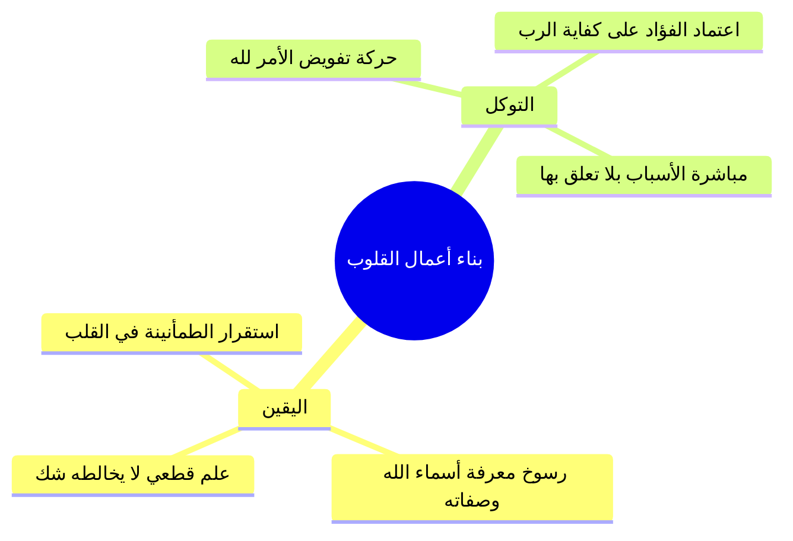

# 01 - منزلة التوكل واليقين وفقه العلاقة بين أعمال القلوب

> [!info] الفكرة المحورية
> تقع عبادة **[[التوكل]]** في قلب منظومة **[[أعمال القلوب]]**؛ وهي تتأسس بالضرورة على **[[اليقين]]** التام بالله سبحانه؛ إذ لا يتصور صدق تفويض الأمور وركون الفؤاد إلى الله دون علم جازم ويقين قاطع بكمال قدرته، وعلمه، ورحمته، وكفايته.

---

## 🗺️ روابط الحزمة
[[00 - الفهرس والخطة]] • **الجزء الحالي (01)** • [[02 - سر التوفيق والخذلان والاعتماد على الركن الشديد]]

---

## 📝 العرض العلمي والتحليلي للمحور

### 1. الاستشفاء بالسنة النبوية وحاجة الروح
- أصل مجالس السنة هو استشفاء الأرواح ومداواة أمراض القلوب بهدي المصطفى ﷺ.
- أعمال القلوب هي المحرك الحقيقي لأعمال الجوارح، وأشرف أبواب الفقه في الدين هو فقه العلاقة والترابط بين هذه الأعمال الباطنة.

### 2. فقه الترجمة عند الإمام النووي: الجمع بين اليقين والتوكل
- في سائر أبواب «رياض الصالحين»، يفرد النووي عنوان الباب بلفظ واحد (مثل: باب الصبر، باب المراقبة، باب التقوى).
- في هذا الباب جمع بين أصلين فقال: **«باب في اليقين والتوكل»**.
- **العلاقة بينهما:** اليقين مقدمة وركيزة للتوكل؛ فاليقين استقرار الإيمان والعلم التام في القلب، والتوكل هو حركة الاعتماد والتفويض الناتجة عن هذا الاستقرار؛ فلا يتصور تحقيق التوكل بلا يقين.

### 3. الآيات القرآنية الجامعة للتوكل
- **التوكل على الحي القيوم:** ﴿وَتَوَكَّلْ عَلَى الْحَيِّ الَّذِي لَا يَمُوتُ﴾؛ فكل من توكلت عليه من المخلوقين يموت أو يعجز، والله وحده الحي الدائم.
- **الحسب والكفاية:** ﴿وَمَن يَتَوَكَّلْ عَلَى اللَّهِ فَهُوَ حَسْبُهُ﴾؛ أي كافيه كل ما أهمه من أمر دنياه وآخرته.
- **وجل القلوب وزيادة الإيمان:** ﴿إِنَّمَا الْمُؤْمِنُونَ الَّذِينَ إِذَا ذُكِرَ اللَّهُ وَجِلَتْ قُلُوبُهُمْ وَإِذَا تُلِيَتْ عَلَيْهِمْ آيَاتُهُ زَادَتْهُمْ إِيمَانًا وَعَلَىٰ رَبِّهِمْ يَتَوَكَّلُونَ﴾.

---

## 📊 الجداول والتعريفات العلمية

| المصطلح | التعريف العلمي المعتمد | الثمرة السلوكية |
|:---|:---|:---|
| `[[اليقين]]` | ا استقرار العلم الثابت الجازم في القلب بحيث لا يعتريه شك أو تردد. | الثبات عند الشبهات والفتن. |
| `[[التوكل]]` | ا صدق اعتماد القلب على الله في جلب المصالح ودفع المضار مع الأخذ بالأسباب. | الطمأنينة وراحة البال وزوال القلق. |
| `[[الحسب]]` | ا الكفاية التامة الإلهية للعبد التي تغنيه عن الالتفات للمخلوقين. | الشجاعة وعزة النفس والكرامة. |

> ⚠️ تنبيه
> ا احذر من الخلط بين التوكل والتواكل؛ فالتوكل عمل قلبي مقترن بأخذ الجوارح بالأسباب المشروعة، أما تعطيل الأسباب فجهل بالشريعة وقدح في الحكمة الإلهية.
