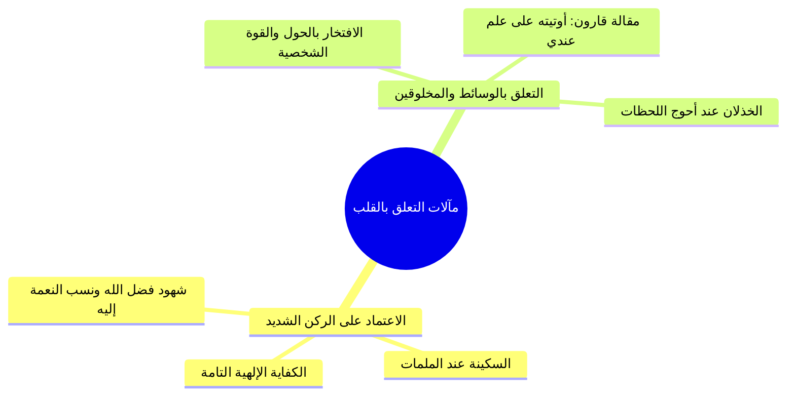

# 02 - سر التوفيق والخذلان والاعتماد على الركن الشديد

> [!info] الفكرة المحورية
> حقيقة **[[التوفيق]]** أن يَكِلَك الله سبحانه إلى فضله وحفظه وألا يَكِلَك إلى نفسك أو مخلوق طرفة عين، بينما **[[الخذلان]]** هو التخلي عن العبد وتركه لقدرته الذاتية وحوله الضعيف. ومن أوى إلى **[[الركن الشديد]]** حيزت له الكفاية، ومن تعلّق بسبب أو مخلوق خُذل من جهته.

---

## 🗺️ روابط الحزمة
[[01 - منزلة التوكل واليقين وفقه العلاقة بين أعمال القلوب]] • **الجزء الحالي (02)** • [[03 - حسن الظن بالله في الشدائد وفقه الأزمات - الأحزاب نموذجا]]

---

## 📝 العرض العلمي والتحليلي للمحور

### 1. قصة الغلام في طريق اليمن: مذهب الكرم وحقيقة التوفيق
- أورد ابن الجوزي في «صفة الصفوة» عن **محمد بن سليمان القرشي** لقاءه بغلام في طريق اليمن يرتجز شعراً يفتخر فيه بمليك السماء العزيز.
- بيان خلق إكرام الضيف؛ حيث كان الغلام يسير الأميال لالتماس ضيف، واحتفاء أخته بالضيف بصلاة ركعتين شكراً لله الذي ساقه إليهما.
- دوي القرآن في جوف الليل بالخيمة، ورد الغلام الجامع لما تعجب الضيف من عبادة أخته: **«أما علمت أن الناس صنفان: موفّق ومخذول؟!»**.

### 2. فلسفة التوفيق وحصر الحول والقوة في الله
- التوفيق في لسان الشرع: ألا يكلك الله إلى نفسك، بل يحوطك بلطفه ويسدد خطاك.
- إلقاء عصا موسى عليه السلام كان تعليماً للقلب في طرح الأسباب المعتادة والاعتماد الكلي على الله العزيز الذي لا يهزم.
- حصر التوفيق في قول يعقوب وشعيب عليهما السلام: ﴿وَمَا تَوْفِيقِي إِلَّا بِاللَّهِ عَلَيْهِ تَوَكَّلْتُ وَإِلَيْهِ أُنِيبُ﴾.

### 3. شواهد الخذلان عند التعلق بغير الله
- **مشهد المستشفى:** هلع الشاب في العناية المركزة بحثاً عن «الاستشاري» متوهماً أن الشفاء بيده، حتى أيقظته عجوز صالحة: «يا بني، أنت مش محتاج استشاري، أنت محتاج رحمة ربنا!»، فنزل اليقين والسكينة عليه ورُفعت الشدة.
- **أمثلة الاتكال على الوساطات الدنيوية:** اتكال صاحب المخالفة على ضابط يعرفه، أو مسافر المطار على عميد لتجاوز الوزن، فينقلب الأمر عليهما عجراً وحرجاً.
- **سقوط المستكبرين:** افتخار فرعون بالأنهار تجري من تحته، فأجرى الله الماء من فوقه وأغرقه.

---

## 📊 الجداول والمقارنات

| وجه المقارنة | الموفّق | المخذول |
|:---|:---|:---|
| **الاعتماد الباطن** | على الله وحده (الركن الشديد). | على الأسباب، الذكاء، المال، والعلاقات. |
| **اللسان عند النعمة** | ﴿هذا من فضل ربي﴾، ﴿ربي وفقني﴾. | ﴿إنما أوتيته على علم عندي﴾، «أنا فعلت». |
| **الحال عند الأزمة** | ثبات وسكينة وفزع إلى الدعاء. | هلع واضطراب وسؤال المخلوقين بذل. |
| **المآل النهائي** | العز والكفاية والنجاة. | الخذلان والتخلي والضياع. |

> ⚠️ تنبيه
> ا احذر من نسبة النجاح لنفسك؛ فكل نجاح دنيوي أو أخروي سببه توفيق الله وحده، ونسبة الفضل للنفس بداية طريق السقوط والخذلان.
