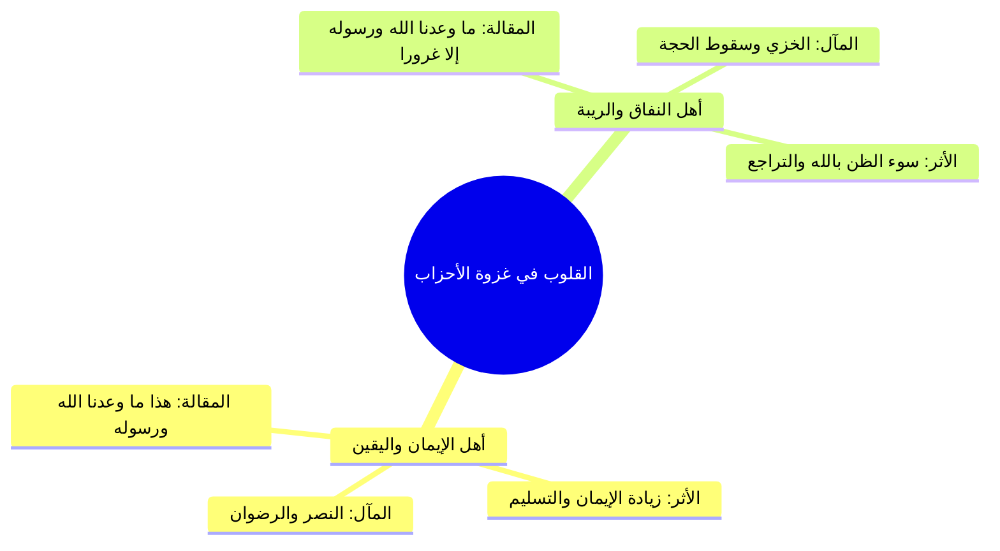

# 03 - حسن الظن بالله في الشدائد وفقه الأزمات - الأحزاب نموذجا

> [!info] الفكرة المحورية
> تكشف الشدائد والأزمات عن مكنون القلوب؛ فالمؤمن المتوكل يزداد **[[حسن الظن بالله]]** ويقيناً بنصره كلما اشتد الكرب، بينما يسقط المنافق في دركات **سوء الظن بالله** والاتهام لحكمته؛ والموقف التاريخي في **[[غزوة الأحزاب]]** برهان ساطع على هذا التمايز العقدي والقلبي.

---

## 🗺️ روابط الحزمة
[[02 - سر التوفيق والخذلان والاعتماد على الركن الشديد]] • **الجزء الحالي (03)** • [[04 - حديث عرض الأمم والسبعين ألفا بلا حساب ولا عذاب]]

---

## 📝 العرض العلمي والتحليلي للمحور

### 1. معيارية ردود الأفعال عند اشتداد البلاء
- الأحداث الخارجية المؤلمة ليست هي التي تحدد استجابة الإنسان، بل ما يستقر في باطن قلبه من الإيمان واليقين.
- قد تقع نفس النازلة وفي ذات البقعة الجغرافية والظرف الزمني على طائفتين من الناس، فتكون لأحدهما سبباً في علو الدرجات، وتكون للأخرى سبباً في السقوط والانتكاس.

### 2. غزوة الأحزاب: المشهد الفارق بين الإيمان والنفاق
- عندما تظاهرت قبائل الشرك وحوصرت المدينة وزلزلت الأرض:
  - **موقف المنافقين:** قالوا: ﴿مَّا وَعَدَنَا اللَّهُ وَرَسُولُهُ إِلَّا غُرُورًا﴾؛ فظنوا بالله ظن السوء، واتهموا وعد النبوة، ورأوا أن الأسباب المادية هي الحاكمة وحدها.
  - **موقف المؤمنين المتوكلين:** قالوا: ﴿هَٰذَا مَا وَعَدَنَا اللَّهُ وَرَسُولُهُ وَصَدَقَ اللَّهُ وَرَسُولُهُ وَمَا زَادَهُمْ إِلَّا إِيمَانًا وَتَسْلِيمًا﴾؛ فعلموا أن اشتداد الخطب هو المخاض لولادة النصر والفرج الإلهي.

### 3. سر كلمة «حسبنا الله ونعم الوكيل» في حمراء الأسد
- بعد جراح أُحد، لما قيل للمسلمين إن قريشاً وحلفاءها جمعوا لكم ليستأصلوكم:
  - فزعوا إلى سلاح التوكل: ﴿فَزَادَهُمْ إِيمَانًا وَقَالُوا حَسْبُنَا اللَّهُ وَنِعْمَ الْوَكِيلُ﴾.
  - النتيجة القرآنية الحاسمة: ﴿فَانقَلَبُوا بِنِعْمَةٍ مِّنَ اللَّهِ وَفَضْلٍ لَّمْ يَمْسَسْهُمْ سُوءٌ وَاتَّبَعُوا رِضْوَانَ اللَّهِ﴾.
- معنى الكلمة: «كفانا الله؛ فهو نعم المولى ونعم النصير، ونعم من فُوّضت إليه مقاليد الأمور».

---

## 📊 الجداول والمقارنات

| وجه المقارنة | المؤمن في الأزمة | المنافق في الأزمة |
|:---|:---|:---|
| **المنظور القلبي** | ينظر بعين اليقين إلى وعد الله ولطفه. | ينظر بعين الحسابات المادية الجافة واليأس. |
| **التفسير للابتلاء** | تمحيص، تكفير، وقرب للنصر والفرج. | خدعة، غرور، وضياع لا فائدة منه. |
| **رد الفعل السلوكي** | الثبات، زيادة العبادة، والتفويض التام. | التخذيل، الفرار، والاعتراض باللسان. |

> ⚠️ تنبيه
> ا احذر من تسلل الشك عند تأخر الفرج؛ فإن الله حكيم عليم يؤخر الإجابة لحكم بالغة وليربي القلوب على كمال التوكل والتسليم.
