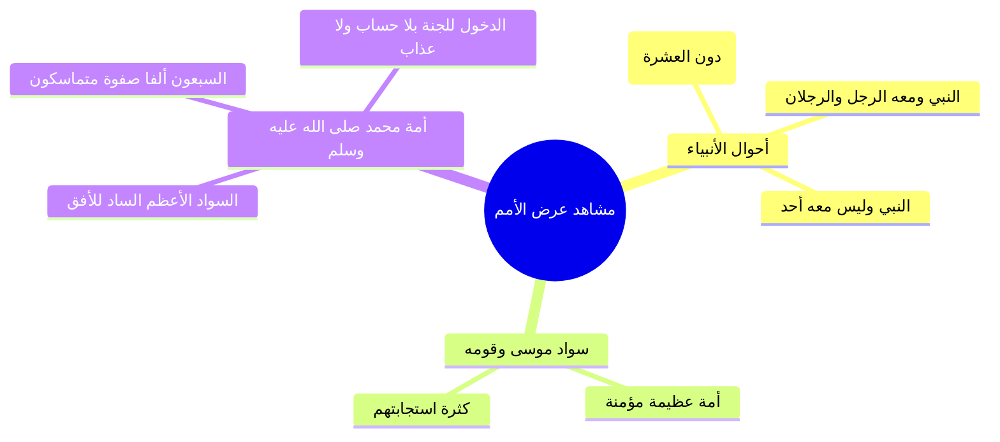

# 04 - حديث عرض الأمم والسبعين ألفا بلا حساب ولا عذاب

> [!info] الفكرة المحورية
> مشهد مهيب من مشاهد اليوم الآخر؛ حيث عُرضت الأمم على النبي ﷺ فرأى تفاوت أتباع الأنبياء، ثم تجلّى شرف هذه الأمة بسوادها الأعظم الذي ملأ الأفق، وتُوّج هذا المشهد ببروز صفوة مميزة قوامها **[[السبعون ألفاً]]** يدخلون الجنة بغير حساب ولا عذاب لعلو مقام توكلهم على الله.

---

## 🗺️ روابط الحزمة
[[03 - حسن الظن بالله في الشدائد وفقه الأزمات - الأحزاب نموذجا]] • **الجزء الحالي (04)** • [[05 - تحقيق صفات المتوكلين والروايات في عددهم وشفاعتهم]]

---

## 📝 العرض العلمي والتحليلي للمحور

### 1. نص الحديث وأحوال الأنبياء يوم القيامة
- روى الشيخان عن ابن عباس رضي الله عنهما أن رسول الله ﷺ قال:
  > «عُرِضَتْ عَلَيَّ الأُمَمُ، فَرَأَيْتُ النَّبِيَّ وَمَعَهُ الرُّهَيْطُ، وَالنَّبِيَّ وَمَعَهُ الرَّجُلُ وَالرَّجُلاَنِ، وَالنَّبِيَّ لَيْسَ مَعَهُ أَحَدٌ...».
- **فائدة عقدية وتربوية:** الحق لا يقاس بكثرة الأتباع؛ فهناك أنبياء مؤيدون بالمعجزات والوحي يأتون يوم القيامة بلا تابع واحد، ولم يقدح ذلك في كمال بلاغهم وفضلهم.

### 2. السواد العظيم والرابطة بين أمة موسى وأمة محمد ﷺ
- رأى النبي ﷺ سواداً عظيماً فظن أنهم أمته لكثرتهم، فقيل له: هذا موسى وقومه.
- **سر الرابطة بين النبيين:** ارتباط متكرر في القرآن والسنة؛ ومنه مراجعة موسى للنبي ﷺ في ليلة الإسراء والمعراج حتى خُففت الصلوات من خمسين إلى خمس رحمةً بالأمة.
- ثم أُمر ﷺ بالنظر إلى الأفق والآفاق الأخرى، فرأى سواداً عظيماً سدّ الآفاق، فقيل له: **«هذه أمتك، ومعهم سبعون ألفاً يدخلون الجنة بغير حساب ولا عذاب»**.

### 3. بروز السبعين ألفاً وخوض الصحابة في صفتهم
- **الهيئة المهيبة للسبعين ألفاً:** ورد في الصحيح أنهم يبرزون متماسكين، آخذاً بعضهم بيد بعض، لا يدخل أولهم حتى يدخل آخرهم، ووجوههم تضيء كالقمر ليلة البدر.
- **خوض الصحابة وتنافسهم:** لما دخل النبي ﷺ بيته دون أن يفصل صفاتهم، خاض الصحابة متسائلين: لعلهم الذين صحبوا رسول الله، لعلهم الذين ولدوا في الإسلام فلم يشركوا شيئاً؛ مما يوضح علو همة الجيل الفريد وحرصهم على معالي الرتب.
- **تعدد مشاهد القيامة:** يوم القيامة يوم طويل فيه مقامات؛ فمقام العرض العام تظهر فيه الأمم كسواد عظيم، بينما مقام القرب والمعاينة يعرف فيه النبي أمته بالغرّة والتحجيل من آثار الوضوء.

---

## 📊 غريب الحديث وضبط الألفاظ

| اللفظ | الضبط اللغوي والبيان الفقهي |
|:---|:---|
| `[[الرُّهَيْط]]` | ا تصغير «رَهْط»؛ وهم الجماعة دون العشرة أنفس. |
| `[[الأُفُق]]` | ا الناحية ومنتهى امتداد البصر في السماء والأرض. |
| `[[عُكَّاشَة]]` | ا بضم العين وتشديد الكاف (عُكَّاشة) وهو الأفصح، ويجوز تخفيفها. |

> ⚠️ تنبيه
> ا لا تظن أن السبعين ألفاً قلة محصورة في الأوائل؛ بل هم صفوة في كل زمان ومكان حققوا كمال التوكل والتجرد، وفضل الله واسع يفيض على المتأخرين كما أفاض على المتقدمين.
