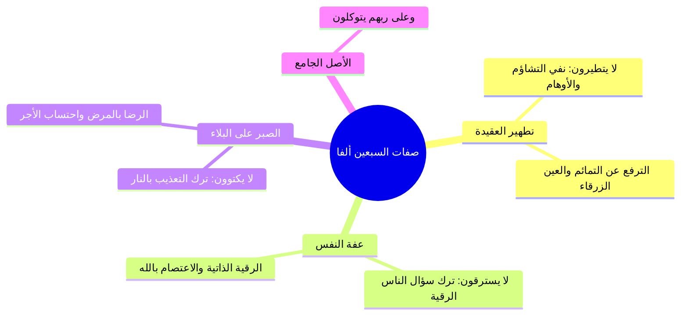

# 05 - تحقيق صفات المتوكلين والروايات في عددهم وشفاعتهم

> [!info] الفكرة المحورية
> تحقيق دقيق للألفاظ النبوية في صفات أهل التوكل الكامل: «لا يسترقون، ولا يكتوون، ولا يتطيرون، وعلى ربهم يتوكلون»؛ مع بيان علل الأحكام، ونقد رواية «لا يرقون»، وبيان هل الصفات للحصر أم للتمثيل، واستعراض روايات الزيادة والشفاعة والحثيات التي تفتح أبواب الرجاء العظيم.

---

## 🗺️ روابط الحزمة
[[04 - حديث عرض الأمم والسبعين ألفا بلا حساب ولا عذاب]] • **الجزء الحالي (05)** • [[06 - الاستغناء عن الناس وعزة المؤمن وبيعة ألا نسأل الناس شيئا]]

---

## 📝 العرض العلمي والتحليلي للمحور

### 1. التحقيق الفقهي في صفات السبعين ألفاً
1. **لا يتطيرون:**
   - `[[التطير]]` هو التشاؤم بمرئي (كالغراب أو البومة) أو مسموع أو حادث مما لم يجعله الله سبباً لضر ولا نفع.
   - هو من بقايا الشرك الجاهلي؛ فالمتوكل يعلم أن الخير والشر بيد الله وحده، فلا يرده تشاؤم عن مقصوده.
2. **لا يكتوون:**
   - `[[الاكتواء]]` هو التداوي بالكي بالنار.
   - النهي عنه ليس للتحريم بل للكراهة؛ لأنه تعذيب بنار الله، مع ثبوت رخصة النبي ﷺ فيه لأمته دون أن يستعمله في نفسه قط، فتركه من كمال التوكل والتسليم.
3. **لا يسترقون:**
   - الألف والسين والتاء للطلب؛ أي **لا يطلبون من أحد أن يرقيهم**.
   - علة النهي: صيانة القلب عن ذل سؤال المخلوقين والتضعضع بين أيديهم؛ فالمؤمن يرقي نفسه وأهله بنفسه توكلاً على الله.
4. **وعلى ربهم يتوكلون:**
   - هي الأصل الجامع؛ وسواء عُدّت صفة رابعة (عطف عام على خاص) أو صفة كاشفة مفسرة لما سبق، فالمدار كله على صدق الاعتماد على الله.

### 2. تحقيق الشيخ في رواية «لا يرقون»
- انفرد مسلم بإخراج لفظ «لا يرقون» في إحدى الروايات.
- حقق المحققون كشيخ الإسلام **ابن تيمية** والحافظ ابن حجر أن هذا اللفظ **شاذ غير محفوظ**؛ لأن رقية المسلم لأخيه إحسان وبذل للمعروف أمر به الشارع، ولا يمكن للإحسان أن يكون سبباً للحرمان من منزلة السبعين ألفاً، وإنما المحفوظ هو: «لا يسترقون».

### 3. هل الصفات للحصر أم للمثال؟
- رجح الشيخ أحمد السيد أن هذه الصفات **ليست للحصر بل هي أمثلة كبرى على كمال التوكل**.
- كل ما شابه هذه الأفعال في التعلق بالأوهام (كالخرزة الزرقاء، وحظك اليوم، والتمائم) أو سؤال الناس المذموم والافتقار إليهم؛ فإنه يقدح في منازل هؤلاء ويخرج العبد من صفوتهم حتى لو اجتنب الكي والرقى لفظياً.

### 4. روايات الزيادة والشفاعة وسعة الفضل
- لم ينحصر الفضل في الـ 70 ألفاً فقط؛ بل صحت أحاديث جودها الحافظ ابن حجر وغيره تثبت مضاعفات عظيمة:
  1. **حديث أبي هريرة (مسند أحمد):** «فاستزدت ربي فزادني مع كل ألف سبعين ألفاً».
  2. **حديث عتبة بن عبد (الطبراني وابن حبان):** «ثم يشفع كل ألف في سبعين ألفاً، ثم يحثي ربي ثلاث حثيات بكفيه».
  3. **حديث أبي أمامة (جامع الترمذي):** «وعدني ربي أن يدخل الجنة من أمتي سبعين ألفاً لا حساب عليهم ولا عذاب، مع كل ألف سبعون ألفاً وثلاث حثيات من حثيات ربي».
- حاصل الضرب (70 × 70,000) يقارب **خمسة ملايين (4,900,000)** نفس، عدا ما يفيض به الكرم الإلهي في الحثيات الثلاث التي لا يحيط بقدرها إلا الله.

---

## 📊 الجداول والتحقيقات

| المسألة | القول الراجح | التعليل والبرهان |
|:---|:---|:---|
| **لفظ «لا يرقون»** | شاذ معلول. | رقية الغير إحسان مأمور به، والإحسان لا يحط من درجات الفضل. |
| **العدد (70 ألفاً)** | عدد مقصود له زيادات بالروايات. | وردت روايات صحيحة بالزيادة مع كل ألف سبعون ألفاً. |
| **حكم الاسترقاء** | خلاف الأولى وينافي كمال التوكل. | لاشتماله على سؤال المخلوق والافتقار إلى غير الله. |

> ⚠️ تنبيه
> ا احذر من توهم أن ترك التداوي كله مشروع؛ فالتداوي بالأسباب المباحة مشروع وسنّة نبوية، والمنهي عنه في الحديث هو ما كان تعذيباً بالنار كالكي، أو سؤالاً للناس يذل القلب كالاسترقاء.
