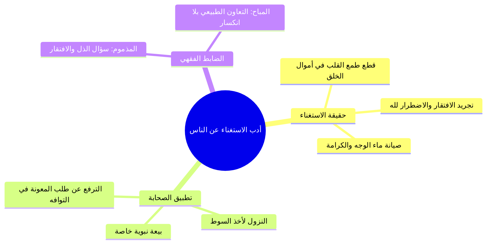

# 06 - الاستغناء عن الناس وعزة المؤمن وبيعة ألا نسأل الناس شيئا

> [!info] الفكرة المحورية
> أعظم ثمار **[[التوكل]]** الصادق هو **[[الاستغناء عن الناس]]** وتجريد الافتقار لمولى النعم وحده؛ وقد بايع النبي ﷺ خيار أصحابه على «ألا يسألوا الناس شيئاً»، فصانوا وجوههم عن ذل السؤال حتى في أيسر الأشياء، مما رسخ في نفوسهم عزة الإيمان وكرامة التوحيد.

---

## 🗺️ روابط الحزمة
[[05 - تحقيق صفات المتوكلين والروايات في عددهم وشفاعتهم]] • **الجزء الحالي (06)** • [[07 - شواهد التوكل ونصرة المعتصمين بالله - البخاري والحجاج ومواقف السير]]

---

## 📝 العرض العلمي والتحليلي للمحور

### 1. بيعة الاستغناء في صحيح مسلم
- روى مسلم في صحيحه أن النبي ﷺ قال لنفر من أصحابه:
  > «أَلاَ تُبَايِعُونَ رَسُولَ اللَّهِ؟ فَبَسَطْنَا أَيْدِيَنَا وَقُلْنَا: قَدْ بَايَعْنَاكَ يَا رَسُولَ اللَّهِ، فَعَلاَمَ نُبَايِعُكَ؟ قَالَ: عَلَى أَنْ تَعْبُدُوا اللَّهَ وَلاَ تُشْرِكُوا بِهِ شَيْئاً، وَالصَّلَوَاتِ الْخَمْسِ، وَتُطِيعُوا... وَأَسَرَّ كَلِمَةً خَفِيَّةً: **وَلاَ تَسْأَلُوا النَّاسَ شَيْئاً**».
- **التطبيق الصارم للصحابة:** قال الراوي: «فَلَقَدْ رَأَيْتُ بَعْضَ أُولَئِكَ النَّفَرِ يَسْقُطُ سَوْطُ أَحَدِهِمْ فَمَا يَسْأَلُ أَحَداً يُنَاوِلُهُ إِيَّاهُ»؛ بل ينيخ بعيره وينزل بنفسه ليتناول سوطه وفاءً بالبيعة وصيانةً لعزة النفس.

### 2. التحرير الفقهي لضابط السؤال المذموم والمباح
- **السؤال المذموم شرعاً:**
  - هو ما اشتمل على ذل، وتضعضع، وانكسار قلبي أمام المخلوق، وطلب الأموال أو الشفاعات أو الرقى بتملق؛ فهذا خادش لكمال التوحيد والتوكل.
- **السؤال العادي المباح:**
  - هو الطلب المعتاد في شؤون المعيشة بين الأهل والإخوان أو من الأعلى للأدنى (كطلب الأب من ابنه أن يناوله ماء، أو طلب المعلم من تلميذه).
  - استدل الفقهاء بما ثبت أن النبي ﷺ قال لعائشة رضي الله عنها: «ناوليني الخُمْرة من المسجد»؛ فمثل هذا لا ذل فيه ولا يقدح في التوكل.

---

## 📊 الجداول والمقارنات

| وجه المقارنة | السؤال المذموم (المنافِي لكمال التوكل) | السؤال المباح (التعاون الجائز) |
|:---|:---|:---|
| **حركة القلب** | التفات إلى المخلوق بافتقار وتذلل ورجاء. | سلامة القلب وتجريد التوكل، ومجرد الاستعانة بالمعروف. |
| **طبيعة الطلب** | سؤال أموال، رقى، شفاعات، أو قضاء حوائج بذل. | طلب خدمة معتادة بين الأهل والرفاق (ناولني كذا). |
| **المثال التطبيقي** | الاسترقاء (طلب الرقية من الناس)، مد اليد. | قول النبي لعائشة: «ناوليني الخمرة»، طلب الأب من ابنه. |

> ⚠️ تنبيه
> ا احذر من كثرة الشكوى للناس؛ فإن الشكوى لغير الله مذلة، ومن شكا ربه للمخلوقين فقد سفه نفسه وحُرم معونة مولاه.
