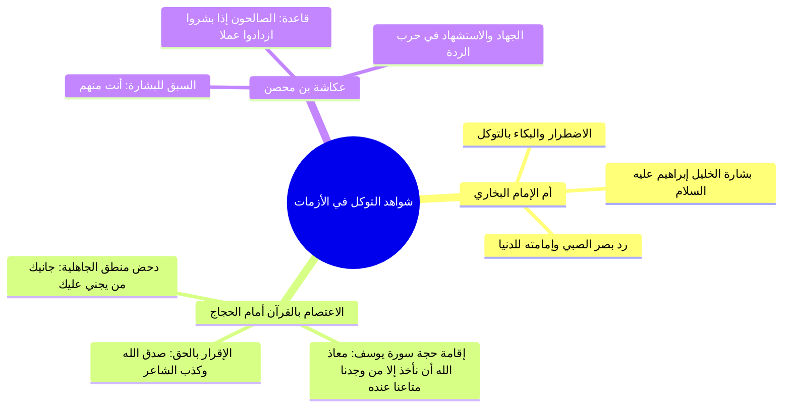

# 07 - شواهد التوكل ونصرة المعتصمين بالله - البخاري والحجاج ومواقف السير

> [!info] الفكرة المحورية
> شواهد تاريخية ونماذج عملية حية تبرز قوة **[[التوكل]]** والاعتصام بالركن الشديد؛ من يقين أم الإمام البخاري في رد بصر ابنها، إلى قوة حجة المظلومين أمام الأمراء والحجاج بن يوسف بسلطان القرآن، إلى مسلك الصحابي الجليل **[[عكاشة بن محصن]]** في تحويل البشارة بالجنة إلى وقود للجهاد والشهادة.

---

## 🗺️ روابط الحزمة
[[06 - الاستغناء عن الناس وعزة المؤمن وبيعة ألا نسأل الناس شيئا]] • **الجزء الحالي (07)** • [[08 - ملخص المراجعة السريعة]]

---

## 📝 العرض العلمي والتحليلي للمحور

### 1. يقين أم الإمام البخاري وبركة التوكل والدعاء
- ابتُلي الإمام محمد بن إسماعيل البخاري في صغره بفقدان بصره؛ فما كان من أمه الصالحة إلا أن قامت الليل تتضرع وتبكي بحرقة واضطرار وتوكل مطلق على كاشف الضر سبحانه.
- فرأت الخليل إبراهيم عليه السلام في المنام يبشرها: **«يا هذه، قد رد الله على ابنك بصره بكثرة دعائك!»**، فأصبح الغلام بصيراً بإذن ربه.
- وصار إمام الدنيا في الحديث؛ وصنف صحيحه النبوي في الروضة الشريفة على ضوء القمر، وكان يستخير الله ويصلي ركعتين قبل إيداع أي حديث في كتابه.

### 2. سلطان القرآن أمام الجبابرة: الحجاج والمظلوم
- قصة المظلوم مع الحاكم: حين سأله إن أتاه بكتاب من الخليفة بشاهدين أيعتقه؟ فلما قال نعم، احتج بكتاب رب العالمين بشهادة موسى وإبراهيم: ﴿أَمْ لَمْ يُنَبَّأْ بِمَا فِي صُحُفِ مُوسَى * وَإِبْرَاهِيمَ الَّذِي وَفَّى * أَلَّا تَزِرُ وَازِرَةٌ وِزْرَ أُخْرَى﴾ فأطلقه الحاكم إجلالاً لله.
- **مواجهة الحجاج بن يوسف الثقفي:**
  - هُدمت دار رجل وحُرم من عطائه في بيت المال بجريرة أحد أقاربه، واحتج الحجاج ببيت شعر جاهلي:
    > جانيك من يجني عليك وقد ... يُعدي الصحاحَ مباركُ الجَرَبِ!
  - فرد عليه الرجل الموفق المعتصم بالقرآن مستشهداً بسورة يوسف:
    > ﴿قَالُوا يَا أَيُّهَا الْعَزِيزُ إِنَّ لَهُ أَبًا شَيْخًا كَبِيرًا فَخُذْ أَحَدَنَا مَكَانَهُ إِنَّا نَرَاكَ مِنَ الْمُحْسِنِينَ * قَالَ مَعَاذَ اللَّهِ أَن نَّأْخُذَ إِلَّا مَن وَجَدْنَا مَتَاعَنَا عِندَهُ إِنَّا إِذًا لَّظَالِمُونَ﴾.
  - فخضع الحجاج لسلطان الحق، وأمر ببناء داره وإعطائه عطاءه، وأمر منادياً ينادي أمام الناس: **«صدق الله وكذب الشاعر!»**.

### 3. سيرة عكاشة بن محصن: الصالحون إذا بُشروا ازدادوا عملاً
- سبق عكاشة رضي الله عنه بطلب الدعاء من النبي ﷺ: «ادع الله أن يجعلني منهم، فقال: أنت منهم»، وقال للثاني: «سبقك بها عكاشة».
- **منهج أهل الإيمان:** البشارة بالجنة ليست مسوغاً للكسل أو القعود كما يظن البطالون؛ فعكاشة شهد المشاهد كلها، وفي حروب الردة خرج في طليعة جيش خالد بن الوليد لمواجهة طليحة الأسدي حتى استشهد في سبيل الله هو وثابت بن أقرم رضي الله عنهما.

---

## 📊 الدروس والفوائد المستنبطة

| الشاهد | العبرة الإيمانية | التطبيق المعاصر |
|:---|:---|:---|
| **دعاء أم البخاري** | التوكل والدعاء يردان القضاء ويصنعان المستحيل بإذن الله. | عدم اليأس من شفاء الأمراض المستعصية واللجوء لله بصدق. |
| **موقف المظلوم مع الحجاج** | من اعتصم بالقرآن أوتي الحجة وقهر الباطل. | تقديم شريعة الله والعدل الإلهي على الأعراف والعادات الظالمة. |
| **استشهاد عكاشة** | بشائر النعيم والرجاء توجب مضاعفة العمل والشكر. | عدم الركون إلى مجرد الرجاء ومواصلة الطاعة حتى الوفاة. |

> ⚠️ تنبيه
> ا احذر من عقلية «البطالين»؛ الذين يجعلون الرجاء ومغفرة الذنوب ذريعة للبطالة وترك الفرائض، فالصالحون كلما زادت بشاراتهم زاد خوفهم وعملهم وشكرهم.
