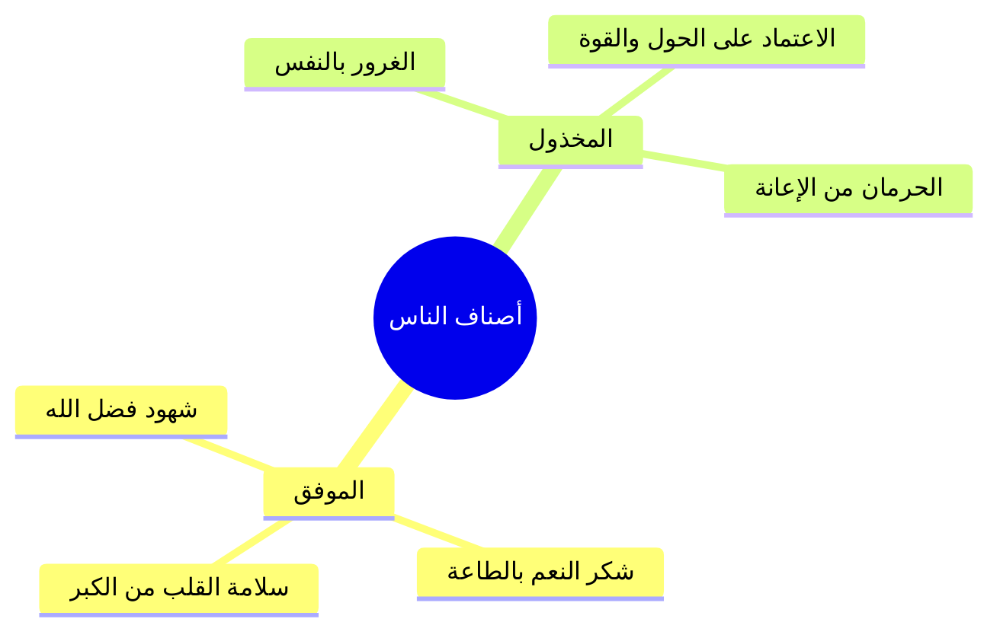

# الجزء الأول: قصة الغلام في طريق اليمن ومفهوم التوفيق والتعلق بالله

> **خطة أجزاء ملخص محاضرة (ركنى الشديد 16 - بأي قلب نلقاه):**
> - **الجزء 1 (الحالي):** قصة الغلام في طريق اليمن ومفهوم التوفيق والتعلق بالله (الأسطر: 1 - 112).
> - **الجزء 2:** شواهد التوكل والاعتماد على الركن الشديد في الشدائد (الأسطر: 113 - 189).
> - **الملف المجمع:** ركنى الشديد 16_ملف_مجمع.md.
> - **الملحق العملي:** خطة تطبيق الدروس.md.

---

## 1. قصة محمد بن سليمان القرشي مع الغلام وأخته في طريق اليمن [الأسطر: 1 - 52]

### الملخص العلمي المنظم

- استفتح المتحدث بذكر قصة أوردها ابن الجوزي في كتاب «صفة الصفوة» عن **محمد بن سليمان القرشي** أثناء سفره في طريق اليمن، حيث رأى غلاماً يرتجز شعراً يفتخر فيه بمليك السماء.
- بيان سُنّة العرب ومكارم أخلاقهم في `[[إكرام الضيف]]`؛ إذ كان الغلام على مذهب الخليل إبراهيم عليه السلام لا يتغذى ولا يتعشى حتى يسير الميل والميلين التماساً لضيف، مؤكداً أن النبي صلى الله عليه وسلم بُعث ليتمم مكارم الأخلاق.
- موقف أخت الغلام عند قدوم الضيف؛ حيث استقبلت النعمة بصلاة ركعتين شكراً لله تعالى على تيسير الضيف قبل الشروع في خدمته وطعامه.
- التنبيه على حفظ الحواس وحرمة النظر المحرم؛ حيث نبّهت الفتاة الضيف بأدب نبوي رفيع لما استرق النظر إليها بأن «زنا العينين النظر» تأديباً له.
- قيام الليل ودويّ القرآن؛ إذ كان الغلام يبيت بالخارج مع الضيف بينما أخته تحيي الليل بتلاوة القرآن الكريم بصوت حسن خاشع.
- تقرير الحقيقة الفاصلة على لسان الغلام: **الناس صنفان: موفق ومخذول**.

### المصطلحات والتعريفات

| المصطلح | التعريف العلمي |
| :--- | :--- |
| `[[التوفيق]]` | ا أن يكلك الله سبحانه وتعالى إلى فضله ومعونته ورحمته، وألا يكلك إلى نفسك طرفة عين. |
| `[[الخذلان]]` | ا أن يخلي الله بين العبد وبين نفسه وقدرته وحوله المحدود، فيعجز ويضل. |
| `[[إكرام الضيف]]` | ا خلق إيماني عظيم وبرهان على رسوخ الإيمان بالله واليوم الآخر كما جاء في الحديث النبوي. |

### التصنيفات: أصناف الناس في مسألة التوفيق

| الصنف | حاله وعلامته | المآل والنتيجة |
| :--- | :--- | :--- |
| **الموفّق** | من شملته رحمة الله، فلا ينسب العمل لنفسه، وتفيض عليه ألطاف التيسير في الطاعات والأزمات. | السداد والنجاة وحصول المطلوب بخير وسكينة. |
| **المخذول** | من اعتمد على حوله وذكائه وعلاقاته، وتجرّد قلبه من شهود فضل ربه. | العجز والاضطراب والضياع عند أول اختبار حقيقي. |

### الأخطاء والتحذيرات

> ⚠️ تنبيه
> ا التحذير من إطلاق البصر واستحسان المحرمات؛ فإن زنا العينين النظر، والواجب على المؤمن غض بصره في كل الأحوال تعظيماً لحدود الله.

### نص المتحدث الكامل [الأسطر: 1 - 52]

السلام عليكم ورحمه الله وبركاته 

الحمد لله العالمين له الحمد الحسن والثناء الجميل واشهد ان لا اله الا الله وحده لا شريك له واشهد ان محمدا عبده ورسوله 

وبعد يسمى **محمد بن سليمان القرشي** يقول بينما انا اسير في طريق اليمن حتى هذه القصه ابن الجوزي في صفه الصفوه يقول محمد ابن سليمان القرشي 

بينما انا اسير في طريق اليمن اذانا بغلا مواقف في الطريق يقول وهو يم دربه بابيات من الشعر 

ويقول مليك في السماء به افتخار عزيز القدر ليس به خفاء اعدم ولم ليك في السماء به افتخار اعظم نفتخر به عزيز القدر ليس به خفاء 

فالرجل ذاك كذا من البدايه كلامي كويس خلف دنوت منه وسلمت عليه وتكلمت معه 

فاذا هو يقول ما انا براد عليك حتى تؤدي من حق ما يجب على عاليه 

يعني احنا استعرضنا بعض تلحق وبتاع والكلام ده قلت وما حقق قال انا غلام على مذهب ابي ابراهيم الخليل صلى الله عليه وسلم لا اتغذى ولا تعايش كل يوم حتى اسير الليل والميل في طلب الضيف يقول انا كل يوم لديكم غلبت عشر ثلاثة ضيف العرب كان يقولوا للغلام لو قلت له ضيف في عرض هو العرض الدكاتره اجماع الشركات التي 

الادويه تضحك على الدكتور وت تخليه يكتبوا بتاعك كلامي الموضوع سواء تضحك عليه او تصنيعه يعني المهم عمل وارضهم مكان وزمان بيعملوا يولوا كل ما اتيته تضيف اذا اتيت ضيف ان تحفظ الجيب ليضيف ان الله يولع نار كدا عشان الناس تيجي التهمه كفارا النبي صلى ماتي ليتمم مكارم الاخلاق عندهم كان عندهم مش هامه عندهم حاجات كده يعني لما قيل يعني لما حاصروا النبي صلى الله عليه وسلم وهو في بيته اثناء رحله الهجره 

فكم من ضمن الاشياء يعني هما بدوا يشوف طيب اكيد صاحبها يكون عارف كل حاجه عن روح نشوف ابو بكر فلما راح وابو بكر والكلام ده كله 

وكانت اسماء موجوده 

كان ابو جهل يعني والمعالي الكفار كولومبو انه مين اسماء حتى لا تتكلم العرب ان ياتي الرجال امتدت على النساء ابو جهل عملها فيها بينهم وبين بعض الكفر بنوبات عم بيعود انت اللي تمت تلك عن النساء بعيار وبعض الكفار ب حاجه زي كده كان عندهم اخلاق وقيم فمنها هذه القيمه لانهم يضيفوا الناس فقال انا لا اتعدى ولا حتى يسير الميل والميلين فياتي بضيف فاجبته فرحب بي وصرت معه حتى اقتربنا من خيمه كلما اقتربنا صاح يا اختي يا اختي بندر اخته فاجابته جاريه من الداخل 

قالت لبيك فقال قومي الى ضيفنا خلاص واحد 

فقالت حتى ابدا بشكر المولى الذي يسبب لنا هذا الضيف فقامت فصلت ركعتين الله شكرا ان الله اعطاه هذا الدين حاجات دمرها كما جاءت بنشوفها فى الجنه ان شاء الله النازي قال فاتني الخيمه والثانيه واخذ الغلام الشفره وبدايه نشوفها يفوق تبقى من امبارح مسخنه عشان كده من الايمان باليوم الاخر يعني من ايمانه من قوه امامك وازدياد ايمانك بالله عز وجل وباليوم الاخر ان كرم ضيفك من علامات ان ام انك عالي من الله الرحمه المهداه صلى الله عليه وسلم **من كان يؤمن بالله واليوم الاخر فليكرم ضيفه** 

وتعرضت يعرف الانسان بخيل والكريم زياره واحد طرحت صوره على طول البيت حتى الشباب اللي بروحي الجوزو يدخلوا البيوت والكلام له في احدى الاشياء المؤشرات ال على طول تكمل في البيت او لا لا تدخل بيت قبل كده يعني حاله والدنيا انهم اسال فيه شيء من حد تانى العرس والكلام دا اهرب جلدك ليه لان النبي صلى الله عليه وسلم ان بين انصار دول من سيدكم في فريق قبيله تقوله انت ومين كركوك 

قال ان هو كويسه رسول الله على ان ن ان بكره يعني قال وهل هناك ادوا من البخل بل سيدكم فلان شنوده 

نسال الله العفو والعافيه 

المهم هذا الرجل قام واخذ الشفره واخذ علاقه ليتبعها فلماذا لست في الخيمه نظرت الى احسن الناس وجها يولي البنت ما شاء الله الشهري 

قالت كنت اسالها النظر اخذ قال ففضلت لبعض لحظات اليها فقالت ما اما علمت انه قد نقل الينا عن صاحب يسرب صلى الله عليه وسلم **ان زنا العينين النظر** 

اما اني ما اردت بهذا ان اوبك 

ولكن انا ادبك لكي لا تعود الى مثل هذا ان يقول فلما كان النووي 

انت تعرفين المسافر الشريعه جعلت للضيافه كم يوم ثلاثة ايام الكلام ده موجود الى الان عند الناس المحترمه اللي عرفوا الاصول عند العرب والعرف الدين كويس تنتهي مضيه في هذا الرجل قالولك قالت فلما جاء انه ما بدو انا والغلام خارجا والجاريه ذاته في الداخل 

وكنت اسمع ذوي القران قراتك غير ما شاء الله قليل قال باحسن صوت تسمعهم فلما اصبحت قلت للغلام صوت من كان ذلك من صوت منذ قالت لك اخت تحيي الليله كله اختيرت مفتوح لها في البلدات وانتصر لك ده ومش عارفه والكرامه 

فقلت يا غلام 

انت احق بهذا العمل من اختك انت رجل وهي امراه الكلام ده هو درس اليوم 

فتبسم وقال له وهي حكايتي **اما علمت ان الناس صنفان موفق ومخزون موفق ومخزون**

---

## 2. حقيقة التوكل وحصر التوفيق بالله والتحذير من التعلق بالأسباب [الأسطر: 53 - 112]

### الملخص العلمي المنظم

- إيضاح سر التوفيق؛ التوفيق هو ألا يَكِلَك الله إلى نفسك طرفة عين، وإلقاء عصا موسى عليه السلام كان تعليماً للقلب في طرح الأسباب المعتادة والاعتماد الكلي على `[[الركن الشديد]]` وهو الله العزيز الذي لا يُغلب.
- حصر التوفيق في الله وحده كما نطق به نبي الله يعقوب وشعيب عليهما السلام: ا ﴿وَمَا تَوْفِيقِي إِلَّا بِاللَّهِ عَلَيْهِ تَوَكَّلْتُ وَإِلَيْهِ أُنِيبُ﴾؛ فالأنبياء مع عظم مكانتهم لا يرون حصول المطلوب واندفاع المكروه إلا بالله.
- التحذير الشديد من فتنة الاعتماد على الأسباب الدنيوية (كالوساطات، الرخص، العلاقات، أصحاب المناصب والجاه)، فإن من ركن إلى سبب خُذل من جهته.
- التحذير من مقالة قارون وفرعون: ا ﴿إِنَّمَا أُوتِيتُهُ عَلَى عِلْمٍ عِندِي﴾؛ ونسب النعمة إلى الحول الشخصي والتدبير الذاتي، وبيان عاقبة فرعون الذي افتخر بالأنهار تجري من تحته فأجرى الله الماء من فوقه وأغرقه.
- الأدب النبوي في نسبة الفضل لله دائماً كما تجلى في مقالة يوسف عليه السلام عند خروجه من السجن: ا ﴿وَقَدْ أَحْسَنَ بِي إِذْ أَخْرَجَنِي مِنَ السِّجْنِ وَجَاءَ بِكُم مِّنَ الْبَدْوِ﴾؛ فنسب الإحسان والخروج لله وحده ولم يقل خرجت بحيلتي أو وفقت بذكائي.
- شهود يد القدرة والمنعم في كل ما نتقلب فيه من آيات محسوسة: خَلْق النطف، الزرع والحرث، إنزال الماء؛ فالعبد ليس له إلا مجرد مباشرة السبب والله هو الخالق الرازق وحده.

### القواعد الإيمانية

> 💡 قاعدة إيمانية
> ا الأخذ بالسبب واجب شرعاً وعقلاً، ولكن التعلق القلبي يجب أن يكون بربّ السبب وحده؛ ومن انشغل بالنعمة عن المنعم استدرج.

### الأمثلة الواقعية الواردة في كلام المتحدث

| المثال | دلالته وتطبيقه |
| :--- | :--- |
| **سحب رخصة المرور والمخالفة** | اتكال السائق على معرفة شخص ذي منصب يخلصه، فإذا به يعجز أو يخذل. |
| **حقائب المطار والوساطة** | ثقة المسافر في عميد بالمطار لتجاوز الوزن الزائد، فإذا بالحقائب تُفرز وتنكشف الحيلة ويظهر العجز. |
| **استكبار فرعون بالأنهار** | افتخر بجريان النيل تحت قصره، فقلب الله عليه الآية وأجرى البحر من فوقه فأهلكه. |
| **خروج يوسف عليه السلام** | لم ينسب النجاة لعرضه لتأويل الرؤيا أو لحيلته، بل شهد فضل الله: ﴿أحسن بي إذ أخرجني من السجن﴾. |

### الأخطاء والتحذيرات

> ⚠️ تنبيه
> ا إياك أن تقول: «أنا فعلت»، «بذكائي نجحت»، «بخبرتي جمعت المال»؛ فإن هذه صيغة قارونية تؤدي إلى سلب التوفيق والخذلان السريع.

### نص المتحدث الكامل [الأسطر: 53 - 112]

ان الانسان يكون موفق دا من نعم الله العاجل لك قصد ان يدعم موفقين والتوفيق ان ياكلك الله اليه تبذل ان ان يكلك الى نفسك قيل احدى اسرار القها سيدنا موسى ما تلك وما تلك بيمينك البارح في الترويح سمعتها بدا يعدد فعلا على غنمي القيام من احدى الفوائد واللطائف في هذه الايه القضيه موسى اترك هذه الاسباب خاص وعن غيرها لك حاجه خالص انكتب وتعتمد على **الركن الشديد** على العزيز الذي لا يهزم ان تعتمد عبد الله عز وجل 

ربنا قصرين في كتابه قصه عقود 

وكان مما قاله يعقوب هذا القلب الاسير قال هو **وما توفيقي الا بالله** 

الله اكبر 

نبي مؤيد بالوحي من السماء له صله مع الله يحصر التوفيق تماما يقول انا لا ابلغ مقصوده ابدا ولا تحصل على مطلوب الا بالله 

دائما يكون عندك التعلق **باي قلب نلقاه** بقلب متعلق به كديما قلبه متعلق واحد مثلا رخصه سحبت انكماش عكس اتجاه السير وماشي فوق الناس بيقولوا الرخصه الساحه التلوث اللي مشغل اللي صحه عامه يجب للحاجه هو معتمد عامين على هذا الرجل كان احد اخواننا شابه يعني في يوم اليان كان 

وهو راجع بعد ما الهدايا وبتاع فاحد الافاضل اللغه اللي قلت من المطار 

هكذا عبدين الوزن المسافه الله العميد بولاندا عريبي وداعه في المطار ممكن يعدي الطياره نفسها صاحبنا يحطوا يحط فهو داخل عشان وزن وبتاع والكلام لازم ي للمعلمين على عم يدير انما راحت الشروط الثانيه واحد من شروطها ايها العميد فلان وفلان وفلان فلان 

سبحان الله معنا الكلام ده اللي احنا وزير نقول انك **دائما تاخذ بالسبب وقلبه متعلق برب السبب** ايا كان تنشغل بالنعمه عن المنعم اعطاك نعمه شيخان كره عرضيه مكيفه والناس مش على مش لاقيين اي حاجه 

وشكرا 

وبعد مت متعلق بالحاجه بوسط فيها ومش عارفه وانا ومش عارف **اوتيته على علم عندي** انا كنت بفكر سنه كانت بيعملوها زال ي تدخل في الدوائر فان الدوائر عليكم 

اهلكت ابليس وفرعون وقارون **اليس لي ملك مصر وهذه الانهار تجري من تحتي** 

يعني عسكري النهر الجانب العسكري تحتاج العسكر وهي واحد كان معادي من تحته 

سيد الكل 

احنا شايفين كان بيقول كلام جميل جدا يوفر عون ونصر يفتخر بين يفتخر باننا ان الله عز وجل 

لاجراء انه يجري ما اجراء ويفتخر بان ما جرى هو مش هو اللي قرات ال جراء يعني ما اقراه 

سبحان الله 

المهم اللي حصلت ربما خلال ما يجري من فوقه واغراقه في اليمن 

فهو فكره انه الانسان يكون شايف ان الحاجه دى بتاعتى انا اللي عملتها لا ما تقول شي انا اللي عملته وال ربي وفقني فيها 

ربي وفقني 

ونجحت ربي وفقني مشتريه العقار ده ربنا وفقنا كده 

شوف ال الانسان عما يكون متعلق بالله الفاضل تتحسن سيدنا يوسف لم اطلع من السجن القومي **احسن بي اذ اخرجني من السجن** 

كان ممكن وطلعت من السجن هو شايف انه في حدا خرجوا وجيده من البدو صحيت وانت اللي بيقول لك 

وجاء بكم 

هو اللي جابكم 

الله اكبر 

الجمال ده 

فدائما قلبه متعلق ويشهد افعال مين اللي رضخ الولد الله عز وجل 

شكرا 

ربنا احيانا في حاجه كثيرا حتى في العاده سمعه كثير معنا شي نهتم بمعاني في حاجات عم نشوفها كثير من برنامج الولد **افرايتم ما تمنون اانتم تخلقونه ام نحن الخالقون** الزرعه اللي انت زرعت هذه **رايتم ما تحرثون اانتم تزرعونه** المايه تسريب هذ ه اللي قبلك الميادين من المدن مين انت مين انت دائما المعاديه عم اتطرق قلبك تعتمد على ربك تخبا لك

---

## إحصائيات الإنجاز للجزء الأول

- **إجمالي عدد الأجزاء:** جزآن (2).
- **الجزء الحالي:** الجزء الأول (1).
- **الأجزاء المتبقية:** جزء واحد (1) + الملف المجمع + خطة تطبيق الدروس.
