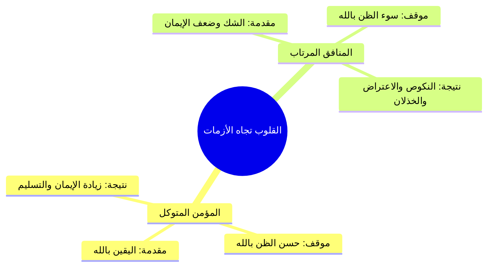

# الجزء الأول: مقدمة الباب والعلاقة بين اليقين والتوكل وحسن الظن في الأزمات

> **خطة أجزاء ملخص (رياض الصالحين 17 | باب اليقين والتوكل 1 | أنوار السنة المحمدية | أحمد السيد):**
> - **الجزء 1 (الحالي):** مقدمة الباب والعلاقة بين اليقين والتوكل وحسن الظن في الأزمات.
> - **الجزء 2:** حديث عرض الأمم وخوض الصحابة في السبعين ألفاً.
> - **الجزء 3:** التحقيق الفقهي لصفات السبعين ألفاً والروايات الواردة في عددهم.
> - **الجزء 4:** الاستغناء عن الناس ومنهج الصالحين عند البشارة (عكاشة بن محصن).
> - **الملف المجمع:** رياض الصالحين 17_ملف_مجمع.md.
> - **الملحق العملي:** خطة تطبيق الدروس.md.

---

## 1. الاستشفاء بالسنة وباب اليقين والتوكل وفقه العلاقة بين أعمال القلوب

### الملخص العلمي المنظم

- استفتح الشيخ أحمد السيد المجلس السابع عشر من مجالس «أنوار السنة المحمدية» في التعليق على كتاب «رياض الصالحين» للإمام النووي رحمه الله.
- التذكير بالمقصد الأسمى من مدارسة السنة النبوية؛ وهو **الاستشفاء بالسنة ومداواة أمراض القلوب وأشواق الأرواح** وتحقيق مقتضيات العبودية الحقة لله تعالى.
- استعراض صنيع الإمام النووي في ترجمة الباب: «باب في اليقين والتوكل»؛ حيث جمع بين عملين قلبيين جليلين على خلاف غالب أبواب الكتاب التي يقتصر فيها على لفظ مفرد.
- تقرير أصل منهجي عظيم وهو: `[[فقه العلاقة بين أعمال القلوب]]`؛ فاليقين والتوكل عملان قلبيان، واليقين يعد **مقدمة ضرورية وركيزة أساسية** للتوكل؛ إذ يستحيل عقلاً وشرعاً قيام التوكل وتفويض الأمر لمن لا يوقن العبد بكمال قدرته وعلمه ورحمته.

### المصطلحات والتعريفات

| المصطلح | التعريف العلمي المعتمد |
| :--- | :--- |
| `[[اليقين]]` | ا استقرار الإيمان الجازم والعلم القطعي في القلب بحيث لا يخالطه شك ولا ريب؛ وهو ركيزة كل عمل قلبي. |
| `[[التوكل]]` | ا صدق اعتماد القلب على الله تعالى وتفويض الأمر إليه بالكلية في جلب المصالح ودفع المضار مع الأخذ بالأسباب المشروعة. |
| `[[أعمال القلوب]]` | ا العبادات الباطنة القائمة بالقلب كالرضا، والخوف، والرجاء، واليقين، والتوكل؛ وهي أصل أعمال الجوارح وأعظمها قدراً. |

---

## 2. الآيات المصدر بها الباب وفقه حسن الظن بالله عند اشتداد الأزمات

### الملخص العلمي المنظم

- ساق الإمام النووي جملة محكمة من الآيات القرآنية التي تؤصل للتوكل وتفويض الأمر لله:
  - آيات سورة الأحزاب: ا ﴿وَلَمَّا رَأَى الْمُؤْمِنُونَ الْأَحْزَابَ قَالُوا هَٰذَا مَا وَعَدَنَا اللَّهُ وَرَسُولُهُ وَصَدَقَ اللَّهُ وَرَسُولُهُ وَمَا زَادَهُمْ إِلَّا إِيمَانًا وَتَسْلِيمًا﴾.
  - آيات آل عمران في حمراء الأسد: ا ﴿الَّذِينَ قَالَ لَهُمُ النَّاسُ إِنَّ النَّاسَ قَدْ جَمَعُوا لَكُمْ فَاخْشَوْهُمْ فَزَادَهُمْ إِيمَانًا وَقَالُوا حَسْبُنَا اللَّهُ وَنِعْمَ الْوَكِيلُ * فَانقَلَبُوا بِنِعْمَةٍ مِّنَ اللَّهِ وَفَضْلٍ لَّمْ يَمْسَسْهُمْ سُوءٌ وَاتَّبَعُوا رِضْوَانَ اللَّهِ وَاللَّهُ ذُو فَضْلٍ عَظِيمٍ﴾.
  - الأمر الصريح بالتوكل: ا ﴿وَتَوَكَّلْ عَلَى الْحَيِّ الَّذِي لَا يَمُوتُ﴾، وا ﴿وَعَلَى اللَّهِ فَلْيَتَوَكَّلِ الْمُؤْمِنُونَ﴾، وا ﴿فَإِذَا عَزَمْتَ فَتَوَكَّلْ عَلَى اللَّهِ﴾.
  - كفاية الله للمتوكل: ا ﴿وَمَن يَتَوَكَّلْ عَلَى اللَّهِ فَهُوَ حَسْبُهُ﴾ (أي كافيه).
  - اقتران الوجل بالتوكل في صفات المؤمنين: ا ﴿إِنَّمَا الْمُؤْمِنُونَ الَّذِينَ إِذَا ذُكِرَ اللَّهُ وَجِلَتْ قُلُوبُهُمْ وَإِذَا تُلِيَتْ عَلَيْهِمْ آيَاتُهُ زَادَتْهُمْ إِيمَانًا وَعَلَىٰ رَبِّهِمْ يَتَوَكَّلُونَ﴾.
- **فقه الأزمات ومعيارية ردود الأفعال:**
  - عند اشتداد الخطوب، ينقسم الناس بحسب ما في قلوبهم إلى قسمين متضادين تجاه نفس النازلة وفي ذات البقعة الجغرافية (كما حدث في غزوة الأحزاب).
  - `[[حسن الظن بالله]]` ثمرة مباشرة للتوكل الصادق واليقين الراسخ؛ فالمؤمن إذا اشتد عليه الكرب استيقن بقرب الفرج وتحقق موعود الله.

### مقارنة علمية: حال القلوب عند اشتداد الأزمات (غزوة الأحزاب نموذجاً)

| وجه المقارنة | حال المؤمنين الصادقين | حال المنافقين وضعاف الإيمان |
| :--- | :--- | :--- |
| **المقالة واللسان** | ﴿هَٰذَا مَا وَعَدَنَا اللَّهُ وَرَسُولُهُ وَصَدَقَ اللَّهُ وَرَسُولُهُ﴾ | ﴿مَّا وَعَدَنَا اللَّهُ وَرَسُولُهُ إِلَّا غُرُورًا﴾ |
| **الأثر القلبي** | زيادة في الإيمان واليقين والتسليم لله. | ارتياب وشك واضطراب وسوء ظن بالله. |
| **ثمرة التوكل** | السكينة وحسن الظن بأن العاقبة للمتقين. | الفزع والانهيار والاتهام لتدبير الله وحكمته. |

### الأخطاء والتحذيرات

> ⚠️ تنبيه
> ا الحذر من سوء الظن بالله عند تأخر النصر أو اشتداد الكروب؛ فإن سوء الظن بالخالق صفة نفاقية مهلكة، والواجب عند احتدام الخطب تفويض الأمر إلى الله والاستمساك بـ «حسبنا الله ونعم الوكيل».

---

## 3. نص المتحدث الكامل [الجزء الأول]

الحمد لله رب العالمين حمدا كثيرا طيبا مباركا فيه الحمد لله كما ينبغي لجلال وجهه وعظيم سلطانه الحمد لله الذي له الحمد في الاولى والاخره وله الحكم اليه المصير اللهم صل على محمد وعلى ال محمد كما صليت على ابراهيم وعلى ال ابراهيم انك حميد مجيد وبارك على محمد وعلى ال محمد كما باركت على ابراهيم وعلى ال ابراهيم انك حميد مجيد اما بعد نستعين بالله ونستفتح مجلسا جديدا من مجالس انوار السنه المحمديه ومجالس الاستهداء بالسنه النبويه وهو المجلس السابع عشر من مجالس التعليق على رياض الصالحين نسال الله سبحانه وتعالى التوفيق والسداد والعون والمدد ونساله سبحانه وتعالى ان ينفعنا بما يعلمنا وان يهدينا ويسدد ن و لو تتذكرون في بدايه اللقاءات قلت هذه الم جالس يعني هي للاستشفاء بالسنه وملامسه ا حاجات القلب وحاجات الروح وضم النفس اللي تداوى وتشفى بهدي المصطفى صلى الله عليه وسلم وبهذه المعاني الايمانيه وبحق العبوديه لله سبحانه وتعالى واليوم عندنا باب هو من صميم هذه الابواب التي تتصل بمعنى الاستشفاء والهدايه وهو باب اليقين والتوكل قال فيه الامام النووي رحمه الله باب في اليقين والتوكل وقد جمع بين امرين فقال اليقين والتوكل بينما في الابواب الما السابقه كان ياتي بلفظ واحد صحيح ا فقط الباب الاول باب الاخلاص واحضار النيه وهي متقاربه لكن اليقين والتوكل كل واحد منها عمل صح ولا لا اليقين عمل قلبي والتوكل عمل قلبي فما العلاقه بينهما طبعا هناك باب اصلا عنوان شريف جدا اسمه العلاقه بين اعمال القلوب وهذا باب من ابواب الفقه في الدين ان تكتشف وتفهم وتفقه العلاقه بين هذا العمل القلبي وذاك العمل القلبي الاخر فاليقين والتوكل بينهما علاقه ايهما يعد مقدمه للاخر اليقين مقدمه للتوكل يعني هل يتصور تحقيق التوكل بلا يقين لا يتصور صح ولا لا طيب اذا هنا هذا الباب عن اليقين وعن التوكل ولما تتامل في الباب ستجد ان عامه ما فيه عن التوكل طيب قال النووي رحمه الله قال الله تعالى ولما راى المؤمنون الاحزاب قالوا هذا ما وعدنا الله ورسوله وصدق الله ورسوله وما زادهم الا ايمانا وتسليما وقال تعالى الذين قال لهم الناس ان الناس قد جمعوا لكم فاخشوهم فزادهم ايمانا وقالوا حسبنا الله ونعم الوكيل فزادهم ايمانا وقالوا حسبنا الله ونعم الوكيل فانقلبوا بنعمه من الله وفضل لم يمسسهم سوء واتبعوا رضوان الله والله ذو فضل عظيم وقال تعالى وتوكل على الحي الذي لا يموت وقال تعالى وعلى الله فليتوكل المؤمنون وقال تعالى فاذا عزمت فتوكل على الله والايات في الامر بالتوكل كثيره معلومه وقال تعالى ومن يتوكل على الله فهو حسبه اي كافيه وقال تعالى انما المؤمنون الذين اذا ذكر الله وجلت قلوبهم واذا تليت عليهم اياته زادتهم ايمانا وعلى ربهم يتوكلون والايات في فضل التوكل كثيره معروفه ما اجمل هذا وما اجمل الاستفتاح بهذه الايات القرانيه العزيزه عن قضيه التوكل وقضيه تفويض الامر لله وقضيه الاطمئنان الى الله سبحانه وتعالى اذا وكل اذا وكل الانسان امره اليه سبحانه وتعالى وكل ايه من هذه الايات فيها ما فيها من الدروس والعبر والعضات غير ان مما ينبغي ان يتفكر فيه ويتامل فيه هو كيف ان كيف كيف ان الانسان المؤمن الموقن المتوكل على الله سبحانه وتعالى كيف انه يزداد حسن ظنه بالله سبحانه وتعالى عند اشتداد الازمات مع ان اشتداد الازمات هو لغيره سبب لايش لسوء الظن بالله يعني الان حين تحدث الازمات على الانسان فانها فان الناس تجاه الازمات على قسمين منهم من يحسن ظنه بالله بسبب الازمه ومنهم من يسوء ظنه بالله بسبب الازمه نفس الازمه واحيانا مو ليس فقط نفس نوع الازمه لا احيانا نفس الازمه في نفس المكان في نفس الموقع الجغرافي بالضبط يعني موقعه الاحزاب في نفس المكان الذي كان الناس فيه مع رسول الله صلى الله عليه وسلم انقسم الناس الى قسمين قسم من المنافقين كان حاضرا يوم الاحزاب فقالوا بالنص ما وعدنا الله ورسوله الا غرورا ما وعدنا الله ورسوله الا غرورا واخرون في نفس الموضع وفي نفس المقام ماذا قالوا قالوا هذا ما وعدنا الله ورسوله وصدق الله ورسوله وما زادهم الا ايمانا وتسليما وما زادهم الا ايمانا وتسليما طيب ففائدة عباده يعني مثل ما قال باب اليقين والتوكل احنا فينا نقول باب حسن الظن بالله والتوكل او باب التوكل وحسن الظن بالله لانه من اعظم الاسباب التي تدفعك لحسن الظن بالله هو ان تتوكل عليه طيب الايات كما قال النووي رحمه الله كثيره معلومه نبدا بالاحاديث قال رحمه الله تعالى

---

## إحصائيات الإنجاز للجزء الأول

- **إجمالي عدد الأجزاء:** أربعة أجزاء (4).
- **الجزء الحالي:** الجزء الأول (1).
- **الأجزاء المتبقية:** ثلاثة أجزاء (3) + الملف المجمع + خطة تطبيق الدروس.
