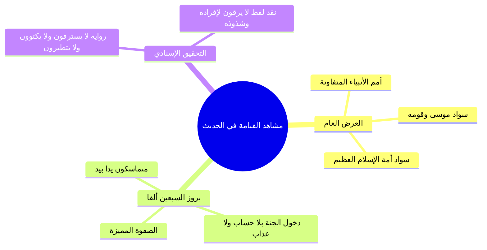

# الجزء الثاني: حديث عرض الأمم وخوض الصحابة في السبعين ألفاً

> **خطة أجزاء ملخص (رياض الصالحين 17 | باب اليقين والتوكل 1 | أنوار السنة المحمدية | أحمد السيد):**
> - **الجزء 1:** مقدمة الباب والعلاقة بين اليقين والتوكل وحسن الظن في الأزمات.
> - **الجزء 2 (الحالي):** حديث عرض الأمم وخوض الصحابة في السبعين ألفاً.
> - **الجزء 3:** التحقيق الفقهي لصفات السبعين ألفاً والروايات الواردة في عددهم.
> - **الجزء 4:** الاستغناء عن الناس ومنهج الصالحين عند البشارة (عكاشة بن محصن).
> - **الملف المجمع:** رياض الصالحين 17_ملف_مجمع.md.
> - **الملحق العملي:** خطة تطبيق الدروس.md.

---

## 1. نص حديث ابن عباس رضي الله عنهما وضبط غريب ألفاظه

### الملخص العلمي المنظم

- إيراد حديث عبد الله بن عباس رضي الله عنهما في عرض الأمم على النبي صلى الله عليه وسلم، ورؤية الأنبياء يوم القيامة وتباين عدد أتباعهم؛ فمنهم من معه الرّهيط، ومنهم من معه الرجل والرجلان، ومنهم النبي وليس معه أحد، مما يدل على أن مقياس الحق والفضل ليس بكثرة الأتباع.
- رفع السواد العظيم لموسى عليه السلام وقومه، ثم رؤية السواد الأعظم الذي سدّ الأفق لأمة محمد صلى الله عليه وسلم، ومعهم صفوة خاصة قوامها **سبعون ألفاً يدخلون الجنة بغير حساب ولا عذاب**.
- ضبط الألفاظ الغريبة الواردة في متن الحديث كما بيّنها الإمام النووي رحمه الله.

### غريب الحديث وضبط الألفاظ

| اللفظ | الضبط اللغوي والبيان الفقهي |
| :--- | :--- |
| `[[الرُّهَيْط]]` | ا بضم الراء؛ تصغير رَهْط، وهم الجماعة من الناس دون العشرة أنفس. |
| `[[الأُفُق]]` | ا بضمتين أو ضم فسكون؛ الناحية ومنتهى ما يراه البصر من أقطار السماء والأرض. |
| `[[عُكَّاشَة]]` | ا بضم العين وتشديد الكاف مع فتحها، ويجوز تخفيفها، والتشديد هو الأفصح. |

---

## 2. مشاهد يوم القيامة ودفع توهم التعارض والرابطة مع موسى عليه السلام

### الملخص العلمي المنظم

- **تعدد مشاهد القيامة ومقاماتها:** يوم القيامة يوم طويل وعظيم المقدار (خمسون ألف سنة)، وتتعدد فيه المقامات؛ فهناك مقام العرض العام الذي لا يستبين فيه النبي أعيان أمته حتى يُخبَر، وهناك مقام القرب والمعاينة حيث يعرفهم بالنور والتحجيل من أثر الوضوء.
- **العلاقة الوثيقة بين النبي صلى الله عليه وسلم وموسى عليه السلام:**
  - ظهور هذه الرابطة في حادثة المعراج ومراجعة موسى للنبي صلى الله عليه وسلم حتى خُففت الصلوات من خمسين إلى خمس.
  - كثرة أتباع موسى المؤمنين به، وظن النبي صلى الله عليه وسلم في أول الأمر أن السواد الأول هم أمته لرجائه وطمعه في سعة فضل ربه لأمته.
- **عظمة مشهد الحشر:** استحضار اجتماع مليارات البشر منذ آدم عليه السلام إلى قيام الساعة والوحوش معهم في صعيد واحد.

### مقارنة علمية: مقامات المشاهد يوم القيامة

| وجه المقارنة | مقام العرض العام | مقام القرب والمعاينة |
| :--- | :--- | :--- |
| **هيئة الرؤية** | رؤية سواد عظيم يملأ الأفق من بعيد. | رؤية الأشخاص والأعيان عن قُرب. |
| **الوسيلة المعرفية** | الإخبار من قِبل الملائكة: «هذا موسى وقومه... هذه أمتك». | المعرفة الذاتية بالنور والتحجيل من آثار الوضوء. |
| **دفع التعارض** | لا تناقض؛ لاختلاف المقامات والأوقات في اليوم الطويل. | دلالة على إكرام الأمة بالصفات الخاصة. |

---

## 3. خوض الصحابة في تعيين السبعين ألفاً والتحقيق في رواية «لا يرقون»

### الملخص العلمي المنظم

- إخبار النبي صلى الله عليه وسلم أصحابه بالسبعين ألفاً ثم دخوله منزله قبل تفصيل صفاتهم؛ لحكمة بالغة أثارت في نفوسهم التنافس والبحث عن أسباب هذا الشرف العظيم.
- تخمين الصحابة بحرص واجتهاد: لعلهم الذين صحبوا رسول الله، أو الذين ولدوا في الإسلام فلم يشركوا بالله شيئاً؛ مما يكشف عن علو همتهم وتطلعهم لمنازل الفضل.
- **الهيئة المهيبة للسبعين ألفاً:** ورد في صحيح البخاري أنهم يبرزون متماسكين، آخذاً بعضهم بيد بعض، لا يدخل أولهم حتى يدخل آخرهم على صورة القمر ليلة البدر.
- **التحقيق الحديثي في لفظ «لا يرقون»:**
  - بين الشيخ أن لفظ «لا يرقون» أخرجه مسلم من أفراده، وتكلم فيه أئمة التحقيق وعلى رأسهم شيخ الإسلام `[[ابن تيمية]]` رحمه الله.
  - تقرير شذوذ هذا اللفظ متناً؛ لأن رقية المسلم لأخيه هي من باب الإحسان ونفع المسلمين وبذل المعروف الذي حث عليه الشارع، ولا يمكن للإحسان أن يكون سبباً للحرمان من منزلة السبعين ألفاً، وإنما اللفظ المحفوظ المتفق عليه هو: «لا يسترقون».

### الأخطاء والتحذيرات

> ⚠️ تنبيه
> ا خطأ توهم ذم الراقي الشرعي؛ فالنهي والزهادة إنما هي في «الاسترقاء» وهو طلب الرقية من الناس لما فيه من تعلق القلب وسؤال المخلوقين، أما رقية الإنسان لغيره فإحسان مستحب شرعاً لا يقدح في التوكل.

---

## 4. نص المتحدث الكامل [الجزء الثاني]

اما الاحاديث فالاول عن ابن عباس رضي الله عنهما قال قال رسول الله صلى الله عليه وسلم عرضت علي الامم فرايت النبي ومعه الرهيط والنبي ومعه الرجل والرجلان والنبي ليس معه احد اذ رفع لي سواد عظيم فظننت انهم امتي فقيل لي هذا موسى وقومه ولكن انظر الى الافق فنظرت فاذا سواد عظيم فقيل لي انظر الى الافق الاخر فاذا سواد عظيم فقيل لي هذه امتك ومعهم سبون الفا يدخلون الجنه بغير حساب ولا عذاب ثم نهض فدخل منزله صلى الله عليه وسلم فخاض الناس في اولئك الذين يدخلون الجنه بغير حساب ولا عذاب فقال بعضهم فلعلهم الذين صحبوا رسول الله صلى الله عليه وسلم وقال بعضهم فلعلهم الذين ولدوا في الاسلام فلم يشركوا بالله شيئا وذكروا اشياء فخرج عليهم رسول الله صلى الله عليه وسلم فقال ما الذي تخوضون فيه فاخبروه فقال هم الذين لا يرقون ولا يسترقون ولا يتطيرون وعلى ربهم يتوكلون فقال فقام عكاشه ابن محصن فقال ادع الله ان يجعلني منهم فقال انت منهم ثم قام رجل اخر فقال ادعوا الله ان يجعلني منهم فقال سبقك بها عكاشه متفق عليه قال النووي رحمه الله الرهيط بضم الراء تصغير رهط وهم دون عشره انفس والافق الناحيه والجانب وعكاشه بضم العين وتشديد الكاف وبتخفي فها والتشديد افصح يعني عكاشه وعكاشه والتشديد اللي هو عكاش افصح طيب هذا حديث عظيم وحديث عجيب وحديث فيه فوائد كثيره وفيه دروس عظيمه وسنقف معه وقفه يعني فيها بعض التف تصيل هو يعني اكثر حديث سنقف معه اليوم ان شاء الله هو هذا الحديث هذا الحديث فيه اولا ان يوم القيامه فيه مشاهد يوم ان يوم القيامه فيه مشاهد ومن المشاهد التي في يوم القيامه مشهد عرض الامم و هذا على قول ان هذا يعني لان هو اختلف قيل انه راه النبي صلى الله عليه وسلم يوم الاسراء وقيل بغض النظر لكن هذا من المش التي تكون يوم القيامه وهذا مشهد يختلف عن المشهد الذي يعرف النبي صلى الله عليه وسلم فيه امته غرا محجلين من اثر الوضوء دائما يا جماعه الخير يوم لانه يوم القيامه يعني يوم طويل جدا احيانا الذي لا يدرك تعدد المشاهد يوم القيامه يظن ان هناك تناقضا بين بعض القضايا التي وردت فيه لكنها مقامات هناك مقام وب ي رض فيه عرض عام لا يستبين للنبي صلى الله عليه وسلم من هي امته في البدايه واما مقام القرب ورؤيه الاعيان والاشخاص فيعرف النبي صلى الله عليه وسلم امته برؤيتهم غرا محجلين من اثر الوضوء واضح طيب هناك ارتباط كثير ووثيق بين النبي صلى الله عليه وسلم وبين موسى عليه السلام وبين هذه الامه وبين امه موسى عليه السلام وذلك ان النبي صلى الله عليه وسلم لما عرج به الى السماء وفرض الله عليه 50 صلاه نزل فوصل الى موسى عليه السلام فقال موسى للنبي صلى الله عليه وسلم ان امتك لا تضيق ذلك فارجع الى ربك فاساله التخفيف فرجع محمد صلى الله عليه وسلم الى ربه فساله التخفيف فخفف ثم نزل الى موسى فقال ان امتك لا تطيق ذلك فسله التخفيف ثم رجع فسال التخفيف وهكذا حتى وصل الى خمس صلوات ولما وصل الى خمس صلوات نزل وقال له موسى ايضا ان امتك لا تطيق ذلك قال موسى عليه السلام لمحمد صلى الله عليه وسلم انا اعلم بالناس منك عالجت بني اسرائيل اشد المعالجه فقال النبي صلى الله عليه وسلم استحييت من ربي استحييت من ربي يعني خلاص ما لن اراجعه مره اخرى في ان يخفف الصلوات اقل من خمس صلوات قال الله تعالى هي خمس وهي 50 هي خمس وهي 50 يعني هي خمس في العمل والتكليف وهي 50 في الاجر وهذا من رحمه الله سبحانه وتعالى وكرمه الشاهد دائما نجد الارتباط بين موسى ومحمد صلى الله عليه وسلم في القران ويوم القيامه سيكون اتباع موسى الذين يعني امنوا به وصدقوا كثر و يعني حين يراهم النبي صلى الله عليه وسلم اول ما يراهم يظن انهم امته لكثرتهم ولطم النبي صلى الله عليه وسلم ان تكون امته كثيره يعني يطمع في رحمه الله ان يعني يدخل امته او ان تكون امه النبي صلى الله عليه وسلم المستجيب له كبيره ف ظن النبي صلى الله عليه وسلم ان السواد الاول هو هو امته ا ثم قيل له هذا موسى وقومه ثم رفع له سواد اخر وفي روايه سد الافق اه فقيل هذا هذه امتك ثم قيل له ومعهم سب ال يدخلون الجنه بلا حساب ولا عذاب كم عدد هذه الامه طبعا احنا يعني احنا ترى يمكن ما نتخيل مقدار البشريه اكيد ما نقدر نتخيل احنا نجي في مرحله معينه نقول مثلا عدد البشريه 7 مليار احنا نتكلم الان عن الحشر بشكل عام تمام بس 7 مليار هم في هذه اللحظه لكن اذا رجعت الى قبل 20 سنه اذا رجعت الى قبل 100 سنه ترى في مئات الملايين او المليارات اللي هم ما هم موجودين اصلا الان واذا رجعت الى 50 سنه قبلها ثم الى 50 ثم الى 50 ثم الى 50 ثم الى 50 الى ان تصل الى زمن النبي صلى الله عليه وسلم ثم الى ان تصل الى زمن عيسى عليه السلام ثم الى ان تصل الى زمن موسى عليه السلام ثم الى ان تصل الى زمن ابراهيم عليه السلام ثم الى ان تصل الى زمن نوح عليه السلام ثم الى ان تصل الى زمن ادم عليه السلام فانت تتكلم عن اعداد مهوله لا يستطيع ان يحصيها ولا يعلمها الا الله هؤلاء كلهم سيح شرون يوم القيامه كلهم سيح شرون يوم القيامه في صعيد واحد كلهم صغيرهم كبيرهم ذكرهم وانثاه وزياده على ذلك ستحشر معهم الحيوانات ها واذا الوحوش حشرت واذا العشار عطلت واذا الوحوش حشرت ف يوم الحشر يوم مهيب يوم مهيب وفيه كما قلت مشاهد كثيره فيه شيء يجمع كل الناس بعدين ياتي الناس الذين استجابوا اهل النار يؤمر بهم الى النار يعني مشاهد كثيره جدا فمن جمله ذلك انه في ظل هذه الاعداد الكبيره وفي ظل هذه الامه المستجيبه الواسعه يبرز السب الفا 70 الف من بين الام المستجيبه الامه المستجيبه كم هذه من وقت النبي صلى الله عليه وسلم الى الان الله اعلم كم الذين هم من المسلمين الله اعلم كم من بين هؤلاء 7000 يعني 70 الف ترى ولا شيء من ناحيه العدد بالنسبه للامه من وقت النبي صلى الله عليه وسلم الى الان ولا شيء هؤلاء السب الفا امام الجميع سيبرز سيبرز وهذا البروز هو بروز يعني لا شرف اعلى منه بروز مشرف بروز عجيب امام هذه الامم يخرج 7 الفا والعجيب انه جاء في الروايه ايضا في البخاري وفي الصحيح قال متماسك متماسك هؤلاء السبعون الفا اخذ بعضهم بيد بعض قال لاد يدخلون الجنه لا يدخل اولهم حتى يدخل اخرهم يعني ماسكن يد بعض ويدخلوا الجنه مع بعض 7 الف هؤلاء 7 ال هؤلاء يعني ايش شيء مشهد عظيم مشهد مهيب مشهد كبير مشهد مشرف عجيب جدا لما دخل النبي قال لهم النبي صلى الله عليه وسلم هذا الخبر قال لاصحابه ثم دخل البيت وما اخبرهم من هم هؤلاء السب الفا ها شوف انت عندك معلومه مسبقه الان سامع الحديث قبل كذا ومع ذلك ممكن تتعجب تقول يا ربي كذا يا واحد يفكر ف بالك الصحابه الان يسمعوها من النبي صلى الله عليه وسلم مباشره ولاول مره ثم دخل النبي صلى الله عليه وسلم البيت فمن الطبيعي ان ماذا يفعلوا ها يخوضون ويتناقشون من هم السبع الفا واخذوا يخمنون فمنهم من قال هم الذين صحبوا رسول الله صلى الله عليه وسلم طبعا الذي يقول ذلك هم ايضا من الصحابه لكن واضح ان هنا من المقصود صحبه خاصه اي يعني كان ربما الذي قال ذلك هم من اسلم متاخرا مثلا عن الذين صحبوا النبي صلى الله عليه وسلم صحبه طويله وهذا وارد في في الاحاديث يعني مثلا النبي صلى الله عليه وسلم لما قال لا تسبوا اصحابي قالها لاناس من اصحابه انه صار موقف بين صحابي اسلم مبكرا صحابي اسلم متاخرا فالثاني المتاخر سب الاول فقال النبي صلى الله عليه وسلم لا تسبوا اصحابي جيد وقال مره في مقام اخر هل انتم تاركوا ها لصاحبي مع انه الذي الشخص الاخر هو من اصحابه لكن الصحبه في صحبه خاصه فهنا اول شيء قالوا لعلهم الذين صاحبوا رسول الله صلى الله عليه وسلم يعني كانهم الذين صحبوه صحبه خاصه ولهم معه تاريخ وقال اخرون لعلهم الذين ولدوا في الاسلام فانا ولدنا في الجاهليه في روايه شوف التفكير يعني لانه هذه كل واحد جاز يفكر منين ال 70000 هؤلاء من السب الف هؤلاء ثم رجع النبي صلى الله عليه وسلم خرج اليهم قال ما الذي تخون فيه فاخبروه طبعا جاء اكثر من الروايه الروايه الاصح ليست التي اوردها النووي هنا رحمه الله هنا حتى نقل في الحاشيه انه هنا تنبيه ان يعني انه هذه الروايه اللي هي لا يرقون ان من مفردات مسلم وليست متفقه وليست من المتفق عليه طيب ف ولم يولد لفظ ايش اللي هو ايش لم يرد لفظ يكتوون لا ورد يتطيرون لكن ل لم يرد لفظ يكتوون ف يعني كان الاولى ان ان ياتي باللفظ الاصح اللي هو هم الذين لا يسترقون ولا ولا يكتوون ولا يتطيرون وعلى ربهم يتوكلون اما لفظ لا يرقون فاختلف العلماء في صح ه وان كان قد اخرجه المسلم في روايه فمن العلماء من راى انه لفظ شاذ لا يصح هذا اللفظ وحده و من باب يعني حتى من باب او خلينا نقول الاساس باعتبار المتن ومن ابرزهم ابن تيميه رحمه الله تعالى فكان يرى ان هذا اللفظ غير صحيح وذلك انه يقول يرقون ليس هناك اشكال في يرقون لان كونهم يرقون غيرهم فهذا من باب الاحسان الى الناس ولا يمكن ان يكون الاحسان سببا في التاخير عن منزله 7 الفا طيب قال النبي صلى الله عليه وسلم هم الذين لا يسترقون ولا يكتوون ولا يتطيرون وعلى ربهم يتوكلون

---

## إحصائيات الإنجاز للجزء الثاني

- **إجمالي عدد الأجزاء:** أربعة أجزاء (4).
- **الجزء الحالي:** الجزء الثاني (2).
- **الأجزاء المتبقية:** جزآن (2) + الملف المجمع + خطة تطبيق الدروس.
