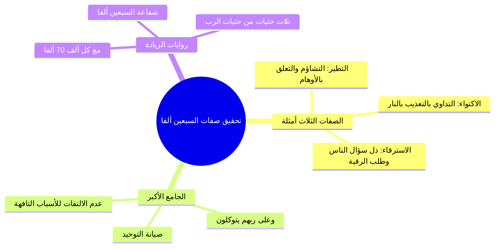

# الجزء الثالث: التحقيق الفقهي لصفات السبعين ألفاً والروايات الواردة في عددهم

> **خطة أجزاء ملخص (رياض الصالحين 17 | باب اليقين والتوكل 1 | أنوار السنة المحمدية | أحمد السيد):**
> - **الجزء 1:** مقدمة الباب والعلاقة بين اليقين والتوكل وحسن الظن في الأزمات.
> - **الجزء 2:** حديث عرض الأمم وخوض الصحابة في السبعين ألفاً.
> - **الجزء 3 (الحالي):** التحقيق الفقهي لصفات السبعين ألفاً والروايات الواردة في عددهم.
> - **الجزء 4:** الاستغناء عن الناس ومنهج الصالحين عند البشارة (عكاشة بن محصن).
> - **الملف المجمع:** رياض الصالحين 17_ملف_مجمع.md.
> - **الملحق العملي:** خطة تطبيق الدروس.md.

---

## 1. عدد صفات السبعين ألفاً وحقيقتها البلاغية والشرعية

### الملخص العلمي المنظم

- استعراض الألفاظ النبوية: «هم الذين لا يسترقون، ولا يكتوون، ولا يتطيرون، وعلى ربهم يتوكلون»، ومناقشة هل هي ثلاث صفات أم أربع:
  1. **القول بأنها ثلاث صفات:** قوله «وعلى ربهم يتوكلون» هي الصفة الكاشفة الجامعة والأصل، وما قبلها الثلاث مجرد أمثلة وتطبيقات عليها.
  2. **القول بأنها أربع صفات:** قوله «وعلى ربهم يتوكلون» صفة رابعة خُتم بها من باب **عطف العام على الخاص** لبيان أن كل تلك الجزئيات تندرج تحت التوكل المطلق.
- **التحقيق الفقهي في معنى كل صفة:**
  - `[[التطير]]`: التشاؤم بالمرئيات أو المسموعات أو الحركات (كالغراب، البومة، سقوط الأشياء) مما لم يجعله الله سبباً شرعياً ولا قدرياً، وهو من خصال الجاهلية القادحة في التوحيد.
  - `[[الاكتواء]]`: التداوي بالكي؛ وعلة النهي عنه كونه تعذيباً بنار الله، مع ثبوت رخصة النبي صلى الله عليه وسلم فيه للأمة دون أن يستعمله في نفسه قط، فتركه من تمام التوكل والصبر.
  - `[[الاسترقاء]]`: طلب الرقية من الناس (السين والتاء للطلب)؛ وعلة ذمه اشتماله على ذل السؤال والافتقار إلى المخلوقين والتعلق بالوسائط.

### جدول تحقيق الصفات وعللها

| الصفة | المعنى المراد | علة التنزيه عنها في الحديث |
| :--- | :--- | :--- |
| **لا يسترقون** | لا يطلبون من غيرهم أن يرقيهم. | صيانة القلب عن سؤال المخلوقين والتذلل لهم. |
| **لا يكتوون** | لا يستعملون الكي بالنار في علاج أمراضهم. | التنزه عن التعذيب بالنار والصبر على البلاء طلباً لمرضاة الله. |
| **لا يتطيرون** | لا يتشاءمون بما يقع من حوادث أو طيور أو أصوات. | اجتناب الشرك وسوء الظن بالله، وسلامة القلب من الأوهام. |
| **على ربهم يتوكلون** | تفويض الأمر كله إلى الله اعتماداً ويقيناً. | هي الأصل والجامع الحقيقي لكل الفضائل السابقة. |

---

## 2. دلالة الصفات: هل هي للحصر أم للتمثيل؟

### الملخص العلمي المنظم

- رجّح الشيخ أن هذه الصفات **ليست محصورة في هذه الثلاثة فقط، بل هي أمثلة كبرى على معنى أعظم وهو كمال التوكل والتجرد من التعلق بغير الله**.
- قياس ما يماثلها:
  - تعليق التمائم والعين الزرقاء والخرز لدفع العين هو من جنس التطير والتعلق بالأوهام.
  - كثرة سؤال الناس وبذل الوجه في الحاجات والشفاعات والمال هو من صميم سؤال الناس المذموم في الاسترقاء.
- تقرير أصل عقدي مهم: من ترك هذه الثلاث بظاهرها لكنه يقع في سؤال الناس أو يعلق قلبه بالأسباب الواهية لم يكن من السبعين ألفاً؛ لأن العبرة بحقيقة التوكل التام.

---

## 3. مسألة عدد السبعين ألفاً وروايات الزيادة والشفاعة

### الملخص العلمي المنظم

- تحقيق مسألة هل العدد (70 ألفاً) هو للحصر أم للتكثير: الراجح أنه عدد مقصود لذاته وليس لمجرد التكثير كما ظن بعض الشراح.
- **روايات الزيادة التي جود أسانيدها الحافظ ابن حجر رحمه الله:**
  1. حديث أبي هريرة رضي الله عنه عند الإمام أحمد: «فاستزدت فزادني مع كل ألف سبعين ألفاً».
  2. حديث عتبة بن عبد رضي الله عنه عند الطبراني وابن حبان: «ثم يشفع كل ألف في سبعين ألفاً، ثم يحثي ربي ثلاث حثيات بكفيه».
  3. حديث أبي أمامة الباهلي رضي الله عنه عند الترمذي (وإسناده جيد): «وعدني ربي أن يدخل الجنة من أمتي سبعين ألفاً لا حساب عليهم ولا عذاب، مع كل ألف سبعون ألفاً وثلاث حثيات من حثيات ربي».
- بيان سعة رحمة الله وفضله؛ فحاصل الضرب (70 ألفاً × 70 ألفاً لكل ألف) يبلغ نحو **خمسة ملايين (4,900,000)** نفس، بالإضافة إلى ما يفيض به الكرم الإلهي في الحثيات الثلاث التي لا يحيط بقدرها إلا الله.

### الأخطاء والتحذيرات

> ⚠️ تنبيه
> ا التحذير من الاغترار بمجرد ترك الرقية أو الكي مع خراب القلب من التوكل؛ فإن المدار كله على صدق الاعتماد على الله والاستغناء عن المخلوقين، وليس مجرد الامتناع الصوري عن الدواء.

---

## 4. نص المتحدث الكامل [الجزء الثالث]

كم صفه اربع صفات لا يسترقون لا يتطيرون لا يكتوون على ربهم يتوكلون انتم تقولوا اربع صفات صح هو في خلاف هل هذه اربع صفات ولا لثلاث صفات كيف يعني احسنت انه هل هي اربع صفات ام ثلاث صفات هناك من يرى انها ثلاث صفات وان كلها انها ان هذه الصفات ا كلها مجموعه في التوكل فهم يتوكلون طبعا هنا قد تكون صفه واحده يعني من جهه هي ثلاث صفات ومن جهه ممكن تقول هي صفه واحده وهي صفه ايش توكل ومن امثله التوكل الذي يفعلونه انهم لا يسترقون ولا يتطيرون ولا يكتوون واضح ومنهم من قال لا هي اربع صفات ويكون التوكل من باب عطف ايش على ايش الخاص على العام ولا العام على الخاص من باب عطف العام على الخاص صح ولا لا لانه الخاص يسترقون يتطيرون يكتوون يعني لا يكتوون لا يسترقون لا يتطيرون ير هذا خاص صح خاص يعني ايش يعني صوره من جزء من التوكل او صوره من صوره التوكل ثم لا ولا يكتوون فيكون عطف العام على الخاص واضح فقيل انه هذه صفه رابعه لا على ربهم يتوكلون صفه الرابعه تكون عطفا للعام على الخاص واضح يا محمد وقيل لا ليست صفه الرابعه بل هي صفه كاشفه لما مضى ومبينه لما مضى ومؤكده لما مضى وبناء على ذلك تكون هي الاصل الصفه هذه والباقي عباره عن امثله طيب ثم اختلف الشراح في المراد بهذه الصفات هل هذه الصفات يجمعها شيء واحد ام انها صفات متفرقه يعني الان لا يتطيرون واضحه صح ولا لا التطير او الطيره واضحه وهي التش ام بما لم يجعله الله سبحانه وتعالى سببا لضر او نفع وكانت هذه عاده عند العرب وعند الجاهليه والى الان تراها موجوده عند كثير من الناس خاصه عند كثير من العوام اللي عندهم جهل عندهم تطير باشياء يتشاءمون باشياء بعضهم يتشاءم بالغراب بعضهم يتشاءم بالبومه بعضهم يتشاءم بشيء طاح سقط فبعضهم يتشاءم اي شيء اي شيء راه يقوللك لا خلاص انا ما ابغى اروح اليوم شفت منظر كذا مو من ناحيه انه يعني ايش انه يعني مثلا راى دماء واشلاء فتضايق نفسيا فلا من باب انه تشائم انه هذه قد تكون دلاله على وقوع شيء فما يبغى يروح ما يبغى يسوي طيب واما يكتوون فايضا هي واضحه من حيث المعنى اللي هي ايش استعمال الكي في العلاج ولا يسترقون ايضا هي واضحه عند كثير على قول كثير من الشراح انه الالف والسين والتاء هنا المقصود بها الطلب لانه الالف والسين والتاء ليست دائما المقصود بها الطلب جيد ليست دائما مقصود بها الطلب لكن اح كثيرا ما يكون مقصود بها الطلب احيانا يكون مقصود بها التحقيق تحقيق الامر جيد مثلا ها استعمل استوفى يعني حقق هذا الامر ليس المقصود انه طلب اي ولكن كثيرا ما تكون يراد بها الطلب فيستر هل المراد بها الطلب ام المراد بها انهم يرقون يعني يستعملون الرقيه واضح الفكره ثم ها هنا خلاف هل نفي الرقيه المذكور هو نفي رقى معينه فيها اشكال ام نفي كل الرقى اذا كان نفي رقى معينه فيه اشكال فيشبه ايش من الجمل يشبه يتطيرون معان ولا لا يا جماعه واضح ولا مو واضح اذا كان نفي شيء معين من الرقى فيه اشكال يعني في اشكال يعني مثلا استغاثه بالشياطين او السحر او الجن او من اشياء غير مفهومه او كذا فتكون تشبه ايش لا يتطيرون هي من عادات الجاهليه التي يكون فيها شيء من الشرك او نحو ذلك واذا كانت لا يرقون لا يطلبون الرقيه او اقصد لا يستعملون الرقيه ولو لم تكن فيها اشكال فتصبح تصبح قريبه من لا يكتوون صح ولا لا تصبح قريبه ليست مماثله لكنها قريبه لا يكتوون ولا يسترقون هنا تصبح بمعنى لا يتداوون صح طب وها هنا خلاف هل المقصود نفي التداوي مطلقا توكل على الله ام المقصود نفي صور معينه من التداوي توكلا على الله فمن قال المقصود نفي صور معينه قال ان الاكتواء هنا النهي عنه ورد لاجل انه عذاب من عذاب الله او تعذيب بعذاب الله تعذيب بعذاب الله وتعلمون هذا ورد في الحديث انه وورد النهي عن الكي والنهي عنه للكراهية النبي صلى الله عليه وسلم لم يستعمل الكي في نفسه ابدا لم يستعمل الكي في نفسه وان كان رخص فيه طيب وان كان المقصود ان كان المقصود طلب الرقيه طلب الرقيه فايش يكون ال الباب اي لا بس ايش ايش يعني يصير بابا مستقلا غير يكتوون وغير يتطيرون ما ادري يا جماعه مع مع ولا الامور ما هي واضحه ولا واضحه ايش الباب اللي ممكن يكون غير غير التطير وغير غير الاكتواء ايه لا اي ايش تمام لا لا غير توكل يعني شيء معين ار الاكتواء بابه اما التداوي عموما واما ايش التداوي بالنار طيب وصارت التطير واضح التطير ما عندنا مشكله وصارت يسترق قلنا اما ان تكون رقيه فيها شرك او اشكال فتصبح مثل يتطيرون واما ان تصبح ايش من باب انهم يعملون الرقيه يعني يستعملونها لانفسهم فتصبح مثل ايش يكتوون واما ان يسترقون يعني يطلبون الرقيه فتصبح ايش هذه الثالثه اللي قلنا ايش ايوه تصح باب طلب الناس باب طلب الناس يعني يصبح المذموم هو معنى طلب الناس ويكون يسترقون هو مثال عليه واضحه الفكره ولا مو واضحه يعني اما ان تكون يسترقون اي يسالون الرقيه فيكون المذموم هو طلب الناس واما ان تكون يسترقون الالف والسين والتاء لا تكون للطلب وانما للفعل والتحقيق فتكون من باب التداوي فيكون مذموما اما اما التداوي عامه او الرقيه تحديدا واما ان تكون الرقى التي فيها شرك فتكون من باب يتطيرون يعني قريبا من جمله يتطير من من جنسها واضح صار عندنا واضح الاحتمالات تمام واضحه ولا مو واضحه يا جماعه واضحه سعد انهم واضحه طيب تم واضحه يا عمرو كم في الم واضحه طيب كويس مادام 70 تمام نعمه ما دام ما هي 30 ولا 20 طيب اما يكتوون قلنا اما ان تكون لمطلق الدواء واما ان تكون لانها بعذاب الله سبحانه وتعالى واما يتطيرون فما فيها اشكال ابدا على كل الجهات طيب ومنها هنا ا طبعا شوف يا جماعه الترجيح القطعي صعب قطعي صعب المساله معروف فيها الخلاف بين الشراح لكن دعوني اذكر اشياء ستعين باذن الله لانه شوفوا انا يعني عندي ك فيها فكره معينه اريد ان اقولها هذه احد امرين اما ان تكون امثله لمعنى كبير واما ان تكون امر ان تكون امرا فيه حصر واضح والذي يبدو والله اعلم انها ليست للحصر والله اعلم انها ليست للحصر هنا هذا المعنى الذي اريد ان انبه عليه بمعنى ان المقصود هو المعنى يعني يعني الان من يستعمل بعض الادوات لدفع العين عين زرقاء تعلق تعرفوا احيانا كثير من الناس عندهم يعلقوا عين زرقاء ولا ما ادري ايش يسووا ها ولا يلبس شيء معين عشان يدفع الاذى عن نفسه الان هل هذا منصوص عليه في هذه الثلاثه طب هل هو من معناها من صميم معناها صح ولا لا واضح ابو خالد صار من صميم معناها يعني هل لك ان تقول لمن يفعل هذا الفعل تقول له الا تريد ان تكون من السين الف الذين يدخلون الجنه بغير حساب ولا عذاب وهم الذين لا يسترقون ولا يتطيرون ولا يكتبون وعلى ربهم يتوكلون ممكن يقول لك ايش ما ما قال هم الذين لا يتعلقون بالاسباب كذا لدفع العين فانت تقول له يا اخي مو المقصود ايش ليس المقصود هذه فقط ترى هذه ترى هذا الذي انت فيه هذا في معناها هذا في معناها بل في معنى الاشد منها اللي هو يتطيرون ونحوه واضح الفكره طيب ناتي هنا ا انسان يبذل وجهه للناس كل ما نزلت به حاجه يذهب الى الناس تمام انا عندي مشكله كذا وعندي مشكله كذا لو تحل لي اياها طلب شفاعات طلب لنفسه يعني طلب اموال طلب كذا بدون ما ان هو يعني هو ما راح للاموات واستغاث لا لا لا هو يروح للناس اللي عندها قدره على حل المشكلات هل لك ان تقول له يا اخي لكي تكون من السبين الفا لا تكن ممن يسال الناس دائما يسال الناس حاجاتهم لان النبي صلى الله عليه وسلم قال لا يسترقون اي لا يطلبون من الناس مثل هذا العمل هل لك ان تقول له ذلك ام لا اذا قلنا انه المعنى هو سؤال الناس فنعم واضح الفكره فنعم تقول له ذلك وتقول له هذه ترى داخله في الحديث من جهه معناه من جهه دلاله هذه الافعال على ما يماثلها وعلى ما يشابهها سواء كان هذا القصد ابتداء او قياسا قياسا على المعنى واضح الفكره طيب وبناء على ذلك من يحقق هذه الثلاث ثم يقع في غيرها ويظن انه سيكون من الس الفا فهو واهم فهمتوا الفكره لانه ليست القضيه ان تتعلق تجتنب هذه الثلاث بعينها ثم يكون توكلك على الله ضعيفا يعني هي المعنى والسر الاكبر في هذه الجمله في التوكل هو في التوكل فالذي لا يحقق التوكل تحقيقا عظيما وكبيرا وحقيقيا وصادقا مع الله سبحانه وتعالى فانه قد لا يكون من السبين الفا ولو اجتنب الاكتواء واجتنب الاسترقاء واجتنب التطير واضح لانه المعنى الاساس هو في تحقيق التوكل على الله سبحانه وتعالى وهذه الامور الثلاثه كانها امثله على هذا التوكل واضح والله تعالى اعلم هذا طبعا يعني اجتهاد في التفقه في الحديث ايه ايوه طيب باقي 7 الف هذا السؤال طيب هل هل 7 الف للحصر ام للتكثير طيب لا هي هي 7 ال والله اعلم ليست للتكثير لانه بعض الناس بعض العلماء يعني اقصد في الشراح يرى ان ال الف هذه قد تكون اي قد تكون من باب التكثير انه انه يعني قد يطلق العرب يقوللك احنا الى الان نستعملها 70 مره قلت لك كذا مثلا ها وليس القصد 70 مره انما القصد ايش قلت لك كثير وهذا مستعمل كثيرا يعني الف مره اكلمك كذا الى اخره لا الذي يبدو انه ليس التكثير وانما العدد ولكن ولكن قد جاءت عن النبي صلى الله عليه وسلم روايات مت تعدده تدل على ان هؤلاء السين الفا ليسوا وحدهم وانما سيكون معهم غيرهم وان كان السب ال هؤلاء هم الاساس ساقرا عليكم روايتين من روايات الاحاديث التي جود ابن حجر رحمه الله اسنادها و يعني لها طرق ويبدو ان بعضها اسنادها اسناده جيد فعلا ساذكر لكم ان شاء الله طيب اولا عن ابي هريره رضي الله تعالى عنه عن النبي صلى الله عليه وسلم لما قال سالت ربي فوعدني ان يدخل الجنه من امتي 70 ال على صوره القمر ليله البدر فاستزدت فزادني مع كل ال000 7000 مو مع كل واحد مع كل الف من الس الف ايش 70 الفا اخرجه احمد قال ابن حجر عن هذا الحديث اسناده جيد و عند ابن حبان والطبراني ايضا ابن حجر يقول سند بسند جيد عن عتبه بن عبد رضي الله تعالى عنه وفيه مثل بنحو الاول وفيه ثم يشفع كل الف في 70 الفا يعني ان البين ال الذين سيدخلون ال00 الاوائل كل ال منهم يشفعون في 70 ال واضح قال ثم يحثي ربي ثلاث حثيات بكفيه هذا في الحديث عتبه بن عبد الذي صح جوده ابن حجر طيب وفي الترمذي عن ابي امامه رضي الله تعالى عنه عن النبي صلى الله عليه وسلم وهذا الحديث عن ابي امامه يبدو لي انه اسناده جيد ايضا وان كان الترمذي قال حسن غريب ولم ينقل حسن صحيح غريب ولكنه يبدو اسناده جيد هو من طريق اسماعيل بن عياش عن محمد بن زياد الهاني عن ابي امامه وهذا الاسناد جيد اسماعيل بن عياش معروف من الامام احمد قال عن اسماعيل بن عياش قال اذا حدث عن الثقات مثل محمد بن زياد فحديثه مستقيم هذا اسماعيل بن عياش عن محمد بن زياد عن ابي امام الهاني واسناد جيد ما هو الحديث هذا حديث ابي امامه الذي عند الترمذي قال النبي صلى الله عليه وسلم وعدني ربي ان يدخل الجنه من امتي 70 الفا لا حساب عليهم ولا عذاب مع كل الف سبعون الفا وثلاث حثيات من حثيات وثلاث ح حثيات من حثيات كم اللي في الحثيات هذه الله اعلم كم الله اعلم كم كم تصير بالحساب ولا ولا شفت احد الشراح كانه 5 مليون تقريبا حل عموما فضل الله واسع هذه الان بدون الحثيات ثم ثلاث حثيات من حثيات ربي هذه كم فيها الله اعلم ولا شك انه يعني الاصل في الس الف هم الذين يعني هم الذين سيكونون سببا لغيرهم خاصه اذا صحت الروايه هذه ان هم يشفعون ايش في من بعدهم طيب يا جماعه

---

## إحصائيات الإنجاز للجزء الثالث

- **إجمالي عدد الأجزاء:** أربعة أجزاء (4).
- **الجزء الحالي:** الجزء الثالث (3).
- **الأجزاء المتبقية:** جزء واحد (1) + الملف المجمع + خطة تطبيق الدروس.
