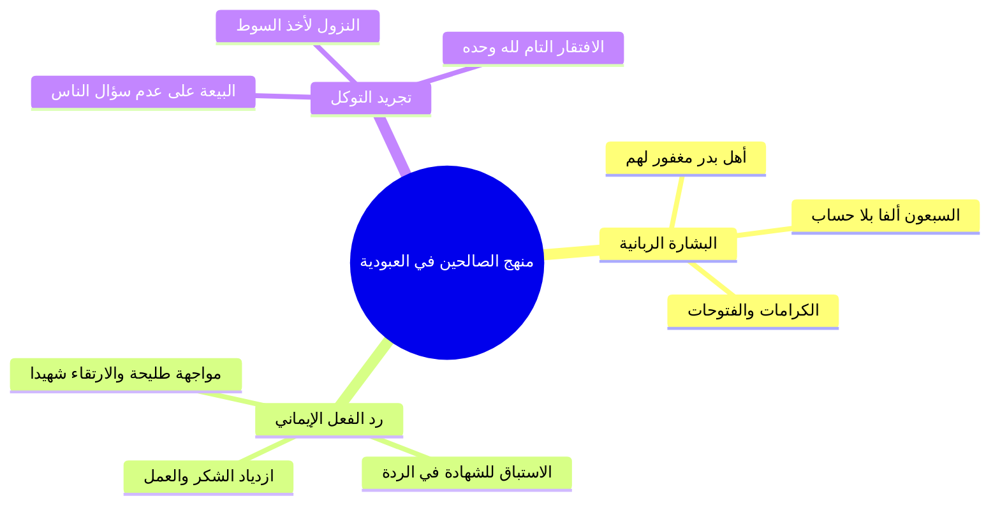

# الجزء الرابع: الاستغناء عن الناس ومنهج الصالحين عند البشارة (عكاشة بن محصن)

> **خطة أجزاء ملخص (رياض الصالحين 17 | باب اليقين والتوكل 1 | أنوار السنة المحمدية | أحمد السيد):**
> - **الجزء 1:** مقدمة الباب والعلاقة بين اليقين والتوكل وحسن الظن في الأزمات.
> - **الجزء 2:** حديث عرض الأمم وخوض الصحابة في السبعين ألفاً.
> - **الجزء 3:** التحقيق الفقهي لصفات السبعين ألفاً والروايات الواردة في عددهم.
> - **الجزء 4 (الحالي):** الاستغناء عن الناس ومنهج الصالحين عند البشارة (عكاشة بن محصن).
> - **الملف المجمع:** رياض الصالحين 17_ملف_مجمع.md.
> - **الملحق العملي:** خطة تطبيق الدروس.md.

---

## 1. فضل الاستغناء عن الناس وضوابط السؤال المذموم والمباح

### الملخص العلمي المنظم

- تقرير أن الفائدة العظمى من حديث السبعين ألفاً هي **تحقيق كمال التوكل على الله والاستغناء التام عن المخلوقين**.
- إيراد حديث صحيح مسلم في مبايعة النبي صلى الله عليه وسلم طائفة من أصحابه: «ألا تبايعوني؟ قالوا: علامَ نبايعك يا رسول الله؟ قال: **على ألا تسألوا الناس شيئاً**».
- التطبيق العملي الصارم لصحابة رسول الله صلى الله عليه وسلم لهذه البيعة؛ إذ كان يسقط سوط أحدهم وهو على راحلته، فلا يقول لأحدٍ ناولني إياه، بل ينيخ راحلته وينزل بنفسه ليتناوله صيانةً لماء وجهه وتحقيقاً لعهده.
- **التحرير الفقهي لضابط السؤال المذموم والمباح:**
  - **السؤال المذموم:** ما كان فيه تذلل، وافتقار باطن، واحتياج يُظهر عجز العبد أمام المخلوق ويصرف قلبه عن الخالق.
  - **السؤال العادي المباح:** الطلب المعتاد الذي لا ذل فيه ولا تملق، كطلب الأعلى من الأدنى أو التعاون المعتاد بين الأهل والإخوان (كقول الأب لابنه: ناولني ماء، واستدلال العلماء بقول النبي صلى الله عليه وسلم لعائشة رضي الله عنها: «ناوليني الخُمْرة من المسجد»).

### المصطلحات والتعريفات

| المصطلح | البيان الشرعي والضابط الفقهي |
| :--- | :--- |
| `[[الاستغناء عن الناس]]` | ا قطع طمع القلب في أموال الناس ومعونتهم، وتجريد الافتقار والفاقة لله وحده. |
| `[[سؤال الناس المذموم]]` | ا طلب الحاجات والأموال والشفاعات بتذلل وافتقار، وهو خادش لكمال التوكل. |
| `[[السؤال المباح]]` | ا الطلب العادي في المعاملات اليومية والتعاون بين الإخوان والأهل دون انكسار قلبي. |

---

## 2. منزلة عكاشة بن محصن ومنهج الصالحين عند ورود البشارات

### الملخص العلمي المنظم

- مبادرة الصحابي الجليل `[[عكاشة بن محصن]]` رضي الله عنه وسبقه بالسؤال: «ادع الله أن يجعلني منهم، فقال: أنت منهم»، وحكمة رد النبي للرجل الآخر: «سبقك بها عكاشة» سداً للباب ومنعاً لدخول المنافقين في التمني.
- تقرير قاعدة عقدية وسلوكية بالغة الأهمية: **«الصالحون إذا بُشِّروا ازدادوا عملاً وعبادة وشكراً»**.
- تفنيد فهم البطالين والكسالى الذين يظنون أن نيل البشارة أو مغفرة الذنوب يسوغ الركون إلى الراحة وترك العمل والتكاليف؛ فالنبي صلى الله عليه وسلم غُفر له ما تقدم من ذنبه وما تأخر وكان يقوم الليل حتى تتورم قدماه ويقول: «أفلا أكون عبداً شكوراً».
- **البرهان العملي من سيرة عكاشة بن محصن رضي الله عنه:**
  - هو من أهل بدر الكرام الذين قال الله فيهم: «اعملوا ما شئتم فقد غفرت لكم».
  - شهد المشاهد كلها مع رسول الله صلى الله عليه وسلم مجاهداً صابراً.
  - عقب وفاة النبي صلى الله عليه وسلم، لم يقعد في بيته اتكالاً على بشارة دخوله الجنة بلا حساب، بل انطلق في طليعة جيش خالد بن الوليد لحرب المرتدين (طليحة الأسدي)، فواجه العدو مقبلاً غير مدبر حتى استشهد في سبيل الله هو وثابت بن أقرم رضي الله عنهما.

### مقارنة سلوكية: منهج الصالحين ومنهج البطالين عند البشارة

| وجه المقارنة | منهج الصالحين والعلماء العابدين | فهم البطالين وأهل الكسل |
| :--- | :--- | :--- |
| **رد الفعل عند البشارة** | زيادة البذل والاجتهاد في العبادة والشكر. | الفتور والكسل والنوم وترك العمل. |
| **النظرة للعمل والتكليف** | العمل شكر للنعمة وعلامة صدق العبودية. | العمل وسيلة للنجاة تسقط بمجرد الضمان. |
| **القدوة التطبيقية** | عكاشة بن محصن (الجهاد والاستشهاد بعد البشارة). | المتمنون على الله الأماني بغير عمل. |

### الأخطاء والتحذيرات

> ⚠️ تنبيه
> ا التحذير من إلقاء السلاح وترك العمل اتكالاً على الرجاء؛ فإن البشارة عند أهل السنة دافع لمضاعفة الإحسان لا مسوغ لإسقاط التكاليف، واليقين الصادق يثمر مجاهدة وشهادة في سبيل الله.

---

## 3. نص المتحدث الكامل [الجزء الرابع]

الان احنا ما ذكرنا فوائد الحديث بشكل عام لانه الحديث ف فوائد كثيره احنا ذكرنا بس الفائده الاساسيه ذكرنا في البدايه عرض الامم ول الفوائد ترها كثير الفائده العظمى من هذا الحديث ما هي فضل التوكل فضل التوكل وفضل الاستغناء عن الناس وفضل عدم الافتقار اليهم والافتقار لله وحده فقط وقد ثبت في صحيح مسلم ان النبي صلى الله عليه وسلم قال لبعض اصحابه ا بايعوني على الا تسالوا الناس شيئا على الا تسالوا الناس شيئا بايعوني شفت بيعه اخذ فيها بيعه عن النبي صلى الله عليه وسلم وهذه البيعه اسلوب نبوي للتاكيد على القضايا اسلوب عظيم وجميل من تاكيد على بعض القضايا اشن ما يكون بالعهد والاتفاق على تسال الناس على ان لا تس الناس شيئا قال فرايت هؤلاء الذين بايعوا النبي صلى الله عليه وسلم على ان لا يس الناس شيئا يسقط سوت احدهم فلا يطلب من احدهم ان يعطيه اياه على انني انبه هنا ان سؤال الناس شيئا هو هو المذموم هو ما كان فيه ظهور لقضيه التذلل والافتقار والاحتياج وما الى ذلك اما السؤال العادي السؤال العادي خاصه من الاعلى للادنى فلا يدخل في ذلك يعني الاب لما يقول لابنه مثلا جيب لي مويه اح نقول لا لا تسالوا الناس شيئا هذا مذموم هذا لا فهمت الفكره لا ليس هو المقصود ليس هو المقصود لانه هذا ما فيه واستدلوا لانه هذه جماعه فيها فقه استدلوا بقول النبي صلى الله عليه وسلم لعائشه ناوليني الخمره ها استدلوا بمثل هذا فهذا لا يدخل فيها لكن الذي يدخل هو قضيه سؤال الناس والافتقار اليهم وما الى ذلك واضح هذا الحديث كما قلنا عظيم الفوائد كثير الخير والنفع والهدى ولعله ان شاء الله ايش لعله يعني ياتي موضع اخر ناخذ فيه اكثر من ذلك ان شاء الله طيب نختم بفائده وهي فائده مهمه اولا هنيئا لعكاشه رضي الله تعالى عنه هذه المنزله التي ضمنها هنيئا له والحقنا الله به لكن الذي اريد ان انبه عليه هو ان عكاش ابن محصن الذي ضمن انه من السب الف الذين يدخلون الجنه بلا حساب ولا عذاب كان حاله حال الصالحين على مر القرون شوف سبحان الله الصالحون دائما يجمعهم منطق واحد في العبوديه اذا بشروا الصالحون اذا بشروا يزدادون عملا هذه قاعده لا يفهمها البطالون احيانا الانسان يفهم بالعكس انه اذا بشر ايش يسوي يروح ينام صح لا الصالحون بعكس ذلك اذا بشروا يزدادون عباده وشكرا لله سبحانه وتعالى مع انه بعض الاحاديث ياتي اللفظ فيها بمعنى لا عليك الا تعمل بعدها ويعمل بعدها وليس المقصود بقول النبي صلى الله عليه وسلم لا عليك الا ت بعد اسقاط التكاليف بطبيعه الحال هذا معلوم عكاش رضي الله تعالى عنه هو اولا من اهل بدر واهل بدر قال النبي صلى الله عليه وسلم فيهم وما يدريك لعل الله اطلع على اهل بدر فقال اعملوا ما شئتم فقد غفرت لكم ثم هو شهد المشاهد مع رسول الله صلى الله عليه وسلم ثم حين توفي رسول الله صلى الله عليه وسلم كان من ال اوائل المجاهدين للمرتدين وذهب مع جيش خالد بن الوليد رضي الله تعالى عنه في حرب طليحه الاسدي المرتد الذي اسلم بعد ذلك وحسن اسلامه لكنه وقتها كان مرتدا عن الدين وذهب وهو هو وثابت بن اقرم رضي الله تعالى عنهما اجمعين ذهبا طليعه لجيش خالد فتلقاه ما طليحه فقتلهما هو ومعه اظن اثنان او ثلاثه او نحو ذلك المهم انه قتل عكاشه وقتل ثابت بن عقرب فعك اش بن محصن هذا الذي بشره النبي صلى الله عليه وسلم بانه من السبعين الفا لما جاء الجهاد في سبيل الله لم يجلس لم يقعد وانما خرج ولما جاءت المهمه الخاصه داخل الجهاد لم يتاخر وانما ذهب ولما جاءت المواجهه لم يهرب وانما واجه وقتل شهيدا رضي الله تعالى عنه فاي شيء اعظم من ذلك اي شيء اعظم من ذلك هذا حال الصالحين هذا حال الصالحين نسال الله ان يجعلنا منهم وصل اللهم على نبينا محمد وعلى اله وصحبه اجمعين

---

## إحصائيات الإنجاز للجزء الرابع

- **إجمالي عدد الأجزاء:** أربعة أجزاء (4).
- **الجزء الحالي:** الجزء الرابع والأخير من الأجزاء التفصيلية (4).
- **الأجزاء المتبقية:** تم اكتمال كافة الأجزاء التفصيلية (0) — يليها الملف المجمع وخطة تطبيق الدروس.
