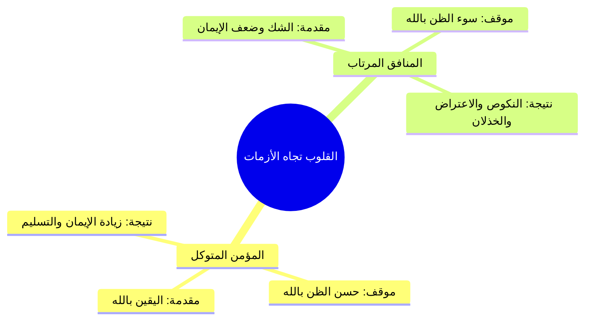
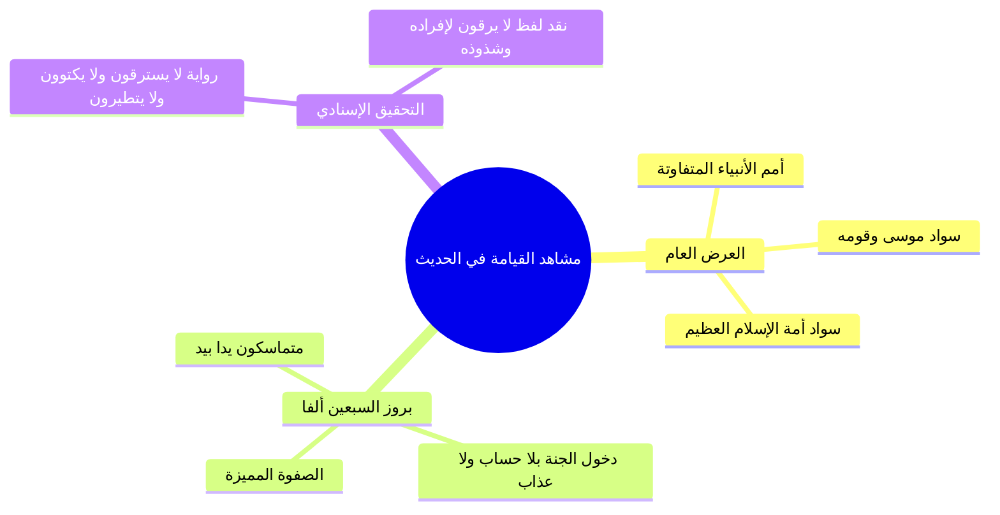
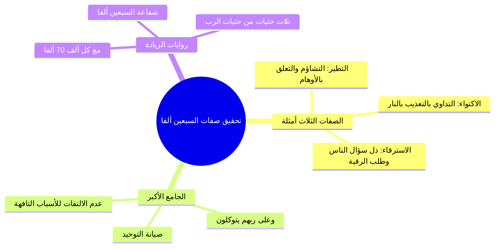
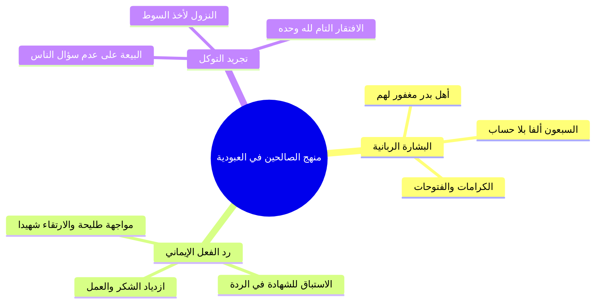

# رياض الصالحين 17 (باب اليقين والتوكل 1) - الملف المجمع النهائي

## فهرس المحتويات
1. [[#الجزء الأول مقدمة الباب والعلاقة بين اليقين والتوكل وحسن الظن في الأزمات|الجزء الأول: مقدمة الباب والعلاقة بين اليقين والتوكل وحسن الظن في الأزمات]]
   - الاستشفاء بالسنة وباب اليقين والتوكل وفقه العلاقة بين أعمال القلوب.
   - الآيات المصدر بها الباب وفقه حسن الظن بالله عند اشتداد الأزمات.
2. [[#الجزء الثاني حديث عرض الأمم وخوض الصحابة في السبعين ألفاً|الجزء الثاني: حديث عرض الأمم وخوض الصحابة في السبعين ألفاً]]
   - نص حديث ابن عباس وضبط غريب ألفاظه.
   - مشاهد يوم القيامة ودفع توهم التعارض والرابطة مع موسى عليه السلام.
   - خوض الصحابة في تعيين السبعين ألفاً والتحقيق في رواية «لا يرقون».
3. [[#الجزء الثالث التحقيق الفقهي لصفات السبعين ألفاً والروايات الواردة في عددهم|الجزء الثالث: التحقيق الفقهي لصفات السبعين ألفاً والروايات الواردة في عددهم]]
   - عدد صفات السبعين ألفاً وحقيقتها البلاغية والشرعية.
   - دلالة الصفات: هل هي للحصر أم للتمثيل؟
   - مسألة عدد السبعين ألفاً وروايات الزيادة والشفاعة.
4. [[#الجزء الرابع الاستغناء عن الناس ومنهج الصالحين عند البشارة عكاشة بن محصن|الجزء الرابع: الاستغناء عن الناس ومنهج الصالحين عند البشارة (عكاشة بن محصن)]]
   - فضل الاستغناء عن الناس وضوابط السؤال المذموم والمباح.
   - منزلة عكاشة بن محصن ومنهج الصالحين عند ورود البشارات.

---

# الجزء الأول: مقدمة الباب والعلاقة بين اليقين والتوكل وحسن الظن في الأزمات

## 1. الاستشفاء بالسنة وباب اليقين والتوكل وفقه العلاقة بين أعمال القلوب

### الملخص العلمي المنظم

- استفتح الشيخ أحمد السيد المجلس السابع عشر من مجالس «أنوار السنة المحمدية» في التعليق على كتاب «رياض الصالحين» للإمام النووي رحمه الله.
- التذكير بالمقصد الأسمى من مدارسة السنة النبوية؛ وهو **الاستشفاء بالسنة ومداواة أمراض القلوب وأشواق الأرواح** وتحقيق مقتضيات العبودية الحقة لله تعالى.
- استعراض صنيع الإمام النووي في ترجمة الباب: «باب في اليقين والتوكل»؛ حيث جمع بين عملين قلبيين جليلين على خلاف غالب أبواب الكتاب التي يقتصر فيها على لفظ مفرد.
- تقرير أصل منهجي عظيم وهو: `[[فقه العلاقة بين أعمال القلوب]]`؛ فاليقين والتوكل عملان قلبيان، واليقين يعد **مقدمة ضرورية وركيزة أساسية** للتوكل؛ إذ يستحيل عقلاً وشرعاً قيام التوكل وتفويض الأمر لمن لا يوقن العبد بكمال قدرته وعلمه ورحمته.

### المصطلحات والتعريفات

| المصطلح | التعريف العلمي المعتمد |
| :--- | :--- |
| `[[اليقين]]` | ا استقرار الإيمان الجازم والعلم القطعي في القلب بحيث لا يخالطه شك ولا ريب؛ وهو ركيزة كل عمل قلبي. |
| `[[التوكل]]` | ا صدق اعتماد القلب على الله تعالى وتفويض الأمر إليه بالكلية في جلب المصالح ودفع المضار مع الأخذ بالأسباب المشروعة. |
| `[[أعمال القلوب]]` | ا العبادات الباطنة القائمة بالقلب كالرضا، والخوف، والرجاء، واليقين، والتوكل؛ وهي أصل أعمال الجوارح وأعظمها قدراً. |

---

## 2. الآيات المصدر بها الباب وفقه حسن الظن بالله عند اشتداد الأزمات

### الملخص العلمي المنظم

- ساق الإمام النووي جملة محكمة من الآيات القرآنية التي تؤصل للتوكل وتفويض الأمر لله:
  - آيات سورة الأحزاب: ا ﴿وَلَمَّا رَأَى الْمُؤْمِنُونَ الْأَحْزَابَ قَالُوا هَٰذَا مَا وَعَدَنَا اللَّهُ وَرَسُولُهُ وَصَدَقَ اللَّهُ وَرَسُولُهُ وَمَا زَادَهُمْ إِلَّا إِيمَانًا وَتَسْلِيمًا﴾.
  - آيات آل عمران في حمراء الأسد: ا ﴿الَّذِينَ قَالَ لَهُمُ النَّاسُ إِنَّ النَّاسَ قَدْ جَمَعُوا لَكُمْ فَاخْشَوْهُمْ فَزَادَهُمْ إِيمَانًا وَقَالُوا حَسْبُنَا اللَّهُ وَنِعْمَ الْوَكِيلُ * فَانقَلَبُوا بِنِعْمَةٍ مِّنَ اللَّهِ وَفَضْلٍ لَّمْ يَمْسَسْهُمْ سُوءٌ وَاتَّبَعُوا رِضْوَانَ اللَّهِ وَاللَّهُ ذُو فَضْلٍ عَظِيمٍ﴾.
  - الأمر الصريح بالتوكل: ا ﴿وَتَوَكَّلْ عَلَى الْحَيِّ الَّذِي لَا يَمُوتُ﴾، وا ﴿وَعَلَى اللَّهِ فَلْيَتَوَكَّلِ الْمُؤْمِنُونَ﴾، وا ﴿فَإِذَا عَزَمْتَ فَتَوَكَّلْ عَلَى اللَّهِ﴾.
  - كفاية الله للمتوكل: ا ﴿وَمَن يَتَوَكَّلْ عَلَى اللَّهِ فَهُوَ حَسْبُهُ﴾ (أي كافيه).
  - اقتران الوجل بالتوكل في صفات المؤمنين: ا ﴿إِنَّمَا الْمُؤْمِنُونَ الَّذِينَ إِذَا ذُكِرَ اللَّهُ وَجِلَتْ قُلُوبُهُمْ وَإِذَا تُلِيَتْ عَلَيْهِمْ آيَاتُهُ زَادَتْهُمْ إِيمَانًا وَعَلَىٰ رَبِّهِمْ يَتَوَكَّلُونَ﴾.
- **فقه الأزمات ومعيارية ردود الأفعال:**
  - عند اشتداد الخطوب، ينقسم الناس بحسب ما في قلوبهم إلى قسمين متضادين تجاه نفس النازلة وفي ذات البقعة الجغرافية (كما حدث في غزوة الأحزاب).
  - `[[حسن الظن بالله]]` ثمرة مباشرة للتوكل الصادق واليقين الراسخ؛ فالمؤمن إذا اشتد عليه الكرب استيقن بقرب الفرج وتحقق موعود الله.

### مقارنة علمية: حال القلوب عند اشتداد الأزمات (غزوة الأحزاب نموذجاً)

| وجه المقارنة | حال المؤمنين الصادقين | حال المنافقين وضعاف الإيمان |
| :--- | :--- | :--- |
| **المقالة واللسان** | ﴿هَٰذَا مَا وَعَدَنَا اللَّهُ وَرَسُولُهُ وَصَدَقَ اللَّهُ وَرَسُولُهُ﴾ | ﴿مَّا وَعَدَنَا اللَّهُ وَرَسُولُهُ إِلَّا غُرُورًا﴾ |
| **الأثر القلبي** | زيادة في الإيمان واليقين والتسليم لله. | ارتياب وشك واضطراب وسوء ظن بالله. |
| **ثمرة التوكل** | السكينة وحسن الظن بأن العاقبة للمتقين. | الفزع والانهيار والاتهام لتدبير الله وحكمته. |

### الأخطاء والتحذيرات

> ⚠️ تنبيه
> ا الحذر من سوء الظن بالله عند تأخر النصر أو اشتداد الكروب؛ فإن سوء الظن بالخالق صفة نفاقية مهلكة، والواجب عند احتدام الخطب تفويض الأمر إلى الله والاستمساك بـ «حسبنا الله ونعم الوكيل».

### نص المتحدث الكامل [الجزء الأول]

الحمد لله رب العالمين حمدا كثيرا طيبا مباركا فيه الحمد لله كما ينبغي لجلال وجهه وعظيم سلطانه الحمد لله الذي له الحمد في الاولى والاخره وله الحكم اليه المصير اللهم صل على محمد وعلى ال محمد كما صليت على ابراهيم وعلى ال ابراهيم انك حميد مجيد وبارك على محمد وعلى ال محمد كما باركت على ابراهيم وعلى ال ابراهيم انك حميد مجيد اما بعد نستعين بالله ونستفتح مجلسا جديدا من مجالس انوار السنه المحمديه ومجالس الاستهداء بالسنه النبويه وهو المجلس السابع عشر من مجالس التعليق على رياض الصالحين نسال الله سبحانه وتعالى التوفيق والسداد والعون والمدد ونساله سبحانه وتعالى ان ينفعنا بما يعلمنا وان يهدينا ويسدد ن و لو تتذكرون في بدايه اللقاءات قلت هذه الم جالس يعني هي للاستشفاء بالسنه وملامسه ا حاجات القلب وحاجات الروح وضم النفس اللي تداوى وتشفى بهدي المصطفى صلى الله عليه وسلم وبهذه المعاني الايمانيه وبحق العبوديه لله سبحانه وتعالى واليوم عندنا باب هو من صميم هذه الابواب التي تتصل بمعنى الاستشفاء والهدايه وهو باب اليقين والتوكل قال فيه الامام النووي رحمه الله باب في اليقين والتوكل وقد جمع بين امرين فقال اليقين والتوكل بينما في الابواب الما السابقه كان ياتي بلفظ واحد صحيح ا فقط الباب الاول باب الاخلاص واحضار النيه وهي متقاربه لكن اليقين والتوكل كل واحد منها عمل صح ولا لا اليقين عمل قلبي والتوكل عمل قلبي فما العلاقه بينهما طبعا هناك باب اصلا عنوان شريف جدا اسمه العلاقه بين اعمال القلوب وهذا باب من ابواب الفقه في الدين ان تكتشف وتفهم وتفقه العلاقه بين هذا العمل القلبي وذاك العمل القلبي الاخر فاليقين والتوكل بينهما علاقه ايهما يعد مقدمه للاخر اليقين مقدمه للتوكل يعني هل يتصور تحقيق التوكل بلا يقين لا يتصور صح ولا لا طيب اذا هنا هذا الباب عن اليقين وعن التوكل ولما تتامل في الباب ستجد ان عامه ما فيه عن التوكل طيب قال النووي رحمه الله قال الله تعالى ولما راى المؤمنون الاحزاب قالوا هذا ما وعدنا الله ورسوله وصدق الله ورسوله وما زادهم الا ايمانا وتسليما وقال تعالى الذين قال لهم الناس ان الناس قد جمعوا لكم فاخشوهم فزادهم ايمانا وقالوا حسبنا الله ونعم الوكيل فزادهم ايمانا وقالوا حسبنا الله ونعم الوكيل فانقلبوا بنعمه من الله وفضل لم يمسسهم سوء واتبعوا رضوان الله والله ذو فضل عظيم وقال تعالى وتوكل على الحي الذي لا يموت وقال تعالى وعلى الله فليتوكل المؤمنون وقال تعالى فاذا عزمت فتوكل على الله والايات في الامر بالتوكل كثيره معلومه وقال تعالى ومن يتوكل على الله فهو حسبه اي كافيه وقال تعالى انما المؤمنون الذين اذا ذكر الله وجلت قلوبهم واذا تليت عليهم اياته زادتهم ايمانا وعلى ربهم يتوكلون والايات في فضل التوكل كثيره معروفه ما اجمل هذا وما اجمل الاستفتاح بهذه الايات القرانيه العزيزه عن قضيه التوكل وقضيه تفويض الامر لله وقضيه الاطمئنان الى الله سبحانه وتعالى اذا وكل اذا وكل الانسان امره اليه سبحانه وتعالى وكل ايه من هذه الايات فيها ما فيها من الدروس والعبر والعضات غير ان مما ينبغي ان يتفكر فيه ويتامل فيه هو كيف ان كيف كيف ان الانسان المؤمن الموقن المتوكل على الله سبحانه وتعالى كيف انه يزداد حسن ظنه بالله سبحانه وتعالى عند اشتداد الازمات مع ان اشتداد الازمات هو لغيره سبب لايش لسوء الظن بالله يعني الان حين تحدث الازمات على الانسان فانها فان الناس تجاه الازمات على قسمين منهم من يحسن ظنه بالله بسبب الازمه ومنهم من يسوء ظنه بالله بسبب الازمه نفس الازمه واحيانا مو ليس فقط نفس نوع الازمه لا احيانا نفس الازمه في نفس المكان في نفس الموقع الجغرافي بالضبط يعني موقعه الاحزاب في نفس المكان الذي كان الناس فيه مع رسول الله صلى الله عليه وسلم انقسم الناس الى قسمين قسم من المنافقين كان حاضرا يوم الاحزاب فقالوا بالنص ما وعدنا الله ورسوله الا غرورا ما وعدنا الله ورسوله الا غرورا واخرون في نفس الموضع وفي نفس المقام ماذا قالوا قالوا هذا ما وعدنا الله ورسوله وصدق الله ورسوله وما زادهم الا ايمانا وتسليما وما زادهم الا ايمانا وتسليما طيب ففائدة عباده يعني مثل ما قال باب اليقين والتوكل احنا فينا نقول باب حسن الظن بالله والتوكل او باب التوكل وحسن الظن بالله لانه من اعظم الاسباب التي تدفعك لحسن الظن بالله هو ان تتوكل عليه طيب الايات كما قال النووي رحمه الله كثيره معلومه نبدا بالاحاديث قال رحمه الله تعالى

---

# الجزء الثاني: حديث عرض الأمم وخوض الصحابة في السبعين ألفاً

## 1. نص حديث ابن عباس رضي الله عنهما وضبط غريب ألفاظه

### الملخص العلمي المنظم

- إيراد حديث عبد الله بن عباس رضي الله عنهما في عرض الأمم على النبي صلى الله عليه وسلم، ورؤية الأنبياء يوم القيامة وتباين عدد أتباعهم؛ فمنهم من معه الرّهيط، ومنهم من معه الرجل والرجلان، ومنهم النبي وليس معه أحد، مما يدل على أن مقياس الحق والفضل ليس بكثرة الأتباع.
- رفع السواد العظيم لموسى عليه السلام وقومه، ثم رؤية السواد الأعظم الذي سدّ الأفق لأمة محمد صلى الله عليه وسلم، ومعهم صفوة خاصة قوامها **سبعون ألفاً يدخلون الجنة بغير حساب ولا عذاب**.
- ضبط الألفاظ الغريبة الواردة في متن الحديث كما بيّنها الإمام النووي رحمه الله.

### غريب الحديث وضبط الألفاظ

| اللفظ | الضبط اللغوي والبيان الفقهي |
| :--- | :--- |
| `[[الرُّهَيْط]]` | ا بضم الراء؛ تصغير رَهْط، وهم الجماعة من الناس دون العشرة أنفس. |
| `[[الأُفُق]]` | ا بضمتين أو ضم فسكون؛ الناحية ومنتهى ما يراه البصر من أقطار السماء والأرض. |
| `[[عُكَّاشَة]]` | ا بضم العين وتشديد الكاف مع فتحها، ويجوز تخفيفها، والتشديد هو الأفصح. |

---

## 2. مشاهد يوم القيامة ودفع توهم التعارض والرابطة مع موسى عليه السلام

### الملخص العلمي المنظم

- **تعدد مشاهد القيامة ومقاماتها:** يوم القيامة يوم طويل وعظيم المقدار (خمسون ألف سنة)، وتتعدد فيه المقامات؛ فهناك مقام العرض العام الذي لا يستبين فيه النبي أعيان أمته حتى يُخبَر، وهناك مقام القرب والمعاينة حيث يعرفهم بالنور والتحجيل من أثر الوضوء.
- **العلاقة الوثيقة بين النبي صلى الله عليه وسلم وموسى عليه السلام:**
  - ظهور هذه الرابطة في حادثة المعراج ومراجعة موسى للنبي صلى الله عليه وسلم حتى خُففت الصلوات من خمسين إلى خمس.
  - كثرة أتباع موسى المؤمنين به، وظن النبي صلى الله عليه وسلم في أول الأمر أن السواد الأول هم أمته لرجائه وطمعه في سعة فضل ربه لأمته.
- **عظمة مشهد الحشر:** استحضار اجتماع مليارات البشر منذ آدم عليه السلام إلى قيام الساعة والوحوش معهم في صعيد واحد.

### مقارنة علمية: مقامات المشاهد يوم القيامة

| وجه المقارنة | مقام العرض العام | مقام القرب والمعاينة |
| :--- | :--- | :--- |
| **هيئة الرؤية** | رؤية سواد عظيم يملأ الأفق من بعيد. | رؤية الأشخاص والأعيان عن قُرب. |
| **الوسيلة المعرفية** | الإخبار من قِبل الملائكة: «هذا موسى وقومه... هذه أمتك». | المعرفة الذاتية بالنور والتحجيل من آثار الوضوء. |
| **دفع التعارض** | لا تناقض؛ لاختلاف المقامات والأوقات في اليوم الطويل. | دلالة على إكرام الأمة بالصفات الخاصة. |

---

## 3. خوض الصحابة في تعيين السبعين ألفاً والتحقيق في رواية «لا يرقون»

### الملخص العلمي المنظم

- إخبار النبي صلى الله عليه وسلم أصحابه بالسبعين ألفاً ثم دخوله منزله قبل تفصيل صفاتهم؛ لحكمة بالغة أثارت في نفوسهم التنافس والبحث عن أسباب هذا الشرف العظيم.
- تخمين الصحابة بحرص واجتهاد: لعلهم الذين صحبوا رسول الله، أو الذين ولدوا في الإسلام فلم يشركوا بالله شيئاً؛ مما يكشف عن علو همتهم وتطلعهم لمنازل الفضل.
- **الهيئة المهيبة للسبعين ألفاً:** ورد في صحيح البخاري أنهم يبرزون متماسكين، آخذاً بعضهم بيد بعض، لا يدخل أولهم حتى يدخل آخرهم على صورة القمر ليلة البدر.
- **التحقيق الحديثي في لفظ «لا يرقون»:**
  - بين الشيخ أن لفظ «لا يرقون» أخرجه مسلم من أفراده، وتكلم فيه أئمة التحقيق وعلى رأسهم شيخ الإسلام `[[ابن تيمية]]` رحمه الله.
  - تقرير شذوذ هذا اللفظ متناً؛ لأن رقية المسلم لأخيه هي من باب الإحسان ونفع المسلمين وبذل المعروف الذي حث عليه الشارع، ولا يمكن للإحسان أن يكون سبباً للحرمان من منزلة السبعين ألفاً، وإنما اللفظ المحفوظ المتفق عليه هو: «لا يسترقون».

### الأخطاء والتحذيرات

> ⚠️ تنبيه
> ا خطأ توهم ذم الراقي الشرعي؛ فالنهي والزهادة إنما هي في «الاسترقاء» وهو طلب الرقية من الناس لما فيه من تعلق القلب وسؤال المخلوقين، أما رقية الإنسان لغيره فإحسان مستحب شرعاً لا يقدح في التوكل.

### نص المتحدث الكامل [الجزء الثاني]

اما الاحاديث فالاول عن ابن عباس رضي الله عنهما قال قال رسول الله صلى الله عليه وسلم عرضت علي الامم فرايت النبي ومعه الرهيط والنبي ومعه الرجل والرجلان والنبي ليس معه احد اذ رفع لي سواد عظيم فظننت انهم امتي فقيل لي هذا موسى وقومه ولكن انظر الى الافق فنظرت فاذا سواد عظيم فقيل لي انظر الى الافق الاخر فاذا سواد عظيم فقيل لي هذه امتك ومعهم سبون الفا يدخلون الجنه بغير حساب ولا عذاب ثم نهض فدخل منزله صلى الله عليه وسلم فخاض الناس في اولئك الذين يدخلون الجنه بغير حساب ولا عذاب فقال بعضهم فلعلهم الذين صحبوا رسول الله صلى الله عليه وسلم وقال بعضهم فلعلهم الذين ولدوا في الاسلام فلم يشركوا بالله شيئا وذكروا اشياء فخرج عليهم رسول الله صلى الله عليه وسلم فقال ما الذي تخوضون فيه فاخبروه فقال هم الذين لا يرقون ولا يسترقون ولا يتطيرون وعلى ربهم يتوكلون فقال فقام عكاشه ابن محصن فقال ادع الله ان يجعلني منهم فقال انت منهم ثم قام رجل اخر فقال ادعوا الله ان يجعلني منهم فقال سبقك بها عكاشه متفق عليه قال النووي رحمه الله الرهيط بضم الراء تصغير رهط وهم دون عشره انفس والافق الناحيه والجانب وعكاشه بضم العين وتشديد الكاف وبتخفي فها والتشديد افصح يعني عكاشه وعكاشه والتشديد اللي هو عكاش افصح طيب هذا حديث عظيم وحديث عجيب وحديث فيه فوائد كثيره وفيه دروس عظيمه وسنقف معه وقفه يعني فيها بعض التف تصيل هو يعني اكثر حديث سنقف معه اليوم ان شاء الله هو هذا الحديث هذا الحديث فيه اولا ان يوم القيامه فيه مشاهد يوم ان يوم القيامه فيه مشاهد ومن المشاهد التي في يوم القيامه مشهد عرض الامم و هذا على قول ان هذا يعني لان هو اختلف قيل انه راه النبي صلى الله عليه وسلم يوم الاسراء وقيل بغض النظر لكن هذا من المش التي تكون يوم القيامه وهذا مشهد يختلف عن المشهد الذي يعرف النبي صلى الله عليه وسلم فيه امته غرا محجلين من اثر الوضوء دائما يا جماعه الخير يوم لانه يوم القيامه يعني يوم طويل جدا احيانا الذي لا يدرك تعدد المشاهد يوم القيامه يظن ان هناك تناقضا بين بعض القضايا التي وردت فيه لكنها مقامات هناك مقام وب ي رض فيه عرض عام لا يستبين للنبي صلى الله عليه وسلم من هي امته في البدايه واما مقام القرب ورؤيه الاعيان والاشخاص فيعرف النبي صلى الله عليه وسلم امته برؤيتهم غرا محجلين من اثر الوضوء واضح طيب هناك ارتباط كثير ووثيق بين النبي صلى الله عليه وسلم وبين موسى عليه السلام وبين هذه الامه وبين امه موسى عليه السلام وذلك ان النبي صلى الله عليه وسلم لما عرج به الى السماء وفرض الله عليه 50 صلاه نزل فوصل الى موسى عليه السلام فقال موسى للنبي صلى الله عليه وسلم ان امتك لا تضيق ذلك فارجع الى ربك فاساله التخفيف فرجع محمد صلى الله عليه وسلم الى ربه فساله التخفيف فخفف ثم نزل الى موسى فقال ان امتك لا تطيق ذلك فسله التخفيف ثم رجع فسال التخفيف وهكذا حتى وصل الى خمس صلوات ولما وصل الى خمس صلوات نزل وقال له موسى ايضا ان امتك لا تطيق ذلك قال موسى عليه السلام لمحمد صلى الله عليه وسلم انا اعلم بالناس منك عالجت بني اسرائيل اشد المعالجه فقال النبي صلى الله عليه وسلم استحييت من ربي استحييت من ربي يعني خلاص ما لن اراجعه مره اخرى في ان يخفف الصلوات اقل من خمس صلوات قال الله تعالى هي خمس وهي 50 هي خمس وهي 50 يعني هي خمس في العمل والتكليف وهي 50 في الاجر وهذا من رحمه الله سبحانه وتعالى وكرمه الشاهد دائما نجد الارتباط بين موسى ومحمد صلى الله عليه وسلم في القران ويوم القيامه سيكون اتباع موسى الذين يعني امنوا به وصدقوا كثر و يعني حين يراهم النبي صلى الله عليه وسلم اول ما يراهم يظن انهم امته لكثرتهم ولطم النبي صلى الله عليه وسلم ان تكون امته كثيره يعني يطمع في رحمه الله ان يعني يدخل امته او ان تكون امه النبي صلى الله عليه وسلم المستجيب له كبيره ف ظن النبي صلى الله عليه وسلم ان السواد الاول هو هو امته ا ثم قيل له هذا موسى وقومه ثم رفع له سواد اخر وفي روايه سد الافق اه فقيل هذا هذه امتك ثم قيل له ومعهم سب ال يدخلون الجنه بلا حساب ولا عذاب كم عدد هذه الامه طبعا احنا يعني احنا ترى يمكن ما نتخيل مقدار البشريه اكيد ما نقدر نتخيل احنا نجي في مرحله معينه نقول مثلا عدد البشريه 7 مليار احنا نتكلم الان عن الحشر بشكل عام تمام بس 7 مليار هم في هذه اللحظه لكن اذا رجعت الى قبل 20 سنه اذا رجعت الى قبل 100 سنه ترى في مئات الملايين او المليارات اللي هم ما هم موجودين اصلا الان واذا رجعت الى 50 سنه قبلها ثم الى 50 ثم الى 50 ثم الى 50 ثم الى 50 الى ان تصل الى زمن النبي صلى الله عليه وسلم ثم الى ان تصل الى زمن عيسى عليه السلام ثم الى ان تصل الى زمن موسى عليه السلام ثم الى ان تصل الى زمن ابراهيم عليه السلام ثم الى ان تصل الى زمن نوح عليه السلام ثم الى ان تصل الى زمن ادم عليه السلام فانت تتكلم عن اعداد مهوله لا يستطيع ان يحصيها ولا يعلمها الا الله هؤلاء كلهم سيح شرون يوم القيامه كلهم سيح شرون يوم القيامه في صعيد واحد كلهم صغيرهم كبيرهم ذكرهم وانثاه وزياده على ذلك ستحشر معهم الحيوانات ها واذا الوحوش حشرت واذا العشار عطلت واذا الوحوش حشرت ف يوم الحشر يوم مهيب يوم مهيب وفيه كما قلت مشاهد كثيره فيه شيء يجمع كل الناس بعدين ياتي الناس الذين استجابوا اهل النار يؤمر بهم الى النار يعني مشاهد كثيره جدا فمن جمله ذلك انه في ظل هذه الاعداد الكبيره وفي ظل هذه الامه المستجيبه الواسعه يبرز السب الفا 70 الف من بين الام المستجيبه الامه المستجيبه كم هذه من وقت النبي صلى الله عليه وسلم الى الان الله اعلم كم الذين هم من المسلمين الله اعلم كم من بين هؤلاء 7000 يعني 70 الف ترى ولا شيء من ناحيه العدد بالنسبه للامه من وقت النبي صلى الله عليه وسلم الى الان ولا شيء هؤلاء السب الفا امام الجميع سيبرز سيبرز وهذا البروز هو بروز يعني لا شرف اعلى منه بروز مشرف بروز عجيب امام هذه الامم يخرج 7 الفا والعجيب انه جاء في الروايه ايضا في البخاري وفي الصحيح قال متماسك متماسك هؤلاء السبعون الفا اخذ بعضهم بيد بعض قال لاد يدخلون الجنه لا يدخل اولهم حتى يدخل اخرهم يعني ماسكن يد بعض ويدخلوا الجنه مع بعض 7 الف هؤلاء 7 ال هؤلاء يعني ايش شيء مشهد عظيم مشهد مهيب مشهد كبير مشهد مشرف عجيب جدا لما دخل النبي قال لهم النبي صلى الله عليه وسلم هذا الخبر قال لاصحابه ثم دخل البيت وما اخبرهم من هم هؤلاء السب الفا ها شوف انت عندك معلومه مسبقه الان سامع الحديث قبل كذا ومع ذلك ممكن تتعجب تقول يا ربي كذا يا واحد يفكر ف بالك الصحابه الان يسمعوها من النبي صلى الله عليه وسلم مباشره ولاول مره ثم دخل النبي صلى الله عليه وسلم البيت فمن الطبيعي ان ماذا يفعلوا ها يخوضون ويتناقشون من هم السبع الفا واخذوا يخمنون فمنهم من قال هم الذين صحبوا رسول الله صلى الله عليه وسلم طبعا الذي يقول ذلك هم ايضا من الصحابه لكن واضح ان هنا من المقصود صحبه خاصه اي يعني كان ربما الذي قال ذلك هم من اسلم متاخرا مثلا عن الذين صحبوا النبي صلى الله عليه وسلم صحبه طويله وهذا وارد في في الاحاديث يعني مثلا النبي صلى الله عليه وسلم لما قال لا تسبوا اصحابي قالها لاناس من اصحابه انه صار موقف بين صحابي اسلم مبكرا صحابي اسلم متاخرا فالثاني المتاخر سب الاول فقال النبي صلى الله عليه وسلم لا تسبوا اصحابي جيد وقال مره في مقام اخر هل انتم تاركوا ها لصاحبي مع انه الذي الشخص الاخر هو من اصحابه لكن الصحبه في صحبه خاصه فهنا اول شيء قالوا لعلهم الذين صاحبوا رسول الله صلى الله عليه وسلم يعني كانهم الذين صحبوه صحبه خاصه ولهم معه تاريخ وقال اخرون لعلهم الذين ولدوا في الاسلام فانا ولدنا في الجاهليه في روايه شوف التفكير يعني لانه هذه كل واحد جاز يفكر منين ال 70000 هؤلاء من السب الف هؤلاء ثم رجع النبي صلى الله عليه وسلم خرج اليهم قال ما الذي تخون فيه فاخبروه طبعا جاء اكثر من الروايه الروايه الاصح ليست التي اوردها النووي هنا رحمه الله هنا حتى نقل في الحاشيه انه هنا تنبيه ان يعني انه هذه الروايه اللي هي لا يرقون ان من مفردات مسلم وليست متفقه وليست من المتفق عليه طيب ف ولم يولد لفظ ايش اللي هو ايش لم يرد لفظ يكتوون لا ورد يتطيرون لكن ل لم يرد لفظ يكتوون ف يعني كان الاولى ان ان ياتي باللفظ الاصح اللي هو هم الذين لا يسترقون ولا ولا يكتوون ولا يتطيرون وعلى ربهم يتوكلون اما لفظ لا يرقون فاختلف العلماء في صح ه وان كان قد اخرجه المسلم في روايه فمن العلماء من راى انه لفظ شاذ لا يصح هذا اللفظ وحده و من باب يعني حتى من باب او خلينا نقول الاساس باعتبار المتن ومن ابرزهم ابن تيميه رحمه الله تعالى فكان يرى ان هذا اللفظ غير صحيح وذلك انه يقول يرقون ليس هناك اشكال في يرقون لان كونهم يرقون غيرهم فهذا من باب الاحسان الى الناس ولا يمكن ان يكون الاحسان سببا في التاخير عن منزله 7 الفا طيب قال النبي صلى الله عليه وسلم هم الذين لا يسترقون ولا يكتوون ولا يتطيرون وعلى ربهم يتوكلون

---

# الجزء الثالث: التحقيق الفقهي لصفات السبعين ألفاً والروايات الواردة في عددهم

## 1. عدد صفات السبعين ألفاً وحقيقتها البلاغية والشرعية

### الملخص العلمي المنظم

- استعراض الألفاظ النبوية: «هم الذين لا يسترقون، ولا يكتوون، ولا يتطيرون، وعلى ربهم يتوكلون»، ومناقشة هل هي ثلاث صفات أم أربع:
  1. **القول بأنها ثلاث صفات:** قوله «وعلى ربهم يتوكلون» هي الصفة الكاشفة الجامعة والأصل، وما قبلها الثلاث مجرد أمثلة وتطبيقات عليها.
  2. **القول بأنها أربع صفات:** قوله «وعلى ربهم يتوكلون» صفة رابعة خُتم بها من باب **عطف العام على الخاص** لبيان أن كل تلك الجزئيات تندرج تحت التوكل المطلق.
- **التحقيق الفقهي في معنى كل صفة:**
  - `[[التطير]]`: التشاؤم بالمرئيات أو المسموعات أو الحركات (كالغراب، البومة، سقوط الأشياء) مما لم يجعله الله سبباً شرعياً ولا قدرياً، وهو من خصال الجاهلية القادحة في التوحيد.
  - `[[الاكتواء]]`: التداوي بالكي؛ وعلة النهي عنه كونه تعذيباً بنار الله، مع ثبوت رخصة النبي صلى الله عليه وسلم فيه للأمة دون أن يستعمله في نفسه قط، فتركه من تمام التوكل والصبر.
  - `[[الاسترقاء]]`: طلب الرقية من الناس (السين والتاء للطلب)؛ وعلة ذمه اشتماله على ذل السؤال والافتقار إلى المخلوقين والتعلق بالوسائط.

### جدول تحقيق الصفات وعللها

| الصفة | المعنى المراد | علة التنزيه عنها في الحديث |
| :--- | :--- | :--- |
| **لا يسترقون** | لا يطلبون من غيرهم أن يرقيهم. | صيانة القلب عن سؤال المخلوقين والتذلل لهم. |
| **لا يكتوون** | لا يستعملون الكي بالنار في علاج أمراضهم. | التنزه عن التعذيب بالنار والصبر على البلاء طلباً لمرضاة الله. |
| **لا يتطيرون** | لا يتشاءمون بما يقع من حوادث أو طيور أو أصوات. | اجتناب الشرك وسوء الظن بالله، وسلامة القلب من الأوهام. |
| **على ربهم يتوكلون** | تفويض الأمر كله إلى الله اعتماداً ويقيناً. | هي الأصل والجامع الحقيقي لكل الفضائل السابقة. |

---

## 2. دلالة الصفات: هل هي للحصر أم للتمثيل؟

### الملخص العلمي المنظم

- رجّح الشيخ أن هذه الصفات **ليست محصورة في هذه الثلاثة فقط، بل هي أمثلة كبرى على معنى أعظم وهو كمال التوكل والتجرد من التعلق بغير الله**.
- قياس ما يماثلها:
  - تعليق التمائم والعين الزرقاء والخرز لدفع العين هو من جنس التطير والتعلق بالأوهام.
  - كثرة سؤال الناس وبذل الوجه في الحاجات والشفاعات والمال هو من صميم سؤال الناس المذموم في الاسترقاء.
- تقرير أصل عقدي مهم: من ترك هذه الثلاث بظاهرها لكنه يقع في سؤال الناس أو يعلق قلبه بالأسباب الواهية لم يكن من السبعين ألفاً؛ لأن العبرة بحقيقة التوكل التام.

---

## 3. مسألة عدد السبعين ألفاً وروايات الزيادة والشفاعة

### الملخص العلمي المنظم

- تحقيق مسألة هل العدد (70 ألفاً) هو للحصر أم للتكثير: الراجح أنه عدد مقصود لذاته وليس لمجرد التكثير كما ظن بعض الشراح.
- **روايات الزيادة التي جود أسانيدها الحافظ ابن حجر رحمه الله:**
  1. حديث أبي هريرة رضي الله عنه عند الإمام أحمد: «فاستزدت فزادني مع كل ألف سبعين ألفاً».
  2. حديث عتبة بن عبد رضي الله عنه عند الطبراني وابن حبان: «ثم يشفع كل ألف في سبعين ألفاً، ثم يحثي ربي ثلاث حثيات بكفيه».
  3. حديث أبي أمامة الباهلي رضي الله عنه عند الترمذي (وإسناده جيد): «وعدني ربي أن يدخل الجنة من أمتي سبعين ألفاً لا حساب عليهم ولا عذاب، مع كل ألف سبعون ألفاً وثلاث حثيات من حثيات ربي».
- بيان سعة رحمة الله وفضله؛ فحاصل الضرب (70 ألفاً × 70 ألفاً لكل ألف) يبلغ نحو **خمسة ملايين (4,900,000)** نفس، بالإضافة إلى ما يفيض به الكرم الإلهي في الحثيات الثلاث التي لا يحيط بقدرها إلا الله.

### الأخطاء والتحذيرات

> ⚠️ تنبيه
> ا التحذير من الاغترار بمجرد ترك الرقية أو الكي مع خراب القلب من التوكل؛ فإن المدار كله على صدق الاعتماد على الله والاستغناء عن المخلوقين، وليس مجرد الامتناع الصوري عن الدواء.

### نص المتحدث الكامل [الجزء الثالث]

كم صفه اربع صفات لا يسترقون لا يتطيرون لا يكتوون على ربهم يتوكلون انتم تقولوا اربع صفات صح هو في خلاف هل هذه اربع صفات ولا لثلاث صفات كيف يعني احسنت انه هل هي اربع صفات ام ثلاث صفات هناك من يرى انها ثلاث صفات وان كلها انها ان هذه الصفات ا كلها مجموعه في التوكل فهم يتوكلون طبعا هنا قد تكون صفه واحده يعني من جهه هي ثلاث صفات ومن جهه ممكن تقول هي صفه واحده وهي صفه ايش توكل ومن امثله التوكل الذي يفعلونه انهم لا يسترقون ولا يتطيرون ولا يكتوون واضح ومنهم من قال لا هي اربع صفات ويكون التوكل من باب عطف ايش على ايش الخاص على العام ولا العام على الخاص من باب عطف العام على الخاص صح ولا لا لانه الخاص يسترقون يتطيرون يكتوون يعني لا يكتوون لا يسترقون لا يتطيرون ير هذا خاص صح خاص يعني ايش يعني صوره من جزء من التوكل او صوره من صوره التوكل ثم لا ولا يكتوون فيكون عطف العام على الخاص واضح فقيل انه هذه صفه رابعه لا على ربهم يتوكلون صفه الرابعه تكون عطفا للعام على الخاص واضح يا محمد وقيل لا ليست صفه الرابعه بل هي صفه كاشفه لما مضى ومبينه لما مضى ومؤكده لما مضى وبناء على ذلك تكون هي الاصل الصفه هذه والباقي عباره عن امثله طيب ثم اختلف الشراح في المراد بهذه الصفات هل هذه الصفات يجمعها شيء واحد ام انها صفات متفرقه يعني الان لا يتطيرون واضحه صح ولا لا التطير او الطيره واضحه وهي التش ام بما لم يجعله الله سبحانه وتعالى سببا لضر او نفع وكانت هذه عاده عند العرب وعند الجاهليه والى الان تراها موجوده عند كثير من الناس خاصه عند كثير من العوام اللي عندهم جهل عندهم تطير باشياء يتشاءمون باشياء بعضهم يتشاءم بالغراب بعضهم يتشاءم بالبومه بعضهم يتشاءم بشيء طاح سقط فبعضهم يتشاءم اي شيء اي شيء راه يقوللك لا خلاص انا ما ابغى اروح اليوم شفت منظر كذا مو من ناحيه انه يعني ايش انه يعني مثلا راى دماء واشلاء فتضايق نفسيا فلا من باب انه تشائم انه هذه قد تكون دلاله على وقوع شيء فما يبغى يروح ما يبغى يسوي طيب واما يكتوون فايضا هي واضحه من حيث المعنى اللي هي ايش استعمال الكي في العلاج ولا يسترقون ايضا هي واضحه عند كثير على قول كثير من الشراح انه الالف والسين والتاء هنا المقصود بها الطلب لانه الالف والسين والتاء ليست دائما المقصود بها الطلب جيد ليست دائما مقصود بها الطلب لكن اح كثيرا ما يكون مقصود بها الطلب احيانا يكون مقصود بها التحقيق تحقيق الامر جيد مثلا ها استعمل استوفى يعني حقق هذا الامر ليس المقصود انه طلب اي ولكن كثيرا ما تكون يراد بها الطلب فيستر هل المراد بها الطلب ام المراد بها انهم يرقون يعني يستعملون الرقيه واضح الفكره ثم ها هنا خلاف هل نفي الرقيه المذكور هو نفي رقى معينه فيها اشكال ام نفي كل الرقى اذا كان نفي رقى معينه فيه اشكال فيشبه ايش من الجمل يشبه يتطيرون معان ولا لا يا جماعه واضح ولا مو واضح اذا كان نفي شيء معين من الرقى فيه اشكال يعني في اشكال يعني مثلا استغاثه بالشياطين او السحر او الجن او من اشياء غير مفهومه او كذا فتكون تشبه ايش لا يتطيرون هي من عادات الجاهليه التي يكون فيها شيء من الشرك او نحو ذلك واذا كانت لا يرقون لا يطلبون الرقيه او اقصد لا يستعملون الرقيه ولو لم تكن فيها اشكال فتصبح تصبح قريبه من لا يكتوون صح ولا لا تصبح قريبه ليست مماثله لكنها قريبه لا يكتوون ولا يسترقون هنا تصبح بمعنى لا يتداوون صح طب وها هنا خلاف هل المقصود نفي التداوي مطلقا توكل على الله ام المقصود نفي صور معينه من التداوي توكلا على الله فمن قال المقصود نفي صور معينه قال ان الاكتواء هنا النهي عنه ورد لاجل انه عذاب من عذاب الله او تعذيب بعذاب الله تعذيب بعذاب الله وتعلمون هذا ورد في الحديث انه وورد النهي عن الكي والنهي عنه للكراهية النبي صلى الله عليه وسلم لم يستعمل الكي في نفسه ابدا لم يستعمل الكي في نفسه وان كان رخص فيه طيب وان كان المقصود ان كان المقصود طلب الرقيه طلب الرقيه فايش يكون ال الباب اي لا بس ايش ايش يعني يصير بابا مستقلا غير يكتوون وغير يتطيرون ما ادري يا جماعه مع مع ولا الامور ما هي واضحه ولا واضحه ايش الباب اللي ممكن يكون غير غير التطير وغير غير الاكتواء ايه لا اي ايش تمام لا لا غير توكل يعني شيء معين ار الاكتواء بابه اما التداوي عموما واما ايش التداوي بالنار طيب وصارت التطير واضح التطير ما عندنا مشكله وصارت يسترق قلنا اما ان تكون رقيه فيها شرك او اشكال فتصبح مثل يتطيرون واما ان تصبح ايش من باب انهم يعملون الرقيه يعني يستعملونها لانفسهم فتصبح مثل ايش يكتوون واما ان يسترقون يعني يطلبون الرقيه فتصبح ايش هذه الثالثه اللي قلنا ايش ايوه تصح باب طلب الناس باب طلب الناس يعني يصبح المذموم هو معنى طلب الناس ويكون يسترقون هو مثال عليه واضحه الفكره ولا مو واضحه يعني اما ان تكون يسترقون اي يسالون الرقيه فيكون المذموم هو طلب الناس واما ان تكون يسترقون الالف والسين والتاء لا تكون للطلب وانما للفعل والتحقيق فتكون من باب التداوي فيكون مذموما اما اما التداوي عامه او الرقيه تحديدا واما ان تكون الرقى التي فيها شرك فتكون من باب يتطيرون يعني قريبا من جمله يتطير من من جنسها واضح صار عندنا واضح الاحتمالات تمام واضحه ولا مو واضحه يا جماعه واضحه سعد انهم واضحه طيب تم واضحه يا عمرو كم في الم واضحه طيب كويس مادام 70 تمام نعمه ما دام ما هي 30 ولا 20 طيب اما يكتوون قلنا اما ان تكون لمطلق الدواء واما ان تكون لانها بعذاب الله سبحانه وتعالى واما يتطيرون فما فيها اشكال ابدا على كل الجهات طيب ومنها هنا ا طبعا شوف يا جماعه الترجيح القطعي صعب قطعي صعب المساله معروف فيها الخلاف بين الشراح لكن دعوني اذكر اشياء ستعين باذن الله لانه شوفوا انا يعني عندي ك فيها فكره معينه اريد ان اقولها هذه احد امرين اما ان تكون امثله لمعنى كبير واما ان تكون امر ان تكون امرا فيه حصر واضح والذي يبدو والله اعلم انها ليست للحصر والله اعلم انها ليست للحصر هنا هذا المعنى الذي اريد ان انبه عليه بمعنى ان المقصود هو المعنى يعني يعني الان من يستعمل بعض الادوات لدفع العين عين زرقاء تعلق تعرفوا احيانا كثير من الناس عندهم يعلقوا عين زرقاء ولا ما ادري ايش يسووا ها ولا يلبس شيء معين عشان يدفع الاذى عن نفسه الان هل هذا منصوص عليه في هذه الثلاثه طب هل هو من معناها من صميم معناها صح ولا لا واضح ابو خالد صار من صميم معناها يعني هل لك ان تقول لمن يفعل هذا الفعل تقول له الا تريد ان تكون من السين الف الذين يدخلون الجنه بغير حساب ولا عذاب وهم الذين لا يسترقون ولا يتطيرون ولا يكتبون وعلى ربهم يتوكلون ممكن يقول لك ايش ما ما قال هم الذين لا يتعلقون بالاسباب كذا لدفع العين فانت تقول له يا اخي مو المقصود ايش ليس المقصود هذه فقط ترى هذه ترى هذا الذي انت فيه هذا في معناها هذا في معناها بل في معنى الاشد منها اللي هو يتطيرون ونحوه واضح الفكره طيب ناتي هنا ا انسان يبذل وجهه للناس كل ما نزلت به حاجه يذهب الى الناس تمام انا عندي مشكله كذا وعندي مشكله كذا لو تحل لي اياها طلب شفاعات طلب لنفسه يعني طلب اموال طلب كذا بدون ما ان هو يعني هو ما راح للاموات واستغاث لا لا لا هو يروح للناس اللي عندها قدره على حل المشكلات هل لك ان تقول له يا اخي لكي تكون من السبين الفا لا تكن ممن يسال الناس دائما يسال الناس حاجاتهم لان النبي صلى الله عليه وسلم قال لا يسترقون اي لا يطلبون من الناس مثل هذا العمل هل لك ان تقول له ذلك ام لا اذا قلنا انه المعنى هو سؤال الناس فنعم واضح الفكره فنعم تقول له ذلك وتقول له هذه ترى داخله في الحديث من جهه معناه من جهه دلاله هذه الافعال على ما يماثلها وعلى ما يشابهها سواء كان هذا القصد ابتداء او قياسا قياسا على المعنى واضح الفكره طيب وبناء على ذلك من يحقق هذه الثلاث ثم يقع في غيرها ويظن انه سيكون من الس الفا فهو واهم فهمتوا الفكره لانه ليست القضيه ان تتعلق تجتنب هذه الثلاث بعينها ثم يكون توكلك على الله ضعيفا يعني هي المعنى والسر الاكبر في هذه الجمله في التوكل هو في التوكل فالذي لا يحقق التوكل تحقيقا عظيما وكبيرا وحقيقيا وصادقا مع الله سبحانه وتعالى فانه قد لا يكون من السبين الفا ولو اجتنب الاكتواء واجتنب الاسترقاء واجتنب التطير واضح لانه المعنى الاساس هو في تحقيق التوكل على الله سبحانه وتعالى وهذه الامور الثلاثه كانها امثله على هذا التوكل واضح والله تعالى اعلم هذا طبعا يعني اجتهاد في التفقه في الحديث ايه ايوه طيب باقي 7 الف هذا السؤال طيب هل هل 7 الف للحصر ام للتكثير طيب لا هي هي 7 ال والله اعلم ليست للتكثير لانه بعض الناس بعض العلماء يعني اقصد في الشراح يرى ان ال الف هذه قد تكون اي قد تكون من باب التكثير انه انه يعني قد يطلق العرب يقوللك احنا الى الان نستعملها 70 مره قلت لك كذا مثلا ها وليس القصد 70 مره انما القصد ايش قلت لك كثير وهذا مستعمل كثيرا يعني الف مره اكلمك كذا الى اخره لا الذي يبدو انه ليس التكثير وانما العدد ولكن ولكن قد جاءت عن النبي صلى الله عليه وسلم روايات مت تعدده تدل على ان هؤلاء السين الفا ليسوا وحدهم وانما سيكون معهم غيرهم وان كان السب ال هؤلاء هم الاساس ساقرا عليكم روايتين من روايات الاحاديث التي جود ابن حجر رحمه الله اسنادها و يعني لها طرق ويبدو ان بعضها اسنادها اسناده جيد فعلا ساذكر لكم ان شاء الله طيب اولا عن ابي هريره رضي الله تعالى عنه عن النبي صلى الله عليه وسلم لما قال سالت ربي فوعدني ان يدخل الجنه من امتي 70 ال على صوره القمر ليله البدر فاستزدت فزادني مع كل ال000 7000 مو مع كل واحد مع كل الف من الس الف ايش 70 الفا اخرجه احمد قال ابن حجر عن هذا الحديث اسناده جيد و عند ابن حبان والطبراني ايضا ابن حجر يقول سند بسند جيد عن عتبه بن عبد رضي الله تعالى عنه وفيه مثل بنحو الاول وفيه ثم يشفع كل الف في 70 الفا يعني ان البين ال الذين سيدخلون ال00 الاوائل كل ال منهم يشفعون في 70 ال واضح قال ثم يحثي ربي ثلاث حثيات بكفيه هذا في الحديث عتبه بن عبد الذي صح جوده ابن حجر طيب وفي الترمذي عن ابي امامه رضي الله تعالى عنه عن النبي صلى الله عليه وسلم وهذا الحديث عن ابي امامه يبدو لي انه اسناده جيد ايضا وان كان الترمذي قال حسن غريب ولم ينقل حسن صحيح غريب ولكنه يبدو اسناده جيد هو من طريق اسماعيل بن عياش عن محمد بن زياد الهاني عن ابي امامه وهذا الاسناد جيد اسماعيل بن عياش معروف من الامام احمد قال عن اسماعيل بن عياش قال اذا حدث عن الثقات مثل محمد بن زياد فحديثه مستقيم هذا اسماعيل بن عياش عن محمد بن زياد عن ابي امام الهاني واسناد جيد ما هو الحديث هذا حديث ابي امامه الذي عند الترمذي قال النبي صلى الله عليه وسلم وعدني ربي ان يدخل الجنه من امتي 70 الفا لا حساب عليهم ولا عذاب مع كل الف سبعون الفا وثلاث حثيات من حثيات وثلاث ح حثيات من حثيات كم اللي في الحثيات هذه الله اعلم كم الله اعلم كم كم تصير بالحساب ولا ولا شفت احد الشراح كانه 5 مليون تقريبا حل عموما فضل الله واسع هذه الان بدون الحثيات ثم ثلاث حثيات من حثيات ربي هذه كم فيها الله اعلم ولا شك انه يعني الاصل في الس الف هم الذين يعني هم الذين سيكونون سببا لغيرهم خاصه اذا صحت الروايه هذه ان هم يشفعون ايش في من بعدهم طيب يا جماعه

---

# الجزء الرابع: الاستغناء عن الناس ومنهج الصالحين عند البشارة (عكاشة بن محصن)

## 1. فضل الاستغناء عن الناس وضوابط السؤال المذموم والمباح

### الملخص العلمي المنظم

- تقرير أن الفائدة العظمى من حديث السبعين ألفاً هي **تحقيق كمال التوكل على الله والاستغناء التام عن المخلوقين**.
- إيراد حديث صحيح مسلم في مبايعة النبي صلى الله عليه وسلم طائفة من أصحابه: «ألا تبايعوني؟ قالوا: علامَ نبايعك يا رسول الله؟ قال: **على ألا تسألوا الناس شيئاً**».
- التطبيق العملي الصارم لصحابة رسول الله صلى الله عليه وسلم لهذه البيعة؛ إذ كان يسقط سوط أحدهم وهو على راحلته، فلا يقول لأحدٍ ناولني إياه، بل ينيخ راحلته وينزل بنفسه ليتناوله صيانةً لماء وجهه وتحقيقاً لعهده.
- **التحرير الفقهي لضابط السؤال المذموم والمباح:**
  - **السؤال المذموم:** ما كان فيه تذلل، وافتقار باطن، واحتياج يُظهر عجز العبد أمام المخلوق ويصرف قلبه عن الخالق.
  - **السؤال العادي المباح:** الطلب المعتاد الذي لا ذل فيه ولا تملق، كطلب الأعلى من الأدنى أو التعاون المعتاد بين الأهل والإخوان (كقول الأب لابنه: ناولني ماء، واستدلال العلماء بقول النبي صلى الله عليه وسلم لعائشة رضي الله عنها: «ناوليني الخُمْرة من المسجد»).

### المصطلحات والتعريفات

| المصطلح | البيان الشرعي والضابط الفقهي |
| :--- | :--- |
| `[[الاستغناء عن الناس]]` | ا قطع طمع القلب في أموال الناس ومعونتهم، وتجريد الافتقار والفاقة لله وحده. |
| `[[سؤال الناس المذموم]]` | ا طلب الحاجات والأموال والشفاعات بتذلل وافتقار، وهو خادش لكمال التوكل. |
| `[[السؤال المباح]]` | ا الطلب العادي في المعاملات اليومية والتعاون بين الإخوان والأهل دون انكسار قلبي. |

---

## 2. منزلة عكاشة بن محصن ومنهج الصالحين عند ورود البشارات

### الملخص العلمي المنظم

- مبادرة الصحابي الجليل `[[عكاشة بن محصن]]` رضي الله عنه وسبقه بالسؤال: «ادع الله أن يجعلني منهم، فقال: أنت منهم»، وحكمة رد النبي للرجل الآخر: «سبقك بها عكاشة» سداً للباب ومنعاً لدخول المنافقين في التمني.
- تقرير قاعدة عقدية وسلوكية بالغة الأهمية: **«الصالحون إذا بُشِّروا ازدادوا عملاً وعبادة وشكراً»**.
- تفنيد فهم البطالين والكسالى الذين يظنون أن نيل البشارة أو مغفرة الذنوب يسوغ الركون إلى الراحة وترك العمل والتكاليف؛ فالنبي صلى الله عليه وسلم غُفر له ما تقدم من ذنبه وما تأخر وكان يقوم الليل حتى تتورم قدماه ويقول: «أفلا أكون عبداً شكوراً».
- **البرهان العملي من سيرة عكاشة بن محصن رضي الله عنه:**
  - هو من أهل بدر الكرام الذين قال الله فيهم: «اعملوا ما شئتم فقد غفرت لكم».
  - شهد المشاهد كلها مع رسول الله صلى الله عليه وسلم مجاهداً صابراً.
  - عقب وفاة النبي صلى الله عليه وسلم، لم يقعد في بيته اتكالاً على بشارة دخوله الجنة بلا حساب، بل انطلق في طليعة جيش خالد بن الوليد لحرب المرتدين (طليحة الأسدي)، فواجه العدو مقبلاً غير مدبر حتى استشهد في سبيل الله هو وثابت بن أقرم رضي الله عنهما.

### مقارنة سلوكية: منهج الصالحين ومنهج البطالين عند البشارة

| وجه المقارنة | منهج الصالحين والعلماء العابدين | فهم البطالين وأهل الكسل |
| :--- | :--- | :--- |
| **رد الفعل عند البشارة** | زيادة البذل والاجتهاد في العبادة والشكر. | الفتور والكسل والنوم وترك العمل. |
| **النظرة للعمل والتكليف** | العمل شكر للنعمة وعلامة صدق العبودية. | العمل وسيلة للنجاة تسقط بمجرد الضمان. |
| **القدوة التطبيقية** | عكاشة بن محصن (الجهاد والاستشهاد بعد البشارة). | المتمنون على الله الأماني بغير عمل. |

### الأخطاء والتحذيرات

> ⚠️ تنبيه
> ا التحذير من إلقاء السلاح وترك العمل اتكالاً على الرجاء؛ فإن البشارة عند أهل السنة دافع لمضاعفة الإحسان لا مسوغ لإسقاط التكاليف، واليقين الصادق يثمر مجاهدة وشهادة في سبيل الله.

### نص المتحدث الكامل [الجزء الرابع]

الان احنا ما ذكرنا فوائد الحديث بشكل عام لانه الحديث ف فوائد كثيره احنا ذكرنا بس الفائده الاساسيه ذكرنا في البدايه عرض الامم ول الفوائد ترها كثير الفائده العظمى من هذا الحديث ما هي فضل التوكل فضل التوكل وفضل الاستغناء عن الناس وفضل عدم الافتقار اليهم والافتقار لله وحده فقط وقد ثبت في صحيح مسلم ان النبي صلى الله عليه وسلم قال لبعض اصحابه ا بايعوني على الا تسالوا الناس شيئا على الا تسالوا الناس شيئا بايعوني شفت بيعه اخذ فيها بيعه عن النبي صلى الله عليه وسلم وهذه البيعه اسلوب نبوي للتاكيد على القضايا اسلوب عظيم وجميل من تاكيد على بعض القضايا اشن ما يكون بالعهد والاتفاق على تسال الناس على ان لا تس الناس شيئا قال فرايت هؤلاء الذين بايعوا النبي صلى الله عليه وسلم على ان لا يس الناس شيئا يسقط سوت احدهم فلا يطلب من احدهم ان يعطيه اياه على انني انبه هنا ان سؤال الناس شيئا هو هو المذموم هو ما كان فيه ظهور لقضيه التذلل والافتقار والاحتياج وما الى ذلك اما السؤال العادي السؤال العادي خاصه من الاعلى للادنى فلا يدخل في ذلك يعني الاب لما يقول لابنه مثلا جيب لي مويه اح نقول لا لا تسالوا الناس شيئا هذا مذموم هذا لا فهمت الفكره لا ليس هو المقصود ليس هو المقصود لانه هذا ما فيه واستدلوا لانه هذه جماعه فيها فقه استدلوا بقول النبي صلى الله عليه وسلم لعائشه ناوليني الخمره ها استدلوا بمثل هذا فهذا لا يدخل فيها لكن الذي يدخل هو قضيه سؤال الناس والافتقار اليهم وما الى ذلك واضح هذا الحديث كما قلنا عظيم الفوائد كثير الخير والنفع والهدى ولعله ان شاء الله ايش لعله يعني ياتي موضع اخر ناخذ فيه اكثر من ذلك ان شاء الله طيب نختم بفائده وهي فائده مهمه اولا هنيئا لعكاشه رضي الله تعالى عنه هذه المنزله التي ضمنها هنيئا له والحقنا الله به لكن الذي اريد ان انبه عليه هو ان عكاش ابن محصن الذي ضمن انه من السب الف الذين يدخلون الجنه بلا حساب ولا عذاب كان حاله حال الصالحين على مر القرون شوف سبحان الله الصالحون دائما يجمعهم منطق واحد في العبوديه اذا بشروا الصالحون اذا بشروا يزدادون عملا هذه قاعده لا يفهمها البطالون احيانا الانسان يفهم بالعكس انه اذا بشر ايش يسوي يروح ينام صح لا الصالحون بعكس ذلك اذا بشروا يزدادون عباده وشكرا لله سبحانه وتعالى مع انه بعض الاحاديث ياتي اللفظ فيها بمعنى لا عليك الا تعمل بعدها ويعمل بعدها وليس المقصود بقول النبي صلى الله عليه وسلم لا عليك الا ت بعد اسقاط التكاليف بطبيعه الحال هذا معلوم عكاش رضي الله تعالى عنه هو اولا من اهل بدر واهل بدر قال النبي صلى الله عليه وسلم فيهم وما يدريك لعل الله اطلع على اهل بدر فقال اعملوا ما شئتم فقد غفرت لكم ثم هو شهد المشاهد مع رسول الله صلى الله عليه وسلم ثم حين توفي رسول الله صلى الله عليه وسلم كان من ال اوائل المجاهدين للمرتدين وذهب مع جيش خالد بن الوليد رضي الله تعالى عنه في حرب طليحه الاسدي المرتد الذي اسلم بعد ذلك وحسن اسلامه لكنه وقتها كان مرتدا عن الدين وذهب وهو هو وثابت بن اقرم رضي الله تعالى عنهما اجمعين ذهبا طليعه لجيش خالد فتلقاه ما طليحه فقتلهما هو ومعه اظن اثنان او ثلاثه او نحو ذلك المهم انه قتل عكاشه وقتل ثابت بن عقرب فعك اش بن محصن هذا الذي بشره النبي صلى الله عليه وسلم بانه من السبعين الفا لما جاء الجهاد في سبيل الله لم يجلس لم يقعد وانما خرج ولما جاءت المهمه الخاصه داخل الجهاد لم يتاخر وانما ذهب ولما جاءت المواجهه لم يهرب وانما واجه وقتل شهيدا رضي الله تعالى عنه فاي شيء اعظم من ذلك اي شيء اعظم من ذلك هذا حال الصالحين هذا حال الصالحين نسال الله ان يجعلنا منهم وصل اللهم على نبينا محمد وعلى اله وصحبه اجمعين
