# 00 - الفهرس والخطة: أم المؤمنين خديجة رضي الله عنها — قدوات نسائية

> [!info] عن هذا المجلس والتفريغ
> مجلس إيماني وتربوي متقدم من سلسلة **«قدوات نسائية»**، يتناول السيرة العطرة لأم المؤمنين **[[خديجة بنت خويلد]]** رضي الله عنها وأرضاها، مسلطاً الضوء على شأنها الاستثنائي عند رسول الله ﷺ وعند الله تبارك وتعالى، وسر اصطفائها، ومقام السبق والمؤازرة الداخلية، وموقفها الخالد ليلة بدء الوحي في غار حراء بحكمة وعقل لا يضاهى.

---

## 📚 معلومات المصدر

| البند | البيان |
|:---|:---|
| **المصدر الأصلي** | `main_obsidian/دين/التزكية/خطبة جمعة/السيدة خديجه /تفريغ خطبة جمعة السيدة خديجه .md` |
| **المادة** | مجلس من سلسلة قدوات نسائية / مادة خطبة جمعة |
| **الشخصية المحورية** | أم المؤمنين خديجة بنت خويلد رضي الله عنها |
| **الموضوع الرئيسي** | فضل خديجة، سلام رب العالمين، كمال العقل في التثبيت، والوفاء النبوي |
| **حجم التفريغ** | تفريغ صوتي كامل (34.5 كيلوبايت) |
| **التوقيت** | غير متوفر في المصدر — استُخدم تسلسل المحاور والفقرات كمرجع دقيق |

> [!note] تنبيه بخصوص المخرجات
> تتضمن هذه الحزمة تفكيك وتلخيص وشرح المادة العلمية بالتفصيل عبر ملفات مترابطة، بالإضافة إلى خطبة الجمعة المنبرية المستقلة الجاهزة للإلقاء في المجلد الرئيسي: [[خطبة الجمعة عن أم المؤمنين خديجة رضي الله عنها]].

---

## 🗺️ خطة الأجزاء وعناوينها

| # | الملف | المحور والموضوع الأساسي |
|:---:|:---|:---|
| 00 | [[00 - الفهرس والخطة]] | الفهرس وخطة المعالجة الشاملة وخريطة المفاهيم |
| 01 | [[01 - منزلة خديجة عند النبي وعند الله وبشارة بيت القصب]] | حب النبي لذكراها، غيرة عائشة، سلام الله وجبريل، وبشارة بيت اللؤلؤ |
| 02 | [[02 - أسباب الاصطفاء ومقام السبق ونصف النصرة]] | العمل أساس الفضل، شرف الظرف الاستثنائي، أول من آمن مطلقاً، ونصف النصرة |
| 03 | [[03 - كمال العقل وحكمة التثبيت في ليلة بدء الوحي]] | هيبة غار حراء، روع النبي ﷺ، خطوات التهدئة واليقين، وسنن صنائع المعروف |
| 04 | [[04 - شهادة ورقة بن نوفل والوفاء النبوي بعد الوفاة]] | بشارة الناموس الأكبر، سنة الابتلاء، هالة بنت خويلد، وتجرد عائشة النبيل |
| 05 | [[05 - ملخص المراجعة السريعة]] | تفريغ واستخلاص المجلس كاملاً في جداول جامعة وموجزة |
| 06 | [[06 - أسئلة المراجعة والاختبار الذاتي]] | بنك أسئلة موضوعية ومقالية للاختبار الذاتي وترسيخ المعاني |
| 07 | [[07 - خطة تطبيق الدروس والاقتداء العملي]] | خطة عمل تنفيذية بمهام تطبيقية `- [ ]` لواقع البيوت والأزمات |
| — | [[السيدة_خديجة_ملف_مجمع]] | الملف التجميعي الشامل لجميع الأجزاء للقراءة المتصلة |
| ⭐️ | [[خطبة الجمعة عن أم المؤمنين خديجة رضي الله عنها]] | نص خطبة الجمعة المنبرية من خطبتين جاهزة للإلقاء على المنبر |

---

## 📐 منهجية المعالجة المعتمدة

- **التكامل المعرفي:** شرح علمي رصين يجمع بين فقه السيرة، البلاغة، والتربية الإيمانية التزكوية.
- **تطبيق معايير أوبسيديان (Obsidian Flavored Markdown):** استخدام Frontmatter كامل، ووسوم Callouts الملونة، و[[Internal Links]] لكافة المفاهيم المركزية.
- **مبدأ عدم تكرار المعلومة:** كل فكرة تعرض في موضعها الأنسب لمرة واحدة فقط بأسلوب تحليلي جامع، مع استخلاص القواعد والفوائد.
- **التنسيق بالألوان والمعاني:**
  - النصوص الشرعية (القرآن، الحديث، الآثار، الأدعية): باللون الذهبي الدافئ.
  - المفاهيم التربوية والسمات القيادية وقواعد السلوك: باللون التركوازي الهادئ.
  - التنبيهات والشبهات وتصحيح المفاهيم: باللون المرجاني/الأحمر التنبيهي.

---

## 🧭 خريطة المفاهيم التربوية للمجلس

```mermaid
graph TD
    K[أم المؤمنين خديجة رضي الله عنها] --> A[المنزلة العلية]
    K --> B[أسباب الاصطفاء والفضل]
    K --> C[كمال العقل وحكمة الأزمات]
    K --> D[الوفاء النبوي بعد الوفاة]

    A --> A1[محبة النبي وتفضيلها على نساء الأمة]
    A --> A2[سلام رب العالمين وجبريل إليها]
    A --> A3[بشارة بيت القصب: لا صخب فيه ولا نصب]

    B --> B1[فضل الظرف الصعب: غربة الإسلام الأولى]
    B --> B2[أول من آمن مطلقا من البشر]
    B --> B3[الاستئثار بنصف نصرة النبي: النصرة البيتية]

    C --> C1[التهدئة وضبط الروع: زملوني]
    C --> C2[اليقين والتثبيت: كلا والله لا يخزيك الله أبدا]
    C --> C3[الاستدلال بسنن الإحسان وصنائع المعروف]
    C --> C4[الحسم العملي: الذهاب لورقة بن نوفل]

    D --> D1[صلة صواحبها وخلائلها بذبح الشاة]
    D --> D2[الارتياع والهشاشة لصوت أختها هالة]
    D --> D3[إنصاف أم المؤمنين عائشة في نقل الفضل]
```

---

## 📊 إحصائيات سريعة للحزمة

| البند | البيان |
|:---|:---:|
| إجمالي ملفات الحزمة المعرفية | 9 ملفات (داخل المجلد) + 1 ملف خطبة منبرية خارجية |
| عدد الأحاديث والآثار النبوية الصحيحة المستشهد بها | 9 أحاديث وآثار معتمدة |
| الشواهد القرآنية | 4 مواضع استدلالية |
| التطبيقات السلوكية للبيوت والأفراد | 10 وصايا تطبيقية محددة |
