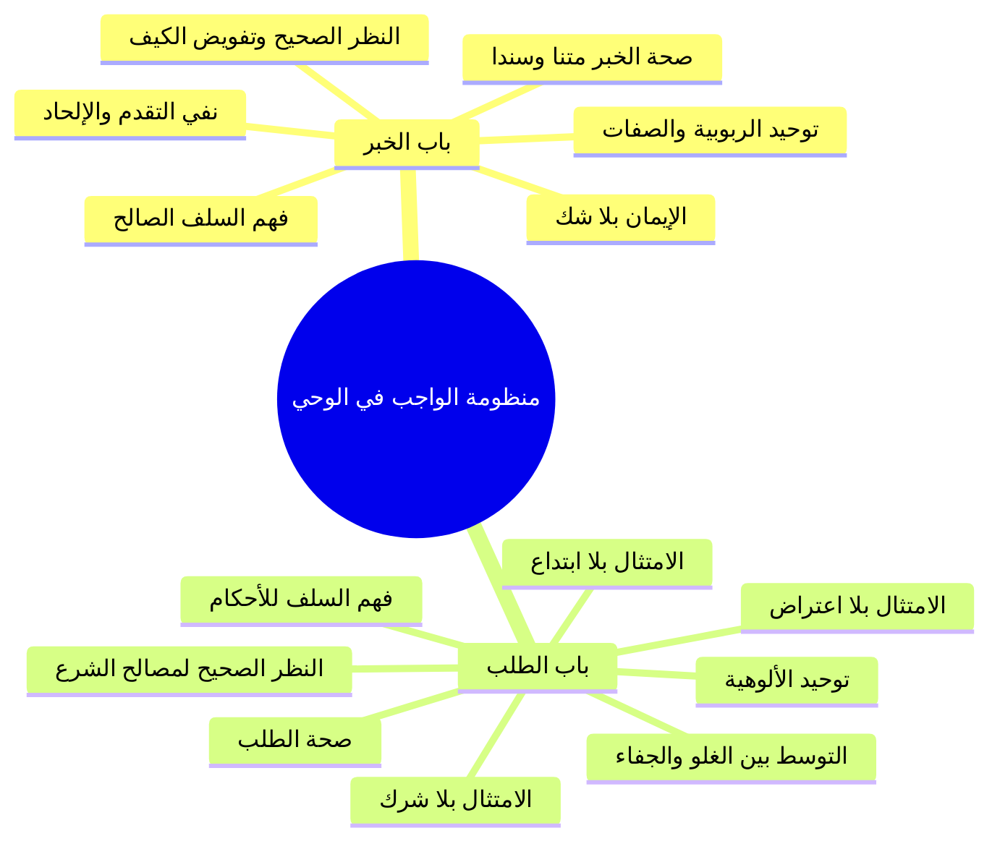

# 01 - الواجب تجاه الخبر والطلب وضوابط منهج السلف

> [!quote] الفترة المرجعية
> الأسطر 6–46 من [[تفريغ المحاضرة 13]] (مرجع ترقيم الأسطر لعدم وجود توقيت زمني دقيق في الأصل).

---

## 📝 الملخص العلمي المنظم

### 1. القاعدة الكبرى: التمييز بين باب الخبر وباب الطلب
- مدار التكليف في دين الإسلام ينقسم إلى بابين عظيمين:
  1. **باب الخبر:** وهو كل ما أخبر الله به عن نفسه وعن الغيب، ويشمل [[توحيد الربوبية]] و[[توحيد الأسماء والصفات]]، ومداره بين النفي والإثبات؛ والواجب الشرعي فيه هو: «الإيمان بالخبر بلا شك».
  2. **باب الطلب:** وهو كل ما طلبه الله من عباده من الأوامر والنواهي، ويشمل [[توحيد الألوهية]] والتشريع؛ والواجب الشرعي فيه هو: «امتثال الطلب بلا شرك».

---

### 2. ضوابط الواجب في باب الخبر (توحيد الربوبية والأسماء والصفات)
وضع منهج السلف ستة ضوابط محكمة في التعامل مع الأخبار العقدية:

1. **صحة الخبر سندا ومتنا:**
   - القرآن الكريم قطعي الثبوت وصدق وحق لا إشكال في ثبوته.
   - السنة النبوية منها الصحيح ومنها المكذوب والموضوع والضعيف؛ فلا نؤمن في العقائد إلا بالصحيح الثابت.
   > ⚠️ تنبيه
   > ا دحض فرية إهمال السلف للمتن: يُشاع عن أتباع المنهج السلفي أنهم يهتمون بالسند فقط ويهملون نقد المتن، وهذا افتراء باطل؛ إذ يدرس أئمة الحديث النص متناً وسنداً معاً لنفي الشذوذ والنكارة والعلل القادحة.

2. **الفهم الصحيح بفهم السلف الصالح:**
   - معيار صحة الفهم هو عرضه على ما فهمه الصحابة وأئمة القرون الثلاثة المفضلة.
   - نصوص الأسماء والصفات تُجرى على ظاهرها اللائق بجلال الله دون تأويل؛ فقوله تعالى: ﴿الرَّحْمَٰنُ عَلَى الْعَرْشِ اسْتَوَىٰ﴾ يُفسَّر بالاستواء الحقيقي اللائق بذاته سبحانه، دون تحريفه إلى «استولى».

3. **النظر الصحيح (موقع العقل وكيفية الصفات):**
   - **اشتمال الوحي على دلائله العقلية:** المسائل العقدية الخبرية جاءت مشفوعة بأدلتها العقلية داخل الوحي، فلا حاجة لاستيراد أدلة كلامية أو فلسفية من خارجه.
   - **استحالة معارضة العقل الصريح:** لا يمكن لنقل صحيح أن يعارض عقلاً صريحاً البتة.
   - **قطع الطمع في إدراك الكيفية:** ذات الله لا مثل لها ولا نظير، ولم يُبيّن لنا الشارع كيفية الصفات؛ فالواجب قطع الطمع عن إدراك الكيفية وتفويض علمها إلى الله جل جلاله، مع إثبات المعنى الظاهر.

4. **الإيمان بلا شك ولا ريب:**
   - قال تعالى: ﴿إِنَّمَا الْمُؤْمِنُونَ الَّذِينَ آمَنُوا بِاللَّهِ وَرَسُولِهِ ثُمَّ لَمْ يَرْتَابُوا﴾.

5. **عدم التقدم بين يدي الله ورسوله:**
   - قال تعالى: ﴿يَا أَيُّهَا الَّذِينَ آمَنُوا لَا تُقَدِّمُوا بَيْنَ يَدَيْ اللَّهِ وَرَسُولِهِ﴾؛ فلا تُقدَّم الآراء الشخصية، ولا الذوق، ولا الوجد، ولا الكشف الصوفي، ولا مناهج الكلام والفلسفة على نصوص الوحي.

6. **نفي الإلحاد في أسماء الله وصفاته:**
   - الإيمان بها كما أراد الله وأراد رسوله ﷺ، دون تحريف (تأويل باطل) أو تكييف أو تمثيل أو تعطيل.

---

### 3. ضوابط الواجب في باب الطلب (توحيد الألوهية)
يقوم امتثال الأوامر والنواهي الشرعية على سبعة ضوابط رئيسية:

1. **صحة الطلب:** العمل بما ثبت سنده ومتنه، وترك الضعيف والموضوع؛ مع التنبه إلى أن الضعيف لا يُحتج به في أصول الفرائض والتشريع، وإنما يُستأنس به عند بعضهم بشروط في فضائل الأعمال فقط.
2. **الفهم الصحيح بفهم السلف:** عرض الأوامر والنواهي على ما فهمه الصحابة والتابعون؛ فما لم يكن يومئذٍ ديناً فلن يكون اليوم ديناً.
3. **النظر الصحيح:** الاعتقاد الجازم بأن أوامر الشرع ونواهيه متضمنة لمصلحة العباد وسعادتهم وصلاح الفرد والمجتمع والروح والبدن في الدنيا والآخرة.
4. **الامتثال بلا شرك:** إفراد الله بالقصد والعبادة في كل فعل وترك، فلا يُقصد بالعمل إلا وجه الله.
5. **الامتثال بلا اعتراض:** تحريم الاعتراض على أحكام الشريعة بالآراء، أو العادات والأعراف، أو النظريات السياسية والاقتصادية الوضعية.
6. **الامتثال بلا ابتداع:** حفظ حدود العبادة في ستة أوصاف: الزمان، المكان، الجنس، المقدار، السبب، والكيفية/الهيئة.
7. **التوسط ونبذ الغلو والجفاء:**
   > ⚠️ تنبيه
   > ا التحذير من طرفي الغلو والجفاء:
   > - **الغلو:** التشدد والزيادة التي تُخرج العبد من دائرة الإسلام من الباب الآخر.
   > - **الجفاء:** ترك العمل بالكلية وإهمال شريعة الإسلام؛ فالذي يشهد أن لا إله إلا الله وأن محمداً رسول الله ثم يمتنع عن العمل بالكلية ولا يعبد الله بشيء لم يدخل في الإسلام.

---

## 📋 استخراج المعلومات العلمية

### منظومة الضوابط في بابي الخبر والطلب

| م | ضوابط التعامل مع باب الخبر (الربوبية والأسماء والصفات) | ضوابط التعامل مع باب الطلب (الألوهية والأحكام) |
|:---:|:---|:---|
| 1 | **صحة الخبر:** ثبوته سندا ومتنا ونفي الشذوذ والنكارة. | **صحة الطلب:** العمل بالثابت الصحيح ورد الموضوع. |
| 2 | **الفهم الصحيح:** بفهم الصحابة والقرون المفضلة بلا تأويل. | **الفهم الصحيح:** فهم السلف للأوامر والنواهي والشرائع. |
| 3 | **النظر الصحيح:** اشتمال الوحي على حججه وتفويض الكيفية. | **النظر الصحيح:** استيقان اشتمال الشرع على المصلحة والسعادة. |
| 4 | **الإيمان بلا شك:** التصديق الجازم بغير ريب. | **الامتثال بلا شرك:** إخلاص القصد التام لله وحده. |
| 5 | **عدم التقدم:** تقديم الوحي على العقل والرأي والذوق والفلسفة. | **الامتثال بلا اعتراض:** التسليم للشرع دون معارضة بعرف أو هوى. |
| 6 | **نفي الإلحاد:** البراءة من التحريف والتمثيل والتعطيل والتكييف. | **الامتثال بلا ابتداع:** الالتزام بالهيئة والمقدار والزمان والمكان والسبب. |
| 7 | — | **التوسط والاعتدال:** الحذر من الغلو والجفاء المؤدي لترك العمل. |

---

### خريطة المفاهيم: منظومة التعامل مع الوحي

---

## 🗣️ نص المتحدث الكامل

> في الحلقه الماضيه الاحبه هذا التعريف التوحيد في اللغه وفي الاصطلاح ثم اخذنا اقسام التوحيد من جهه ما يقوم به العبد من جهه ما يستحقه الرب واخذنا العلاقه بين اقسام التوحيد الثلاثه وقفنا عند الواجب علينا في توحيد الله
> فقلنا لما كان توحيد الربوبيه وتوحيد الاسماء والصفات فمن باب الخبر الدائر بين النفي والاثبات فقلنا وجب علينا الايمان بهذا الخبر بلا شك
> وقلنا لما كان توحيد الالوهيه هو من باب الطلب فوجب علينا امتثال هذا الطلب
> بلا شك نريد يعني ان نؤكد يعني على الواجب علينا في توحيد الله لانه في الحقيقه او الخلاصه الواجب علينا في نحو ديننا دين الاسلام وان كنا ايضا في المقدمات السابقه في مدخل العقيده البدايه قد اخذنا شيء من هذا لكن لا باس ان نؤكد عليه لاهميتها الخبر الوارد عن الله في الاثبات وتوحيد الربوبيه وتوحيد الاسماء صفاتهم من باب الخبر الدائر بان في الاثبات وما الواجب علينا ان نؤمن هنا اريد ان يلمح الى بعض القضايا ان نؤمن فقط نحن نهتم في هذا الامر ان نهتم بصحه الخبر ان نهتم بصحه الخبر من ناحيه الاسناد ومن ناحيه المثل بالنسبه للقران
> وبحمد الله صدق الو حق ولا اشكال عندنا في القران الاشكال في السنه النبويه
> بعض الاحاديث عن النبي صلى الله عليه وسلم
> موضوعه مكذوبه مختلقه وبعضها صحيح
> فما لا يهمنا في الامام بالخبر الايمان بالخبر الصحيح
> ونؤمن بال صحيح من تلك الاخبار وندرس الخبر الحديث سندا ومتنا
> لكن ما يقال عنه
> نحن الذين يسير وفقا مساره عليه النبي صلى الله عليه وسلم يقال ان هؤلاء السلف اتباع المنهج السلفي انهم يهتمون باسناد الحديث ولا يهتمون بمحنه هذا غير صحيح بل نحن ندرس الحديث حتى مثلا لا يكون الحديث شاذا لا يكون الحديث منكرا كيف لا ندرس ذلك يدرس الحديث سندا ومتنا ونؤمن بال صحيح الفارق الثاني هو الذي يفرق بين اتباع منهج السلف و الخلف هو الفهم الصحيح
> نحن نؤمن بال صحيح في الفهم الصحيح كيف نعرفه ان فهمنا لهذا الخبر فهما صحيحا ان نقوم ب عرضه على ما فهمه سلفنا الصالح من على ما فهم سلفنا الصالح من هذا النص عندنا فهم الصحابه وفهم ائمه القرون الثلاثه ائمه القرون الثلاثه المفضله عندنا نحن نعتمد فهمهم اعتمد فهم ولا ناتي بفهم يضاد فهم مضاد فهم السلف الصالح
> اذا كان سلفنا الصالح فهموا من الاسماء والصفات انها على ظاهرها اللائق بالله جل جلاله ولا يؤولون هذا الظاهر يفهمون هذا الظاهر على بالله سبحانه وتعالى ولا يقول تاويله فنحن لا ناتي بفهم فهمهم ويخالفهم الرحمن على العرش استوى
> فنقول كما قال سلفنا الصالح ان
> استواء اضافه الله الى نفسه فهو على ما يليق بذاته سبحانه وتعالى فلا ياتي ونقول استر يعني استولى لا هنا اتينا بفهم يخالف ويضاده فهم المساله في لصالح اذا لم لم الصحيح بفهم من صحيح صحيح الامر ثالث وهذا فارق ايضا فارق بانه بين اهل البدعه في هذا الباب بنظر صحيح
> نحن ننظر الى ان هذا الخبر ال العقائد الخمريه هذه قد اشتملت على ادلتها العقليه ما هو بحاجه الى دليل العقل قد جاء به هذا الوحي الوحي جاء بالمسائل العقديه مشتمله على دلائلها العقليه ف نحن ننظر الى هذا الخبر بهذا الشكل امر ثاني ننظر الى ان هذه العقائد ما يتعلق بتوحيد الربوبيه وتوحيد الاسماء والصفات وغير ذلك من العقائد لكن هنا نحن المتحده وصفات ان هذه الامور لكونها متعلقه بذات الله جل جلاله
> وذات الله غير وذات الله لا مثيل له فيها ولا نظير وبيان كيفيه الصفات لنا عن الصادق المصدوق صلى الله عليه وسلم بالتالي وجب علينا قطع الطمع الادراك هذه الكيفيه انا عارف الكيفيه ونفرض امرها الى الله جل جلاله
> لكن لا نقول ان هذه ان هذه الامور مخالفه للعقل لا يصح ولا يجوز نظرنا لهذا الوحي هذا الخبر نظره صحيحه ان المسائل العقديه مشتمله على ادلتها العقليه فلا نحتاج الى ادله عقليه من الخارج يعني كلام على الفلسفه ولا انكشفت خلاص المسائل العقليه العقليه جاءت بادلتها العقليه
> الامر الثاني انه لا يمكن ان تخالف العقل الصريح البته هذا يسمى نظرا صحيح
> بال صحيح صحيح صحيح
> مؤمن بلا شك
> انما المؤمنون الذين امنوا بالله ورسوله ثم لم يرتابوا خلاص لا شك عندنا في هذه الاخبار عن الله وعن رسوله الطالبان صحت وفهمنا الفهم الصحيح او الرابع والخامس ولا تقدم لان تقدم على هذه الاخبار لا نقدم انفسنا اراءنا ذوقنا واجب ولان قدم الاخرين لا نقدم اراء الرجال
> وانا نقدم المناهج ال الكلام ولا الكشف الذوق والفلسفه لان قد ما حدا على كلام الله وعلى كلام الرسول يا ايها الذين امنوا لا تقدموا بين يدي الله ورسوله واتقوا الله ان الله سميع الامر السادس ولا الحاد لا ناتي ل هذه الاخبار ان الرب سبحانه و تعالى في الربوبيه اسمائه وصفاته لا ناتي فن لحد فيها بتحريف او تكييف او تمثيل او تعطيل لا نؤمن بها كما اراد الله عز وجل
> واراد رسوله صلى الله عليه وسلم هذا هو الموقف من خبر الله سبحانه وتعالى ناتي ل لمواقف من الطلب في توحيد الالوهيه
> نحن نفس القضيه اولا لم تكن الصحيح ما كان ضعيفا او موضوعا من ناحيه السند او من ناحيه المثنى
> فهذا لا لمثله
> لانه ليس من الشرع ليس من الشرع تبقى الاحاديث الضعيفه في الفضائل الاعمال هذا لها شان الخاص يعني يمكن استاذ سبها في فضائل الاعمال
> اما في الفرائض
> وهذه الامور لا لا نقبل الا الصحيح مثل الصحيح بفهم صحيح ايضا هذا امر مهم نعرض فهمنا
> هذه الاوامر والنواهي على ما فهمه سلفنا الصالح اولئك الدين انزل عليهم ما لم يفهمه انه من الدين ما لم يكن من الدين
> ثم ذلك العصر فليس بدين حاليا ولذلك نحن نعتمد فهم الصحابه فهم ائمه القرون الثلاثه المفضله للنصوص الشرعيه فلان اتفهم الامر النواحي يخالف ما فهم وهم ايضا د فهو وهم لا يمكن ذلك بنظر صحيح
> ننظر الى ما طلبه الله عز وجل من فعل او ترك ان ذلك فيه مصلحتنا وفيه سعادتنا وفي صلاح الفرد والمجتمع في صلاح الدنيا والاخره في سعاده الرحم البدل ننظر الى هذا الشرع بنظر صحيح انه لا يخالف المصلحه وان فيه الصلاح وسعاده الافراد والمجتمعات ننظر اليه بنظره صحيح
> اذا تم ذلك فاننا نمثله بل اشرك لا يمكن ان نشرك في عباده الله سبحانه وتعالى فعلا او تركا معه غيره فلا نقصد الا الله جل جلاله
> بامتثال نال هذا الشرع ولا اعتراض لا نعترض على شرع الله سبحانه وتعالى لا نعترض على هذا الشرع بالاراء بالعادات بالاعراف باي شيء الاخر بالسياسه بالاقتصاد لا نعترض على شريعه الله سبحانه وتعالى لم تمثل بالاعتراض ولم من ابتداء لا ناتي لهذه الشريحه التي شرعها الله سبحانه وتعالى لنا لان غير في زمان ها لان غير في مكانها
> لان غير في جنسها لان غير في مقدارها لان غير في سببها لان غير في هيئتها في كيفيتها لا نبتدع لا نبتدا ولا نبتدع بجفاء فلان غلب في هذه العباده
> ولو يجعلنا نخرج من دائره الاسلام من الطرف الاخر من الباب الاخر ندخل من باب ثم اخرج من الباب الاخر بسبب هذا ال غلو ولا جفاء بحيث لا من دخل الاسلام يكون الانسان مجابهه لا يعمل بهذا الشريعه مهم الى هذه الشريعه وان كان يقول انه مؤمن بها لكنها لم يعمل بها البته الذي لا يمتثل يعني لشريعه الاسلام ولايات بما هو من خصائص المسلم ولا هذا ما دخل في الاسلام
> فاذا قال انا اشهد ان لا اله الا الله وان محمدا رسول الله ثم لا يريد ان يعمل يعبد الله وحده لا شريك له وبما شرع رسولنا صلى الله عليه وسلم البته بالكليه هذا ما دخل في الاسلام لا نريد الغلو ولا نريد الجفاء
> ون عبد الله سبحانه وتعالى بما شرعت هذا هو الواجب علينا تجاه ما طلبه الله عز وجل منه هذا الواجب علينا في توحيد الالوهيه وعرفنا الواجب علينا في توحيد الربوبيه وتوحيد الاسماء والصفات مع معرفتنا السبب في ذلك ما هو الواجب علينا وما السبب عرف له
> بحمد الله سبحانه وتعالى
> ناخذ فاصل ثم نعود اليكم
> بمشيئه الله سبحانه وتعالى

---

## 🔍 المراجعة الداخلية (5 مراجعات عشوائية)

1. **البداية (سطر 6–9):** مطابقة تامة لتقرير الأصلين: توحيد الربوبية والأسماء والصفات باب خبر (إيمان بلا شك)، وتوحيد الألوهية باب طلب (امتثال بلا شرك).
2. **منتصف البداية (سطر 16–18):** مطابقة تامة لنقد شبهة إهمال السلف للمتن، وإثبات دراستهم للسند والمتن لنفي الشذوذ والنكارة، واعتماد فهم القرون المفضلة.
3. **المنتصف (سطر 21–24):** مطابقة تامة لاشتمال الوحي على أدلته العقلية، ونفي معارضة العقل الصريح، وقطع الطمع في إدراك كيفية الصفات وتفويض علمها لله.
4. **منتصف النهاية (سطر 34–39):** مطابقة تامة لضوابط الطلب: صحة الطلب، الفهم السلفي، النظر المصلحي، الامتثال بلا شرك، ونفي الاعتراض بالعادات والسياسة.
5. **النهاية (سطر 40–43):** مطابقة تامة لنفي الابتداع في الأوصاف (زمان، مكان، جنس، مقدار، سبب، هيئة) والتحذير الصارم من الغلو المخرج والجفاء والتارك للعمل بالكلية.

---

## ⏭️ التنقل ومتابعة الإنجاز

- **السابق:** [[00 - مقدمة وخطة الأجزاء وعناصر المحاضرة]]
- **التالي:** [[02 - فاصل إمام السنة وحافظ زمانه ابن شهاب الزهري]]

> [!info] مؤشر الإنجاز
> - إجمالي أجزاء المحاضرة: 9 أجزاء (من 00 إلى 08)
> - الجزء الحالي: 01
> - الأجزاء المتبقية: 7 أجزاء
