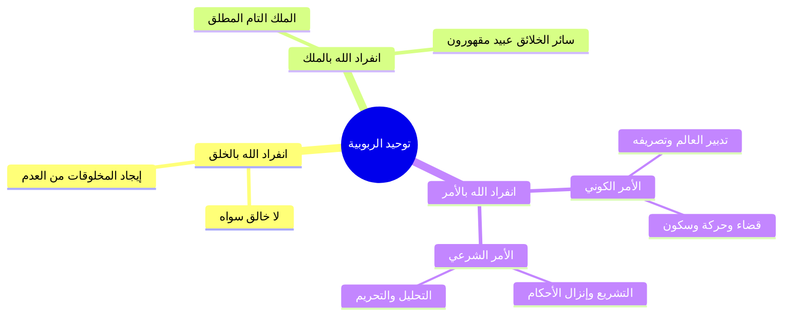

# 03 - تعريف الرب لغة واصطلاحاً وتوحيد الربوبية

> [!quote] الفترة المرجعية
> الأسطر 62–80 من [[تفريغ المحاضرة 13]] (مرجع ترقيم الأسطر لعدم وجود توقيت زمني دقيق في الأصل).

---

## 📝 الملخص العلمي المنظم

### 1. دلالة كلمة «الرب» في لسان العرب (لغة)
لكلمة «الرب» في لغة العرب حالتان من حيث الاستعمال والإطلاق:

1. **الحالة الأولى: الخلو من (أَلْ) مع التقييد أو الإضافة:**
   - **حكم إطلاقها:** تطلق على الله تعالى وتطلق على المخلوق.
   - **الشاهد في حق الله:** قوله تعالى: ﴿الْحَمْدُ لِلَّهِ رَبِّ الْعَالَمِينَ﴾.
   - **الشاهد في حق المخلوق:** قول العرب: «ربّ الدار»، «ربّ الفرس»، «ربّ الغلام».
   - **معانيها لغة:** تدور حول: المالك، الصاحب، السيد، المربي، المصلح.

2. **الحالة الثانية: التحلية بـ (أَلْ) والإطلاق دون تقييد ولا إضافة («الرَّب»):**
   - **حكم إطلاقها:** لا تُطلق إلا على الله جل جلاله وحده اختصاصاً.
   - **معناها في حق الله:** الخالق، المالك، المدبر، المصلح لأحوال سائر الخلق.

---

### 2. تعريف «الرب» شرعاً في تقريرات أئمة الإسلام
تضافرت نصوص أئمة التحقيق على بيان حقيقة اسم الرب جل جلاله:

- **شيخ الإسلام ابن تيمية رحمه الله:**
  ا - «الرب هو الذي يربي عبده، فيعطيه خَلْقه المناسب له، ثم يهديه إلى جميع أحواله من العبادة وغيرها».
  - وقرّر أيضاً: ا «فإن الرب سبحانه وتعالى هو المالك، المدبر، المعطي، المانع، الضار، النافع، الخافض، الرافع، المعز، المذل».
- **الإمام المقريزي رحمه الله:**
  ا - «الرب سبحانه وتعالى هو الخالق الموجد لعباده، القائم بتربيتهم وإصلاحهم، من خلق ورزق وعافية، وإصلاح دين ودنيا».
- **الشيخ عبد الرحمن بن ناصر السعدي رحمه الله:**
  ا - «الرب هو المربي لجميع عباده بالتدبير وأصناف النعم، وأخص من هذا تربيته لأصفيائه بصلاح قلوبهم وأرواحهم وأخلاقهم».

---

### 3. تعريف «توحيد الربوبية» اصطلاحاً
- **الحد الاصطلاحي الجامع:** هو اعتقاد انفراد الله بربوبيته للمخلوقات فلا رب لها سواه، وانفراده سبحانه بالخلق والمُلْك والأَمْر.
- **شمول الأمر لنوعيه:**
  1. **الأمر الكوني القدري:** وهو التصرف وتدبير شؤون الأفلاك والأكوان، وحركات وسكنات المخلوقات.
  2. **الأمر الشرعي الديني:** وهو اختصاصه سبحانه بوضع الشريعة والحكم والتحليل والتحريم للعباد.
- **كلام شيخ الإسلام ابن تيمية:**
  - استشهد بقوله تعالى: ﴿أَلَا لَهُ الْخَلْقُ وَالْأَمْرُ ۗ تَبَارَكَ اللَّهُ رَبُّ الْعَالَمِينَ﴾ [الأعراف: 54].
  - وبيّن أنه سبحانه: «خالق كل شيء وربه ومليكه، لا خالق غيره ولا رب سواه، ما شاء كان وما لم يشأ لم يكن؛ فكل ما في الوجود من حركة وسكون فبقضائه وقدره ومشيئته وقدرته وخلقه، فلا تتحرك ذرة في هذا الكون إلا بمشيئته، ولا تسكن إلا بمشيئته».

---

## 📋 استخراج المعلومات العلمية

### الفرق بين حالتي استعمال لفظ «الرب» في لسان العرب

| الحالة الاستعمالية | الصيغة والتركيب | حكم الإطلاق | المعنى والدلالة |
|:---|:---|:---|:---|
| مقيدة ومضافة بدون (أل) | ربّ الدار / ربّ العالمين | يطلق على الخالق والمخلوق | المالك، الصاحب، السيد المطاع، المربي، المصلح |
| مطلقة ومحلاة بـ (أل) | «الرَّبُّ» | خاص بالله تعالى لا يجوز إطلاقه على غيره | المتفرد بالخلق والملك والتدبير المطلق والإصلاح لجميع الخلق |

---

### أبعاد «الأمر» في توحيد الربوبية

| نوع الأمر الإلهي | حقيقته ومظهره | الشاهد والواجب على المكلف |
|:---|:---|:---|
| **الأمر الكوني** | تدبير الكون، حركات الأفلاك والخلائق، الإحياء والإماتة، وتصريف المقادير | الاعتقاد الجازم بأنه ما شاء الله كان وما لم يشأ لم يكن |
| **الأمر الشرعي** | إنزال الكتب، إرسال الرسل، التشريع، وتحديد الحلال والحرام والفرائض | الإذعان للتحكيم الشرعي ونفي منازعة الله في سلطة التشريع |

---

### خريطة المفاهيم: أركان توحيد الربوبية

---

## 🗣️ نص المتحدث الكامل

> رب العالمين والصلاه والسلام على اشرف المرسلين محمد وعلى اله وصحبه اجمعين وبعد ايها الاحبه في الله ناخذ الان في القسم الثاني من هذا الدرس ناخذ التعريف توحيد الربوبيه وناخذ في التعريف توحيد الربوبيه تعريف الرب في اللغه والاصطلاح وتعريف توحيد الربوبيه ووصول توحيد الربوبيه وانواع ربوبيه الله لخلقه اولا ايها الاحبه في الله كلمه الرب في اللغه لها حالتان الحاله الاولى حاله الاطلاق او حاله الخلو من ال التاريخ ما يقال الرب يقرر لكنها تذكر مقيده ومضافه رب الدار ورب العالمين
> هذه الحاله الاولى التي تكون خاليه من ال وتاتي مقيده ومضافه ففي هذه الحاله تطلق على الله سبحانه وتعالى مثل الحمد لله رب العالمين
> وتطلق على المخلوق مثل رب الدار والفرس والغلام ويكون معنى المالك الصاحب السيد المربى المصلح
> وهكذا الحاله الثانيه حاله حال التعريف بال الرب و الاطلاق بدون تقيد او اضافه الرب
> ففي هذه الحاله لا تطلق الا على الله جل جلاله فالرب هو الله سبحانه وتعالى
> فهو الرب اي لخلقه الخالق المالك المدبر المصلح لاح والخلق يقول شيخ الاسلام ابن تيميه معرفه الرب شرعا الرب هو الذي يربي عبده فيعطيك خلقه خلقه المناسب له
> ثم هديه الى جميع احواله من العباده وغيرها
> هذا هو الرب الرب هو الذي يربي عبده فيعطيه خلقه ثم هديه الى جميع احواله من العباده وغيرها
> وقال ايضا فان الرب سبحانه وتعالى هو المالك المدبر المعطي المانع الضار النافع الخافض الرافع المعز المذل يقول المقريزي الرب سبحانه وتعالى هو الخالق الموجد لعباده القائم بتربيتهم واصلاح هم من خلق رزق وعافيه واصلاح دين ودنيا يقول الشيخ عبد الرحيم الاستاذ الرب هو المربي جميع عباده والمربي جميع عباده بالتدبير واصناف النعم
> واخص من هذا تربيته لاصفيائه بصلاح قلوبهم وارواحهم واخلاقه تعريف توحيد الربوبيه اذا احيل الرب هو اعتقاد انفراد الله بما ذكرناه من خصائص الرب سبحانه وتعالى اعتقاد انفراد الله بربوبيته للمخلوقات فلا ربي لها سواه
> وهو اعتقاد ان الله هو المنفرد بالخلق والملك والامر يدخل في الامر الامر الكوني
> والامر الشرعي الامر الكوني يعني تدمير الكون
> والامر الشرعي يعني وضع الشريعه للناس
> انا اعتقد انفراد الله بربوبيته في الخلق والملك والتدبير الكوني والتشريع يقول ابن تيميه رحمه الله فان الله سبحانه وتعالى له الخلق والامر
> كما قال تعالى ان ربكم الله الذي خلق السماوات والارض في سته ايام ثم استوى على العرش يغشي الليل النهار يطلبه حثيثا والشمس والقمر والنجوم مسخرات بامره الا له الخلق والامر تبارك الله رب
> العالمين
> فهو سبحانه و تعالى خالق كل شيء وربه ومليكه لا خالق غيره ولا رب سواه ما شاء كان وما لم يشا لم يكن
> فكل ما في الوجود من حركه وسكون
> فكل ما في الوجود من حركه وسكون وبقضائه وقدره و مشيئته وقدرته وخلقه تتحرك في هذا الكون الا
> بمشيئه الله والله تسكن في هذا الكون الا بمشيئته هذا هو توحيد الربوبيه

---

## 🔍 المراجعة الداخلية (5 مراجعات عشوائية)

1. **البداية (سطر 62–64):** مطابقة تامة لتقسيم حالتي الرب لغة (الخلو من أل والإضافة إلى مقيد)، وجواز إطلاقها على الله والمخلوق.
2. **منتصف البداية (سطر 65–67):** مطابقة تامة لاختصاص صيغة «الرب» المعرفة بأل بالله وحده، ونقل كلام ابن تيمية في تربية العبد بهدايته إلى أحواله.
3. **المنتصف (سطر 70–71):** مطابقة تامة لنصوص الأئمة الثلاثة: ابن تيمية (المالك المدبر...)، والمقريزي (الخالق الموجد القائم بتربيتهم...)، والسعدي (تربية عامة بالتدبير وخاصة للأصفياء).
4. **منتصف النهاية (سطر 71–75):** مطابقة تامة لتعريف توحيد الربوبية بالانفراد بالخلق والملك والأمر، وتفصيل الأمر إلى كوني (تدبير الكون) وشرعي (وضع الشريعة).
5. **النهاية (سطر 76–81):** مطابقة تامة للاستدلال بآية الأعراف ﴿ألا له الخلق والأمر﴾، وتقعيد أن كل حركة وسكون في الكون خاضعة لقضائه وقدره وخلقه.

---

## ⏭️ التنقل ومتابعة الإنجاز

- **السابق:** [[02 - فاصل إمام السنة وحافظ زمانه ابن شهاب الزهري]]
- **التالي:** [[04 - أصلا توحيد الربوبية وانحراف الفرق فيهما]]

> [!info] مؤشر الإنجاز
> - إجمالي أجزاء المحاضرة: 9 أجزاء (من 00 إلى 08)
> - الجزء الحالي: 03
> - الأجزاء المتبقية: 5 أجزاء
