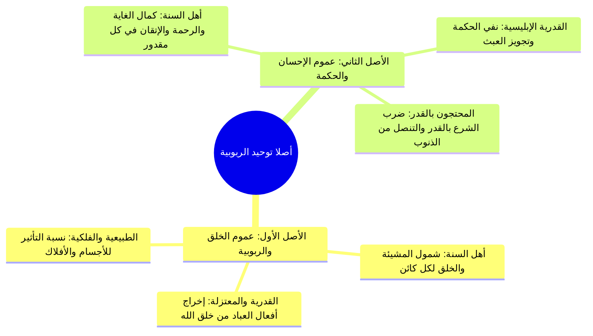

# 04 - أصلا توحيد الربوبية وانحراف الفرق فيهما

> [!quote] الفترة المرجعية
> الأسطر 81–104 من [[تفريغ المحاضرة 13]] (مرجع ترقيم الأسطر لعدم وجود توقيت زمني دقيق في الأصل).

---

## 📝 الملخص العلمي المنظم

### 1. الأصلان العظيمان لتوحيد الربوبية
يقوم توحيد الربوبية في عقيدة أهل السنة والجماعة على أصلين قرآنيين محكمين:

1. **الأصل الأول: عموم خلقه وربوبيته:**
   - شمول مشيئته وقدرته وخلقه لكل موجود في الكون؛ فكل ما سوى الله مخلوق له، لا يخرج عن ملكه وتدبيره شيء، وما شاء كان وما لم يشأ لم يكن.
2. **الأصل الثاني: عموم إحسانه وحكمته ورحمته:**
   - كل ما خلقه الله وقدره فقد خلقه على غاية الإتقان والإحسان والحكمة البالغة والرحمة التامة؛ فليس في أفعاله عبث ولا سفه، بيده الخير كله وهو أرحم الراحمين.

---

### 2. الأدلة القرآنية الجامعة بين الأصلين
- **الدليل الأول:** قوله تعالى: ﴿الَّذِي أَحْسَنَ كُلَّ شَيْءٍ خَلَقَهُ ۖ وَبَدَأَ خَلْقَ الْإِنسَانِ مِن طِينٍ﴾ [السجدة: 7]:
  - «أحسن كل شيء خلقه»: دليل عموم الإحسان والحكمة.
  - «وبدأ خلق الإنسان من طين»: دليل عموم خلقه وربوبيته.
- **الدليل الثاني:** قوله تعالى عن جواب موسى لفرعون: ﴿قَالَ رَبُّنَا الَّذِي أَعْطَىٰ كُلَّ شَيْءٍ خَلْقَهُ ثُمَّ هَدَىٰ﴾ [طه: 50]:
  - «أعطى كل شيء خلقه»: أي صورته وهيئته المناسبة له لحكمته وإحسانه.
  - «ثم هدى»: دلالة عموم ربوبيته وهدايته لمصالحه ومعاشه.
- **الدليل الثالث:** سورة الفاتحة:
  - ﴿الْحَمْدُ لِلَّهِ رَبِّ الْعَالَمِينَ﴾: عموم الخلق والربوبية والملك.
  - ﴿الرَّحْمَٰنِ الرَّحِيمِ﴾: عموم الإحسان والرحمة والحكمة.
  - ﴿مَالِكِ يَوْمِ الدِّينِ﴾: وضع الشريعة ومجازاة العباد بالعدل يوم الحساب.
- **الدليل الرابع:** قوله تعالى: ﴿قُلِ اللَّهُمَّ مَالِكَ الْمُلْكِ تُؤْتِي الْمُلْكَ مَن تَشَاءُ وَتَنزِعُ الْمُلْكَ مِمَّن تَشَاءُ وَتُعِزُّ مَن تَشَاءُ وَتُذِلُّ مَن تَشَاءُ ۖ بِيَدِكَ الْخَيْرُ ۖ إِنَّكَ عَلَىٰ كُلِّ شَيْءٍ قَدِيرٌ﴾ [آل عمران: 26].

---

### 3. شمول الربوبية لقلوب العباد والكون
- الإيمان بأن قلوب العباد ونواصيهم بيد الله سبحانه؛ وما من قلب إلا وهو بين إصبعين من أصابع الرحمن، إن شاء أن يقيمه أقامه وإن شاء أن يزيغه أزاغه.
- هو سبحانه الذي أضحك وأبكى، وأمات وأحيا، وأغنى وأقنى، ويحيي الأرض بعد موتها، وهو أرحم بعباده من الوالدة الرؤوف بولدها.

---

### 4. انحراف الفرق العقدية في أصلَي الربوبية (تحقيق كلام ابن تيمية)
بيّن شيخ الإسلام ابن تيمية أن الناس حيال هذين الأصلين ضلت منهم طوائف:

1. **الضالون في الأصل الأول (عموم الخلق والربوبية):**
   > ⚠️ تنبيه
   > ا ضلال القدرية النفاة والمعتزلة: يخرج هؤلاء أفعال العباد وحركاتهم الاختيارية من عموم خلق الله، ويزعمون أن العبد خالق لفعله استقلالاً، أو يضيفون التأثير إلى الطبائع والأفلاك والنفوس والأسباب المخلوقة العاجزة؛ وهذا شرك ظاهر في توحيد الربوبية وقصور في إثبات عموم قدرة الله وخلقه.

2. **الضالون في الأصل الثاني (عموم الإحسان والحكمة):**
   > ⚠️ تنبيه
   > ا ضلال القدرية الإبليسية والجبرية: يجحد هؤلاء حكمة الله تعالى أو يعرضون عنها متوهمين خلو بعض المخلوقات من الحكمة والرحمة، ويجعلون تعارضاً بين الشرع والقدر، أو يحتجون بالقدر على الذنوب والمعاصي (كقول المشركين: ﴿لو شاء الله ما أشركنا﴾). وسُموا إبليسية تشبيهاً باحتجاج إبليس على ربه حين قال: ﴿بِمَا أَغْوَيْتَنِي﴾ متنصلاً من مسؤوليته.

---

## 📋 استخراج المعلومات العلمية

### جدول مقارنة انحراف الفرق في أصلَي توحيد الربوبية

| الأصل العقدي | مذهب أهل السنة والجماعة | الفرقة المنحرفة | وجه الانحراف والشبهة |
|:---|:---|:---|:---|
| الأول: عموم خلقه وربوبيته | كل موجود وفعل داخل في خلق الله ومشيئته وقدرته التامة | القدرية الأولى والمعتزلة | أخرجوا أفعال العباد من خلق الله وأضافوها للإنسان أو الطبائع |
| الثاني: عموم إحسانه وحكمته | كل أفعاله وقدره لحكمة بالغة وعدل ورحمة وإتقان لا عبث فيه | القدرية الإبليسية ونفاة الحكمة | نفوا الحكمة، وظنوا قصور الرحمة، واحتجوا بالقدر على معارضة الشرع |

---

### خريطة المفاهيم: أركان توحيد الربوبية والفرق المقابلة

---

## 🗣️ نص المتحدث الكامل

> وتوحيد الربوبيه يقوم على اصلين اثنين الاصل الاول عموم خلقه وربوبيته الخلق الربوبيه الاصل الثاني عموم الاحسان والحكمه قال تعالى
> الذي احسن كل شيء خلقه
> هذا عموم الاحسان والحكمه وبدا خلق الانسان من طين هذا الممر الخلق الروميه قال تعالى قال ربنا الذي اعطى كل شيء خلقه ثم هدى عندما قال في العون لموسى قال فمن ربكما يا موسى قال ربنا الذي اعطى كل شيء خلقه يعني المناسب لهذا عموما حسان وحكمته ثم هدى هذا عموم خلقه مرتين قال تعالى الحمد لله رب العالمين الرحمان الرحيم
> هذا عم واحسانه ورحمته وحكمته في خلقه الربوبيه الخلقه
> مالك يوم الدين
> الحمد لله رب العالمين مالك يوم اذا هو في في خلقه قد هداهم وضع له الشريعه وسيحاسبهم عليها يوم القيامه
> هم خلقه وربوبيته قال تعالى قل اللهم مالك الملك تؤتي الملك من تشاء وتنزع الملك ممن تشاء وتعز من تشاء وتذل من تشاء بيدك الخير انك على كل شيء قدير تولج الليل في النهار وتولج
> وتخرج الحي من الميت وتخرج الميت من الحي وترزق من تشاء بغير حساب
> هذه ربوبيه الله الخلق التوحيد الربوبيه يقوم على اصلين عظيمين هما عموم خلقه وربوبيته وعموما حس انه وحكمتهم فنعتقد ان الله رب العالمين
> وانه رب السماوات والارضين وما بينهما ورب العرش العظيم
> وهو خالق كل شيء وهو على كل شيء وكيل
> وهو رب كل شيء ومليكه وهو مالك الملك يؤتي الملك من يشاء وينزع الملك ممن يشاء ويعز من يشاء ويذل من يشاء بيده الخير وهو على كل شيء قدير
> نعتقد ان له ما في السماوات وما في الارض وما بينهما وما تحت الثرى قلوب العباد
> ونواصل وما من قلب الا وهو بين اصبعين من اصابع الرحمن ان شاء ان يقيمه اقامه وان شاء ان يزيغه ازاغه وهو الذي اضحك وابكى واغلى واقناع وهو الذي يرسل الرياح بشرا بين يدي رحمته وينزل من السماء ماء فيحيي به الارض بعد موتها وبث فيها من كل دابه و ما شاء كان وما لم يشا لم يكن ولا حول ولا قوه الا بالله ولا ملجا منه الا اليه
> لا اعتقد انه قد اعطى كل شيء خلقه ثم هدى و احسن كل شيء خلقه واتقن كل شيء صلاه الخير كله بيديه وهو ارحم الراحمين
> وهو ارحم بعباده من الوالده بولدها الى نحو هذه
> الان التي تقضي شهور حكمته واتقانه واحسان خلقه واحسان خلق كل شيء وسعه رحمته وعظمته يقول ابن تيميه رحمه الله
> هذان الاصلان عموم خلقه وربوبيته ومن حسن وحكمته اصلان عظيم ان وان كان من الناس من يكفر ببعض من يكفر ببعض الاول عموم خلقه ولم ميته القدريه القدريه وخلقه يخرجون افعال العباد من خلقه ويضيفونها الى الاختيار الانسان او الطبيعه الذين يقطعون اضافه الفعل الى الله سبحانه وتعالى
> ويضيف ونه اما الى الطبع او الى جسم فيه طبعا او الى فلك او الى نفس او غير ذلك مما هو من مخلوقاته العاجزه على اقامه نفسها
> فهي عن اقامه غيرها اعجز القدريه سواء القدريه الاوائل او المعتزله يضيفون بعض مخلوقات الله سبحانه وتعالى يخرجونها من عموم خلق الله سبحانه وتعالى ويضيفونها الى الانسان او يضيفونها الى الاسباب
> وهذا اذن بالله نقص في هذا التوحيد والشرك في توحيد الربوبيه و من الناس عموما حسان وحكمته من الحكمه من الناس ما نجح البعض الثاني او يعرض عنه متوهما كل شيء من مخلوقاته عن احسان خلقه واتقانه وعن حكمته
> ويظل قصور رحمته و عجزها من القدريه الابليسيه او الواجب وسيه وغيرهم القدريه الابليسيه او القدريه المجوسيه هؤلاء جبريه وجذريه منهم من يجعل هناك تناقض بين الشرع والقدر ومنهم من يحتج بالقدر على ذنوبه ومعاصيه قالوا لو شاء الله ما اشركنا ولا اباؤنا هؤلاء المشركين ابليس
> اه القدريه الابليسيه الجبريه الابليسيه يقولون ان ابليس عندما قال الله عز وجل له ما منعك ان تسجد لما خلقت بيدي انه كان المفترض ان يقول ان تم نعتني فهؤلاء يجعلون هناك تعارض بين الشرع و القدر و ينفون حكمه الله سبحانه وتعالى عن الشرع والقدر وهكذا
> واولئك يخرجون بعض مخلوقات الله سبحانه وتعالى عن عموم خلقه وهؤلاء يجعلون بعض الاشياء انها لا حكمه فيها ولا رحمه ولا احسان وكلا الفريقين تحقيق وتوحيد الربوبيه ان نؤمن ب عموم خلق هو ربوبيته لا يخرج ال خلق الله سبحانه وتعالى شيء ولا يمكن ان يكون هناك شيء خارج عن ربوبيه الله سبحانه وتعالى له ولا يمكن ان يكون فيه هناك شيء من مخلوقات الله خارج عن الحكمه وعن الاحسان وعلى الرحمه

---

## 🔍 المراجعة الداخلية (5 مراجعات عشوائية)

1. **البداية (سطر 81–84):** مطابقة تامة لتقرير الأصلين: عموم خلقه وربوبيته، وعموم إحسانه وحكمته، والاستدلال بآية السجدة وطه والفاتحة.
2. **منتصف البداية (سطر 87–93):** مطابقة تامة لآية آل عمران (ملك الملك) وإثبات ربوبية الله للسماوات والعرش وكل شيء.
3. **المنتصف (سطر 94–97):** مطابقة تامة لشمول الربوبية لقلوب العباد ونواصيهم والضحك والبكاء والمطر، وكونه أرحم بعباده من الوالدة بولدها.
4. **منتصف النهاية (سطر 98–101):** مطابقة تامة لنقل كلام ابن تيمية في كفر القدرية بالأصل الأول ونسبتهم الأفعال للإنسان أو الطبيعة أو الفلك وتأكيد أن ذلك شرك في الربوبية.
5. **النهاية (سطر 101–104):** مطابقة تامة لبيان ضلال القدرية الإبليسية والجبرية في نفي الحكمة والاحتجاج بالقدر على معارضة الشرع، وتقرير مذهب أهل السنة في الجمع بين كمال الخلق وكمال الحكمة.

---

## ⏭️ التنقل ومتابعة الإنجاز

- **السابق:** [[03 - تعريف الرب لغة واصطلاحا وتوحيد الربوبية]]
- **التالي:** [[05 - أنواع ربوبية الله لخلقه العامة والخاصة]]

> [!info] مؤشر الإنجاز
> - إجمالي أجزاء المحاضرة: 9 أجزاء (من 00 إلى 08)
> - الجزء الحالي: 04
> - الأجزاء المتبقية: 4 أجزاء
