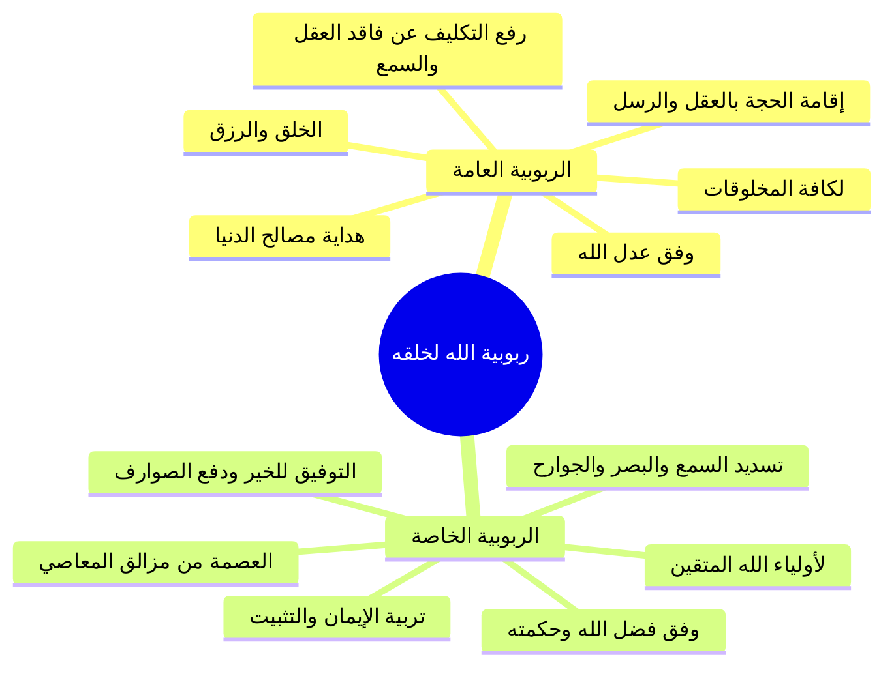

# 05 - أنواع ربوبية الله لخلقه العامة والخاصة

> [!quote] الفترة المرجعية
> الأسطر 104–109 والأسطر 119–123 من [[تفريغ المحاضرة 13]] (مرجع ترقيم الأسطر لعدم وجود توقيت زمني دقيق في الأصل).

---

## 📝 الملخص العلمي المنظم

### 1. تقسيم ربوبية الله لخلقه
تنقسم تربية الله وربوبيته لخلقه إلى نوعين رئيسيين:
1. **الربوبية العامة.**
2. **الربوبية الخاصة.**

---

### 2. الربوبية العامة (مقتضى العدل الإلهي)
- **حقيقتها:** هي خلقه سبحانه وتعالى لجميع المخلوقين، ورزقهم، وتدبير شؤونهم، وهدايتهم لما فيه مصالح معاشهم وبقائهم في هذه الحياة الدنيا.
- **شمولها:** تعمّ جميع المخلوقات بلا استثناء: الإنس والجن، والبر والفاجر، والمؤمن والكافر، والحيوان وسائر الكائنات.
- **مقتضاها الشرعي (مبدأ العدل الإلهي):**
  - تجري الربوبية العامة وفق «عدل الله سبحانه وتعالى»؛ فمن عدله أنه أعطى خلقه مقومات التكليف: الفطرة المستقيمة، والعقول الواعية، والجوارح السليمة، وأرسل إليهم الرسل وأنزل الكتب بياناً للحجة.
  - **قواعد العدل في المحاسبة ورفع التكليف:**
    - من حُرم نعمة العقل (كالمجنون): لا يحاسبه الله.
    - من حُرم نعمة الإرادة (كالمكره وفاقد الاختيار): لا يحاسبه الله.
    - من حُرم حاستي السمع والبصر معاً أو لم يبلغه شرع ولا رسالة: يرحمه الله ويرفع عنه التكليف ولا يعذبه.

---

### 3. الربوبية الخاصة (مقتضى الفضل والحكمة الإلهية)
- **حقيقتها:** هي تربيته سبحانه وتعالى لأصفيائه وأوليائه المتقين؛ فيربيهم بنور الإيمان، ويوفقهم له، ويُكمّله في قلوبهم، ويدفع عنهم الصوارف والفتن والعوائق الحائلة بينهم وبينه.
- **جوهرها:** هي «تربية التوفيق لكل خير، والعصمة من الشرور»؛ فيسدد جوارحهم (سمعهم، أبصارهم، أيديهم، أرجلهم) لتعمل في طاعة الله، ويصرفها عن معصيته.
- **مقتضاها (مبدأ الحكمة والفضل الإلهي):**
  - تجري الربوبية الخاصة وفق «حكمة الله وفضله»؛ فمن أقبل على طاعة ربه وسار على صراطه زاده الله هدى وتثبيتاً، وهؤلاء هم أولياء الله: ﴿الَّذِينَ آمَنُوا وَكَانُوا يَتَّقُونَ﴾، يتولاهم الله فيحملهم على الخير حملاً ويصرفهم عن مواطن السوء.

---

## 📋 استخراج المعلومات العلمية

### جدول المقارنة بين الربوبية العامة والربوبية الخاصة

| وجه المقارنة | الربوبية العامة | الربوبية الخاصة |
|:---|:---|:---|
| **المشمولون بها** | جميع الخلائق (مؤمن، كافر، بر، فاجر، وسائر الدواب) | أولياء الله والمؤمنون المتقون وأصفياؤه |
| **المقتضى الإلهي الحاكم** | تجري بمقتضى **عدل الله المطلق** | تجري بمقتضى **فضل الله وحكمته البالغة** |
| **مظاهر التربية** | الإيجاد، الرزق، سلامة العقل والحواس، الهداية لمصالح المعاش | غرس الإيمان، توفيق القلوب، دفع العوائق، وتسديد الجوارح |
| **أثرها في النجاة الأخروية** | لا تكفي وحدها للنجاة من العذاب ودخول الجنة | سبب السعادة الأبدية والتوفيق والنجاة في الدارين |
| **شروط وضوابط التكليف** | قيام الحجة بالعقل والحواس والرسل، وسقوط الإثم عن فاقدها | زيادة الهدى لمن استجاب، ومزيد العصمة والحفظ من الفتن |

---

### خريطة المفاهيم: أقسام ربوبية الله لخلقه

---

## 🗣️ نص المتحدث الكامل

### المقطع الأول (الأسطر 104–109):
> عمومية الله لخلقه تربية الله تعالى لخلقه نوعا عامه وخاصه العامه هي خلقه سبحانه وتعالى للمخلوقين خلقه للمخلوقين ورزقهم وهدايتهم لما فيه مصالحهم التي فيها بقائهم في الدنيا هذه رميه الله عامه الله عز وجل عامه لجميع المخلوقات خلقهم ورزقهم حد اه اعطاهم الاشياء التي تمكنهم من الحياه المده التي ارادها الله سبحانه وتعالى لهم فيها هذا عموم خلقه هذه الربوبيه العامه
> وهناك الربوبيه خاصه
> نسال الله سبحانه وتعالى من فضله الربوبيه الخاصه هي تربيته سبحانه وتعالى لاوليائه فيربيهم بالايمان و يوفقهم له ويك منه لهم ويدفع عنهم الصوارف والعوائق الحائله بينه بينهم وبين هذا
> ا حقيقتها التربيه الخاصه تربيه التوفيق لكل خير
> والعصمه الله سبحانه وتعالى ياتي لاوليائه يوفقهم في سمعهم وابصارهم في ايديهم في ارجلهم في خروجهم فيجعل هم يستخدمون هذه الجوارح في طاعه الله ويصرفهم عن استخدامها في معصيه الله
> هذه وفق حكمته سبحانه وتعالى ناخذ فاصل ثم نعود اليكم مره اخرى بمشيئه الله

### المقطع الثاني (الأسطر 119–123):
> حياكم الله ايها الاحبه في الله وقفنا عند انواع ربوبيه الله الى خلقه قلنا هناك ربوبيه عامه الربوبيه العامه هذه يبقى عدل الله سبحانه وتعالى
> فمن عدله جل جلاله ان كل عباده على اه على شرعه على طاعته فاعطاهم الفطره الفطره المستقيمه اعطاهم العقول اعطاهم الجوارح اعطاهم الرسل بعد فهم الرسل خلقهم رزق احد اهم هذه التربيه عامه وفق عدله سبحانه وتعالى
> ولذلك من حرمه نعمه العقل
> فان الله سبحانه وتعالى لا يحاسب من حرم نعمه الاراده فان الله سبحانه وتعالى لا يحاسبه يكون الحساب يوم القيامه من حرم نعمه السمع والبصر
> وجاء الشرع وهو لا يسمع ولا يبصر فهذا الله سبحانه وتعالى يرحمه من حرم نعمه الشرع فهذا الله سبحانه وتعالى التكليف واكد هذه الربوبيه ربوبيه الله العامه تكون وفق عدلها وهناك عموميه خاصه تكون وفق حكمته سبحانه وتعالى ان من اطاعه فان الله سبحانه وتعالى يزيده هدى وتقوى
> فهؤلاء الذين يسيرون في طاعه الله هم اولياء الله الذين امنوا وكانوا يتقون يتولاهم الله فيربيهم ربوبيه خاصه وهي رميه التوفيق يحملهم على الخير حملا ويصرفهم عن الشر الله الخلق

---

## 🔍 المراجعة الداخلية (5 مراجعات عشوائية)

1. **البداية (سطر 104):** مطابقة تامة لتعريف الربوبية العامة بخلق جميع المخلوقين ورزقهم وهدايتهم لمصالح بقائهم في الدنيا.
2. **منتصف البداية (سطر 106–107):** مطابقة تامة لتعريف الربوبية الخاصة بتربية الأولياء بالإيمان وتكميله ودفع الصوارف والعوائق.
3. **المنتصف (سطر 108):** مطابقة تامة لبيان حقيقة الربوبية الخاصة بأنها التوفيق لكل خير والعصمة وتسديد الجوارح (السمع والبصر والأيدي والأرجل) في طاعة الله.
4. **منتصف النهاية (سطر 119–122):** مطابقة تامة لربط الربوبية العامة بعدل الله بإعطاء الفطرة والعقول والجوارح وإرسال الرسل، وبيان سقوط التكليف عن فاقد العقل والإرادة والحواس.
5. **النهاية (سطر 123):** مطابقة تامة لربط الربوبية الخاصة بحكمة الله وفضله في زيادة الهدى والتقوى للمستجيبين وتوليه لهم بحملهم على الخير وصرفهم عن الشر.

---

## ⏭️ التنقل ومتابعة الإنجاز

- **السابق:** [[04 - أصلا توحيد الربوبية وانحراف الفرق فيهما]]
- **التالي:** [[06 - فاصل الوساوس الشيطانية وحقيقتها وسبل مدافعتها]]

> [!info] مؤشر الإنجاز
> - إجمالي أجزاء المحاضرة: 9 أجزاء (من 00 إلى 08)
> - الجزء الحالي: 05
> - الأجزاء المتبقية: 3 أجزاء
