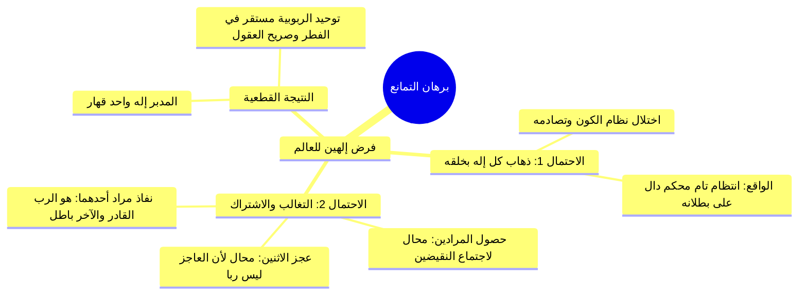

# 07 - أدلة توحيد الربوبية القرآنية وبرهان التمانع العقلي

> [!quote] الفترة المرجعية
> الأسطر 124–154 من [[تفريغ المحاضرة 13]] (مرجع ترقيم الأسطر لعدم وجود توقيت زمني دقيق في الأصل).

---

## 📝 الملخص العلمي المنظم

### 1. الأدلة القرآنية على تفرد الله بالربوبية
تضافرت نصوص الوحي على إثبات انفراد الله بالخلق والملك والتدبير، ومنها:

1. **سورة الأعراف (الآية 54):**
   - ﴿إِنَّ رَبَّكُمُ اللَّهُ الَّذِي خَلَقَ السَّمَاوَاتِ وَالْأَرْضَ فِي سِتَّةِ أَيَّامٍ ثُمَّ اسْتَوَىٰ عَلَى الْعَرْشِ يُغْشِي اللَّيْلَ النَّهَارَ يَطْلُبُهُ حَثِيثًا وَالشَّمْسَ وَالْقَمَرَ وَالنُّجُومَ مُسَخَّرَاتٍ بِأَمْرِهِ ۗ أَلَا لَهُ الْخَلْقُ وَالْأَمْرُ ۗ تَبَارَكَ اللَّهُ رَبُّ الْعَالَمِينَ﴾.
   - تضمنت الآية أركان الربوبية: الخلق، والملك، والتدبير الكوني، والأمر النافذ.
2. **سورة فاطر (الآيات 1–3):**
   - ﴿الْحَمْدُ لِلَّهِ فَاطِرِ السَّمَاوَاتِ وَالْأَرْضِ... يَا أَيُّهَا النَّاسُ اذْكُرُوا نِعْمَتَ اللَّهِ عَلَيْكُمْ ۚ هَلْ مِنْ خَالِقٍ غَيْرُ اللَّهِ يَرْزُقُكُم مِّنَ السَّمَاءِ وَالْأَرْضِ ۚ لَا إِلَٰهَ إِلَّا هُوَ ۖ فَأَنَّىٰ تُؤْفَكُونَ﴾.
   - برهان قاطع باستفهام إنكاري على انفراده بالخلق والرزق يستلزم إفراده بالألوهية.
3. **سورة يونس (الآيات 3–6 و 31–32):**
   - ﴿يُدَبِّرُ الْأَمْرَ ۖ مَا مِن شَفِيعٍ إِلَّا مِن بَعْدِ إِذْنِهِ ۚ ذَٰلِكُمُ اللَّهُ رَبُّكُمْ فَاعْبُدُوهُ﴾.
   - ﴿قُلْ مَن يَرْزُقُكُم مِّنَ السَّمَاءِ وَالْأَرْضِ أَمَّن يَمْلِكُ السَّمْعَ وَالْأَبْصَارَ وَمَن يُخْرِجُ الْحَيَّ مِنَ الْمَيِّتِ وَيُخْرِجُ الْمَيِّتَ مِنَ الْحَيِّ وَمَن يُدَبِّرُ الْأَمْرَ ۚ فَسَيَقُولُونَ اللَّهُ ۚ فَقُلْ أَفَلَا تَتَّقُونَ * فَذَٰلِكُمُ اللَّهُ رَبُّكُمُ الْحَقُّ ۖ فَمَاذَا بَعْدَ الْحَقِّ إِلَّا الضَّلَالُ﴾.

---

### 2. دحض شبهة تعدد الأرباب ببرهان التمانع العقلي
- **إيراد الشبهة:** ما المانع العقلي من أن يكون للأرض رب، وللسماء رب، وللشمس رب فتتعدد الأرباب؟
- **البرهان القرآني الحاسم في سورة المؤمنون (الآيات 91–92):**
  - قال تعالى: ﴿مَا اتَّخَذَ اللَّهُ مِن وَلَدٍ وَمَا كَانَ مَعَهُ مِنْ إِلَٰهٍ ۚ إِذًا لَّذَهَبَ كُلُّ إِلَٰهٍ بِمَا خَلَقَ وَلَعَلَا بَعْضُهُمْ عَلَىٰ بَعْضٍ ۚ سُبْحَانَ اللَّهِ عَمَّا يَصِفُونَ * عَالِمِ الْغَيْبِ وَالشَّهَادَةِ فَتَعَالَىٰ عَمَّا يُشْرِكُونَ﴾.

---

### 3. تفكيك القسمة العقلية الثلاثية لبرهان التمانع
إذا افترض العقل وجود صانعين أو ربّين للعالم، فالاحتمالات تنحصر في ثلاثة أوجه:

1. **الاحتمال الأول: استبداد كل إله بمخلوقاته (﴿لَّذَهَبَ كُلُّ إِلَٰهٍ بِمَا خَلَقَ﴾):**
   - ينفرد رب الأرض بالأرض، ورب الشمس بالشمس، ويستقل كل واحد بسلطانه كملوك الدنيا -> اللازم العقلي: تصادم القوى وفساد نظام العالم واختلاله؛ وحيث إن الكون يجري بانتظام وتناسق تام لا خلل فيه، دل قطعاً على بطلان هذا الاحتمال.
2. **الاحتمال الثاني: اشتراكهما في التصرف والتغالب (﴿وَلَعَلَا بَعْضُهُمْ عَلَىٰ بَعْضٍ﴾):**
   - عند اختلافهما (كأن يريد أحدهما تحريك جرم والآخر تسكينه، أو أحدهما إحياء نفس والآخر إماتتها):
     - *إما أن يحصل مرادهما معاً:* محال عقلاً لاجتماع الضدين (حركة وسكون في آنٍ واحد).
     - *وإما ألا يحصل مراد أي منهما:* محال؛ لأنه يستلزم عجز الاثنين، والعاجز لا يكون رباً ولا إلهاً.
     - *وإما أن ينفذ مراد أحدهما دون الآخر:* فالذي نفذت إرادته وقهر صاحبه هو الإله القادر الحق، والآخر مغلوب مقهور عاجز لا يصلح للألوهية قط.
3. **الاحتمال الثالث: أن يكون الجميع تحت قهر ملك واحد:**
   - وهو الواجب؛ بأن يكون المدبر للعالم إلهاً واحداً قهاراً يتصرف في الجميع بمشيئته، وسائر الخلائق عبيد مقهورون له سبحانه.

---

### 4. تقرير الإمام ابن أبي العز الحنفي في شرح الطحاوية
- قرر ابن أبي العز أن الإله الحق لابد أن يكون خالقاً فاعلاً نافعاً ضاراً، ولو كان معه شريك لم يرضَ بتلك الشركة، بل إن قدر على قهره وطرده فعل، وإن لم يقدر انفرد بخلقه وذهب به.
- **الخلاصة المستقرة في الفطر:** «انتظام أمر العالم كله وإحكام خلقه من أدل دليل على أن مدبره إله واحد، وملك واحد، ورب واحد؛ والعلم بامتناع صدور العالم عن صانعين متماثلين مستقر في الفطر معلوم بصريح العقل».

---

## 📋 استخراج المعلومات العلمية

### تفكيك احتمالات التمانع العقلي عند فرض صانعين

| الاحتمال العقلي | النتيجة المنطقية اللازمة | الحكم العقلي والواقعي |
|:---|:---|:---|
| **ذهاب كل إله بخلقه** | استقلال كل صانع وتصادم النظم وانخرام قوانين الكون | **باطل بالعيان؛** لثبوت انتظام الكون وتناسق الأفلاك والشرائع |
| **حصول مرادهما معاً** | اجتماع الضدين (الجسم متحرك وساكن معاً) | **محال لذاته** وممتنع عقلاً |
| **سقوط مرادهما معاً** | عجز كلا الصانعين عن نفاذ مشيئتهما | **باطل؛** لأن العاجز لا يصلح أن يكون إلهاً خالقاً |
| **نفاذ مراد أحدهما** | قهر النافذ وعجز المغلوب | **الحق الواجب؛** فالقاهر هو الرب الواحد الأحد وحده |

---

### خريطة المفاهيم: برهان التمانع وانتظام العالم

---

## 🗣️ نص المتحدث الكامل

> ادله توحيد الربوبيه كثيره منها قبل قال الله سبحانه وتعالى ان ربكم الله هذا الربط ماذا يصنع ان ربكم الله الذى خلق هذا الخلق خلق السماوات والارض في سته ايام ثم استوى على العرش يغشي الليل النهار يطلبه حثيثا والشمس والقمر والنجوم مسخرات بامره هذا ماذا الخلق الملك التدبير الا له الخلق والامر
> تبارك الله رب العالمين
> خالق ثم هو المالكي هذه الاشياء الذي يدبرها كيف ان شاء تبارك الله رب العالمين خلق ملك وتدمير قال تعالى الحمد لله فاطر السماوات والارض
> هذا الخلق جاعل الملائكه رسلا اولي اجنحه مثنى وثلاث ورباع يزيد في الخلق ما يشاء ان الله على كل شيء قدير ما يفتح الله للناس من رحمه فلا ممسك لها وما يمسك فلا مرسل له من بعده وهو العزيز الحكيم
> يا ايها الناس اذكروا نعمه الله عليكم هل من خالق غير الله يرزقكم من السماء والارض لا اله الا هو فانى تؤفكون الله عز وجل رب المنفرد بالخلق الملك تدبير الرزق
> وهكذا
> قال الله سبحانه وتعالى ان ربكم الله الذي خلق السماوات والارض في سته ايام ثم استوى على العرش يدبر الامر ما من شفيع الا من بعد اذنه ذلكم الله ربكم فاعبدوه افلا تذكرون اليه مرجعكم جميعا وعد الله حقا انه يبدا الخلق ثم يعيده ليجزي الذين امنوا وعملوا الصالحات بالقسط والذين كفروا لهم شراب من حميم وعذاب اليم بما كانوا يكفرون
> هو الذي جعل الشمس ضياء والقمر نورا وقدره منازل لتعلموا عدد السنين والحساب ما خلق الله ذلك الا بالحق يفصل الايات لقوم يعلمون ان في اختلاف الليل والنهار وما خلق الله في السماوات والارض لايات لقوم يتقون قال تعالى قل من يرزقكم من السماء والارض امن يملك السمع والابصار ومن يخرج الحي من الميت ويخرج الميت من الحي ومن يدبر الامر فسيقولون الله فقل افلا تتقون فذلكم الله ربكم الحق فماذا بعد الحق الا الضلال فانى تصرفون
> هذه ادله توحيد الربوبيه كثيره
> قد يقول قائل ما المانع ان يكون الارض رب
> وللسماء رب ولا القمر الرب سيكون هناك اراء كثيره الله سبحانه وتعالى قد بين لنا بطلان هذا وان رب العالم باكمله
> لا يمكن ان يكون الا واحد وهو الله سبحانه وتعالى وهو سبحانه وتعالى قال الله عز وجل
> ما اتخذ الله من ولد وما كان معه من اله لو كان له
> وكان له اله ما الذي سيحدث اذا لذهب كل اله بما خلق هذا الربط ينفرد من مخلوقاته رب الارض فرد بالارض رب الشمس ياخذ الشمس رب القمر سياخذ القمر لذهب كل اله بما خلق ما الذي سيحدث لا يمكن ان يسير الكون بانتظام سيحدث الخلل هذه اول ملحوظه
> فلما كان الكون لا خلل فيه دل ذلك على بطلان هذا الامر اذا لذهب كل اله بما خلق باطل
> اذا لا يمكن ان يكون هناك حاله الاحتمال الثاني لم يذهب كل الان بما خلق لكن كان شركات الشمس هذا رب الشمس هذا رب الشمس
> طيب ما الذي سيحدث رب الشمس الاول سيقول لها القسام رمي الشمس الثاني يقول لها تحرك على بعضهم على بعض سيحدث التغالب فاما ان تنفذ ال ارادت ان تكون الشمس متحركه ساكنه في الوقت ذاته هذا واما ان لا تنفذ ال ارادت ان تكون الشمس لا متحركه ولا ساكنا وهذا ما طل واما ان تنفذ اراده احدهما كما هو الواقع
> الشمس تشرق وتغرب اذا طالما يعني هناك
> لم تنفذ اراده واحد منهما هذا ال واحد هو الرب سبحانه وتعالى
> ولا يمكن ان يكون الى ذلك كل ما كان يكون منتظما متناسقا لا خلال فيه دل ذلك على ان الاراده النافذه هي ارادت واحد فلا يمكن ان يكون للكون هذا اكثر من رب
> فهو رب واحد قال الله سبحانه وتعالى سبحان الله عما يصفون
> هذا الربط عالم الغيب والشهاده فتعالى عما يشركون ذكر ابن ابي العز يقول لو كان العالم للعالم صالح ان عند اختلافهما مثلا نريد احدهما تحريك جسم اخر تسكين اخذ الشمس وثلاثه او يريد احدهما احياء هو الاخر ما تتهم فيقول فاما ان يحصل مرادهما اما ان يحصل مرادهما او مراد احدهما او لا يحصل مراد واحد منهم ان يحصل مرادهما الاول ممتنع والثالث لا يحصل مراد واحد من الممتنع
> لانه يلزم الجسم على الحركه والسكون الممتده ويستلزم ايضا عجز كل منهما
> والعجز لا يكون لها اذا ما الذي يبقى يبقى اذا حصل مراد احدهما دون الاخر كان هذا هو الاله القادر والاخر عاجزا لا يصلح ناحيه الاله الحق
> لابد ان يكون خالقا فاعلا يوصل الى عبده النفع ويدفع عنه الضر
> فلو كان معه سبحانه وتعالى اله اخر شركه في المملكه لكان لهم خلقوا فعل وحينئذ فلا يرضى تلك الشركه لا نقدر على قدر ذلك الشريف والتفرد بالملك و الالهيه دون فعل واذا لا يقدر على ذلك
> انفرد بخلقه
> وذهب بذلك الخلق
> كما ينفرد ملوك الدنيا بعضهم عن بعض ملكه اذا لم يقدر المنفرد منهم على الطهر الاخر العلو عليه فلا بد
> ثلاثه امور اما ان يذهب كل الهم بخلق وسلطانه واما ان يعلو بعضهم على بعض
> واما ان يكونوا تحت قهر ملك واحد لل تصرفهم كيف يشاء ولا يتصرفون فيه بل يكون وحده هو الاله وهم العبيد المرمون المقهورون من كل وجه وانتظام وامر العالم كله تم لهذه الجمله الان وانتظار اولى العالم يكون له واحكام امره من ادل دليل على ان مدبره اله واحد وملك واحد ورب واحد لا اله للخلق غيره ولا رب سواه
> فالعلم بان وجود العالم عن صانعين متماثلين ممتنع لذاته مستقر في الفطر معلوم بصريح العقل مطلعه وكذلك تبطل الى هيئه 2 الايه الكريمه واتخذ الله موافقه لما ثبت واستقر في الفطر من توحيد الربوبيه داله مثبته مستلزمه لتوحيد الالوهيه

---

## 🔍 المراجعة الداخلية (5 مراجعات عشوائية)

1. **البداية (سطر 124–126):** مطابقة تامة للاستدلال بآية الأعراف 54 وبيان اشتمالها على الخلق والملك والتدبير.
2. **منتصف البداية (سطر 127–132):** مطابقة تامة للآيات من سورتي فاطر ويونس في إثبات انفراد الله بالرزق والملك والتدبير واستلزام ذلك للتقوى والعبادة.
3. **المنتصف (سطر 133–138):** مطابقة تامة لإيراد تساؤل تعدد الأرباب والجواب بآية المؤمنون وبطلان احتمال «ذهب كل إله بما خلق» بدلالة انتظام العالم المشاهد.
4. **منتصف النهاية (سطر 139–144):** مطابقة تامة لتفكيك احتمال التغالب بين الصانعين في حركة الشمس وسكونها، وإثبات أن نفاذ إرادة أحدهما يثبت أنه الرب القادر الأحد.
5. **النهاية (سطر 145–155):** مطابقة تامة لنقل كلام ابن أبي العز الحنفي في شرح الطحاوية وقسمة الاحتمالات الثلاثة، واستقرار امتناع صانعين في الفطر وصريح العقول، واستلزام الربوبية للألوهية.

---

## ⏭️ التنقل ومتابعة الإنجاز

- **السابق:** [[06 - فاصل الوساوس الشيطانية وحقيقتها وسبل مدافعتها]]
- **التالي:** [[08 - مكانة توحيد الربوبية وحكم الاقتصار عليه في النجاة]]

> [!info] مؤشر الإنجاز
> - إجمالي أجزاء المحاضرة: 9 أجزاء (من 00 إلى 08)
> - الجزء الحالي: 07
> - الأجزاء المتبقية: 1 جزء واحد
