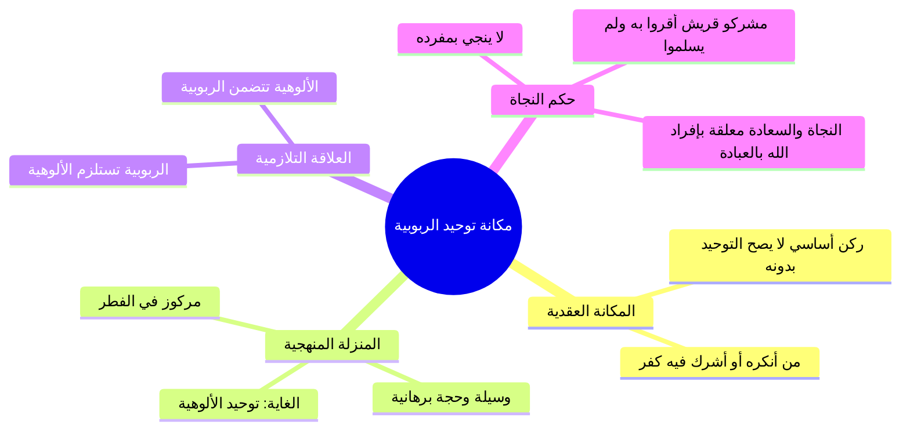

# 08 - مكانة توحيد الربوبية وحكم الاقتصار عليه في النجاة

> [!quote] الفترة المرجعية
> الأسطر 155–173 من [[تفريغ المحاضرة 13]] (مرجع ترقيم الأسطر لعدم وجود توقيت زمني دقيق في الأصل).

---

## 📝 الملخص العلمي المنظم

### 1. مكانة توحيد الربوبية في دين الإسلام
- يحتل توحيد الربوبية مكانة عقدية عظيمة في دين الإسلام؛ فهو **ركن وأصل أصيل من أركان التوحيد**:
  - لا يصح توحيد العبد وإيمانه إلا به.
  - لا يصح إسلام أحد ولا تدينه بدين الإسلام إلا بالإقرار بتوحيد الربوبية.
  - من أشرك في توحيد الربوبية أو أنكره أو جحد خلق الله وتدبيره فلا يصح له إسلام البتة.

---

### 2. توحيد الربوبية: وسيلة فطرية وليس الغاية العظمى
- **كونه مفطوراً في النفوس:** الله جل جلاله فطر النفوس السليمة وجبلها على الإقرار بوجوده وربوبيته لهذا العالم، كما تقدم تقريره في دلائل الفطرة.
- **كونه وسيلة لا غاية:**
  - توحيد الربوبية ليس هو الغاية القصوى من بعثة الرسل وإنزال الكتب.
  - إنما هو **«وسيلة برهانية وحجة عقلية»** للوصول إلى الغاية العظمى.
  - **الغاية العظمى لدين الإسلام:** هي «توحيد الألوهية: عبادة الله وحده لا شريك له والبراءة من كل ما يُعبد من دونه».

---

### 3. العلاقة التلازمية بين توحيد الربوبية وتوحيد الألوهية
تنتظم العلاقة بين القسمين في قاعدتين عظيمتين:
1. **توحيد الربوبية يستلزم توحيد الألوهية (استلزام):**
   - من اعترف وأقر بأن الله وحده هو الخالق الرازق المالك المدبر المحيي المميت؛ لزمه عقلاً وشرعاً أن يُفرده وحده بالعبادة والدعاء والرجاء والخوف والذبح والنذر.
2. **توحيد الألوهية يتضمن توحيد الربوبية (تضمن):**
   - من أخلص العبادة لله وحده وأفرد ربه بالطاعة؛ فإن عمله واعتقاده يتضمن بالضرورة إقراره بأن الله هو الخالق المالك المتصرف الذي لا رب سواه.

---

### 4. حكم الاقتصار على توحيد الربوبية في النجاة والسعادة
> ⚠️ تنبيه
> ا بطلان زعم كفاية توحيد الربوبية للنجاة: توحيد الربوبية وحده لا يكفي في تحقيق سعادة الإنسان في الدنيا والآخرة، ولا ينجيه بمفرده من عذاب الله ولا يدخله الجنة يوم القيامة ما لم يأتِ بتوحيد الألوهية.
> - **الشاهد والبرهان التاريخي من حال مشركي مكة:** كان كفار قريش في الجملة يقرون بتوحيد الربوبية (أن الله هو الخالق الرازق محيي الموتى ومدبر الأمر: ﴿وَلَئِن سَأَلْتَهُم مَّنْ خَلَقَهُمْ لَيَقُولُنَّ اللَّهُ﴾)؛ ومع ذلك لم يدخلهم هذا الإقرار في الإسلام، ولم يعصم دماءهم وأموالهم، بل حكم الله عليهم بالشرك وقاتلهم النبي ﷺ حتى يقولوا لا إله إلا الله ويفردوا الله بالعبادة.

---

### 5. خاتمة المحاضرة
- اختتم المحاضر بالدعاء المأثور:
  ا - «سائلاً الله سبحانه وتعالى بأسمائه الحسنى وصفاته العلى أن يغفر ذنوبنا، وأن يستر عيوبنا، وأن يتجاوز عن خطيئاتنا، وصلى الله وسلم وبارك على عبده ورسوله محمد».

---

## 📋 استخراج المعلومات العلمية

### منظومة المقارنة بين توحيد الربوبية وتوحيد الألوهية من حيث الغاية والنجاة

| وجه المقارنة | توحيد الربوبية | توحيد الألوهية |
|:---|:---|:---|
| **الموقع في الدعوة** | **وسيلة ودليل:** يحتج به القرآن لإلزام المشركين | **الغاية الكبرى:** المقصد الأساس من خلق الثقلين وإرسال الرسل |
| **طبيعة المعرفة** | مركوز في الفطرة السليمة ومستقر في العقول | يحتاج إلى بيان الرسل وشرائع الكتب والامتثال العملي |
| **نوع التلازم** | **يستلزم** توحيد الألوهية (الإقرار يوجب العمل) | **يتضمن** توحيد الربوبية (العبادة متضمنة للإقرار) |
| **أثره في النجاة بمفرده** | **لا يكفي وحده للنجاة؛** كحال مشركي مكة | **شرط النجاة التامة والسعادة؛** به تعصم الدماء وتدخل الجنة |

---

### خريطة المفاهيم: العلاقة التلازمية ومسار النجاة

---

## 🗣️ نص المتحدث الكامل

> ننتقل الى بيان مكان التوحيد الربوبيه في دين الاسلام ايها الاحبه في الله توحيد الربوبيه له مكانه عظيمه في ديننا الاسلامي وهو ركن من اركان التوحيد لا يصح توحيد الانسان الا بتوحيد الربوبيه ولا يصح دين الاسلام دين الانسان وتدينه بالاسلام الا بتوحيد الربوبيه
> فمن اشرك في توحيد الربوبيه او انقره هذا لا يصح له دين الاسلام
> اذن فتوحيد الربوبيه توحيد الربوبيه ليس هو غايه التوحيد لماذا لانه في طريق النفوس الله سبحانه وتعالى فتره النفوس على الاقرار بتوحيد الربوبيه كما تقدم في ادله وجود الله ان الاقرار بوجود الله وربوبيته لهذا العالم
> هذا امر فطر الناس عليها
> وهذا من رحمه الله سبحانه وتعالى
> لذلك ويستخدم في دين الاسلام وسيله
> لبلوغ الغايه ما هي الغايه هي عباده الله وحده لا شريك له
> فتوحيد الربوبيه وسيله للوصول للغايه من التوحيد غايه التوحيد هو توحيد العباده الله وحده لا شريك له وتوحيد الربوبيه يلزم منه
> توحيد الالوهيه
> فمن اقر بان الله منفرد بالخلق والملك والتدبير يلزمها ان يفرد الله سبحانه وتعالى بالعماده وتوحيد الالوهيه يتضمن توحيد الربوبيه من اتى عبد الله وحده لا شريك له وانك رمضان عباده ما سوى الله
> يتضمن ذلك ان الله هو المنفرد بالخلق والملك والتدبير من ناحيه السعاده والنجاح توحيد الربوبيه لا يكفي وحده في سعاده الانسان في دنياه واخراه ولا يكفي في نجاته فيهما ولا يكفي لان جاءت بمفرده في يوم القيامه لم يات بتوحيد الالوهيه لا يكون ناجيا الاتي بتوحيد الربوبيه
> هذا الامر يجب ان يكون واضح توحيد الربوبيه لهم مكانه عظيمه في دين الاسلام لكنه لا يكفي وحده للسعاده والنجاح
> والا لكان ك في شركه فيشر كون مكه في الجمله يقرون بتوحيد الربوبيه لكن كانت مشكلتهم في توحيد الالوهيه
> لذلك لم يكونوا مسلمين ودعاهم النبي صلى الله عليه وسلم للاسلام
> فليس في توحيد الربوبيه وحده يعني سبب للسعاده والنجاح حتى يصل للغايه من في التوحيد وهي عباده الله وحده لا شريك له
> نكتفي بهذا القدر في هذه الحلقه
> سائلا الله سبحانه وتعالى باسمائه الحسنى وصفاته العلى ان يغفر الذنوب لا وان يستر عيوبنا و ان يتجاوز ال خطيئاتنا و استودعكم الله الى الحلقه القادمه بمشيئه الله وصلى الله وسلم وبارك على عبده ورسوله محمد
> وجزاكم الله خيرا
> زياده الايمانيه ياتيكم باي مكان البستان

---

## 🔍 المراجعة الداخلية (5 مراجعات عشوائية)

1. **البداية (سطر 155–156):** مطابقة تامة لإثبات مكانة توحيد الربوبية كركن لا يصح التوحيد والإسلام بدونه، وتكفير من أشرك فيه أو أنكره.
2. **منتصف البداية (سطر 157–161):** مطابقة تامة لبيان أن الربوبية مفطورة في النفوس ولذلك هو وسيلة للوصول للغاية (وهي عبادة الله وحده).
3. **المنتصف (سطر 162–165):** مطابقة تامة لتقرير قاعدتي الاستلزام والتضمن: توحيد الربوبية يلزم منه توحيد الألوهية، وتوحيد الألوهية يتضمن توحيد الربوبية.
4. **منتصف النهاية (سطر 165–169):** مطابقة تامة لبيان أن توحيد الربوبية لا يكفي وحده في النجاة والسعادة، والاستدلال بحال مشركي مكة المقرين به في الجملة.
5. **النهاية (سطر 170–173):** مطابقة تامة لاختتام المحاضرة بالدعاء بالمغفرة والستر والتجاوز والصلاة والسلام على النبي محمد ﷺ.

---

## ⏭️ التنقل ومتابعة الإنجاز

- **السابق:** [[07 - أدلة توحيد الربوبية القرآنية وبرهان التمانع العقلي]]
- **التالي:** لا يوجد (نهاية أجزاء المحاضرة 13)

> [!info] مؤشر الإنجاز
> - إجمالي أجزاء المحاضرة: 9 أجزاء (من 00 إلى 08)
> - الجزء الحالي: 08
> - الأجزاء المتبقية: 0 (تم اكتمال جميع الأجزاء بنجاح)
