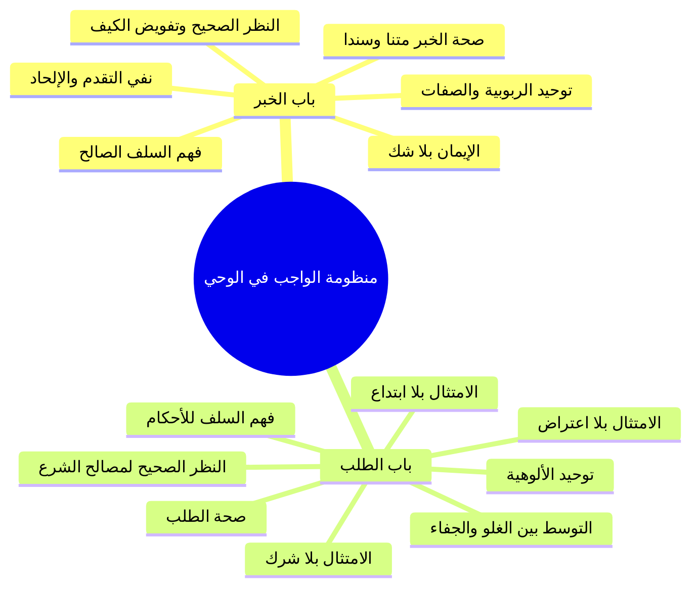
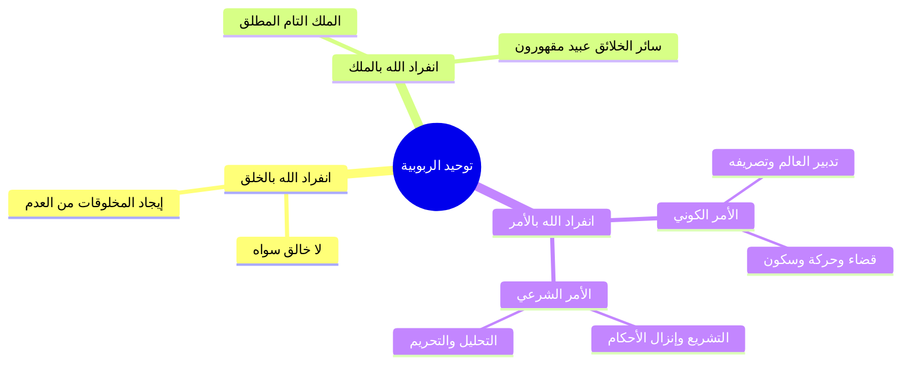
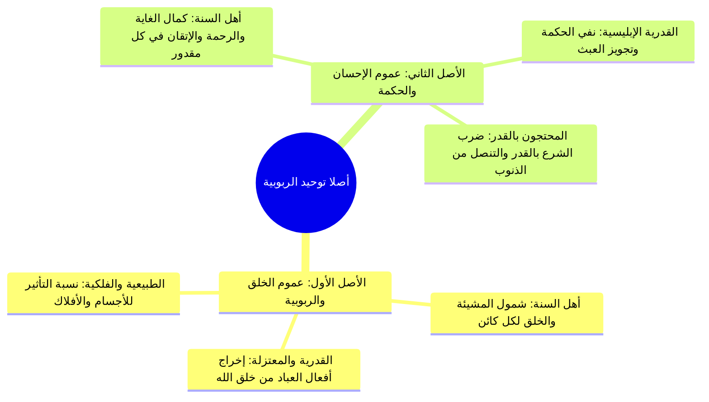
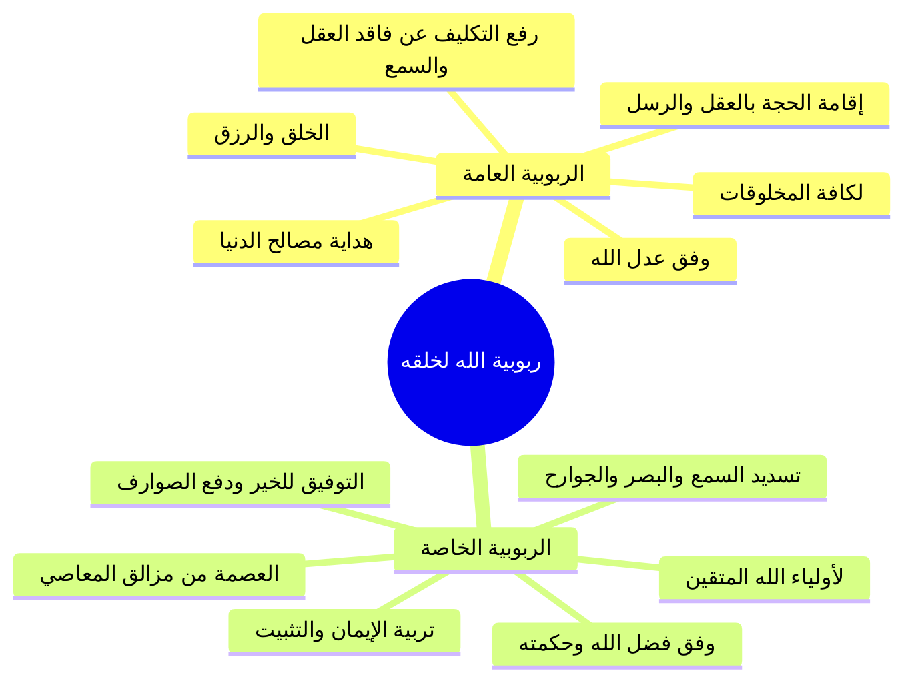
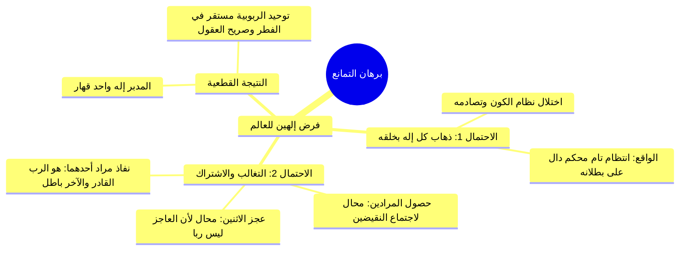
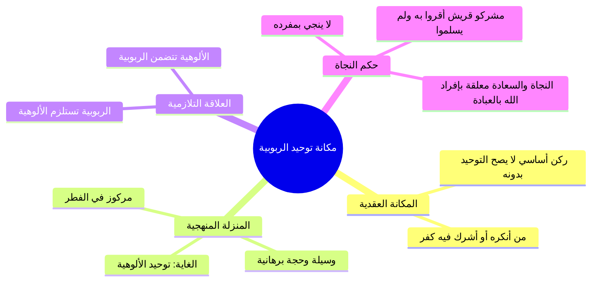

# المحاضرة 13: توحيد الربوبية حقيقته وأدلته ومكانته (ملف مجمع شامل)

> [!info] توصيف الملف المجمع
> يضم هذا الملف المجمع المحتوى العلمي الكامل المنظم للمحاضرة الثالثة عشرة من مادة العقيدة (برنامج زاد المستوى الأول)، شاملاً الجداول والرسومات البيانية والمقارنات ونصوص المتحدث الكاملة حرفياً دون اجتزاء أو حذف، مرتبة بالتتابع المنهجي لجميع أجزاء المحاضرة من الجزء 00 حتى الجزء 08.

---

## 📑 فهرس موضوعات الملف المجمع

1. [[#الجزء 00: مقدمة وخطة الأجزاء وعناصر المحاضرة]]
2. [[#الجزء 01: الواجب تجاه الخبر والطلب وضوابط منهج السلف]]
3. [[#الجزء 02: فاصل إمام السنة وحافظ زمانه ابن شهاب الزهري]]
4. [[#الجزء 03: تعريف الرب لغة واصطلاحاً وتوحيد الربوبية]]
5. [[#الجزء 04: أصلا توحيد الربوبية وانحراف الفرق فيهما]]
6. [[#الجزء 05: أنواع ربوبية الله لخلقه العامة والخاصة]]
7. [[#الجزء 06: فاصل الوساوس الشيطانية وحقيقتها وسبل مدافعتها]]
8. [[#الجزء 07: أدلة توحيد الربوبية القرآنية وبرهان التمانع العقلي]]
9. [[#الجزء 08: مكانة توحيد الربوبية وحكم الاقتصار عليه في النجاة]]

---

## الجزء 00: مقدمة وخطة الأجزاء وعناصر المحاضرة

### 📝 الملخص العلمي المنظم

#### 1. الافتتاح والأدعية النبوية المأثورة
افتتح المحاضر بحمد الله والصلاة والسلام على رسول الله محمد ﷺ، والدعاء المأثور:
- «اللهم إنا نسألك علماً نافعاً، وعملاً صالحاً، وقلباً خاشعاً، ولساناً ذاكراً».
- «اللهم علمنا ما ينفعنا، وانفعنا بما علمتنا، واجعله حجة لنا ولا تجعله حجة علينا يا رب العالمين».

#### 2. الربط المنهجي بالمحاضرة السابقة
تم في المحاضرة الثانية عشرة استيفاء:
1. تعريف التوحيد في اللغة والاصطلاح.
2. أقسام التوحيد باعتبار ما يقوم به العبد وباعتبار ما يستحقه الرب.
3. العلاقة بين أقسام التوحيد الثلاثة.
4. التوقف عند **الواجب علينا في توحيد الله سبحانه وتعالى**.

#### 3. التأسيس لقاعدة الواجب في الخبر والطلب
- **توحيد الربوبية وتوحيد الأسماء والصفات:** من باب **الخبر** الدائر بين النفي والإثبات -> فالواجب علينا هو **الإيمان بهذا الخبر بلا شك**.
- **توحيد الألوهية:** من باب **الطلب** (الأمر والنهي) -> فالواجب علينا هو **امتثال هذا الطلب بلا شرك**.

### 📋 استخراج المعلومات العلمية

| الباب الشرعي | النوع المقابل من التوحيد | الواجب على العبد | الآفة المحذورة |
|:---|:---|:---|:---|
| **باب الخبر** | توحيد الربوبية وتوحيد الأسماء والصفات (النفي والإثبات) | الإيمان والتصديق الجازم | الشك والريب |
| **باب الطلب** | توحيد الألوهية (الأمر والنهي) | الامتثال والانقياد التام | الشرك والابتداع |

### 🗣️ نص المتحدث الكامل (الجزء 00)

> ويتقدم تقنياته ومجالات طوروا ادواتنا في تقديم العلم الشرعي
> ولعلمك الاسعار الاستاذ
> السلام عليكم ورحمه الله وبركاته
> الحمد لله رب العالمين والصلاه والسلام على اشرف المرسلين محمد وعلى اله وصحبه اجمعين اللهم انا نسالك علما نافعا وعملا صالحا و قلبا خاشعا ولسانا ذاكرا
> اللهم علمنا ما ينفعنا وانفعنا بما علمتنا و اجعله حجه لنا ولا تجعله حجه علينا يا رب العالمين
> في الحلقه الماضيه الاحبه هذا التعريف التوحيد في اللغه وفي الاصطلاح ثم اخذنا اقسام التوحيد من جهه ما يقوم به العبد من جهه ما يستحقه الرب واخذنا العلاقه بين اقسام التوحيد الثلاثه وقفنا عند الواجب علينا في توحيد الله
> فقلنا لما كان توحيد الربوبيه وتوحيد الاسماء والصفات فمن باب الخبر الدائر بين النفي والاثبات فقلنا وجب علينا الايمان بهذا الخبر بلا شك
> وقلنا لما كان توحيد الالوهيه هو من باب الطلب فوجب علينا امتثال هذا الطلب
> بلا شك نريد يعني ان نؤكد يعني على الواجب علينا في توحيد الله لانه في الحقيقه او الخلاصه الواجب علينا في نحو ديننا دين الاسلام وان كنا ايضا في المقدمات السابقه في مدخل العقيده البدايه قد اخذنا شيء من هذا لكن لا باس ان نؤكد عليه لاهميتها الخبر الوارد عن الله في الاثبات وتوحيد الربوبيه وتوحيد الاسماء صفاتهم من باب الخبر الدائر بان في الاثبات وما الواجب علينا ان نؤمن هنا اريد ان يلمح الى بعض القضايا ان نؤمن فقط نحن نهتم في هذا الامر ان نهتم بصحه الخبر ان نهتم بصحه الخبر من ناحيه الاسناد ومن ناحيه المثل بالنسبه للقران
> وبحمد الله صدق الو حق ولا اشكال عندنا في القران الاشكال في السنه النبويه

---
![[Pasted image 20261007084829.png]]
## الجزء 01: الواجب تجاه الخبر والطلب وضوابط منهج السلف

### 📝 الملخص العلمي المنظم

#### 1. ضوابط الواجب في باب الخبر (توحيد الربوبية والأسماء والصفات)
1. **صحة الخبر سندا ومتنا:** القرآن قطعي الثبوت، وأما السنة فيجب التثبت من صحة السند والمتن معاً لنفي الشذوذ والنكارة والعلل القادحة؛ ودحض فرية زعم أن السلف يهتمون بالسند دون المتن.
2. **الفهم الصحيح بفهم السلف الصالح:** عرض الفهم على الصحابة وأئمة القرون المفضلة، وإجراء نصوص الصفات على ظاهرها اللائق بالله دون تأويل باطل (كالاستواء على العرش).
3. **النظر الصحيح (موقع العقل وتفويض الكيف):** الوحي مشتمل على دلائله العقلية الكافية، ولا يعارض العقل الصريح، مع قطع الطمع في إدراك كيفية صفات الله وتفويض الكيفية إليه سبحانه.
4. **الإيمان بلا شك ولا ريب:** عملاً بقوله تعالى: ﴿إِنَّمَا الْمُؤْمِنُونَ الَّذِينَ آمَنُوا بِاللَّهِ وَرَسُولِهِ ثُمَّ لَمْ يَرْتَابُوا﴾.
5. **عدم التقدم بين يدي الله ورسوله:** تحريم تقديم العقل أو الرأي أو الذوق أو الكشف الصوفي أو الفلسفة على الوحي (﴿لَا تُقَدِّمُوا بَيْنَ يَدَيْ اللَّهِ وَرَسُولِهِ﴾).
6. **نفي الإلحاد في أسماء الله وصفاته:** البراءة من التحريف والتكييف والتمثيل والتعطيل.
![[Pasted image 20261007085005.png]]
#### 2. ضوابط الواجب في باب الطلب (توحيد الألوهية)
1. **صحة الطلب:** العمل بالثابت وترك الضعيف والموضوع في الأحكام والفرائض.
2. **الفهم الصحيح بفهم السلف:** اعتبار فهم الصحابة مقياساً للدين والعبادة.
3. **النظر الصحيح:** الاعتقاد الجازم بأن شرع الله متضمن لمصلحة العباد وسعادتهم في الروح والبدن والدنيا والآخرة.
4. **الامتثال بلا شرك:** إخلاص القصد لله تعالى.
5. **الامتثال بلا اعتراض:** التسليم للشرع دون معارضة بعادات أو أعراف أو سياسة أو اقتصاد.
6. **الامتثال بلا ابتداع:** حفظ حدود العبادة في: الزمان، المكان، الجنس، المقدار، السبب، والكيفية.
7. **التوسط ونبذ الغلو والجفاء:** الحذر من الغلو المخرج من الدين، والحذر من الجفاء وترك العمل بالكلية؛ فإن من ترك العمل بالكلية لم يدخل في الإسلام.

### 📋 استخراج المعلومات العلمية

| م | ضوابط التعامل مع باب الخبر (الربوبية والأسماء والصفات) | ضوابط التعامل مع باب الطلب (الألوهية والأحكام) |
|:---:|:---|:---|
| 1 | **صحة الخبر:** ثبوته سندا ومتنا ونفي الشذوذ والنكارة. | **صحة الطلب:** العمل بالثابت الصحيح ورد الموضوع. |
| 2 | **الفهم الصحيح:** بفهم الصحابة والقرون المفضلة بلا تأويل. | **الفهم الصحيح:** فهم السلف للأوامر والنواهي والشرائع. |
| 3 | **النظر الصحيح:** اشتمال الوحي على حججه وتفويض الكيفية. | **النظر الصحيح:** استيقان اشتمال الشرع على المصلحة والسعادة. |
| 4 | **الإيمان بلا شك:** التصديق الجازم بغير ريب. | **الامتثال بلا شرك:** إخلاص القصد التام لله وحده. |
| 5 | **عدم التقدم:** تقديم الوحي على العقل والرأي والذوق والفلسفة. | **الامتثال بلا اعتراض:** التسليم للشرع دون معارضة بعرف أو هوى. |
| 6 | **نفي الإلحاد:** البراءة من التحريف والتمثيل والتعطيل والتكييف. | **الامتثال بلا ابتداع:** الالتزام بالهيئة والمقدار والزمان والمكان والسبب. |
| 7 | — | **التوسط والاعتدال:** الحذر من الغلو والجفاء المؤدي لترك العمل. |

### 🗣️ نص المتحدث الكامل (الجزء 01)

> في الحلقه الماضيه الاحبه هذا التعريف التوحيد في اللغه وفي الاصطلاح ثم اخذنا اقسام التوحيد من جهه ما يقوم به العبد من جهه ما يستحقه الرب واخذنا العلاقه بين اقسام التوحيد الثلاثه وقفنا عند الواجب علينا في توحيد الله
> فقلنا لما كان توحيد الربوبيه وتوحيد الاسماء والصفات فمن باب الخبر الدائر بين النفي والاثبات فقلنا وجب علينا الايمان بهذا الخبر بلا شك
> وقلنا لما كان توحيد الالوهيه هو من باب الطلب فوجب علينا امتثال هذا الطلب
> بلا شك نريد يعني ان نؤكد يعني على الواجب علينا في توحيد الله لانه في الحقيقه او الخلاصه الواجب علينا في نحو ديننا دين الاسلام وان كنا ايضا في المقدمات السابقه في مدخل العقيده البدايه قد اخذنا شيء من هذا لكن لا باس ان نؤكد عليه لاهميتها الخبر الوارد عن الله في الاثبات وتوحيد الربوبيه وتوحيد الاسماء صفاتهم من باب الخبر الدائر بان في الاثبات وما الواجب علينا ان نؤمن هنا اريد ان يلمح الى بعض القضايا ان نؤمن فقط نحن نهتم في هذا الامر ان نهتم بصحه الخبر ان نهتم بصحه الخبر من ناحيه الاسناد ومن ناحيه المثل بالنسبه للقران
> وبحمد الله صدق الو حق ولا اشكال عندنا في القران الاشكال في السنه النبويه
> بعض الاحاديث عن النبي صلى الله عليه وسلم
> موضوعه مكذوبه مختلقه وبعضها صحيح
> فما لا يهمنا في الامام بالخبر الايمان بالخبر الصحيح
> ونؤمن بال صحيح من تلك الاخبار وندرس الخبر الحديث سندا ومتنا
> لكن ما يقال عنه
> نحن الذين يسير وفقا مساره عليه النبي صلى الله عليه وسلم يقال ان هؤلاء السلف اتباع المنهج السلفي انهم يهتمون باسناد الحديث ولا يهتمون بمحنه هذا غير صحيح بل نحن ندرس الحديث حتى مثلا لا يكون الحديث شاذا لا يكون الحديث منكرا كيف لا ندرس ذلك يدرس الحديث سندا ومتنا ونؤمن بال صحيح الفارق الثاني هو الذي يفرق بين اتباع منهج السلف و الخلف هو الفهم الصحيح
> نحن نؤمن بال صحيح في الفهم الصحيح كيف نعرفه ان فهمنا لهذا الخبر فهما صحيحا ان نقوم ب عرضه على ما فهمه سلفنا الصالح من على ما فهم سلفنا الصالح من هذا النص عندنا فهم الصحابه وفهم ائمه القرون الثلاثه ائمه القرون الثلاثه المفضله عندنا نحن نعتمد فهمهم اعتمد فهم ولا ناتي بفهم يضاد فهم مضاد فهم السلف الصالح
> اذا كان سلفنا الصالح فهموا من الاسماء والصفات انها على ظاهرها اللائق بالله جل جلاله ولا يؤولون هذا الظاهر يفهمون هذا الظاهر على بالله سبحانه وتعالى ولا يقول تاويله فنحن لا ناتي بفهم فهمهم ويخالفهم الرحمن على العرش استوى
> فنقول كما قال سلفنا الصالح ان
> استواء اضافه الله الى نفسه فهو على ما يليق بذاته سبحانه وتعالى فلا ياتي ونقول استر يعني استولى لا هنا اتينا بفهم يخالف ويضاده فهم المساله في لصالح اذا لم لم الصحيح بفهم من صحيح صحيح الامر ثالث وهذا فارق ايضا فارق بانه بين اهل البدعه في هذا الباب بنظر صحيح
> نحن ننظر الى ان هذا الخبر ال العقائد الخمريه هذه قد اشتملت على ادلتها العقليه ما هو بحاجه الى دليل العقل قد جاء به هذا الوحي الوحي جاء بالمسائل العقديه مشتمله على دلائلها العقليه ف نحن ننظر الى هذا الخبر بهذا الشكل امر ثاني ننظر الى ان هذه العقائد ما يتعلق بتوحيد الربوبيه وتوحيد الاسماء والصفات وغير ذلك من العقائد لكن هنا نحن المتحده وصفات ان هذه الامور لكونها متعلقه بذات الله جل جلاله
> وذات الله غير وذات الله لا مثيل له فيها ولا نظير وبيان كيفيه الصفات لنا عن الصادق المصدوق صلى الله عليه وسلم بالتالي وجب علينا قطع الطمع الادراك هذه الكيفيه انا عارف الكيفيه ونفرض امرها الى الله جل جلاله
> لكن لا نقول ان هذه ان هذه الامور مخالفه للعقل لا يصح ولا يجوز نظرنا لهذا الوحي هذا الخبر نظره صحيحه ان المسائل العقديه مشتمله على ادلتها العقليه فلا نحتاج الى ادله عقليه من الخارج يعني كلام على الفلسفه ولا انكشفت خلاص المسائل العقليه العقليه جاءت بادلتها العقليه
> الامر الثاني انه لا يمكن ان تخالف العقل الصريح البته هذا يسمى نظرا صحيح
> بال صحيح صحيح صحيح
> مؤمن بلا شك
> انما المؤمنون الذين امنوا بالله ورسوله ثم لم يرتابوا خلاص لا شك عندنا في هذه الاخبار عن الله وعن رسوله الطالبان صحت وفهمنا الفهم الصحيح او الرابع والخامس ولا تقدم لان تقدم على هذه الاخبار لا نقدم انفسنا اراءنا ذوقنا واجب ولان قدم الاخرين لا نقدم اراء الرجال
> وانا نقدم المناهج ال الكلام ولا الكشف الذوق والفلسفه لان قد ما حدا على كلام الله وعلى كلام الرسول يا ايها الذين امنوا لا تقدموا بين يدي الله ورسوله واتقوا الله ان الله سميع الامر السادس ولا الحاد لا ناتي ل هذه الاخبار ان الرب سبحانه و تعالى في الربوبيه اسمائه وصفاته لا ناتي فن لحد فيها بتحريف او تكييف او تمثيل او تعطيل لا نؤمن بها كما اراد الله عز وجل
> واراد رسوله صلى الله عليه وسلم هذا هو الموقف من خبر الله سبحانه وتعالى ناتي ل لمواقف من الطلب في توحيد الالوهيه
> نحن نفس القضيه اولا لم تكن الصحيح ما كان ضعيفا او موضوعا من ناحيه السند او من ناحيه المثنى
> فهذا لا لمثله
> لانه ليس من الشرع ليس من الشرع تبقى الاحاديث الضعيفه في الفضائل الاعمال هذا لها شان الخاص يعني يمكن استاذ سبها في فضائل الاعمال
> اما في الفرائض
> وهذه الامور لا لا نقبل الا الصحيح مثل الصحيح بفهم صحيح ايضا هذا امر مهم نعرض فهمنا
> هذه الاوامر والنواهي على ما فهمه سلفنا الصالح اولئك الدين انزل عليهم ما لم يفهمه انه من الدين ما لم يكن من الدين
> ثم ذلك العصر فليس بدين حاليا ولذلك نحن نعتمد فهم الصحابه فهم ائمه القرون الثلاثه المفضله للنصوص الشرعيه فلان اتفهم الامر النواحي يخالف ما فهم وهم ايضا د فهو وهم لا يمكن ذلك بنظر صحيح
> ننظر الى ما طلبه الله عز وجل من فعل او ترك ان ذلك فيه مصلحتنا وفيه سعادتنا وفي صلاح الفرد والمجتمع في صلاح الدنيا والاخره في سعاده الرحم البدل ننظر الى هذا الشرع بنظر صحيح انه لا يخالف المصلحه وان فيه الصلاح وسعاده الافراد والمجتمعات ننظر اليه بنظره صحيح
> اذا تم ذلك فاننا نمثله بل اشرك لا يمكن ان نشرك في عباده الله سبحانه وتعالى فعلا او تركا معه غيره فلا نقصد الا الله جل جلاله
> بامتثال نال هذا الشرع ولا اعتراض لا نعترض على شرع الله سبحانه وتعالى لا نعترض على هذا الشرع بالاراء بالعادات بالاعراف باي شيء الاخر بالسياسه بالاقتصاد لا نعترض على شريعه الله سبحانه وتعالى لم تمثل بالاعتراض ولم من ابتداء لا ناتي لهذه الشريحه التي شرعها الله سبحانه وتعالى لنا لان غير في زمان ها لان غير في مكانها
> لان غير في جنسها لان غير في مقدارها لان غير في سببها لان غير في هيئتها في كيفيتها لا نبتدع لا نبتدا ولا نبتدع بجفاء فلان غلب في هذه العباده
> ولو يجعلنا نخرج من دائره الاسلام من الطرف الاخر من الباب الاخر ندخل من باب ثم اخرج من الباب الاخر بسبب هذا ال غلو ولا جفاء بحيث لا من دخل الاسلام يكون الانسان مجابهه لا يعمل بهذا الشريعه مهم الى هذه الشريعه وان كان يقول انه مؤمن بها لكنها لم يعمل بها البته الذي لا يمتثل يعني لشريعه الاسلام ولايات بما هو من خصائص المسلم ولا هذا ما دخل في الاسلام
> فاذا قال انا اشهد ان لا اله الا الله وان محمدا رسول الله ثم لا يريد ان يعمل يعبد الله وحده لا شريك له وبما شرع رسولنا صلى الله عليه وسلم البته بالكليه هذا ما دخل في الاسلام لا نريد الغلو ولا نريد الجفاء
> ون عبد الله سبحانه وتعالى بما شرعت هذا هو الواجب علينا تجاه ما طلبه الله عز وجل منه هذا الواجب علينا في توحيد الالوهيه وعرفنا الواجب علينا في توحيد الربوبيه وتوحيد الاسماء والصفات مع معرفتنا السبب في ذلك ما هو الواجب علينا وما السبب عرف له
> بحمد الله سبحانه وتعالى
> ناخذ فاصل ثم نعود اليكم
> بمشيئه الله سبحانه وتعالى

---

## الجزء 02: فاصل إمام السنة وحافظ زمانه ابن شهاب الزهري

### 📝 الملخص العلمي المنظم

#### 1. بطاقة التعريف بالإمام الزهري
- الإمام العالم حافظ زمانه، **أبو بكر محمد بن مسلم بن عبيد الله بن عبد الله بن شهاب القرشي الزهري المدني**.
- ولد سنة 50 أو 51 هجرية بالمدينة النبوية، وهو من كبار أئمة التابعين وأركان تدوين السنة وحفظها.

#### 2. شيوخه وتلاميذه
- **شيوخه:** روى عن الصحابة: سهل بن سعد، أنس بن مالك، ومحمود بن الربيع؛ وعن كبار التابعين: علي بن الحسين زين العابدين، عروة بن الزبير، وغيرهم.
- **تلاميذه:** روى عنه أئمة الإسلام: عطاء بن أبي رباح، الخليفة عمر بن عبد العزيز، عمرو بن دينار، قتادة، وغيرهم.

#### 3. ثناء الأئمة وموسوعيته
- قال أحمد بن حنبل: «الزهري أحسن الناس حديثاً وأجود الناس إسناداً».
- قال الليث بن سعد: «ما رأيت عالماً قط أجمع من ابن شهاب...».
- قال أيوب ومكحول: «الزهري أعلم الناس».

#### 4. حفظه وتقييده للعلم وحاله في رمضان
- قال عن نفسه: «ما استودعتُ قلبي شيئاً قط فنَسِيَه».
- قال أبو الزناد: «كنا نطوف مع الزهري على العلماء ومعه الألواح والصحف يكتب كل ما سمع».
- حاله في رمضان: كان إذا دخل رمضان قال: «إنما هو تلاوة القرآن وإطعام الطعام».
- وفاته: توفي في رمضان سنة 123 أو 124 هـ وقد جاوز السبعين.

### 📋 استخراج المعلومات العلمية

| البند | البيان التفصيلي من المحاضرة |
|:---|:---|
| **الاسم والكنية** | أبو بكر محمد بن مسلم بن عبيد الله بن شهاب القرشي الزهري المدني |
| **سنة الولادة** | 50 أو 51 هـ بالمدينة النبوية |
| **أبرز شيوخه** | سهل بن سعد، أنس بن مالك، محمود بن الربيع، علي بن الحسين، عروة بن الزبير |
| **أبرز تلاميذه** | عمر بن عبد العزيز، عطاء بن أبي رباح، عمرو بن دينار، قتادة |
| **شهادة الإمام أحمد** | أحسن الناس حديثاً وأجود الناس إسناداً |
| **برنامجه في رمضان** | تلاوة القرآن الكريم وإطعام الطعام |
| **سنة الوفاة** | رمضان سنة 123 أو 124 هـ |

### 🗣️ نص المتحدث الكامل (الجزء 02)

> من اعلام المدينه النبويه الامام العالم حافظ زمانه
> محمد بن مسلم بن عبيد الله بن عبد الله بن شهاب ابو بكر القرشي الزهري المدني ولد سنه خمسين او احدى وخمسين للهجره
> روى عن سهل بن سعد وانس بن مالك و محمود بن الربيع و علي بن الحسين و عروه بن الزبير وغيرهم من الصحابه والتابعين
> وروى عنه عطاء بن ابي رباح وعمر بن عبد العزيز
> وعمرو بن دينار و قتاده و طائفه من الائمه قال احمد بن حنبل الزهري احسن الناس حديثا واجود الناس اسناد اه كان موسوعه في شتى المجالات العلميه
> قال الليث بن سعد
> ما رايت عالما قط اجمع من ال من شهاب يحدث في الترغيب فتقول لا يحسن الا هذا وان حدث عن العرب والانساب قلت لا يحسن الا هذا وان حدث عن القران والسنه كان حديثه كان الزهري من احفظ الناس واعلامهم قال عن نفسه ما استودعت قلبي شيئا قط بيده
> وقال ايوب السختياني ما رايت احدا اعلم من الزهري
> وقال مكحول ابن شهاب اعلم الناس كان الزهري يكتب العلم ولا يكتفي بحفظه قال ابو الزناد كنا نطوف مع الزهري على العلماء ومعه الالواح والصحف يكتب كل ما سمع
> وكان تاليا للقران
> فكان اذا دخل رمضان قال انما هو تلاوه القران واطعام الطعام توفي الزهري في رمضان سنه ثلاث او اربع وعشرين ومائه
> وقد جاوز السبعين
> فرحمه الله والحقه بالصالحين حين ورفع درجاته في المهديين

---

## الجزء 03: تعريف الرب لغة واصطلاحاً وتوحيد الربوبية

### 📝 الملخص العلمي المنظم

#### 1. دلالة لفظ «الرب» في لسان العرب
- **الحالة الأولى: الخلو من (أل) مع التقييد أو الإضافة:** تطلق على الله كقوله: ﴿رب العالمين﴾، وتطلق على المخلوق: «رب الدار»، «رب الغلام»؛ ومعناها: المالك، الصاحب، السيد، المربي، المصلح.
- **الحالة الثانية: التحلية بـ (أل) والإطلاق («الرَّب»):** لا تطلق إلا على الله جل جلاله وحده (الخالق المالك المدبر المصلح لأحوال خلقه).

#### 2. تعريف «الرب» شرعاً عند أئمة الإسلام
- **ابن تيمية:** «الرب هو الذي يربي عبده، فيعطيه خَلْقه المناسب له ثم يهديه إلى جميع أحواله من العبادة وغيرها»، وهو «المالك المدبر المعطي المانع الضار النافع الخافض الرافع المعز المذل».
- **المقريزي:** «الرب سبحانه هو الخالق الموجد لعباده القائم بتربيتهم وإصلاحهم، من خلق ورزق وعافية وإصلاح دين ودنيا».
- **السعدي:** «الرب هو المربي لجميع عباده بالتدبير وأصناف النعم، وأخص من هذا تربيته لأصفيائه بصلاح قلوبهم وأرواحهم وأخلاقهم».

#### 3. تعريف «توحيد الربوبية»
هو **اعتقاد انفراد الله بربوبيته للمخلوقات فلا رب لها سواه، وانفراده بالخلق والمُلْك والأَمْر (الأمر الكوني القدري بالتدبير، والأمر الشرعي الديني بالتشريع)**، عملاً بقوله تعالى: ﴿أَلَا لَهُ الْخَلْقُ وَالْأَمْرُ ۗ تَبَارَكَ اللَّهُ رَبُّ الْعَالَمِينَ﴾. فكل حركة وسكون في الوجود خاضعة لمشيئته وقدرته.

### 📋 استخراج المعلومات العلمية

| الحالة الاستعمالية | الصيغة والتركيب | حكم الإطلاق | المعنى والدلالة |
|:---|:---|:---|:---|
| **مقيدة ومضافة بدون (أل)** | ربّ الدار / ربّ العالمين | يطلق على الخالق والمخلوق | المالك، الصاحب، السيد المطاع، المربي، المصلح |
| **مطلقة ومحلاة بـ (أل)** | «الرَّبُّ» | خاص بالله تعالى لا يجوز إطلاقه على غيره | المتفرد بالخلق والملك والتدبير المطلق والإصلاح لجميع الخلق |

### 🗣️ نص المتحدث الكامل (الجزء 03)

> رب العالمين والصلاه والسلام على اشرف المرسلين محمد وعلى اله وصحبه اجمعين وبعد ايها الاحبه في الله ناخذ الان في القسم الثاني من هذا الدرس ناخذ التعريف توحيد الربوبيه وناخذ في التعريف توحيد الربوبيه تعريف الرب في اللغه والاصطلاح وتعريف توحيد الربوبيه ووصول توحيد الربوبيه وانواع ربوبيه الله لخلقه اولا ايها الاحبه في الله كلمه الرب في اللغه لها حالتان الحاله الاولى حاله الاطلاق او حاله الخلو من ال التاريخ ما يقال الرب يقرر لكنها تذكر مقيده ومضافه رب الدار ورب العالمين
> هذه الحاله الاولى التي تكون خاليه من ال وتاتي مقيده ومضافه ففي هذه الحاله تطلق على الله سبحانه وتعالى مثل الحمد لله رب العالمين
> وتطلق على المخلوق مثل رب الدار والفرس والغلام ويكون معنى المالك الصاحب السيد المربى المصلح
> وهكذا الحاله الثانيه حاله حال التعريف بال الرب و الاطلاق بدون تقيد او اضافه الرب
> ففي هذه الحاله لا تطلق الا على الله جل جلاله فالرب هو الله سبحانه وتعالى
> فهو الرب اي لخلقه الخالق المالك المدبر المصلح لاح والخلق يقول شيخ الاسلام ابن تيميه معرفه الرب شرعا الرب هو الذي يربي عبده فيعطيك خلقه خلقه المناسب له
> ثم هديه الى جميع احواله من العباده وغيرها
> هذا هو الرب الرب هو الذي يربي عبده فيعطيه خلقه ثم هديه الى جميع احواله من العباده وغيرها
> وقال ايضا فان الرب سبحانه وتعالى هو المالك المدبر المعطي المانع الضار النافع الخافض الرافع المعز المذل يقول المقريزي الرب سبحانه وتعالى هو الخالق الموجد لعباده القائم بتربيتهم واصلاح هم من خلق رزق وعافيه واصلاح دين ودنيا يقول الشيخ عبد الرحيم الاستاذ الرب هو المربي جميع عباده والمربي جميع عباده بالتدبير واصناف النعم
> واخص من هذا تربيته لاصفيائه بصلاح قلوبهم وارواحهم واخلاقه تعريف توحيد الربوبيه اذا احيل الرب هو اعتقاد انفراد الله بما ذكرناه من خصائص الرب سبحانه وتعالى اعتقاد انفراد الله بربوبيته للمخلوقات فلا ربي لها سواه
> وهو اعتقاد ان الله هو المنفرد بالخلق والملك والامر يدخل في الامر الامر الكوني
> والامر الشرعي الامر الكوني يعني تدمير الكون
> والامر الشرعي يعني وضع الشريعه للناس
> انا اعتقد انفراد الله بربوبيته في الخلق والملك والتدبير الكوني والتشريع يقول ابن تيميه رحمه الله فان الله سبحانه وتعالى له الخلق والامر
> كما قال تعالى ان ربكم الله الذي خلق السماوات والارض في سته ايام ثم استوى على العرش يغشي الليل النهار يطلبه حثيثا والشمس والقمر والنجوم مسخرات بامره الا له الخلق والامر تبارك الله رب
> العالمين
> فهو سبحانه و تعالى خالق كل شيء وربه ومليكه لا خالق غيره ولا رب سواه ما شاء كان وما لم يشا لم يكن
> فكل ما في الوجود من حركه وسكون
> فكل ما في الوجود من حركه وسكون وبقضائه وقدره و مشيئته وقدرته وخلقه تتحرك في هذا الكون الا
> بمشيئه الله والله تسكن في هذا الكون الا بمشيئته هذا هو توحيد الربوبيه

---

## الجزء 04: أصلا توحيد الربوبية وانحراف الفرق فيهما

### 📝 الملخص العلمي المنظم

#### 1. الأصلان العظيمان لتوحيد الربوبية
1. **الأصل الأول: عموم خلقه وربوبيته:** شمول مشيئته وخلقه لكل كائن وموجود.
2. **الأصل الثاني: عموم إحسانه وحكمته ورحمته:** صدور كل أفعاله عن كمال الحكمة والإتقان والرحمة والعدل.
- **الأدلة القرآنية:** قوله تعالى: ﴿الَّذِي أَحْسَنَ كُلَّ شَيْءٍ خَلَقَهُ ۖ وَبَدَأَ خَلْقَ الْإِنسَانِ مِن طِينٍ﴾، وقوله: ﴿رَبُّنَا الَّذِي أَعْطَىٰ كُلَّ شَيْءٍ خَلْقَهُ ثُمَّ هَدَىٰ﴾، وسورة الفاتحة وآل عمران (26).
- شمول ربوبيته للعرش والسماوات والأرض وقلوب العباد، وأنه أرحم بعباده من الوالدة بولدها.

#### 2. انحراف الفرق في الأصلين (كلام ابن تيمية)
- **القدرية والمعتزلة:** كفروا بالأصل الأول بإخراج أفعال العباد من خلق الله وإضافتها للإنسان استقلالاً أو للطبيعة والأفلاك؛ وهو شرك في الربوبية.
- **القدرية الإبليسية والجبرية:** ضلوا في الأصل الثاني بنفي الحكمة وتجويز العبث، وضرب الشرع بالقدر والاعتراض على أمر الله تذرعاً بالقدر كما فعل إبليس.

### 📋 استخراج المعلومات العلمية

| الأصل العقدي | مذهب أهل السنة والجماعة | الفرقة المنحرفة | وجه الانحراف والشبهة |
|:---|:---|:---|:---|
| **الأول: عموم خلقه وربوبيته** | كل موجود وفعل داخل في خلق الله ومشيئته وقدرته التامة | القدرية الأولى والمعتزلة | أخرجوا أفعال العباد من خلق الله وأضافوها للإنسان أو الطبائع |
| **الثاني: عموم إحسانه وحكمته** | كل أفعاله وقدره لحكمة بالغة وعدل ورحمة وإتقان لا عبث فيه | القدرية الإبليسية ونفاة الحكمة | نفوا الحكمة، وظنوا قصور الرحمة، واحتجوا بالقدر على معارضة الشرع |

### 🗣️ نص المتحدث الكامل (الجزء 04)

> وتوحيد الربوبيه يقوم على اصلين اثنين الاصل الاول عموم خلقه وربوبيته الخلق الربوبيه الاصل الثاني عموم الاحسان والحكمه قال تعالى
> الذي احسن كل شيء خلقه
> هذا عموم الاحسان والحكمه وبدا خلق الانسان من طين هذا الممر الخلق الروميه قال تعالى قال ربنا الذي اعطى كل شيء خلقه ثم هدى عندما قال في العون لموسى قال فمن ربكما يا موسى قال ربنا الذي اعطى كل شيء خلقه يعني المناسب لهذا عموما حسان وحكمته ثم هدى هذا عموم خلقه مرتين قال تعالى الحمد لله رب العالمين الرحمان الرحيم
> هذا عم واحسانه ورحمته وحكمته في خلقه الربوبيه الخلقه
> مالك يوم الدين
> الحمد لله رب العالمين مالك يوم اذا هو في في خلقه قد هداهم وضع له الشريعه وسيحاسبهم عليها يوم القيامه
> هم خلقه وربوبيته قال تعالى قل اللهم مالك الملك تؤتي الملك من تشاء وتنزع الملك ممن تشاء وتعز من تشاء وتذل من تشاء بيدك الخير انك على كل شيء قدير تولج الليل في النهار وتولج
> وتخرج الحي من الميت وتخرج الميت من الحي وترزق من تشاء بغير حساب
> هذه ربوبيه الله الخلق التوحيد الربوبيه يقوم على اصلين عظيمين هما عموم خلقه وربوبيته وعموما حس انه وحكمتهم فنعتقد ان الله رب العالمين
> وانه رب السماوات والارضين وما بينهما ورب العرش العظيم
> وهو خالق كل شيء وهو على كل شيء وكيل
> وهو رب كل شيء ومليكه وهو مالك الملك يؤتي الملك من يشاء وينزع الملك ممن يشاء ويعز من يشاء ويذل من يشاء بيده الخير وهو على كل شيء قدير
> نعتقد ان له ما في السماوات وما في الارض وما بينهما وما تحت الثرى قلوب العباد
> ونواصل وما من قلب الا وهو بين اصبعين من اصابع الرحمن ان شاء ان يقيمه اقامه وان شاء ان يزيغه ازاغه وهو الذي اضحك وابكى واغلى واقناع وهو الذي يرسل الرياح بشرا بين يدي رحمته وينزل من السماء ماء فيحيي به الارض بعد موتها وبث فيها من كل دابه و ما شاء كان وما لم يشا لم يكن ولا حول ولا قوه الا بالله ولا ملجا منه الا اليه
> لا اعتقد انه قد اعطى كل شيء خلقه ثم هدى و احسن كل شيء خلقه واتقن كل شيء صلاه الخير كله بيديه وهو ارحم الراحمين
> وهو ارحم بعباده من الوالده بولدها الى نحو هذه
> الان التي تقضي شهور حكمته واتقانه واحسان خلقه واحسان خلق كل شيء وسعه رحمته وعظمته يقول ابن تيميه رحمه الله
> هذان الاصلان عموم خلقه وربوبيته ومن حسن وحكمته اصلان عظيم ان وان كان من الناس من يكفر ببعض من يكفر ببعض الاول عموم خلقه ولم ميته القدريه القدريه وخلقه يخرجون افعال العباد من خلقه ويضيفونها الى الاختيار الانسان او الطبيعه الذين يقطعون اضافه الفعل الى الله سبحانه وتعالى
> ويضيف ونه اما الى الطبع او الى جسم فيه طبعا او الى فلك او الى نفس او غير ذلك مما هو من مخلوقاته العاجزه على اقامه نفسها
> فهي عن اقامه غيرها اعجز القدريه سواء القدريه الاوائل او المعتزله يضيفون بعض مخلوقات الله سبحانه وتعالى يخرجونها من عموم خلق الله سبحانه وتعالى ويضيفونها الى الانسان او يضيفونها الى الاسباب
> وهذا اذن بالله نقص في هذا التوحيد والشرك في توحيد الربوبيه و من الناس عموما حسان وحكمته من الحكمه من الناس ما نجح البعض الثاني او يعرض عنه متوهما كل شيء من مخلوقاته عن احسان خلقه واتقانه وعن حكمته
> ويظل قصور رحمته و عجزها من القدريه الابليسيه او الواجب وسيه وغيرهم القدريه الابليسيه او القدريه المجوسيه هؤلاء جبريه وجذريه منهم من يجعل هناك تناقض بين الشرع والقدر ومنهم من يحتج بالقدر على ذنوبه ومعاصيه قالوا لو شاء الله ما اشركنا ولا اباؤنا هؤلاء المشركين ابليس
> اه القدريه الابليسيه الجبريه الابليسيه يقولون ان ابليس عندما قال الله عز وجل له ما منعك ان تسجد لما خلقت بيدي انه كان المفترض ان يقول ان تم نعتني فهؤلاء يجعلون هناك تعارض بين الشرع و القدر و ينفون حكمه الله سبحانه وتعالى عن الشرع والقدر وهكذا
> واولئك يخرجون بعض مخلوقات الله سبحانه وتعالى عن عموم خلقه وهؤلاء يجعلون بعض الاشياء انها لا حكمه فيها ولا رحمه ولا احسان وكلا الفريقين تحقيق وتوحيد الربوبيه ان نؤمن ب عموم خلق هو ربوبيته لا يخرج ال خلق الله سبحانه وتعالى شيء ولا يمكن ان يكون هناك شيء خارج عن ربوبيه الله سبحانه وتعالى له ولا يمكن ان يكون فيه هناك شيء من مخلوقات الله خارج عن الحكمه وعن الاحسان وعلى الرحمه

---

## الجزء 05: أنواع ربوبية الله لخلقه العامة والخاصة

### 📝 الملخص العلمي المنظم

#### 1. الربوبية العامة (مقتضى العدل الإلهي)
خلق الله لجميع المخلوقات ورزقهم وهدايتهم لمصالح بقائهم في الدنيا؛ وهي جارية وفق **عدل الله المطلق**؛ فمن عدله إعطاء الفطرة والعقول والجوارح وإرسال الرسل، ورفع التكليف عمن حُرم العقل أو الإرادة أو الحواس أو لم تبلغه الدعوة.

#### 2. الربوبية الخاصة (مقتضى الفضل والحكمة)
تربيته لأوليائه المتقين بالإيمان وتكميله، ودفع الصوارف والعوائق؛ وحقيقتها: **تربية التوفيق لكل خير والعصمة من الشرور** وتسديد السمع والبصر والجوارح في طاعته، وهي جارية وفق **حكمة الله وفضله**.

### 📋 استخراج المعلومات العلمية

| وجه المقارنة | الربوبية العامة | الربوبية الخاصة |
|:---|:---|:---|
| **المشمولون بها** | جميع الخلائق (مؤمن، كافر، بر، فاجر، وسائر الدواب) | أولياء الله والمؤمنون المتقون وأصفياؤه |
| **المقتضى الإلهي الحاكم** | تجري بمقتضى **عدل الله المطلق** | تجري بمقتضى **فضل الله وحكمته البالغة** |
| **مظاهر التربية** | الإيجاد، الرزق، سلامة العقل والحواس، الهداية لمصالح المعاش | غرس الإيمان، توفيق القلوب، دفع العوائق، وتسديد الجوارح |
| **أثرها في النجاة الأخروية** | لا تكفي وحدها للنجاة من العذاب ودخول الجنة | سبب السعادة الأبدية والتوفيق والنجاة في الدارين |

### 🗣️ نص المتحدث الكامل (الجزء 05)

> عمومية الله لخلقه تربية الله تعالى لخلقه نوعا عامه وخاصه العامه هي خلقه سبحانه وتعالى للمخلوقين خلقه للمخلوقين ورزقهم وهدايتهم لما فيه مصالحهم التي فيها بقائهم في الدنيا هذه رميه الله عامه الله عز وجل عامه لجميع المخلوقات خلقهم ورزقهم حد اه اعطاهم الاشياء التي تمكنهم من الحياه المده التي ارادها الله سبحانه وتعالى لهم فيها هذا عموم خلقه هذه الربوبيه العامه
> وهناك الربوبيه خاصه
> نسال الله سبحانه وتعالى من فضله الربوبيه الخاصه هي تربيته سبحانه وتعالى لاوليائه فيربيهم بالايمان و يوفقهم له ويك منه لهم ويدفع عنهم الصوارف والعوائق الحائله بينه بينهم وبين هذا
> ا حقيقتها التربيه الخاصه تربيه التوفيق لكل خير
> والعصمه الله سبحانه وتعالى ياتي لاوليائه يوفقهم في سمعهم وابصارهم في ايديهم في ارجلهم في خروجهم فيجعل هم يستخدمون هذه الجوارح في طاعه الله ويصرفهم عن استخدامها في معصيه الله
> هذه وفق حكمته سبحانه وتعالى ناخذ فاصل ثم نعود اليكم مره اخرى بمشيئه الله
> حياكم الله ايها الاحبه في الله وقفنا عند انواع ربوبيه الله الى خلقه قلنا هناك ربوبيه عامه الربوبيه العامه هذه يبقى عدل الله سبحانه وتعالى
> فمن عدله جل جلاله ان كل عباده على اه على شرعه على طاعته فاعطاهم الفطره الفطره المستقيمه اعطاهم العقول اعطاهم الجوارح اعطاهم الرسل بعد فهم الرسل خلقهم رزق احد اهم هذه التربيه عامه وفق عدله سبحانه وتعالى
> ولذلك من حرمه نعمه العقل
> فان الله سبحانه وتعالى لا يحاسب من حرم نعمه الاراده فان الله سبحانه وتعالى لا يحاسبه يكون الحساب يوم القيامه من حرم نعمه السمع والبصر
> وجاء الشرع وهو لا يسمع ولا يبصر فهذا الله سبحانه وتعالى يرحمه من حرم نعمه الشرع فهذا الله سبحانه وتعالى التكليف واكد هذه الربوبيه ربوبيه الله العامه تكون وفق عدلها وهناك عموميه خاصه تكون وفق حكمته سبحانه وتعالى ان من اطاعه فان الله سبحانه وتعالى يزيده هدى وتقوى
> فهؤلاء الذين يسيرون في طاعه الله هم اولياء الله الذين امنوا وكانوا يتقون يتولاهم الله فيربيهم ربوبيه خاصه وهي رميه التوفيق يحملهم على الخير حملا ويصرفهم عن الشر الله الخلق

---

## الجزء 06: فاصل الوساوس الشيطانية وحقيقتها وسبل مدافعتها

### 📝 الملخص العلمي المنظم

#### 1. حكم الوساوس والعفو الإلهي
مصدر الخواطر والوساوس السيئة في الصلاة وخارجها هو الشيطان، ومن رحمة الله أن العبد **لا يؤاخذ بها ما لم يتكلم بها أو يعمل**؛ لحديث: «إن الله تجاوز لأمتي عما وسوست أو حدثت به أنفسها ما لم تعمل به أو تكلم».

#### 2. كراهية الوسوسة المنكرة علامة صريح الإيمان
استعظام الخواطر المنكرة في حق الله والشريعة ونفور القلب منها هو **صريح الإيمان**؛ كما قال النبي ﷺ للصحابة حين شكوا ذلك: «ذاك صريح الإيمان». ولكن يحرم الاسترسال والتساهل معها لئلا يأثم العبد.

#### 3. سبل مدافعة الوساوس الخمسة
1. المداومة على القرآن والأذكار الشرعية.
2. تقوية الإيمان بالطاعات وترك المنكرات.
3. طلب العلم الشرعي (العالم أشد على الشيطان من العابد).
4. قطع التفكير وقول: «آمَنْتُ بِاللَّهِ وَرُسُلِهِ» عند وسوسة «من خلق الله؟».
5. الاستعاذة بالله والنفث عن اليسار ثلاثاً عند وسوسة الصلاة واللبس في القراءة من شيطان خنزب.

### 📋 استخراج المعلومات العلمية

| نوع الوسوسة | المظهر والشكوى | العلاج النبوي العملي | الشاهد والنتيجة |
|:---|:---|:---|:---|
| **وسوسة العقيدة وأصل الخلق** | التساؤل الشيطاني: «من خلق الله؟» | قطع الاسترسال وقول: «آمنت بالله ورسله» | حديث عائشة: «فإن ذلك يذهب عنه» |
| **وسوسة الصلاة والتشويش** | اللبس في عدد الركعات والقراءة (خنزب) | الاستعاذة بالله والنفث/التفل عن اليسار ثلاثاً | حديث عثمان بن أبي العاص: «فأذهبه الله عني» |
| **الوساوس العامة والخواطر** | إلقاء الشكوك والخواطر القبيحة | الأذكار الراتبة، تلاوة القرآن، والعلم الشرعي | «العالم أشد على الشيطان من العابد» |

### 🗣️ نص المتحدث الكامل (الجزء 06)

> كثير ما ينتاب المسلم في صلاته او خارجها بعض من الخواطر القبيحه والوساوس السيئه ولا ريب ان ذلك ومثله يكون من الشيطان
> فهو حريص على اطلال المسلم وحرمانه من الخير وابعاده عنه ومن رحمه الله تعالى ان العبد لا يؤاخذ ب تلك الوساوس ما لم يتكلم بها او يعمل قال النبي صلى الله عليه وسلم ان الله تجاوز لامتي عما وسوست او حدثت به انفسها ما لم تعمل به او تكلم وطلعت الشيطان ويوسوس باشياء منكره في حق الله تعالى او رسوله او شريعته يكرهها المسلم ولا يرضاها وفراغ من ذلك وكراهيته له دليل على صحه الايمان
> فقد جاء ناس من اصحاب النبي صلى الله عليه وسلم فسالوه انا نجد في انفسنا ما يتعاظم احدنا ان يتكلم به قال وقد وجدتموه قالوا نعم قال ذاك صريح الايمان والمسلم مامور بمدافعه تلك الوساوس
> فاذا ما تهاون فيها واسترسل معها فانه ياخذ بهذا التعاون وتدفع تلك الوساوس بامور منها المداومه على قراءه القران والاذكار الشرعيه صباحا ومساء تقويه الايمان بالطاعات والبعد عن المنكرات الاشتغال بطلب العلم فان العالم اشد على الشيطان من العابد
> ومما تدفع به كذلك قول امنت بالله ورسله
> فعن عائشه رضي الله عنها ان رسول الله صلى الله عليه وسلم قال ان احدكم ياتيه الشيطان فيقول من خلقك فيقول الله فيقول فمن خلق الله فاذا وجد ذلك احدكم
> فليقرا امنت بالله ورسله فان ذلك يذهب عنه
> فاذا كانت الوسوسه في الصلاه فانه يستعيذ بالله من الشيطان
> ويكفل عن يساره ثلاثا فقد جاء رجل النبي صلى الله عليه وسلم فقال يا رسول الله ان الشيطان قد حال بيني وبين صلاتي وقراءتي يلبسها علي فقال رسول الله صلى الله عليه وسلم ذاك شيطان يقال له خنزب فاذا احسسته فتعوذ بالله منه واتفل على يسارك ثلاثا قال ففعلت ذلك فاذهبه الله عني

---

## الجزء 07: أدلة توحيد الربوبية القرآنية وبرهان التمانع العقلي

### 📝 الملخص العلمي المنظم

#### 1. نصوص القرآن في إثبات الربوبية
- سورة الأعراف (54): إثبات الجمع بين الخلق والملك والأمر الكوني والشرعي.
- سورة فاطر (1–3): إفراد الله بالخلق والرزق واستلزام ذلك للألوهية.
- سورة يونس (3–6، 31–32): تدبير الأمر والرزق واستخراج الحي من الميت.

#### 2. برهان التمانع العقلي ودلالة انتظام العالم (سورة المؤمنون: 91)
عند فرض إلهين/صانعين للعالم:
- **الاحتمال الأول (ذهاب كل إله بما خلق):** يستلزم اختلال وتصادم نظام العالم وفساده، والواقع المشاهد انتظام محكم مبهر ينقض هذا الاحتمال بالعيان.
- **الاحتمال الثاني (التغالب والاشتراك في الأمر):**
  - نفاذ مرادهما معاً: محال لاجتماع الضدين (حركة وسكون لجسم واحد).
  - عدم نفاذ مراد أي منهما: محال لعجزهما، والعاجز لا يكون رباً.
  - نفاذ مراد أحدهما وقهر صاحبه: فالقاهر النافذ هو الإله الحق والآخر عاجز باطل.
- **الاحتمال الثالث:** أن يكون الجميع مقهورين تحت قهر ملك واحد قهار مدبر وهو الله الحق.
- **تقرير ابن أبي العز الحنفي:** امتناع صدور العالم عن صانعين مستقر في الفطر وصريح العقول، وانتظام العالم أكبر دليل عليه.

### 📋 استخراج المعلومات العلمية

| الاحتمال العقلي | النتيجة المنطقية اللازمة | الحكم العقلي والواقعي |
|:---|:---|:---|
| **ذهاب كل إله بخلقه** | استقلال كل صانع وتصادم النظم وانخرام قوانين الكون | **باطل بالعيان؛** لثبوت انتظام الكون وتناسق الأفلاك والشرائع |
| **حصول مرادهما معاً** | اجتماع الضدين (الجسم متحرك وساكن معاً) | **محال لذاته** وممتنع عقلاً |
| **سقوط مرادهما معاً** | عجز كلا الصانعين عن نفاذ مشيئتهما | **باطل؛** لأن العاجز لا يصلح أن يكون إلهاً خالقاً |
| **نفاذ مراد أحدهما** | قهر النافذ وعجز المغلوب | **الحق الواجب؛** فالقاهر هو الرب الواحد الأحد وحده |

### 🗣️ نص المتحدث الكامل (الجزء 07)

> ادله توحيد الربوبيه كثيره منها قبل قال الله سبحانه وتعالى ان ربكم الله هذا الربط ماذا يصنع ان ربكم الله الذى خلق هذا الخلق خلق السماوات والارض في سته ايام ثم استوى على العرش يغشي الليل النهار يطلبه حثيثا والشمس والقمر والنجوم مسخرات بامره هذا ماذا الخلق الملك التدبير الا له الخلق والامر
> تبارك الله رب العالمين
> خالق ثم هو المالكي هذه الاشياء الذي يدبرها كيف ان شاء تبارك الله رب العالمين خلق ملك وتدمير قال تعالى الحمد لله فاطر السماوات والارض
> هذا الخلق جاعل الملائكه رسلا اولي اجنحه مثنى وثلاث ورباع يزيد في الخلق ما يشاء ان الله على كل شيء قدير ما يفتح الله للناس من رحمه فلا ممسك لها وما يمسك فلا مرسل له من بعده وهو العزيز الحكيم
> يا ايها الناس اذكروا نعمه الله عليكم هل من خالق غير الله يرزقكم من السماء والارض لا اله الا هو فانى تؤفكون الله عز وجل رب المنفرد بالخلق الملك تدبير الرزق
> وهكذا
> قال الله سبحانه وتعالى ان ربكم الله الذي خلق السماوات والارض في سته ايام ثم استوى على العرش يدبر الامر ما من شفيع الا من بعد اذنه ذلكم الله ربكم فاعبدوه افلا تذكرون اليه مرجعكم جميعا وعد الله حقا انه يبدا الخلق ثم يعيده ليجزي الذين امنوا وعملوا الصالحات بالقسط والذين كفروا لهم شراب من حميم وعذاب اليم بما كانوا يكفرون
> هو الذي جعل الشمس ضياء والقمر نورا وقدره منازل لتعلموا عدد السنين والحساب ما خلق الله ذلك الا بالحق يفصل الايات لقوم يعلمون ان في اختلاف الليل والنهار وما خلق الله في السماوات والارض لايات لقوم يتقون قال تعالى قل من يرزقكم من السماء والارض امن يملك السمع والابصار ومن يخرج الحي من الميت ويخرج الميت من الحي ومن يدبر الامر فسيقولون الله فقل افلا تتقون فذلكم الله ربكم الحق فماذا بعد الحق الا الضلال فانى تصرفون
> هذه ادله توحيد الربوبيه كثيره
> قد يقول قائل ما المانع ان يكون الارض رب
> وللسماء رب ولا القمر الرب سيكون هناك اراء كثيره الله سبحانه وتعالى قد بين لنا بطلان هذا وان رب العالم باكمله
> لا يمكن ان يكون الا واحد وهو الله سبحانه وتعالى وهو سبحانه وتعالى قال الله عز وجل
> ما اتخذ الله من ولد وما كان معه من اله لو كان له
> وكان له اله ما الذي سيحدث اذا لذهب كل اله بما خلق هذا الربط ينفرد من مخلوقاته رب الارض فرد بالارض رب الشمس ياخذ الشمس رب القمر سياخذ القمر لذهب كل اله بما خلق ما الذي سيحدث لا يمكن ان يسير الكون بانتظام سيحدث الخلل هذه اول ملحوظه
> فلما كان الكون لا خلل فيه دل ذلك على بطلان هذا الامر اذا لذهب كل اله بما خلق باطل
> اذا لا يمكن ان يكون هناك حاله الاحتمال الثاني لم يذهب كل الان بما خلق لكن كان شركات الشمس هذا رب الشمس هذا رب الشمس
> طيب ما الذي سيحدث رب الشمس الاول سيقول لها القسام رمي الشمس الثاني يقول لها تحرك على بعضهم على بعض سيحدث التغالب فاما ان تنفذ ال ارادت ان تكون الشمس متحركه ساكنه في الوقت ذاته هذا واما ان لا تنفذ ال ارادت ان تكون الشمس لا متحركه ولا ساكنا وهذا ما طل واما ان تنفذ اراده احدهما كما هو الواقع
> الشمس تشرق وتغرب اذا طالما يعني هناك
> لم تنفذ اراده واحد منهما هذا ال واحد هو الرب سبحانه وتعالى
> ولا يمكن ان يكون الى ذلك كل ما كان يكون منتظما متناسقا لا خلال فيه دل ذلك على ان الاراده النافذه هي ارادت واحد فلا يمكن ان يكون للكون هذا اكثر من رب
> فهو رب واحد قال الله سبحانه وتعالى سبحان الله عما يصفون
> هذا الربط عالم الغيب والشهاده فتعالى عما يشركون ذكر ابن ابي العز يقول لو كان العالم للعالم صالح ان عند اختلافهما مثلا نريد احدهما تحريك جسم اخر تسكين اخذ الشمس وثلاثه او يريد احدهما احياء هو الاخر ما تتهم فيقول فاما ان يحصل مرادهما اما ان يحصل مرادهما او مراد احدهما او لا يحصل مراد واحد منهم ان يحصل مرادهما الاول ممتنع والثالث لا يحصل مراد واحد من الممتنع
> لانه يلزم الجسم على الحركه والسكون الممتده ويستلزم ايضا عجز كل منهما
> والعجز لا يكون لها اذا ما الذي يبقى يبقى اذا حصل مراد احدهما دون الاخر كان هذا هو الاله القادر والاخر عاجزا لا يصلح ناحيه الاله الحق
> لابد ان يكون خالقا فاعلا يوصل الى عبده النفع ويدفع عنه الضر
> فلو كان معه سبحانه وتعالى اله اخر شركه في المملكه لكان لهم خلقوا فعل وحينئذ فلا يرضى تلك الشركه لا نقدر على قدر ذلك الشريف والتفرد بالملك و الالهيه دون فعل واذا لا يقدر على ذلك
> انفرد بخلقه
> وذهب بذلك الخلق
> كما ينفرد ملوك الدنيا بعضهم عن بعض ملكه اذا لم يقدر المنفرد منهم على الطهر الاخر العلو عليه فلا بد
> ثلاثه امور اما ان يذهب كل الهم بخلق وسلطانه واما ان يعلو بعضهم على بعض
> واما ان يكونوا تحت قهر ملك واحد لل تصرفهم كيف يشاء ولا يتصرفون فيه بل يكون وحده هو الاله وهم العبيد المرمون المقهورون من كل وجه وانتظام وامر العالم كله تم لهذه الجمله الان وانتظار اولى العالم يكون له واحكام امره من ادل دليل على ان مدبره اله واحد وملك واحد ورب واحد لا اله للخلق غيره ولا رب سواه
> فالعلم بان وجود العالم عن صانعين متماثلين ممتنع لذاته مستقر في الفطر معلوم بصريح العقل مطلعه وكذلك تبطل الى هيئه 2 الايه الكريمه واتخذ الله موافقه لما ثبت واستقر في الفطر من توحيد الربوبيه داله مثبته مستلزمه لتوحيد الالوهيه

---

## الجزء 08: مكانة توحيد الربوبية وحكم الاقتصار عليه في النجاة

### 📝 الملخص العلمي المنظم

#### 1. مكانة توحيد الربوبية
ركن عظيم من أركان التوحيد؛ لا يصح إيمان ولا إسلام لأحد بدونه، ومن أشرك فيه أو جحده لم يصح إسلامه وهو كافر.

#### 2. كونه وسيلة لا الغاية القصوى
توحيد الربوبية مفطور في النفوس ومستقر في الفطر، ولذلك استُخدم في القرآن كوسيلة وحجة برهانية للوصول إلى الغاية الكبرى وهي: **توحيد الألوهية وإفراد الله وحده بالعبادة**.

#### 3. العلاقة التلازمية
- **الربوبية تستلزم الألوهية:** من أقر بأن الله هو الخالق الرازق لزمه ألا يعبد سواه.
- **الألوهية تتضمن الربوبية:** من أخلص العبادة لله تضمن ذلك إقراره بربوبيته وملكه.

#### 4. حكم الاقتصار عليه في النجاة
توحيد الربوبية وحده **لا يكفي في تحقيق السعادة ولا النجاة من النار يوم القيامة**؛ والبرهان التاريخي القاطع أن كفار مشركي مكة أقروا بربوبية الله في الجملة، ولم يدخلهم ذلك في الإسلام وقاتلهم النبي ﷺ حتى يحققوا توحيد الألوهية.

### 📋 استخراج المعلومات العلمية

| وجه المقارنة | توحيد الربوبية | توحيد الألوهية |
|:---|:---|:---|
| **الموقع في الدعوة** | **وسيلة ودليل:** يحتج به القرآن لإلزام المشركين | **الغاية الكبرى:** المقصد الأساس من خلق الثقلين وإرسال الرسل |
| **طبيعة المعرفة** | مركوز في الفطرة السليمة ومستقر في العقول | يحتاج إلى بيان الرسل وشرائع الكتب والامتثال العملي |
| **نوع التلازم** | **يستلزم** توحيد الألوهية (الإقرار يوجب العمل) | **يتضمن** توحيد الربوبية (العبادة متضمنة للإقرار) |
| **أثره في النجاة بمفرده** | **لا يكفي وحده للنجاة؛** كحال مشركي مكة | **شرط النجاة التامة والسعادة؛** به تعصم الدماء وتدخل الجنة |

### 🗣️ نص المتحدث الكامل (الجزء 08)

> ننتقل الى بيان مكان التوحيد الربوبيه في دين الاسلام ايها الاحبه في الله توحيد الربوبيه له مكانه عظيمه في ديننا الاسلامي وهو ركن من اركان التوحيد لا يصح توحيد الانسان الا بتوحيد الربوبيه ولا يصح دين الاسلام دين الانسان وتدينه بالاسلام الا بتوحيد الربوبيه
> فمن اشرك في توحيد الربوبيه او انقره هذا لا يصح له دين الاسلام
> اذن فتوحيد الربوبيه توحيد الربوبيه ليس هو غايه التوحيد لماذا لانه في طريق النفوس الله سبحانه وتعالى فتره النفوس على الاقرار بتوحيد الربوبيه كما تقدم في ادله وجود الله ان الاقرار بوجود الله وربوبيته لهذا العالم
> هذا امر فطر الناس عليها
> وهذا من رحمه الله سبحانه وتعالى
> لذلك ويستخدم في دين الاسلام وسيله
> لبلوغ الغايه ما هي الغايه هي عباده الله وحده لا شريك له
> فتوحيد الربوبيه وسيله للوصول للغايه من التوحيد غايه التوحيد هو توحيد العباده الله وحده لا شريك له وتوحيد الربوبيه يلزم منه
> توحيد الالوهيه
> فمن اقر بان الله منفرد بالخلق والملك والتدبير يلزمها ان يفرد الله سبحانه وتعالى بالعماده وتوحيد الالوهيه يتضمن توحيد الربوبيه من اتى عبد الله وحده لا شريك له وانك رمضان عباده ما سوى الله
> يتضمن ذلك ان الله هو المنفرد بالخلق والملك والتدبير من ناحيه السعاده والنجاح توحيد الربوبيه لا يكفي وحده في سعاده الانسان في دنياه واخراه ولا يكفي في نجاته فيهما ولا يكفي لان جاءت بمفرده في يوم القيامه لم يات بتوحيد الالوهيه لا يكون ناجيا الاتي بتوحيد الربوبيه
> هذا الامر يجب ان يكون واضح توحيد الربوبيه لهم مكانه عظيمه في دين الاسلام لكنه لا يكفي وحده للسعاده والنجاح
> والا لكان ك في شركه فيشر كون مكه في الجمله يقرون بتوحيد الربوبيه لكن كانت مشكلتهم في توحيد الالوهيه
> لذلك لم يكونوا مسلمين ودعاهم النبي صلى الله عليه وسلم للاسلام
> فليس في توحيد الربوبيه وحده يعني سبب للسعاده والنجاح حتى يصل للغايه من في التوحيد وهي عباده الله وحده لا شريك له
> نكتفي بهذا القدر في هذه الحلقه
> سائلا الله سبحانه وتعالى باسمائه الحسنى وصفاته العلى ان يغفر الذنوب لا وان يستر عيوبنا و ان يتجاوز ال خطيئاتنا و استودعكم الله الى الحلقه القادمه بمشيئه الله وصلى الله وسلم وبارك على عبده ورسوله محمد
> وجزاكم الله خيرا
> زياده الايمانيه ياتيكم باي مكان البستان
