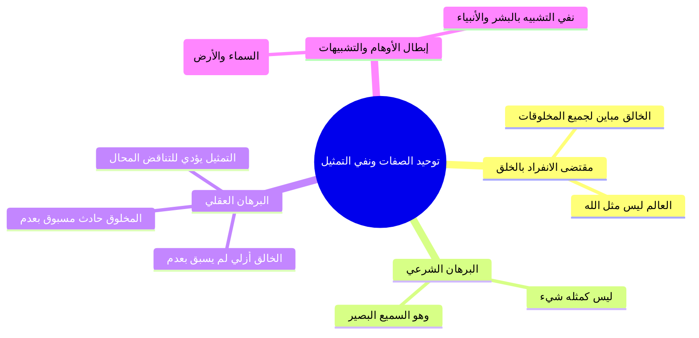

# 01 - مقتضيات توحيد الربوبية في الأسماء والصفات ونفي المماثلة

> [!quote] الفترة المرجعية
> الأسطر 14–29 من [[تفريغ المحاضرة 14]] (مرجع ترقيم الأسطر لعدم وجود توقيت زمني دقيق في الأصل).

---

## 📝 الملخص العلمي المنظم

### 1. المقتضى الأول: توحيد الله في ذاته وأسمائه وصفاته
- من اعتقد وأقر بأن الله هو الخالق المالك المدبر المنفرد بهذا العالم؛ لزمه عقلاً وشرعاً أن يفرده في **ذاته، وأسمائه، وصفاته، ونفي المماثلة عنه سبحانه**.
- **القاعدة الكبرى:** «لا يمكن البته أن يكون شيء من مخلوقات الله مثل الله، ولا أن يكون الله مثل شيء من مخلوقاته»؛ لكونه هو الخالق المباين لسائر الخلائق.

---

### 2. البرهان العقلي على استحالة التمثيل والتناقض الناشئ عنه
بنى المحاضر برهاناً عقلياً قاطعاً يبين أن القول بالتمثيل يؤدي إلى التناقض الذاتي المحال:
1. **طبيعة المخلوق:** حادث مسبوق بعدم ويلحقه الفناء، وهذا جوهر كونه مخلوقاً ومربوباً.
2. **طبيعة الخالق سبحانه:** أزلي واجب الوجود، لم يسبق بعدم ولا يلحقه عدم، وكذلك صفاته العلى لم تسبق بعدم ولا يلحقها عدم.
3. **الوقوع في التناقض الممتنع عند القول بالتمثيل (كمثال اليد):**
   - إذا زعم زاعم أن «يد المخلوق مثل يد الخالق جل جلاله»:
     - **الاحتمال الأول:** أن نصف يد المخلوق بأنها لم تُسبق بعدم لأنها تشبه الخالق، وهذا جمع بين النقيضين ومكابرة للحس والواقع.
     - **الاحتمال الثاني:** أن نصف يد الخالق بأنها مسبوقة بعدم لأنها تشبه يد المخلوق، وهذا كفر وضلال وتناقض في حق الرب واجب الوجود.
   - **النتيجة:** ثبوت بطلان التمثيل عقلاً واستحالته الذاتية.

---

### 3. إبطال التمثيل شرعاً والرد على الأوهام
- **الدليل الشرعي القطعي:** قوله تعالى: ﴿لَيْسَ كَمِثْلِهِ شَيْءٌ ۖ وَهُوَ السَّمِيعُ الْبَصِيرُ﴾ [الشورى: 11]؛ جمعت بين نفي المماثلة وإثبات صفات الكمال.
- **نقد أوهام التشبيه عند بعض المتعلمين:**
  > ⚠️ تنبيه
  > ا خطأ تقريب الذات الإلهية بالتشبيه: يقع بعض الطلاب في خطأ فادح حين يسأل: «الله مثل ماذا؟»، فيقول بعضهم: «مثل السماء»، أو «مثل الأرض»، أو يمثل بالأنبياء كآدم وعيسى ومحمد عليهم الصلاة والسلام؛ وهذا كله باطل وممتنع شرعاً وعقلاً؛ فلا يشبه الله شجر، ولا حجر، ولا سماء، ولا أرض، ولا بشر.
- **الأسماء الدالة على كمال التفرد والأزلية:**
  - هو سبحانه: الأول الذي ليس قبله شيء، والآخر الذي ليس بعده شيء، والظاهر الذي ليس فوقه شيء، والباطن الذي ليس دونه شيء.

---

## 📋 استخراج المعلومات العلمية

### البرهان العقلي لإبطال مماثلة الخالق بالمخلوق

| وجه المقارنة | الخالق جل جلاله | المخلوق | النتيجة عند فرض التماثل |
|:---|:---|:---|:---|
| **الأولية والسبق بالعدم** | أزلي لم يُسبق بعدم قط | حادث مسبوق بعدم حتماً | تناقض محال (إما جعل الحادث أزلياً أو الأزلي حادثاً) |
| **البقاء والعدم اللاحق** | باقٍ دائم لا يلحقه عدم ولا فناء | طارئ يلحقه الفناء والزوال | تناقض ممتنع في العقل |
| **الصفات الذاتية** | تليق بجلاله وأزليته بلا حدوث | حادثة محدودة تليق بنقصه وعجزه | الجمع بين خصائص الغنى المطلق والفقر المطلق |

---

### خريطة المفاهيم: مقتضى نفي المماثلة

---

## 🗣️ نص المتحدث الكامل

> الامر الاول ان يوحد الله سبحانه وتعالى في ذاته واسمائه وصفاته كيف ذلك عندما نعتقد ان الله سبحانه وتعالى هو خالق هذا العالم ومالكه ومدمره فانه لا يمكن البته ان يكون شيء من مخلوقات الله مثل الله سبحانه وتعالى
> لو كانت مثلا الله لو قال في التناقض كانت خالقا لو قلنا ان هذه المخلوقات كانت مسبوقه بعدم الحقائق وهذا مقتضى انها مخلوقه عندما نقول هذا المخلوق مثلا يد المخلوق مثل الله سبحانه وتعالى
> والله عز وجل لم يسبق بعدم ولا الحق وكذلك صفاته الله سبحانه وتعالى لم تسبق بعد اولا الحق فلا فلا قلنا ان المخلوق مثل بيد الخالق جل جلاله لا وقال في التناقض
> فاما ان نصف يدي المخلوق بانها مسبوقه بعدم في الوقت ذاته لكونها مثل هذه الخالق لم تسبق بعدم هذا تناقض او ناتي الى يدل الله سبحانه وتعالى ونقول يضر الله لم تسبق بعدم وهي مثل هذا المخلوق فهي ما سبق بعدم هذا ما يقع في التناقض ولذلك ابطال التمثيل
> كما هو ثابت شرعا بقوله تعالى ليس كمثله شيء وهو السميع البصير
> هو باطل عقلا لا يمكن ان يكون هناك شيء من مخلوقات الله بمثل الله جل جلاله ولا يمكن ان يكون الله سبحانه وتعالى مثل مخلوقاته لا مثل البشر ولا مثل الشجر ولا مثل الحجر ولا مثل السماء ولا مثل الارض ونحو ذلك من العجيب ان بعض الطلاب عندما تقول له قرب لي الله يعني الله مثل ماذا
> فبعض النقطه يقول مثل السماء
> ويقول مثل الارض او يقول مثل البشر او مثلا دم او مثل يعني عيسى عليه السلام
> محمد صلى الله عليه وسلم جميعا
> لا يمكن ان يكون الله سبحانه وتعالى مثل شيء من مخلوقاته او ان يكون هناك شيء من مخلوقات الله مثل الله جل جلاله
> هذه عندنا قاعده من مقتضيات ان الله هو المنفرد بالخلق والملك والتدبير لهذا العالم
> فالعالم ليس مثل الله ولا شيء من هذا العالم مثل الله فيقتضي ايماننا بربوبيه الله سبحانه وتعالى
> ولا اعتقد ان الله المنفرد مربيه هذا العالم يقتضي ذلك ان الله سبحانه وتعالى لا مثيل له في ذاته ولا في اسمائه ولا في صفاته فهو جل جلاله لم يسبق بعدم ولا يلحقها هو الاول الذي ليس قبله شيء وهو الاخر الذي ليس بعده شيء وهو الظاهر الذي ليس فوقه شيء والباطن الذي ليس دونه شيء سبحانه وتعالى لكونه خالق هذا العالم
> فلا شيء من العالم مثله ولا هو مثل شيء من العالم سبحانه وتعالى من المقتضيات

---

## 🔍 المراجعة الداخلية (5 مراجعات عشوائية)

1. **البداية (سطر 14–15):** مطابقة تامة لتقرير المقتضى الأول: توحيد الله في ذاته وأسمائه وصفاته ونفي مماثلة المخلوقات له سبحانه.
2. **منتصف البداية (سطر 16–19):** مطابقة تامة لتفكيك برهان التناقض العقلي في التمثيل بين يد المخلوق ويد الخالق من جهة السبق بالعدم.
3. **المنتصف (سطر 20–22):** مطابقة تامة للاستدلال بآية ﴿ليس كمثله شيء وهو السميع البصير﴾، ونفي مشابهة البشر والشجر والحجر والسماء والأرض.
4. **منتصف النهاية (سطر 23–26):** مطابقة تامة لذكر استغراب سؤال بعض الطلاب «الله مثل ماذا؟» والرد على تمثيله بالسماء أو الأرض أو الأنبياء كآدم وعيسى ومحمد ﷺ.
5. **النهاية (سطر 27–29):** مطابقة تامة لتأكيد انفراد الله ونفي المثل في أسمائه (الأول والآخر والظاهر والباطن) وتأصيل قاعدة: «العالم ليس مثل الله، ولا شيء من العالم مثل الله».

---

## ⏭️ التنقل ومتابعة الإنجاز

- **السابق:** [[00 - مقدمة وخطة الأجزاء وعناصر المحاضرة]]
- **التالي:** [[02 - مقتضيات توحيد الربوبية في التشريع والعبادة وحوار النصراني]]

> [!info] مؤشر الإنجاز
> - إجمالي أجزاء المحاضرة: 9 أجزاء (من 00 إلى 08)
> - الجزء الحالي: 01
> - الأجزاء المتبقية: 7 أجزاء
