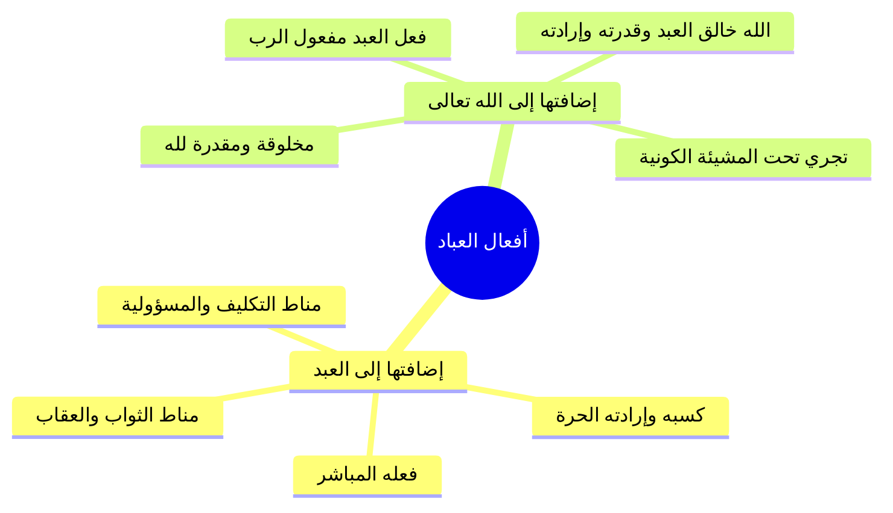

# 04 - مقتضيات توحيد الربوبية في القضاء والقدر وخلق أفعال العباد

> [!quote] الفترة المرجعية
> الأسطر 70–88 من [[تفريغ المحاضرة 14]] (مرجع ترقيم الأسطر لعدم وجود توقيت زمني دقيق في الأصل).

---

## 📝 الملخص العلمي المنظم

### 1. المقتضى الرابع: توحيد الله في قضائه وقدره
- من اعتقد انفراد الله بالخلق والملك والتدبير، وأنه ما شاء كان وما لم يشأ لم يكن؛ لزمه قطعاً إفراد الله بقضائه وقدره.
- **إحاطة المشيئة والعلم:** لا تسكن ذرة في هذا الكون ولا تتحرك إلا بإذنه وعلمه وإرادته، وقد أحاط بكل شيء علماً وقدرةً وتدبيراً.

---

### 2. مراتب الإيمان بالقدر الأربع
يتحقق إفراد الله في القدر بالإيمان بمراتبه الأربع:
1. **العلم الأزلي السابق:** علم الله بما كان وما سيكون وما لم يكن لو كان كيف يكون، وعلمه بأفعال العباد قبل أن يعملوها؛ قال تعالى: ﴿وَعِندَهُ مَفَاتِحُ الْغَيْبِ لَا يَعْلَمُهَا إِلَّا هُوَ ۚ وَيَعْلَمُ مَا فِي الْبَرِّ وَالْبَحْرِ ۚ وَمَا تَسْقُطُ مِن وَرَقَةٍ إِلَّا يَعْلَمُهَا وَلَا حَبَّةٍ فِي ظُلُمَاتِ الْأَرْضِ وَلَا رَطْبٍ وَلَا يَابِسٍ إِلَّا فِي كِتَابٍ مُّبِينٍ﴾ [الأنعام: 59].
2. **الكتابة السابقة:** كتابة مقادير الخلائق في اللوح المحفوظ؛ قال تعالى: ﴿أَلَمْ تَعْلَمْ أَنَّ اللَّهَ يَعْلَمُ مَا فِي السَّمَاءِ وَالْأَرْضِ ۗ إِنَّ ذَٰلِكَ فِي كِتَابٍ ۚ إِنَّ ذَٰلِكَ عَلَى اللَّهِ يَسِيرٌ﴾ [الحج: 70].
3. **المشيئة العامة النافذة:** أنه لا يمكن أن يقع في ملكه ما لا يريده كونا ومشيئة.
4. **الخلق والإيجاد الشامل:** خلق كل ما في الكون شيئاً بعد شيء، إما خلقاً مباشراً أو بالأسباب التي قدرها.

---

### 3. الفرق بين الإرادة الكونية والإرادة الشرعية
فصّل المحاضر ضابط الجمع بين إرادة الله ومشيئته وبين أفعال العباد:

| نوع الإرادة | متعلقها ومجالها | حكم التلازم مع المحبة والوقوع |
|:---|:---|:---|
| الإرادة الكونية القدرية | شاملة لكل ما يحدث في الكون من حركة وسكون وخير وشر | **لا يلزم أن يحبها الله، ولكن يلزم وقوعها حتماً** (وقوع المعاصي والشرور لحكمة بالغة) |
| الإرادة الشرعية الدينية | متعلقة بالأوامر والنواهي والشرائع التي سنها للناس | **يحبها الله ويرضاها، ولا يلزم وقوعها من كل أحد** (كالصلاة والإيمان يقع من المؤمن ولا يقع من الكافر) |

- **الخلاصة:**
  - الطاعات: أرادها الله كونا (فوقعت) وأرادها شرعا (فأحبها وأمر بها).
  - المعاصي: أرادها الله كونا (وقوعاً في ملكه لحكمة بالغة) ولم يردها شرعا (بل نهى عنها وأبغضها).

---

### 4. حقيقة أفعال العباد (فعل العبد مفعول الرب)
- **القاعدة المحررة لأهل السنة:** العبد مخلوق لله، وأعماله مخلوقة لله سبحانه:
  1. **إضافتها إلى العبد:** هي فعل العبد واختياره وكسبه ومباشرته بجوارحه؛ ولذلك يُثاب عليها إذا كانت طاعة، ويُعاقب عليها إذا كانت معصية.
  2. **إضافتها إلى الله:** هي مفعول ومخلوق لله سبحانه؛ لأن الله هو الذي خلق في العبد القدرة والإرادة الحرة والجوارح السليمة الممكنة من الفعل؛ فلولا خلق الله لتلك الآلات والأسباب لما تمكن العبد من فعل شيء.
- **البرهان على نفوذ قدرة الرب وسلبها لو شاء:**
  - قال تعالى: ﴿وَلَوْ نَشَاءُ لَطَمَسْنَا عَلَىٰ أَعْيُنِهِمْ فَاسْتَبَقُوا الصِّرَاطَ فَأَنَّىٰ يُبْصِرُونَ * وَلَوْ نَشَاءُ لَمَسَخْنَاهُمْ عَلَىٰ مَكَانَتِهِمْ فَمَا اسْتَطَاعُوا مُضِيًّا وَلَا يَرْجِعُونَ﴾ [يس: 66–67]؛ فلو سلب الله قدرة العبد لعجز عن كل حركة وسكون.

---

## 📋 استخراج المعلومات العلمية

### منظومة أفعال العباد بين المباشرة والخلق

---

## 🗣️ نص المتحدث الكامل

> حياكم الله ايها الاحبه في الله وقفنا عند المقتضى الثالث من مقتضيات توحيد الله سبحانه وتعالى بربوبيته وهو ان توجه اليه جل جلاله
> بجميع انواع العباده كل قول او فعل ظاهر او باطن يعني يتعلق بالقلب او يتعلق بالجوارح واللسان كل قولا وفعلا ظاهرا وباطنا ثبت في الكتاب والسنه الامر به او الحث على فعله او مدح فعليه بالتوجه الى الله سبحانه وتعالى به وحده لا شريك له
> هذا هو التوحيد وهو مقتضى ا قرارنا بربوبيه الله سبحانه وتعالى لنا والتوجه بشيء من هذه العبادات الى غير الله
> هذا منا فلهذا المقتضى
> وهذا شرك بالله سبحانه وتعالى من مقتضيات ربوبيه الله سبحانه وتعالى لنا ان وحده جل جلاله في قضائه وقدره
> نحن نعتقد ان الله سبحانه وتعالى هو المنفرد بالخلق والملك والتدبير ما شاء كان وما لم يشا لم يكن ما من ذره في هذا الكون تسكن الا باذنه ما من ذره في هذا الكون تتحرك الا باذنه كل شيء بعلمه كل شيء بارادته احاط بكل شيء علما وقدره واراده سبحانه وتعالى اذن نحن نعلم ان ما يحدث في هذا الكون من خير او شر الا وهو بقضاء الله وقدره
> اذن عندما نعتقد انفراد الله سبحانه وتعالى بربوبيته الى هذا الكون فان ذلك يستوجب علينا
> يجب علينا ان نفرد الله سبحانه وتعالى بقضائه وقدره
> فهو سبحانه وتعالى الذي قدر الخلائق فى الازل فعلمها كتبها وشاء وقوعها وخلقها شيئا بعد شيء
> قال الله سبحانه و تعالى وعنده مفاتح الغيب لا يعلمها
> الا هو ويعلم ما في البر والبحر وما تسقط من ورقه الا يعلمها ولا حبه في ظلمات الارض ولا رطب ولا يابس الا في كتاب مبين
> وقال تعالى لم تعلم ان الله يعلم ما في السماء والارض ان ذلك في كتاب ان ذلك على الله يسير نعلم انه ما من شيء يكون في هذا الكون الا والله قد علمه من الازل علم الله ما يكون في كونه قبل ان يكون علمه من الازمه سبحانه وتعالى وكتبه عنده ونحن كذلك افعال الاختياريه التي نقوم بها من صلاه وصوم وزكاه وغير ذلك من الطاعات او من المعاصي قد علمها الله عز وجل في الازمه
> وقد كتبها عنده علم ما العباد عامل قبل ان يعملوه وكتب ذلك عندهم كتب ذلك عنده مؤمن بالعلم السابق والكتاب السابقه
> ونؤمن بان كل ما في هذا الكون ما يكون في هذا الكون قد اراد الله حصوله لانه لا يمكن ان يكون في هذا الكون ما لا يريده الله
> لكن ان كان خيرا فقد اراده شريعه للناس يسيرون عليها اراده شرعا و ان كان شرا ومعصيه فقد اراده الله عز وجل ان يكون في كونه ولذلك نقول اراده كونه المعاصي ارادها الله كونا ولم يردها شرعا والطاعات ارادها الله عز وجل ان تكون في كونه وارادها ان تكون شريعه للناس وكل ما في هذا الكون من خير او شر كل ما في هذا الكون من حركه او سكون قلنا في هذا الكون من مخلوقات الله هي مخلوقه لله جل جلاله
> اما خلق خلقا مباشر خلقها بالاسباب التي اوجدها الله سبحانه وتعالى وافعال العباد كذلك مخلوقه لله خلقها الله بما خلق فينا من القدره
> والاراده والجوارح التي تمكننا من الفعل
> ولذلك الانسان مخلوق لله واعماله مخلوقه لله اعمال العباد فعل للعبد تضاف الى العبد انه هو الذي فعل اه فلذلك الكتاب ويعاقب عليها وتضاف الى الله انه هو خالق كل شيء
> فهي مخلوقه لله هي فعل العبد مفعول الرب هي مخلوقه لله بما بما خلق الله عز وجل في العبد من هذه الاسباب التي تمكنها على الفعل ولو شاء الله لانزل عنه تلك القدره فما استطاع ان يفعل شيئا
> كما قال الله عز وجل ولو نشاء لطمسنا على اعينهم فاستبقوا الصراط فانى يبصرون ولو نشاء لمسخناهم على مكانتهم فما استطاعوا مضيا ولا يرجعون فكل ما في هذا الكون هو
> وقد قدره الله سبحانه وتعالى كتبه و شاء وقوعه وخلقه شيئا بعد الشيء هذا من مقتضاه التوحيد الربوبيه

---

## 🔍 المراجعة الداخلية (5 مراجعات عشوائية)

1. **البداية (سطر 70–73):** مطابقة تامة للتذكير بمقتضى التوجه بأنواع العبادة لله وحده والتحذير من الشرك المنافي له، ثم الدخول في مقتضى توحيد القضاء والقدر.
2. **منتصف البداية (سطر 74–77):** مطابقة تامة لمراتب القدر الأربع (علمها وكتبها وشاء وقوعها وخلقها شيئاً بعد شيء) والاستدلال بآية الأنعام والحج.
3. **المنتصف (سطر 78–80):** مطابقة تامة لشمول العلم الأزلي والكتابة السابقة لأفعال العباد الاختيارية من طاعات ومعاصٍ قبل أن يعملوها.
4. **منتصف النهاية (سطر 81–83):** مطابقة تامة للتمييز الدقيق بين الإرادة الكونية والإرادة الشرعية: المعاصي أرادها كونا لا شرعا، والطاعات أرادها كونا وشرعا.
5. **النهاية (سطر 84–88):** مطابقة تامة لتأصيل «فعل العبد مفعول الرب»، وأن العبد مسؤول عن كسبه وفعله، والله خالق أفعاله بما خلق فيه من القدرة والإرادة، والاستدلال بآيتي سورة يس.

---

## ⏭️ التنقل ومتابعة الإنجاز

- **السابق:** [[03 - فاصل اسم الله التواب وفقه التوبة وشروطها]]
- **التالي:** [[05 - ثمرات توحيد الربوبية في الرضا وحلاوة الإيمان ومواجهة المصائب]]

> [!info] مؤشر الإنجاز
> - إجمالي أجزاء المحاضرة: 9 أجزاء (من 00 إلى 08)
> - الجزء الحالي: 04
> - الأجزاء المتبقية: 4 أجزاء
