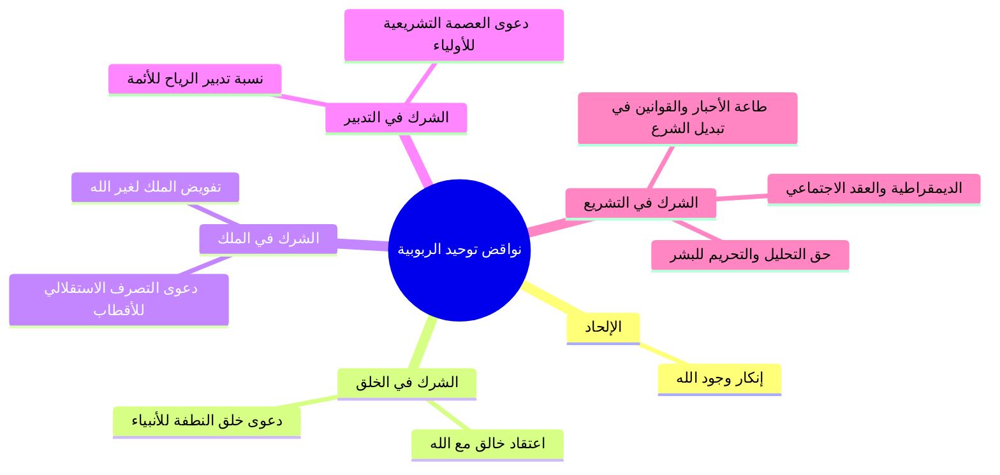

# 08 - نواقض توحيد الربوبية في التدبير والتشريع ونقد الديمقراطية

> [!quote] الفترة المرجعية
> الأسطر 171–217 من [[تفريغ المحاضرة 14]] (مرجع ترقيم الأسطر لعدم وجود توقيت زمني دقيق في الأصل).

---

## 📝 الملخص العلمي المنظم

### 1. الناقض الثالث: دعوى الشريك في التدبير الكوني والشرعي
- **انحراف الرافضة في شأن الأئمة:**
  - ينسبون لأئمتهم التدبير الكوني؛ فيزعمون أن الإمام يدبر أمر هذا العالم، ويصرف الرياح لنصرته، ويتحكم في الأفلاك.
  - وينسبون إليهم التدبير الشرعي المطلق؛ فيزعمون أن الإمام معصوم، وأن كلامه وحي وتشريع استقلالي ككلام الله.
  - **الحكم العقدي:** هذا شرك بيّن يناقض انفراد الله بالتدبير الكوني والشرعي.

---

### 2. الناقض الرابع: الشرك في التشريع ونقد الديمقراطية المعاصرة
- **مظهر الشرك في التشريع:**
  > ⚠️ تنبيه
  > ا الشرك بجعل سلطة التحليل والتحريم لغير الله: يعتقد كثير من منظري القانون الوضعي أن «الشعب هو مصدر السلطات وله السيادة والمشاركة في التشريع»؛ بحيث يحللون الحرام أو يحرمون الحلال بناءً على رغبات الأغلبية والتصويت البرلماني، وهذا عين الشرك في ربوبية الله وتشريعه.
- **تفكيك الأساس الفلسفي للديمقراطية (نظرية العقد الاجتماعي والعلمانية):**
  1. *الأصل الفلسفي:* نشأت الديمقراطية الغربية بناءً على نظرية «العقد الاجتماعي»؛ القائلة بأن الناس انتقلوا من حالة الوئام الفطري إلى العداء بسبب تنازع الأطماع واختلاف الأديان.
  2. *الحل الوضعي المنحرف:*
     - لحل مشكلة تنازع الأديان: أقروا «العلمانية» بنفي الدين وشريعته عن إدارة شؤون الحياة والدولة.
     - ولحل مشكلة الأطماع: جعلوا البشر والمجالس النيابية هم المشرعين لأنفسهم بناءً على حكم الأغلبية والتصويت.
  3. *اللازم العقدي:* جعل الأغلبية أو المجالس النيابية نداً وشريكاً لله في حقه الخاص بالتحليل والتحريم، وهو نقض صريح لأصل توحيد الربوبية.

---

### 3. البرهان النبوي الحاسم (حديث عدي بن حاتم)
- فسر النبي ﷺ الشرك في التشريع تفسيراً قاطعاً لا يحتمل التأويل في قوله تعالى: ﴿اتَّخَذُوا أَحْبَارَهُمْ وَرُهْبَانَهُمْ أَرْبَابًا مِّن دُونِ اللَّهِ وَالْمَسِيحَ ابْنَ مَرْيَمَ وَمَا أُمِرُوا إِلَّا لِيَعْبُدُوا إِلَٰهًا وَاحِدًا ۖ لَّا إِلَٰهَ إِلَّا هُوَ ۚ سُبْحَانَهُ عَمَّا يُشْرِكُونَ﴾ [التوبة: 31].
- **الحوار النبوي المحكم:**
  - قال عدي بن حاتم رضي الله عنه: يا رسول الله، إنا لسنا نعبدهم (ظاناً أن العبادة مقصورة على السجود والركوع)!
  - فقال له النبي ﷺ:
    ا - «أَلَيْسَ يُحِلُّونَ مَا حَرَّمَ اللَّهُ فَتُحِلُّونَهُ، وَيُحَرِّمُونَ مَا أَحَلَّ اللَّهُ فَتُحَرِّمُونَهُ؟»؛ قال: بلى، قال: «فَتِلْكَ عِبَادَتُهُمْ».
- **القاعدة الشرعية:** اتخاذ العلماء، أو الرهبان، أو الأمراء، أو الرؤساء، أو المجالس النيابية مشرعين يحللون ما حرم الله أو يحرمون ما أحل الله طاعةً مطلقة هو اتخاذ لهم أرباباً وعبادة صريحة لهم من دون الله.

---

### 4. الخلاصة الكلية لنواقض توحيد الربوبية
تنحصر نواقض توحيد الربوبية في:
1. **إنكار وجود الله سبحانه (الإلحاد).**
2. **اعتقاد الشريك مع الله في: الخلق، أو الملك، أو التدبير، أو التشريع.**

---

## 📋 استخراج المعلومات العلمية

### جدول المقارنة بين تشريع الوحي الرباني والديمقراطية الوضعية

| وجه المقارنة | الشريعة الإسلامية الربانية | الديمقراطية الغربية الوضعية |
|:---|:---|:---|
| **المرجعية وسلطة التشريع** | حق خالص لله تعالى بالوحي؛ ﴿إِنِ الْحُكْمُ إِلَّا لِلَّهِ﴾ | للشعب والمجالس النيابية عبر التصويت والأغلبية |
| **موقع الحلال والحرام** | ثابت بأمر الله لا يتبدل بأهواء الناس | متغير خاضع للتصويت؛ يحللون الزنا أو الخمر بالرغبة |
| **الأساس الفلسفي** | التسليم لرب العالمين العليم بمصالح خلقه | نظرية العقد الاجتماعي والعلمانية وعزل الدين عن الحياة |
| **الحكم العقدي** | توحيد الربوبية وتحقيق العبودية لله | شرك في الربوبية واتخاذ البشر أرباباً من دون الله |

---

### خريطة المفاهيم: نواقض توحيد الربوبية

---

## 🗣️ نص المتحدث الكامل

> قال بينه انه مرسل عند الله هذا الانسان من يتولى انس ادع الله سبحانه وتعالى ان يحيا امامكم من الذي احيي هذا الميت احياه الله سبحانه وتعالى
> لكن عيسى عليه السلام قال لو ق محيا بان
> الله فيقوم حيا باذن الله
> هل عيسى شريك لله في الاحياء لماذا لا ليس هكذا هذه الدلاله هذه ان عيسى مرسل من عند الله
> الدليل ان الله سيحل هذا الانسان امامكم وهو كلكم قد اجمع تم على انه قد مات وقد انتهى هذه الايات والبراهين التي اعطاها الله سبحانه و تعالى لانبيائه انما هي ايات انهم من عند الله فلا يمكن بعد ذلك ان ياتي انسان ويقول ان الشريك لله في الخلق انا شريك الله في الملك ان شريك الله في التدبير
> انا شريك في التشريع هذا كله كلام المعطل
> كذلك ايها الاحبه في الله بعض الطوائف ينسبون لائمتهم كالرافضه ينسبون لامه التدمير الكوني والتدبير الشرعي ينسبون لائمتهم انهم يدبرون امر هذا الكون
> كان الله في تدبير امر هذا الكون
> وانه يقول الريح اه اذهب نصره ويقول الريح يدبر امر هذا الكون
> ثم يقولون انه معصوم كل ما يقول هو شرع من عند الله و حي من ان دل فكلامه يعتبرون هو تشريع وهذا كلهم من الضلال والعياذ بالله
> كذلك ايها الاحبه في الله من اعتقد ان للشعب الا سياده والمشاركه في التشريع وانهم يشرعون للناس الحلال والحرام
> كما يقول كثير من القانونيين بهذا الامر القاني القانون القانون هؤلاء وقعوا في الشرك في توحيد الربوبيه من ناحيه التشريع
> فقالوا يعني نحن يمكن ان نصوت على حسب الرغبات الناس قالوا هذا حلال
> فكان هذا حلال
> واذا قالوا هذا حرام فانه يكون حراما وهذا لا يجوز البته فهذه ما نسمعه اليوم من الديمقراطيه والاعجاب بها الديمقراطيه قائمه على فلسفه هذه الفلسفه تسمى نظريه العقد الاجتماعي ونظريه العقد الاجتم
> قائمه على ان الناس كانوا في وئام ثم تحول الامر الى عداد وسبب التحول الى عداء تخاصمهم في الاطماع واختلاف في الاديان
> فقالوا لحل قضيه الاديان فتكون العلمانيه لحل قضيه الاطماع فيكون البشر هم الذين يجتمعون لانفسهم على حسب الاغلبيه هذه كلها شراكه لله سبحانه وتعالى وهذا كله نقض نقل لموضوع توحيد الربوبيه في التشريع
> فيجب علينا ان نؤمن ايمانا صادقا ان امور التحليل والتحرير لا تكون الا من الله سبحانه وتعالى
> كما قال الله عز وجل عن اتباع الذين اشركوا قال عنهم انهم جعلوا يعني انهم عبدوا غير الله سبحانه وتعالى فاخذ النبي ص وسلم انهم كيف كانت عبادتهم لهم كانت هي طاعتهم في امور التحليل والتحريم
> فلما اعتقدوا ان هناك من له حق التحليل والتحريم كان ذلك
> كما قال او ليس اذا احل لكم الحرام احللتموهم واذا حرموا عليهم الحلال حرمت مه قالوا بلى قال فتلك عبادتهم اتخذوا احبارهم ورهبانهم اربابا من دون الله والمسيح من ال مريم وما امروا الا ليعبدوا الها واحدا فدل ذلك على ان اتخاذ العلماء اتخاذ العباد
> خذ الامراء اتخذ الرؤساء مشرعين ان هذه العباده له ان هذا من الشرك الذي لا يرضاه الله سبحانه وتعالى
> اذا اراقه توحيد الربوبيه انكار وجود الله التوحيد الرومي التقى الشريك مع الله في الخلق او الملك او التدبير او التشريع
> ونكتفي بهذا القدر في هذه الحلقه و نلتقي بكم في حلقه اخرى
> سائلا الله سبحانه وتعالى لي ولكم الاخلاص والتوفيق والسداد وصلى الله وسلم وبارك على عبده ورسوله محمد
> جزاكم الله خيرا
> زياده الايمان
> وتريد باي مكان
> والسؤال علمك الازهر فى البستان

---

## 🔍 المراجعة الداخلية (5 مراجعات عشوائية)

1. **البداية (سطر 189–194):** مطابقة تامة لتتمة مسألة إحياء عيسى للموتى بإذن الله وأنه برهان على صدق الرسالة وليس شركة في الخلق أو الملك أو التدبير أو التشريع.
2. **منتصف البداية (سطر 195–198):** مطابقة تامة لبيان ضلال الرافضة في نسبة التدبير الكوني للريح والأفلاك وعصمة التشريع لأئمتهم واعتبار ذلك شركاً في الربوبية.
3. **المنتصف (سطر 199–203):** مطابقة تامة لنقد زعم سيادة الشعب في التشريع والتحليل والتحريم بالتصويت، وتسمية الديمقراطية ونقدها.
4. **منتصف النهاية (سطر 203–206):** مطابقة تامة لتفكيك نظرية العقد الاجتماعي والعلمانية، وبيان أن جعل البشر يشرعون بالأغلبية شرك في الربوبية.
5. **النهاية (سطر 207–214):** مطابقة تامة للاستدلال بحديث عدي بن حاتم وآية التوبة 31 في اتخاذ الأحبار والرهبان والرؤساء أرباباً بالتحليل والتحريم، وحصر نواقض الربوبية، والدعاء الختامي.

---

## ⏭️ التنقل ومتابعة الإنجاز

- **السابق:** [[07 - نواقض توحيد الربوبية ودعوى الشريك في الخلق والملك]]
- **التالي:** لا يوجد (نهاية أجزاء المحاضرة 14)

> [!info] مؤشر الإنجاز
> - إجمالي أجزاء المحاضرة: 9 أجزاء (من 00 إلى 08)
> - الجزء الحالي: 08
> - الأجزاء المتبقية: 0 (تم اكتمال جميع الأجزاء بنجاح)
