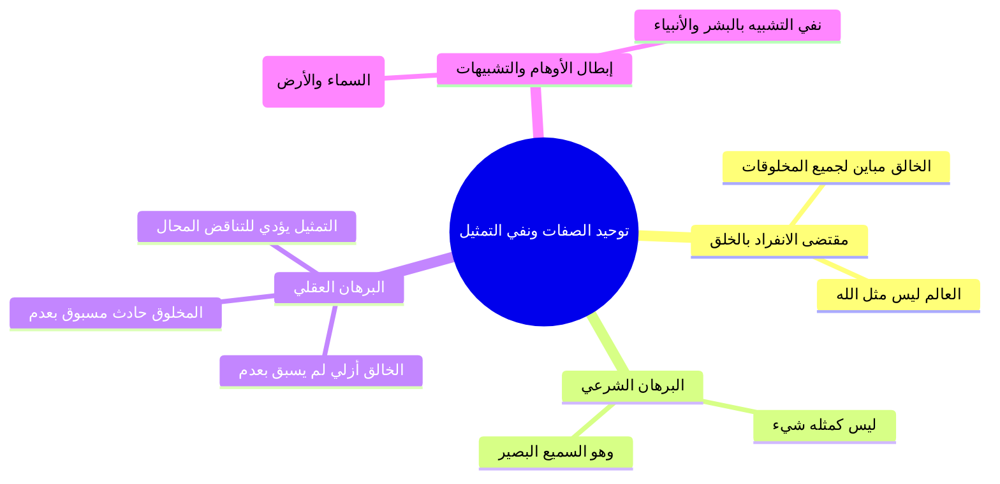
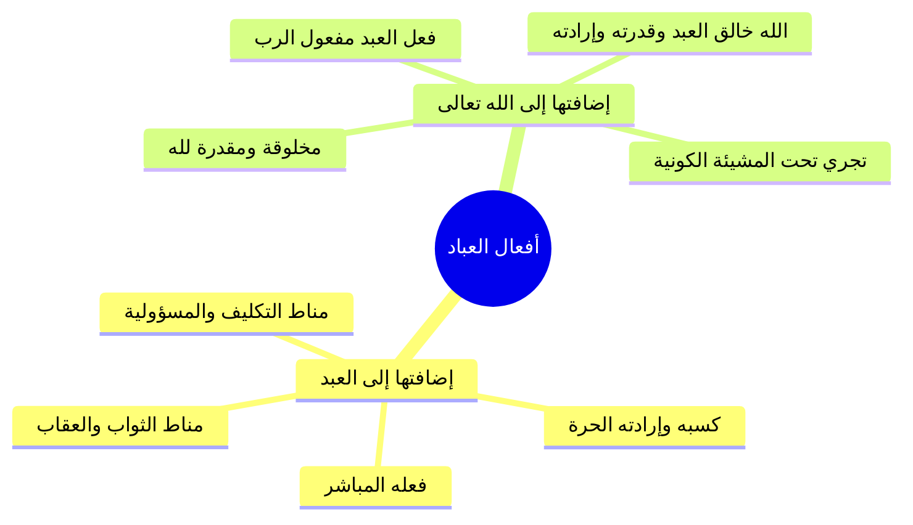
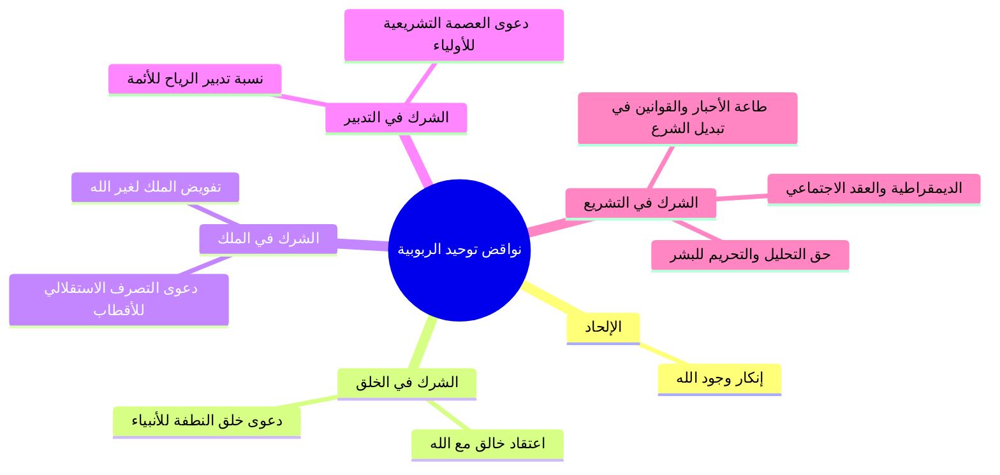

# المحاضرة 14: مقتضيات توحيد الربوبية وثمراته ونواقضه (ملف مجمع شامل)

> [!info] توصيف الملف المجمع
> يضم هذا الملف المجمع المحتوى العلمي الكامل المنظم للمحاضرة الرابعة عشرة من مادة العقيدة (برنامج زاد المستوى الأول)، شاملاً الجداول والرسومات البيانية والمقارنات ونصوص المتحدث الكاملة حرفياً دون اجتزاء أو حذف، مرتبة بالتتابع المنهجي لجميع أجزاء المحاضرة من الجزء 00 حتى الجزء 08.

---

## 📑 فهرس موضوعات الملف المجمع

1. [[#الجزء 00: مقدمة وخطة الأجزاء وعناصر المحاضرة]]
2. [[#الجزء 01: مقتضيات توحيد الربوبية في الأسماء والصفات ونفي المماثلة]]
3. [[#الجزء 02: مقتضيات توحيد الربوبية في التشريع والعبادة وحوار النصراني]]
4. [[#الجزء 03: فاصل اسم الله التواب وفقه التوبة وشروطها]]
5. [[#الجزء 04: مقتضيات توحيد الربوبية في القضاء والقدر وخلق أفعال العباد]]
6. [[#الجزء 05: ثمرات توحيد الربوبية في الرضا وحلاوة الإيمان ومواجهة المصائب]]
7. [[#الجزء 06: فاصل اسم الله الحسيب وثمار الإيمان به ومحاسبة النفس]]
8. [[#الجزء 07: نواقض توحيد الربوبية ودعوى الشريك في الخلق والملك]]
9. [[#الجزء 08: نواقض توحيد الربوبية في التدبير والتشريع ونقد الديمقراطية]]

---

## الجزء 00: مقدمة وخطة الأجزاء وعناصر المحاضرة

### 📝 الملخص العلمي المنظم

#### 1. الافتتاح والأدعية المأثورة
افتتح المحاضر بحمد الله والصلاة والسلام على رسول الله محمد ﷺ، والدعاء المأثور:
- «اللهم إنا نسألك علماً نافعاً، وعملاً صالحاً، وقلباً خاشعاً، ولساناً ذاكراً».
- «اللهم علمنا ما ينفعنا، وانفعنا بما علمتنا، واجعله حجة لنا ولا تجعله حجة علينا يا رب العالمين».

#### 2. مراجعة وتأصيل لتوحيد الربوبية
- **تعريف توحيد الربوبية:** اعتقاد انفراد الله بربوبيته لهذا العالم؛ فهو خالقه، ومالكه، ومدبره، والمشرع لعباده شريعة يسيرون عليها.
- **التدبير ونوعاه:**
  1. **التدبير الكوني:** تصريف شؤون الخلق والأفلاك والأرزاق.
  2. **التدبير الشرعي:** وضع الشريعة والأحكام والتحليل والتحريم.
- **علة التنصيص على التشريع:** مع أن التشريع داخل في مسمى التدبير، إلا أن العلماء ينصون عليه استقلالاً لدفع توهم من يظن أن التدبير الكوني لله وحده بينما يسوغ للمخلوق التدخل في التشريع؛ قال تعالى: ﴿أَمْ لَهُمْ شُرَكَاءُ شَرَعُوا لَهُم مِّنَ الدِّينِ مَا لَمْ يَأْذَن بِهِ اللَّهُ﴾.

#### 3. محاور المحاضرة الرابعة عشرة
1. **مقتضيات توحيد الربوبية:** ما يلزم من أقر بالربوبية.
2. **ثمرات توحيد الربوبية:** الآثار الإيمانية والنفسية لرسوخ هذا التوحيد.
3. **نواقض توحيد الربوبية:** الاعتقادات والشركيات التي تنقض هذا التوحيد.

### 📋 استخراج المعلومات العلمية

| المحور | المفهوم والمضمون العلمي | الشاهد والغاية |
|:---|:---|:---|
| **مقتضيات توحيد الربوبية** | لوازم الإقرار بربوبية الله (في الصفات، والتشريع، والعبادة، والقدر) | إثبات أن الإقرار بالربوبية يوجب التوحيد الشامل |
| **ثمرات توحيد الربوبية** | انشراح الصدر، حلاوة الإيمان، الشجاعة، والسكينة عند المصائب | تحويل المعتقد إلى طمأنينة وراحة نفسية وسلوكية |
| **نواقض توحيد الربوبية** | إنكار وجود الله، ودعوى الشريك في الخلق أو الملك أو التدبير أو التشريع | الحذر من مزالق الشرك الأكبر والضلالات المعاصرة |

### 🗣️ نص المتحدث الكامل (الجزء 00)

> ويتقدم تقنياته ومجالات طوروا ادواتنا في تقديم العلم الشرعي علمك الاساس في الاسلام
> السلام عليكم ورحمه الله وبركاته
> بسم الله الرحمن الرحيم الحمد لله رب العالمين والصلاه والسلام على اشرف المرسلين محمد وعلى اله وصحبه اجمعين اللهم انا نسالك علما نافعا وعملا صالحا و قلبا خاشعا ولسانا ذاكرا
> اللهم علمنا ما ينفعنا وانفعنا بما علمتنا و اجعله حجه لنا ولا تجعله حجه علينا رب العالمين
> وبعد ايها الاحبه في الله تدارسنا في اللقاء الماضي ما يتعلق بتوحيد الربوبيه من ناحيه تعريفه وقلنا توحيد الربوبيه وهو اعتقاد انفراد الله سبحانه وتعالى بربوبيته لهذا العالم فهو خالقه مالكه ومدبره والمشرع للناس سريعه يسيرون عليها في هذه الدنيا توحيد الربوبيه هو افراد الله بالخلق والملك والتدبير والتدمير تدبير ان تدبر الكوني وتدبير شرعي
> فبعض اهل العلم اضيف فيقول توحيد ربما افراد الله بالخلق والملك والتدبير والتشريع رغم ان التشريع يدخل في التدبير
> لكن ينصون عليه لبيان اهميته
> ولانه قد يخفى على بعض الناس يظنون ان الله له التدمير الكوني
> اما التدبير الشرعي فيمكن للمخلوق ان يتدخل في ذلك وهذا لا يصح على الله عز وجل
> ام لهم شركاء شرعوا لهم من الدين ما لم ياذن به الله
> وتشريع الدين هو حق خاص بالله سبحانه وتعالى وهو من ربوبيه الله جل جلاله لخلق وتذكرنا كذلك انه لا يمكن ان يكون لهذا الكون اكثر من ربه سبحانه وتعالى واخذنا قول الله عز وجل ما اتخذ الله من ولد وما كان معه من اله اذا لذهب كل اله بما خلق ولعلا بعضهم على بعض سبحان الله عما يشركون
> وقلنا ان الله خالق هذا الكون لا يمكن ان يكون اكثر من واحد وهو مالكو مدبره وان الانتظام امرا هذا العالم يدل على ان رب هذا واحد
> مستقره في فطره الناس وهي ندائه اقوله واخذنا ان ربوبيه الله عز وجل
> تشتمل على امرين عموم خلقه و و ربوبيته وعموم احس انه وحكمته لهذا الخلق بعض الامور المتعلقه بذلك اليوم
> بمشيئه الله تدارس ما هي الامور التي توجب على من اقرب توحيد الربوبيه تجب عليه عده امور ما هي المقتضيات التي تلزم من اقرب توحيد الربوبيه وتوحيد الربوبيه مقتضيات ما هي هذه المقتضيات يقتضي على من اقر بان الله و المنفرد بالخلق والملك والتدبير عنده
> ما هي هذه الامور

---

## الجزء 01: مقتضيات توحيد الربوبية في الأسماء والصفات ونفي المماثلة

### 📝 الملخص العلمي المنظم

#### 1. المقتضى الأول: توحيد الله في ذاته وأسمائه وصفاته
اعتقاد انفراد الله بالخلق والملك يقتضي استحالة مماثلة المخلوقات له سبحانه؛ فالخالق مباين لخلقه، والعالم ليس مثل الله ولا شيء من العالم مثل الله.

#### 2. البرهان العقلي على امتناع التمثيل والتناقض الناشئ عنه
- **المخلوق:** حادث مسبوق بعدم ويلحقه الفناء.
- **الخالق:** أزلي واجب الوجود لم يُسبق بعدم ولا يلحقه عدم، وكذلك صفاته العلى.
- **التناقض العقلي الممتنع:** القول بالتماثل (كمثال اليد) يقتضي إما وصف يد المخلوق بأنها لم تُسبق بعدم أو وصف يد الخالق بأنها مسبوقة بعدم؛ وكلاهما جمع بين النقيضين ومحال عقلاً.
- **الدليل الشرعي:** ﴿لَيْسَ كَمِثْلِهِ شَيْءٌ ۖ وَهُوَ السَّمِيعُ الْبَصِيرُ﴾ [الشورى: 11].
- **الرد على أوهام التشبيه:** نقد من يمثل الله بالسماء أو الأرض أو الأنبياء كآدم وعيسى ومحمد ﷺ؛ وتأكيد أسمائه الحسنى: الأول، والآخر، والظاهر، والباطن.

### 📋 استخراج المعلومات العلمية

| وجه المقارنة | الخالق جل جلاله | المخلوق | النتيجة عند فرض التماثل |
|:---|:---|:---|:---|
| **الأولية والسبق بالعدم** | أزلي لم يُسبق بعدم قط | حادث مسبوق بعدم حتماً | تناقض محال (إما جعل الحادث أزلياً أو الأزلي حادثاً) |
| **البقاء والعدم اللاحق** | باقٍ دائم لا يلحقه عدم ولا فناء | طارئ يلحقه الفناء والزوال | تناقض ممتنع في العقل |

### 🗣️ نص المتحدث الكامل (الجزء 01)

> الامر الاول ان يوحد الله سبحانه وتعالى في ذاته واسمائه وصفاته كيف ذلك عندما نعتقد ان الله سبحانه وتعالى هو خالق هذا العالم ومالكه ومدمره فانه لا يمكن البته ان يكون شيء من مخلوقات الله مثل الله سبحانه وتعالى
> لو كانت مثلا الله لو قال في التناقض كانت خالقا لو قلنا ان هذه المخلوقات كانت مسبوقه بعدم الحقائق وهذا مقتضى انها مخلوقه عندما نقول هذا المخلوق مثلا يد المخلوق مثل الله سبحانه وتعالى
> والله عز وجل لم يسبق بعدم ولا الحق وكذلك صفاته الله سبحانه وتعالى لم تسبق بعد اولا الحق فلا فلا قلنا ان المخلوق مثل بيد الخالق جل جلاله لا وقال في التناقض
> فاما ان نصف يدي المخلوق بانها مسبوقه بعدم في الوقت ذاته لكونها مثل هذه الخالق لم تسبق بعدم هذا تناقض او ناتي الى يدل الله سبحانه وتعالى ونقول يضر الله لم تسبق بعدم وهي مثل هذا المخلوق فهي ما سبق بعدم هذا ما يقع في التناقض ولذلك ابطال التمثيل
> كما هو ثابت شرعا بقوله تعالى ليس كمثله شيء وهو السميع البصير
> هو باطل عقلا لا يمكن ان يكون هناك شيء من مخلوقات الله بمثل الله جل جلاله ولا يمكن ان يكون الله سبحانه وتعالى مثل مخلوقاته لا مثل البشر ولا مثل الشجر ولا مثل الحجر ولا مثل السماء ولا مثل الارض ونحو ذلك من العجيب ان بعض الطلاب عندما تقول له قرب لي الله يعني الله مثل ماذا
> فبعض النقطه يقول مثل السماء
> ويقول مثل الارض او يقول مثل البشر او مثلا دم او مثل يعني عيسى عليه السلام
> محمد صلى الله عليه وسلم جميعا
> لا يمكن ان يكون الله سبحانه وتعالى مثل شيء من مخلوقاته او ان يكون هناك شيء من مخلوقات الله مثل الله جل جلاله
> هذه عندنا قاعده من مقتضيات ان الله هو المنفرد بالخلق والملك والتدبير لهذا العالم
> فالعالم ليس مثل الله ولا شيء من هذا العالم مثل الله فيقتضي ايماننا بربوبيه الله سبحانه وتعالى
> ولا اعتقد ان الله المنفرد مربيه هذا العالم يقتضي ذلك ان الله سبحانه وتعالى لا مثيل له في ذاته ولا في اسمائه ولا في صفاته فهو جل جلاله لم يسبق بعدم ولا يلحقها هو الاول الذي ليس قبله شيء وهو الاخر الذي ليس بعده شيء وهو الظاهر الذي ليس فوقه شيء والباطن الذي ليس دونه شيء سبحانه وتعالى لكونه خالق هذا العالم
> فلا شيء من العالم مثله ولا هو مثل شيء من العالم سبحانه وتعالى من المقتضيات

---

## الجزء 02: مقتضيات توحيد الربوبية في التشريع والعبادة وحوار النصراني

### 📝 الملخص العلمي المنظم

#### 1. المقتضى الثاني: توحيد الله في التشريع
إفراد الله بوضع الشريعة والتحليل والتحريم؛ فلا حق لأمير أو وزير أو عالم أو عابد في سن الأحكام مع الله؛ قال تعالى: ﴿أَمْ لَهُمْ شُرَكَاءُ شَرَعُوا لَهُم مِّنَ الدِّينِ مَا لَمْ يَأْذَن بِهِ اللَّهُ﴾، وقال يوسف: ﴿إِنِ الْحُكْمُ إِلَّا لِلَّهِ ۚ أَمَرَ أَلَّا تَعْبُدُوا إِلَّا إِيَّاهُ﴾.

#### 2. المقتضى الثالث: توحيد الله في العبادة والشكر
العبودية الخالصة لله وإفراده بالطلب والقصد والنسك؛ قال تعالى: ﴿يَا أَيُّهَا النَّاسُ اعْبُدُوا رَبَّكُمُ الَّذِي خَلَقَكُمْ... فَلَا تَجْعَلُوا لِلَّهِ أَندَادًا وَأَنتُمْ تَعْلَمُونَ﴾.

#### 3. حوار النصراني عند البحر ومثل الجوال الهدية
- تأمل حركة الأمواج ووقوفها عند حد معلوم دال على مدبر واحد للبحر والكون.
- إثبات أن المدبر لا يشبه البحر ولا الأسماك ولا البشر ولا عيسى عليه السلام.
- ضرب مثل الجوال الهدية: شكر عابر السبيل على هدية أهداها لك غيره يعد جنوناً وسفهاً؛ فصرف العبادة والشكر لغير الخالق المنعم هو أعظم الظلم وأقبح القبيح وأعظم الجنون؛ وترتب على الحوار إسلام النصراني.

### 📋 استخراج المعلومات العلمية

| الباب | مقتضى توحيد الربوبية | الوجه الباطل المناقض له | الشاهد القرآني |
|:---|:---|:---|:---|
| **التشريع** | انفراد الله بالتحليل والتحريم ووضع الأحكام | جعل سلطة التشريع للبشر أو المجالس أو الكهنة | ﴿إِنِ الْحُكْمُ إِلَّا لِلَّهِ ۚ أَمَرَ أَلَّا تَعْبُدُوا إِلَّا إِيَّاهُ﴾ |
| **العبادة** | إفراد الخالق الرازق بالدعاء والرجاء والشكر | صرف الشكر والعبادة للأموات أو الأصنام أو الأنبياء | ﴿فَلَا تَجْعَلُوا لِلَّهِ أَندَادًا وَأَنتُمْ تَعْلَمُونَ﴾ |

### 🗣️ نص المتحدث الكامل (الجزء 02)

> المقتضيات توحيد الربوبيه ان نوحد الله سبحانه وتعالى في التشريع لانك عندما تعتقد ان الله سبحانه وتعالى هو المنفرد بتدمير امر الناس بوضع
> ريعه للناس
> فهل يجوز ان يتصور الانسان ان لامير او وزير او عالم او عابد ان يكون مشرعا مع الله جل جلاله لا يمكن ذلك والتحليل والتحريم لا يكون الا لله
> قال الله سبحانه وتعالى
> ام لهم شركاء شرعوا لهم من الدين ما لم ياذن به الله ولولا كلمه الفصل لقضي بينهم وان الظالمين لهم عذاب اليم
> وقال سبحانه وتعالى ذكر قصه يوسف ما الذين معها في السن قال يوسف يا صاحبي السجن اارباب متفرقون خير ام الله الواحد القهار ما تعبدون من دونه الا اسماء سميتموها انتم واباؤكم ما انزل الله بها من سلطان ان الحكم الا لله امر الا تعبدوا الا اياه ذلك الدين القيم ولكن اكثر الناس لا يعلمون
> فقال ان الحكم الا لله الحكم والتشريع لا يكون الا لله سبحانه وتعالى هذا من مقتضيات توحيد الربوبيه يوحد الله في ذاته واسمائه وصفاته وموحد الله سبحانه وتعالى في تشريعه للناس
> ونعود الله سبحانه وتعالى بهذه الشريحه التي وضعها من مقتضيات توحيد الربوبيه ان نوحد الله جل جلاله في امور العباده في التوجه القصد والطلب بشرعه فمن اعظم مقتضيات ربوبيه الله سبحانه وتعالى لخلقه من اعظم هذه المقتضيات العبوديه الخالصه لله سبحانه وتعالى وفق الشريعه التي جاءنا بها محمد صلى الله عليه وسلم قال الله عز وجل يا ايها الناس اعبدوا ربكم نعبد الله لماذا لانه الذي خلقكم والذين من قبلكم لعلكم تتقون الخلق الذي جعل لكم الارض فراشا والسماء
> وانزل من السماء ماء فاخرج به من الثمرات رزقا لكم فلا تجعلوا لله اندادا وانتم تعلمون
> تعلمون ماذا انه المنفرد بالخلق والملك والتدبير فتجعلون مع الله سبحانه وتعالى الاها اخر تتوقعون اليه من العباده هذا امر مواطن اذكر مره من المرات كنا في جلسه على البحر كان معنا نصراني هذا من الصلاه القادم في الغالب للتجاره
> وكان زميله معنى الذي استدرج حتى ياتي الى هذه هذه البلاد فكان يقول عن انه فيه اخلاق وانه يعني فيه خير وهكذا فاس تدرجها واتينا به ونحن مجلس البحر
> فقلت له كان الموج
> ياتي الى قريب منا ثم يقف ثم يعود فقلت له انا اعتقد ان هناك ربط وراء هذا الموجز
> سمح له ان يصل الى هذا المقال ثم ولو اراد ان يقفوا على الارض لا لا غرقنا جميعا
> وما بقيت يابسه على الارض الذي يصرف هذا البحر ويامره ويوقف هنا والذي م ل اه بال الحيتان والاسماك والخيرات والذي جعل الفرق الترس عليه هو ربا واحد قالوا لا اعتقد ذلك
> لا الحمد لله
> اذا اتفقنا ان هناك مدمر واحد للبحر وهذا المدرب المحرم المدبر لهذا الكون اتفقنا جميعا على هذا قلت له هذا المدبر لهذا لا يمكن ان يكون البحر لانه لو كانت البحر سيحتاج لمن يد مره ولا يمكن ان يترك الاسماك التي فيها ولا يمكن ان يكون البشر الذين لا يستطيع ان من انفسنا لسنا نحن الذين اوقفنا عند هذا الحد
> فكان يعني يستغرب فقلت له لا يمكن ان يكون خالق هذا العالم مثل العالم لا مثل السماء ولا مثل البحر مثل الشمس والقمر مثل الاسماك قال نعم
> وانا اعتقد هذا فقلت له ولا يمكن ان يكون هذا مثل ادم عليه السلام
> ولا يمكن ان يكون مثل موسى عليه السلام
> ولا يمكن ان يكون مثل رسول الله محمد صلى الله عليه وسلم
> ولا يمكن ان يكون مثل العيسى هنا وقف وبدا يعني يتاملوا سقط ثم قلت له انا اعطيتك الان هذا الجوال الهديه اعطيتك هديه مني
> فقلت انت ذكرت احد المارين من الشارع
> فقلت شكر على الهديه
> ماذا سيكون يعني نظرته اليك هذا المال من الشارع تقول لا اشكرك على الجوال هديه يستغرب منك يقول انا لا تملك الجوال
> ولما تسبب في احدى الجوال لك
> ولا لعلاقه باصحابك ولا يعني لماذا تذكرني
> فقلت له انا اعتقد ان هذا المدبر لهذا البحر ون لهذا العالم الذي خلقنا وادر علينا انواع النعم واجب علينا ان نشكره واحده على هذا الخلق وهذا الملك هذا التدمير
> فعندما نتوجه الى بشر ولا حجر الى السماء الى الارض الى البحر الى الاسماك الحيتان الى نتوجه اليها بالشكر على الخلق والملكه التدبير هذا جنون قال هذا الكلام اصدق ما بقى هذا الشخص اكثر من اسبوع حتى عاد واعلن دخوله في الاسلام المقصود يا اخوان كل منعرف واقر بان الله هو المنفرد بالخلق والملك والتدبير وانه لا مثيل له جل جلاله في ذاته ولا في اسمائه ولا في صفاته و انه في خلقه لهذا العالم ليس له شريك ولا وزير ولا يعني معين
> وانه سبحانه وتعالى هو المنفرد بالانعام وهو المنفرد بوضع الشريعه
> فتوجه الى غيره سبحانه وتعالى بالعباده هذا اعظم الظلم على الاطلاق
> وهذا اصبح القبيح على الاطلاق
> وهذا اعظم الجن على الاطلاق
> فلا يمكن ان نتوجه
> العباده الا لله سبحانه وتعالى
> نكتفي بهذا القدر و ناخذ فاصل ثم نعود اليكم مره اخرى باذن الله سبحانه وتعالى

---

## الجزء 03: فاصل اسم الله التواب وفقه التوبة وشروطها

### 📝 الملخص العلمي المنظم

#### 1. حقيقة اسم الله «التواب»
التوبة هي الرجوع إلى الطاعة وترك المعصية والندم؛ و«التواب» هو قابل التوب الذي يتوب على من يشاء من عباده ويقبل توبتهم، وكلما تكررت التوبة تكرر القبول فالجزاء من جنس العمل.

#### 2. فرح الله بتوبة عبده
فرح الله بتوبة عبده أشد من فرح واجد ناقته وطعامه في الصحراء المهلكة بعدما أيس واستسلم للموت؛ فقال من شدة الفرح: «اللهم أنت عبدي وأنا ربك».

#### 3. ثمرات الإيمان بالتواب
- المبادرة بالتوبة وعدم الإصرار على الذنوب.
- الطمع في سعة المغفرة وعدم القنوط واليأس؛ ﴿وَهُوَ الَّذِي يَقْبَلُ التَّوْبَةَ عَنْ عِبَادِهِ﴾.
- حاجة جميع العباد بما فيهم المؤمن المطيع للتوبة المستمرة؛ ﴿وَتُوبُوا إِلَى اللَّهِ جَمِيعًا أَيُّهَ الْمُؤْمِنُونَ لَعَلَّكُمْ تُفْلِحُونَ﴾.

### 📋 استخراج المعلومات العلمية

| البند | البيان الشرعي من المحاضرة |
|:---|:---|
| **الحد الشرعي للتوبة** | الرجوع إلى الطاعة والإنابة وترك المعصية والندم عليها |
| **قاعدة قبول التوبة** | كلما تكررت التوبة الصادقة من العبد تكرر القبول من الله بلا حصر |
| **دلالة فرح الله بالتائب** | أشد فرحاً من الواجد لراحلته وطعامه في الصحراء بعد يقين الهلاك |
| **المشمولون بالأمر بالتوبة** | عامة الخلق بما فيهم المؤمنون الصالحون المطيعون؛ ﴿وتوبوا إلى الله جميعاً أيه المؤمنون﴾ |

### 🗣️ نص المتحدث الكامل (الجزء 03)

> هل احد منا معصوم من الخطا
> فما ما وقعت اذن في الذنوب فلا تياس حتى لو تكررت فيها فلا تقنط فان الله هو التواب
> قال تعالى يغفر الذنب وقابل التوب ان يقبل رجوع عبده اليه ومن هذا قيل التوبه رجوع الى الطاعه وترك المعصيه والتواب هو الذي يتوب على من يشاء من عباده ويقبل توبتهم كل ما تكررت التوبه تكرر القبول فالجزاء من جنس العمل فكما رجع التائب الى الله بقلبه رجوع تاما ورجع الله عليه بمنزلته وحاله بل ما رجع العبد الى الله حتى رجع بقلبه اليه او لا ترجع الله اليه وتاب عليه ثانيه
> من علم ان الله هو التواب احبها وكيف لا يحبه وهو سبحانه يفرح بتوبه عبده اكثر من فرحه من فقد راحلته في الصحراء عليها طعامه وشرابه ثم وجدها بعد ان تيقن الموت فقال اللهم انت عبدي وانا ربك اخطا من شده الفرح
> ومن علم ان الله هو التواب
> بادر بالتوبه اليه ولم يصر على الجنوب
> وهو يعلم انه لا يغفر الذنوب احد الا الله
> ومن ايقن ان الله هو التواب جميع في مغفرته
> ولم يياس من رحمته
> قال تعالى وهو الذي يقبل التوبه عن عباده ويعفو عن السيئات ويعلم ما تفعلون واعلم انه لا يستغنى احد عن التوبه حتى المؤمن المطيع فالتوبه هي بدايه العبد ونهايته
> قال تعالى وتوبوا الى الله جميعا ايها المؤمنون
> لعلكم تفلحون

---

## الجزء 04: مقتضيات توحيد الربوبية في القضاء والقدر وخلق أفعال العباد

### 📝 الملخص العلمي المنظم

#### 1. المقتضى الرابع: توحيد الله في قضائه وقدره
إفراد الله بالقدر بمراتبه الأربع: العلم الأزلي السابق المحيط بكل شيء، الكتابة في اللوح المحفوظ، المشيئة العامة النافذة، والخلق الشامل.

#### 2. الفرق بين الإرادة الكونية والإرادة الشرعية
- **الإرادة الكونية القدرية:** مرادفة للمشيئة، يلزم وقوعها حتماً، ولا يلزم أن يحبها الله (كالشرور والمعاصي).
- **الإرادة الشرعية الدينية:** مرادفة للمحبة والرضا والأمر، يحبها الله، ولا يلزم وقوعها من كل أحد (كالطاعات والإيمان).
- **الخلاصة:** المعاصي أرادها الله كونا ولم يردها شرعا، والطاعات أرادها كونا وشرعا.

#### 3. التحقيق في أفعال العباد (فعل العبد مفعول الرب)
أفعال العباد هي فعل للعبد حقيقة واختياراً وكسباً فبذلك يُثاب ويُعاقب، وهي مفعول ومخلوق لله سبحانه لأن الله هو خالق العبد وقدرته وإرادته وجوارحه؛ ولو شاء لسلبه القدرة فلم يستطع حراكاً (﴿وَلَوْ نَشَاءُ لَطَمَسْنَا عَلَىٰ أَعْيُنِهِمْ...﴾).

### 📋 استخراج المعلومات العلمية

### 🗣️ نص المتحدث الكامل (الجزء 04)

> حياكم الله ايها الاحبه في الله وقفنا عند المقتضى الثالث من مقتضيات توحيد الله سبحانه وتعالى بربوبيته وهو ان توجه اليه جل جلاله
> بجميع انواع العباده كل قول او فعل ظاهر او باطن يعني يتعلق بالقلب او يتعلق بالجوارح واللسان كل قولا وفعلا ظاهرا وباطنا ثبت في الكتاب والسنه الامر به او الحث على فعله او مدح فعليه بالتوجه الى الله سبحانه وتعالى به وحده لا شريك له
> هذا هو التوحيد وهو مقتضى ا قرارنا بربوبيه الله سبحانه وتعالى لنا والتوجه بشيء من هذه العبادات الى غير الله
> هذا منا فلهذا المقتضى
> وهذا شرك بالله سبحانه وتعالى من مقتضيات ربوبيه الله سبحانه وتعالى لنا ان وحده جل جلاله في قضائه وقدره
> نحن نعتقد ان الله سبحانه وتعالى هو المنفرد بالخلق والملك والتدبير ما شاء كان وما لم يشا لم يكن ما من ذره في هذا الكون تسكن الا باذنه ما من ذره في هذا الكون تتحرك الا باذنه كل شيء بعلمه كل شيء بارادته احاط بكل شيء علما وقدره واراده سبحانه وتعالى اذن نحن نعلم ان ما يحدث في هذا الكون من خير او شر الا وهو بقضاء الله وقدره
> اذن عندما نعتقد انفراد الله سبحانه وتعالى بربوبيته الى هذا الكون فان ذلك يستوجب علينا
> يجب علينا ان نفرد الله سبحانه وتعالى بقضائه وقدره
> فهو سبحانه وتعالى الذي قدر الخلائق فى الازل فعلمها كتبها وشاء وقوعها وخلقها شيئا بعد شيء
> قال الله سبحانه و تعالى وعنده مفاتح الغيب لا يعلمها
> الا هو ويعلم ما في البر والبحر وما تسقط من ورقه الا يعلمها ولا حبه في ظلمات الارض ولا رطب ولا يابس الا في كتاب مبين
> وقال تعالى لم تعلم ان الله يعلم ما في السماء والارض ان ذلك في كتاب ان ذلك على الله يسير نعلم انه ما من شيء يكون في هذا الكون الا والله قد علمه من الازل علم الله ما يكون في كونه قبل ان يكون علمه من الازمه سبحانه وتعالى وكتبه عنده ونحن كذلك افعال الاختياريه التي نقوم بها من صلاه وصوم وزكاه وغير ذلك من الطاعات او من المعاصي قد علمها الله عز وجل في الازمه
> وقد كتبها عنده علم ما العباد عامل قبل ان يعملوه وكتب ذلك عندهم كتب ذلك عنده مؤمن بالعلم السابق والكتاب السابقه
> ونؤمن بان كل ما في هذا الكون ما يكون في هذا الكون قد اراد الله حصوله لانه لا يمكن ان يكون في هذا الكون ما لا يريده الله
> لكن ان كان خيرا فقد اراده شريعه للناس يسيرون عليها اراده شرعا و ان كان شرا ومعصيه فقد اراده الله عز وجل ان يكون في كونه ولذلك نقول اراده كونه المعاصي ارادها الله كونا ولم يردها شرعا والطاعات ارادها الله عز وجل ان تكون في كونه وارادها ان تكون شريعه للناس وكل ما في هذا الكون من خير او شر كل ما في هذا الكون من حركه او سكون قلنا في هذا الكون من مخلوقات الله هي مخلوقه لله جل جلاله
> اما خلق خلقا مباشر خلقها بالاسباب التي اوجدها الله سبحانه وتعالى وافعال العباد كذلك مخلوقه لله خلقها الله بما خلق فينا من القدره
> والاراده والجوارح التي تمكننا من الفعل
> ولذلك الانسان مخلوق لله واعماله مخلوقه لله اعمال العباد فعل للعبد تضاف الى العبد انه هو الذي فعل اه فلذلك الكتاب ويعاقب عليها وتضاف الى الله انه هو خالق كل شيء
> فهي مخلوقه لله هي فعل العبد مفعول الرب هي مخلوقه لله بما بما خلق الله عز وجل في العبد من هذه الاسباب التي تمكنها على الفعل ولو شاء الله لانزل عنه تلك القدره فما استطاع ان يفعل شيئا
> كما قال الله عز وجل ولو نشاء لطمسنا على اعينهم فاستبقوا الصراط فانى يبصرون ولو نشاء لمسخناهم على مكانتهم فما استطاعوا مضيا ولا يرجعون فكل ما في هذا الكون هو
> وقد قدره الله سبحانه وتعالى كتبه و شاء وقوعه وخلقه شيئا بعد الشيء هذا من مقتضاه التوحيد الربوبيه

---

## الجزء 05: ثمرات توحيد الربوبية في الرضا وحلاوة الإيمان ومواجهة المصائب

### 📝 الملخص العلمي المنظم

#### 1. فك إشكال المشقة بالرضا بربوبية الله
القيام بالتكاليف الشرعية ومجاهدة الشهوات فيه مشقة بدنية، ولكن تحقيق توحيد الربوبية يولد الرضا بالله رباً وسيداً ومشرعاً؛ فينقلب التعب إلى حلاوة ولذة وانشراح صدر يغمر المشقة؛ لقوله ﷺ: «ذاق طعم الإيمان من رضي بالله رباً وبالإسلام ديناً وبمحمد رسولاً».

#### 2. طهارة القلب وامتلاؤه بالشجاعة
اليقين بأن الموت والحياة والرزق والنفع والضر بيد الله يطهر القلب من الخوف من المخلوقين ويملأه بالشجاعة والإقدام.

#### 3. الطمأنينة عند المصائب والوقاية من الانهيار
عند فوات المطالب الدنيوية وخسارة التجارة وفقد الأحبة يسترجع الموحد ويقول: «قدر الله وما شاء فعل»، ويشهد ضعفه واحتساب الأجر وتكفير السيئات، مما يمنحه راحة نفسية تمنع القلق واليأس والتفكير في الانتحار.

### 📋 استخراج المعلومات العلمية

| مظهر التكليف أو الابتلاء | المشهد الطبيعي المجرد | التحول الإيماني بثمرة توحيد الربوبية |
|:---|:---|:---|
| **القيام بالطاعات وترك الشهوات** | تعب جسدي ومجاهدة ومشقة | حلاوة ولذة وانشراح صدر يغمر المشقة بنور الرضا |
| **مواجهة بطش الخلق والتهديد بالرزق** | خوف وقلق ورعب وخضوع للناس | شجاعة وإقدام ويقين بأن النفع والضر والأرزاق بيد الله وحده |
| **نزول المصائب وخسارة التجارة وفقد الأحبة** | سخط وجزع ويأس وانهيار نفسي | طمأنينة وتسليم وقول: «قدر الله وما شاء فعل» واحتساب للأجر |

### 🗣️ نص المتحدث الكامل (الجزء 05)

> ايها الاحبه في الله ننتقل الكلام عن ثمرات توحيد الربوبيه قد يقول قائل يعني لماذا انتم تتحدثون كثيرا ان توحيد الربوبيه ما هي الثمرات التي يستثمر للانسان اذا حقق توحيد الربوبيه في قلبه اريد ان اطرح سؤالا الان تامله
> هل في فعل الطاعات تعب ومشقه هل في الصلاه والصوم والزكاه والحج وغير ذلك من فعل الطاعات هل فيها تعب ومشقه القيام لصلاه الفجر قيام ال حفظ القران وطلب العلم هل فيها تعب ومشقه لا اتعامل مشقه هل في ترك المعاصي والمنكرات تابوا مشقه مثل مثلا يترك الانسان النظم الحرام السماع الحرام الكلام الحرام الفرجه الحرام
> لكن الحرام الشعوب الحرام م ما تشتهيه نفسه هل في ذلك تعبوا مشقه لان فيها تعامل مشقه
> هل في الالتزام اخلاق الاسلام بر الوالدين وصله الارحام حسن الخلق مع الجيران هل في هذه الاخلاق التزام هذه الاخلاق تعاون مشقه فيه تعاون مشقه هل في امور البيع والشراء التزام الشرع في المعاملات من البيوع
> ومن النكاح وغير ذلك من المعاملات التزام الشرع فيها هي تعب المشقه املاء معامله ربويه تستطيع من خلالها تملك بيت سياره يعني تدخل ت تقيم لك مصنع تفعل اشياء كثيره
> لكنك تركت ذلك لكون هذه المعامله على غير شرع الله
> هل في تركه ذلك تعب ومشقه اذا ما هو الدين الاسلامي الدين الاسلامي عباره عن فعل الطاعات وترك المعاصي والمنكرات الدين الاسلاميه عباره عن اخلاق دين الاسلام عباره عن معاملات
> فاذا كانت هذه الامور فيها تعب ومشقه اذا الدين الاسلامي التمسك به فيه تعاون مشقه دائما بعض الناس ونذكر الناس ان التمسك بالدين الاسلامي في سعاده وراحه نفسيه فيها الطمانينه داخليه فيه سعاده القلب وفيه صلاح البدل فيه سعاده الفرد المجتمع في صلاح الدين الاصلاح الاخره ونحن ماذا نقول الان فيه تعب ومشقه كيف نجمع بين هذين الامرين طه ما انزلنا عليك القران لتشقى
> طيب
> نحن نقول مشقه تعب ومشقه نقول يا اخوان اذا حقق الانسان توحيد الربويه في نفسه
> وكان محبا لهذا الرب جل جلاله
> كان راضي بانه عبد الله عز وجل لسيده هو راض بربوبيه الله له الله يامره وينهاه ويجعل له تلك الاخلاق وتلك الشرع في المعاملات
> هو يقول انا راضي القيام لصلاه الفجر الان عندما تكون راضي بان صلاه الفجر في هذا الوقت
> وتقوم الرضا فان الله سبحانه
> تعالى يرضيك من رضي بالله ربا وبالاسلام دينا وبمحمد صلى الله عليه وسلم رسولا فان الله يرضى ذاق طعم الايمان من رضي فستجد لهذا التعب ولهذه المشقه طعم ما نوع هذا الطب نوع هذا الطعم حلاوه حلاوه يجدها الانسان في قلبه الشرائح وسعاده وبهجه وسرور وحلاوه يجدها الانسان في حياته يسر وسهوله ولذا ويعرف لماذا هو يعيش في هذه الحياه
> اذن ايها الاحبه في الله في تحقيق توحيد الربوبيه في تحقيق توحيد الربوبيه في نفس الانسان يجد الانسان للتمسك بالاسلام حلاوه ولذه وبهجه وسرور ايها الاحبه في الله عندما يعتقد الانسان ان الموت بيد الله الحياه بيد الله الرزق بيد الله
> اذن كل ما يتعلق المخلوقين لما الخوف من المخلوقين فيتعلق قلب الانسان بالله وحده لا شريك له
> فالله عز وجل هو جانب المنافع الله عز وجل
> ودافع المطار سبحانه وتعالى الله هو المحيي المميت الله هو المعز المذل الله الخافض الرافع الله هو الغني جل جلاله
> عندما يعلم الانسان ذلك يتعلق قلبه بالله سبحانه وتعالى ويتطهر قلبه من التعلق بالمخلوقين يمتنع قلب الانسان المؤمن بتوحيد الربوبيه يمتلك قلب الانسان بالشجاعه يمتلك قلب الانسان بالطمانينه يمتلك قلب الانسان بالبهجه والسرور الراحل ايها الاحبه في الله عندما يعمل الانسان الاعمال وسار في طريقه يعني يريد الدراسه يريد مثلا التجاره يريد عمل من الاعمال وسعر في هذا العمل ثم بعد ان انتهى منه لم يتحقق المطلوب خسر في تجارته في دراسته حدث له ما لم
> شيء
> ماذا يكون حال هذا ال مؤمن بقضاء الله وقدره
> المؤمن بربوبيه الله يقول قدر الله وماشاء فعل
> هذا تقدير الله سبحانه وتعالى
> اذا حدثت المصيبه هذا المؤمن هذا الموحد لله عز وجل في ربوبيته يجد يعني يكون اه يعني عندما تحل من المصيبه تجده مطمئن تجدهم واطمئن قلبه قد هداه الله عز وجل
> ف يسترجع ويعود باللوم على نفسه قد يكون هناك اخطاء ارتكبت لكنه مع الله جل جلاله يقول قدر الله وماشاء فعل
> وهذا التقدير من الله سبحانه وتعالى فيه خير لى خير لي ان اعود الى الله جل جلاله دائما داعي الرب سبحانه و تعالى ذاكرا له هذا التقدير فيه بيان ان الانسان ضعيف
> فقد خطط وقد استوفيت كل الاسباب
> وقد وقد وقد ومع هذا لم يحصل هذا الامر
> لان هذا الامر باذن الله جل جلاله
> ويعود الى الله
> ويعلم انه انسان ضعيف محتاج الى الله سبحانه وتعالى في كل شان من شئونه يعلم ان هذه المصيبه فيها تكفيرا لسيئاته يعلم ان هذه المصيبه فيها تكثير فيها تكثير لحسناته فيها رفعه لدرجاتك لذلك هذا الانسان يشعر بالطمانينه في هذه الحياه
> مات له حبيب مات له قريب يشعر ان الامر هذا بقضاء الله وقدره
> فيقول دائما قدر الله وماشاء فعل
> هذا المؤمن بتوحيد الربوبيه في هذه الحياه
> يشعر بالراحه النفسيه لا تفكير بالانتحار لاهم لاهم لا قلق لماذا لانه قد قد ملا قلبه بتوحيد الربوبيه فلذلك يشعر براحه نفسيه اذا ايها الاحبه في الله من حقق توحيد الربوبيه في نفسه اثمر له ذوق طعم الايمان وتنفذ بهذا الاسلام وجد فيه سعادته وروحه هذا الانسان الذي ملا قلبه بتوحيد الربوبيه
> انه شجاع عنده الشجاعه وعندنا الاقدام عندها طمانينه هذا الانسان الذي ملا قلبه بتوحيد الربوبيه تجد عنده الايمان باقدار الله عز وجل المؤلمه ويجد فيها ان ناخذ فاصل ثم نعود اليكم مره اخرى
> بمشيئه الله

---

## الجزء 06: فاصل اسم الله الحسيب وثمار الإيمان به ومحاسبة النفس

### 📝 الملخص العلمي المنظم

#### 1. معاني اسم الله «الحسيب»
- **المحاسب والمجازي:** الحافظ لأعمال العباد والمحاسب عليها بالعدل والفضل؛ ﴿وَكَفَىٰ بِاللَّهِ حَسِيبًا﴾.
- **العالم والرقيب:** العالم بظلم الظالم ومجازيه عليه («حسيبك الله»).
- **الكافي:** الكافي لعباده حاجاتهم ومنافعهم، والكفاية الخاصة لأهل التوكل؛ ﴿وَمَن يَتَوَكَّلْ عَلَى اللَّهِ فَهُوَ حَسْبُهُ﴾.

#### 2. ثمار الإيمان بالحسيب
- التوكل التام وقول «حسبنا الله ونعم الوكيل» (موقف إبراهيم ومحمد ﷺ).
- محاسبة النفس قبل العرض الأكبر (أثر عمر: «حاسبوا أنفسكم قبل أن تحاسبوا»).
- اجتناب ظلم العباد خشية الموازين القسط يوم القيامة (﴿وَكَفَىٰ بِنَا حَاسِبِينَ﴾).

### 📋 استخراج المعلومات العلمية

| البُعد والمعنى | الآية الدالة | الثمرة السلوكية |
|:---|:---|:---|
| **المحاسب والشهيد** | ﴿وَكَفَىٰ بِاللَّهِ حَسِيبًا﴾ | حفظ الأمانات والمراقبة في تولي أموال الضعفاء |
| **الكافي للمتوكلين** | ﴿وَمَن يَتَوَكَّلْ عَلَى اللَّهِ فَهُوَ حَسْبُهُ﴾ | التوكل التام واللهج بـ: «حسبنا الله ونعم الوكيل» |
| **الوزن والقسطاس** | ﴿وَإِن كَانَ مِثْقَالَ حَبَّةٍ مِّنْ خَرْدَلٍ... وَكَفَىٰ بِنَا حَاسِبِينَ﴾ | محاسبة النفس واجتناب ظلم العباد في درهم أو حبة |

### 🗣️ نص المتحدث الكامل (الجزء 06)

> قبل ان تعمل اي عمل او تتصرف اي تصرف انظر اخير هوامش احلال هو ام حرام فان الذي يحاسبك عليه هو الله الحسين
> فال حسيب هو المحاسب الذي يحفظ اعمال عباده ويحاسبهم عليها ان خيرا فخير وان شرا فشر
> قال تعالى في اوصياء الايتام
> فاذا دفعتم اليهم اموالهم فاشهدوا عليهم وكفى بالله حسيبا اي وكفى بالله محاسب او شهيدا ورقيبا على الاولياء في حال نظرهم للايتام وحال تسليمهم للاموال
> هل هي كامله وفره او منقوصه مدسوسه والحسين العالم فيقال على سبيل التهديد حسيبك الله الله عالم بظلمك ومجازر لك عليه والحسين هو الكافي للعباد جميع ما اهم هم من حصول المنافع ودفع المضار والحسيب بالمعنى الاخص هو الكافي لعبده الملتقى المتوكل عليه كفايه خاصه يصلح بها دينه ودنياه
> قال تعالى ومن يتوكل على الله فهو حسبه اي كافيه الامر الذي توكل عليه به والحسيب هو الرقيب المحاسب لعباده المتولي جزاءهم بالعدل و بالفضل وبمعنى الكافي عبده همومه وغمومه
> فمن ايقن بان الله هو الحسيب الكافي لعباده توكل عليه
> ولجا اليه في كل اموره ولم يخش الا الله
> عن عبد الله بن عباس رضي الله عنهما قال حسبنا الله ونعم الوكيل قالها ابراهيم عليه السلام حين القي في النار وقالها محمد صلى الله عليه وسلم حين قالوا ان الناس قد جمعوا لكم
> اخش وهم فزادهم ايمانا وقالوا حسبنا الله ونعم الوكيل
> ومن علم ان الله هو الحسين خافه واتقاه في سره وعلانيته وحاسب نفسه قبل ان يحاسب
> قال عمر بن الخطاب رضي الله عنه حاسبوا انفسكم قبل ان تحاسبوا وتزينوا للعرض الاكبر وانما يخف الحساب يوم القيامه على من حاسب نفسه في الدنيا ومن علم ان الله هو الحسين لم يظلم احدا من عباده فان الحساب عليه شديد عند الله يوم القيامه قال تعالى ونضع الموازين القسط ليوم القيامه فلا تظلم نفس شيئا وان كان مثقال حبه من خردل اتينا بها وكفى بنا حاسبين

---

## الجزء 07: نواقض توحيد الربوبية ودعوى الشريك في الخلق والملك

### 📝 الملخص العلمي المنظم

#### 1. ضابط نواقض توحيد الربوبية
يقع الناقض إما بإنكار وجود الله بالكلية (الإلحاد)، أو باعتقاد الشريك مع الله في الخلق أو الملك أو التدبير أو التشريع.

#### 2. الناقض الأول: الشرك في الخلق ونقد قصر التوحيد على نفي الخالق
- لم تدّعِ أمة وجود خالق مكافئ لله عبر التاريخ.
- نقد حصر معنى «لا إله إلا الله» في «لا خالق إلا الله» الذي سوّغ للقبوريين صرف الذبح والنذر والاستغاثة للأموات بدعوى أنهم لا يخلقون، وهو عين شرك الجاهلية.
- إبطال شبهة قياس الله على ملوك الدنيا في اتخاذ الشفعاء؛ لأن ملوك الدنيا عاجزون جهال فقراء للشفعاء، والله غني عليم محيط قريب.

#### 3. الناقض الثاني: الشرك في الملك
انحراف غلاة الصوفية في دعوى تفويض الملك والتصرف للأولياء، وزعم خلق النبي ﷺ للنطفة، وتفنيد شبهة معجزات الأنبياء (كإحياء عيسى للموتى بإذن الله).

### 📋 استخراج المعلومات العلمية

| وجه المقارنة | الله جل جلاله (ملك الملوك) | ملوك الدنيا وأمراء البشر |
|:---|:---|:---|
| **العلم بحاجات الناس** | محيط بكل شيء علماً يسمع السر وأخفى | جاهل بحقيقة أحوال الناس وصدقهم من كذبهم |
| **الحاجة إلى الشفيع** | غني حميد، لا يشفع عنده أحد إلا بإذنه ورضاه | فقير إلى الشفعاء يداريهم ويكسب ودهم لضعفه |
| **القرب والرحمة** | أقرب إلى العبد من حبل الوريد، يجيب دعوة المضطر | محجوب بالأبواب والحراس، قاسي القلب غالباً |

### 🗣️ نص المتحدث الكامل (الجزء 07)

> حياكم الله ايها الاحبه في الله توقفنا عند ذكر مقتضيات توحيد الربوبيه ثم اخذنا ثمرات توحيد الربوبيه الان يريد ان ناخذ نواقض توحيد الربوبيه عندما نقول ان توحيد الربوبيه وهو اعتقاد انفراد الا بالخلق والملك والتدبير والتشريع اذا ما هي نواقض توحيد الربوبيه ان نعتقد ان هناك خالق مع الله ان نعتقد ان هناك مالك مع الله
> نعتقد ان هناك مدبر مع الله ان نعتقد ان هناك مشرع مع الله هذا ينقض توحيد الربوبيه و اعظمها ان ينكر وجود الله
> وهذه قضيه الالحاد وانكار وجود الله
> سنتحدث عنها
> بمشيئه الله في الوحده الثالثه بشيء من التفصيل نريد ان نتحدث عن هذا الناقض اعتقال شريك مع الله في الخلق
> هل هناك يعني من الناس من يعتقد ان هناك شريك مع الله في الخلق
> في الحقيقه لا يوجد على مدى التاريخ اعتقاد ان هناك شريك مع الله سبحانه وتعالى في الخلق
> لكن حدث من بعض الطوائف كالمجوس يعتقدون انها خالق للخير خالق للشر لكن عندما ياتون الى خالق الشر تاره يجعلنا خالق الخير هو الذي خلق ه تاره يجعلونه اقل
> لكنهم لا يجعلونه مماثل تماما خالق الخير
> وهكذا يعني اغلب من وقع في الشرك لا يعتقد بوجود خالقين متماثلين تماما
> ولا اريد ان نقف وقفه يا اخوان مع بعض الناس الذين يفسرون لا اله الا الله فان معناها لا خالق الا الله
> ويرون ان هذا هو رايه التوحيد وان هو توحيد الربوبيه و ان توحيد الربوبيه هو هو التوحيد المطلوب انه ان تعتقد انه لا خالق مع الله سبحانه وتعالى
> وبالتالي تدخل لامال كلام دبر لها مع الله
> هذه ال هذا الامر اوقع بعض الناس للاسف الشديد في الوقوع في الشرك الاكبر المخرج من مله الاسلام وهم لا يشعرون
> عندما فسروا ان معنى لا اله الا الله انه لا خالق الا الله
> مع انه لا يوجد هناك يعني من الطوائف من اعتقد ان هناك خالق مع الله مماثله
> ومع هذا وقع في هذا الخطا فقالوا عندما ناتي الى الاموات الى الاولياء في قبورهم ياتي اليهم ولا نعتقد فيهم انهم شركاء مع الله في الخلق
> قالوا اذا لم نعتقد ان هم شركاء مع الله في الخلق النتيجه ان نحن اتينا ب اله الا الله
> فاذا ذبحنا لهم اذا نظرنا لهم اذا استاذنا بهم اذا استغرابهم اذا دعوناهم ونحن لا نعتقد فيهم انهم شركاء مع الله في الخلق فان هذا الامر لا شيء فيه البته بل وصل ببعضهم ان يعتقد ان هذا الامر هو من تعظيم الخالق جل جلاله
> كما يعظم الانسان العامي ملوك الدنيا
> فاذا اراد الانسان العامي الدخول على ملك من ملوك الدنيا لابد لهم من شفيع حتى يعرف به عند هذا الملك فقالوا كيف اذا جئنا الى ملوك الدنيا نحتاج الى شفعاء و اذا اتينا الى ملك الملوك الى الله جل جلاله
> لا نتخذ معنا شفاف فحصل لهم الضلال
> وحصل لهم الانحراف بسبب هذا التمثيل وقعوا في تمثيل الخالق جل جلاله
> ملوك الدنيا وقد الدنيا
> هل يعرفون كل الناس ملوك الدنيا هل يعلمون حاجات الناس ولكن الدنيا هل يعرفون صدق الناس من كذبهم الدنيا بحاجه لهؤلاء الشفعاء عندما يقدم يقضي ملك الدنيا
> لهذا الشفيع يقضي له حاجته كسب هذا الشفيع
> واصبح للشفيع له على الشفيع يد وايضا الش بيع الاول حاجه عند هذا سيكون هناك تعاون ويكون هناك اشياء بخلاف ربنا سبحانه وتعالى المطلع على خلقه الذي يعلم حاجاتهم سبحانه وتعالى كيف لا عندما ناتي الى الله سبحانه وتعالى بدل ان من الشفعاء هذا الظن اوقع هؤلاء الناس في الشرك الاكبر كما ذكرنا فماذا ياتون للعبادات من دعاء واستعاده واستغاثه وذبح ونذر و يتقربون بها الى الاموات عندما يذبح هذا الانسان الذبيحه تقربا الى هذا الميت هل الميت سياكلها هل ياكل هذا اللحم هذا التقرب بالدم هذا هذه عباده يتقرب بها الى الله جل جلاله
> عندما تدعو هم سيدي فلان الموازين حتى لو قال انا اقصد اشفع لي عند الله ان اخرى لكن هو في الحقيقه ويطلب منه المغفره هو يطلب منه ساعه الرزق
> ويطلب منه الولد حتى وان قال انا اضمن انه يذهب يعني يدعو الله سبحانه وتعالى عليه نقول ليس بهذه الطريقه
> هذا الظن ان معنى لا اله الا الله لا خالق الا الله وان الانسان اذا قال لا خالق الا الله ولم يعتقد في هذا الميت انه شريك مع الله في الخلق انه قد اتى بهذا التوحيد فلو صرف له انواع العبادات لا شيء في ذلك هذا خاطئ اعتقاد شريك مع الله في خلقه كما يعني تقدم في الحلقه في حلقه سابقه ان هناك للاسف بعض الفرق الضاله يلزمهم عندما يقولون ان الانسان خالق لفعله ويخرجون بعض المخلوقات عن عن عموم خلق الله سبحانه وتعالى ويضيفون الى انفسهم هؤلاء يلزمهم الوقوع في يعني في هذا الخلل فهم وقعوا في خلل في توحيد الربوبيه عندما نسبوا بعض الاعمال الى انفسهم
> ولذلك بعض اهل العلم يسمى هذه الطائفه
> الجوسيه لمشابهتهم المجلس عندما نسبوا الافعال الشريره الى غير ال ال اه غير الخالق والخالق الخير فنسبوا بعض مخلوقات لها لغير الله شاب وهم عندما نسبوا بعض افعال العباد من المعاصي ونحوها الى انفسهم وهل هم الذين خلقوها هذا يشابه لهم في هذا الامر ايضا من نواقض التوحيد الربوبيه اعتقاد شريك مع الله في الملك وللاسف بعض المتصوفه يعتقدون ان هناك شركاء مع الله سبحانه وتعالى في هذا العالم
> وان الله هو الذي ملكهم ذلك وان هذا الشراكه هذه بتمليك الله عز وجل لهم ولذلك يعتقدون فيهم انهم يتصرفون ويدبرون فيما ملكهم الله عز وجل اياه
> وللاسف الشديد
> وقد سمعنا من بعض الناس في عصر الحاضر انه يعتقد ان النبي صلى الله عليه وسلم
> يمكن ان يخلق الانسان في بطن امه يشارك في الخلق في خلق النطفه وهذا شيء عجيب ان يعتقد الانسان المخلوق بهذا الشكل
> ويستطيع ماذا صنع ياتي باشياء ايات جعلها الله عز وجل لانبيائه للدلاله على انهم مرسلين من عند الله
> وان الله يحيي الموتى يعتقدون ان هذا النبي يحيى وانه يميز هذا يعني عجائب الامور عيسى عليه السلام عندما يكون الانسان هذا الميت ياتي فيقول له باذن الله من الذي يحيي هذا الميت
> والله سبحانه وتعالى
> هو يقول لهم ا تشهدون اني مرسل من عند الله
> قال واعطينا بينه

---

## الجزء 08: نواقض توحيد الربوبية في التدبير والتشريع ونقد الديمقراطية

### 📝 الملخص العلمي المنظم

#### 1. الناقض الثالث: الشرك في التدبير
انحراف الرافضة في نسبة التدبير الكوني والشرعي لأئمتهم بدعوى تصريف الرياح وعصمة أقوالهم كوحي وتشريع استقلالي.

#### 2. الناقض الرابع: الشرك في التشريع ونقد الديمقراطية
- جعل سلطة التحليل والتحريم للشعب أو البرلمان بالأغلبية والتصويت شرك في الربوبية.
- تفكيك الديمقراطية القائمة على نظرية «العقد الاجتماعي» والعلمانية التي عزلت الدين وجعلت البشر يشرعون لأنفسهم.
- استشهاد بحديث عدي بن حاتم في تفسير قوله تعالى: ﴿اتَّخَذُوا أَحْبَارَهُمْ وَرُهْبَانَهُمْ أَرْبَابًا مِّن دُونِ اللَّهِ﴾؛ بأن طاعتهم في التحليل والتحريم هي عين عبادتهم.
- خلاصة النواقض: إنكار وجود الله، أو اعتقاد الشريك في الخلق أو الملك أو التدبير أو التشريع.

### 📋 استخراج المعلومات العلمية

| وجه المقارنة | الشريعة الإسلامية الربانية | الديمقراطية الغربية الوضعية |
|:---|:---|:---|
| **المرجعية وسلطة التشريع** | حق خالص لله تعالى بالوحي؛ ﴿إِنِ الْحُكْمُ إِلَّا لِلَّهِ﴾ | للشعب والمجالس النيابية عبر التصويت والأغلبية |
| **موقع الحلال والحرام** | ثابت بأمر الله لا يتبدل بأهواء الناس | متغير خاضع للتصويت؛ يحللون الزنا أو الخمر بالرغبة |
| **الأساس الفلسفي** | التسليم لرب العالمين العليم بمصالح خلقه | نظرية العقد الاجتماعي والعلمانية وعزل الدين عن الحياة |
| **الحكم العقدي** | توحيد الربوبية وتحقيق العبودية لله | شرك في الربوبية واتخاذ البشر أرباباً من دون الله |

### 🗣️ نص المتحدث الكامل (الجزء 08)

> قال بينه انه مرسل عند الله هذا الانسان من يتولى انس ادع الله سبحانه وتعالى ان يحيا امامكم من الذي احيي هذا الميت احياه الله سبحانه وتعالى
> لكن عيسى عليه السلام قال لو ق محيا بان
> الله فيقوم حيا باذن الله
> هل عيسى شريك لله في الاحياء لماذا لا ليس هكذا هذه الدلاله هذه ان عيسى مرسل من عند الله
> الدليل ان الله سيحل هذا الانسان امامكم وهو كلكم قد اجمع تم على انه قد مات وقد انتهى هذه الايات والبراهين التي اعطاها الله سبحانه و تعالى لانبيائه انما هي ايات انهم من عند الله فلا يمكن بعد ذلك ان ياتي انسان ويقول ان الشريك لله في الخلق انا شريك الله في الملك ان شريك الله في التدبير
> انا شريك في التشريع هذا كله كلام المعطل
> كذلك ايها الاحبه في الله بعض الطوائف ينسبون لائمتهم كالرافضه ينسبون لامه التدمير الكوني والتدبير الشرعي ينسبون لائمتهم انهم يدبرون امر هذا الكون
> كان الله في تدبير امر هذا الكون
> وانه يقول الريح اه اذهب نصره ويقول الريح يدبر امر هذا الكون
> ثم يقولون انه معصوم كل ما يقول هو شرع من عند الله و حي من ان دل فكلامه يعتبرون هو تشريع وهذا كلهم من الضلال والعياذ بالله
> كذلك ايها الاحبه في الله من اعتقد ان للشعب الا سياده والمشاركه في التشريع وانهم يشرعون للناس الحلال والحرام
> كما يقول كثير من القانونيين بهذا الامر القاني القانون القانون هؤلاء وقعوا في الشرك في توحيد الربوبيه من ناحيه التشريع
> فقالوا يعني نحن يمكن ان نصوت على حسب الرغبات الناس قالوا هذا حلال
> فكان هذا حلال
> واذا قالوا هذا حرام فانه يكون حراما وهذا لا يجوز البته فهذه ما نسمعه اليوم من الديمقراطيه والاعجاب بها الديمقراطيه قائمه على فلسفه هذه الفلسفه تسمى نظريه العقد الاجتماعي ونظريه العقد الاجتم
> قائمه على ان الناس كانوا في وئام ثم تحول الامر الى عداد وسبب التحول الى عداء تخاصمهم في الاطماع واختلاف في الاديان
> فقالوا لحل قضيه الاديان فتكون العلمانيه لحل قضيه الاطماع فيكون البشر هم الذين يجتمعون لانفسهم على حسب الاغلبيه هذه كلها شراكه لله سبحانه وتعالى وهذا كله نقض نقل لموضوع توحيد الربوبيه في التشريع
> فيجب علينا ان نؤمن ايمانا صادقا ان امور التحليل والتحرير لا تكون الا من الله سبحانه وتعالى
> كما قال الله عز وجل عن اتباع الذين اشركوا قال عنهم انهم جعلوا يعني انهم عبدوا غير الله سبحانه وتعالى فاخذ النبي ص وسلم انهم كيف كانت عبادتهم لهم كانت هي طاعتهم في امور التحليل والتحريم
> فلما اعتقدوا ان هناك من له حق التحليل والتحريم كان ذلك
> كما قال او ليس اذا احل لكم الحرام احللتموهم واذا حرموا عليهم الحلال حرمت مه قالوا بلى قال فتلك عبادتهم اتخذوا احبارهم ورهبانهم اربابا من دون الله والمسيح من ال مريم وما امروا الا ليعبدوا الها واحدا فدل ذلك على ان اتخاذ العلماء اتخاذ العباد
> خذ الامراء اتخذ الرؤساء مشرعين ان هذه العباده له ان هذا من الشرك الذي لا يرضاه الله سبحانه وتعالى
> اذا اراقه توحيد الربوبيه انكار وجود الله التوحيد الرومي التقى الشريك مع الله في الخلق او الملك او التدبير او التشريع
> ونكتفي بهذا القدر في هذه الحلقه و نلتقي بكم في حلقه اخرى
> سائلا الله سبحانه وتعالى لي ولكم الاخلاص والتوفيق والسداد وصلى الله وسلم وبارك على عبده ورسوله محمد
> جزاكم الله خيرا
> زياده الايمان
> وتريد باي مكان
> والسؤال علمك الازهر فى البستان
