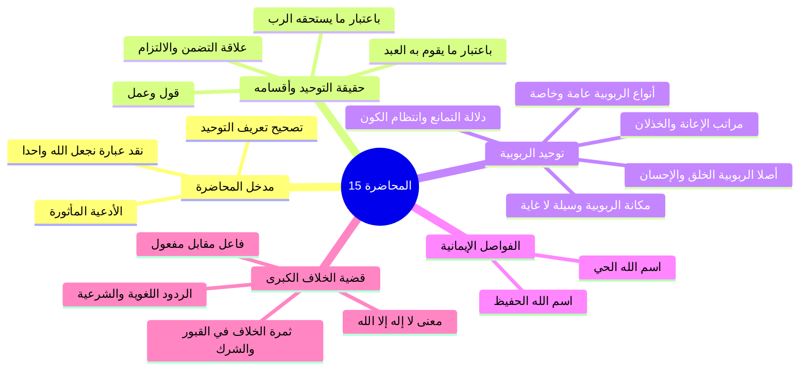

# خطة المحاضرة الخامسة عشرة - حقيقة التوحيد وأقسامه ومكانة الربوبية ومعنى لا إله إلا الله

> [!info] الهدف
> تلخيص وشرح تفريغ «المحاضرة 15 زاد عقيدة» في مادة العقيدة (المستوى الأول) وفق بروتوكول التلخيص الشامل، وعرضها في ملفات أجزاء مستقلة ومترابطة، مع ملف مجمع نهائي، وملخص مراجعة سريعة، وأسئلة مراجعة واختبار ذاتي، وخطة تطبيقية للدروس.

---

## 🗺️ خريطة الأجزاء والعناوين

| # | العنوان والملف | المدى المرجعي بالتفريغ | المحتوى العلمي الرئيسي |
|:---:|:---|:---:|:---|
| 00 | [[00 - مقدمة وخطة الأجزاء وعناصر المحاضرة]] | الأسطر 1–14 | الافتتاح والأدعية المأثورة، مراجعة تعريف التوحيد لغة وشرعاً، إبطال عبارة «نجعل الله واحداً»، وإعلان موضوع المحاضرة ومحاور معنى «لا إله إلا الله». |
| 01 | [[01 - حقيقة التوحيد وأقسامه وعلاقة التضمن والالتزام]] | الأسطر 15–49 | حقيقة التوحيد (قول وعمل للقلب واللسان والجوارح)، أقسام التوحيد باعتبار ما يستحقه الرب وما يقوم به العبد، تمثيل الدوائر الثلاث، سورة الإخلاص. |
| 02 | [[02 - فاصل اسم الله الحفيظ وحفظه العام والخاص]] | الأسطر 50–63 | اسم الله الحفيظ، الحفظ من الأخطار الظاهرة والخفية (7000 نوع من الجراثيم، المعقبات، حفظ السماوات والأرض)، حفظ الأولياء، وثمار الإيمان بالحفيظ. |
| 03 | [[03 - أصلا توحيد الربوبية وأنواع ربوبية الله لخلقه]] | الأسطر 64–79 | أصلا الربوبية: عموم الخلق والربوبية، وعموم الإحسان والحكمة؛ أدلة القرآن (طه: 50، السجدة: 7، الفاتحة)، والربوبية والتربية العامة والخاصة. |
| 04 | [[04 - مراتب إعانة الله للمكلفين قبل الفعل ومعه والخذلان]] | الأسطر 80–104 | إعانة الله وفق عدله قبل الفعل (القدرة، الإرادة، العقل، الفطرة، الشرع) وعذر الفاقد، إعانة الله وفق حكمته مع الفعل (شرح الصدر، مضاعفة القوة، حديث الولي)، ومرتبة الخذلان وانتكاس الفطر. |
| 05 | [[05 - دلالة التمانع وانتظام الكون ومكانة توحيد الربوبية]] | الأسطر 105–124 | دلالة التمانع (المؤمنون: 91)، انتظام الأفلاك والكون، مكانة توحيد الربوبية (فطري وركن)، كونه وسيلة لا غاية، وعدم كفايته للنجاة دون توحيد الألوهية (البقرة: 21). |
| 06 | [[06 - فاصل اسم الله الحي وثمار الإيمان به والدعاء بالاسم الأعظم]] | الأسطر 125–141 | حقيقة الموت، اسم الله الحي وحياته الكاملة المستلزمة لجميع صفات الكمال (كلام ابن القيم)، ثمار الإيمان بالحي: الدعاء والاستغاثة («يا حي يا قيوم»)، التوكل، التوسل بالاسم الأعظم، والزهد في الدنيا. |
| 07 | [[07 - تحرير معنى لا إله إلا الله وثمرة الخلاف بين الطائفتين]] | الأسطر 142–185 | تحرير معنى «لا إله إلا الله»: هل هي «لا خالق إلا الله» (فاعل) أم «لا معبود بحق إلا الله» (مفعول)؟ ثمرة الخلاف العملية عند القبور (الدعاء، الذبح، النذر، الاستغاثة)، وحجج الفريقين. |
| 08 | [[08 - الأدلة اللغوية والشرعية على أن الإله هو المألوه المعبود]] | الأسطر 186–205 | التحكيم لكتاب الله وسنة نبيه ولغة العرب، بطلان إله بمعنى فاعل، شواهد المعاجم (ابن فارس والجوهري وقراءة ابن عباس ﴿ويذرك وإلهتك﴾)، إبطال لازم الخصم، والتكليف البحثي لآيات التوحيد. |

---

## 📚 الملفات الإضافية الملحقة بالحزمة

- [[ملخص المراجعة السريعة]] — ملخص مكثف للمفاهيم والقواعد والضوابط العقدية لجلسات المذاكرة المركزة قبل الاختبارات.
- [[أسئلة المراجعة والاختبار الذاتي]] — بنك أسئلة تدريبية واختبارات ذاتية شاملة بنظام الإخفاء والإظهار (`details`).
- [[المحاضرة 15 - حقيقة التوحيد ومعنى لا إله إلا الله - ملف مجمع]] — الملف المجمع الشامل الذي يضم كامل محتوى الأجزاء ونصوص المتحدث كاملة بالنص دون أسئلة أو ملخص سريع.
- [[10 - خطة تطبيق الدروس]] — خطة تنفيذية مرتبة في مراحل ومربعات اختيار لتحويل المعارف العقدية إلى مسار سلوكي وقلبي وتطبيقي.

---

> [!note] إحصائيات الحزمة
> - **إجمالي ملفات الأجزاء:** 9 أجزاء (من الجزء 00 حتى 08).
> - **الملفات الإضافية:** 4 ملفات (ملخص، اختبار، مجمع، خطة تطبيق).
> - **إجمالي ملفات العمل المنجزة:** 13 ملفاً مستقلاً.

---

## 📝 الملخص العلمي المنظم للجزء 00

### 1. الافتتاح والأدعية المأثورة
- افتتح المحاضر بالحمد لله والصلاة والسلام على رسول الله محمد ﷺ، والدعاء المأثور:
  ا - «اللهم إنا نسألك علماً نافعاً، وعملاً صالحاً، وقلباً خاشعاً، ولساناً ذاكراً».
  ا - «اللهم علمنا ما ينفعنا، وانفعنا بما علمتنا، واجعله حجة لنا ولا تجعله حجة علينا يا رب العالمين».

### 2. مراجعة تعريف التوحيد لغة وشرعاً وتصحيح العبارات الخاطئة
- **التوحيد لغة:** يدور معناه حول الإفراد والانفراد وعدم وجود المثل والنظير.
- **التنبيه العقدي الحاسم:**
  - هل يصح أن نقول في تعريف التوحيد شرعاً: «هو أن نجعل الله واحداً فيما هو واحد فيه»؟
  - **الجواب:** هذا تعبير خاطئ باطل؛ لأن وحدانية الله عز وجل ثابتة له بذاته أزلاً وأبداً، وليست بجعل جاعل، فليست الآلهة متعددة حتى نأتي نحن البشر فنجعل الإله واحداً، بل التوحيد شرعاً هو الإقرار والاعتقاد والعلم والإيمان بأن الله واحد في ربوبيته وألوهيته وأسمائه وصفاته.

### 3. إعلان محاور المحاضرة الخامسة عشرة
- ربط توحيد الربوبية بكلمة الشهادة: «لا إله إلا الله».
- طرح الإشكالية الكبرى التي ستعالجها المحاضرة:
  - هل معنى كلمة الشهادة: «لا خالق إلا الله» أو «لا رازق إلا الله»؟
  - أم معناها: «لا معبود بحق إلا الله»؟
  - وما هي الثمرة المترتبة على هذا الخلاف بين طوائف الأمة؟

---

## 🧭 خريطة المفاهيم الذهنية (Mindmap)

---

## 🔍 المراجعة الداخلية (5 أسئلة تحقق سريعة)

1. **س:** ما معنى التوحيد في اللغة؟
   - **ج:** يدور حول الإفراد والانفراد وعدم وجود المثل والنظير.
2. **س:** لماذا يُعد قول بعضهم «التوحيد شرعاً هو أن نجعل الله واحداً» تعبيراً باطلاً؟
   - **ج:** لأن وحدانية الله ثابتة أزلاً وأبداً بذاته وليست بجعل جاعل؛ فليس هناك آلهة متعددة ليجعلها العبد واحدة، بل الواجب الاعتقاد والإقرار بأن الله واحد.
3. **س:** ما التعريف الشرعي المنضبط للتوحيد؟
   - **ج:** هو الإيمان والإقرار والاعتقاد والعلم بأن الله واحد في ربوبيته لا رب سواه، وألوهيته فلا مستحق للعبادة إلا هو، وأسمائه وصفاته فلا ند له فيها ولا نظير.
4. **س:** ما السؤال المحوري الذي افتتح به المحاضر موضوع درسه الجديد؟
   - **ج:** ما معنى كلمة الشهادة لا إله إلا الله؟ هل معناها لا خالق ولا رازق إلا الله، أم لا معبود بحق إلا الله؟
5. **س:** كيف رتب المحاضر أقسام التوحيد في التمثيل الهندسي؟
   - **ج:** في دوائر ثلاث متداخلة: الربوبية في المركز كدائرة صغرى، والأسماء والصفات كدائرة وسطى، والألوهية كدائرة كبرى محيطة.

---

## 🗣️ نص المتحدث الكامل (من الأسطر 1 إلى 14)

> ويتقدم تقنياته ومجالات طوروا ادواتنا في تقديم العلم الشرعي علمك الاساس في الاسلام
> السلام عليكم ورحمه الله وبركاته
> الحمد لله رب العالمين والصلاه والسلام على اشرف المرسلين محمد وعلى اله وصحبه اجمعين اللهم انا نسالك علما نافعا وعملا صالحا و قلبا خاشعا ولسانا ذاكرا
> اللهم علمنا ما ينفعنا وانفعنا بما علمتنا و اجعله حجه لنا ولا تجعله حجه علينا رب العالمين
> وارحب بكم اخواني من طلاب العلم في اكاديمي اعتزال في ماده العقيده في المستوى الاول
> ارحب بكم في هذا الدرس اجمل ترحيب ايها الاحبه في الله لم سناخذ مراجعه سريعه لما سبق دراسته ثم سناخذ في هذه الحلقه
> موضوع في غايه الاهميه يتعلق بتوحيد الربوبيه من ناحيه
> ما معنى كلمه الشهاده لا اله الا الله
> هل معناها لا خالق الا الله او معناها لا رازق الا الله
> ونبدا من مراجعه اهم الامور التي ينبغي ان نستحضرها قبل ان ندخل في هذا الموضوع الجديد تذكرون ايها الاحبه اخذنا تعريف التوحيد وقلنا التوحيد في اللغه يدور معناه حول الافراد والانفراد وعدم وجود المثل والنظير يدور معناه في اللغه حول الافراد والانفراد وعدم وجود المثل والنظير وقلنا هل يصح ان نقول التوحيد شرعا هو ان نجعل الله واحدا في ما هو واحد فيه اي واحد في ربوبيته والوهيته واسمائه وصفاته هل يصح ان نقول التوحيد شرعا وان نجعل الله واحدا في ربوبيته والوهيته واسمائه وصفاته الجواب خطا هذا التعبير تعبيرا هذا التعبير تعبير خاطئ ان نجعل الله لا وحدانيه الله ليست بجعل جاهل لسنا نحن الذين جعلنا الله واحدا وهو متعدده
> الله عز وجل عن ذلك علوم كثيرا ليست الالهه متعدده
> فنحن جعلنا اله وواحد لا انما نحن نعتقد ان الله واحد نؤمن ان الله واحد هو افراد الله ربوبيته وهو العلم لان الله واحد
> هكذا ان كلمتان نجعل نحن لا هذا خطا
> اذن التوحيد شرعا هو الايمان هو الاقرار والاعتقاد هو العلم بان الله واحد في ربوبيته ولا رب سواه والوهيته فلا مستحق للعباده الايه وفي اسمائه وصفاته فلان ده له فيها ولا نظر هذا معنى التوحيد الشرع

---

## ⏭️ الانتقال التالي
- الانتقال إلى: [[01 - حقيقة التوحيد وأقسامه وعلاقة التضمن والالتزام]]
