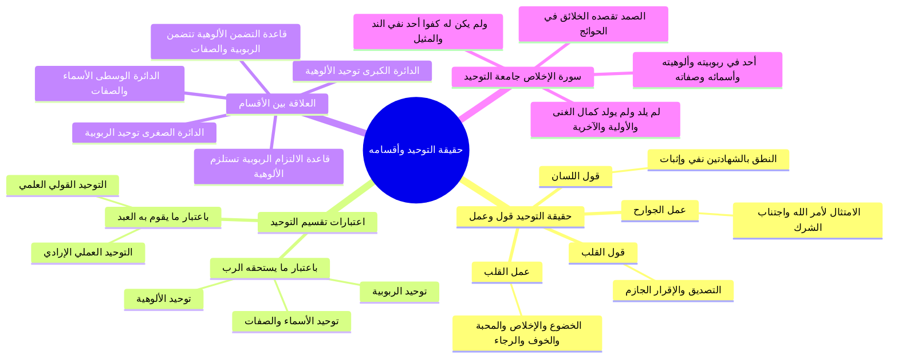

# حقيقة التوحيد وأقسامه وعلاقة التضمن والالتزام

> [!abstract] بطاقة الجزء
> - **المحاضرة:** 15 من مادة العقيدة (المستوى الأول - أكاديمية زاد).
> - **المدى بالتفريغ:** من السطر 15 إلى السطر 49.
> - **المحاور المركزية:** أركان حقيقة التوحيد (قول وعمل للقلب واللسان والجوارح)، اعتبارا تقسيم التوحيد (ما يستحقه الرب وما يقوم به العبد)، علاقة الدوائر الثلاث والتضمن والالتزام، وبيان أوجه التوحيد في سورة الإخلاص.

---

## 🧭 خريطة المفاهيم الذهنية (Mindmap)



---

## 📝 الملخص العلمي المنظم للجزء 01

### 1. حقيقة التوحيد: قول وعمل
- التوحيد عند أهل السنة والجماعة ليس مجرد معرفة عقلية مجردة، بل هو: <span style="color:#0D9488; font-weight:bold;">«قول وعمل»</span> ينتظم أربعة أركان أساسية:
  1. **قول القلب:** هو التصديق الجازم والإقرار بأن الله واحد في ربوبيته وألوهيته وأسمائه وصفاته؛ والدليل قوله تعالى:
     ا - <span style="color:#D97706; font-weight:bold;">﴿يَا أَيُّهَا الرَّسُولُ لَا يَحْزُنكَ الَّذِينَ يُسَارِعُونَ فِي الْكُفْرِ مِنَ الَّذِينَ قَالُوا آمَنَّا بِأَفْوَاهِهِمْ وَلَمْ تُؤْمِن قُلُوبُهُمْ﴾</span> [المائدة: 41].
  2. **عمل القلب:** هو خضوعه لله سبحانه وانقياده له حباً وتعظيماً وخوفاً ورجاءً وتوكلاً ورضا وإخلاصاً تاماً.
  3. **قول اللسان:** النطق بكلمة التوحيد: <span style="color:#0D9488; font-weight:bold;">«أشهد أن لا إله إلا الله»</span>، متضمنة ركني: النفي (نفي استحقاق العبادة عن كل ما سوى الله) والإثبات (إثبات استحقاقها لله وحده).
  4. **عمل الجوارح:** الامتثال التام لأمر الله تعالى؛ فيترجم الإقرار القلبي واللساني عملياً بترك عبادة ما سوى الله، والتوجه بجميع العبادات الظاهرة المشروعة لله وحده.

---

### 2. اعتبارات تقسيم التوحيد المقارنة

| وجه التقسيم | الأقسام المندرجة | دور وموقف المكلف | ما يقابله في التقسيم الآخر |
|:---|:---|:---|:---|
| **باعتبار ما يستحقه الرب جل وعلا** | 1. **توحيد الربوبية:** إفراد الله بأفعاله (الخلق، الملك، التدبير).<br>2. **توحيد الأسماء والصفات:** إفراده بنعوت كماله ونفي الشبيه.<br>3. **توحيد الألوهية:** إفراده بجميع أفعال العباد التعبدية. | **العلم والاعتقاد والإقرار الجازم** بأن الله واحد ومستحق للعبادة وحده لا شريك له. | الربوبية والأسماء والصفات يقابلها: القولي العلمي.<br>الألوهية يقابلها: العملي الإرادي. |
| **باعتبار ما يقوم به العبد المكلف** | 1. **التوحيد القولي العلمي:** العلم بأن الله واحد في ربوبيته وأسمائه وصفاته وقول ذلك باللسان والقلب.<br>2. **التوحيد العملي الإرادي:** إرادة وقصد الله وحده بالعبادة والعمل الصالح وترك ما سواه. | **المعرفة والقول** في الأول، و**القصد والإرادة والعمل الامتثالي** في الثاني. | القولي العلمي يستلزم العملي الإرادي، والعملي الإرادي يتضمن القولي العلمي. |

---

### 3. التمثيل الهندسي (الدوائر الثلاث) وقاعدة التضمن والالتزام

```
         ┌────────────────────────────────────────────────────────┐
         │              الدائرة الكبرى: توحيد الألوهية             │
         │  ┌──────────────────────────────────────────────────┐  │
         │  │           الدائرة الوسطى: الأسماء والصفات          │  │
         │  │  ┌────────────────────────────────────────────┐  │  │
         │  │  │        الدائرة الصغرى: توحيد الربوبية       │  │  │
         │  │  │       (إفراد الله بالخلق والملك والتدبير)    │  │  │
         │  │  └────────────────────────────────────────────┘  │  │
         │  │              (نفي المثيل وإثبات الكمال)          │  │
         │  └──────────────────────────────────────────────────┘  │
         │                (إفراد الله بالعبادة الخالصة)           │
         └────────────────────────────────────────────────────────┘
```

- **قاعدة الالتزام (من الصغرى إلى الكبرى):**
  - من وحّد الله في ربوبيته وأقر بأنه الخالق المدبر، <span style="color:#0D9488; font-weight:bold;">لَزِمَهُ</span> أن يفرده بأسمائه وصفاته (فلا مثيل لمن هذا خلقه).
  - ومن وحّد الله في ربوبيته وأسمائه وصفاته، <span style="color:#0D9488; font-weight:bold;">لَزِمَهُ حتماً</span> أن يفرده بعبادته ولا يشرك معه أحداً.
- **قاعدة التضمن (من الكبرى إلى الصغرى):**
  - توحيد الألوهية هو الدائرة الكبرى المحيطة؛ لذا فهو <span style="color:#0D9488; font-weight:bold;">يَتَضَمَّنُ</span> بالضرورة توحيد الربوبية والأسماء والصفات؛ إذ يستحيل أن يعبد العبد رباً إلا وهو يعتقد أنه خالقه ورازقه ومتصف بنعوت الكمال.
- **التنبيه والتحذير العقدي:**
  - ا - <span style="color:#E11D48; font-weight:bold;">«توحيد الربوبية يستلزم الألوهية ولا يتضمنها؛ فمن أتى بالربوبية وحدها دون التزام الألوهية لم يدخل في الإسلام ولم ينفعه ذلك في النجاة، كحال مشركي قريش»</span>.

---

### 4. معالم التوحيد في سورة الإخلاص
- جمعت سورة الإخلاص أركان التوحيد وأنواعه بأوجز لفظ:
  - ﴿قُلْ هُوَ اللَّهُ أَحَدٌ﴾: أحدٌ في ربوبيته، أحدٌ في ألوهيته، أحدٌ في أسمائه وصفاته.
  - ﴿اللَّهُ الصَّمَدُ﴾: الذي تصمد (تقصد) إليه الخلائق جميعاً في حوائجها، لكونه الغني المطلق والمدبر لكل شيء.
  - ﴿لَمْ يَلِدْ﴾: استغناء تام عن الولد، فهو الآخِر الذي ليس بعده شيء سبحانه.
  - ﴿وَلَمْ يُولَدْ﴾: استغناء تام عن الوالد، فهو الأوَّل الذي ليس قبله شيء.
  - ﴿وَلَمْ يَكُن لَّهُ كُفُوًا أَحَدٌ﴾: نفي مطلق للمثيل والنظير والكفء في الذات والصفات والأفعال، فلا يشبهه شيء من خلقه، ولا يشبه هو شيئاً من خلقه.

---

## 🔍 المراجعة الداخلية (5 أسئلة تحقق سريعة)

1. **س:** ما أركان حقيقة التوحيد الأربعة؟
   - **ج:** قول القلب (التصديق والإقرار)، عمل القلب (الخضوع والإخلاص)، قول اللسان (النطق بالشهادتين نفياً وإثباتاً)، وعمل الجوارح (امتثال الأوامر وترك عبادة غير الله).
2. **س:** ما الآية التي استدل بها المحاضر على أن الإيمان والتوحيد لا يصح بمجرد قول اللسان دون القلب؟
   - **ج:** قوله تعالى: ﴿يَا أَيُّهَا الرَّسُولُ لَا يَحْزُنكَ الَّذِينَ يُسَارِعُونَ فِي الْكُفْرِ مِنَ الَّذِينَ قَالُوا آمَنَّا بِأَفْوَاهِهِمْ وَلَمْ تُؤْمِن قُلُوبُهُمْ﴾ [المائدة: 41].
3. **س:** ما الفرق بين تقسيم التوحيد باعتبار ما يستحقه الرب وباعتبار ما يقوم به العبد؟
   - **ج:** باعتبار ما يستحقه الرب ينقسم إلى ثلاثة (ربوبية، أسماء وصفات، ألوهية)، وباعتبار ما يقوم به العبد ينقسم إلى اثنين (توحيد قولي علمي ويشمل الربوبية والصفات، وتوحيد عملي إرادي ويشمل الألوهية).
4. **س:** أيهما يتضمن الآخر وأيهما يستلزم الآخر: الربوبية أم الألوهية؟
   - **ج:** توحيد الألوهية يتضمن توحيد الربوبية والأسماء والصفات (لأنه الدائرة الكبرى)، بينما توحيد الربوبية يستلزم توحيد الألوهية ولا يتضمنه.
5. **س:** ما معنى اسم الله «الصمد» كما بينه المحاضر في السورة؟
   - **ج:** هو الذي تصمد إليه الخلائق في قضاء حوائجها وتعود إليه وتلجأ إليه في كل ما ينوبها.

---

## 🗣️ نص المتحدث الكامل (من الأسطر 15 إلى 49)

> ثم ايها الاحبه في الله اخذنا حقيقه التوحيد ما هي حقيقه التوحيد قلنا حقيقه التوحيد ايها الاحبه ان التوحيد قول وعمل
> هذا في غايه الاهميه ان يعرف التوحيد قول وعمل قول القلب وعمل القلب وقول اللسان وعمل الجوارح القلب يقول نعم يقول القلب بقوله هو التصديق والاقرار يا ايها الرسول لا يحزنك الذين يسارعون في الكفر من الذين قالوا امنا بافواههم ولم تؤمن قلوبهم
> يعني و لم يقولوا ذلك بقلوبهم
> فلابد من قول القلب في التوحيد ان يصدق القلب ويقر القلب بان الله جل جلاله واحد في ربوبيته وصفاته هذا قول القلب وعمل القلب هو خضوعه لله هذا الواحد خضوعه لل احب ان خوفا ورجاء وتوكلا ورضا ويقينا خضوع القلب و اخلاصه لله جل جلاله
> الخضوع والاخلاص
> هذا عمل القلب وقول اللسان هو النطق بالشهادتين
> قول اللسان يتضمن النفي والاثبات نفى جميع المعبودات واثبات استحقاق العباده لله وحده فيقول بلسانه
> اشهد ان لا اله الا الله
> و يعمل بجوارحه والمقصود بعمل الجوارح هو الامتثال لما اقر به بقلبه وعمل بقلبه وقاله بلسانه فيمتد بجوارحه لمقتضى لا اله الا الله
> فيترك عباده كل ما سوى الله ويعبد الله وحده لا شريك له بما شرع عمل الجوارح وان يقول انا التزم امتثال ما شرع الله سبحانه وتعالى بترك عبادته كل ما سوى الله والتوجه بالعباده المشروع لله وحده لا شريك له
> هكذا يصبح الانسان موحدا هذه تسمى حقيقه التوحيد
> ثم ايها الاحبه في الله اخذنا ما يتعلق باقسام التوحيد وقلنا التوحيد ينظر اليه من جهته من جهه ما يستحق وهي الرب بدور العبد هنا هو العلم دور العبد في جهه في اتجاه اقسام التوحيد من جهه ما يستحق والرب هو العلم العلم بان الله واحد في ربوبيته والوهيته واسمائه وصفاته فالتوحيد من جهه ما يستحق والرب ثلاثه انواع ربوبيه والوهيه واسماء وصفات فيعتقد الانسان بان الله جل جلاله هو المنفرد بالخلق والملك والتدبير وانه سبحانه وتعالى لا مثيل له ولا نظير له في ذاته واسمائه وصفاته وافعاله وانه هو المستحق وحده بالعباده لا شريك له
> هذا ما يستحقه الرب الرب واحد في بيته في اسمائه وصفاته وهو مستحق وحده لان يعبد لكونه المنفرد من الخلطه الملكيه اقسام التوحيد من جهه ما يستحقها الرب
> من جهه من جهه ما يقوم به العبد ماذا يقول العبد العبد يقول ويعلم ويقصد ويريد ولذلك يسمى التوحيد من جهه ما يقوم به العبد توحيد القول علمي القول العلمي ان يعلم الانسان ان الله سبحانه وتعالى واحد ويقول ذلك من لسانه وقلبه هذا التوحيد قولي علمي يعلم العبد بان الراحه سبحانه وتعالى واحد في ربوبيته والوهيته واسمائه وصفاته وهذا التوحيد يعلنه بلسانه ف يقوله قولي علمي
> ويمكن ان يكون قول المقصود به يعني قول القلب تصديقه اقراره والعلم يعلم القلب ان الله سبحانه وتعالى واحد حتى يكون يعني كله يعني قلبه فهو قول علمه الامر الثاني عمل اراده فيقصد الانسان من علم انه هو المنفرد بالخلق والملك والتدبير علما ان الله هو المنفرد بالخلق اولمرت والرزق والتدبير وانها لا مثلنا باسمائه وصفاته وانه هو المستحق للعباده وحده لا شريك له
> هذا قالها اقل من وعلمه بقلبه بعد ذلك يعمل ويريد ما اقر به بقلبه يسمى التوحيد العمل الاراده فيترك عباده كل ما سوى الله
> ويتوجه بالعباده لله وحده لا شريك له
> كما تلاحظون يا اخوان هي تؤدي نفس المعنى الربوبيه والاسماء والصفات يقابلها التوحيد القول العلمي توحيد الالوهيه يقابله التوحيد العملي العراقي بعد ذلك يا اخوان تعرضنا للتعريف انواع التوحيد
> فقلنا توحيد الربوبيه من كلمه الرب منفرد الله بربوبيته لهذا العالم دائما نتذكر في تعريف توحيد الربوبيه عموميه الله ان الله هو صاحب هذا العام هو سيد هذا العالم
> وخالق هذا العالم
> فتوحيد الربوبيه وافراد الله بربوبيته لهذا العالم فهو افراد الله بالخلق والملك والتدبير هذا يسمى توحيد الربوبيه وتوحيد الالوهيه من كلمه ال وهي التالف هو افراد الله بالتالي بالتالي هو التعبد وتوحيد اليها افراد الله بالعباده كل ما ثبت في الكتاب والسنه من قولا وفعلا ظاهرا وباطنا انه عباده التوجه والتوجه به لله وحده لا شريك له هذا هو التوحيد وصرف نوع من انواع العباده لغير الله
> هذا هو الشرك والتنديد هذا توحيد العباد افراد والله بالت ا لله التعبد الصفات واضح افراد والله ب ما ثبت لهم من الاسماء والصفات الفعل في الكتاب والسنه ان نثبت ان الله سبحانه وتعالى لهم في ذلك ولا نظير اقسام التوحيد هذه الاقسام الثلاثه التي ذكرناها من العلاقه بينهم العلاقه بينها
> يعني كمان يعني تشاهدون على الشاشه او عندكم مذكرا ان توحيد الدائره الكبرى في وسطها توحيد الربوبيه اصغر توحيد الاسماء والصفات او يمكن بالنسبه لتحديد الرويه توحيد الاسماء والصفات ان نجعل توحيد الربوبيه هو الدائره الصغرى بعد ذلك توحيد الصف 8
> بعد ذلك توحيد الالوهيه
> وهذا قد يكون هو افضل يعني تقريبا توحيد رموا بافراد الله بالخلق والملك والتدبير يلزم منه ان الله لا مثيل لها وفي صفاته فتوحيد الربوبيه يلزم منه توحيد الصف 8
> و توحيد الرؤيه وتوحيد الصفات يلزم منه توحيد الالوهيه
> فكانت توحيد الدائر الكبرى الدائره الكبرى و توحيد الالوهيه يتضمن توحيد الصفات وتوحيد الربوبيه
> اما توحيد الربوبيه
> الصفات فانه لا يتضمن توحيد الالوهيه انما يستلزم هذه العلاقه العيد مره اخرى
> تخيلوا امامكم ثلاثه دوائر الدائره الصغرى توحيد الربوبيه من اتى بتوحيد الربوبيه يلزم منه ان يتوسع فياتي بتوحيد الصفات يلزم منه توحيد الصومال توحيد الربوبيه و توحيد اصلا تلزم منهم توحيد الالوهيه توحيد الكبرى فقط فقط تضمن ذلك توحيد الصفات وتوحيد الربوبيه هذه العلاقه بين اقسام التوحيد من جهه الالتزام والتضامن كيف نعرف بالله سبحانه وتعالى دائما نحن نستحضر التعريف بالم نتذكر هذه الثلاثه الكلمات الربوبيه الصفات الوهيه نقول ان الله سبحانه وتعالى الذي نعبده نحن المسلمون هو المنفرد بالخلق والملك والتدبير هو الذي ليس كمثله شيء في ذاته ولا في اسمائه ولا في صفاته من الحياه والسمع والبصر
> لا ما نذكر هذا ليس كمثله شيء وهو السميع البصير هذا توحيد الصف 8
> وان هذا ال ال ه هو المستحق وحده للعماده لذلك قال الله عنهم بنفسه هو الله احد احد في ربوبيته احدهم في الوهيته احد في الاسماء والصفات الصمد الذي يصمد للخلائق في قضاء حوائجها وتعود اليه الخلائق في طلب حوائجها الصمد هذا الاله لم يرد لكونه مستغن عن الولد سبحانه وتعالى فهو الاخر الذي ليس بعده شيء لم يولد لكون مستغن عن ال واردف هو الاول الذي ليس قبله شيء
> ولم يكن له كفوا احد هذا الاله الذي نعبده مثل السماء مثلا الارض مثل الشمس مثل القمر مثلا البشر مثل الشجر لم يكن له كفوا احد لا يمكن ان يكون الله مثل شيء من مخلوقاته او يكون هناك شيء من مخلوقات الله مثل الله سبحانه وتعالى
> ناخذ فاصل ثم
> لكن بمشيئه الله

---

## 🔗 روابط التنقل
- السابق: [[00 - مقدمة وخطة الأجزاء وعناصر المحاضرة]]
- التالي: [[02 - فاصل اسم الله الحفيظ وحفظه العام والخاص]]
