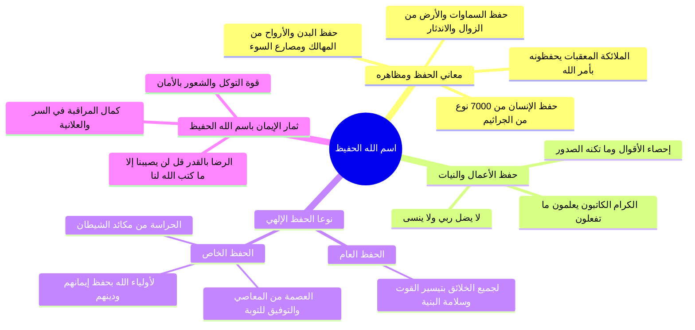

# فاصل اسم الله الحفيظ وحفظه العام والخاص

> [!abstract] بطاقة الجزء
> - **المحاضرة:** 15 من مادة العقيدة (المستوى الأول - أكاديمية زاد).
> - **المدى بالتفريغ:** من السطر 50 إلى السطر 63.
> - **المحاور المركزية:** معاني اسم الله «الحفيظ»، حفظ الأبدان والأنفس من الأخطار المحيطة (الجراثيم والمعقبات)، حفظ السماوات والأرض، نوعا الحفظ الإلهي (عام وخاص)، وثمار معرفة الحفيظ في المراقبة والتوكل والرضا بالقدر.

---

## 🧭 خريطة المفاهيم الذهنية (Mindmap)

---

## 📝 الملخص العلمي المنظم للجزء 02

### 1. معاني اسم الله «الحفيظ» ومظاهر حفظه لخلقه
- **الحفيظ:** هو الذي يحفظ عباده من المهالك والمعاطب ويقيهم مصارع السوء، وتلك الأخطار لو سُلّطت على الإنسان لأهلكته في لحظة:
  - **حفظ الأبدان بالمعقبات:** قيّض الله للإنسان ملائكة يتعاقبون عليه ليلاً ونهاراً؛ قال تعالى:
    ا - ﴿لَهُ مُعَقِّبَاتٌ مِّن بَيْنِ يَدَيْهِ وَمِنْ خَلْفِهِ يَحْفَظُونَهُ مِنْ أَمْرِ اللَّهِ﴾ [الرعد: 11]، أي بأمر الله يحفظون روحه وبدنه من كل سوء يراد به.
  - **حفظ الكون العظيم:** هو ممسك السماوات والأرض أن تزولا، ولا يثقله أو يعجزه حفظ هذا الوجود:
    ا - ﴿وَلَا يَئُودُهُ حِفْظُهُمَا وَهُوَ الْعَلِيُّ الْعَظِيمُ﴾ [البقرة: 255].
  - **آية مذهلة في حفظ الصحة والحياة:** أثبت العلم أن الإنسان يعيش في منزله محاطاً بنحو (7,000) نوع من الجراثيم والميكروبات، لا يراها ولا يشعر بها، والله يكلؤه ويحفظه منها على الدوام:
    ا - ﴿قُلْ مَن يَكْلَؤُكُم بِاللَّيْلِ وَالنَّهَارِ مِنَ الرَّحْمَٰنِ﴾ [الأنبياء: 42].
  - **حفظ الأعمال والنيات:** يحصي الله على الخلق أقوالهم وأفعالهم ونواياهم وما تُخفي صدورهم:
    ا - ﴿وَإِنَّ عَلَيْكُمْ لَحَافِظِينَ * كِرَامًا كَاتِبِينَ * يَعْلَمُونَ مَا تَفْعَلُونَ﴾ [الانفطار: 10–12].

---

### 2. المقارنة بين الحفظ العام والحفظ الخاص

| وجه المقارنة | الحفظ العام | الحفظ الخاص |
|:---|:---|:---|
| **المشمولون به** | جميع الخلائق والمخلوقات (المؤمن والكافر، والبر والفاجر، والمكلف وغير المكلف، والحيوان والطير). | أولياء الله وعباده المؤمنون المتقون خاصة. |
| **مجال الحفظ** | تيسير أسباب المعيشة والأقوات، وسلامة البنية والأجهزة الحيوية، ودفع الهلاك الدنيوي العام لحين انقضاء الأجل. | حفظ الدين والإيمان واليقين، وحفظ القلوب من الشبهات والشهوات. |
| **كيفية إجرائه** | وفق القوانين الكونية والسنن الطبيعية ورعاية الأبدان. | بعصمتهم من الوقوع في الموبقات، وتوفيقهم للمبادرة بالتوبة إن زلوا، وحراستهم من مكائد الشيطان وفتنته. |
| **الدليل والأثر** | ﴿قُلْ مَن يَكْلَؤُكُم بِاللَّيْلِ وَالنَّهَارِ مِنَ الرَّحْمَٰنِ﴾. | «احْفَظِ اللَّهَ يَحْفَظْكَ»، ﴿قَالَ لَا يَضِلُّ رَبِّي وَلَا يَنسَى﴾. |

---

### 3. ثمرات الإيمان باسم الله الحفيظ في سلوك العبد
1. **دوام المراقبة لله:** من أيقن أن الله حفيظ عليم بأقواله وأفعاله وخواطر قلبه، راقبه في خلواته وجلواته وفي سره وعلانيته.
2. **عظم التوكل والأمان النفسي:** زوال الهلع والخوف من المستقبل والأعداء؛ لعلم العبد أنه في كنف الحفيظ ورعايته.
3. **الرضا المطلق بالقضاء والقدر:** اليقين بأن ما أصابه لم يكن ليخطئه، وما أخطأه لم يكن ليصيبه؛ كما قرر القرآن العظيم:
   ا - ﴿قُل لَّن يُصِيبَنَا إِلَّا مَا كَتَبَ اللَّهُ لَنَا هُوَ مَوْلَانَا ۚ وَعَلَى اللَّهِ فَلْيَتَوَكَّلِ الْمُؤْمِنُونَ﴾ [التوبة: 51].

---

## 🔍 المراجعة الداخلية (5 أسئلة تحقق سريعة)

1. **س:** ما معنى قول الله تعالى: ﴿وَلَا يَئُودُهُ حِفْظُهُمَا﴾؟
   - **ج:** أي لا يثقله ولا يجهده ولا يشق عليه حفظ السماوات والأرض وما فيهما لعظمته وكمال قدرته.
2. **س:** ما المثال العلمي المعاصر الذي ذكره المحاضر دلالةً على حفظ الله للإنسان دون أن يشعر؟
   - **ج:** وجود ما يقارب 7,000 نوع من الجراثيم تعيش مع الإنسان في مسكنه، والله يكلؤه ويعافيه منها بفضله.
3. **س:** ما وظيفة الملائكة المعقبات المذكورة في سورة الرعد؟
   - **ج:** يحفظون الإنسان بأمر الله من بين يديه ومن خلفه في بدنه وروحه من المكاره، ويسجلون عليه أعماله.
4. **س:** ما أعظم تجليات «الحفظ الخاص» لأولياء الله؟
   - **ج:** حفظ دينهم وإيمانهم، وعصمتهم من مواقع الذنوب، وتوفيقهم للتوبة العاجلة إن وقعوا في خطيئة، وحمايتهم من مكائد إبليس.
5. **س:** ما الآية التي يستشعر بها المؤمن ثمرة التوكل واليقين في كنف الحفيظ عند نزول الأقدار؟
   - **ج:** قوله تعالى: ﴿قُل لَّن يُصِيبَنَا إِلَّا مَا كَتَبَ اللَّهُ لَنَا هُوَ مَوْلَانَا وَعَلَى اللَّهِ فَلْيَتَوَكَّلِ الْمُؤْمِنُونَ﴾.

---

## 🗣️ نص المتحدث الكامل (من الأسطر 50 إلى 63)

> هل تشعر بكميه الاخطار المحيطه بك من حولك كم يصرفها الله عنك و انت لا تدري
> تلك الاخطار لو سلطت عليك اهلكت لولا الله الح في فهو الذي يحفظ عبده من المهالك والمعاطب ويقيم مصارع السوء
> له معقبات من بين يديه ومن خلفه يحفظونه من امر الله ان يحفظون بامر الله بدنه وروحه من كل من يريده بسوء ويحفظون عليه اعماله وهم ملازمون له دائما وهو الذي يحفظ السماوات والارض
> فلا تزول ان ولا تندثر ان ولا يؤوده حفظهما وهو العلي العظيم
> وقد ثبت علميا اننا نعيش مع سبعه الاف نوع من الجراثيم في منازلنا
> ونحن لا نشعر بها
> والله يحفظنا منها قل من يكلؤكم بالليل والنهار من الرحمن
> هل يحفظكم احد غيره لا حافظ ال اه وهو الذي يحفظ على الخلق اعمالهم
> ويحصل عليهم اقوالهم ويعلم ونياتهم وما تكون صدور ام
> ولا تغيب عنه غائبه ولا تخفى عليه خافيه ويرسل ملائكته لحفظ اعمال العباد وتسجيلها عليهم
> قال تعالى وان عليكم لحافظين كراما كاتبين يعلمون ما تفعلون ويحفظ او ياءه ف يعصمهم عن مواقعه البنود فان وضعوا في شيء منها وفقهم للتوبه ويحرسهم من مكائد الشيطان يسلموا من شره وفتنته وحفظ الله تعالى لخلقه نوعان عام وخاص فالعام لجميع المخلوقات
> بتيسيره لها ما يقيدها ويحفظ بنيتها والخاص لاوليائه بحفظهم عم ايضا ايمانهم وهو الحزب الذي لا يغفل ولا ينسى ولا يغيب شيء عن علميه لا يضل ربي ولا ينسى
> من علم ان الله هو الحفيظ مراقبه في الاقوال والاعمال في السر والعلانيه ومن علم ان الله هو الحثيث توكل عليه وامان لحفظه وكلاءته وامن بقضائه وقدره
> قال تعالى قل لن يصيبنا الا ما كتب الله لنا هو مولانا وعلى الله فليتوكل المؤمنون

---

## 🔗 روابط التنقل
- السابق: [[01 - حقيقة التوحيد وأقسامه وعلاقة التضمن والالتزام]]
- التالي: [[03 - أصلا توحيد الربوبية وأنواع ربوبية الله لخلقه]]
