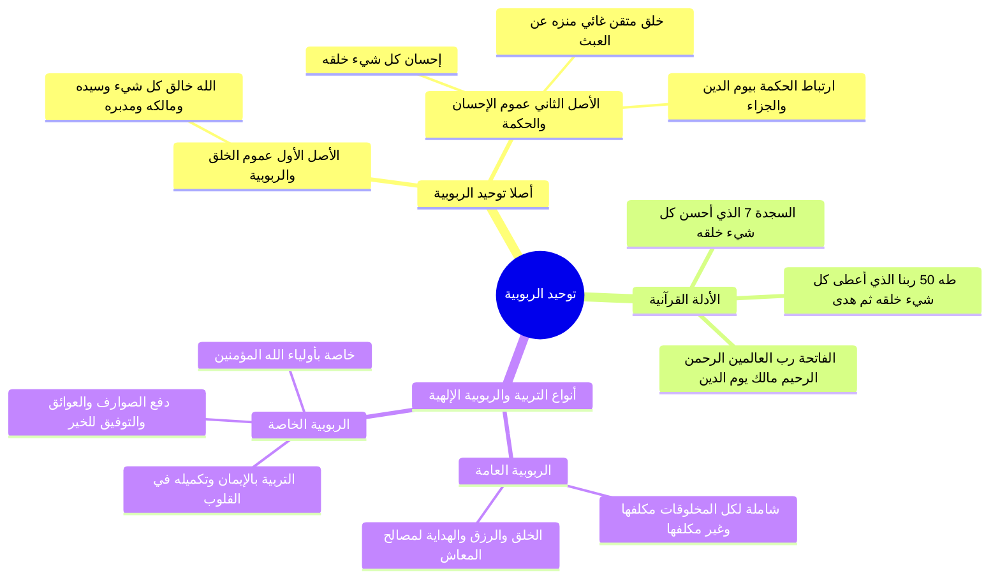

# أصلا توحيد الربوبية وأنواع ربوبية الله لخلقه

> [!abstract] بطاقة الجزء
> - **المحاضرة:** 15 من مادة العقيدة (المستوى الأول - أكاديمية زاد).
> - **المدى بالتفريغ:** من السطر 64 إلى السطر 79.
> - **المحاور المركزية:** ركيزتا توحيد الربوبية (عموم الخلق، وعموم الإحسان والحكمة)، الشواهد القرآنية على إتقان الصنع ونفي العبث، والفرق الدقيق بين الربوبية والتربية العامة والخاصة.

---

## 🧭 خريطة المفاهيم الذهنية (Mindmap)

---

## 📝 الملخص العلمي المنظم للجزء 03

### 1. أصلا توحيد الربوبية
- يرتكز توحيد الربوبية (المأخوذ من «الرب»: وهو السيد المالك المدبر المنفرد بربوبيته لهذا العالم) على أصلين قطعيين:
  1. **الأصل الأول: عموم خلقه وربوبيته جل جلاله:**
     - الاعتقاد الجازم بأن كل ما سوى الله في هذا الكون مخلوق مربوب، وأن الله سبحانه: «خالق كل شيء، وربه، ومليكه، ومدبره وحده».
  2. **الأصل الثاني: عموم إحسانه وحكمته في خلقه:**
     - الاعتقاد بأن الله لم يخلق هذا العالم سدى ولا عبثاً، بل خلقه بأعلى درجات الحكمة والعدل والإحسان، وركب فيه الغايات المحمودة؛ واستدل المحاضر بشواهد محكمة:
       ا - ﴿قَالَ فَمَن رَّبُّكُمَا يَا مُوسَىٰ * قَالَ رَبُّنَا الَّذِي أَعْطَىٰ كُلَّ شَيْءٍ خَلْقَهُ ثُمَّ هَدَىٰ﴾ [طه: 49–50].
       ا - ﴿الَّذِي أَحْسَنَ كُلَّ شَيْءٍ خَلَقَهُ ۖ وَبَدَأَ خَلْقَ الْإِنسَانِ مِن طِينٍ﴾ [السجدة: 7].
       ا - سورة الفاتحة: ﴿الْحَمْدُ لِلَّهِ رَبِّ الْعَالَمِينَ * الرَّحْمَٰنِ الرَّحِيمِ * مَالِكِ يَوْمِ الدِّينِ﴾؛ فجمع بين الربوبية والرحمة والحكمة المقتضية ليوم الدين والجزاء العادل، تنزيهاً لأفعاله عن اللغو والباطل.

---

### 2. أنواع ربوبية الله وتربيته لخلقه

| وجه المقارنة | الربوبية (التربية) العامة | الربوبية (التربية) الخاصة |
|:---|:---|:---|
| **النطاق والشمول** | عامة لجميع المخلوقات في السماوات والأرض (الإنسان والجان، والحيوان، والجماد، المؤمن والكافر). | خاصة بعباد الله المؤمنين وأوليائه الصالحين. |
| **مضمون التربية** | الإيجاد من العدم، والإمداد بالأرزاق، وتسخير الأقوات، والهداية الفطرية لكيفية استخدام الجوارح والبقاء مدة الأجل المقدر. | التربية على معاني الإيمان واليقين، وتثبيت التوحيد، وتزكية النفوس، وتكميل خصال البر والتقوى. |
| **دفع الموانع** | دفع ما يهلك الجسد قبل انقضاء الأجل المكتوب. | دفع الصوارف والشبهات والشهوات والعوائق الصادة عن الاستقامة. |
| **الثمرة الأخروية** | لا تقتضي النجاة في الآخرة بمجردها إن خلت من الإيمان. | تثمر الفلاح التام والسعادة الأبدية ودخول الجنان. |

---

## 🔍 المراجعة الداخلية (5 أسئلة تحقق سريعة)

1. **س:** ما الأصلان اللذان يقوم عليهما توحيد الربوبية؟
   - **ج:** 1) عموم خلقه وربوبيته لكل شيء في الكون، 2) عموم إحسانه وحكمته في تدبيره وتنزيهه عن العبث.
2. **س:** كيف استدل موسى عليه السلام على ربوبية الله أمام فرعون؟
   - **ج:** بقوله: ﴿رَبُّنَا الَّذِي أَعْطَىٰ كُلَّ شَيْءٍ خَلْقَهُ ثُمَّ هَدَىٰ﴾ [طه: 50]؛ أي أعطى كل كائن صورته اللائقة به ثم هداه لما يصلحه.
3. **س:** ما وجه الربط بين صفة الربوبية وقوله تعالى: ﴿مَالِكِ يَوْمِ الدِّينِ﴾ في سورة الفاتحة؟
   - **ج:** لأن الرب الحكيم الذي أحسن كل شيء خلقه لا يترك عباده عبثاً دون حساب وجزاء، فكان يوم الدين من مقتضيات حكمته وربوبيته.
4. **س:** ما المقصود بالهداية في إطار «الربوبية العامة»؟
   - **ج:** هداية المخلوقات إلى مصالح معاشها واستخدام خلقتها وجوارحها للبقاء حتى ينتهي أجلها المقدر.
5. **س:** بمَ تتميز «الربوبية الخاصة» لأولياء الله تعالى؟
   - **ج:** بتربيتهم على الإيمان، وتكميله في صدورهم، وتوفيقهم لكل خير، ودفع صوارف الضلال والفتن عنهم.

---

## 🗣️ نص المتحدث الكامل (من الأسطر 64 إلى 79)

> حياكم الله ايها الاحبه ننتقل الى تعريف توحيد الربوبيه وتوحيد الربوبيه قلنا من كلمه الرب الصاحب السيد فتوح يدرب افراد الله جل جلاله
> بربوبيته لهذا العالم توحيد الربوبيه يقوم ايها الاحبه على اصلين الاصل الاول عموم خلقه سبحانه وتعالى عموم خلقه وربوبيته توحيد الربوبيه يرتكز على عشرين اثنين الاصل الاول ان كل ما في هذا الكون مخلوق لله جل جلاله
> الله خالق كل شيء وهو رب كل شيء وخالقه صاحبه وسيده ومالك ومدمره هذا الاصل الاول الذي يقوم على توحيد الربوبيه عموم الخلق والربوبيه الاصل الثاني عموم الاحسان والحكمه في خلقه جل جلاله
> لهذا الكون فهو محسن له ومحكمه الحمد لله رب العالمين
> قال الرحمان الرحيم
> الذي اعطى كل شيء خلقه ثم هدى
> قال فمن ربكما يا موسى قال ربنا الذي اعطى كل شيء خلقه ثم هدى هذا الحكمه والاحسان في خلق الله سبحانه وتعالى
> الذي احسن كل شيء خلقه وبدا خلق الانسان من طين
> الحمد لله رب العالمين الرحمان الرحيم مالك يوم الدين
> فالله سبحانه وتعالى احسن مخلوقاته و خلقها حكمته لذلك هناك يوم الدين يوم الحساب يوم الجزاء ليس هذا الخلق وعبثا لم يخلق الله سبحانه وتعالى شيئا عبثا جل جلاله
> هذه الاصول التي يقوم عليها توحيد الربوبيه انواع تنميه الله سبحانه وتعالى الى خلقه نوعان
> نوعا ما بنوع خاص
> اما العام فهو تربيه الله لخلقه من ناحيه الخلق خلق هذه المخلوقات ورزقهم وهداهم سبحانه وتعالى لكيفيه استخدام الخلقه التي خلقهم و خلقهم عليها المده التي اراد الله سبحانه وتعالى بقائهم في هذه الدنيا هذه هدايه عامه هدايه عامه لجميع المخلوقات مكلف ها وغير مكلفه
> وهناك هدايه خاصه خاصه باوليائه سبحانه وتعالى هداهم باهم او هنا نتحدث عن التربيه رباهم الله سبحانه وتعالى من الايمان ووفقهم له وكم له في نفوسهم
> ودفع الصوارف والعوائق الحاله بينهم وبين هذا الايمان
> وهذه حقيقه التربيه التوفيق لكل خير

---

## 🔗 روابط التنقل
- السابق: [[02 - فاصل اسم الله الحفيظ وحفظه العام والخاص]]
- التالي: [[04 - مراتب إعانة الله للمكلفين قبل الفعل ومعه والخذلان]]
