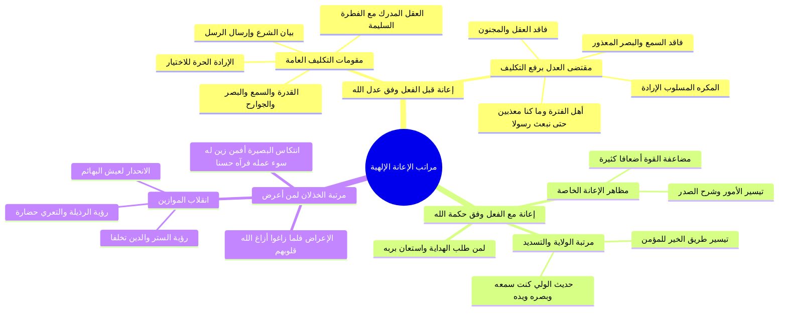

# مراتب إعانة الله للمكلفين قبل الفعل ومعه والخذلان

> [!abstract] بطاقة الجزء
> - **المحاضرة:** 15 من مادة العقيدة (المستوى الأول - أكاديمية زاد).
> - **المدى بالتفريغ:** من السطر 80 إلى السطر 104.
> - **المحاور المركزية:** تأصيل الإعانة الإلهية من زاوية الربوبية، نوعا الإعانة (وفق العدل قبل الفعل، ووفق الحكمة مع الفعل)، منازل التوفيق وشرح الصدر في حديث الولي، ومرتبة الخذلان وانتكاس الموازين الفطرية والفكرية.

---

## 🧭 خريطة المفاهيم الذهنية (Mindmap)

---

## 📝 الملخص العلمي المنظم للجزء 04

### 1. الإعانة السابقة للفعل (المبنية على عدل الله التام)
- زوّد الله سبحانه المكلفين جميعاً قبل مطالبتهم بالعمل بمقومات الاستطاعة والتمكن، عدلاً منه ورحمة:
  1. **القدرة البدنية:** خلق الجوارح من السمع والبصر واللسان والأطراف التي يقع بها الفعل.
  2. **الإرادة والمشيئة:** إعطاء العبد الاختيار الحر ليقصد الفعل أو يتركه دون إجبار وقهر.
  3. **العقل والفطرة:** العقل المميز بين الضار والنافع، والفطرة السليمة القابلة للتوحيد.
  4. **البيان والشرع:** إرسال الرسل وإنزال الكتب لبيان الحسن والقبيح والخير والشر.
- **قاعدة سقوط التكليف عدلاً عند فقدان الآلة أو البيان:**
  - ا - «من سُلبت منه القدرة (كفاقد السمع والبصر)، أو سُلبت منه الإرادة (كالمُكرَه المجبور)، أو سُلب منه العقل (كالمجنون)، أو انعدم لديه البلاغ والشرع (كأهل الفترات)؛ رُفِعَ عنه التكليف؛ لقوله تعالى: ﴿وَمَا كُنَّا مُعَذِّبِينَ حَتَّىٰ نَبْعَثَ رَسُولًا﴾ [الإسراء: 15]».

---

### 2. الإعانة المصاحبة للفعل (المبنية على حكمة الله وفضله)
- لا تُمنح هذه الإعانة لكل أحد، بل تختص بمن أقبل على ربه، واستعان به، وجاهد نفسه في طلب مرضاته؛ والدليل:
  ا - ﴿وَالَّذِينَ اهْتَدَوْا زَادَهُمْ هُدًى وَآتَاهُمْ تَقْوَاهُمْ﴾ [محمد: 17].
  ا - ﴿وَالَّذِينَ جَاهَدُوا فِينَا لَنَهْدِيَنَّهُمْ سُبُلَنَا ۚ وَإِنَّ اللَّهَ لَمَعَ الْمُحْسِنِينَ﴾ [العنكبوت: 69].
- **مظاهر الإعانة مع الفعل:**
  1. **تيسير العسير وانشراح الصدر للطاعات.**
  2. **مضاعفة طاقة العبد وقوته النفسية والبدنية** لتصبح أضعاف قدرته الطبيعية المجردة.
  3. **بلوغ منزلة الولاية والتسديد الرباني:** حتى يغدو العبد كأنه مُسَيَّرٌ في سبل الخير ومحمياً من السوء، كما جاء في حديث الولي القدسي الجليل:
     ا - «فَإِذَا أَحْبَبْتُهُ: كُنْتُ سَمْعَهُ الَّذِي يَسْمَعُ بِهِ، وَبَصَرَهُ الَّذِي يُبْصِرُ بِهِ، وَيَدَهُ الَّتِي يَبْطِشُ بِهَا، وَرِجْلَهُ الَّتِي يَمْشِي بِهَا».

---

### 3. مرتبة الخذلان وانتكاس المفاهيم المعاصرة
- **الخذلان العقدي:** هو تخلي الله عن العبد وتركه لنفسه وشهواته حين يعرض عن الهداية بعد وضوحها ويوليها ظهره:
  ا - ﴿فَلَمَّا زَاغُوا أَزَاغَ اللَّهُ قُلُوبَهُمْ﴾ [الصف: 5].
- **ظاهرة انتكاس البصيرة:**
  - يعاقب الله المُعرضين بتزيين الشر في أعينهم؛ قال سبحانه:
    ا - ﴿أَفَمَن زُيِّنَ لَهُ سُوءُ عَمَلِهِ فَرَآهُ حَسَنًا﴾ [فاطر: 8].
  - فينقلب الميزان لديهم: يرون الفجور والرذيلة والانحلال والتعري «قمة التطور والحضارة والحرية الإنسانية»، بينما يرون العفاف والستر والتمسك بالدين والأخلاق «تخلفاً ورجعية»، ويهبطون بأنفسهم إلى معيشة البهائم المحصورة في الشهوات الحسية (الأكل والشرب والجماع).

---

## 🔍 المراجعة الداخلية (5 أسئلة تحقق سريعة)

1. **س:** على أي أصل إلهي تُبنى الإعانة السابقة للفعل؟ وعلى أي أصل تُبنى الإعانة المصاحبة له؟
   - **ج:** الإعانة قبل الفعل مبنية على **عدل الله** التام مع جميع المكلفين، بينما الإعانة مع الفعل مبنية على **حكمة الله وفضله** لمن يستحقها.
2. **س:** ما هي المقومات الأربعة التي منحها الله للإنسان قبل الفعل لتحقيق التكليف؟
   - **ج:** 1) القدرة والجوارح، 2) الإرادة الحرة، 3) العقل المميز مع الفطرة، 4) بيان الشرع عبر الرسل.
3. **س:** متى يسقط التكليف عن الإنسان ولا يؤاخذه الله؟
   - **ج:** إذا سُلب العقل، أو أُكره على الفعل دون إرادة، أو عُدمت آلة الإدراك والبلاغ دون تفريط منه.
4. **س:** ما أثر الإعانة مع الفعل على طاقة الإنسان وهمته؟
   - **ج:** تجعل قوة الإنسان في فعل الخير أضعاف أضعاف ما هي عليه في واقعه المعتاد، مع شرح الصدر وتيسير الأسباب.
5. **س:** ما هو مظهر «الانتكاس المعرفي والانتكاس الفطري» الذي يصيب أهل الخذلان؟
   - **ج:** أن يروا الرذائل والانحلال تقدماً وحضارة، ويروا الدين والعفاف والفضيلة تخلفاً ورجعية.

---

## 🗣️ نص المتحدث الكامل (من الأسطر 80 إلى 104)

> دعونا ناخذ مساله قد يكون في المره الماضيه اشرنا اليها اشاره سريعه هي تتعلق بال اعانه اعانه الله هذا متعلق بالربوبيه اعانه الله سبحانه وتعالى للمكلفين على توحيده وطاعته هناك اعانه وفق عدله سبحانه وتعالى
> وهناك اعانه حكمتهم الاعانه التي تعد الجلاله لمخلوقاته ليقوموا ب ما كلفهم الله عز وجل به اعانه قبل الفعل التي قبل الفعل هذا يفقد الله والتي مع الفعل هذا وفق حكمه الله سبحانه وتعالى قبل الفعل عنهم بان خلقهم الله سبحانه وتعالى
> وجعل فيهم القدره على الاتيان بما كلفهم به واعطاهم الاراده القدره طبعا من ضمن القدره اعطائهم السمع والبصر والجوارح التي تمكنهم من الفعل واعطاهم الاراده لان يقوم
> بهذا الفعل او لا يقوم بها واعطاهم العقل المميز المدرك مع الفطره المستقيمه اعطاهم الله سبحانه وتعالى اياه واعطاهم الشرع الذي يبين لهم الصواب والخطا الخير والشر وهكذا حسن القبيل
> فالله سبحانه وتعالى وفق عدله قد اعلن جميع مخلوقاته على الفعل قبل ان يفعله هذا وفق عدل الله سبحانه وتعالى
> فمن حرم نعمه القدره حرم نعمه السمع والبصر فجاءت رساله الاسلام وهو لا يسمع ولا يبصر فالله سبحانه وتعالى من حكمته هذا رفع اه التكليف من جاءت الرساله او اراد ان يقوم بعمل لكنه كان مقرها على فعله
> يعني ليس مريدا لفعله انما اجبروا على فعله
> هذا الانسان يرفع ان التكليف في ذلك العمل اذا كان الانسان قد حرمت نعمه العقل
> فهذا يرفع عنه التقدير اذا كان الانسان قد حرمت نعمه الشرع هذا يرفع عنه التكليف
> اذا هذه الاعانه عدل الله سبحانه وتعالى قبل الفعل وما كنا معذبين حتى نبعث رسولا هذه اعانه الله سبحانه وتعالى للناس على ان يقوموا ب ما كلفهم به قبل ان يفعله هناك ربوبيه اخرى تتعلق بال عبد اثناء الفعل اثناء ما يقوم بالفعل وهذه تسمى اعانه مع الفعل الاعانه اعانه الله العباد مع الفعل هذه تكون وفق حكمته سبحانه وتعالى الذي يكون مستحقا لها الذي يطلب الهدايه الذي يسعى لها الذي يدعوا جل جلاله ان يعطيه اياها ان يعينوا على فعل الخيرات يستعين بالله على عباده الله
> هذا المستعين
> اللهم انا الله هذا المستعين بالله على عبادته فان الله جل جلاله يعينه اعانه خاصه اعانه خاصه مع الفعل هذه الاعانه الخاصه تسمى اعانه تيسير الامر وشرح الصدر
> وجعل قوه الانسان اضعاف اضعاف ما هي عليه في الواقع
> هذا هذا وفق حكمه الله جل جلاله
> والذين اهتدوا زادهم هدى واتاهم تقواهم والذين جاهدوا فينا لنهدينهم سبلنا وان الله لمع المحسنين
> وهكذا من اقبل على الله فان الله جل جلاله
> يشرح صدره وييسر امره يفتح له من الابواب ما لا ما لم يكن في حسبانه بل يا اخوان نستطيع ان نقول اذا وصل الانسان الى مرحله من الجد والاجتهاد مع الله والصدق مع الله
> فكان من الذين امنوا وكانوا يتقون فانه يصبح في طريق الخير كانه مسير غير م خير كانه مسير غير م خير الله يحفظه ويسددهم في سمعه وبصره في لسانه يده رجله وهكذا فيصبح يسمع بالله و ينصر لله ويب طب الله ويمشي في طريق الخير يسر الله عز وجل لهم منشاه وهكذا
> كما في حديث الوليد المشهور هذه تسمى والذي رفض طريق الخير
> رفضت طريق الهدايه لم يثر في طريق الهدايه مع اطلاعه عليهم لكنه اعطاها ظهره لا تولي مدبرا عنها عن هذه الهدايه فلما
> اه ازاغ الله قلوبهم هؤلاء يخبرهم الله سبحانه وتعالى
> ف يسير في طريق الشر وهم يرون ان ما هم فيه من شر انما هم فيهم الرذيله ان ما هم فيه من حقاره ان ما هم فيه من بلاء عظيم يرون انه الخير
> وانه الحضاره وانه الفضيله دين الله عز وجل لهم ما هم فيه من المعاصي ومن الرذائل عياذا بالله من هذا الامر
> افمن زين له سوء عمله فراه حسنا يرى اهل الفضيله واهل الستر واهل الدين واهل الخلق يراه متخلفين
> ويرى الذين يعيشون حياه البهائم يراهم انهم هم قدمه انسانيه امه الانسان عنده في التعرف قمه الانسان عنده في ان يعيش حياه البهائم ان ياكل ويشرب وينكح هذه حياته هذه هذا هذا الخذلان هذه اعانه الله سبحانه وتعالى للمكلفين على توحيده وطاعته الاولى وفق عدله والثاني افق حكمتهم قال الله سبحانه وتعالى مبينا انه هو المنفرد تروبيه هذا العالم

---

## 🔗 روابط التنقل
- السابق: [[03 - أصلا توحيد الربوبية وأنواع ربوبية الله لخلقه]]
- التالي: [[05 - دلالة التمانع وانتظام الكون ومكانة توحيد الربوبية]]
