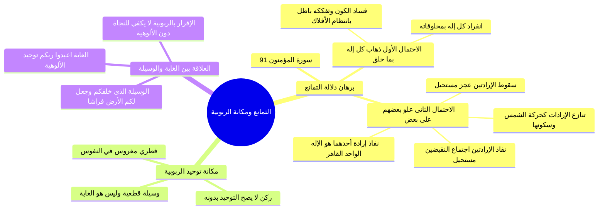

# دلالة التمانع وانتظام الكون ومكانة توحيد الربوبية

> [!abstract] بطاقة الجزء
> - **المحاضرة:** 15 من مادة العقيدة (المستوى الأول - أكاديمية زاد).
> - **المدى بالتفريغ:** من السطر 105 إلى السطر 124.
> - **المحاور المركزية:** البرهان القرآني في دلالة التمانع (المؤمنون: 91)، انتظام الكون دليلاً على وحدة المدبر، منزلة توحيد الربوبية وفطريته، وقاعدة أنه وسيلة عظمى للوصول إلى غاية توحيد الألوهية.

---

## 🧭 خريطة المفاهيم الذهنية (Mindmap)

---

## 📝 الملخص العلمي المنظم للجزء 05

### 1. البرهان العقلي القرآني في «دلالة التمانع»
- استدل المحاضر بالآية الجامعة لبرهان التمانع:
  ا - ﴿مَا اتَّخَذَ اللَّهُ مِن وَلَدٍ وَمَا كَانَ مَعَهُ مِنْ إِلَٰهٍ ۚ إِذًا لَّذَهَبَ كُلُّ إِلَٰهٍ بِمَا خَلَقَ وَلَعَلَا بَعْضُهُمْ عَلَىٰ بَعْضٍ ۚ سُبْحَانَ اللَّهِ عَمَّا يَصِفُونَ﴾ [المؤمنون: 91].
- **قسمة الاحتمالات العقلية لبطلان الشريك:**
  1. **الاحتمال الأول: استقلال كل إله بما خلقه (لذهب كل إله بما خلق):**
     - أن ينفرد رب الشمس بشمسه، ورب القمر بقمره، ورب الأرض بأرضه.
     - **النتيجة العقلية:** تصادم القوى وفساد العالم وانهيار توازنه. وحيث إن الكون متسق، منتظم، محكم منذ آلاف السنين، دل ذلك قطعاً على بطلان تعدد الخالقين.
  2. **الاحتمال الثاني: مغالبة الآلهة وتنازع إراداتها (ولعلا بعضهم على بعض):**
     - لو أراد أحدهم تحريك فلك وأراد الآخر تسكينه:
       - **الفرضية (أ): نفاذ الإرادتين معاً:** يلزم منه أن يكون الجرم متحركاً وساكناً في اللحظة نفسها، وهو مستحيل عقلاً (اجتماع النقيضين).
       - **الفرضية (ب): عدم نفاذ الإرادتين معاً:** يلزم منه سقوط القدرة وعجز كلا الإلهين، والعاجز لا يكون رباً، وهو مستحيل طالما أن الجرم موجود بالفعل (ارتفاع النقيضين).
       - **الفرضية (ج): نفاذ إرادة أحدهما وغلبته:** يكون الغالب النافذ المشيئة هو الإله الحق القاهر وحده، والآخر مقهوراً مغلوباً عاجزاً لا يصلح للألوهية قط؛ فثبت أن الإله الحق واحد لا شريك له.

---

### 2. مكانة توحيد الربوبية: وسيلة برهانية لا غاية نهائية
- **فطرية الإقرار بالربوبية:**
  - فطر الله النفوس على معرفة وجوده ووحدانيته في ربوبيته وخلقه ورزقه (القوة العلمية).
  - الخلل والانحراف في تاريخ البشرية لم يقع غالباً في نفي وجود الخالق، بل وقع في «القوة الإرادية والعملية»؛ بصرف العبادة للأنداد والشفعاء والأولياء.
- **الربوبية وسيلة والألوهية غاية:**
  - ا - «توحيد الربوبية ليس هو الغاية التي خُلقت من أجلها الثقلان، بل هو وسيلة وحجة ملزمة لبلوغ الغاية العظمى وهي توحيد الألوهية».
  - **البرهان من سورة البقرة:**
    - الغاية المنشودة: ﴿يَا أَيُّهَا النَّاسُ اعْبُدُوا رَبَّكُمُ﴾ [الألوهية].
    - الوسيلة والحجة المستدل بها: ﴿الَّذِي خَلَقَكُمْ وَالَّذِينَ مِن قَبْلِكُمْ... الَّذِي جَعَلَ لَكُمُ الْأَرْضَ فِرَاشًا وَالسَّمَاءَ بِنَاءً وَأَنزَلَ مِنَ السَّمَاءِ مَاءً فَأَخْرَجَ بِهِ مِنَ الثَّمَرَاتِ رِزْقًا لَّكُمْ﴾ [الربوبية].
- **الحكم العقدي الحاسم:**
  - ا - «الإقرار بتوحيد الربوبية بمجرده دون التزام توحيد الألوهية وإخلاص العبادة لله وحده لا يكفي لسعادة العبد ولا لنجاته في الدنيا والآخرة».

---

## 🔍 المراجعة الداخلية (5 أسئلة تحقق سريعة)

1. **س:** ما معنى «دلالة التمانع» بإيجاز؟
   - **ج:** امتناع وجود إلهين للكون؛ لأنه لو وجد إلهان لتنازعا، فإما أن يعجز كلاهما أو يغلب أحدهما فيكون هو الإله الحق وحده.
2. **س:** كيف يُبطل انتظام الكون افتراض «لذهب كل إله بما خلق»؟
   - **ج:** لأن استقلال كل إله بجزء من الكون يستلزم اضطراب العالم وتصادم الأفلاك، بينما المشاهد هو التناسق والنظام البديع الدال على وحدة مدبره.
3. **س:** لماذا يُعد نفاذ إرادتي إلهين متضادين مستحيلاً عقلاً؟
   - **ج:** لأنه يؤدي إلى الجمع بين النقيضين، كأن يكون الشيء الواحد متحركاً وساكناً في الوقت عينه، وهذا محال عقلاً.
4. **س:** هل توحيد الربوبية غاية في ذاته أم وسيلة؟
   - **ج:** هو وسيلة عظيمة وحجة بيّنة خوطب بها الناس ليلتزموا الغاية التي خُلقوا لها، وهي توحيد الألوهية وعبادة الله وحده.
5. **س:** استدل من أول نداء في القرآن (سورة البقرة) على تلازم الغاية والوسيلة في التوحيد.
   - **ج:** قوله تعالى: ﴿يَا أَيُّهَا النَّاسُ اعْبُدُوا رَبَّكُمُ﴾ [غاية: الألوهية]، ﴿الَّذِي خَلَقَكُمْ وَالَّذِينَ مِن قَبْلِكُمْ...﴾ [وسيلة: الربوبية].

---

## 🗣️ نص المتحدث الكامل (من الأسطر 105 إلى 124)

> قال الله سبحانه وتعالى مبينا انه هو المنفرد تروبيه هذا العالم
> قال الله عز وجل
> ما اتخذ الله من ولد وما كان معه من اله لو كان مع الله اله او له ولد يعني هناك اكثر من رب هذا الكون
> اذن كل اله بما خلق هذا الربط المالوف سيقول انا مثلا الشمس القمر والارض سيكون كل منهم انا اريد ان انفرد ما خلقت رب الشمس ينبذ بالشمس رب القمر القمر الارض
> انفرد بالارض النتيجه سيحدث في هذا الكون الفساد
> اذن هذه الحاله الاولى ان ينفرد كلما خلق يذهب كلما خلق هذا لم تحصل لم تحصل والسبب كيف عرف انه لم يحصل
> لان الكون متسق منظم فدل ذلك على ان هذه الحاله الاولى باطله الحاله الثانيه
> ولعلي بعضهم على بعض خلاص كل واحد يريد ان يدبر امر الشمس هذا يريد الشمس ان تكون ساكنه وهذا يريد الشمس ان تكون متحركه
> فاما ان تنفذ الارادات ان تصبح الشمس متحركه ساكنه في الوقت ذاته
> وهذا مستحيل
> اولا تنفذ ال ارادت ان تكون الشمس لا ساكنه ولا متحركه هذا مستحيل طالما ان الشمس موجوده بقي امر ثالث وهو الواقع الان ان تنفذ اراده احدهما فتبقى الشمس تجري فدل ذلك على ان مدبر هذا العالم رب هذا العالم هو واحد وهو الله سبحانه وتعالى
> ما مكانه توحيد الربوبيه
> ومن هنا سندخل على اهم يعني قضيه في درس اليوم ما مكانه توحيد الربوبيه عند اهل السنه والجماعه توحيد الربوبيه اهل السنه والجماعه ركن من اركان التوحيد لا يتم توحيد الانسان الا به لكنه فطر في النفوس توحيد الربوبيه الفطر في النفوس الله سبحانه وتعالى من رحمته خلقنا وزودنا ب قوتين قوه العلم قوات الاراده فجعل في القوه العلميه التي في نفوسنا الاقرار بوجود الله ووحدانيته سبحانه وتعالى نعرف هكذا ان هذا الربط هو موجود وان هذا الربو واحد هذا فطره في النفوس
> ما الذي يحصل فيها الخلل هو الاراده ان يقصد الانسان هذا الاله الوحده ولكنه يجعل معه شركاء شفعاء هنا يحدث الخلل في في حياه الانسان العمليه لذلك جاء الرسل يعيدون الناس الى التوحيد الخالص وهو ان تتوجه بالعباده لله سبحانه وتعالى واحده الا شريك المقصود ان توحيد الربوبيه ليس هو الغايه
> لانه هو وسيله تستخدم في بلوغ الغايه
> يا ايها الناس اعبدوا ربكم هذه الغايه الذي خلقكم والذين من قبلكم لعلكم تتقون الذي جعل لكم الارض فراشا والسماء بناء وانزل من السماء ماء فاخرج به من الثمرات رزقا لكم هذه تسمى الوسيله فتوحيد الربوبيه ليس هو غايه التحدي هو وسيلتهم التضامن والالتزام يلزم منه
> فقد يلتزم الانسان
> وقد لا يلتزم فمن التزم فاتى توحيد الالوهيه
> فهذا حقق الغايه
> ومن لم يلتزم مره ثالثه لم ينفع ذلك لا ينفع توحيد الربوبيه دون الالتزام بتوحيد الالوهيه لا يكفي لاستعاده ولا للنجاه لا في الدنيا ولا في الاخره
> حتى ياتي معه بتوحيد الالوهيه ناخذ فاصل ثم ناتي الى معنى لا اله الا الله

---

## 🔗 روابط التنقل
- السابق: [[04 - مراتب إعانة الله للمكلفين قبل الفعل ومعه والخذلان]]
- التالي: [[06 - فاصل اسم الله الحي وثمار الإيمان به والدعاء بالاسم الأعظم]]
