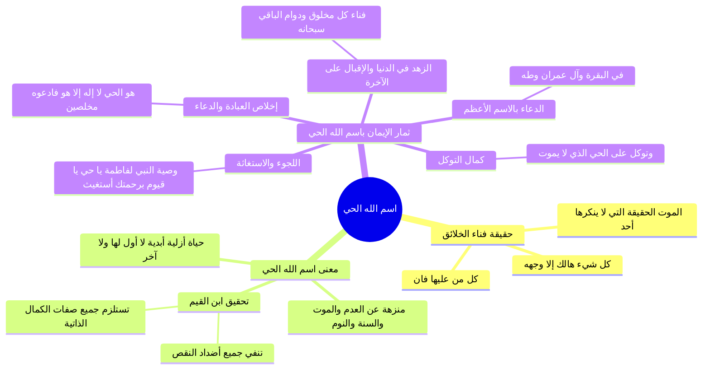

# فاصل اسم الله الحي وثمار الإيمان به والدعاء بالاسم الأعظم

> [!abstract] بطاقة الجزء
> - **المحاضرة:** 15 من مادة العقيدة (المستوى الأول - أكاديمية زاد).
> - **المدى بالتفريغ:** من السطر 125 إلى السطر 141.
> - **المحاور المركزية:** حقيقة الموت وفناء الخلائق، كمال حياة الله الذاتية المستلزمة لجميع صفات الكمال (تحقيق ابن القيم)، وثمار معرفة «الحي» في الدعاء والاستغاثة («يا حي يا قيوم»)، التوكل، التوسل بالاسم الأعظم، والزهد في الفانية.

---

## 🧭 خريطة المفاهيم الذهنية (Mindmap)

---

## 📝 الملخص العلمي المنظم للجزء 06

### 1. معاني اسم الله «الحي» وتحقيق ابن القيم
- **حقيقة الفناء والموت:** الحقيقة الكونية العظمى التي لا يختلف عليها اثنان هي الموت؛ فكل من على الأرض يموت ويفوت، ولا يبقى إلا الحي الذي لا يموت:
  ا - ﴿كُلُّ شَيْءٍ هَالِكٌ إِلَّا وَجْهَهُ﴾ [القصص: 88].
- **كمال الحياة الإلهية:**
  - الله سبحانه لم يزل موجوداً وبالحياة موصوفاً؛ لم تحدث له الحياة بعد موت أو عدم، ولا يعتريه موت أو زوال بعد وجود.
  - كل ما سواه فحياته ذات بداية محدودة وأجل معدود.
  - **قاعدة ابن القيم رحمه الله:**
    ا - «وحياته سبحانه أكمل الحياة وأتمها، وهي حياة تستلزم جميع صفات الكمال (كالسمع، والبصر، والقدرة، والإرادة، والعلم)، وتنفي أضدادها من جميع الوجوه».

---

### 2. ثمار الإيمان باسم الله الحي في حياة المؤمن

| الثمرة الإيمانية | البيان والتحقيق العملي | الدليل من الكتاب أو السنة |
|:---|:---|:---|
| **1. إخلاص الدعاء والعبادة** | إفراد من له الحياة المطلقة الدائمة بالرغبة والرهبة دون الأموات العاجزين. | ﴿هُوَ الْحَيُّ لَا إِلَٰهَ إِلَّا هُوَ فَادْعُوهُ مُخْلِصِينَ لَهُ الدِّينَ ۗ الْحَمْدُ لِلَّهِ رَبِّ الْعَالَمِينَ﴾ [غافر: 65]. |
| **2. الاستغاثة والافتقار التام** | وصية النبي ﷺ لابنته فاطمة رضي الله عنها بدعاء الصباح والمساء المشتمل على الاستغاثة بالحي القيوم. | «يَا حَيُّ يَا قَيُّومُ بِرَحْمَتِكَ أَسْتَغِيثُ، أَصْلِحْ لِي شَأْنِي كُلَّهُ، وَلَا تَكِلْنِي إِلَىٰ نَفْسِي طَرْفَةَ عَيْنٍ». |
| **3. صدق التوكل وتفويض الأمور** | التعلق بمن لا يزول ملكه ولا يموت، وإسقاط التوكل على المخلوقين الذين يفنون ويزول شأنهم. | ﴿وَتَوَكَّلْ عَلَى الْحَيِّ الَّذِي لَا يَمُوتُ وَسَبِّحْ بِحَمْدِهِ﴾ [الفرقان: 58]. |
| **4. التوسل باسم الله الأعظم** | إجابة الدعاء وقضاء الحوائج بالتوسل بهذا الاسم المبارك. | حديث أبي أمامة: «إِنَّ اسْمَ اللَّهِ الأَعْظَمَ فِي ثَلاَثِ سُوَرٍ مِنَ الْقُرْآنِ: فِي سُورَةِ الْبَقَرَةِ، وَآلِ عِمْرَانَ، وَطه». |
| **5. الزهد في الدنيا والإقبال على الآخرة** | اليقين بزوال الأعمار، والاستعداد للقاء الملك الحي الذي لا يموت. | ﴿كُلُّ مَنْ عَلَيْهَا فَانٍ * وَيَبْقَىٰ وَجْهُ رَبِّكَ ذُو الْجَلَالِ وَالْإِكْرَامِ﴾ [الرحمن: 26–27]. |

---

### 3. مواضع اسم الله الأعظم في السور الثلاث
- بيّن المحاضر استناداً إلى حديث أبي أمامة رضي الله عنه أن الاسم الأعظم يدور حول اقتران اسمع تعالى: «الحي القيوم» في ثلاث سور:
  1. **سورة البقرة:** في آية الكرسي: ﴿اللَّهُ لَا إِلَٰهَ إِلَّا هُوَ الْحَيُّ الْقَيُّومُ﴾ [البقرة: 255].
  2. **سورة آل عمران:** في مطلعها: ﴿الم * اللَّهُ لَا إِلَٰهَ إِلَّا هُوَ الْحَيُّ الْقَيُّومُ﴾ [آل عمران: 1–2].
  3. **سورة طه:** في مشهد الحشر الأكبر: ﴿وَعَنَتِ الْوُجُوهُ لِلْحَيِّ الْقَيُّومِ ۖ وَقَدْ خَابَ مَنْ حَمَلَ ظُلْمًا﴾ [طه: 111].

---

## 🔍 المراجعة الداخلية (5 أسئلة تحقق سريعة)

1. **س:** ما الحقيقة الكونية التي لا يختلف عليها اثنان، وتدل على انفراد الله بالبقاء؟
   - **ج:** الموت؛ فكل من على الأرض هالك وميت، ولا يبقى إلا الحي الذي لا يموت.
2. **س:** ماذا تستلزم صفة «الحياة» الكاملة لله تعالى بحسب كلام ابن القيم؟
   - **ج:** تستلزم جميع صفات الكمال الذاتية (كالعلم والقدرة والسمع والبصر)، وتنفي نقائصها وأضدادها من كل وجه.
3. **س:** ما الدعاء النبوي العظيم الذي أوصى به النبي ﷺ ابنته فاطمة رضي الله عنها عند الصباح والمساء؟
   - **ج:** «يَا حَيُّ يَا قَيُّومُ بِرَحْمَتِكَ أَسْتَغِيثُ، أَصْلِحْ لِي شَأْنِي كُلَّهُ، وَلَا تَكِلْنِي إِلَى نَفْسِي طَرْفَةَ عَيْنٍ».
4. **س:** في أي سور القرآن الثلاث ورد اسم الله الأعظم كما جاء في حديث أبي أمامة؟
   - **ج:** في سورة البقرة، وسورة آل عمران، وسورة طه.
5. **س:** لماذا اختص التوكل بالحي الذي لا يموت؟
   - **ج:** لأن كل ما سواه يموت ويضمحل شأنه ويفوت؛ فلا يصلح للاعتماد وتفويض الأمور إليه إلا الحي الباقي سبحانه.

---

## 🗣️ نص المتحدث الكامل (من الأسطر 125 إلى 141)

> التكمله
> ام
> الحقيقه التي لا ينكرها احد
> ولا يختلف عليها اثنان الموت
> فكل من على الارض يموتون ولا يبقى الا الحي الذي لا يموت
> فهو الحي الذي لم يزل الموجوده وبالحياه موصوفه لم تحدث له الحياه بعد موت ولا يعترضه الموت بعد الحياه كل شيء هالك الا وجهه
> وهو الحي الذي له الحياه الدائمه والبقاء الذي لا اول له ولا اخر له وكل ما سواه لحياته اول محدود واجل المعدود وهو الحي الذي له جميع معاني الحياه الكامله من السمع والبصر والقدره والاراده وغيرها من الصفات الذاتيه
> قال ابن القيم وحياته سبحانه امل الحياه و اتموها وهي حياه تستلزم جميع صفات الكمال وتنفي اباد ها من جميع الوجوه
> كما تعلم بان الله تعالى هو الحي الذي له الحياه الكامله عبده ووحده ودعاه وحده دون من سواه
> قال تعالى
> هو الحي لا اله الا هو فادعوه مخلصين له الدين الحمد لله رب العالمين
> ومن علم بان الله هو الحل لجا اليه واستغاث به على النبي صلى الله عليه وسلم وهو يوصي بنته فاطمه رضي الله عنها ما يمنعك ان تسمعي ما اوصيك به ان تقولي اذا اصبحت واذا امسيت يا حي يا قيوم برحمتك استغيث اصلح لي شاني كله ولا تكلني الى نفسي طرفه عين
> ومن علم بان الله هو الحي توكل عليه
> وفوض امره اليه قال تعالى وتوكل على الحي الذي لا يموت
> فغير الله يموت ويضمحل شانه ويفوت والتوكل انما هو على الحي الذي لا يموت
> ومن علم بان الله هو الحي توصل اليه باسمه الاعظم عن القاسم ابي عبد الرحمن عن ابي امامه عن النبي صلى الله عليه وسلم قال ان اسم الله الاعظم في ثلاث سور من القران في سوره البقره وال عمران وطه ومن علم بان الله هو الحي زيد في الدنيا واقبل على الاخره
> فالعبد مهما طال عمره لابد ان يموت ولا يبقى الا الله الحي قال تعالى كل من عليها فان ويبقى وجه ربك ذو الجلال والاكرام

---

## 🔗 روابط التنقل
- السابق: [[05 - دلالة التمانع وانتظام الكون ومكانة توحيد الربوبية]]
- التالي: [[07 - تحرير معنى لا إله إلا الله وثمرة الخلاف بين الطائفتين]]
