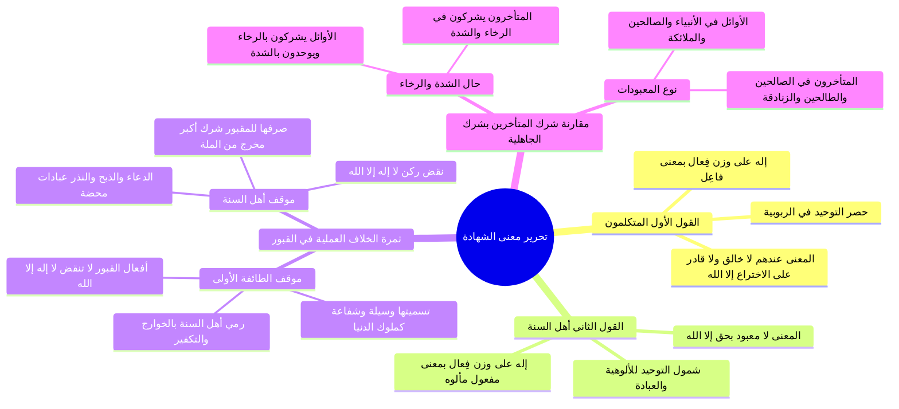

# تحرير معنى لا إله إلا الله وثمرة الخلاف بين الطائفتين

> [!abstract] بطاقة الجزء
> - **المحاضرة:** 15 من مادة العقيدة (المستوى الأول - أكاديمية زاد).
> - **المدى بالتفريغ:** من السطر 142 إلى السطر 185.
> - **المحاور المركزية:** الإشكالية العقدية في حصر معنى «لا إله إلا الله» في الربوبية، المذهب الكلامي مقابل مذهب أهل السنة، الثمرة الواقعية الخطيرة للخلاف في أعمال القبور، ومقارنة شرك المتأخرين بشرك الجاهلية الأولى.

---

## 🧭 خريطة المفاهيم الذهنية (Mindmap)



---

## 📝 الملخص العلمي المنظم للجزء 07

### 1. تحرير معنى «لا إله إلا الله» بين الطائفتين
- **مكمن الإشكالية العقدية:**
  - وقع خلط عظيم لدى طوائف من المتكلمين وأصحاب القبور؛ حيث فسروا كلمة الشهادة بمجرد ما يقتضيه توحيد الربوبية.
- **عرض المذهبين:**
  1. **مذهب المتكلمين ومن وافقهم:**
     - زعموا أن كلمة «إله» على وزن (فِعَال) تأتي بمعنى <span style="color:#0D9488; font-weight:bold;">(فاعِل)</span>، أي: خالق، ورازق، ومدبر، وقادر على الاختراع.
     - فصار معنى «لا إله إلا الله» عندهم: «لا خالق، ولا صانع، ولا مؤثر، ولا قادر على الاختراع إلا الله».
  2. **مذهب أهل السنة والجماعة وسلف الأمة:**
     - كلمة «إله» على وزن (فِعَال) تأتي لغة وشرعاً بمعنى <span style="color:#0D9488; font-weight:bold;">(مفعول)</span>، أي: مألوه؛ والمألوه هو المعبود محبةً وتعظيماً.
     - ولما وُجدت آلهة باطلة كثر عبدها المشركون، كان المعنى المطابق: <span style="color:#0D9488; font-weight:bold;">«لا معبود بحقٍّ إلا الله»</span>.

---

### 2. ثمرة الخلاف الواقعية في الحكم على الشرك بالقبور
- ضرب المحاضر مثالاً فاصلاً يثبت أن الخلاف ليس لفظياً، بل تدور عليه مسألة الشرك والإسلام:
  - **صورة المسألة:** رجل يقصد ضريحاً أو قبراً، وهو يعتقد جازماً أن المقبور ميت لا يخلق، ولا يرزق، ولا يدبر الكون، وأن الخالق المالك هو الله وحده... ثم يذبح عند القبر، وينذر له، ويدعوه، ويستغيث به لتفريج كربته وقضاء حاجته:

| وجه المقارنة | موقف طائفة المتكلمين والقبوريين | موقف أهل السنة والجماعة |
|:---|:---|:---|
| **تكييف الفعل بالنسبة لـ «لا إله إلا الله»** | يرون أن هذا الفعل **لا ينقض كلمة الشهادة قط**؛ لأنه لم يعتقد في الميت أنه خالق أو رازق! | يرون أن هذا الفعل **ناقض صريح لـ «لا إله إلا الله»**؛ لأنها تعني لا معبود بحق إلا الله، وهذا عبد الميت. |
| **توصيف العمل عندهم** | ينقسمون: منهم من يراه بدعة، ومنهم من يراه مكروهاً، ومنهم من يراه **غاية التعظيم لله** باتخاذ الصالح واسطة وشريعة كحاشية ملوك الدنيا! | يقررون بإجماع السلف أنه **شرك أكبر مخرج من ملة الإسلام**. |
| **موقفهم من الطرف المقابل** | يتهمون أهل السنة بأنهم «خوارج، وتكفيريون، ويكفرون أهل لا إله إلا الله، ويجفون الأولياء»! | يبينون بالبراهين أن الدعاء والذبح والنذر عبادات لا تصرف إلا لله، وأن صرفها لغيره شرك. |

---

### 3. مقارنة تاريخية بين شرك الجاهلية الأولى وشرك متأخري القبور

```
                         ┌──────────────────────────────────────────────┐
                         │              مقارنة نوعي الشرك               │
                         └──────────────────────┬───────────────────────┘
                                                │
                 ┌──────────────────────────────┴──────────────────────────────┐
                 ▼                                                             ▼
   ┌───────────────────────────┐                                 ┌───────────────────────────┐
   │    شرك الجاهلية الأولى    │                                 │     شرك متأخري القبوريين   │
   ├───────────────────────────┤                                 ├───────────────────────────┤
   │ • يشركون في الرخاء        │                                 │ • يشركون في الرخاء        │
   │   ويخلصون في الشدة        │                                 │   والشدة معاً             │
   │ • يعبدون الأنبياء         │                                 │ • يعبدون الصالحين         │
   │   والصالحين والملائكة     │                                 │   والطالحين والمجاهيل     │
   └───────────────────────────┘                                 └───────────────────────────┘
```

- **وجهان لكون شرك المتأخرين أغلظ:**
  1. **الوجه الأول (حال الشدة والرخاء):** مشركو قريش كانوا يشركون في الرخاء، فإذا ركبوا البحر وحاقت بهم الشدائد أخلصوا لله وتبرؤوا من آلهتهم؛ قال تعالى: ﴿فَإِذَا رَكِبُوا فِي الْفُلْكِ دَعَوُا اللَّهَ مُخْلِصِينَ لَهُ الدِّينَ﴾ [العنكبوت: 65]. أما غلاة المتأخرين فيشتد شركهم واستغاثتهم بالموتى في ساعات الكرب والشدائد!
  2. **الوجه الثاني (طبيعة المعبودين):** المشركون الأوائل عبدوا ملائكة وأنبياء وأولياء صالحين، أما متأخرو القبورية فيعبدون الصالحين، ويزيدون بعبادة الطالحين والمجاذيب والملاحدة وفاقدي الأهلية!

---

## 🔍 المراجعة الداخلية (5 أسئلة تحقق سريعة)

1. **س:** ما المعنى الحصري الذي فسرت به طائفة المتكلمين كلمة «لا إله إلا الله»؟
   - **ج:** فسروها بمعنى «لا خالق إلا الله» أو «لا قادر على الاختراع إلا الله»، بجعل «إله» بمعنى «فاعل».
2. **س:** ما المعنى الحق لـ «لا إله إلا الله» عند أهل السنة والجماعة؟
   - **ج:** «لا معبود بحق إلا الله»، بجعل «إله» على وزن «فِعَال» بمعنى «مفعول» (أي مألوه معبود).
3. **س:** لماذا يرى أصحاب القول الأول أن الذبح والنذر للمقبورين لا ينقض التوحيد؟
   - **ج:** لأنهم يحصرون التوحيد في الربوبية؛ فطالما أن الذابح لا يعتقد أن الميت يخلق أو يرزق، فلا يُعد عندهم مشركاً بل متخذاً للوسيلة والشفاعة.
4. **س:** بماذا يرمي دعاة التبرك بالقبور من يصف أعمالهم بالشرك الأكبر؟
   - **ج:** يرمونهم بأنهم خوارج، وتكفيريون يستبيحون دماء المسلمين ويكفرون من قال لا إله إلا الله.
5. **س:** اذكر وجهين يثبتان أن شرك متأخري القبور أغلظ من شرك الجاهلية الأولى.
   - **ج:** 1) يشركون في الرخاء والشدة، بينما الأوائل يوحدون في الشدة، 2) شركهم في الصالحين والطالحين والزنادقة، بينما كان الأوائل في الملائكة والأنبياء والصالحين.

---

## 🗣️ نص المتحدث الكامل (من الأسطر 142 إلى 185)

> حياكم الله ايها الاحبه في الله هنا عندنا اشكاليه في توحيد الربوبيه ان بعض الناس ان معنى لا اله الا الله
> هي الاخر لا رزق لا مدبر الا الله سبحانه وتعالى تفسر معنى لا اله الا الله
> مما يدل عليه توحيد الربوبيه ولا اله ان الله عنده هو ان تراد الله جل جلاله
> افراد الخلق والملك والتدبير فقال الاله لا اله الا الله
> اله على وزن فعال
> بمعنى فاعل اي اله خالق رازق مالك مدبر يصبح لا اله الا الله
> لا خالق لا مالك راس مدبر لا مؤثر الا صانع الا الله سبحانه وتعالى هذا المعنى الثاني ل لا اله الا الله
> قالوا لا اله اله على وزن فعال صحيح لكنها بمعنى مفعول اي مالوف والماليه هو المعبود
> ولما كان هناك من عبد بغير حق فنقول هو المعبود بحق فلا معبود يستحق العباده الا الله جل جلاله هذا المعنى الثاني هذا المعنى الثاني في لا اله الا الله
> ايها الاحبه في الله هذا المعنى هذا الخلاف
> هل له ثمره في الواقع هل له ثمره يعني لو قلنا لا اله الله معنى لا خالق الا الله
> وقالها لا لا لا معبود بحق الا الله
> طيب ما المشكله في ذلك هل هناك ثمره لهذا الخلاف اعطيكم مثال بالمثال يتضح ان هذا الخلاف هل هو خلاف اللفظ الخلاف له ثمره
> لو ذهب شخص الى احد القبور وهو لا يعتقد في المقبور انه خالق مازق المدبر ويعتقد ان الخالق المالك الرازق المدبر هو الله وحده لا شريك له
> ثم توجه اليه الى هذا المقبور بالدعاء والذبح والنذر الاستعاذه الاستغاثه عند الذين يقولون ان معنى لا اله الا الله لا خالق الا الله
> هل هذا الفعل
> وهو لا يعتقد بانه خالق مالك راس مدبر دعاه وذبح لها واستعاذ به استغاث به
> هل هو يعني طعن هل هو نقض هل هو انقص من معنى لا اله الا الله
> عندهم لها علاقه بهذه الافعال لا اله الا الله
> لانه لم يعتقل في المقبور انه خالق مازق المدبر هذه الافعال التي توجه بها لهذا ال ولي ينقسمون نتيجه هذه منهم من يرى ان هذا الامر بدعه ومنهم من يرى ان هذا الامر مكروه توجه لهم منهم من يرى ان هذا الامر هو قمه التعظيم الله لانك بسبب كونك مذنب عاصم قصر تحتاج الى شفيع تحتاج الى وسيله تقربك الى الله وصلت هذا الرجل الصالح الميت طالما انه مات على الصلاح فيما اذا هو وسيله فانا عندما اذبح له انظر له استعين استغيث به من اجل ماذا ان يشفع له عند الله تتخذ هذا الدعاء وهذا الذبح هذا النذر هذا الموقع وهذا الخضوع له من اجل ماذا
> ان نسال الله سبحانه وتعالى المغفره ان يسال الله الذي تفريج الكروب
> فقالوا هذا قمه التعظيم لله
> وقالوا عن من يقول ان هذا
> الفعل شرك اكبر مخرج من المله
> قالوا هذا الانسان يكفر المسلمين يكفر من يشهد ان لا اله الا الله
> ويقول عنه مشرك و انه كافر وانه سوف وانه القبور وانه انه يقول عن هذا الشخص ان هذا يعني الذي يقول معنا لا الى هنا لا خالق الا الله
> يقول عن الاول يقول عنه انه خارجي انه تكثير غالب التكفير انه كذا وكذا وكذا
> الذي يقول معنى لا اله الا الله لا معبود يستحق العباده الا الله
> يقول الدعاء والذبح والنذر والاستغاثه لها لهذا الم يتصرفوا لهذا المياه قمه العباده هذه عبادات صرفت لهذا الانسان التقرب الى هذا الانسان بالذبح تقر من عليه بالدم هذا ميت لو كان واكرمته اشكال اللحن لكن عندما طريق الدم لهذا المقبور
> انا تقربت اليه بنفس العباده التي يتقرب بها لما هذا ذبح هذا الدعاء لهذا الميت
> انا دعوه واقول له يا سيدي فلان
> انظر الى حال اصاب ان الكرم امني لم رزق بولد كذا كذا عندما نتوجه الى بهذا الدعاء
> واطلب منه هو حتى لو قالوا هناك توسع المجال
> انا اتوجه اليه بالدعاء والاستعاذه والاستغاثه هذه القمه العباده
> حتى لو كان القصد انا عندما اقول له فرج همي وفك كربي يقول انا اقصد يعني ادعو الله ان هناك شيء محذوف يقولون تقديره يا سيدي الله هذا هذا الصرف لهذه العباده عند اصحاب ال قبل او ان يقولون هذا الفعل
> وانني صاحبه في الظاهر
> وانني صاحبه الظاهر من الشركه توحيد الربوبيه
> الا انهم يشرك في توحيد الالوهيه وتوحيد هو معنى لا اله الا الله
> وصرف هذه العباده لهذا المقبور
> فقد نقض لا اله الا الله لا معبود بحق الا الله
> فيقولون عن هذا الذي يجيز مثل هذا الشيء وسميت وسهله تشكل يقول هؤلاء يشركوا هذا الزمان وشركهم اعظم من شرك المشركين الاوائل لان المشركين الاوائل كانوا في حال ال الرخاء يشركون في حاله الشده يوحدون اما هؤلاء فهم يشركون في حاله الرخاء حال الشده
> واولئك كانوا شركهم قد يكون في الملائكه قد يكون في الصالح
> وهؤلاء شركه في الصالحين وفي غيرهم من الطالحين ومن يعني الزنادقه وغير ذلك
> المقصود هذه المساله مساله كبيره مساله خطيره

---

## 🔗 روابط التنقل
- السابق: [[06 - فاصل اسم الله الحي وثمار الإيمان به والدعاء بالاسم الأعظم]]
- التالي: [[08 - الأدلة اللغوية والشرعية على أن الإله هو المألوه المعبود]]
