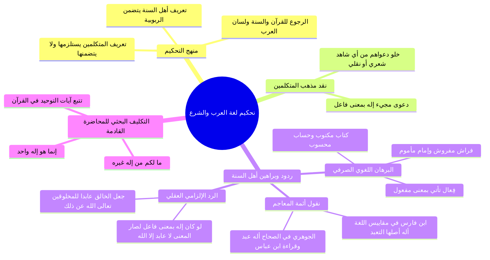

# الأدلة اللغوية والشرعية على أن الإله هو المألوه المعبود

> [!abstract] بطاقة الجزء
> - **المحاضرة:** 15 من مادة العقيدة (المستوى الأول - أكاديمية زاد).
> - **المدى بالتفريغ:** من السطر 186 إلى السطر 205.
> - **المحاور المركزية:** التحكيم إلى الكتاب والسنة ولسان العرب، إبطال دعوى مجيء «إله» بمعنى «فاعل»، نصوص أئمة اللغة (ابن فارس والجوهري وقراءة ابن عباس)، إلزام الخصم بالمحال الفاسد، والتكليف البحثي لآيات التوحيد.

---

## 🧭 خريطة المفاهيم الذهنية (Mindmap)

---

## 📝 الملخص العلمي المنظم للجزء 08

### 1. التحكيم المنهجي بين الطائفتين
- للفصل في النزاع التاريخي بين من يفسر «لا إله إلا الله» بـ «لا خالق إلا الله» ومن يفسرها بـ «لا معبود بحق إلا الله»، لا بد من التحكيم إلى: «كتاب الله وسنة رسوله ﷺ ولسان العرب الفصيح الذي نزل به القرآن».
- **ملاحظة تضمنية هامة:**
  - تعريف أهل السنة (لا معبود بحق إلا الله) يَتَضَمَّنُ بالضرورة أنه لا خالق ولا رازق إلا الله؛ لأن الألوهية محيطة بالربوبية.
  - أما تعريف المتكلمين (لا خالق إلا الله) فهو قاصر على الربوبية، ولا يتضمن الألوهية بل يستلزمها فقط، ولم يلتزموا به في الحكم على متوجهي القبور.

---

### 2. الردود اللغوية والعقلية على دعوى «إله بمعنى فاعل»
- عجز المتكلمون عن الإتيان بشاهد واحد من شعر العرب أو كلامهم أو نقل عن إمام لغوي يثبت أن «إله» بمعنى «فاعل» (أي خالق أو رازق)، وجاءت ردود أهل السنة في ثلاثة أوجه حاسمة:

#### الوجه الأول: النظائر الصرفية في لسان العرب
- جاءت زنة «فِعَال» في اللغة العربية الفصحى بمعنى «مَفْعُول» باطراد، ومن أمثلتها:
  - **كِتَاب** (فِعَال) = بمعنى **مَكْتُوب**.
  - **حِسَاب** (فِعَال) = بمعنى **مَحْسُوب**.
  - **فِرَاش** (فِعَال) = بمعنى **مَفْرُوش**.
  - **إِمَام** (فِعَال) = بمعنى **مَأْمُوم** (أي يُؤتم به).
  - وكذلك: **إِلَـٰه** (فِعَال) = بمعنى **مَأْلُوه** (أي مَعبُود تُألّهه القلوب محبةً وتعظيماً وخضوعاً).

---

#### الوجه الثاني: نصوص أئمة المعاجم واللغة المعتمدين

| الإمام والعالم | المصدر والتوثيق | النص والتحقيق العلمي |
|:---|:---|:---|
| **ابن فارس** | *معجم مقاييس اللغة* | «الهَمْزَةُ وَاللَّامُ وَالْهَاءُ أَصْلٌ وَاحِدٌ، وَهُوَ **التَّعَبُّدُ**؛ فَاللَّهُ تَعَالَى سُمِّيَ بِذَلِكَ لِأَنَّهُ **مَعْبُودٌ**، وَيُقَالُ: تَأَلَّهَ الرَّجُلُ إِذَا تَعَبَّدَ». |
| **الجوهري** | *الصحاح في اللغة* | «أَلَهَ (بِالْفَتْحِ) يَأْلَهُ إِلَاهَةً وَأُلُوهَةً: **أَيْ عَبَدَ عِبَادَةً**؛ وَمِنْهُ قَرَأَ ابْنُ عَبَّاسٍ رَضِيَ اللَّهُ عَنْهُمَا: ﴿وَيَذَرَكَ وَإِلَاهَتَكَ﴾ [الأعراف: 127]، قَالَ: **وَعِبَادَتَكَ**؛ وَمِنْهُ قَوْلُنَا: اللَّهُ، وَأَصْلُهُ إِلَهٌ عَلَى فِعَالٍ بِمَعْنَى مَفْعُولٍ؛ لِأَنَّهُ **مَأْلُوهٌ أَيْ مَعْبُودٌ**». |

---

#### الوجه الثالث: الإلزام العقلي الفاسد (إبطال لازم المذهب)
- قرر المحاضر رداً إلزامياً يدمغ تأويلهم:
  - ا - «لو سلمنا جدلاً وتنزيلاً أن "إله" تأتي على وزن فِعال بمعنى "فاعل" (أي عابد)، لصار معنى كلمة التوحيد (لا إله إلا الله): "لا عابد إلا الله"! فيلزم من ذلك جعل الخالق العظيم عابداً لخلقه وبشره! وهذا كفر ومحال شنيع يتنزه الله عنه علواً كبيراً».

---

### 3. التكليف البحثي للمحاضرة القادمة
- وجّه المحاضر طلاب العلم إلى بحث قرآني تطبيقي للمحاضرة القادمة:
  1. جمع الآيات التي وردت فيها كلمة التوحيد ومشتقاتها: «لا إله إلا الله»، ﴿مَا لَكُم مِّنْ إِلَٰهٍ غَيْرُهُ﴾، ﴿إِنَّمَا هُوَ إِلَٰهٌ وَاحِدٌ﴾.
  2. تدبر سياقاتها في القرآن لمعرفة هل كان النزاع مع المشركين في إثبات الخالق، أم في إخلاص العبادة للمألوه الحق؛ للوصول إلى حكم قرآني حاسم بين الطائفتين.

---

## 🔍 المراجعة الداخلية (5 أسئلة تحقق سريعة)

1. **س:** لماذا يُعد تعريف أهل السنة لـ «لا إله إلا الله» أتم وأكمل من تعريف المتكلمين؟
   - **ج:** لأن تعريف أهل السنة (لا معبود بحق إلا الله) يتضمن توحيد الربوبية وزيادة، بينما تعريف المتكلمين محصور في الربوبية ولا يتضمن الألوهية.
2. **س:** اذكر ثلاثة نظائر في كلام العرب تدل على أن زنة «فِعَال» تأتي بمعنى «مَفْعُول».
   - **ج:** كِتَاب بمعنى مَكْتُوب، حِسَاب بمعنى مَحْسُوب، وفِرَاش بمعنى مَفْرُوش (وكذلك إِمَام بمعنى مَأْمُوم).
3. **س:** ما تفسير ابن عباس رضي الله عنهما لقراءة: ﴿وَيَذَرَكَ وَإِلَاهَتَكَ﴾ في سورة الأعراف؟
   - **ج:** فسّرها بقوله: «وعبادتك»، وهو نص صريح في أن الألوهية هي العبادة.
4. **س:** ما المحال الشنيع الذي يلزم من القول بأن «إله» بمعنى «فاعل» (عابد)؟
   - **ج:** يلزم منه أن يكون معنى الشهادة «لا عابد إلا الله»، فيجعلون الخالق سبحانه عابداً للبشر والمخلوقات، تعالى الله عن ذلك علواً كبيراً.
5. **س:** ما التكليف العملي الذي كلف به المحاضر طلابه في ختام الدرس؟
   - **ج:** تتبع آيات التوحيد ونفي الإله غير الله في القرآن والسنة لتدبر دلالتها على معنى العبادة والألوهية للمحاضرة القادمة.

---

## 🗣️ نص المتحدث الكامل (من الأسطر 186 إلى 205)

> الان نحن يعني نتمنى ان نكون كطلاب يعلم ان نحكم بالحق بين هاتين الطائفتين المتنازعتين في الامه الاسلاميه الامه الاسلاميه تتنازع في هذا لكن ان يقول لا اله الا الله من لا خالق الا الله
> هناك من يقول لا معبود بحق الا الله وان الثمره
> طيب كيف نعالج هذه القضيه ما ما رجعنا في هذه القضيه
> م رجعنا في هذه القضيه
> الكتاب والسنه ونرجع الى القران والسنه لنعرف معنى لا اله الا الله من خلال القران والسنه ونحكم بين هاتين الطائفتين
> هل معنى لا لا خالق الا الله او معنى لا اله الا الله
> اذا نؤكد ان الذين اقول لا معبود بحق الا الله
> يتضمن تعريفهم انه لا خالق لا مالك لا راس مدبر الا الله سبحانه وتعالى سيتضمن توحيد ال اولا يتضمن توحيد الربوبيه فهم قد اتوا بالثاني والذين قالوا لا خالق الا الله لا راس مدبر الله لا يتضمن هذا التعريف توحيد الالوهيه ان ما يلزم منه توحيد الالوهيه ما دليل اصحاب القول الاول على ان معنى لا اله
> الله ولا خالق هو قولهم بان اله علاج بمعنى فاعل التي تذكرنا اي اله خالق رازق مدبر ولم يحتجوا على ذلك باي شاهد من شواهد اللغه العربيه او بنقل عالم من علماء اللغه و ا قبل قال بعضهم انه مشتق اهل القول الثاني بثلاثه ردود الرد الاول قالوا ان ما استدلوا عليه في اللغه باطل وبين بطلان ذلك بقولهم لا يوجد عالم من علماء يقول اله بمعنى انه لا يوجد عالم من علماء اللغه العربيه يقول اله بمعنى اله اي فاعل بل علماء اللغه يقولون اله فعال بمعنى مفعول بمعنى مالوه مثل كتاب بمعنى مكتوب حساب بمعنى محسوب فراش بمعنى بمعنى مبسوط وهكذا
> قال ابن فارس معجم مقاييس اللغه الها الهمزه واللام والهاء اصل واحد وهو التعبد
> فالله الله تعالى سمى بذلك لانه معبود
> ويقال تا لها الرجل اذا تعبت ويقول الجوهري في الصحاح الها بالفتح اله اله اله اي عبد عباده يقول ومنه قرا ابن عباس رضي الله عنهما ويذرك والهتك والهتك قال وعبادتك ومنه قولنا يقول هو الله واصله اله على فعال بمعنى مفعول لانه مالوه اي معبود كقولنا امام فعال بمعنى مفعول لانه تم به فلما ادخلت عليه الالف واللام حذفت الهمزه تخفيفا لكثره
> الكلام
> اذن ما معنى الاله في اللغه معنى الاله في اللغه هو المالوه اي الذي تالهه القلوب اي تحبه محبه عظيمه امر ثاني قالوا لو سلمنا جدلا بان الافعال بمعنى في الاياله فاننا بذلك لو قلنا لا اله الا الله
> يعني لا عابد الا الله جعلنا المعب ودعا بدا للناس تعالى الله عن ذلك علوا كبيرا اريد منكم يا اخوان ونشاط تستخدم هذه الحلقه القادمه بمشيئه الله ان تبحث في القران وفي السنه عن كلمه لا اله الا الله ما لكم من اله غيره ما من اله الا اله واحد اجمعوا لهذه وحاول من خلال القران والسنه ان تتبين معنى لا اله الا الله
> يحكمنا حكما اصلا بين هاتين الطائفتين باذن الله
> استودعكم الله على امل اللقاء في الحلقه القادمه وصلى الله وسلم وبارك على عبده ورسوله محمد
> وجزاكم الله خيرا
> هذه عقيده الصحيحه فطرته في الشكوك بوضح البر
> والسؤال كاتبين علمك الازهر فى البستان

---

## 🔗 روابط التنقل
- السابق: [[07 - تحرير معنى لا إله إلا الله وثمرة الخلاف بين الطائفتين]]
- فهرس خطة المحاضرة: [[00 - مقدمة وخطة الأجزاء وعناصر المحاضرة]]
