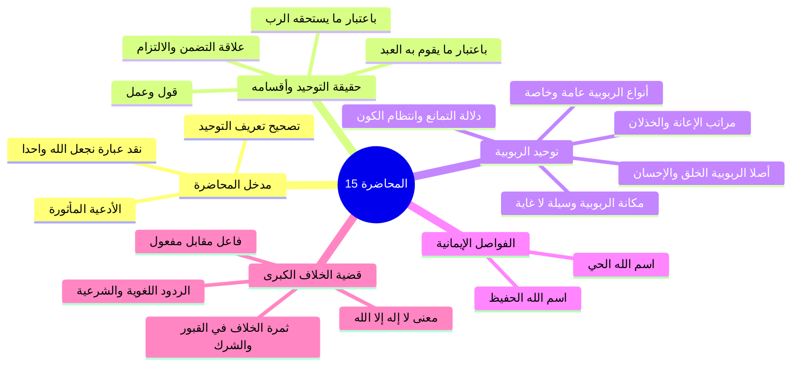
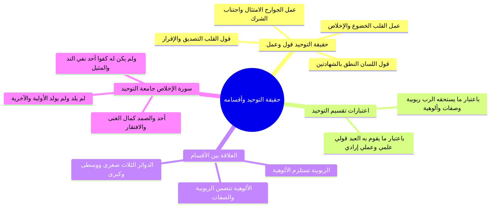
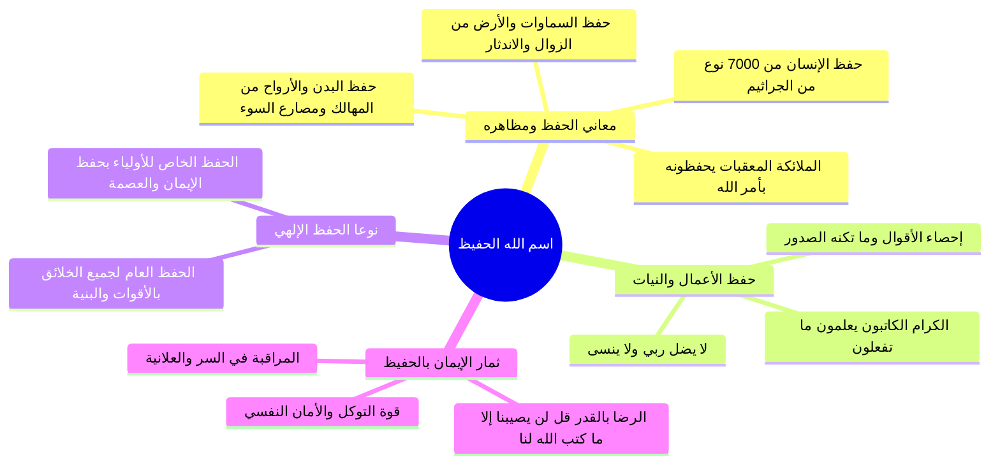
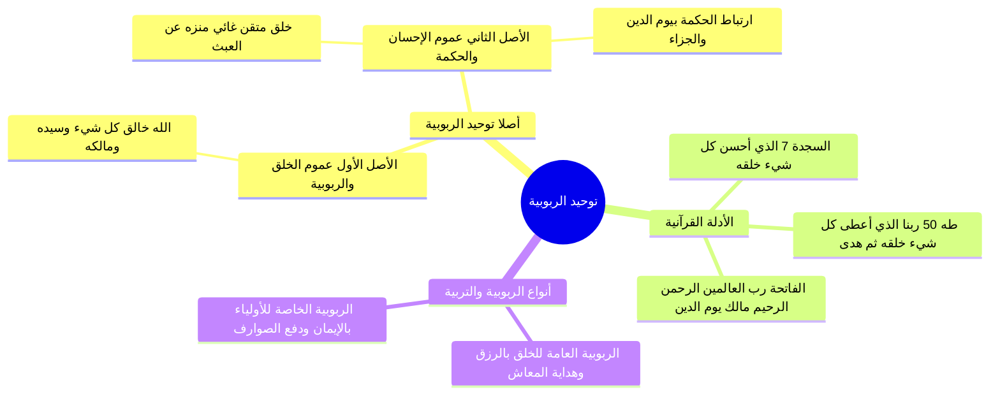
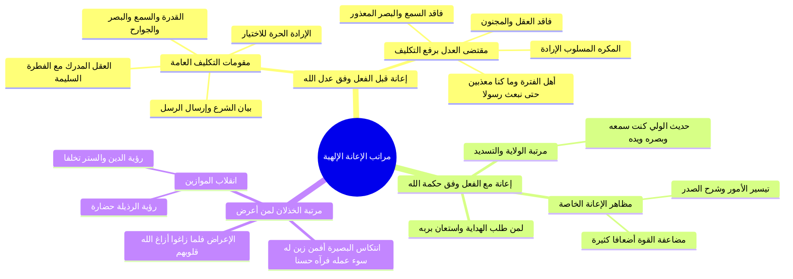
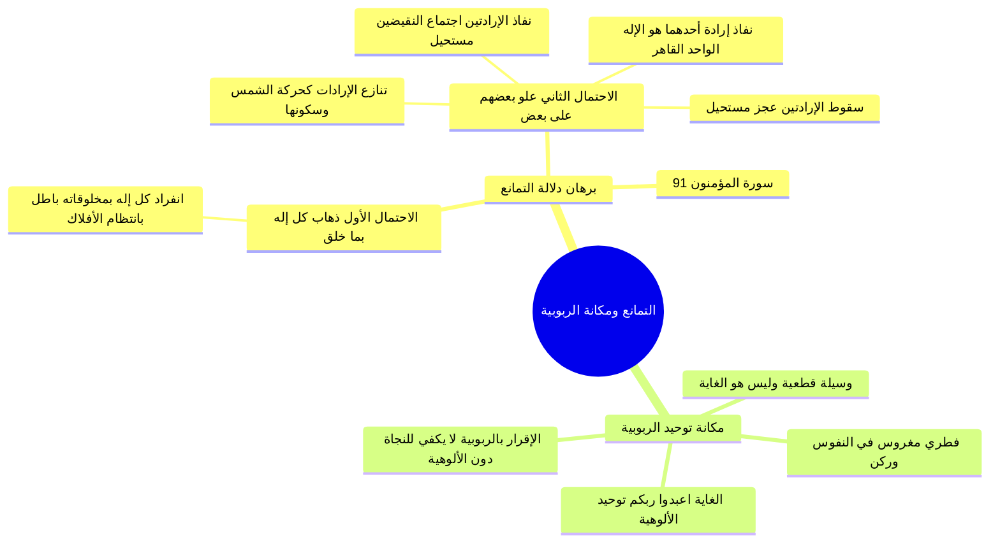
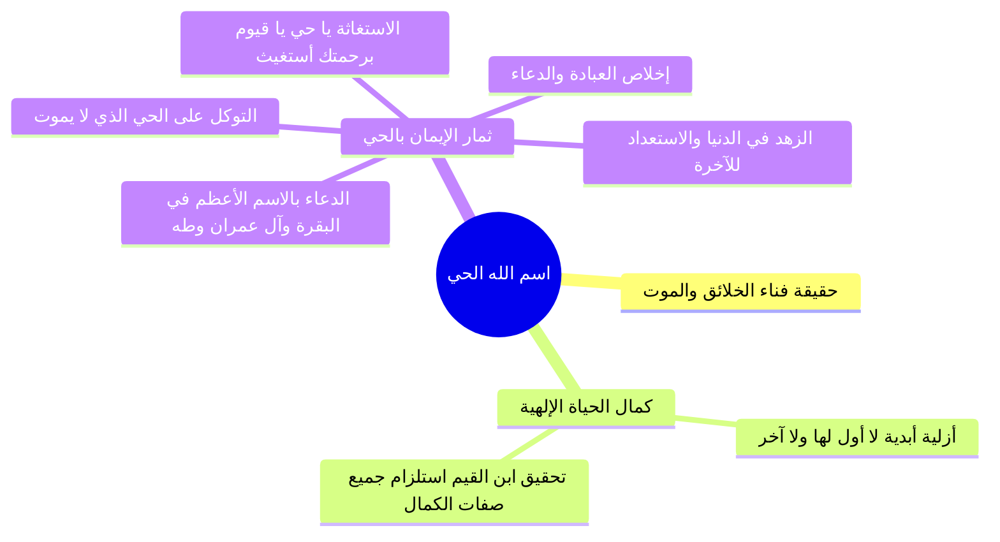
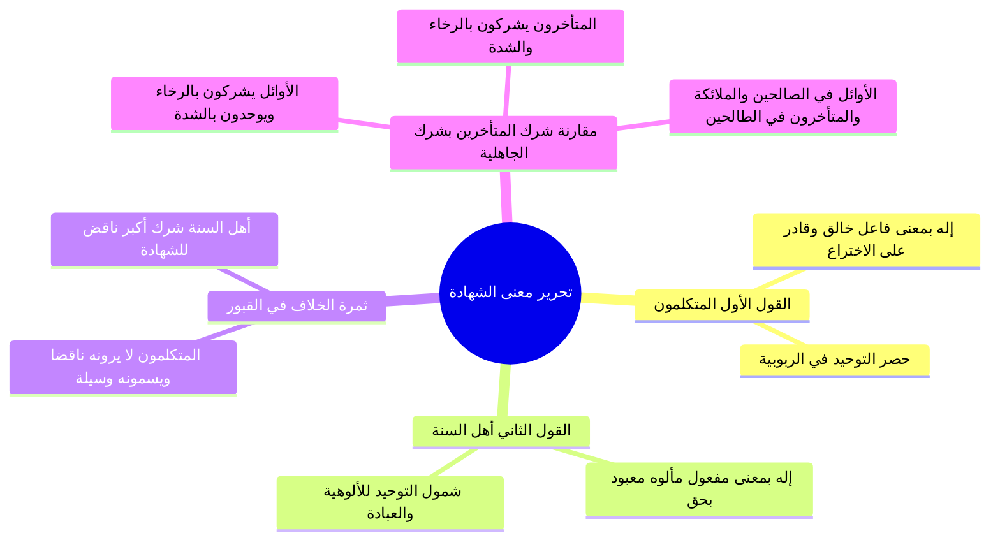
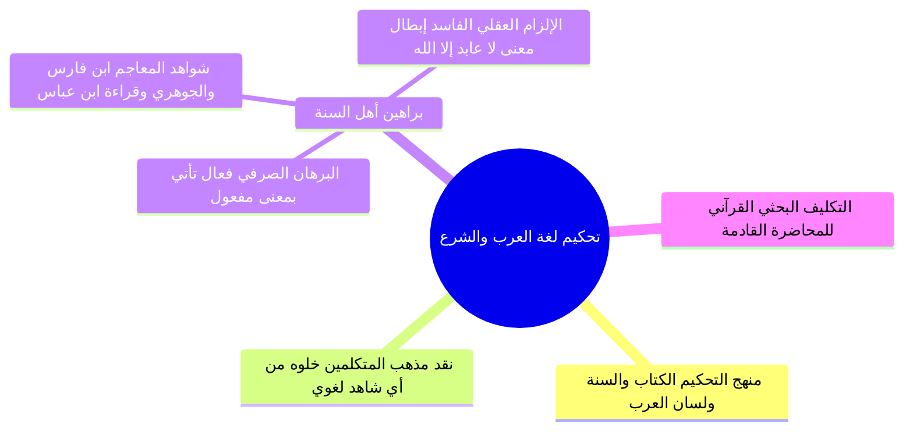

# المحاضرة 15: حقيقة التوحيد ومعنى لا إله إلا الله (ملف مجمع شامل)

> [!info] توصيف الملف المجمع
> يضم هذا الملف المجمع المحتوى العلمي الكامل والمنظم للمحاضرة الخامسة عشرة من مادة العقيدة (برنامج زاد المستوى الأول)، شاملاً الجداول، والرسومات البيانية والمقارنات، وقواعد التضمن والالتزام، والمناقشات اللغوية والعقدية، ونصوص المتحدث الكاملة حرفياً دون اجتزاء أو حذف، مرتبة بالتتابع المنهجي لجميع أجزاء المحاضرة من الجزء 00 حتى الجزء 08.

---

## 📑 فهرس موضوعات الملف المجمع

1. [[#الجزء 00: مقدمة وخطة الأجزاء وعناصر المحاضرة]]
2. [[#الجزء 01: حقيقة التوحيد وأقسامه وعلاقة التضمن والالتزام]]
3. [[#الجزء 02: فاصل اسم الله الحفيظ وحفظه العام والخاص]]
4. [[#الجزء 03: أصلا توحيد الربوبية وأنواع ربوبية الله لخلقه]]
5. [[#الجزء 04: مراتب إعانة الله للمكلفين قبل الفعل ومعه والخذلان]]
6. [[#الجزء 05: دلالة التمانع وانتظام الكون ومكانة توحيد الربوبية]]
7. [[#الجزء 06: فاصل اسم الله الحي وثمار الإيمان به والدعاء بالاسم الأعظم]]
8. [[#الجزء 07: تحرير معنى لا إله إلا الله وثمرة الخلاف بين الطائفتين]]
9. [[#الجزء 08: الأدلة اللغوية والشرعية على أن الإله هو المألوه المعبود]]

---

## الجزء 00: مقدمة وخطة الأجزاء وعناصر المحاضرة

### 📝 الملخص العلمي المنظم

#### 1. الافتتاح والأدعية المأثورة
- افتتح المحاضر بحمد الله والصلاة والسلام على رسول الله محمد ﷺ، والدعاء المأثور:
  ا - «اللهم إنا نسألك علماً نافعاً، وعملاً صالحاً، وقلباً خاشعاً، ولساناً ذاكراً».
  ا - «اللهم علمنا ما ينفعنا، وانفعنا بما علمتنا، واجعله حجة لنا ولا تجعله حجة علينا يا رب العالمين».

#### 2. مراجعة تعريف التوحيد لغة وشرعاً وتصحيح العبارات الخاطئة
- **التوحيد لغة:** يدور معناه حول الإفراد والانفراد وعدم وجود المثل والنظير.
- **التنبيه العقدي الحاسم:**
  - هل يصح أن نقول في تعريف التوحيد شرعاً: «هو أن نجعل الله واحداً فيما هو واحد فيه»؟
  - **الجواب:** هذا تعبير خاطئ باطل؛ لأن وحدانية الله عز وجل ثابتة له بذاته أزلاً وأبداً، وليست بجعل جاعل، فليست الآلهة متعددة حتى نأتي نحن البشر فنجعل الإله واحداً، بل التوحيد شرعاً هو الإقرار والاعتقاد والعلم والإيمان بأن الله واحد في ربوبيته وألوهيته وأسمائه وصفاته.

#### 3. إعلان محاور المحاضرة الخامسة عشرة
- ربط توحيد الربوبية بكلمة الشهادة: «لا إله إلا الله».
- طرح الإشكالية الكبرى التي ستعالجها المحاضرة: هل معنى كلمة الشهادة: «لا خالق إلا الله» أو «لا رازق إلا الله»، أم معناها: «لا معبود بحق إلا الله»؟ وما هي الثمرة المترتبة على هذا الخلاف بين طوائف الأمة؟

### 🧭 خريطة المفاهيم الذهنية (Mindmap)

### 🗣️ نص المتحدث الكامل (من الأسطر 1 إلى 14)

> ويتقدم تقنياته ومجالات طوروا ادواتنا في تقديم العلم الشرعي علمك الاساس في الاسلام
> السلام عليكم ورحمه الله وبركاته
> الحمد لله رب العالمين والصلاه والسلام على اشرف المرسلين محمد وعلى اله وصحبه اجمعين اللهم انا نسالك علما نافعا وعملا صالحا و قلبا خاشعا ولسانا ذاكرا
> اللهم علمنا ما ينفعنا وانفعنا بما علمتنا و اجعله حجه لنا ولا تجعله حجه علينا رب العالمين
> وارحب بكم اخواني من طلاب العلم في اكاديمي اعتزال في ماده العقيده في المستوى الاول
> ارحب بكم في هذا الدرس اجمل ترحيب ايها الاحبه في الله لم سناخذ مراجعه سريعه لما سبق دراسته ثم سناخذ في هذه الحلقه
> موضوع في غايه الاهميه يتعلق بتوحيد الربوبيه من ناحيه
> ما معنى كلمه الشهاده لا اله الا الله
> هل معناها لا خالق الا الله او معناها لا رازق الا الله
> ونبدا من مراجعه اهم الامور التي ينبغي ان نستحضرها قبل ان ندخل في هذا الموضوع الجديد تذكرون ايها الاحبه اخذنا تعريف التوحيد وقلنا التوحيد في اللغه يدور معناه حول الافراد والانفراد وعدم وجود المثل والنظير يدور معناه في اللغه حول الافراد والانفراد وعدم وجود المثل والنظير وقلنا هل يصح ان نقول التوحيد شرعا هو ان نجعل الله واحدا في ما هو واحد فيه اي واحد في ربوبيته والوهيته واسمائه وصفاته هل يصح ان نقول التوحيد شرعا وان نجعل الله واحدا في ربوبيته والوهيته واسمائه وصفاته الجواب خطا هذا التعبير تعبيرا هذا التعبير تعبير خاطئ ان نجعل الله لا وحدانيه الله ليست بجعل جاهل لسنا نحن الذين جعلنا الله واحدا وهو متعدده
> الله عز وجل عن ذلك علوم كثيرا ليست الالهه متعدده
> فنحن جعلنا اله وواحد لا انما نحن نعتقد ان الله واحد نؤمن ان الله واحد هو افراد الله ربوبيته وهو العلم لان الله واحد
> هكذا ان كلمتان نجعل نحن لا هذا خطا
> اذن التوحيد شرعا هو الايمان هو الاقرار والاعتقاد هو العلم بان الله واحد في ربوبيته ولا رب سواه والوهيته فلا مستحق للعباده الايه وفي اسمائه وصفاته فلان ده له فيها ولا نظر هذا معنى التوحيد الشرع

---

## الجزء 01: حقيقة التوحيد وأقسامه وعلاقة التضمن والالتزام

### 📝 الملخص العلمي المنظم

#### 1. حقيقة التوحيد: قول وعمل
التوحيد عند أهل السنة والجماعة ليس مجرد فكرة عقلية، بل هو «قول وعمل» ينتظم أربعة أركان:
1. **قول القلب:** التصديق الجازم والإقرار بأن الله واحد في ربوبيته وألوهيته وأسمائه وصفاته؛ ﴿يَا أَيُّهَا الرَّسُولُ لَا يَحْزُنكَ الَّذِينَ يُسَارِعُونَ فِي الْكُفْرِ مِنَ الَّذِينَ قَالُوا آمَنَّا بِأَفْوَاهِهِمْ وَلَمْ تُؤْمِن قُلُوبُهُمْ﴾.
2. **عمل القلب:** خضوعه لله سبحانه وانقياده له حباً وتعظيماً وخوفاً ورجاءً وتوكلاً ورضا وإخلاصاً تاماً.
3. **قول اللسان:** النطق بكلمة التوحيد: «أشهد أن لا إله إلا الله»، متضمنة ركني النفي والإثبات.
4. **عمل الجوارح:** الامتثال التام لأمر الله تعالى بترك عبادة ما سوى الله والتوجه بالأعمال المشروعة لله وحده.

#### 2. اعتبارات تقسيم التوحيد المقارنة

| وجه التقسيم | الأقسام المندرجة | دور وموقف المكلف |
|:---|:---|:---|
| **باعتبار ما يستحقه الرب جل وعلا** | 1. **توحيد الربوبية:** إفراد الله بأفعاله (خلق، ملك، تدبير). 2. **توحيد الأسماء والصفات:** إفراده بنعوت كماله ونفي الشبيه. 3. **توحيد الألوهية:** إفراده بجميع أفعال العباد التعبدية. | **العلم والاعتقاد والإقرار الجازم** بأن الله واحد ومستحق للعبادة وحده لا شريك له. |
| **باعتبار ما يقوم به العبد المكلف** | 1. **التوحيد القولي العلمي:** العلم بأن الله واحد في ربوبيته وأسمائه وصفاته وقول ذلك باللسان والقلب. 2. **التوحيد العملي الإرادي:** إرادة وقصد الله وحده بالعبادة والعمل الصالح وترك ما سواه. | **المعرفة والقول** في الأول، و**القصد والإرادة والعمل الامتثالي** في الثاني. |

#### 3. التمثيل الهندسي (الدوائر الثلاث) وقاعدة التضمن والالتزام
- **الدوائر الثلاث:**
  - الدائرة الصغرى: توحيد الربوبية (المركز).
  - الدائرة الوسطى: توحيد الأسماء والصفات.
  - الدائرة الكبرى: توحيد الألوهية (المحيطة الشاملة).
- **قاعدة الالتزام:** توحيد الربوبية يستلزم توحيد الأسماء والصفات، وتوحيد الربوبية والصفات يستلزم توحيد الألوهية.
- **قاعدة التضمن:** توحيد الألوهية يتضمن توحيد الأسماء والصفات وتوحيد الربوبية.
- **تنبيه عقدي:** توحيد الربوبية يستلزم الألوهية ولا يتضمنها؛ فمن أقر بالربوبية وحدها لم ينفعه ذلك حتى يلتزم بتوحيد الألوهية.

#### 4. معالم التوحيد في سورة الإخلاص
- ﴿قُلْ هُوَ اللَّهُ أَحَدٌ﴾: أحدٌ في ربوبيته، وألوهيته، وأسمائه وصفاته.
- ﴿اللَّهُ الصَّمَدُ﴾: الذي تصمد إليه الخلائق في قضاء حوائجها لغناه المطلق.
- ﴿لَمْ يَلِدْ﴾: استغناء تام عن الولد، فهو الآخِر الذي ليس بعده شيء.
- ﴿وَلَمْ يُولَدْ﴾: استغناء تام عن الوالد، فهو الأوَّل الذي ليس قبله شيء.
- ﴿وَلَمْ يَكُن لَّهُ كُفُوًا أَحَدٌ﴾: نفي مطلق للمثيل والنظير والكفء في الذات والصفات والأفعال.

### 🧭 خريطة المفاهيم الذهنية (Mindmap)

### 🗣️ نص المتحدث الكامل (من الأسطر 15 إلى 49)

> ثم ايها الاحبه في الله اخذنا حقيقه التوحيد ما هي حقيقه التوحيد قلنا حقيقه التوحيد ايها الاحبه ان التوحيد قول وعمل
> هذا في غايه الاهميه ان يعرف التوحيد قول وعمل قول القلب وعمل القلب وقول اللسان وعمل الجوارح القلب يقول نعم يقول القلب بقوله هو التصديق والاقرار يا ايها الرسول لا يحزنك الذين يسارعون في الكفر من الذين قالوا امنا بافواههم ولم تؤمن قلوبهم
> يعني و لم يقولوا ذلك بقلوبهم
> فلابد من قول القلب في التوحيد ان يصدق القلب ويقر القلب بان الله جل جلاله واحد في ربوبيته وصفاته هذا قول القلب وعمل القلب هو خضوعه لله هذا الواحد خضوعه لل احب ان خوفا ورجاء وتوكلا ورضا ويقينا خضوع القلب و اخلاصه لله جل جلاله
> الخضوع والاخلاص
> هذا عمل القلب وقول اللسان هو النطق بالشهادتين
> قول اللسان يتضمن النفي والاثبات نفى جميع المعبودات واثبات استحقاق العباده لله وحده فيقول بلسانه
> اشهد ان لا اله الا الله
> و يعمل بجوارحه والمقصود بعمل الجوارح هو الامتثال لما اقر به بقلبه وعمل بقلبه وقاله بلسانه فيمتد بجوارحه لمقتضى لا اله الا الله
> فيترك عباده كل ما سوى الله ويعبد الله وحده لا شريك له بما شرع عمل الجوارح وان يقول انا التزم امتثال ما شرع الله سبحانه وتعالى بترك عبادته كل ما سوى الله والتوجه بالعباده المشروع لله وحده لا شريك له
> هكذا يصبح الانسان موحدا هذه تسمى حقيقه التوحيد
> ثم ايها الاحبه في الله اخذنا ما يتعلق باقسام التوحيد وقلنا التوحيد ينظر اليه من جهته من جهه ما يستحق وهي الرب بدور العبد هنا هو العلم دور العبد في جهه في اتجاه اقسام التوحيد من جهه ما يستحق والرب هو العلم العلم بان الله واحد في ربوبيته والوهيته واسمائه وصفاته فالتوحيد من جهه ما يستحق والرب ثلاثه انواع ربوبيه والوهيه واسماء وصفات فيعتقد الانسان بان الله جل جلاله هو المنفرد بالخلق والملك والتدبير وانه سبحانه وتعالى لا مثيل له ولا نظير له في ذاته واسمائه وصفاته وافعاله وانه هو المستحق وحده بالعباده لا شريك له
> هذا ما يستحقه الرب الرب واحد في بيته في اسمائه وصفاته وهو مستحق وحده لان يعبد لكونه المنفرد من الخلطه الملكيه اقسام التوحيد من جهه ما يستحقها الرب
> من جهه من جهه ما يقوم به العبد ماذا يقول العبد العبد يقول ويعلم ويقصد ويريد ولذلك يسمى التوحيد من جهه ما يقوم به العبد توحيد القول علمي القول العلمي ان يعلم الانسان ان الله سبحانه وتعالى واحد ويقول ذلك من لسانه وقلبه هذا التوحيد قولي علمي يعلم العبد بان الراحه سبحانه وتعالى واحد في ربوبيته والوهيته واسمائه وصفاته وهذا التوحيد يعلنه بلسانه ف يقوله قولي علمي
> ويمكن ان يكون قول المقصود به يعني قول القلب تصديقه اقراره والعلم يعلم القلب ان الله سبحانه وتعالى واحد حتى يكون يعني كله يعني قلبه فهو قول علمه الامر الثاني عمل اراده فيقصد الانسان من علم انه هو المنفرد بالخلق والملك والتدبير علما ان الله هو المنفرد بالخلق اولمرت والرزق والتدبير وانها لا مثلنا باسمائه وصفاته وانه هو المستحق للعباده وحده لا شريك له
> هذا قالها اقل من وعلمه بقلبه بعد ذلك يعمل ويريد ما اقر به بقلبه يسمى التوحيد العمل الاراده فيترك عباده كل ما سوى الله
> ويتوجه بالعباده لله وحده لا شريك له
> كما تلاحظون يا اخوان هي تؤدي نفس المعنى الربوبيه والاسماء والصفات يقابلها التوحيد القول العلمي توحيد الالوهيه يقابله التوحيد العملي العراقي بعد ذلك يا اخوان تعرضنا للتعريف انواع التوحيد
> فقلنا توحيد الربوبيه من كلمه الرب منفرد الله بربوبيته لهذا العالم دائما نتذكر في تعريف توحيد الربوبيه عموميه الله ان الله هو صاحب هذا العام هو سيد هذا العالم
> وخالق هذا العالم
> فتوحيد الربوبيه وافراد الله بربوبيته لهذا العالم فهو افراد الله بالخلق والملك والتدبير هذا يسمى توحيد الربوبيه وتوحيد الالوهيه من كلمه ال وهي التالف هو افراد الله بالتالي بالتالي هو التعبد وتوحيد اليها افراد الله بالعباده كل ما ثبت في الكتاب والسنه من قولا وفعلا ظاهرا وباطنا انه عباده التوجه والتوجه به لله وحده لا شريك له هذا هو التوحيد وصرف نوع من انواع العباده لغير الله
> هذا هو الشرك والتنديد هذا توحيد العباد افراد والله بالت ا لله التعبد الصفات واضح افراد والله ب ما ثبت لهم من الاسماء والصفات الفعل في الكتاب والسنه ان نثبت ان الله سبحانه وتعالى لهم في ذلك ولا نظير اقسام التوحيد هذه الاقسام الثلاثه التي ذكرناها من العلاقه بينهم العلاقه بينها
> يعني كمان يعني تشاهدون على الشاشه او عندكم مذكرا ان توحيد الدائره الكبرى في وسطها توحيد الربوبيه اصغر توحيد الاسماء والصفات او يمكن بالنسبه لتحديد الرويه توحيد الاسماء والصفات ان نجعل توحيد الربوبيه هو الدائره الصغرى بعد ذلك توحيد الصف 8
> بعد ذلك توحيد الالوهيه
> وهذا قد يكون هو افضل يعني تقريبا توحيد رموا بافراد الله بالخلق والملك والتدبير يلزم منه ان الله لا مثيل لها وفي صفاته فتوحيد الربوبيه يلزم منه توحيد الصف 8
> و توحيد الرؤيه وتوحيد الصفات يلزم منه توحيد الالوهيه
> فكانت توحيد الدائر الكبرى الدائره الكبرى و توحيد الالوهيه يتضمن توحيد الصفات وتوحيد الربوبيه
> اما توحيد الربوبيه
> الصفات فانه لا يتضمن توحيد الالوهيه انما يستلزم هذه العلاقه العيد مره اخرى
> تخيلوا امامكم ثلاثه دوائر الدائره الصغرى توحيد الربوبيه من اتى بتوحيد الربوبيه يلزم منه ان يتوسع فياتي بتوحيد الصفات يلزم منه توحيد الصومال توحيد الربوبيه و توحيد اصلا تلزم منهم توحيد الالوهيه توحيد الكبرى فقط فقط تضمن ذلك توحيد الصفات وتوحيد الربوبيه هذه العلاقه بين اقسام التوحيد من جهه الالتزام والتضامن كيف نعرف بالله سبحانه وتعالى دائما نحن نستحضر التعريف بالم نتذكر هذه الثلاثه الكلمات الربوبيه الصفات الوهيه نقول ان الله سبحانه وتعالى الذي نعبده نحن المسلمون هو المنفرد بالخلق والملك والتدبير هو الذي ليس كمثله شيء في ذاته ولا في اسمائه ولا في صفاته من الحياه والسمع والبصر
> لا ما نذكر هذا ليس كمثله شيء وهو السميع البصير هذا توحيد الصف 8
> وان هذا ال ال ه هو المستحق وحده للعماده لذلك قال الله عنهم بنفسه هو الله احد احد في ربوبيته احدهم في الوهيته احد في الاسماء والصفات الصمد الذي يصمد للخلائق في قضاء حوائجها وتعود اليه الخلائق في طلب حوائجها الصمد هذا الاله لم يرد لكونه مستغن عن الولد سبحانه وتعالى فهو الاخر الذي ليس بعده شيء لم يولد لكون مستغن عن ال واردف هو الاول الذي ليس قبله شيء
> ولم يكن له كفوا احد هذا الاله الذي نعبده مثل السماء مثلا الارض مثل الشمس مثل القمر مثلا البشر مثل الشجر لم يكن له كفوا احد لا يمكن ان يكون الله مثل شيء من مخلوقاته او يكون هناك شيء من مخلوقات الله مثل الله سبحانه وتعالى
> ناخذ فاصل ثم
> لكن بمشيئه الله

---

## الجزء 02: فاصل اسم الله الحفيظ وحفظه العام والخاص

### 📝 الملخص العلمي المنظم

#### 1. معاني اسم الله «الحفيظ» ومظاهر حفظه
- الحفيظ هو الذي يقيم مصارع السوء ويحفظ عباده من المعاطب والمهالك:
  - **حفظ الأبدان بالمعقبات:** ﴿لَهُ مُعَقِّبَاتٌ مِّن بَيْنِ يَدَيْهِ وَمِنْ خَلْفِهِ يَحْفَظُونَهُ مِنْ أَمْرِ اللَّهِ﴾.
  - **حفظ السماوات والأرض:** ﴿وَلَا يَئُودُهُ حِفْظُهُمَا ۚ وَهُوَ الْعَلِيُّ الْعَظِيمُ﴾.
  - **حفظ الصحة والحياة:** يعيش الإنسان مع نحو (7,000) نوع من الجراثيم في مسكنه، والله يكلؤه ويعافيه منها؛ ﴿قُلْ مَن يَكْلَؤُكُم بِاللَّيْلِ وَالنَّهَارِ مِنَ الرَّحْمَٰنِ﴾.
  - **حفظ الأعمال والأقوال والنيات:** ﴿وَإِنَّ عَلَيْكُمْ لَحَافِظِينَ * كِرَامًا كَاتِبِينَ * يَعْلَمُونَ مَا تَفْعَلُونَ﴾.

#### 2. نوعا حفظ الله تعالى

| وجه المقارنة | الحفظ العام | الحفظ الخاص |
|:---|:---|:---|
| **المشمولون به** | جميع الخلائق والمخلوقات (المؤمن والكافر، والبر والفاجر، والمكلف وغير المكلف). | أولياء الله وعباده المؤمنون المتقون خاصة. |
| **مجال الحفظ** | تيسير الأقوات وسلامة البنية ودفع الهلاك الدنيوي لحين الأجل. | حفظ الدين والإيمان واليقين، وحفظ القلوب من الشبهات والشهوات. |
| **كيفية إجرائه** | وفق القوانين والسنن الكونية ورعاية الأبدان. | بعصمتهم من المعاصي، وتوفيقهم للتوبة، وحراستهم من مكائد الشيطان. |

#### 3. ثمرات الإيمان باسم الله الحفيظ
1. دوام مراقبة الله في السر والعلانية.
2. عظم التوكل والشعور بالأمان والسكينة.
3. الرضا بالقضاء والقدر: ﴿قُل لَّن يُصِيبَنَا إِلَّا مَا كَتَبَ اللَّهُ لَنَا هُوَ مَوْلَانَا ۚ وَعَلَى اللَّهِ فَلْيَتَوَكَّلِ الْمُؤْمِنُونَ﴾.

### 🧭 خريطة المفاهيم الذهنية (Mindmap)

### 🗣️ نص المتحدث الكامل (من الأسطر 50 إلى 63)

> هل تشعر بكميه الاخطار المحيطه بك من حولك كم يصرفها الله عنك و انت لا تدري
> تلك الاخطار لو سلطت عليك اهلكت لولا الله الح في فهو الذي يحفظ عبده من المهالك والمعاطب ويقيم مصارع السوء
> له معقبات من بين يديه ومن خلفه يحفظونه من امر الله ان يحفظون بامر الله بدنه وروحه من كل من يريده بسوء ويحفظون عليه اعماله وهم ملازمون له دائما وهو الذي يحفظ السماوات والارض
> فلا تزول ان ولا تندثر ان ولا يؤوده حفظهما وهو العلي العظيم
> وقد ثبت علميا اننا نعيش مع سبعه الاف نوع من الجراثيم في منازلنا
> ونحن لا نشعر بها
> والله يحفظنا منها قل من يكلؤكم بالليل والنهار من الرحمن
> هل يحفظكم احد غيره لا حافظ ال اه وهو الذي يحفظ على الخلق اعمالهم
> ويحصل عليهم اقوالهم ويعلم ونياتهم وما تكون صدور ام
> ولا تغيب عنه غائبه ولا تخفى عليه خافيه ويرسل ملائكته لحفظ اعمال العباد وتسجيلها عليهم
> قال تعالى وان عليكم لحافظين كراما كاتبين يعلمون ما تفعلون ويحفظ او ياءه ف يعصمهم عن مواقعه البنود فان وضعوا في شيء منها وفقهم للتوبه ويحرسهم من مكائد الشيطان يسلموا من شره وفتنته وحفظ الله تعالى لخلقه نوعان عام وخاص فالعام لجميع المخلوقات
> بتيسيره لها ما يقيدها ويحفظ بنيتها والخاص لاوليائه بحفظهم عم ايضا ايمانهم وهو الحزب الذي لا يغفل ولا ينسى ولا يغيب شيء عن علميه لا يضل ربي ولا ينسى
> من علم ان الله هو الحفيظ مراقبه في الاقوال والاعمال في السر والعلانيه ومن علم ان الله هو الحثيث توكل عليه وامان لحفظه وكلاءته وامن بقضائه وقدره
> قال تعالى قل لن يصيبنا الا ما كتب الله لنا هو مولانا وعلى الله فليتوكل المؤمنون

---

## الجزء 03: أصلا توحيد الربوبية وأنواع ربوبية الله لخلقه

### 📝 الملخص العلمي المنظم

#### 1. أصلا توحيد الربوبية
يرتكز توحيد الربوبية على أصلين قطعيين:
1. **عموم خلقه وربوبيته جل جلاله:** كل ما في هذا الكون مخلوق مربوب، والله خالق كل شيء وربه ومليكه ومدبره.
2. **عموم إحسانه وحكمته في خلقه:** خلقه للكون متقن مشتمل على الرحمة والحكمة ومنزه عن العبث؛ واستدل المحاضر بـ:
   - ﴿قَالَ رَبُّنَا الَّذِي أَعْطَىٰ كُلَّ شَيْءٍ خَلْقَهُ ثُمَّ هَدَىٰ﴾ [طه: 50].
   - ﴿الَّذِي أَحْسَنَ كُلَّ شَيْءٍ خَلَقَهُ﴾ [السجدة: 7].
   - سورة الفاتحة: ﴿الْحَمْدُ لِلَّهِ رَبِّ الْعَالَمِينَ * الرَّحْمَٰنِ الرَّحِيمِ * مَالِكِ يَوْمِ الدِّينِ﴾؛ فجمع بين الربوبية والرحمة والحكمة المقتضية ليوم الدين والجزاء العادل.

#### 2. أنواع ربوبية وتربية الله لخلقه

| وجه المقارنة | الربوبية (التربية) العامة | الربوبية (التربية) الخاصة |
|:---|:---|:---|
| **الشمول** | عامة لجميع المخلوقات (مكلفها وغير مكلفها). | خاصة بعباد الله المؤمنين وأوليائه الصالحين. |
| **المضمون** | الإيجاد من العدم، الرزق، والهداية لمصالح المعاش واستخدام الخلقة مدة الحياة. | التربية على الإيمان واليقين، وتكميله في النفوس، وتوفيقهم لكل خير. |
| **دفع الموانع** | دفع ما يهلك الجسد قبل انقضاء الأجل. | دفع الصوارف والشبهات والشهوات الحائلة بين العبد وبين الإيمان. |

### 🧭 خريطة المفاهيم الذهنية (Mindmap)

### 🗣️ نص المتحدث الكامل (من الأسطر 64 إلى 79)

> حياكم الله ايها الاحبه ننتقل الى تعريف توحيد الربوبيه وتوحيد الربوبيه قلنا من كلمه الرب الصاحب السيد فتوح يدرب افراد الله جل جلاله
> بربوبيته لهذا العالم توحيد الربوبيه يقوم ايها الاحبه على اصلين الاصل الاول عموم خلقه سبحانه وتعالى عموم خلقه وربوبيته توحيد الربوبيه يرتكز على عشرين اثنين الاصل الاول ان كل ما في هذا الكون مخلوق لله جل جلاله
> الله خالق كل شيء وهو رب كل شيء وخالقه صاحبه وسيده ومالك ومدمره هذا الاصل الاول الذي يقوم على توحيد الربوبيه عموم الخلق والربوبيه الاصل الثاني عموم الاحسان والحكمه في خلقه جل جلاله
> لهذا الكون فهو محسن له ومحكمه الحمد لله رب العالمين
> قال الرحمان الرحيم
> الذي اعطى كل شيء خلقه ثم هدى
> قال فمن ربكما يا موسى قال ربنا الذي اعطى كل شيء خلقه ثم هدى هذا الحكمه والاحسان في خلق الله سبحانه وتعالى
> الذي احسن كل شيء خلقه وبدا خلق الانسان من طين
> الحمد لله رب العالمين الرحمان الرحيم مالك يوم الدين
> فالله سبحانه وتعالى احسن مخلوقاته و خلقها حكمته لذلك هناك يوم الدين يوم الحساب يوم الجزاء ليس هذا الخلق وعبثا لم يخلق الله سبحانه وتعالى شيئا عبثا جل جلاله
> هذه الاصول التي يقوم عليها توحيد الربوبيه انواع تنميه الله سبحانه وتعالى الى خلقه نوعان
> نوعا ما بنوع خاص
> اما العام فهو تربيه الله لخلقه من ناحيه الخلق خلق هذه المخلوقات ورزقهم وهداهم سبحانه وتعالى لكيفيه استخدام الخلقه التي خلقهم و خلقهم عليها المده التي اراد الله سبحانه وتعالى بقائهم في هذه الدنيا هذه هدايه عامه هدايه عامه لجميع المخلوقات مكلف ها وغير مكلفه
> وهناك هدايه خاصه خاصه باوليائه سبحانه وتعالى هداهم باهم او هنا نتحدث عن التربيه رباهم الله سبحانه وتعالى من الايمان ووفقهم له وكم له في نفوسهم
> ودفع الصوارف والعوائق الحاله بينهم وبين هذا الايمان
> وهذه حقيقه التربيه التوفيق لكل خير

---

## الجزء 04: مراتب إعانة الله للمكلفين قبل الفعل ومعه والخذلان

### 📝 الملخص العلمي المنظم

#### 1. الإعانة السابقة للفعل (وفق عدل الله)
- منح الله المكلفين مقومات الاستطاعة والتمكن عدلاً منه:
  1. القدرة البدنية (الجوارح من السمع والبصر واللسان والأطراف).
  2. الإرادة والمشيئة الحرة ليقصد الفعل أو يتركه.
  3. العقل المميز والفطرة السليمة.
  4. بيان الشرع عبر الرسل؛ ﴿وَمَا كُنَّا مُعَذِّبِينَ حَتَّىٰ نَبْعَثَ رَسُولًا﴾.
- وسقوط التكليف عدلاً عند فقدان أحد هذه المقومات (فاقد السمع والبصر، المكره، المجنون، أهل الفترة).

#### 2. الإعانة المصاحبة للفعل (وفق حكمة الله وفضله)
- تختص بالمقبلين على الله المستعينين به؛ ﴿وَالَّذِينَ اهْتَدَوْا زَادَهُمْ هُدًى وَآتَاهُمْ تَقْوَاهُمْ﴾، ﴿وَالَّذِينَ جَاهَدُوا فِينَا لَنَهْدِيَنَّهُمْ سُبُلَنَا﴾.
- مظاهرها: تيسير العسير، انشراح الصدر، ومضاعفة القوة أضعافاً كثيرة، وبلوغ منزلة الولاية والتسديد («كنت سمعه وبصره ويده ورجله»).

#### 3. مرتبة الخذلان وانتكاس المفاهيم المعاصرة
- الخذلان لمن رفض طريق الهداية وتولى عنها مدبراً؛ ﴿فَلَمَّا زَاغُوا أَزَاغَ اللَّهُ قُلُوبَهُمْ﴾.
- انتكاس البصيرة: ﴿أَفَمَن زُيِّنَ لَهُ سُوءُ عَمَلِهِ فَرَآهُ حَسَنًا﴾؛ فيرى الرذيلة والانحلال حضارة، ويرى العفاف والدين تخلفاً، ويهبط إلى عيش البهائم.

### 🧭 خريطة المفاهيم الذهنية (Mindmap)

### 🗣️ نص المتحدث الكامل (من الأسطر 80 إلى 104)

> دعونا ناخذ مساله قد يكون في المره الماضيه اشرنا اليها اشاره سريعه هي تتعلق بال اعانه اعانه الله هذا متعلق بالربوبيه اعانه الله سبحانه وتعالى للمكلفين على توحيده وطاعته هناك اعانه وفق عدله سبحانه وتعالى
> وهناك اعانه حكمتهم الاعانه التي تعد الجلاله لمخلوقاته ليقوموا ب ما كلفهم الله عز وجل به اعانه قبل الفعل التي قبل الفعل هذا يفقد الله والتي مع الفعل هذا وفق حكمه الله سبحانه وتعالى قبل الفعل عنهم بان خلقهم الله سبحانه وتعالى
> وجعل فيهم القدره على الاتيان بما كلفهم به واعطاهم الاراده القدره طبعا من ضمن القدره اعطائهم السمع والبصر والجوارح التي تمكنهم من الفعل واعطاهم الاراده لان يقوم
> بهذا الفعل او لا يقوم بها واعطاهم العقل المميز المدرك مع الفطره المستقيمه اعطاهم الله سبحانه وتعالى اياه واعطاهم الشرع الذي يبين لهم الصواب والخطا الخير والشر وهكذا حسن القبيل
> فالله سبحانه وتعالى وفق عدله قد اعلن جميع مخلوقاته على الفعل قبل ان يفعله هذا وفق عدل الله سبحانه وتعالى
> فمن حرم نعمه القدره حرم نعمه السمع والبصر فجاءت رساله الاسلام وهو لا يسمع ولا يبصر فالله سبحانه وتعالى من حكمته هذا رفع اه التكليف من جاءت الرساله او اراد ان يقوم بعمل لكنه كان مقرها على فعله
> يعني ليس مريدا لفعله انما اجبروا على فعله
> هذا الانسان يرفع ان التكليف في ذلك العمل اذا كان الانسان قد حرمت نعمه العقل
> فهذا يرفع عنه التقدير اذا كان الانسان قد حرمت نعمه الشرع هذا يرفع عنه التكليف
> اذا هذه الاعانه عدل الله سبحانه وتعالى قبل الفعل وما كنا معذبين حتى نبعث رسولا هذه اعانه الله سبحانه وتعالى للناس على ان يقوموا ب ما كلفهم به قبل ان يفعله هناك ربوبيه اخرى تتعلق بال عبد اثناء الفعل اثناء ما يقوم بالفعل وهذه تسمى اعانه مع الفعل الاعانه اعانه الله العباد مع الفعل هذه تكون وفق حكمته سبحانه وتعالى الذي يكون مستحقا لها الذي يطلب الهدايه الذي يسعى لها الذي يدعوا جل جلاله ان يعطيه اياها ان يعينوا على فعل الخيرات يستعين بالله على عباده الله
> هذا المستعين
> اللهم انا الله هذا المستعين بالله على عبادته فان الله جل جلاله يعينه اعانه خاصه اعانه خاصه مع الفعل هذه الاعانه الخاصه تسمى اعانه تيسير الامر وشرح الصدر
> وجعل قوه الانسان اضعاف اضعاف ما هي عليه في الواقع
> هذا هذا وفق حكمه الله جل جلاله
> والذين اهتدوا زادهم هدى واتاهم تقواهم والذين جاهدوا فينا لنهدينهم سبلنا وان الله لمع المحسنين
> وهكذا من اقبل على الله فان الله جل جلاله
> يشرح صدره وييسر امره يفتح له من الابواب ما لا ما لم يكن في حسبانه بل يا اخوان نستطيع ان نقول اذا وصل الانسان الى مرحله من الجد والاجتهاد مع الله والصدق مع الله
> فكان من الذين امنوا وكانوا يتقون فانه يصبح في طريق الخير كانه مسير غير م خير كانه مسير غير م خير الله يحفظه ويسددهم في سمعه وبصره في لسانه يده رجله وهكذا فيصبح يسمع بالله و ينصر لله ويب طب الله ويمشي في طريق الخير يسر الله عز وجل لهم منشاه وهكذا
> كما في حديث الوليد المشهور هذه تسمى والذي رفض طريق الخير
> رفضت طريق الهدايه لم يثر في طريق الهدايه مع اطلاعه عليهم لكنه اعطاها ظهره لا تولي مدبرا عنها عن هذه الهدايه فلما
> اه ازاغ الله قلوبهم هؤلاء يخبرهم الله سبحانه وتعالى
> ف يسير في طريق الشر وهم يرون ان ما هم فيه من شر انما هم فيهم الرذيله ان ما هم فيه من حقاره ان ما هم فيه من بلاء عظيم يرون انه الخير
> وانه الحضاره وانه الفضيله دين الله عز وجل لهم ما هم فيه من المعاصي ومن الرذائل عياذا بالله من هذا الامر
> افمن زين له سوء عمله فراه حسنا يرى اهل الفضيله واهل الستر واهل الدين واهل الخلق يراه متخلفين
> ويرى الذين يعيشون حياه البهائم يراهم انهم هم قدمه انسانيه امه الانسان عنده في التعرف قمه الانسان عنده في ان يعيش حياه البهائم ان ياكل ويشرب وينكح هذه حياته هذه هذا هذا الخذلان هذه اعانه الله سبحانه وتعالى للمكلفين على توحيده وطاعته الاولى وفق عدله والثاني افق حكمتهم قال الله سبحانه وتعالى مبينا انه هو المنفرد تروبيه هذا العالم

---

## الجزء 05: دلالة التمانع وانتظام الكون ومكانة توحيد الربوبية

### 📝 الملخص العلمي المنظم

#### 1. دلالة التمانع القرآنية
- قال تعالى: ﴿مَا اتَّخَذَ اللَّهُ مِن وَلَدٍ وَمَا كَانَ مَعَهُ مِنْ إِلَٰهٍ ۚ إِذًا لَّذَهَبَ كُلُّ إِلَٰهٍ بِمَا خَلَقَ وَلَعَلَا بَعْضُهُمْ عَلَىٰ بَعْضٍ ۚ سُبْحَانَ اللَّهِ عَمَّا يَصِفُونَ﴾ [المؤمنون: 91].
- **إبطال التعدد:**
  1. *لذهب كل إله بما خلق:* يستلزم تصادم الأفلاك واضطراب العالم، وهو باطل لاتساق الكون ونظامه الدائم.
  2. *ولعلا بعضهم على بعض:* تنازع الإرادات؛ فنفاذ الإرادتين محال (اجتماع النقيضين)، وعدم نفاذهما محال (عجز مستحيل)، ونفاذ إرادة أحدهما يثبت أنه الإله القاهر الحق وحده والآخر مقهور عاجز لا يصلح للألوهية.

#### 2. مكانة توحيد الربوبية: وسيلة لا غاية
- توحيد الربوبية ركن وفطري في النفوس، زود الله الإنسان بالقوة العلمية التي تقر بوجوده ووحدانيته.
- الخلل يقع في القوة الإرادية والعملية بجعل الشركاء والشفعاء.
- توحيد الربوبية وسيلة وحجة ملزمة وليس هو الغاية؛ الغاية هي توحيد الألوهية: ﴿يَا أَيُّهَا النَّاسُ اعْبُدُوا رَبَّكُمُ﴾ [غاية] ﴿الَّذِي خَلَقَكُمْ وَالَّذِينَ مِن قَبْلِكُمْ...﴾ [وسيلة].
- الإقرار بالربوبية وحده لا يكفي للنجاة في الدنيا ولا في الآخرة دون توحيد الألوهية.

### 🧭 خريطة المفاهيم الذهنية (Mindmap)

### 🗣️ نص المتحدث الكامل (من الأسطر 105 إلى 124)

> قال الله سبحانه وتعالى مبينا انه هو المنفرد تروبيه هذا العالم
> قال الله عز وجل
> ما اتخذ الله من ولد وما كان معه من اله لو كان مع الله اله او له ولد يعني هناك اكثر من رب هذا الكون
> اذن كل اله بما خلق هذا الربط المالوف سيقول انا مثلا الشمس القمر والارض سيكون كل منهم انا اريد ان انفرد ما خلقت رب الشمس ينبذ بالشمس رب القمر القمر الارض
> انفرد بالارض النتيجه سيحدث في هذا الكون الفساد
> اذن هذه الحاله الاولى ان ينفرد كلما خلق يذهب كلما خلق هذا لم تحصل لم تحصل والسبب كيف عرف انه لم يحصل
> لان الكون متسق منظم فدل ذلك على ان هذه الحاله الاولى باطله الحاله الثانيه
> ولعلي بعضهم على بعض خلاص كل واحد يريد ان يدبر امر الشمس هذا يريد الشمس ان تكون ساكنه وهذا يريد الشمس ان تكون متحركه
> فاما ان تنفذ الارادات ان تصبح الشمس متحركه ساكنه في الوقت ذاته
> وهذا مستحيل
> اولا تنفذ ال ارادت ان تكون الشمس لا ساكنه ولا متحركه هذا مستحيل طالما ان الشمس موجوده بقي امر ثالث وهو الواقع الان ان تنفذ اراده احدهما فتبقى الشمس تجري فدل ذلك على ان مدبر هذا العالم رب هذا العالم هو واحد وهو الله سبحانه وتعالى
> ما مكانه توحيد الربوبيه
> ومن هنا سندخل على اهم يعني قضيه في درس اليوم ما مكانه توحيد الربوبيه عند اهل السنه والجماعه توحيد الربوبيه اهل السنه والجماعه ركن من اركان التوحيد لا يتم توحيد الانسان الا به لكنه فطر في النفوس توحيد الربوبيه الفطر في النفوس الله سبحانه وتعالى من رحمته خلقنا وزودنا ب قوتين قوه العلم قوات الاراده فجعل في القوه العلميه التي في نفوسنا الاقرار بوجود الله ووحدانيته سبحانه وتعالى نعرف هكذا ان هذا الربط هو موجود وان هذا الربو واحد هذا فطره في النفوس
> ما الذي يحصل فيها الخلل هو الاراده ان يقصد الانسان هذا الاله الوحده ولكنه يجعل معه شركاء شفعاء هنا يحدث الخلل في في حياه الانسان العمليه لذلك جاء الرسل يعيدون الناس الى التوحيد الخالص وهو ان تتوجه بالعباده لله سبحانه وتعالى واحده الا شريك المقصود ان توحيد الربوبيه ليس هو الغايه
> لانه هو وسيله تستخدم في بلوغ الغايه
> يا ايها الناس اعبدوا ربكم هذه الغايه الذي خلقكم والذين من قبلكم لعلكم تتقون الذي جعل لكم الارض فراشا والسماء بناء وانزل من السماء ماء فاخرج به من الثمرات رزقا لكم هذه تسمى الوسيله فتوحيد الربوبيه ليس هو غايه التحدي هو وسيلتهم التضامن والالتزام يلزم منه
> فقد يلتزم الانسان
> وقد لا يلتزم فمن التزم فاتى توحيد الالوهيه
> فهذا حقق الغايه
> ومن لم يلتزم مره ثالثه لم ينفع ذلك لا ينفع توحيد الربوبيه دون الالتزام بتوحيد الالوهيه لا يكفي لاستعاده ولا للنجاه لا في الدنيا ولا في الاخره
> حتى ياتي معه بتوحيد الالوهيه ناخذ فاصل ثم ناتي الى معنى لا اله الا الله

---

## الجزء 06: فاصل اسم الله الحي وثمار الإيمان به والدعاء بالاسم الأعظم

### 📝 الملخص العلمي المنظم

#### 1. معاني اسم الله الحي وتحقيق ابن القيم
- الموت هو الحقيقة التي لا ينكرها أحد؛ فكل شيء هالك إلا وجهه.
- كمال حياة الله: أزلية أبدية لا بداية لها ولا نهاية، منزهة عن العدم والموت والسنة والنوم.
- **قاعدة ابن القيم:** «وحياته سبحانه أكمل الحياة وأتمها، وهي حياة تستلزم جميع صفات الكمال (كالسمع، والبصر، والقدرة، والإرادة، والعلم)، وتنفي أضدادها من جميع الوجوه».

#### 2. ثمار الإيمان باسم الله الحي
1. **إخلاص الدعاء والعبادة:** ﴿هُوَ الْحَيُّ لَا إِلَٰهَ إِلَّا هُوَ فَادْعُوهُ مُخْلِصِينَ لَهُ الدِّينَ﴾.
2. **الاستغاثة الدائمة:** وصية النبي ﷺ لفاطمة رضي الله عنها: «يَا حَيُّ يَا قَيُّومُ بِرَحْمَتِكَ أَسْتَغِيثُ، أَصْلِحْ لِي شَأْنِي كُلَّهُ، وَلَا تَكِلْنِي إِلَىٰ نَفْسِي طَرْفَةَ عَيْنٍ».
3. **صدق التوكل:** ﴿وَتَوَكَّلْ عَلَى الْحَيِّ الَّذِي لَا يَمُوتُ﴾؛ فغير الله يموت ويفوت ويضمحل شأنه.
4. **التوسل بالاسم الأعظم:** في البقرة (آية الكرسي)، وآل عمران (مطلعها)، وطه (﴿وَعَنَتِ الْوُجُوهُ لِلْحَيِّ الْقَيُّومِ﴾).
5. **الزهد في الدنيا والإقبال على الآخرة:** ﴿كُلُّ مَنْ عَلَيْهَا فَانٍ * وَيَبْقَىٰ وَجْهُ رَبِّكَ ذُو الْجَلَالِ وَالْإِكْرَامِ﴾.

### 🧭 خريطة المفاهيم الذهنية (Mindmap)

### 🗣️ نص المتحدث الكامل (من الأسطر 125 إلى 141)

> التكمله
> ام
> الحقيقه التي لا ينكرها احد
> ولا يختلف عليها اثنان الموت
> فكل من على الارض يموتون ولا يبقى الا الحي الذي لا يموت
> فهو الحي الذي لم يزل الموجوده وبالحياه موصوفه لم تحدث له الحياه بعد موت ولا يعترضه الموت بعد الحياه كل شيء هالك الا وجهه
> وهو الحي الذي له الحياه الدائمه والبقاء الذي لا اول له ولا اخر له وكل ما سواه لحياته اول محدود واجل المعدود وهو الحي الذي له جميع معاني الحياه الكامله من السمع والبصر والقدره والاراده وغيرها من الصفات الذاتيه
> قال ابن القيم وحياته سبحانه امل الحياه و اتموها وهي حياه تستلزم جميع صفات الكمال وتنفي اباد ها من جميع الوجوه
> كما تعلم بان الله تعالى هو الحي الذي له الحياه الكامله عبده ووحده ودعاه وحده دون من سواه
> قال تعالى
> هو الحي لا اله الا هو فادعوه مخلصين له الدين الحمد لله رب العالمين
> ومن علم بان الله هو الحل لجا اليه واستغاث به على النبي صلى الله عليه وسلم وهو يوصي بنته فاطمه رضي الله عنها ما يمنعك ان تسمعي ما اوصيك به ان تقولي اذا اصبحت واذا امسيت يا حي يا قيوم برحمتك استغيث اصلح لي شاني كله ولا تكلني الى نفسي طرفه عين
> ومن علم بان الله هو الحي توكل عليه
> وفوض امره اليه قال تعالى وتوكل على الحي الذي لا يموت
> فغير الله يموت ويضمحل شانه ويفوت والتوكل انما هو على الحي الذي لا يموت
> ومن علم بان الله هو الحي توصل اليه باسمه الاعظم عن القاسم ابي عبد الرحمن عن ابي امامه عن النبي صلى الله عليه وسلم قال ان اسم الله الاعظم في ثلاث سور من القران في سوره البقره وال عمران وطه ومن علم بان الله هو الحي زيد في الدنيا واقبل على الاخره
> فالعبد مهما طال عمره لابد ان يموت ولا يبقى الا الله الحي قال تعالى كل من عليها فان ويبقى وجه ربك ذو الجلال والاكرام

---

## الجزء 07: تحرير معنى لا إله إلا الله وثمرة الخلاف بين الطائفتين

### 📝 الملخص العلمي المنظم

#### 1. تحرير معنى «لا إله إلا الله» بين الطائفتين
- **مذهب المتكلمين:** زعموا أن «إله» على وزن (فِعَال) تأتي بمعنى (فاعِل)؛ فمعناها: لا خالق، ولا قادر على الاختراع إلا الله (حصر التوحيد في الربوبية).
- **مذهب أهل السنة والجماعة:** «إله» على وزن (فِعَال) تأتي بمعنى (مفعول)، أي: مألوه (معبود بحق)؛ فمعناها: لا معبود يستحق العبادة بحق إلا الله.

#### 2. ثمرة الخلاف الواقعية في القبور
- لو ذهب شخص إلى ضريح، وهو يعتقد أن المقبور لا يخلق ولا يرزق، ثم ذبح ونذر ودعا واستغاث بالمقبور:
  - **طائفة المتكلمين والقبوريين:** لا يرون فعله ناقضاً لـ «لا إله إلا الله»؛ لعدم اعتقاده الخلق في الميت، ويسمونه وسيلة وشفاعة كحاشية ملوك الدنيا، ويرمون أهل السنة بالتكفير والخوارج!
  - **أهل السنة والجماعة:** يقررون أن الذبح والدعاء والنذر صلب العبادة؛ وصرفها للمقبور شرك أكبر مخرج من الملة وناقض لـ «لا إله إلا الله».

#### 3. مقارنة تاريخية بين نوعي الشرك
- **شرك المتأخرين أغلظ لوجهين:**
  1. *حال الشدة والرخاء:* المشركون الأوائل يشركون في الرخاء ويوحدون في الشدة (﴿فَإِذَا رَكِبُوا فِي الْفُلْكِ دَعَوُا اللَّهَ مُخْلِصِينَ﴾)، بينما المتأخرون يشركون في الرخاء وتشتد استغاثتهم بالموتى في الشدائد!
  2. *طبيعة المعبودين:* الأوائل عبدوا الأنبياء والصالحين والملائكة، والمتأخرون عبدوا الصالحين والطالحين والملاحدة.

### 🧭 خريطة المفاهيم الذهنية (Mindmap)

### 🗣️ نص المتحدث الكامل (من الأسطر 142 إلى 185)

> حياكم الله ايها الاحبه في الله هنا عندنا اشكاليه في توحيد الربوبيه ان بعض الناس ان معنى لا اله الا الله
> هي الاخر لا رزق لا مدبر الا الله سبحانه وتعالى تفسر معنى لا اله الا الله
> مما يدل عليه توحيد الربوبيه ولا اله ان الله عنده هو ان تراد الله جل جلاله
> افراد الخلق والملك والتدبير فقال الاله لا اله الا الله
> اله على وزن فعال
> بمعنى فاعل اي اله خالق رازق مالك مدبر يصبح لا اله الا الله
> لا خالق لا مالك راس مدبر لا مؤثر الا صانع الا الله سبحانه وتعالى هذا المعنى الثاني ل لا اله الا الله
> قالوا لا اله اله على وزن فعال صحيح لكنها بمعنى مفعول اي مالوف والماليه هو المعبود
> ولما كان هناك من عبد بغير حق فنقول هو المعبود بحق فلا معبود يستحق العباده الا الله جل جلاله هذا المعنى الثاني هذا المعنى الثاني في لا اله الا الله
> ايها الاحبه في الله هذا المعنى هذا الخلاف
> هل له ثمره في الواقع هل له ثمره يعني لو قلنا لا اله الله معنى لا خالق الا الله
> وقالها لا لا لا معبود بحق الا الله
> طيب ما المشكله في ذلك هل هناك ثمره لهذا الخلاف اعطيكم مثال بالمثال يتضح ان هذا الخلاف هل هو خلاف اللفظ الخلاف له ثمره
> لو ذهب شخص الى احد القبور وهو لا يعتقد في المقبور انه خالق مازق المدبر ويعتقد ان الخالق المالك الرازق المدبر هو الله وحده لا شريك له
> ثم توجه اليه الى هذا المقبور بالدعاء والذبح والنذر الاستعاذه الاستغاثه عند الذين يقولون ان معنى لا اله الا الله لا خالق الا الله
> هل هذا الفعل
> وهو لا يعتقد بانه خالق مالك راس مدبر دعاه وذبح لها واستعاذ به استغاث به
> هل هو يعني طعن هل هو نقض هل هو انقص من معنى لا اله الا الله
> عندهم لها علاقه بهذه الافعال لا اله الا الله
> لانه لم يعتقل في المقبور انه خالق مازق المدبر هذه الافعال التي توجه بها لهذا ال ولي ينقسمون نتيجه هذه منهم من يرى ان هذا الامر بدعه ومنهم من يرى ان هذا الامر مكروه توجه لهم منهم من يرى ان هذا الامر هو قمه التعظيم الله لانك بسبب كونك مذنب عاصم قصر تحتاج الى شفيع تحتاج الى وسيله تقربك الى الله وصلت هذا الرجل الصالح الميت طالما انه مات على الصلاح فيما اذا هو وسيله فانا عندما اذبح له انظر له استعين استغيث به من اجل ماذا ان يشفع له عند الله تتخذ هذا الدعاء وهذا الذبح هذا النذر هذا الموقع وهذا الخضوع له من اجل ماذا
> ان نسال الله سبحانه وتعالى المغفره ان يسال الله الذي تفريج الكروب
> فقالوا هذا قمه التعظيم لله
> وقالوا عن من يقول ان هذا
> الفعل شرك اكبر مخرج من المله
> قالوا هذا الانسان يكفر المسلمين يكفر من يشهد ان لا اله الا الله
> ويقول عنه مشرك و انه كافر وانه سوف وانه القبور وانه انه يقول عن هذا الشخص ان هذا يعني الذي يقول معنا لا الى هنا لا خالق الا الله
> يقول عن الاول يقول عنه انه خارجي انه تكثير غالب التكفير انه كذا وكذا وكذا
> الذي يقول معنى لا اله الا الله لا معبود يستحق العباده الا الله
> يقول الدعاء والذبح والنذر والاستغاثه لها لهذا الم يتصرفوا لهذا المياه قمه العباده هذه عبادات صرفت لهذا الانسان التقرب الى هذا الانسان بالذبح تقر من عليه بالدم هذا ميت لو كان واكرمته اشكال اللحن لكن عندما طريق الدم لهذا المقبور
> انا تقربت اليه بنفس العباده التي يتقرب بها لما هذا ذبح هذا الدعاء لهذا الميت
> انا دعوه واقول له يا سيدي فلان
> انظر الى حال اصاب ان الكرم امني لم رزق بولد كذا كذا عندما نتوجه الى بهذا الدعاء
> واطلب منه هو حتى لو قالوا هناك توسع المجال
> انا اتوجه اليه بالدعاء والاستعاذه والاستغاثه هذه القمه العباده
> حتى لو كان القصد انا عندما اقول له فرج همي وفك كربي يقول انا اقصد يعني ادعو الله ان هناك شيء محذوف يقولون تقديره يا سيدي الله هذا هذا الصرف لهذه العباده عند اصحاب ال قبل او ان يقولون هذا الفعل
> وانني صاحبه في الظاهر
> وانني صاحبه الظاهر من الشركه توحيد الربوبيه
> الا انهم يشرك في توحيد الالوهيه وتوحيد هو معنى لا اله الا الله
> وصرف هذه العباده لهذا المقبور
> فقد نقض لا اله الا الله لا معبود بحق الا الله
> فيقولون عن هذا الذي يجيز مثل هذا الشيء وسميت وسهله تشكل يقول هؤلاء يشركوا هذا الزمان وشركهم اعظم من شرك المشركين الاوائل لان المشركين الاوائل كانوا في حال ال الرخاء يشركون في حاله الشده يوحدون اما هؤلاء فهم يشركون في حاله الرخاء حال الشده
> واولئك كانوا شركهم قد يكون في الملائكه قد يكون في الصالح
> وهؤلاء شركه في الصالحين وفي غيرهم من الطالحين ومن يعني الزنادقه وغير ذلك
> المقصود هذه المساله مساله كبيره مساله خطيره

---

## الجزء 08: الأدلة اللغوية والشرعية على أن الإله هو المألوه المعبود

### 📝 الملخص العلمي المنظم

#### 1. منهج التحكيم
- التحكيم إلى الكتاب والسنة ولسان العرب الفصيح.
- تعريف أهل السنة (لا معبود بحق إلا الله) يتضمن توحيد الربوبية، بينما تعريف المتكلمين قاصر على الربوبية ولا يتضمن الألوهية.

#### 2. الردود اللغوية والعقلية على دعوى «إله بمعنى فاعل»
1. **النظائر الصرفية:** وزن «فِعَال» يأتي بمعنى «مَفْعُول» باطراد:
   - كتاب = مكتوب، حساب = محسوب، فراش = مفروش، إمام = مأموم.
   - وكذلك: إله = مألوه (معبود).
2. **نصوص أئمة المعاجم:**
   - *ابن فارس في مقاييس اللغة:* «أَلَهَ: الهمزة واللام والهاء أصل واحد، وهو التعبد؛ فالله تعالى سُمي بذلك لأنه معبود».
   - *الجوهري في الصحاح:* «أَلَهَ: أي عَبَدَ؛ ومنه قراءة ابن عباس ﴿وَيَذَرَكَ وَإِلَاهَتَكَ﴾ قال: وعبادتك. وأصله إله على فِعال بمعنى مفعول لأنه مألوه أي معبود».
3. **الإلزام العقلي بالمحال الفاسد:** لو كان «إله» بمعنى «فاعل» (عابد) لصار معنى الشهادة «لا عابد إلا الله»؛ وجعل الخالق سبحانه عابداً لخلقه! تعالى الله عن ذلك علواً كبيراً.

#### 3. التكليف البحثي للمحاضرة القادمة
- جمع آيات نفي الآلهة في القرآن (﴿مَا لَكُم مِّنْ إِلَٰهٍ غَيْرُهُ﴾، ﴿إِنَّمَا هُوَ إِلَٰهٌ وَاحِدٌ﴾) وتدبر سياقاتها ليحكم الطلاب حكماً فاصلاً بين الطائفتين.

### 🧭 خريطة المفاهيم الذهنية (Mindmap)

### 🗣️ نص المتحدث الكامل (من الأسطر 186 إلى 205)

> الان نحن يعني نتمنى ان نكون كطلاب يعلم ان نحكم بالحق بين هاتين الطائفتين المتنازعتين في الامه الاسلاميه الامه الاسلاميه تتنازع في هذا لكن ان يقول لا اله الا الله من لا خالق الا الله
> هناك من يقول لا معبود بحق الا الله وان الثمره
> طيب كيف نعالج هذه القضيه ما ما رجعنا في هذه القضيه
> م رجعنا في هذه القضيه
> الكتاب والسنه ونرجع الى القران والسنه لنعرف معنى لا اله الا الله من خلال القران والسنه ونحكم بين هاتين الطائفتين
> هل معنى لا لا خالق الا الله او معنى لا اله الا الله
> اذا نؤكد ان الذين اقول لا معبود بحق الا الله
> يتضمن تعريفهم انه لا خالق لا مالك لا راس مدبر الا الله سبحانه وتعالى سيتضمن توحيد ال اولا يتضمن توحيد الربوبيه فهم قد اتوا بالثاني والذين قالوا لا خالق الا الله لا راس مدبر الله لا يتضمن هذا التعريف توحيد الالوهيه ان ما يلزم منه توحيد الالوهيه ما دليل اصحاب القول الاول على ان معنى لا اله
> الله ولا خالق هو قولهم بان اله علاج بمعنى فاعل التي تذكرنا اي اله خالق رازق مدبر ولم يحتجوا على ذلك باي شاهد من شواهد اللغه العربيه او بنقل عالم من علماء اللغه و ا قبل قال بعضهم انه مشتق اهل القول الثاني بثلاثه ردود الرد الاول قالوا ان ما استدلوا عليه في اللغه باطل وبين بطلان ذلك بقولهم لا يوجد عالم من علماء يقول اله بمعنى انه لا يوجد عالم من علماء اللغه العربيه يقول اله بمعنى اله اي فاعل بل علماء اللغه يقولون اله فعال بمعنى مفعول بمعنى مالوه مثل كتاب بمعنى مكتوب حساب بمعنى محسوب فراش بمعنى بمعنى مبسوط وهكذا
> قال ابن فارس معجم مقاييس اللغه الها الهمزه واللام والهاء اصل واحد وهو التعبد
> فالله الله تعالى سمى بذلك لانه معبود
> ويقال تا لها الرجل اذا تعبت ويقول الجوهري في الصحاح الها بالفتح اله اله اله اي عبد عباده يقول ومنه قرا ابن عباس رضي الله عنهما ويذرك والهتك والهتك قال وعبادتك ومنه قولنا يقول هو الله واصله اله على فعال بمعنى مفعول لانه مالوه اي معبود كقولنا امام فعال بمعنى مفعول لانه تم به فلما ادخلت عليه الالف واللام حذفت الهمزه تخفيفا لكثره
> الكلام
> اذن ما معنى الاله في اللغه معنى الاله في اللغه هو المالوه اي الذي تالهه القلوب اي تحبه محبه عظيمه امر ثاني قالوا لو سلمنا جدلا بان الافعال بمعنى في الاياله فاننا بذلك لو قلنا لا اله الا الله
> يعني لا عابد الا الله جعلنا المعب ودعا بدا للناس تعالى الله عن ذلك علوا كبيرا اريد منكم يا اخوان ونشاط تستخدم هذه الحلقه القادمه بمشيئه الله ان تبحث في القران وفي السنه عن كلمه لا اله الا الله ما لكم من اله غيره ما من اله الا اله واحد اجمعوا لهذه وحاول من خلال القران والسنه ان تتبين معنى لا اله الا الله
> يحكمنا حكما اصلا بين هاتين الطائفتين باذن الله
> استودعكم الله على امل اللقاء في الحلقه القادمه وصلى الله وسلم وبارك على عبده ورسوله محمد
> وجزاكم الله خيرا
> هذه عقيده الصحيحه فطرته في الشكوك بوضح البر
> والسؤال كاتبين علمك الازهر فى البستان
