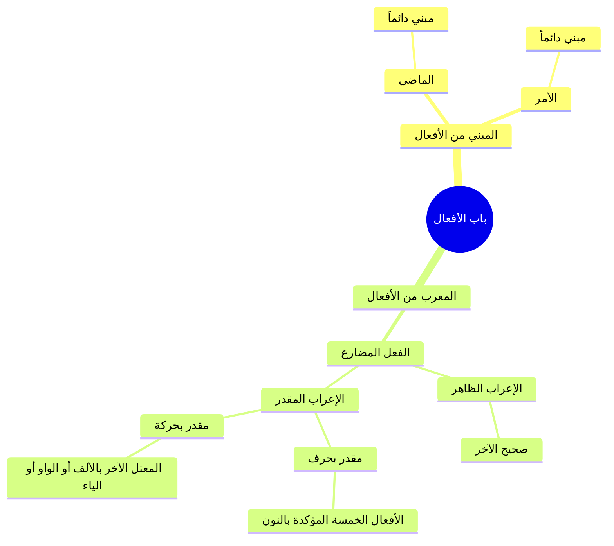

# 08 - موضع الدرس في باب الأفعال والإعراب المقدر بالحركة

> 📌 **مرجع التفريغ:** الأسطر 450–650 من تفريغ المحاضرة 4.

---

## 1️⃣ التلخيص العلمي المنظم

### الخريطة المنهجية لباب الأفعال (بين الأزهرية والآجرومية)

أجاب الشيخ عن تساؤل الطلاب حول موضع هذه التفريعات من أبواب النحو، مبيناً أنها جميعاً تقع في **[[باب الأفعال]]**:

**روابط الخريطة:** [[المبني من الأفعال]]، [[المعرب من الأفعال]]، [[الفعل المضارع]]، [[الإعراب الظاهر]]، [[الإعراب المقدر]].

### أحوال الإعراب المقدر بالحركة في المعتل الآخر

| نوع المعتل | حرف العلة | حكم الرفع | حكم النصب | حكم الجزم | علة التقدير |
|---|---|---|---|---|---|
| **المعتل بالألف** | `الألف` (نحو: `يَخْشَى`) | ضمة مقدرة | فتحة مقدرة | حذف حرف العلة (`لَمْ يَخْشَ`) | **التعذّر** (استحالة تحريك الألف) |
| **المعتل بالواو** | `الواو` (نحو: `يَدْعُو`) | ضمة مقدرة | **فتحة ظاهرة** لخفتها (`لَنْ يَدْعُوَ`) | حذف حرف العلة (`لَمْ يَدْعُ`) | **الاستثقال** في الرفع، والظهور في النصب |
| **المعتل بالياء** | `الياء` (نحو: `يَرْمِي`) | ضمة مقدرة | **فتحة ظاهرة** لخفتها (`لَنْ يَرْمِيَ`) | حذف حرف العلة (`لَمْ يَرْمِ`) | **الاستثقال** في الرفع، والظهور في النصب |

> 💡 **تطبيق قرآني إضافي:** في قوله تعالى: ﴿لَتَدْخُلُنَّ﴾؛ أصلها `تَدْخُلُونَـنَّ`، حُذفت نون الرفع لتوالي النونات، ثم حُذفت واو الجماعة لالتقاء الساكنين لوجود الضمة على اللام دليلاً عليها، وبقي الفعل معرباً مرفوعاً بالنون المقدرة.

---

## 2️⃣ نص المتحدث الكامل (الأسطر 450–650)

> وما يقدر استثقالاً: فاما ما يقدر تعذراً فهو ما في اخره الف نحو: يخشى، فيقدر فيه الضمة والفتحة نحو: هو يخشى، ولن يخشى. واما ما يقدر استثقالاً فهو ما في اخره واو نحو: يدعو، او ياء نحو: يرمي، فانه يقدر فيه الضم فقط، وتظهر الفتحة على الواو والياء لخفتها.
>
> سيبك من لتبلونّ، خذ: **لتدخلُنّ**؛ التشكيل: اللام مفتوحة، التاء مفتوحة، الدال ساكنة، الخاء مضمومة، اللام مضمومة، النون مشددة مفتوحة: ﴿لَتَدْخُلُنَّ الْمَسْجِدَ الْحَرَامَ﴾. كانت اصلها: تدخلون + نَّ، التقى ثلاث نونات، فحذفنا نون الرفع لتوالي الامثال، والتقى ساكنان: الواو ونون التوكيد، فحذفنا الواو لوجود الضمة دليلاً عليها.
>
> الطالب بيسأل: احنا تحت انهي باب دلوقتي في الآجرومية؟ انت تحت **باب الافعال**! مش انت عندك الافعال: ماضٍ ومضارع وأمر؟ الماضي مبني، والامر مبني، والمضارع معرب. صحيح الاخر: يضربُ (مرفوع بالضمة)، لن يضربَ (منصوب بالفتحة)، لم يضربْ (مجزوم بالسكون).
>
> طب لو معتل الآخر زي يخشى؟ يخشى: مرفوع بضمة مقدرة، لن يخشى: منصوب بفتحة مقدرة، لم يخشَ: مجزوم بحذف حرف العلة. فالشيخ الازهري ذكر لك المقدر في يخشى والصحيح، ولقى ان فيه حاجة ما قالهاش ابن آجروم وهي المقدر فيه حرف، فاضطر يشرحها لك مع المقدر فيه حركة. عرفت كده دخلت ازاي تحت باب الافعال؟
