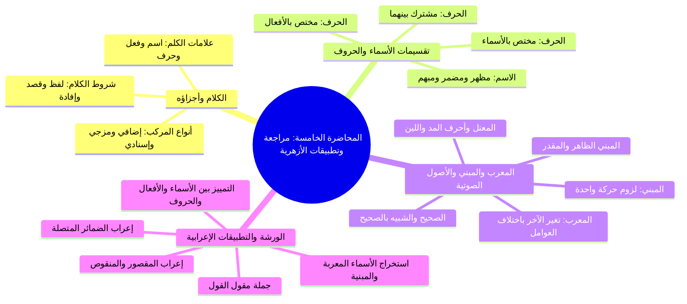

# 00 - فهرس وخطة المحاضرة الخامسة — مراجعة شاملة وتطبيقات إعرابية في الأزهرية

> [!info] نطاق المصدر وبيانات المجلس
> - **المصدر المعتمد:** [[تفريغ المحاضرة 5]] في كتاب «المقدمة الأزهرية» للشيخ خالد الأزهري رحمه الله تعالى (المتوفى في القرن العاشر الهجري).
> - **طبيعة المجلس:** مجلس مراجعة تأصيلية وتطبيقات إعرابية تفاعلية؛ شمل مراجعة شروط الكلام، وعلامات الكلم، وتقسيمات اللفظ والمركب، وتقسيمات الاسم والحرف، وحقيقة المعرب والمبني، وأحكام الصحيح والشبيه بالصحيح والمعتل، ثم تطبيقات وتدريبات عملية مكثفة على استخراج المعرب والمبني بنوعيهما من نصوص فصيحة.
> - **المرجع المعتمد:** أرقام الأسطر (1 – 482) لعدم وجود توقيتات زمنية مسجلة بالتفريغ.

---

## 📋 خطة الأجزاء وتوزيع الأسطر

| الرقم | الملف | نطاق الأسطر | المحاور الأساسية والتطبيقات المشروحة |
|:---:|:---|:---:|:---|
| **01** | [[01 - شروط الكلام وعلامات الكلم وأنواع المركب]] | 1 – 100 | الافتتاح والدعاء، شروط الكلام الثلاثة، علامات الاسم والفعل والحرف، دلالة الطلب مع ياء المخاطبة، أنواع المركب الثلاثة (إضافي ومزجي وإسنادي) |
| **02** | [[02 - أقسام الاسم والحرف من حيث الاختصاص والاشتراك]] | 101 – 156 | التقسيم الثلاثي للاسم (مظهر ومضمر ومبهم من إشارة وموصول)، وأقسام الحرف الثلاثة (مختص بالأسماء، مختص بالأفعال، مشترك بينهما) |
| **03** | [[03 - حقيقة الإعراب والبناء والشبيه بالصحيح والمعتل]] | 157 – 268 | الفارق بين المعرب والمبني (تشبيه الحرباء والصعيدي)، الصحيح والشبيه بالصحيح والمعتل، حروف المد واللين والفرق الصوتي بينهما، علة التقدير عند العرب |
| **04** | [[04 - المبني الظاهر والمقدر وبدء الورشة الإعرابية]] | 269 – 364 | المبني ظاهر البناء ومقدره (حذام وسيبويه عند النداء)، انطلاق ورشة التطبيقات (ص 20-21 من الأزهرية): استخراج المعرب والمبني، إعراب لفظ الجلالة والضمائر |
| **05** | [[05 - التدريبات الإعرابية المتقدمة وخاتمة المجلس]] | 365 – 482 | معالجة إعراب «الراضي» وجملة مقول القول، التمييز بين «الظَّنّ» و«ظَنَّ» و«ظَلَّ»، اسمية الحرف وفعليته (ليس وقد)، الاسم الموصول «مَنْ»، وخاتمة المجلس |
| **06** | [[06 - خطة المذاكرة والتطبيق]] | ملحق تطبيقي | خطة عمل تنفيذية بمراحل عملية ومربعات اختيار `- [ ]` لضبط المسائل النحوية وتطبيق الإعراب |
| **—** | [[ملخص المراجعة السريعة]] | مراجعة شاملة | بطاقة استذكار مكثفة وجداول حاصرة لقواعد المجلس الفقهية والنحوية |
| **—** | [[أسئلة المراجعة والاختبار الذاتي]] | تقييم الفهم | بنك أسئلة موضوعية ومقالية وتطبيقات إعرابية مع حلول نموذجية مطوية |
| **—** | [[المحاضرة الخامسة الأزهرية - ملف مجمع]] | ملف شامل | الجمع الكامل لجميع الأجزاء مع نص المتحدث الحرفي كاملاً وبدون حذف |

---

## 🗺️ خريطة المفاهيم العامة للمجلس

---

## 🔑 المفاهيم والكلمات المفتاحية (WikiLinks)

- [[المقدمة الأزهرية]]
- [[الشيخ خالد الأزهري]]
- [[شروط الكلام]]
- [[علامات الاسم]]
- [[علامات الفعل]]
- [[ياء المخاطبة مع الطلب]]
- [[المركب الإضافي]]
- [[المركب المزجي]]
- [[المركب الإسنادي]]
- [[الاسم المظهر]]
- [[الاسم المضمر]]
- [[الاسم المبهم]]
- [[الحرف المختص]]
- [[الحرف المشترك]]
- [[المعرب والمبني]]
- [[الشبيه بالصحيح]]
- [[حروف المد واللين]]
- [[البناء المقدر]]
- [[سيبويه وحذام]]
- [[الضمائر المتصلة]]
- [[جملة مقول القول]]

---

## 🔗 التنقل السريع

- **البدء بالجزء الأول:** [[01 - شروط الكلام وعلامات الكلم وأنواع المركب]]
- **الملف المجمع الكامل:** [[المحاضرة الخامسة الأزهرية - ملف مجمع]]
- **ملخص المراجعة:** [[ملخص المراجعة السريعة]]
- **الاختبار الذاتي:** [[أسئلة المراجعة والاختبار الذاتي]]
