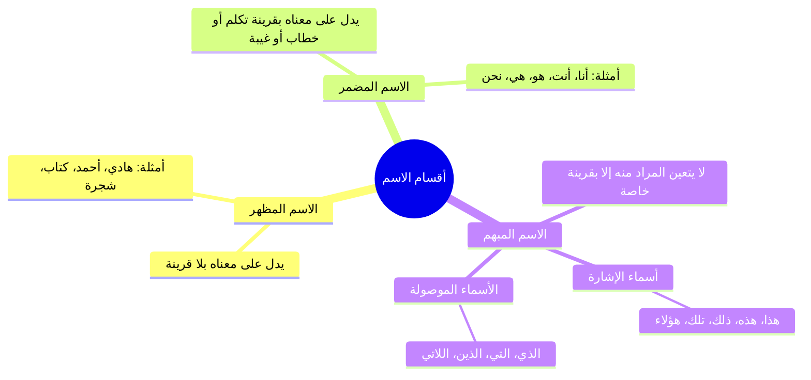

# 02 - أقسام الاسم والحرف من حيث الاختصاص والاشتراك

> [!info] الفترة المرجعية
> الأسطر: 101 – 156 من [[تفريغ المحاضرة 5]] في شرح «المقدمة الأزهرية» للشيخ خالد الأزهري رحمه الله (المرجع المعتمد أرقام الأسطر لعدم وجود توقيت زمني بالتفريغ).

---

## 📝 الملخص العلمي المنظم

### 1. التقسيم الثلاثي للاسم (مظهر، ومضمر، ومبهم)

| قسم الاسم | ضابطه وتعريفه | الأمثلة التوضيحية |
|:---|:---|:---|
| **المظهر** | ما دل على معناه ومسماه من غير حاجة إلى قرينة (تكلم أو خطاب أو غيبة أو إشارة). | **هادي**، **أحمد**، **محمد**، **الدار**. |
| **المضمر** | ما دل على مسماه بقرينة تكلم (أنا)، أو خطاب (أنتَ)، أو غيبة تقدم ذكر صاحبها. | قولك: «أحمد زارني، **هو** زارني» فـ «هو» ضمير يعود على مذكور سابق. |
| **المبهم** | ما لا يتعين معناه إلا بقرينة خارجة، ويندرج تحته صنفان: | 1. **أسماء الإشارة:** للقريب (هذا، هذه، هؤلاء) والبعيد (ذلك، تلك). 2. **الأسماء الموصولة:** (الذي، التي...) لأنها تفتقر دائماً إلى جملة الصلة لبيان المراد منها. |

---

### 2. مراجعة سريعة لأقسام الفعل الثلاثة

- **الماضي:** ما دل على حدث وقع في الزمان الذي قبل زمن التكلم، وعلامته قبول تاء التأنيث الساكنة (مثل: **أَكَلَ**، **شَرِبَ**).
- **المضارع:** ما دل على حدث يقع في زمن التكلم أو بعده، وعلامته قبول «لم» أو «السين» (مثل: **يَشْرَبُ**، **يَأْكُلُ**).
- **الأمر:** ما دل على طلب حصول حدث في المستقبل، وعلامته دلالة الطلب مع قبول ياء المخاطبة (مثل: **اشْرَبْ**، **كُلْ**).

---

### 3. أقسام الحروف الثلاثة من حيث الاختصاص والاشتراك

- ا قاعدة تقسيم الحروف: تنقسم الحروف في لسان العرب من حيث دخولها على الجمل إلى **ثلاثة أصناف رئيسية**:

| نوع الحرف | ضابطه وحكمه | أهم أمثلته في العربية |
|:---|:---|:---|
| **حرف مختص بالأسماء** | لا يدخل إلا على الأسماء فقط، ويعمل في الغالب الجر أو النصب، وهو من علامات الاسمية. | - **حروف الجر:** (مِن، إلى، عن، على، في، الباء، الكاف، اللام...). - **«أل» التعريف:** الداخلة على النكرات. |
| **حرف مختص بالأفعال** | لا يدخل إلا على الأفعال، ويعمل فيها النصب أو الجزم، أو يفيد الاستقبال والتحقيق. | - **أدوات النصب:** (لَنْ، أَنْ، كَيْ، حَتَّى...). - **أدوات الجزم:** (لَمْ، لَمَّا، لام الأمر، لا الناهية). - **حروف التنفيس والتحقيق:** (قَدْ، السِّين، سَوْفَ). |
| **حرف مشترك بينهما** | يدخل تارة على الأسماء وتارة على الأفعال دون أن يختص بأحدهما، ولا يعمل عملاً إعرابياً. | - **«هَلْ» الاستفهامية:** (هل قام زيدٌ؟ / هل زيدٌ قائمٌ؟). - **همزة الاستفهام:** (أقام زيدٌ؟ / أزيدٌ قائمٌ؟). - **«ما» النافية:** (ما قام زيدٌ / ما زيدٌ قائمٌ). |

---

## 🗣️ نص المتحدث الكامل

> **[أقسام الاسم: مظهر ومضمر ومبهم، وأقسام الفعل - الأسطر 101 - 125]:**
> طيب الاسم ثلاثه انواع اخرى غير الايه ها
> مظهر
> مظهر
> مضم
> ومضمر ومبهر جميل مظهر زي ايه يا عم الشيخ خالي
> زي هادي
> زي هادي تزم نفسه مبهم زي ايه يا شيخ مصطفى
> ده مبهم
> ده مبهم برض انت
> كده مبهم فيدام الناس هو
> ده مبهم برض
> بقول هو ده مبهم قوللك احمد زارني
> هو زارني
> بعد كده قلتلك جاء من مثلا من دار السلام جاء هو من دار السلام فانت عارف ان ده على احمد مش مهم ولا حاجه قول
> هو هذا وهديه
> اه اسماء الاشاره هذا هادي
> يبقى هادي لوحده اسمه ايه مظهر وهذا هادي
> مجهر
> اه مجهر لو انا قلت هذا هادي بس انا هقول بقى هذا اي حاجه ثانيه يبقى هذا ده اسم اشاره اسم اشاره شاور بقى على الا شاور عليه انت شفته ما شفتوش مش بتفرق مع بيعتبروه اسم مبهم كذلك الايه الاسماء الاشار البعيد سواء قريب زي هذا وهذه واخواتها او كذلك ذلك وتلك واخواتها ايه تاني غير اسماء الاشاره مش فاكر قلت لكم ولا لا بس هي يعني زياده على الاسماء الاشاره في حاجه تانيه اسماء مفهمه غير اسماء الاشاره اسماء الموصوله اسماء الايه الموصوله والحرف والفعل خلاص قلنا ثلاثه اقسام الفعل ثلاث اقسام الشيخ محمد فاكرهم
> اه
> ماضي
> ممتاز ماضي ازاي ماضي اكل
> ماشي مضارع
> مثلا يشرب
> يشرب امر

> **[أقسام الحرف: مختص بالأسماء ومختص بالأفعال ومشترك - الأسطر 126 - 156]:**
> صلي احسن واحده الحرف ثلاثه اقسام ايه ده كمان حرف لاث اقسام شغلانه دي ولا ايه لما حاجه تنور معاك قولي
> مختص بالاسماء ومختص بالافعال ومشار
> جميل مختص بالاسماء مختص بالافع ايه ده في حرف خاص بالاسماء بس حرف خاص بالافعال بس في حرف بيجي مع الاسماء ويجي مع الافعال ما بيزعلش حاجه زي يعني شيخ محمد ياتي مع الافعال
> قول اللي ياتي مع الافعال قول انت اللي يعجبك فيه كان قصدي بقى فيس ما تاتي مع الافعال وت وقد برض من الحروف قد يكون
> يعني قد دي بتيجي مع الافعال بس
> اه مع الافعال بس
> طيب يعني وايه تاني ممكن يجي مع الافعال بس هنقول برض السينسه او الحروب الحروبه
> ماشي ايه تاني يا عم الشيخ مصطفى الفعل
> ايه الاحروف اللي بتاتي مع الايه انت بتجاوب ولا
> بتسال طب قول
> لا المسيح دي تاتي مع الاسماء
> هو مع الاسماء يبقى بيجي مع الاسماء بس ماشي اللي هو الاقل التعريف
> هل بتيجي مع الاسماء
> هل بتيجي بالاسماء والافعال ماشي ايه تاني
> عندنا ايه تاني
> قول الشغله دي
> وبنسبه للاسماء من وفي اللي هي حروف الجر او حروف
> يبقى حروف الجر تاتي مع
> الاسماء
> الاسماء فقط دي بل علامه من علامات الايه
> الاسم
> الاسم حروف الجرفعال
> اللي احنا اخدناها المفترض فين في هو الافعال اللي هي المواصف الجواب اللي هي لم ولن
> ادوات النصب وات الجزم لا تاتي الا مع الافعال فقط ادوات النصب اللي هي زي ايه
> النصب لنحتى
> طب وادوات الجزم
> لا لم ولما ولم
> لم ولما وايه
> والما
> اه الى اخره في حروف مشركه اللي هي الحال وما والهم

---

## 🔍 المراجعة الداخلية (5 نقاط عشوائية)

1. **البداية (سطر 101 - 107):** مطابقة تامة لتقسيم الاسم إلى مظهر ومضمر ومبهم وتمثيل المظهر بـ «هادي».
2. **منتصف البداية (سطر 108 - 119):** مطابقة تامة لبيان أن «هو» ضمير لتقدم مرجعه وتمثيل المبهم بأسماء الإشارة (هذا، هذه، ذلك، تلك) والأسماء الموصولة.
3. **المنتصف (سطر 120 - 128):** مطابقة تامة لأقسام الفعل الثلاثة (ماضٍ، مضارع، أمر) وبدء حصر أقسام الحرف الثلاثة.
4. **منتصف النهاية (سطر 129 - 145):** مطابقة تامة للأمثلة الحرفية المختصة بالأفعال (قد، السين، سوف) والمختصة بالأسماء (حروف الجر كـ من وفي، وأل التعريف).
5. **النهاية (سطر 146 - 156):** مطابقة تامة لذكر أدوات النصب والجزم (لن، لم، لما) والحروف المشتركة كـ «هل» و«ما» والهمزة.

---

## 🔗 التنقل

- **السابق:** [[01 - شروط الكلام وعلامات الكلم وأنواع المركب]]
- **التالي:** [[03 - حقيقة الإعراب والبناء والشبيه بالصحيح والمعتل]]

> [!success] حالة الإنجاز: الجزء 2 من 5 مكتمل | المتبقي: 3 أجزاء وملحقاتها.
