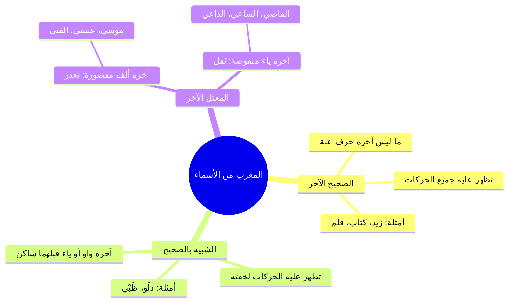

# 03 - حقيقة الإعراب والبناء والشبيه بالصحيح والمعتل

> [!info] الفترة المرجعية
> الأسطر: 157 – 268 من [[تفريغ المحاضرة 5]] في شرح «المقدمة الأزهرية» للشيخ خالد الأزهري رحمه الله (المرجع المعتمد أرقام الأسطر لعدم وجود توقيت زمني بالتفريغ).

---

## 📝 الملخص العلمي المنظم

### 1. الفارق المنهجي بين المعرب والمبني وتشبيهات الشيخ

| المصطلح | التعريف والضابط العلمي | التشبيه التوضيحي من الدرس |
|:---|:---|:---|
| **المعرب** | ما تغيرت حركة آخره لفظاً أو تقديراً بسبب اختلاف العوامل الداخلة عليه (رفعاً أو نصباً أو جراً). | **كالحرباء:** تتلون وتتغير وتتكيف بحسب الموضع والمحيط الذي توضع فيه. |
| **المبني** | ما لزم حالة واحدة وصورة ثابتة في آخره لا يفارقها مهما اختلفت وتغيرت العوامل الداخلة عليه. | **كالرجل الصعيدي الأصيل:** معتز بجلابيبه وعمامته وثابت على مبدئه؛ إن سافر إلى باريس أو عاش في الصعيد لم يغير هيئته. |

---

### 2. تقسيمات المعرب: الصحيح، والشبيه بالصحيح، والمعتل

---

### 3. التحقيق الصوتي الدقيق: الفرق بين حروف المد واللين والشبيه بالصحيح

- ا ضوابط نطق حروف العلة في العربية:

| المصطلح الصوتي | شرطه وضابطه | الأمثلة | حكم ظهور الإعراب |
|:---|:---|:---|:---|
| **حرف المد والعلة المحض** | واو ساكنة قبلها ضمة (حركة مجانسة)، أو ياء ساكنة قبلها كسرة، أو ألف مفتوح ما قبلها دائماً. | **نُوح**، **مُوسَى**، **لُوط**، **القاضِي** | تُقدّر عليه الحركات: **للتعذر** على الألف، و**للثقل** على الياء والواو (إلا الفتحة فتظهر لخفتها على الياء والواو). |
| **حرف اللين** | واو أو ياء ساكنة قبلها **حركة غير مجانسة (فتحة)**. | **خَوْف**، **لَوْن**، **عَوْل**، **بَيْت** | حكمه حكم المد في التجويد، لكنه في بنية الكلمة أثبت في الوزن. |
| **الشبيه بالصحيح** | واو أو ياء متطرفة في آخر الكلمة **سبقها حرف ساكن صحيح**. | **دَلْـوْ**، **ظَـبْـيْ** | **تظهر عليه جميع حركات الإعراب** (الرفع بالضمة، والنصب بالفتحة، والجر بالكسرة) لخفته: «هذا دَلْوٌ، ورأيتُ دَلْواً، ونظرتُ إلى دَلْوٍ». |

---

### 4. حكمة وفلسفة التقدير عند العرب

- ا قاعدة لسان العرب: لسان العرب جُبل على **الميل إلى الخفة والبساطة وإزالة الاستثقال**:
  1. إذا أدى ظهور الحركة إلى استثقال في النطق أو تنافر وتوالي أمثال، قدّرت العرب الحركة أو أبدلت الحرف أو حذفته.
  2. النحاة لم يخترعوا هذه القواعد اختراعاً، بل تتبعوا السليقة العربية الصافية وقاسوا عليها لتقريب الفهم للأجيال.
- **أقسام الإعراب المقدر:**
  - **مقدر بالحركات:** للتعذر (المقصور)، أو للثقل (المنقوص)، أو لاشتغال المحل بحركة المناسبة (المضاف لياء المتكلم).
  - **مقدر بالحروف:** كما في الأفعال الخمسة المؤكدة بالنون مع واو الجماعة أو ياء المخاطبة، أو جمع المذكر السالم المضاف لياء المتكلم (نحو: متبعيّ ومكرميّ).

---

## 🗣️ نص المتحدث الكامل

> **[الفرق بين المعرب والمبني وتشبيه الحرباء والصعيدي - الأسطر 157 - 175]:**
> اه يبقى الحروف المشتركه زي ايه زي هل وايه بعد كده اتكلمنا عن المعرب والمبني وقلنا الفرق بين المعرب والمبني ايه قلنا الاسمون المعرب ومبني قلنا المعرب
> ونبغير
> يبقى هو ما تغير اخره بعامل يقتدي الايه
> الرفع او النصب او الجر اللي هو بسبب تغيير اختلاف العوامل الداخله عليه صح طب والمبني
> يلزم صوره واحده
> بخلاف ما يلزم صوره واحده ايه مع اختلاف العوامل داخله عليه يعني هو شكله هو هو ما بيتغيرش ده المبنى يعني مثلا تلاقي كلمه هؤلاء
> كلمه امس في اي حته في الجمله في اي حته بيتكلم عليها حد يجيب قبليها فعل يجيب قبليها فاعل يجيب قبليها مبتدا يجيب قبليها حرف جر عيش حياتك زي ما انت عايز هي امسي زي ما هي تحتيها ك* حيث اعمل فيها زي ما انت عايز هي تفضل حيث بالضم كنا بنشبهها قلنا دايما بالراجل ايه صاحب المبادئ زي الجماعه الصعيده كده هو لابس اللبس بتاعه معتز بيه في اي حته توديه قاهره هو لابس عمامته الجميله وجلابيته البلدي واديه فرنسا هو برض لابس عمامته الجميله وجلابيته البلدي لا عمره هيعهاب الشرطه ولا يشوف الناس هناك لابسين تيشرتات وبناديل وبتاع يوم مغير لا هو الراجل معتز باص ما بينسلخش من اصلا غير الناس اللي هي الايه مع الايه مع ده شغال كده وم ده شغال كده العمليه ماشيه مع لا في فرق المبني قلناه والمعرب قلناه طيب المعرب قلنا قسمان خلي بالك يعني قاعدين ايه ناخدها حته حته اهو سريعا بس فضل تعالى برض يعني بديك امثله تبقى انت فاهم مش مجرد مراجعه بس يبقى انت مستوعب انتوا امتحانتوا المره اللي فاتت ولا الشيخ ما امتحانوشحش
> نسي امتحان كنت بس وسي
> مش الاسبوع مش مهم الخميس اللي فات اللي قبليه
> ما امتحناش ما امتحناش احنا
> خالص امتحان الشمص ش
> اه بعد كده بقى جاشفت
> كان جاي بقى
> خلاص نبقى نوص عليكم ان شاء الله عشان
> عشان تراجعوا دي فرصه تراجعوا معايا طب قلنا المعرب قال لك قسمانده بالتطبيق
> لا اللي هو الايه
> بالحروف اه ضرب الحروف
> الاول هاخد ما يظهر
> اعرابه وما يقدر يبقى اللي هو بيعرب اعراب ظاهر بيعرب اعراب مقدر يعني ايه بيعرب اعراب ظاهر واعراب مقدرش خدع معايا ولا الجماعه بتوع الانجليزي النهارده مش في عندكم تاريخ تاريخ

> **[الصحيح والشبيه بالصحيح ومقارنة الدلو والظبي بالمعتل - الأسطر 176 - 227]:**
> اه استاذ خالد تاريخ
> الصف بتاع المدرسين اللي انت شغال ايه يا عبد الحميد اوعى تكون مدرس انت كمان
> لا صيدلي
> صيدلي يعني اثنين مدرسين وواحد صيدلي ربنا يستر كويس حد حتى يجيب لنا العلاج بتاعهم يبقى كده ايه
> يظهر اعرابه وما يقدر يعني ايه يظهر ويقدر
> يعني اخر حرف صحيح
> لو اخر حرف صحيح هيبقى اعربه ايهظاه
> وظاهر لو اخره حرف من حروف الايه العله يبقى مقدر طب في حاجهانيه في التقدير سبوي المنادى ان ده هو دخل عليه منادى فهو في محل نصب قدر عليه الضمه عشان هو اسمه مفرد بيظهر على الاسم اللي بعده
> يبقى انا عندي في الصحيح اللي هو بيظهر عليه الاعراب عندي يا اما يكون هو صحيح الاخر يا اما يكون يشبه الايه الصحيح المهم مش اخره حرف عله ايه شبيه بالصحيح ده اخدنا شبيه الصحيح ولا ماخد الوا
> يظهر الضم يظهر عليها
> لا الشبيه بالصحيح خدناه ولا ما اخدناهوش اكلمنا على المقدر بس ماكلمناش على ال
> لا خدنا اللي هو او واو وياء قبلها ساكن
> قبلها ساكن يبقى اخدناه
> ايوه
> زي ايه دلو وايه
> وظبي
> وظبي ايه الفرق بين دلوخرها واو وظبي اخرها ياء بينها مثلا وبين كلمات زي موسى وعيسى ومدعو ومرجو
> موسى وعيسى
> وساعي
> اسم مقصود مش هيظهر عليه ابدا
> يعني لما اجي اقول دلوقتي عندي في دلو اخرها واو ومدعو اخرها واو ايه الفرق
> يعني لما اجي اقول مثلا اشتريت الدلو اقول الدلوه ما فيهاش مشكله سواء مثلا رايت المد عو واضحه يبقى الاتنين بالفتحه طب لما اجي اقول مثلا في الدلو نظرت الى الدلو اخرها واو دي مش اخرها واو
> طب اقول سلمت على المدعو خيرها واو ولا مش غيرها واو
> طب المفروض اللي بعد حرف الجر يبقى ايه
> مقصور
> طب لما اجي اقول نظرت الى المدعوي ولا الى المدعو سلمت على المدعو سلمت على المحامي سلمت على القاضي اخرها ياء ولا مش اخرها ياء اخرها ياء طب القاضي هينفع احط تحتها كسره
> استثقال
> هتبقى ايه ثقيله لكن في الظبي مررت بظبيين وظبي نظرت الى ظبي فيها مشكله ولا ما فيهاش
> ما فيهاش
> طب نظرت الى دلو في مشكله ولا ما فيهاش
> ما فيهاش مشكله طب ليه هنا في مشكله وهنا ما فيش مشكله الحرف اللي قبله ساكن
> الحرف اللي قبل ساكن السكون وال يبقى الواد الصحيح اه ان الواو دي علشان تبقى حرف عله لازم يبقى الحرف اللي قبلها فيه
> ها
> الحركه المشابهه ليها ايه الحركه المجانسه للواو
> الضمه
> الضمه يعني عشان تبقى الواو دي حرف مد لازم الحرف اللي قبليها يبقى عليه ايه
> ضمه

> **[حروف المد واللين وعلل لسان العرب في التقدير - الأسطر 228 - 268]:**
> طب لو دي ياء تبقى الحركه اللي جنسها ايه ولا اقول تاني
> نقول تاني دلوقتي يعني عشان يبقى حرف عله حرف مد حرف المد ده همده ازاي وهو اللي قبلين ازاي يعني هل خوف في القران بتاعه الاله في قريش خوف عامله زي مثلا اا خوف لو احنا قلناها خوف في زيه زي دي
> لا طبعا
> طيب لما اجي اقول ادي خوف اهي وقول اهي بقول ايه ايه وعندنا عون بتاعه الايه الميراث ونجيب بقى حاجه عايزين حاجه فيها واو ايه واض في النص تبقى شبهها لون
> لون لا تبقى زي دول انا عايزينك تبقى ابنيه مضمون لون وخوف وعول كل ده ايه العين مفتوح عايزين اولها مضموم
> اولها مجموع
> اه وفي النص واو موس نص
> اهي موس بتاع سوره البقره صح
> موسى
> موسى الدماغ تشتغل كويس في حاجه تانيه حد حاضر حد زنه حاجه تانيه
> نوح
> نوح احسنت
> تنور اهو
> روت ايوه ايه
> ابو ايوه كده كنت مستنيها دي لوتلاقي ان كل دول قبلها ايه مضمضه فعشان كده الحرف ده كله حروف مد الواو دي كلها حروف ماديه وحرف ع لكن بص هنا لو
> خوف
> خوف
> هو عود كل اللي قبلها ايه مفتوح حتى في القران لما تيجي تمد
> بيسموه مد ايه
> اه مد لي مش مد زي التاني مد طبيعي فتجد في اختلاف بسبب الايه الضمه والفتح فده اصبح ان الواو هنا اللي قبليها بالشكل ده بنسميها ايه
> اه حرف العله ده بحكم عليه ان هو معتل يبقى الفعل ده او الاسم ده اسمه معتل طب وديت
> ده شيل نفس شيل نفس
> هقول لا ده مش معتدل لان ايه قبليه مش نفس ا*** بتاعه مش كده وبس ده كمان قبليه ساكن فلما يكون قبليه ساكن ويجي بعديه واو او قبليه ساكن ويجي بعديه زي الظ فبقول عليه ايه ده شبيه بالصحيح يعني هو لا محصل الصحيح اللي اخره حرف مش من حروف العله ولا محصل معتدل اللي هو اخر حرف
> علم فلما اجي اقول المدعو واشدي عشان ده حرف مد مش هعرف احط عليه كده تحتيه كسر الحاجه الوحيده اعرف احطها عليه في الواو والياء احط فتقوللي ليه هو كده العار لما نطقوا نطقوها كده بخلاف الالف اللي هي بتاعه موسى طيب الظبي نفس الكلام والدلو لكن ممكن يقول الدلو والدلو والدلو هل وانت بتتذوق الكلمه في في صعوبه زي بتاعه
> زي القاضي مثلا اقوللك القاضي خط تحتيه كسره عامل زي الظبي الظبيه الظبيو الظبي فيها مشكله
> لا
> زي القاضي هاتها كده بثلاث اشكال
> القاضي
> القاضي
> القاضي
> القاضي القاضي كذلك مدع مد عو مدعو المدعوي عامله زي دي زي دلو الدلو الدلو تحس ان دي كان شخاها هو اصلا يبقى انا لو اعتمدت حتى على التذوب وان كان ده مش الاصل ولكن تبقى انت فاهم الايه
> الق
> اه يبقى انت تبقى حاسس ان هم ليه بيعملوا الكلام ده مش بيعملوه تعريب هم بيعملوه عشان خاطر ايه العربيه اهل العربيه عملوا كده ودايما تلاقي اهل العربيه دول عندهم تاويل يعني مش بيجيبوا الكلام وخلاص لا ده هو شوف لما احنا جربنا الكلام اللي هم عملوه والنحاه طلعوه في قواعد يعني هم بيقولوه كده بالسليقه والنحاه جم عملوا له قاعده واحنا جينا بنجرب نشوف الكلام بتاعهم بتاع العرب وبتاع النحاده صح ولا لا فتجد ان ايه ان الكلام بسيط ويجميل للبساطه وده موضوع التقدير لما جينا في التقدير المرات اللي فاتت وشلنا حاجات علشان تسهل الايه توالي
> الاوسال امثال ومش عارف وصعوبه النطق وفي مشاكل في واو موجوده هحذفها عشان في بعديها ساكن اي حاجه تلاقي فيها صعوبه فتلاقي العربي يميلوا لايه
> لازالته اه وبعد كده اتكلمنا على المقدر قلنا ما يقدر فيه حرف وما يقدر فيه ايه حركه ما يقدر فيه حرف وما يقدر فيه ايه
> حركه
> حركه انزل لكم شويه تدريبات كده عشان تصحصحوا شويه
> صل على رسول الله
> صلى الله عليه وسلمكم الشيخ جايب تدريبات ولا الشيخ جايب عن صح
> اه

---

## 🔍 المراجعة الداخلية (5 نقاط عشوائية)

1. **البداية (سطر 157 - 163):** مطابقة تامة لتعريف المعرب والمبني وأمثلة (هؤلاء، أمسِ، حيثُ) وتشبيه المبني بالرجل الصعيدي المعتز بزيه.
2. **منتصف البداية (سطر 164 - 184):** مطابقة تامة للحديث عن الامتحان السابق والملاطفة مع مهن الحاضرين (مدرس وصيدلي) وتعريف الإعراب الظاهر والمقدر.
3. **المنتصف (سطر 185 - 205):** مطابقة تامة لتعريف الشبيه بالصحيح (دلو وظبي) وتجربة نطق الحركات مع «المدعو» و«القاضي».
4. **منتصف النهاية (سطر 206 - 248):** مطابقة تامة لشرط حركة المجانسة للواو (الضمة في نوح وموسى) والفرق بين حرف المد وحرف اللين (خوف ولون وعول).
5. **النهاية (سطر 249 - 268):** مطابقة تامة لحكم الشبيه بالصحيح وسليقة العرب في التخفيف ومنع توالي الأمثال وتمهيد الانتقال للتدريبات العملية.

---

## 🔗 التنقل

- **السابق:** [[02 - أقسام الاسم والحرف من حيث الاختصاص والاشتراك]]
- **التالي:** [[04 - المبني الظاهر والمقدر وبدء الورشة الإعرابية]]

> [!success] حالة الإنجاز: الجزء 3 من 5 مكتمل | المتبقي: جزآن وملحقاتهما.
