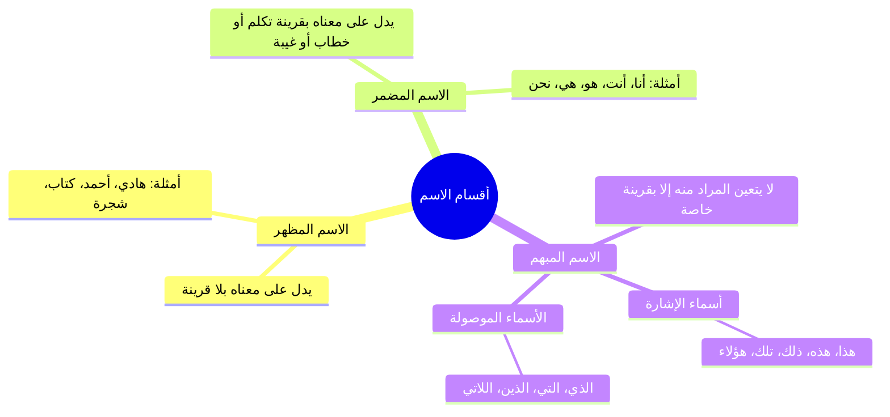
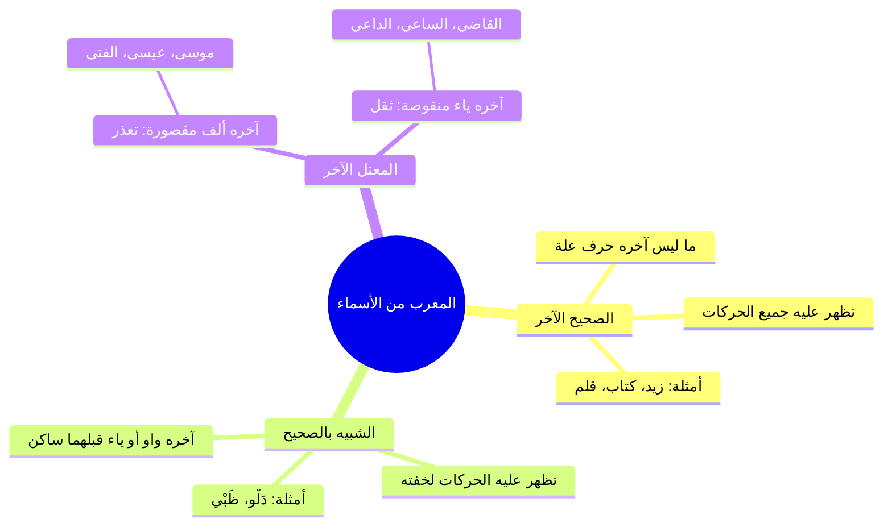

# المحاضرة الخامسة من شرح المقدمة الأزهرية — الملف المجمع الكامل

> [!abstract] محتوى الملف المجمع
> يجمع هذا الملف جميع أجزاء المحاضرة الخامسة من شرح «المقدمة الأزهرية» للشيخ خالد الأزهري رحمه الله تعالى بالتتابع الكامل:
> الملخصات العلمية المنظمة، والجداول، والمقارنات، والتحذيرات، متبوعة بـ **نص المتحدث كاملاً حرفياً بنصه الأصلي** دون حذف أي كلمة، ومجرداً من أقسام المراجعة والاختبارات والتوقيتات.

---

## 📑 فهرس الأجزاء المجمعة

1. **الجزء الأول:** شروط الكلام وعلامات الكلم وأنواع المركب (الأسطر 1 – 100)
2. **الجزء الثاني:** أقسام الاسم والحرف من حيث الاختصاص والاشتراك (الأسطر 101 – 156)
3. **الجزء الثالث:** حقيقة الإعراب والبناء والشبيه بالصحيح والمعتل (الأسطر 157 – 268)
4. **الجزء الرابع:** المبني الظاهر والمقدر وبدء الورشة الإعرابية (الأسطر 269 – 364)
5. **الجزء الخامس:** التدريبات الإعرابية المتقدمة وخاتمة المجلس (الأسطر 365 – 482)

---

# الجزء الأول: شروط الكلام وعلامات الكلم وأنواع المركب

## 📝 الملخص العلمي المنظم

### 1. شروط الكلام في اصطلاح النحويين

- ا تعريف الكلام عند النحاة: لا يُسمّى القول كلاماً مفيداً في علم النحو إلا إذا استوفى **ثلاثة شروط مجتمعة**:
  1. **اللفظ:** أن يكون صوتاً مشتملاً على بعض الحروف الهجائية التي أولها الألف وآخرها الياء.
  2. **القصد:** أن يقصده المتكلم بإرادته لإفادة المخاطب، فخرج كلام الساهي والنائم والسكران.
  3. **الإفادة التامة:** أن يحسن سكوت المتكلم والسامع عليه بحيث لا ينتظر السامع تماماً لمعنى زائد.

---

### 2. أجزاء الكلام وعلامات كل قسم

| قسم الكلمة | العلامات المميزة له | التنبيهات والضوابط العلمية |
|:---|:---|:---|
| **الاسم** | **الخفض (الجر)، التنوين، الألف واللام (أل)، ودخول حروف الخفض** | الاسم هو ما دل على معنى في نفسه غير مقترن بزمن وضعاً. |
| **الفعل** | **قد، السين، سوف، تاء التأنيث الساكنة، وياء المخاطبة مع دلالة الطلب** | ا تنبيه في ياء المخاطبة: لا تكون ياء المخاطبة دالة على فعل الأمر إلا إذا اقترنت **بدلالة الطلب**؛ فإن تجردت من الطلب كانت لمضارع من الأفعال الخمسة مثل: «لم تركعي» فهو مضارع مجزوم بحذف النون وليس فعلاً للأمر. |
| **الحرف** | **علامة عدمية** | علامته أنه **«لا يقبل علامة الاسم ولا علامة الفعل»**، كما قال الحريري: والحرف ما ليست له علامه ... فقس على قولي تكن علامه. |

---

### 3. تقسيمات اللفظ وأنواع المركب الثلاثة

- **ينقسم اللفظ إلى:**
  - **مفرد:** ما لا يدل جزؤه على جزء معناه، وينحصر في: (الاسم، والفعل، والحرف).
  - **مركب:** ما دل جزؤه على جزء معناه، وله **ثلاثة أقسام**:

| نوع المركب | ضابطه وتعريفه | الأمثلة التوضيحية من الدرس |
|:---|:---|:---|
| **المركب الإضافي** | كل كلمتين نُزلت ثانيتهما منزلة التنوين مما قبلها؛ فالأول مضاف والثاني مضاف إليه مجرور. | **عبد الرحمن**، **عبد الحميد**، **كتاب الغلام**، **حقيبتي**. |
| **المركب المزجي** | كل كلمتين امتزجتا وتداخلتا حتى صارتا في الاستعمال ككلمة واحدة. | **بعلبك**، **حضرموت**، **بورسعيد**، **بورفؤاد**. |
| **المركب الإسنادي** | جملة مفيدة تتكون من ركنين أساسيين: **مسند ومسند إليه**. | - فعل وفاعل: **قام زيدٌ**. - مبتدأ وخبر: **زيدٌ قائمٌ**. (تنبيه: لفظ «غلامي» ليس مركباً إسنادياً بل هو مركب إضافي). |

---

## 🗣️ نص المتحدث الكامل (الجزء الأول)

> **[الافتتاح والدعاء وشروط الكلام وعلامات الاسم والفعل والحرف - الأسطر 1 - 50]:**
> واض السلام عليكم
> وعليكم السلام ورحمه الله ا اعوذ بالله من الشيطان الرجيم بسم الله الرحمن الرحيم الحمد لله رب العالمين والعاقبه للمتقين ولا عدوان الا على الظالمين واشهد ان لا اله الا الله وحده لا شريك له واشهد ان محمدا عبده ورسوله صلى الله عليه وعلى اله وصحبه وسلم اجمعين خطبتم وطاب شااكم وتبواتم من الجنه منزلا اسال الله ان يتقبل منا ومنكمين وان يرزقنا واياكم الاخلاص في القول والعمل
> اللهم ارزقنا الاخلاص في القول والعمل
> امين
> وارزقنا الاخلاص في السر والعلمين
> اللهم اجعل عملنا كله صالحا
> ولوجهك خالصا ولا تجعل فيه لاحد غيرك شيئا اللهم اجعل عملنا هذا في موازين حسناتنا واهلينا اجمعين
> امين اللهم اجعله بركه علينا وعلى اهلنا اجمعين. اللهم اجعله بركه علينا وعلى اهل حينا واخواننا واخواتنا وعلى امتنا يا رب العالمين. اللهم اجعل مجالسنا هذه نصره لاخواننا المستضعفين في فلسطين
> في كل بقاع الارض يا رب العالمين. اللهم امين امين وصل اللهم وسلم وبارك على محمد وعلى اله وصحبه وسلم اجمعين. اما بعد نكمل ان شاء الله تعالى ما شرعنا فيه وهو في كتاب المقدمه الازهاريه الشيخ خالد تمام الكتاب جزاك الله خير الشيخ خالد الازهري رحمه الله تعالى متوفى في القرن العاشر الهجري فان شاء الله تعالى كنا وصلنا الى حد يذكرنا الحروف
> لغايه فين
> حكم الحروف
> حكم الحروف يعني اكلمنا على اجزاء الكلام صح قلنا ان الكلام في اصطلاح النحويين يشترط ثلاثه شروط صح ايه هما سريعا كده
> والقصد والفاده التامه
> اللفظ
> والقصد
> والقصد والافاده
> التامهفاده
> يبقى اللفظ والقصد والافاده التامه تاني ها
> اللفظ والقصد
> حتى لو انت مش عارف قول معان تبعد اللفظ والايه
> والقصد والايه والافاده الت وقلنا اجزاء الكلام الشيخ رحمه الله تعالى قال ان بتتركب من ثلاثه اشياء اللي هي
> اسم
> اسم وايهعل
> فعل وحرف وبعد كده قال علامات الاسم
> وذكر
> الخفضخنو تنوين
> تنوين
> والايه والالف واللام وحروف الايه الخفض وعلامه
> الشيخ خالد شويه
> الشيخ خالد الشيخ خالد الشيخ خالد من اكثر الطلاب المتميزين فيص
> ان شاء الله تعالى وعلامه الفعلقد تاء التانيث
> قد وسين وسوف وتاء التانيث الايه
> وياخ
> الساكنه وايه وياء المخاطبه مع الايه
> هي المخاطبه لوحدها كده
> مع دلاله الفعل دلاله الامر
> بعد اه يبقى مع الطلب
> يبقى هي المخاطبه مع الطلب انا ممكن اقول ايه ممكن اقول لم تركعي الياء دي تهم ان هي ياء مخاطبه بكلم واحده سته وفعلا هي مخاطبه
> بتاعه الافعال الايه؟
> الخمسه
> الخمسه لكن هل هنا فيها دلاله للطلب؟ لا لكن ايه اللي حصل؟ دي فعل من فعل خمسه ده فعل مضارع فعل ايه؟
> مضارع طيب لما اجي اقول اللفظ او علامات الحرف قلنا خلاص عرفنا الاسم والفعل الحرف علامته
> لا يقبل علامه الايه؟
> الاسم ولا
> ولا الفعل علامه ثم اللفظ اخدنا اللفظ كم قس مفرد ومركب
> مفرد ومركب كويس والمفرد قلنا كام قسم احنا بنعمل مراجعه سريعه عشان تفتكر اسم وفعل
> اسم
> نفس الكلام
> اسم وفعل
> اه
> اسم وفعل وحرف ما هو اللفظ ده حاجه من الثلاثه مش هيجي حاجه رابعه طيب والمركبض المسجد
> ثلاثه برض

> **[أنواع المركب ومناقشة الأمثلة مع الطلاب - الأسطر 51 - 100]:**
> احسنت ناخد بقى الثلاثه اللي ورا كده كل واحد يديني مثال على الايه الاضافي والاسنادي والمسجي يبدا با الشيخ خالد عشان ما يزعلش تفتكر الشيخ خالد
> طيب ناخد عبد الحميد اللي بعده
> اللي بعده
> قول يا عم الشيخ جمال
> ايه
> يعني احنا طالعين فيك السامع مشيخ جمال نقولشيخ جمال الشيخ جمال بقول بقول للشيخ احمد لما غيب عايزك تبقى يعني هندخل الشيخ جمال مكان ياخد المحاضره تحرقنا كده
> يعني مش عارف السؤال كده فاهم اي حاجه
> ده انا كده بجمع درس مش بجمع في حد ضايقك في المدرسه قول يا عم الشيخ
> اضافي زي عبد الرحمن
> اضافي زي عبد الرحمن ماشي طب
> مزجي
> مزجي زي بعلبك بعلبك
> ماشي بعلبك او ا ايه تاني
> حضرموت
> حضرموت او
> او
> بورسعيد بور فؤاد كتير طيب عم الشيخ مصطفى ايه التركيب النوع الثالث في التركيب الاسنادي
> الاسنادي اللي هو زي
> زيد الغلاميق
> غلامي اسندت الغلام دي غلامي
> اه غلام
> ماشي ده كده ا غلامي دي تبقى مركب اسنادي
> لا لا زي قائم اسندنا الفعل زي
> يبقى المركب الاسنادي ده عباره عن ايه
> فعل وفاعل
> فعل وفاعل مبتدا وخبر
> مسند مسند الموضوع ما فيهوش ايه تركيب واضحه اني يا عم الشيخ خال اختر لك واحده من الثلاثه وقول لي مثال اللي انت فهمتها من الثلاثه عبد الرحمن
> غير عبد الرحمن بقى ولا عبد الرحمن حاجه تانيه بس هات لنا مضاف ومضاف اليه
> عبد الرحيم
> هات لنا مضاف ومضاف اليه عبد الحميد بعديه مركب اضاف اليه عبد الحميد برض
> اه وهات لنا مضاف مضاف اليه اي مضاف مضاف اليه الشنطه اللي جنب حضرتك دي بتاعه مين
> عقبتي
> لا مضاف اه
> الشيخ عبد الحميد
> كتابي
> كتاب بي ايوه كده او كتاب الغلام كتاب الطالب كتاب احمد كتاب عبد الحميد اهو جبت عبد الحميد معاك برض بقى مضاف الشيخ عبد الحميد اختار لك واحده من الاثنين اللي باقيين عشان ما تبقاش غير واحده بس الشيخ الاول ماعرفهاش اوقفه
> مز حض
> وقعدوا على الكرسي مزجي يقول المسجد زي ايه
> حضرموت حضرموت ماشي اتباع ايه يا عم الشيخ جمال الاسلامي
> ايوه زي ايه
> غلامي غلابي زي
> ايه حكايه غلام معاه طب هو قال غلامي تعدي عليك انت هو قالها غلط بس غلامي دي مركب اسنادي يعني ايه مركب اسنادي يا عم الشيخ جما
> يعني المضاف بيرجع للمض
> لا مركب اسنادي يعني مسند ومسند اليه
> فده هتلاقيه فين في الفعل والفاعل او مبتدا وخبر انت النهارده حد مزعلك في الم مثلا استعج اقعد بن تفريج الهم ما تشيلهاش حاجه الواحد
> اه ما تشيلهاش هم ان شاء الله تعالى ما حدش يقدر يعمل لك حاجه
> كله عند ربنا والارزاق بله
> اكتر من كده وزح ربنا سبحانه وتعالى

---

# الجزء الثاني: أقسام الاسم والحرف من حيث الاختصاص والاشتراك

## 📝 الملخص العلمي المنظم

### 1. التقسيم الثلاثي للاسم (مظهر، ومضمر، ومبهم)

| قسم الاسم | ضابطه وتعريفه | الأمثلة التوضيحية |
|:---|:---|:---|
| **المظهر** | ما دل على معناه ومسماه من غير حاجة إلى قرينة (تكلم أو خطاب أو غيبة أو إشارة). | **هادي**، **أحمد**، **محمد**، **الدار**. |
| **المضمر** | ما دل على مسماه بقرينة تكلم (أنا)، أو خطاب (أنتَ)، أو غيبة تقدم ذكر صاحبها. | قولك: «أحمد زارني، **هو** زارني» فـ «هو» ضمير يعود على مذكور سابق. |
| **المبهم** | ما لا يتعين معناه إلا بقرينة خارجة، ويندرج تحته صنفان: | 1. **أسماء الإشارة:** للقريب (هذا، هذه، هؤلاء) والبعيد (ذلك، تلك). 2. **الأسماء الموصولة:** (الذي، التي...) لأنها تفتقر دائماً إلى جملة الصلة لبيان المراد منها. |

---

### 2. مراجعة سريعة لأقسام الفعل الثلاثة

- **الماضي:** ما دل على حدث وقع في الزمان الذي قبل زمن التكلم، وعلامته قبول تاء التأنيث الساكنة (مثل: **أَكَلَ**، **شَرِبَ**).
- **المضارع:** ما دل على حدث يقع في زمن التكلم أو بعده، وعلامته قبول «لم» أو «السين» (مثل: **يَشْرَبُ**، **يَأْكُلُ**).
- **الأمر:** ما دل على طلب حصول حدث في المستقبل، وعلامته دلالة الطلب مع قبول ياء المخاطبة (مثل: **اشْرَبْ**، **كُلْ**).

---

### 3. أقسام الحروف الثلاثة من حيث الاختصاص والاشتراك

- ا قاعدة تقسيم الحروف: تنقسم الحروف في لسان العرب من حيث دخولها على الجمل إلى **ثلاثة أصناف رئيسية**:

| نوع الحرف | ضابطه وحكمه | أهم أمثلته في العربية |
|:---|:---|:---|
| **حرف مختص بالأسماء** | لا يدخل إلا على الأسماء فقط، ويعمل في الغالب الجر أو النصب، وهو من علامات الاسمية. | - **حروف الجر:** (مِن، إلى، عن، على، في، الباء، الكاف، اللام...). - **«أل» التعريف:** الداخلة على النكرات. |
| **حرف مختص بالأفعال** | لا يدخل إلا على الأفعال، ويعمل فيها النصب أو الجزم، أو يفيد الاستقبال والتحقيق. | - **أدوات النصب:** (لَنْ، أَنْ، كَيْ، حَتَّى...). - **أدوات الجزم:** (لَمْ، لَمَّا، لام الأمر، لا الناهية). - **حروف التنفيس والتحقيق:** (قَدْ، السِّين، سَوْفَ). |
| **حرف مشترك بينهما** | يدخل تارة على الأسماء وتارة على الأفعال دون أن يختص بأحدهما، ولا يعمل عملاً إعرابياً. | - **«هَلْ» الاستفهامية:** (هل قام زيدٌ؟ / هل زيدٌ قائمٌ؟). - **همزة الاستفهام:** (أقام زيدٌ؟ / أزيدٌ قائمٌ؟). - **«ما» النافية:** (ما قام زيدٌ / ما زيدٌ قائمٌ). |

---

## 🗣️ نص المتحدث الكامل (الجزء الثاني)

> **[أقسام الاسم: مظهر ومضمر ومبهم، وأقسام الفعل - الأسطر 101 - 125]:**
> طيب الاسم ثلاثه انواع اخرى غير الايه ها
> مظهر
> مظهر
> مضم
> ومضمر ومبهر جميل مظهر زي ايه يا عم الشيخ خالي
> زي هادي
> زي هادي تزم نفسه مبهم زي ايه يا شيخ مصطفى
> ده مبهم
> ده مبهم برض انت
> كده مبهم فيدام الناس هو
> ده مبهم برض
> بقول هو ده مبهم قوللك احمد زارني
> هو زارني
> بعد كده قلتلك جاء من مثلا من دار السلام جاء هو من دار السلام فانت عارف ان ده على احمد مش مهم ولا حاجه قول
> هو هذا وهديه
> اه اسماء الاشاره هذا هادي
> يبقى هادي لوحده اسمه ايه مظهر وهذا هادي
> مجهر
> اه مجهر لو انا قلت هذا هادي بس انا هقول بقى هذا اي حاجه ثانيه يبقى هذا ده اسم اشاره اسم اشاره شاور بقى على الا شاور عليه انت شفته ما شفتوش مش بتفرق مع بيعتبروه اسم مبهم كذلك الايه الاسماء الاشار البعيد سواء قريب زي هذا وهذه واخواتها او كذلك ذلك وتلك واخواتها ايه تاني غير اسماء الاشاره مش فاكر قلت لكم ولا لا بس هي يعني زياده على الاسماء الاشاره في حاجه تانيه اسماء مفهمه غير اسماء الاشاره اسماء الموصوله اسماء الايه الموصوله والحرف والفعل خلاص قلنا ثلاثه اقسام الفعل ثلاث اقسام الشيخ محمد فاكرهم
> اه
> ماضي
> ممتاز ماضي ازاي ماضي اكل
> ماشي مضارع
> مثلا يشرب
> يشرب امر

> **[أقسام الحرف: مختص بالأسماء ومختص بالأفعال ومشترك - الأسطر 126 - 156]:**
> صلي احسن واحده الحرف ثلاثه اقسام ايه ده كمان حرف لاث اقسام شغلانه دي ولا ايه لما حاجه تنور معاك قولي
> مختص بالاسماء ومختص بالافعال ومشار
> جميل مختص بالاسماء مختص بالافع ايه ده في حرف خاص بالاسماء بس حرف خاص بالافعال بس في حرف بيجي مع الاسماء ويجي مع الافعال ما بيزعلش حاجه زي يعني شيخ محمد ياتي مع الافعال
> قول اللي ياتي مع الافعال قول انت اللي يعجبك فيه كان قصدي بقى فيس ما تاتي مع الافعال وت وقد برض من الحروف قد يكون
> يعني قد دي بتيجي مع الافعال بس
> اه مع الافعال بس
> طيب يعني وايه تاني ممكن يجي مع الافعال بس هنقول برض السينسه او الحروب الحروبه
> ماشي ايه تاني يا عم الشيخ مصطفى الفعل
> ايه الاحروف اللي بتاتي مع الايه انت بتجاوب ولا
> بتسال طب قول
> لا المسيح دي تاتي مع الاسماء
> هو مع الاسماء يبقى بيجي مع الاسماء بس ماشي اللي هو الاقل التعريف
> هل بتيجي مع الاسماء
> هل بتيجي بالاسماء والافعال ماشي ايه تاني
> عندنا ايه تاني
> قول الشغله دي
> وبنسبه للاسماء من وفي اللي هي حروف الجر او حروف
> يبقى حروف الجر تاتي مع
> الاسماء
> الاسماء فقط دي بل علامه من علامات الايه
> الاسم
> الاسم حروف الجرفعال
> اللي احنا اخدناها المفترض فين في هو الافعال اللي هي المواصف الجواب اللي هي لم ولن
> ادوات النصب وات الجزم لا تاتي الا مع الافعال فقط ادوات النصب اللي هي زي ايه
> النصب لنحتى
> طب وادوات الجزم
> لا لم ولما ولم
> لم ولما وايه
> والما
> اه الى اخره في حروف مشركه اللي هي الحال وما والهم

---

# الجزء الثالث: حقيقة الإعراب والبناء والشبيه بالصحيح والمعتل

## 📝 الملخص العلمي المنظم

### 1. الفارق المنهجي بين المعرب والمبني وتشبيهات الشيخ

| المصطلح | التعريف والضابط العلمي | التشبيه التوضيحي من الدرس |
|:---|:---|:---|
| **المعرب** | ما تغيرت حركة آخره لفظاً أو تقديراً بسبب اختلاف العوامل الداخلة عليه (رفعاً أو نصباً أو جراً). | **كالحرباء:** تتلون وتتغير وتتكيف بحسب الموضع والمحيط الذي توضع فيه. |
| **المبني** | ما لزم حالة واحدة وصورة ثابتة في آخره لا يفارقها مهما اختلفت وتغيرت العوامل الداخلة عليه. | **كالرجل الصعيدي الأصيل:** معتز بجلابيبه وعمامته وثابت على مبدئه؛ إن سافر إلى باريس أو عاش في الصعيد لم يغير هيئته. |

---

### 2. تقسيمات المعرب: الصحيح، والشبيه بالصحيح، والمعتل

---

### 3. التحقيق الصوتي الدقيق: الفرق بين حروف المد واللين والشبيه بالصحيح

- ا ضوابط نطق حروف العلة في العربية:

| المصطلح الصوتي | شرطه وضابطه | الأمثلة | حكم ظهور الإعراب |
|:---|:---|:---|:---|
| **حرف المد والعلة المحض** | واو ساكنة قبلها ضمة (حركة مجانسة)، أو ياء ساكنة قبلها كسرة، أو ألف مفتوح ما قبلها دائماً. | **نُوح**، **مُوسَى**، **لُوط**، **القاضِي** | تُقدّر عليه الحركات: **للتعذر** على الألف، و**للثقل** على الياء والواو (إلا الفتحة فتظهر لخفتها على الياء والواو). |
| **حرف اللين** | واو أو ياء ساكنة قبلها **حركة غير مجانسة (فتحة)**. | **خَوْف**، **لَوْن**، **عَوْل**، **بَيْت** | حكمه حكم المد في التجويد، لكنه في بنية الكلمة أثبت في الوزن. |
| **الشبيه بالصحيح** | واو أو ياء متطرفة في آخر الكلمة **سبقها حرف ساكن صحيح**. | **دَلْـوْ**، **ظَـبْـيْ** | **تظهر عليه جميع حركات الإعراب** (الرفع بالضمة، والنصب بالفتحة، والجر بالكسرة) لخفته: «هذا دَلْوٌ، ورأيتُ دَلْواً، ونظرتُ إلى دَلْوٍ». |

---

### 4. حكمة وفلسفة التقدير عند العرب

- ا قاعدة لسان العرب: لسان العرب جُبل على **الميل إلى الخفة والبساطة وإزالة الاستثقال**:
  1. إذا أدى ظهور الحركة إلى استثقال في النطق أو تنافر وتوالي أمثال، قدّرت العرب الحركة أو أبدلت الحرف أو حذفته.
  2. النحاة لم يخترعوا هذه القواعد اختراعاً، بل تتبعوا السليقة العربية الصافية وقاسوا عليها لتقريب الفهم للأجيال.
- **أقسام الإعراب المقدر:**
  - **مقدر بالحركات:** للتعذر (المقصور)، أو للثقل (المنقوص)، أو لاشتغال المحل بحركة المناسبة (المضاف لياء المتكلم).
  - **مقدر بالحروف:** كما في الأفعال الخمسة المؤكدة بالنون مع واو الجماعة أو ياء المخاطبة، أو جمع المذكر السالم المضاف لياء المتكلم (نحو: متبعيّ ومكرميّ).

---

## 🗣️ نص المتحدث الكامل (الجزء الثالث)

> **[الفرق بين المعرب والمبني وتشبيه الحرباء والصعيدي - الأسطر 157 - 175]:**
> اه يبقى الحروف المشتركه زي ايه زي هل وايه بعد كده اتكلمنا عن المعرب والمبني وقلنا الفرق بين المعرب والمبني ايه قلنا الاسمون المعرب ومبني قلنا المعرب
> ونبغير
> يبقى هو ما تغير اخره بعامل يقتدي الايه
> الرفع او النصب او الجر اللي هو بسبب تغيير اختلاف العوامل الداخله عليه صح طب والمبني
> يلزم صوره واحده
> بخلاف ما يلزم صوره واحده ايه مع اختلاف العوامل داخله عليه يعني هو شكله هو هو ما بيتغيرش ده المبنى يعني مثلا تلاقي كلمه هؤلاء
> كلمه امس في اي حته في الجمله في اي حته بيتكلم عليها حد يجيب قبليها فعل يجيب قبليها فاعل يجيب قبليها مبتدا يجيب قبليها حرف جر عيش حياتك زي ما انت عايز هي امسي زي ما هي تحتيها ك* حيث اعمل فيها زي ما انت عايز هي تفضل حيث بالضم كنا بنشبهها قلنا دايما بالراجل ايه صاحب المبادئ زي الجماعه الصعيده كده هو لابس اللبس بتاعه معتز بيه في اي حته توديه قاهره هو لابس عمامته الجميله وجلابيته البلدي واديه فرنسا هو برض لابس عمامته الجميله وجلابيته البلدي لا عمره هيعهاب الشرطه ولا يشوف الناس هناك لابسين تيشرتات وبناديل وبتاع يوم مغير لا هو الراجل معتز باص ما بينسلخش من اصلا غير الناس اللي هي الايه مع الايه مع ده شغال كده وم ده شغال كده العمليه ماشيه مع لا في فرق المبني قلناه والمعرب قلناه طيب المعرب قلنا قسمان خلي بالك يعني قاعدين ايه ناخدها حته حته اهو سريعا بس فضل تعالى برض يعني بديك امثله تبقى انت فاهم مش مجرد مراجعه بس يبقى انت مستوعب انتوا امتحانتوا المره اللي فاتت ولا الشيخ ما امتحانوشحش
> نسي امتحان كنت بس وسي
> مش الاسبوع مش مهم الخميس اللي فات اللي قبليه
> ما امتحناش ما امتحناش احنا
> خالص امتحان الشمص ش
> اه بعد كده بقى جاشفت
> كان جاي بقى
> خلاص نبقى نوص عليكم ان شاء الله عشان
> عشان تراجعوا دي فرصه تراجعوا معايا طب قلنا المعرب قال لك قسمانده بالتطبيق
> لا اللي هو الايه
> بالحروف اه ضرب الحروف
> الاول هاخد ما يظهر
> اعرابه وما يقدر يبقى اللي هو بيعرب اعراب ظاهر بيعرب اعراب مقدر يعني ايه بيعرب اعراب ظاهر واعراب مقدرش خدع معايا ولا الجماعه بتوع الانجليزي النهارده مش في عندكم تاريخ تاريخ

> **[الصحيح والشبيه بالصحيح ومقارنة الدلو والظبي بالمعتل - الأسطر 176 - 227]:**
> اه استاذ خالد تاريخ
> الصف بتاع المدرسين اللي انت شغال ايه يا عبد الحميد اوعى تكون مدرس انت كمان
> لا صيدلي
> صيدلي يعني اثنين مدرسين وواحد صيدلي ربنا يستر كويس حد حتى يجيب لنا العلاج بتاعهم يبقى كده ايه
> يظهر اعرابه وما يقدر يعني ايه يظهر ويقدر
> يعني اخر حرف صحيح
> لو اخر حرف صحيح هيبقى اعربه ايهظاه
> وظاهر لو اخره حرف من حروف الايه العله يبقى مقدر طب في حاجهانيه في التقدير سبوي المنادى ان ده هو دخل عليه منادى فهو في محل نصب قدر عليه الضمه عشان هو اسمه مفرد بيظهر على الاسم اللي بعده
> يبقى انا عندي في الصحيح اللي هو بيظهر عليه الاعراب عندي يا اما يكون هو صحيح الاخر يا اما يكون يشبه الايه الصحيح المهم مش اخره حرف عله ايه شبيه بالصحيح ده اخدنا شبيه الصحيح ولا ماخد الوا
> يظهر الضم يظهر عليها
> لا الشبيه بالصحيح خدناه ولا ما اخدناهوش اكلمنا على المقدر بس ماكلمناش على ال
> لا خدنا اللي هو او واو وياء قبلها ساكن
> قبلها ساكن يبقى اخدناه
> ايوه
> زي ايه دلو وايه
> وظبي
> وظبي ايه الفرق بين دلوخرها واو وظبي اخرها ياء بينها مثلا وبين كلمات زي موسى وعيسى ومدعو ومرجو
> موسى وعيسى
> وساعي
> اسم مقصود مش هيظهر عليه ابدا
> يعني لما اجي اقول دلوقتي عندي في دلو اخرها واو ومدعو اخرها واو ايه الفرق
> يعني لما اجي اقول مثلا اشتريت الدلو اقول الدلوه ما فيهاش مشكله سواء مثلا رايت المد عو واضحه يبقى الاتنين بالفتحه طب لما اجي اقول مثلا في الدلو نظرت الى الدلو اخرها واو دي مش اخرها واو
> طب اقول سلمت على المدعو خيرها واو ولا مش غيرها واو
> طب المفروض اللي بعد حرف الجر يبقى ايه
> مقصور
> طب لما اجي اقول نظرت الى المدعوي ولا الى المدعو سلمت على المدعو سلمت على المحامي سلمت على القاضي اخرها ياء ولا مش اخرها ياء اخرها ياء طب القاضي هينفع احط تحتها كسره
> استثقال
> هتبقى ايه ثقيله لكن في الظبي مررت بظبيين وظبي نظرت الى ظبي فيها مشكله ولا ما فيهاش
> ما فيهاش
> طب نظرت الى دلو في مشكله ولا ما فيهاش
> ما فيهاش مشكله طب ليه هنا في مشكله وهنا ما فيش مشكله الحرف اللي قبله ساكن
> الحرف اللي قبل ساكن السكون وال يبقى الواد الصحيح اه ان الواو دي علشان تبقى حرف عله لازم يبقى الحرف اللي قبلها فيه
> ها
> الحركه المشابهه ليها ايه الحركه المجانسه للواو
> الضمه
> الضمه يعني عشان تبقى الواو دي حرف مد لازم الحرف اللي قبليها يبقى عليه ايه
> ضمه

> **[حروف المد واللين وعلل لسان العرب في التقدير - الأسطر 228 - 268]:**
> طب لو دي ياء تبقى الحركه اللي جنسها ايه ولا اقول تاني
> نقول تاني دلوقتي يعني عشان يبقى حرف عله حرف مد حرف المد ده همده ازاي وهو اللي قبلين ازاي يعني هل خوف في القران بتاعه الاله في قريش خوف عامله زي مثلا اا خوف لو احنا قلناها خوف في زيه زي دي
> لا طبعا
> طيب لما اجي اقول ادي خوف اهي وقول اهي بقول ايه ايه وعندنا عون بتاعه الايه الميراث ونجيب بقى حاجه عايزين حاجه فيها واو ايه واض في النص تبقى شبهها لون
> لون لا تبقى زي دول انا عايزينك تبقى ابنيه مضمون لون وخوف وعول كل ده ايه العين مفتوح عايزين اولها مضموم
> اولها مجموع
> اه وفي النص واو موس نص
> اهي موس بتاع سوره البقره صح
> موسى
> موسى الدماغ تشتغل كويس في حاجه تانيه حد حاضر حد زنه حاجه تانيه
> نوح
> نوح احسنت
> تنور اهو
> روت ايوه ايه
> ابو ايوه كده كنت مستنيها دي لوتلاقي ان كل دول قبلها ايه مضمضه فعشان كده الحرف ده كله حروف مد الواو دي كلها حروف ماديه وحرف ع لكن بص هنا لو
> خوف
> خوف
> هو عود كل اللي قبلها ايه مفتوح حتى في القران لما تيجي تمد
> بيسموه مد ايه
> اه مد لي مش مد زي التاني مد طبيعي فتجد في اختلاف بسبب الايه الضمه والفتح فده اصبح ان الواو هنا اللي قبليها بالشكل ده بنسميها ايه
> اه حرف العله ده بحكم عليه ان هو معتل يبقى الفعل ده او الاسم ده اسمه معتل طب وديت
> ده شيل نفس شيل نفس
> هقول لا ده مش معتدل لان ايه قبليه مش نفس ا*** بتاعه مش كده وبس ده كمان قبليه ساكن فلما يكون قبليه ساكن ويجي بعديه واو او قبليه ساكن ويجي بعديه زي الظ فبقول عليه ايه ده شبيه بالصحيح يعني هو لا محصل الصحيح اللي اخره حرف مش من حروف العله ولا محصل معتدل اللي هو اخر حرف
> علم فلما اجي اقول المدعو واشدي عشان ده حرف مد مش هعرف احط عليه كده تحتيه كسر الحاجه الوحيده اعرف احطها عليه في الواو والياء احط فتقوللي ليه هو كده العار لما نطقوا نطقوها كده بخلاف الالف اللي هي بتاعه موسى طيب الظبي نفس الكلام والدلو لكن ممكن يقول الدلو والدلو والدلو هل وانت بتتذوق الكلمه في في صعوبه زي بتاعه
> زي القاضي مثلا اقوللك القاضي خط تحتيه كسره عامل زي الظبي الظبيه الظبيو الظبي فيها مشكله
> لا
> زي القاضي هاتها كده بثلاث اشكال
> القاضي
> القاضي
> القاضي
> القاضي القاضي كذلك مدع مد عو مدعو المدعوي عامله زي دي زي دلو الدلو الدلو تحس ان دي كان شخاها هو اصلا يبقى انا لو اعتمدت حتى على التذوب وان كان ده مش الاصل ولكن تبقى انت فاهم الايه
> الق
> اه يبقى انت تبقى حاسس ان هم ليه بيعملوا الكلام ده مش بيعملوه تعريب هم بيعملوه عشان خاطر ايه العربيه اهل العربيه عملوا كده ودايما تلاقي اهل العربيه دول عندهم تاويل يعني مش بيجيبوا الكلام وخلاص لا ده هو شوف لما احنا جربنا الكلام اللي هم عملوه والنحاه طلعوه في قواعد يعني هم بيقولوه كده بالسليقه والنحاه جم عملوا له قاعده واحنا جينا بنجرب نشوف الكلام بتاعهم بتاع العرب وبتاع النحاده صح ولا لا فتجد ان ايه ان الكلام بسيط ويجميل للبساطه وده موضوع التقدير لما جينا في التقدير المرات اللي فاتت وشلنا حاجات علشان تسهل الايه توالي
> الاوسال امثال ومش عارف وصعوبه النطق وفي مشاكل في واو موجوده هحذفها عشان في بعديها ساكن اي حاجه تلاقي فيها صعوبه فتلاقي العربي يميلوا لايه
> لازالته اه وبعد كده اتكلمنا على المقدر قلنا ما يقدر فيه حرف وما يقدر فيه ايه حركه ما يقدر فيه حرف وما يقدر فيه ايه
> حركه
> حركه انزل لكم شويه تدريبات كده عشان تصحصحوا شويه
> صل على رسول الله
> صلى الله عليه وسلمكم الشيخ جايب تدريبات ولا الشيخ جايب عن صح
> اه

---

# الجزء الرابع: المبني الظاهر والمقدر وبدء الورشة الإعرابية

## 📝 الملخص العلمي المنظم

### 1. تقسيم المبني إلى ظاهر ومقدر

- ا أقسام البناء من حيث اللفظ والتقدير:

| قسم المبني | ضابطه وتعريفه | الأمثلة الشاهدة |
|:---|:---|:---|
| **ظاهر البناء** | ما تظهر عليه علامة البناء لفظاً ولا يمنع من النطق بها مانع. | - مبني على الفتح: **أَيْنَ**، **كَيْفَ**. - مبني على الكسر: **أَمْسِ**، **هَؤُلاءِ**. - مبني على الضم: **حَيْثُ**، **مُنْذُ**. - مبني على السكون: **مَنْ**، **كَمْ**. |
| **مقدر البناء** | ما كان مبنياً قبل النداء بحركة لازمة، ثم دخل عليه حرف النداء؛ فيبنى على الضم المقدر منعاً لتغيير علامة بنائه الأصلية. | - العلم المختوم بـ «ويه»: **سيبويهِ**؛ عند ندائه: «ا يا سيبويهِ» منادى مبني على ضم مقدر منع من ظهوره اشتغال المحل بحركة البناء الأصلية (الكسر للحكاية). - ما كان على وزن فَعَالِ: **حَذَامِ**؛ عند ندائه: «يا حَذَامِ» مبني على ضم مقدر. |

---

### 2. نتائج وتطبيقات الورشة الإعرابية الأولى (ص 20 – 21 من الأزهرية)

- **النص محل التدريب:** قول الإمام [[علي بن أبي طالب]] رضي الله عنه: «ا الراضي بفعل قوم كالداخل فيه معهم...».

| الكلمة المستخرجة | نوع الكلمة (معرب أم مبني) | الموقع الإعرابي والحكم | نوع العلامة (ظاهر/مقدر، حركات/حروف) |
|:---|:---|:---|:---|
| **«قَالَ»** | فعل ماضٍ | مبني على الفتح | ا تنبيه: نبّه الشيخ إلى أن السؤال خاص بـ **الأسماء** فقط، فلا يُعد الفعل في الجواب. |
| **«عَلِيٌّ»** | اسم معرب | فاعل مرفوع | **ظاهر بالحركات:** علامة رفعه الضمة الظاهرة على آخره. |
| **«أَبِي»** (من أبي طالب) | اسم معرب | مضاف إليه مجرور | **ظاهر بالحروف:** علامة جره الياء لأنه من الأسماء الستة. |
| **«طَالِبٍ»** | اسم معرب | مضاف إليه ثانٍ مجرور | **ظاهر بالحركات:** علامة جره الكسرة الظاهرة على آخره. |
| **«اللهِ»** (في رضي الله عنه) | اسم معرب | فاعل مرفوع (لفظ الجلالة) | **ظاهر بالحركات:** علامة رفعه الضمة الظاهرة على آخره. |
| **«الهاء»** في «عَنْهُ» | اسم مبني (ضمير متصل) | في محل جر بالحرف (عن) | **مبني على الضم الظاهر**. |
| **«الهاء»** في «بِهِ» | اسم مبني (ضمير متصل) | في محل جر بالباء | **مبني على الكسر الظاهر** (صوّب الشيخ لمن ظنها مضافاً إليه، فالباء حرف جر والضمير اسم مجرور بها). |
| **«الهاء»** في «نَفْسِهِ» و«حَقِّهِ» | اسم مبني (ضمير متصل) | في محل جر بالإضافة | **مبني على الكسر الظاهر** لاتصاله باسم. |

---

## 🗣️ نص المتحدث الكامل (الجزء الرابع)

> **[المبني الظاهر والمقدر وإعلان الورشة التدريبية - الأسطر 269 - 275]:**
> عشان الكتاب اللي قدامي ده ما فيهوش المبني اخر حاجه دي تقريبا فكركم بيها احنا قلناها فكرتكم بيها اللي هو الايه المبني برض قسمان يظهر فيه ايه حركه البناء او يقدر فيه حركه البناء اللي بيظهر فيه حركه البناء بقى زي اسماء الاستفهام وزي بعض اسماء الشرط وزي الضمائر وزي اسماء الاشاره كل ده بيظهر فيه فتلاقي الفتحه ظاهره الكسره ظاهره فبيقول لك مبني على الفتح امسي الكسره موجوده اين الفتحه موجوده ده معنى ان هو المبني على ايه
> اه على الفتح فيظهر عليه العلامه اللي يقدر قلنا عليه عامله زي ايه
> اها لا في المبني في المبني زي سيب
> المبني زي سيبويه وايه وحزامه زي سيبويه وايه وحزامه قلنا حزامي دي كانت ايه ست فاضله سيبوي ده كان اسم رجل بتقدر فيه الايه الضمه في حاله الايه
> ويظهر الاثر ده في حاله النداء مش عايزين نعيد تاني مع ان ايه اظن محتاجين نعيد تاني بس خايف نعيد واحنا تبقى الدنيا مش احسن حاجه ناخد الامثله بتاع الشيخ كده معاكم الكتاب صفحه 20 حتى اللي مع التليفون يبص عليه على التليفون عشان انت محتاج تبص على الفقره عشان تطلع منها اللي هو طالب صفحه 20 21 قدامه حاجه بص فيها نبدا خلص معكم الاسئله عايز كل واحد يطلع لي اول حاجه نوع من كل حاجه واعدي عليك بقى اسالك يعني بيقول لك بين المعرب من الاسماء ونوع اعرابي في مخك كده او في الورقه اللي معاك بين المعرب من الاسماء ونوع اعرابي بقى تطلع لي كلمه اسم معربه وتبين نوعها و والمبني منها ونوع بنائي وتطلع لي مبني ونوعي من بين الكلمات الولاده في العبارات الاتيه يبقى كل واحد مجهز كده كلمه معربه وكلمه مبنيه بنوعها دلوقتي اعدي واسال واسالك واحنا قاعدين دلوقتي ان شاء الله طلعت الشيخ عبد الرحمن
> اه
> طب قول عشان خاطر يبقى انت سبقت

> **[إعراب قال وعلي وأبي طالب ولفظ الجلالة - الأسطر 276 - 325]:**
> قال فعل ماضي مبني على الفتح
> قال فعل ماضي مبني على الفتح ماشي
> اه وعليه فاعل
> نوع البناء
> نوع البناء ا على ال يعني على الحركات ولا على
> اه يعني اه على الحركات ظاهر ولا مقدر
> ظاهر
> ظاهر يبقى فتح ايه ظاهر طب والمعرب
> المرب علي عرف المرفوع وعلامه رفع الضمه المقدره
> علي مرفوع وعلامه رفعه الضمه المقدره ماشي ها تاني جاهز جاهز الشيخ علي
> هو قال بين المعرب من الاسماء
> بين المعرب من الاسماء
> اه
> ايوه يبقى احنا عايزين المعرب من الاسماء
> والمبني منها من الاسماء برض يبقى انت ناقصك المبني من الاسماء انت جبت لنا مبني من الافعال طالب يا سيب طالب
> ابي طالب مالها
> ده معرب
> معرب ما المشكله مش في المعرب بتاعه تجيب سؤالك انت بقى يعني ابي طالب بالنسبهلك معرب قول معرب ماله معرب معرب
> يعني انت كده بتجاوب ولا بتدي له يكمل اجابته؟
> لا بجاوب انا كده
> طب ماشي يبقى بيطالب اسم معرب صح
> اه
> طيب نوع البناء بتاعه نوع الاعراب بتاعه
> هاربضافه
> معربيه
> بالاضافه لابي طالب
> ايوه يعني اعرابه بالرفع نصجر وظاهر ولا مقدر بالحركات ولا بالحروف وضحلي الحاجات قول يا شيخ علي الله رضي الله
> رضي الله
> لفظ الجلاله
> اسم معرب
> اسم معرب جميل
> يظهر عليه
> يبقى تظهر عليه علامه طب علامه ا العلامه اللي ظهر عليه حركه ولا حرف
> حركه
> حركه يبقى رفع وعلامه الرفع الايه الضمه الايه الظاهره
> الظاهره يبقى ظاهر مش مقدر وحركه مش حرف
> عنه الهاء
> عنه الهاء الهاء مالها
> ده ضمير
> ضمير مبني يبقى ده اسم مبني اهو يبقى الهاء بتاعه عنه اسم مبني ماشي
> يبقى سيدنا
> مبني على ايه كمل من نوع البناء
> مبني على الض
> مبني على الضم طيب نوع البناء هنا يعتبر ظاهر ولا مقدر
> ظاهر
> ظاهر طبعا ما عندناش مقدر في البناء غير ايه سوي وحدات
> اللي هو زي سيبويه وحدات يا سيبوي ودي لازم تيجي مع ايه
> النداء
> مع اداه النداء عشان وقتها المفروض يقول يا سيبويه زي ادم
> فاضطر ايه يجيبها على على اصلها ان هي تلزم حركه واحده حد جاهز تاني

> **[إعراب طالب وبه ونفسه وحقه - الأسطر 326 - 364]:**
> لا يا سيدنا الطالب احنا هنقول ان هي مجروره بالكسره والظاهره
> ماشي طالب تمام يبقى ده معرب و النوع الاعراب بتاعه ان هو مجهرول
> مجرور
> وعلامه الجر
> الكسره الظاهره الظاهره على اخره يبقى ظاهر مش مقدر وبالحركات ولا بالحروف
> ا كسر لا بالحركه
> بالحركات جميل ادخل على المبني بقى
> نعم
> عايزين اسم مبني
> طالب اسم مبني
> انت جايب لي طالب اسم مبني ف كده
> طالب
> ليه اسم مبني
> لا ما انا بقول طالب اسم
> انت قلت لي مجرور طيب ماشي عايزين اسم مبني بقى
> ايوه عايزين اسم مبني ماشيين حق عملت حاجه يا شيخ مصطفى معرب
> المعرب الايه المساله
> معلش عشان سامع على قد الرابع
> السط الرابع ايوه كلمه الظن
> الظن
> ماشي به
> يبقى ده معرب الظن معربه ومنصوبه على التصبيه الفتحه الظاهره
> ماشي جبت المبني به
> الهاء بتاعه به
> اعربها
> جر مضاف اليه
> ضمير مبني في محل جر مضاف اليه ليه
> ماشي اي حاجه عادي محل جر يبقى مضاف اليه هنا عشان حرف الباء حرف الباء مضاف اليه ما الباء موجوده اهي مش مال مجر
> اه يبقى مجروه وعلامه الجر ايه
> بسبب انها اسم ايه
> اسم
> اسم مجمور مش مضاف اليه ده ظاهر ولا مقدر
> ظاهر ها ماشي هات
> نفس نفسه وحق في المبدي الهاء الضمير مبدي وعلامه بناها
> حقه ونفسه بتقول
> ا ضمير متصل المبني
> ماشي ده ده المبني
> اه
> يبقى نفس الكلام

---

# الجزء الخامس: التدريبات الإعرابية المتقدمة وخاتمة المجلس

## 📝 الملخص العلمي المنظم

### 1. إعراب «الراضي» وفقه «جملة مقول القول»

- في أثر أمير المؤمنين [[علي بن أبي طالب]] رضي الله عنه: «ا الراضي بفعلِ قومٍ كالداخلِ فيهِ مَعَهُمْ...»:
  - **«الرَّاضِي»:** اسم معرب منقوص، إعرابه: **مبتدأ مرفوع، وعلامة رفعه الضمة المقدرة على الياء منع من ظهورها الثقل**.
  - **«كَالدَّاخِلِ»:** الكاف حرف جر، و«الداخلِ» اسم مجرور بالكسرة الظاهرة، وشبه الجملة متعلق بمحذوف خبر المبتدأ.
  - **«جملة مقول القول»:** الجملة الاسمية كاملة («الراضي بفعل قوم كالداخل فيه معهم») في **محل نصب مفعول به (مقول القول)** للفعل «قال».
- > 💡 **نصيحة الشيخ المنهجية للمبتدئين في الإعراب:**
  > عند استخراج الأسماء المعربة، تجنب في بداية التدريب الألفاظ التي تحتمل توجيهاً مركباً أو المقدرة بحروف أو حركات ملتبسة، وابدأ بالواضحات الجلية من المفردات الصحيحة (مثل: «الداخلِ»، «قومٍ»).

---

### 2. التمييز الدقيق بين الألفاظ المتشابهة (الاسمية والفعلية والحرفية)

| اللفظة | نوع الكلمة وحكمها | الشاهد والتعليل القرآني |
|:---|:---|:---|
| **«بَعْض»** | **اسم معرب بالحركات الظاهرة** | تتغير حركتها بتغير العوامل: {يَكْفُرُ **بَعْضُكُمْ** [فاعل مرفوع] بِبَعْضٍ [مجرور بالباء] وَيَلْعَنُ **بَعْضُكُم** بَعْضًا [مفعول منصوب]}. |
| **«الظَّنّ»** | **اسم معرب بالحركات الظاهرة** | تقبل «أل» وتتغير: {إِنَّ **الظَّنَّ** لا يُغْنِي [اسم إن منصوب]}، {إِن يَتَّبِعُونَ إِلَّا **الظَّنَّ** [مفعول منصوب]}، {إِنَّ بَعْضَ **الظَّنِّ** إِثْمٌ [مضاف إليه مجرور]}. |
| **«ظَنَّ»** | **فعل ماضٍ مبني** | مبني على الفتح الظاهر (مجرد من أل، ويدل على الرجحان). |
| **«ظَلَّ»** | **فعل ماضٍ ناسخ مبني** | من أخوات كان، مبني على الفتح الظاهر. |
| **«قَدْ»** | **حرف تحقيق أو تقليل** | حرف مبني على السكون، مختص بالدخول على الأفعال. |
| **«لَيْسَ»** | **فعل ماضٍ جامد ناسخ** | فعل باتفاق المحققين؛ لقبوله تاء التأنيث الساكنة (ليستْ) وتاء الفاعل (لستُ)، وصوّب الشيخ لمن ظنها حرفاً. |

---

### 3. إعراب الأسماء الموصولة وبنائها

- استخراج **«مَنْ»** في السياق:
  - نوعها: **اسم موصول مبني على السكون الظاهر** في محل رفع أو نصب أو جر بحسب موقعه من الجملة.
  - صلتها: الجملة التي بعدها لا محل لها من الإعراب صلة الموصول.

---

## 🗣️ نص المتحدث الكامل (الجزء الخامس)

> **[إعراب الراضي وجملة مقول القول وتوجيه المبتدئين - الأسطر 365 - 400]:**
> طبعا المعرب ما فيش اكتر من
> ماشي هات لنا بقى واحده ما فيش اكتر منها في
> القاضي
> القاضي
> القاضي
> الراضي
> طب كمل بقى ق نوع
> يقدر فيه الاعراب
> يبقى ده مقدر في الاعراب ماشي بس اللي انت جايبها هنا بقى فيها تقدر ولا ما تقدرش
> لا مش الاول اعرابها ايهجلش
> مبتدا قال علي بن ابي طالب رضي الله عنه الراضي بفعل قوم كان داخل ايه فيه معرض عليك
> قول
> مش متبع
> مين اللي قال
> عليه
> وقال ايه
> قال الماضي
> طب دي هتبقى ايه
> مفعول
> شوف انت بتع المفعول
> هو قال يبقى مفعول كده منصوبه بالفتح يبقى
> بس حتى طب مفعول به يبقى قال ع الطالب الراضيه كده الكلام التن
> لا
> ترفع الفور ازاي اما تلاقي نفسك بتلخبط هات حاجه بعيده عن اللبش يعني انا قلت لك الحاجتين وانت اختلعت من الاثنين
> اعرابها ايه بقى هو مبتدا
> ابعد عن اللبش يبقى ده فعل ايه بيسموه جمله مقول القول
> اه هي احيانا اصلا
> احيانا بتيجي الايه بتيجي فعل مفعول به بس هنا جمله مقول القول يعني هو لسه ما قالش هو قال ايه غير لما اقول قال هادي الحقاب الكلام خلص فهمت جمله مقول القول جمله مقول القول دي هتبقى معاك بقى ايه الجمله هتعرب اعراب لوحدها بعد كده جمله مقول القول محل في
> احنا بنقول ايه خلينا واحده واحده بدل مايه هنجود في حاجه احنا مش عارفينها طب ما نجيب حاجه سهله ما عندك الداخل هي وحشه
> دي اول حاجه
> الداخل ديكفر
> الداخل
> اه اسمه مجور
> وقوم وحشه وفعلت والله بس عشان اول حاجه بس
> ماشي خليك في حاجه المبتد
> انت اخترت حاجه فيها لا باشا فيها حرف عله وفي نفس الوقت مش عارف اعرابها ايه

> **[إعراب بعض والتفريق بين الظن وظن وظل - الأسطر 401 - 447]:**
> وان شاء الله فيظنظن دي مبنيه مبنيه على
> نعمت العجب
> دقيقه
> بعض
> بعض هي بعض دي تبقى ايه مع ولا ابني امتحانتهمش
> تعالوا النهارده بقى احنا يعتبر راجعنا اهو بس شايفه مش في مش في الفورمه يعني
> اه فانت ادي الامتحان كده يا صح قول يا شيخ عبد الرحمن بعض مبني
> بعض ده مبني ليه
> علاقتك بيه مش احسن حاجه فتحفها هناك
> على الصعيد
> يكفر بعضكم المفروض ختم القران
> ببعض صح المفروض خاتمه القران
> اه يعني ويلعن بعضكم بعض
> قول بعض يبقى مالها
> معرب
> معرب اهي الايه اللي انت حافظها بتقول ان هي معرب مره جت لك مضموم مره جت لك مكسوره مره جت لك مفتوحه ما هو المعرب ده ايه الفرق بين المعرب والمبني المعرب بيتحرك
> المعرب بيتغير قلنا قبل كده شبهناه بالايهغير
> بالحرباء تتلون مع ايه الوضع اللي موجوده فيه لكن المبني لا هو ثابت على هو زي ما هو قلنا زي الراجل الايه اللي ملتزم بسيه الصعيدي جبيبين البلدي والعمامه هو دي في اي حته هو زي ما هو بخلاف الناس اللي بيتلون
> يبقى ظن يا سيدنا ظن دي بر من المبني
> ها
> ظن مبني
> ظن مبني ان الظن
> من الحق شيئا صح ا في ظلا تاني ما يعتبر اكثرهم الا ظنا
> صح
> هو ظن لا ظنا هي س
> ماشي
> عشان
> ان بعض قلنا بعضه
> اه
> ها ظل
> ظل فعل
> ظل هو قال ظل ولا ظن
> ايه
> بيقول ظن بالنونظ
> لا
> من ظن بك خي
> يا من ظن بك خيرا
> انت بتقول انا سمعتها ظنه ماشي معايا على ظنه عايزين نجيب الامثله بتاعه ظله
> فقط
> لكن ظل ده حاجه تانيه ظله ده فعلش ظله
> انت ما قلت ظله صح
> قلت ظله
> ظله ولا ظن
> ظن
> بالنون
> اه
> طيب انا سمعته صح والظن اول ما يجي حاجهقوللي على طولقد

> **[أقسام الكلمة وإعراب الاسم الموصول من وخاتمة المجلس - الأسطر 448 - 482]:**
> قد قد لوحدها
> ماشي دي تبع ايه فيهم تبع المبني
> المبني من الاسماء ولا من الافعال حروف حرف
> ايه يعني لا اسماء ولا افعال
> اضح صحصح يا شيخ عبد الرحمن على السلام يا شيخ محمد شيخ شعبان في الشغل ولا ايه بس
> ها مين جاهز مبني تاني عالي ولا ايه
> زعلان يا الشيخ جمال النهارده بتوصل بيه في الفطار كده هاتله هات له تلبينه
> اه تلبينه بتذهب بالايه بتذهب بالحزن
> ليس ليس ليس ده ايه اسم ولا فعل ولا حرف
> لا هو حرف
> ليس دي ايه يا اخوانا
> فعل
> يعني حرف ولا فعل
> فعل
> طب واحنا عايزين ايه
> احنا عايزين اسم
> عايزين اسم
> امشي سطر سطر كده وطلعه
> علي بن ابي طالب
> ابن ديوديها فين ابن الابن قد ابن اسم
> اه هنا
> قصدك اسم مبني يعني
> الابن
> الابن
> من اسم صح بقى ايه بقى من دي حلوه دي نختم بيه
> من اسم موصول
> اسم موصول
> انا مش شايفها بس هي اهي من وضع نفسه
> اسم موصول اسم الموصول دايما
> مبني
> يبقى ده خلاص يبقى انت جبت اسم مبني اهو طب ده اعرابه ظاهر ولا مقدم ظاهر
> ظاهر
> ظاهر ولا مقدر ها انت صاحب الاختيار مالكش دعو م السكون
> ظاهر ولا مقدر ظاهر ما تخافش طيب ايه تاني
> جزاكم الله خيرا سبحانك وبحمدك ش استغفر جزاك الله خير يا عم الشيخ مين
