# 00 - الفهرس والخطة: تفسير سورة البينة وحقيقة الإخلاص

> [!info] عن هذه المحاضرة
> مجلس علمي وتفسيري وتربوي مبارك يتناول **[[سورة البينة]]** انطلاقاً من **استحضار النية وحلق الذكر كرياض الجنة**، وفضل السورة وموضوعها الأساسي وهو **دين الإسلام**، وحديث أمر الله للنبي ﷺ بالقراءة على **أبي بن كعب** رضي الله عنه وما فيه من أدب التواضع، وتفسير آيات السورة الكريمة: **انفكاك أهل الكتاب والمشركين، والبينة المتمثلة في الرسول والكتاب، وعلة تفرق أهل الكتاب وهوى النفس**، ودعوة الشرائع كلها إلى **أصل التوحيد والإخلاص**، وصولاً إلى دراسة تأصيلية استيعابية في **[[الإخلاص]]**: تعريفه، فضائله، عوائقه الخمسة وكيد الشيطان في مراحل العمل، علاجه، التساعية العملية لتحقيقه، ثمراته العشر، وصولاً إلى **جزاء الفريقين (شر البرية وخير البرية)، ورضوان الله الذي هو أكبر من الجنة، وقاعدة الجزاء من جنس العمل ومسألة إحباط العجب للعمل**.

## 📚 معلومات المصدر

| البند | البيان |
|:---|:---|
| **المصدر الأصلي** | `main_obsidian/دين/تفسير/سورة البينة/تفريغ سورة البينة.md` |
| **المادة** | درس تفسير وتربية إيمانية وتأصيل لحقيقة الإخلاص والعبودية |
| **الموضوع الرئيسي** | تفسير سورة البينة، دين القيمة، وحقيقة الإخلاص عوائق وعلاجاً وتحقيقاً وثماراً |
| **عدد أسطر التفريغ** | 395 سطراً |
| **التوقيت** | غير متوفر في المصدر الأصلي — استُخدم ترقيم الأسطر كمرجع موثق دقيق التزاماً بالأمانة العلمية وقواعد البروتوكول |

> [!warning] تنبيه بخصوص التوقيت المرجعي
> التفريغ المصدر **لا يتضمن توقيتات زمنية**؛ والتزاماً صارماً بالأمانة العلمية وقواعد البروتوكول المعتمد، **لم تُختلق أي توقيتات زيفية**، بل استُخدم **ترقيم أسطر التفريغ الأصلي** كمرجع موضعي دقيق في جميع ملفات الحزمة.

---

## 🗺️ خطة الأجزاء وعناوينها الشاملة

| # | الملف | المحور والموضوع | نطاق الأسطر |
|:---:|:---|:---|:---:|
| 00 | [[00 - الفهرس والخطة]] | الفهرس وخطة المعالجة الشاملة ومنهجية التلخيص وخريطة المفاهيم | — |
| 01 | [[01 - المقدمة واستحضار النية وفضل السورة وتفسير الآيات 1 إلى 3]] | استحضار النية في رياض الجنة، فضل السورة وحديث أبي بن كعب وتواضع العالم، وتفسير الآيات (1-3) والبينة والصحف المطهرة | 1–42 |
| 02 | [[02 - تفسير الآيات 4 و 5 - علة تفرق أهل الكتاب وميثاق الإخلاص في سائر الشرائع]] | تفرق أهل الكتاب بعد مجيء البينة، علة هوى النفس والعناد، حكمة إرسال الرسل، وميثاق الإخلاص في سائر الشرائع ومثل العبد والمالك | 43–71 |
| 03 | [[03 - حقيقة الإخلاص وضوابطه وفضائله العشر الكبرى]] | تعريف الإخلاص لغة واصطلاحاً، استواء المدح والذم، فهم حديث عاجل بشرى المؤمن، مواقف السلف (أبو بكر وعمر)، وفضائل الإخلاص العشر | 72–184 |
| 04 | [[04 - عوائق الإخلاص الخمسة وعلاجها والتساعية العملية لتحقيقه]] | عوائق الإخلاص الخمسة، مكائد الشيطان في مراحل العمل، منهج علاج العوائق، والتساعية العملية لتحقيق الإخلاص في القلب والعمل | 185–284 |
| 05 | [[05 - ثمرات الإخلاص العشر وتفسير الآيات 6 إلى 8 وجزاء الدارين]] | ثمرات الإخلاص العشر، دين القيمة، جزاء الكافرين (شر البرية)، وجزاء المؤمنين (خير البرية)، رضوان الله أكبر النعيم، وقاعدة الجزاء من جنس العمل | 285–347 |
| 06 | [[06 - أسئلة الحضور ومسائل ختامية في العجب والرياء ومعاملة الله]] | لطيفة التأبيد، حفظ الله للمخلص بستر عمله، نماذج من خبيئة الصالحين، مسألة إحباط العجب للعمل الصالح، ودعاء الختام | 348–395 |
| 07 | [[07 - ملخص المراجعة السريعة]] | ملخص شامل ومكثف للمحاضرة في جداول جامعة للمذاكرة السريعة | 1–395 |
| 08 | [[08 - أسئلة المراجعة والاختبار الذاتي]] | بنك أسئلة واختبار ذاتي مقالي وموضوعي مع الإجابات النموذجية | 1–395 |
| 09 | [[09 - خطة تطبيق الدروس]] | خطة عمل تنفيذية بمراحل عملية ومهام بمربعات اختيار `- [ ]` وعلاج المشكلات عند التعطل | — |
| — | [[سورة_البينة_ملف_مجمع]] | الملف المجمع النهائي الشامل لجميع الأجزاء بنصوصها الحرفية الكاملة دون مراجعة أو اختبارات أو توقيتات | 1–395 |

---

## 📐 منهجية المعالجة المعتمدة (وفق بروتوكول التلقينة)

1. **التطبيق المدمج الشامل:**
   - كل فقرة أو عنوان فرعي يُطبّق عليه البروتوكول كاملاً: تلخيص علمي منظم، استخراج الجداول والتصنيفات والتعريفات، الإشارة إلى نطاق الأسطر المرجعية، التنسيق بالألوان الهادئة المعتمدة، إدراج روابط WikiLinks، يعقبه مباشرة قسم **نص المتحدث الكامل** للفقرة دون حذف أي كلمة.
2. **مبدأ عدم تكرار المعلومة (البند 2.5️⃣):**
   - تُعرض كل معلومة في أقسام الملخص **مرة واحدة فقط** في الصيغة والوعاء الأنسب لها (تعريف، جدول، فائدة، تنبيه)، ولا تُكرر في وعاء آخر، والاستثناء الوحيد المسموح به هو قسم «نص المتحدث الكامل» لأنه النص الحرفي للتسجيل.
3. **دليل التنسيق بالألوان وقاعدة محاذاة النص العربي (RTL):**
   - ا الآيات والأحاديث والأدعية والقواعد الثابتة: باللون الذهبي الدافئ (`#D97706`).
   - ا التعريفات والمصطلحات والفوائد الرئيسية: باللون التركوازي الهادئ (`#0D9488`).
   - ا التحذيرات والأخطاء الشائعة والتنبيهات: باللون المرجاني الهادئ (`#E11D48`).
   - التزام صارم بقاعدة وضع حرف ألف بدون همزة ثم مسافة (`ا `) قبل وسوم HTML لضبط المحاذاة من اليمين إلى اليسار وتجنب ارتباك المحاذاة.
4. **تمييز الإضافات الإيضاحية:**
   - أي توضيح دعت الحاجة لإيراده من خارج نص المتحدث لبيان مراد علمي تم تمييزه بوضوح تام بعبارة:
     > 💡 **إيضاح من المساعد (إضافة ليست في المصدر الأصلي):** «...»
5. **المراجعة الداخلية الخماسية:**
   - إجراء 5 مراجعات عشوائية في كل جزء (البداية، منتصف البداية، المنتصف، منتصف النهاية، النهاية) لمطابقة التفريغ كلمة بكلمة والتأكد من الأمانة العلمية التامة.

---

## 🧭 خريطة المفاهيم الإيمانية والعلمية في السورة

```mermaid
graph TD
    A["[[سورة البينة]]"] --> B["[[مقدمة المجلس ورياض الجنة]]"]
    A --> C["[[فضل السورة وتواضع النبي ﷺ]]"]
    A --> D["[[تفسير آيات السورة الكريمة]]"]
    A --> E["[[منظومة الإخلاص الشاملة]]"]
    A --> F["[[الجزاء ومسائل الختام]]"]

    B --> B1["استحضار النية الصالحة لنيل نظرة الرحمة"]
    B --> B2["حلق الذكر رياض الجنة في الدنيا"]

    C --> C1["أمر الله بالقراءة على أبي بن كعب"]
    C --> C2["تسمية الله للعبد في الملأ الأعلى"]
    C --> C3["أدب تواضع العالم وقراءته على من دونه"]

    D --> D1["البينة: الرسول ﷺ والكتاب المطهر"]
    D --> D2["علة تفرق أهل الكتاب: هوى النفس والعناد"]
    D --> D3["وحدة الرسالات والشرائع في التوحيد والإخلاص"]
    D --> D4["دين القيمة: التوحيد وإقام الصلاة وإيتاء الزكاة"]

    E --> E1["حقيقة الإخلاص: توحيد المطلوب وتغميض عين القلب"]
    E --> E2["فضائل الإخلاص العشر الكبرى"]
    E --> E3["عوائق الإخلاص الخمسة وعلاجها ومكائد الشيطان"]
    E --> E4["التساعية العملية لتحقيق الإخلاص في النفس"]
    E --> E5["ثمرات الإخلاص العشر في الدنيا والبرزخ والآخرة"]

    F --> F1["شر البرية: الكفار في نار جهنم أبداً"]
    F --> F2["خير البرية: المؤمنون في جنات عدن"]
    F --> F3["رضوان الله أكبر من الجنة ونعيمها"]
    F --> F4["الجزاء من جنس العمل ومعاملة الله للعبد"]
    F --> F5["مسألة إحباط العجب للعمل الصالح وخبيئة الصالحين"]
```

