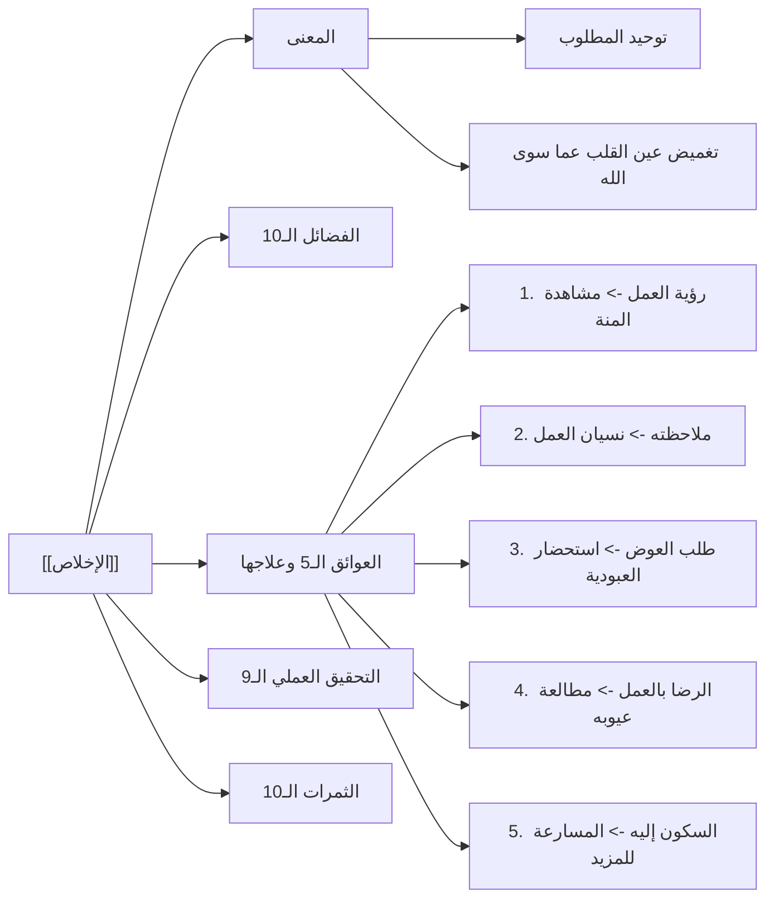

# 07 - ملخص المراجعة السريعة: تفسير سورة البينة وحقيقة الإخلاص

> [!abstract] الغرض من هذا الملف
> لوحة مكثفة وجداول جامعة تلخص المحاضرة التفسيرية والتربوية لـ [[سورة البينة]] ومنظومة [[الإخلاص]]، مصممة للمذاكرة المركزة والمراجعة السريعة قبل الاختبارات والتطبيقات.

---

## 📑 1. جدول الآيات والتفسير الموضوعي الجامع

| الآية الكريمة | المعنى الدلالي والتفسيري المعتمد | الفائدة العقدية والتربوية |
|:---|:---|:---|
| ا {لَمْ يَكُنِ الَّذِينَ كَفَرُوا مِنْ أَهْلِ الْكِتَابِ وَالْمُشْرِكِينَ مُنْفَكِّينَ حَتَّى تَأْتِيَهُمُ الْبَيِّنَةُ} | لم يكونوا ليزولوا عن كفرهم وضلالهم حتى تأتيهم الحجة الواضحة القاطعة. | عناد أهل الضلال وعدم انفكاكهم إلا بالبينات القاطعة. |
| ا {رَسُولٌ مِنَ اللَّهِ يَتْلُو صُحُفًا مُطَهَّرَةً * فِيهَا كُتُبٌ قَيِّمَةٌ} | البينة هي: رسول من الله (محمد ﷺ) يتلو صحفاً مصونة من الشياطين تشتمل على أحكام عادلة وأخبار صادقة. | كمال الرسالة وكمال الكتاب المنزل في الهداية للحق. |
| ا {وَمَا تَفَرَّقَ الَّذِينَ أُوتُوا الْكِتَابَ إِلَّا مِنْ بَعْدِ مَا جَاءَتْهُمُ الْبَيِّنَةُ} | لم يختلف أهل الكتاب وتفرقوا أحزاباً إلا بعد وضوح الدليل ومعرفتهم بصدق النبي ﷺ. | خطورة هوى النفس والحسد؛ فالحق يجمع والهوى يفرّق. |
| ا {وَمَا أُمِرُوا إِلَّا لِيَعْبُدُوا اللَّهَ مُخْلِصِينَ لَهُ الدِّينَ حُنَفَاءَ وَيُقِيمُوا الصَّلَاةَ وَيُؤْتُوا الزَّكَاةَ وَذَلِكَ دِينُ الْقَيِّمَةِ} | ميثاق الشرائع كلها: إخلاص العبادة لله، وميل عن الشرك، وإقام الصلاة وإيتاء الزكاة. | الإخلاص أصل الدين، والصلاة والزكاة عمودا العمل الصالح. |
| ا {إِنَّ الَّذِينَ كَفَرُوا مِنْ أَهْلِ الْكِتَابِ وَالْمُشْرِكِينَ فِي نَارِ جَهَنَّمَ خَالِدِينَ فِيهَا أُولَئِكَ هُمْ شَرُّ الْبَرِيَّةِ} | مصير المكذبين المعاندين في نار جهنم مبلسون، وهم شر الخلق لمعرفتهم الحق وإنكاره. | فداحة الكفر بعد قيام الحجة ومعرفة الحق. |
| ا {إِنَّ الَّذِينَ آمَنُوا وَعَمِلُوا الصَّالِحَاتِ أُولَئِكَ هُمْ خَيْرُ الْبَرِيَّةِ * جَزَاؤُهُمْ عِنْدَ رَبِّهِمْ جَنَّاتُ عَدْنٍ...} | جزاء أهل التوحيد والعمل الصالح: جنات إقامة دائمة لا رحيل عنها. | ثمرة الإيمان الخالص والعمل المتبع للسنة. |
| ا {رَضِيَ اللَّهُ عَنْهُمْ وَرَضُوا عَنْهُ ذَلِكَ لِمَنْ خَشِيَ رَبَّهُ} | أعظم نعيم الجنة: رضوان الله الذي لا سخط بعده؛ جزاء لمن خاف الله وراقبه. | الرضا ثمرة الخشية، ورضوان الله أكبر من الجنة ونعيمها. |

---

## 💎 2. منظومة الإخلاص الكبرى (مصفوفة المقارنة السريعة)

### أ. فضائل الإخلاص العشر
1. مسك القلب ينقيه من الغل والخيانة.
2. وصية الله لجميع المرسلين وأممهم.
3. أصل الدين وقاعدته وجوهره.
4. تنصر الأمة بإخلاص رجالها وضعفائها.
5. امتلاء قلب المخلص برضا الله.
6. وصية الله بملازمة أهله في المجالس.
7. أحد شرطي قبول العمل (مع المتابعة).
8. سبب لتفريج الكربات وإجابة الدعوات (الثلاثة في الغار).
9. سبب للنجاة من الفتن والشهوات (يوسف عليه السلام).
10. قاهر الشيطان وقاطع سبيله عن العبد.

### ب. آفات العمل الخمس وعلاجها
| الآفة / العائق | حقيقته ومظهره | العلاج والدواء الإيماني |
|:---|:---|:---|
| **1. رؤية العمل** | أن يستعظم طاعته ويرى أنه عمل | **مشاهدة منّة الله وتوفيقه** وأنه لولاه ما تيسر له عمل. |
| **2. ملاحظة العمل** | استذكار العمل وترديده في النفس | **محو الالتفات إليه** وتذكر أنه فضل من الله أُجري على يديه. |
| **3. طلب العوض عليه** | اشتراط المقابل والانتظار العاجل | **استحضار العبودية**؛ فالعبد مملوك لله وأعماله مستحقة عليه. |
| **4. الرضا بالعمل** | الاطمئنان إلى جودته وكماله | **مطالعة عيوب العمل والتقصير** في توفية عظمة حق الله. |
| **5. السكون إليه** | الاكتفاء به والقعود عن المسارعة | **المسارعة والوجل**؛ {والذين يؤتون ما آتوا وقلوبهم وجلة}. |

### ج. التساعية العملية لتحقيق الإخلاص
1. تحرير النية باحتسابها عند كل حركة وسكون.
2. التفقه في الإخلاص والرياء وإدراك خطورتهما.
3. المبالغة في إخفاء الأعمال وجعل خبيئة صالحة.
4. ملازمة صحبة الصادقين المخلصين.
5. دوام اتهام النفس وعدم تزكيتها.
6. إحياء واعظ الله في القلب بالقرآن والذكر.
7. مخالفة هوى النفس وحب المحمدة.
8. الخوف من مقت الله وحديث الثلاثة أول من تسعر بهم النار.
9. اللهج الدائم بالدعاء: «اللهم اجعل عملي كله صالحاً ولوجهك خالصاً».

### د. ثمرات الإخلاص العشر
1. **النصر والكفاية** في مواجهة الشدائد.
2. **تفريج الكربات** والنجاة من المضائق.
3. **حب أهل السماء والقبول في الأرض**.
4. **سكينة القلب وطمأنينته**.
5. **الحياة الطيبة** في الدنيا.
6. **الدوام والاستمرارية** في الطاعة وبركة المزيد.
7. **التوفيق لمصاحبة الطيبين والمخلصين**.
8. **استجابة الدعوات**.
9. **حسن الخاتمة** وثبات التوحيد عند الموت.
10. **الأمن والتنعم في القبر**.

---

## ⚖️ 3. القواعد العقدية والتربوية المستنبطة

- ا قاعدة الجزاء من جنس العمل: يعامل الله عبده بمثل ما يعامل به العبد ربه وخلقه (من رضي فله الرضا، ومن عفا عفا الله عنه، ومن رحم رحمه الله).
- ا قاعدة إحباط العجب: العجب بعد العمل من الكبائر الباطنة ويهدم ثواب الطاعة وأثرها، وعلاجه المباشر: «هذا فضل ربي».
- ا قاعدة الرضوان: {ورضوان من الله أكبر}؛ رضا الله عن أهل الجنة أعظم وأجل من نعيم الجنة بأسرها.
- ا أدب التواضع العلمي: قراءة الكبير على الصغير والعالم على المتعلم اقتداءً بقراءة النبي ﷺ على أبي بن كعب رضي الله عنه.

---

## 📊 الملاحة
- **الملف السابق:** [[06 - أسئلة الحضور ومسائل ختامية في العجب والرياء ومعاملة الله]]
- **الملف التالي:** [[08 - أسئلة المراجعة والاختبار الذاتي]]
- **الفهرس العام:** [[00 - الفهرس والخطة]]
